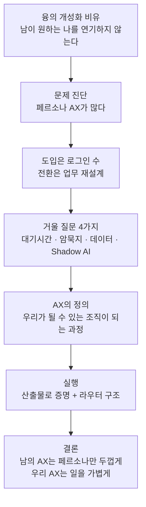
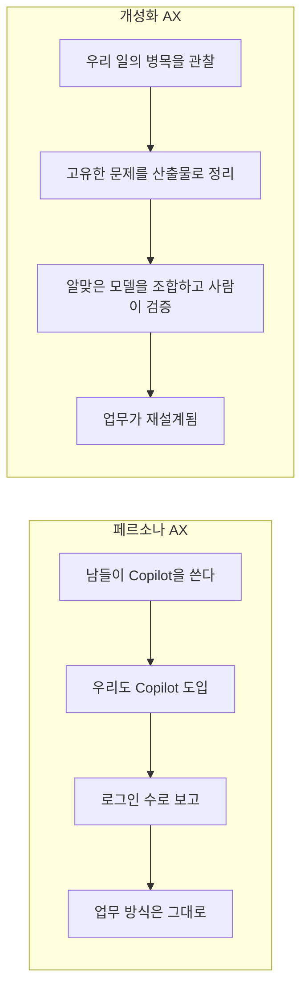
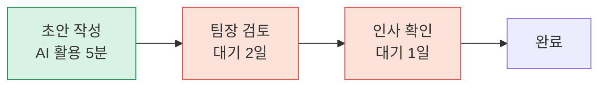
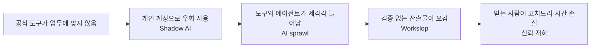
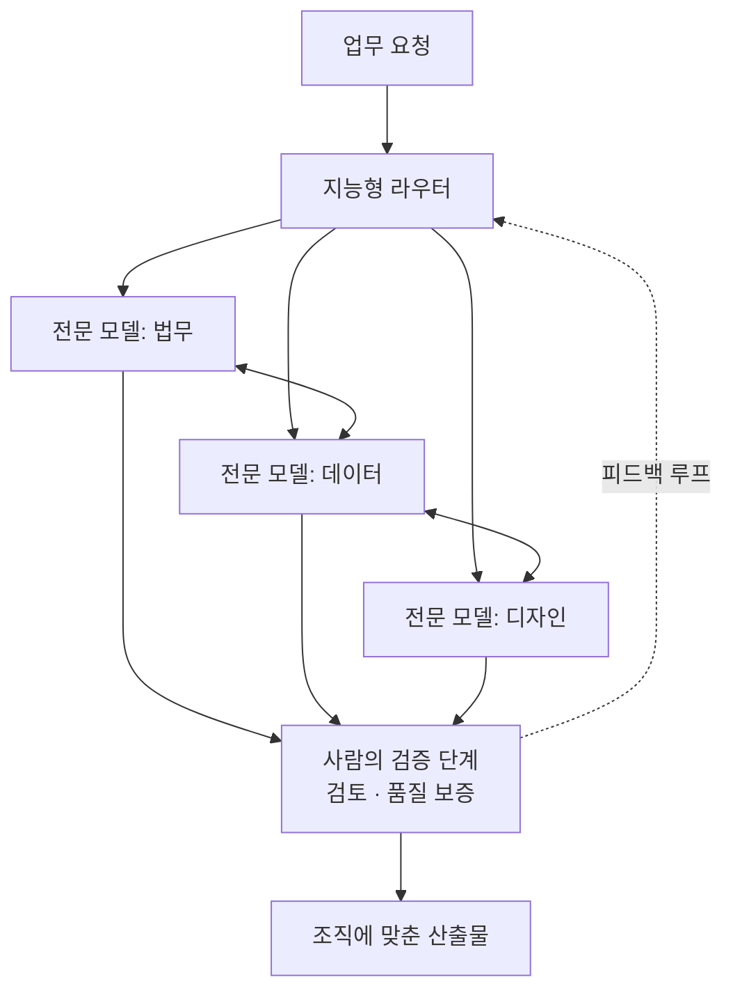
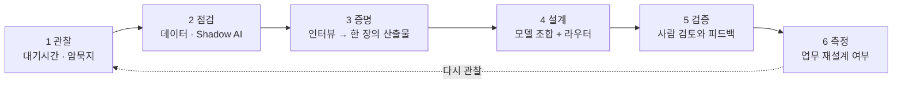

**한 줄 요약: AI 전환(AX)을 "남들이 하니까 우리도 한다"는 방식으로 하면 도입 숫자는 올라가도 일하는 방식은 바뀌지 않는다. 대기시간, 암묵지, 데이터 상태, 그림자 AI(Shadow AI)를 먼저 들여다보고, 우리 업무에 맞는 모델과 기능을 조합하는 방식으로 가야 한다는 주장이다.**

> 
> 남들이 한다는 AX 말고, 우리 조직에 맞는 AX하기.
> 
> 어제 마켓뉴런이 올린 융의 창의성 글을 봤다. 
> 진짜 창의성은 남이 원하는 나를 연기하는 게 아니라, 내 안에 있는 걸 밖으로 꺼내는 과정이라는 거. 융의 말로 개성화.
> 
> 조직의 AX도 똑같다.
> 
> 지금 많은 AX가 페르소나 AX다.
> 남들이 Copilot 하니까 우리도 Copilot.
> 남들이 챗봇 만드니까 우리도 챗봇.
> 남들이 회의록 요약하니까 우리도 요약.
> 
> 도입은 로그인 수로 측정된다. 그래서 보고하기는 쉽다. 하지만 전환은 그렇게 안 된다.
> 
> 도입은 로그인으로 측정되지만, 전환은 업무가 재설계됐는가로 측정된다.
> 
> 우리 조직에 맞는 AX는 거울 속을 보는 일부터 시작한다.
> 
> 1. 대기시간은 어디서 생기나? 초안은 5분 만에 나오는데 팀장 검토 2일, 인사 확인 1일이면 일정은 그대로다. 처리시간이 아니라 대기시간을 측정해야 한다.
> 2. 퇴사하면 무엇이 사라지나? 문서가 아니라 판단 기준, 예외 처리 노하우 같은 암묵지다. 그게 진짜 ROI다.
> 3. 우리 데이터는 AI-readable한가? 국내 80%는 시스템 간 부분 연결이다. 모델 성능이 병목이 아니라 데이터가 읽히지 않는 게 병목이다.
> 4. Shadow AI는 얼마나 되나? 57%는 회사에 알리지 않고 개인 계정으로 일한다. 이게 AI sprawl, Workslop으로 터진다.
> 그래서 나는 AX를 이렇게 정의한다.
> 
> AX = 남들이 원하는 조직이 되는 게 아니라, 우리가 될 수 있는 조직이 되는 과정.
> 
> 말에서 산출물로 증명하는 방식이다. 17명 인터뷰로 뽑아낸 우리만의 반복업무·이중부담·사일로를 한 장의 산출물로 만드는 게 먼저다.
> 
> 라우터가 본질이다. 좋은 모델 하나 자랑하는 게 아니라, 우리 일에 fit한 모델을 얼마나 빨리 갈아끼우느냐, 있는 기능끼리 어떻게 조합하느냐가 경쟁력이다.
> 
> 남의 AX를 따라하면 페르소나만 두꺼워진다.
> 우리 AX를 하면 일이 가벼워진다.
> 
> https://www.threads.com/share/BAA5xQFvYJ/
> 

---

## 1. 이 글은 어떤 글인가

이 글은 Threads에 올라온 짧은 칼럼 형식의 게시물이며, 조직의 AI 전환(AX, AI Transformation)을 다루고 있다. 핵심 주장은 한 문장으로 모인다. 지금 많은 조직이 하고 있는 AX는 다른 회사가 하는 것을 따라 하는 "페르소나 AX"이고, 그 대신 조직이 원래 가진 고유한 업무 구조를 들여다보고 거기에 맞춰 설계하는 "개성화 AX"를 해야 한다는 것이다.

글은 다섯 덩어리로 구성되어 있다.

1. 비유의 출발점: 심리학자 융이 말한 개성화(individuation)를 창의성과 연결한 글에서 영감을 얻었다.
2. 문제 진단: 도입은 로그인 수로 측정되지만 전환은 업무가 재설계되었는지로 측정된다.
3. 거울 질문 네 가지: 대기시간, 암묵지, 데이터 상태, Shadow AI.
4. 정의: AX란 남들이 원하는 조직이 되는 일이 아니라 우리가 될 수 있는 조직이 되는 과정이다.
5. 실행 방식: 인터뷰로 뽑아낸 조직의 고유한 문제를 한 장의 산출물로 만들고, 모델을 고정하지 않고 갈아 끼울 수 있는 라우터 구조를 만든다.

글과 함께 놓인 좌우 비교 도식은 이 주장을 시각적으로 압축한다. 이 문서는 그 도식과 본문을 함께 풀어 설명하고, 본문에 나오는 수치와 개념이 실제 자료와 얼마나 맞는지도 확인해서 정리한다.

---

## 2. 비교 도식 읽는 법

함께 제시된 도식은 화면을 둘로 나눈 구조다. 왼쪽은 "Persona AX", 오른쪽은 "Individuation AX"다.

### 왼쪽: 페르소나 AX

왼쪽 면에는 똑같이 생긴 건물이 빽빽하게 늘어서 있고, 그 사이를 "chatbot", "Copilot", "Company A", "Company B" 같은 말풍선이 가득 채운다. 건물이 모두 같은 모양이라는 점이 핵심이다. 회사는 다르지만 도입한 도구가 같고, 쓰는 방식도 같으며, 결과적으로 차별점이 없다는 뜻이다. 하단에는 "Same tools · No differentiation · Redundant & crowded · One-size-fits-all"이라는 설명이 붙어 있고, 맨 아래 태그는 "Reactive · Crowded · Copycat", 즉 반응적이고 붐비며 따라 하는 방식이라고 요약한다.

### 오른쪽: 개성화 AX

오른쪽 면은 훨씬 단순하다. 중앙에 "Intelligent Router"가 있고, 그 주변에 법무(Legal), 데이터(Data), 디자인(Design) 영역의 전문 모델이 각각 연결되어 있다. 이 전문 모델들은 서로 화살표로 이어져 있어, 한 모델이 처리한 결과가 다른 모델로 넘어갈 수 있음을 보여 준다. 그 아래에는 "Human Validation Step"이 있고, 사람의 검토, 품질 보증, 피드백 루프가 들어간다. 최종 결과물은 "Tailored Output · Customized Solution", 즉 조직에 맞춰진 산출물이다. 맨 아래 태그는 "Proactive · Tailored · Custom & Validated", 능동적이고 맞춤형이며 검증된 방식이라고 정리한다.

### 두 면의 차이를 한 표로

| 구분 | 페르소나 AX | 개성화 AX |
|---|---|---|
| 출발점 | 남들이 무엇을 도입했는가 | 우리 일이 어디서 막히는가 |
| 도구 선택 | 유행하는 범용 도구 | 업무에 맞는 모델과 기능의 조합 |
| 구조 | 도구가 부서마다 흩어져 있음 | 라우터가 일을 알맞은 모델로 보냄 |
| 사람의 역할 | 사용자 | 검증자이자 피드백 제공자 |
| 성과 측정 | 로그인 수, 사용 건수 | 업무가 실제로 재설계되었는가 |
| 결과 | 비슷비슷한 조직 | 그 조직에 맞는 고유한 흐름 |

---

## 3. 출발점: 융의 개성화와 페르소나

글은 융(Carl Gustav Jung)의 개념을 빌려 시작한다. 글쓴이가 언급한 마켓뉴런의 게시물 자체는 검색으로 직접 확인하지 못했으므로, 여기서는 글이 요약해 둔 내용(진짜 창의성은 남이 원하는 나를 연기하는 일이 아니라 내 안에 있는 것을 밖으로 꺼내는 과정이라는 내용)만 그대로 전달한다. 다만 융의 개념 자체는 확인할 수 있다.

융 심리학에서 **페르소나**는 원래 그리스 고대극에서 배우가 쓰던 가면을 가리키는 말에서 왔다. 심리학에서는 사람이 사회적 상황에 적응하려고 바깥에 내보이는 성격의 한 면, 곧 상황마다 쓰는 가면을 뜻한다. 페르소나는 나쁜 것이 아니다. 사회 속에서 역할을 하고 다른 사람과 관계를 맺으려면 필요한 장치다. 문제는 페르소나를 자기 자신과 동일시할 때 생긴다.

**개성화**(individuation)는 융이 말한 자기실현의 과정이다. 의식과 무의식 어느 쪽도 부정하지 않고 둘 다 정당하게 다루면서, 자기 자신이 되어 가는 평생의 과정을 말한다. 한국어로는 개체화, 개별화, 자기실현이라고도 옮긴다.

글쓴이는 이 구도를 조직에 옮겨 놓는다. 개인이 "남이 원하는 나"라는 가면을 쓰고 살 수 있듯이, 조직도 "남들이 하는 AX를 하는 조직"이라는 가면을 쓸 수 있다. 그리고 개성화가 가면 아래에 있는 자기 자신을 꺼내는 과정이듯, 조직의 AX도 그 조직이 원래 가진 일의 구조를 드러내는 데서 시작해야 한다는 비유다.

이 비유는 설명을 위한 장치이지 융 이론을 조직 이론으로 증명하려는 시도가 아니다. 읽을 때는 "남을 따라 하는 것과 자기 구조에서 출발하는 것의 차이"를 알기 쉽게 말해 주는 은유로 받아들이면 된다.

---

## 4. 페르소나 AX란 무엇인가

글은 세 가지 예를 든다.

- 남들이 Copilot을 쓰니까 우리도 Copilot을 도입한다.
- 남들이 챗봇을 만드니까 우리도 챗봇을 만든다.
- 남들이 회의록을 요약하니까 우리도 요약을 한다.

세 사례의 공통점은 "무엇을 도입할지의 이유가 외부에 있다"는 것이다. 이 도구들이 나쁘다는 이야기가 아니다. 선택의 기준이 자기 조직의 병목이 아니라 다른 조직의 선택이라는 점이 문제다. 그렇게 되면 어느 회사나 같은 도구를 같은 방식으로 쓰게 되고, 도식 왼쪽의 똑같은 건물들처럼 서로 구별되지 않는다.

### 도입과 전환은 다르다

글에서 가장 중요한 문장은 이것이다. 도입은 로그인으로 측정되고, 전환은 업무가 재설계되었는지로 측정된다.

도입 지표는 로그인 수, 설치 수, 사용 횟수처럼 시스템이 자동으로 세어 주는 숫자라서 보고하기 쉽다. 반면 전환은 "예전에는 이 일을 이렇게 했는데 지금은 순서와 책임과 검토 방식이 이렇게 바뀌었다"는 변화이므로 숫자 하나로 요약하기 어렵다. 그래서 조직은 쉬운 지표로 기울기 쉽고, 그 결과 도입률은 높은데 일하는 방식은 그대로인 상태가 만들어진다.

---

## 5. 거울 질문 네 가지

글은 우리 조직에 맞는 AX가 "거울 속을 보는 일"에서 시작한다고 말하며 네 가지 질문을 던진다. 각 질문이 무엇을 말하는지, 그리고 그 근거가 실제 자료와 어떻게 맞는지 차례로 본다.

### 5-1. 대기시간은 어디서 생기는가

글의 예시는 이렇다. 초안은 AI로 5분 만에 나오는데, 팀장 검토에 이틀, 인사 확인에 하루가 걸린다면 전체 일정은 사실상 달라지지 않는다. 그러니 AI가 줄여 준 처리시간이 아니라, 일이 누군가의 손을 기다리며 멈춰 있는 대기시간을 측정해야 한다는 것이다.

이 시간 수치는 글쓴이가 이해를 돕기 위해 든 가상의 예시이며, 통계가 아니다. 그러나 논리 자체는 업무 흐름 분석의 오래된 관점과 같다. 전체 소요 시간(리드타임) 가운데 실제로 일을 하는 시간은 일부이고, 나머지는 기다리는 시간이라는 관점이다. 한 구간의 속도를 아무리 높여도 가장 오래 걸리는 구간이 그대로면 전체 속도는 거의 변하지 않는다.

이 그림에서 AI가 개입한 구간은 이미 충분히 빠르다. 일정을 바꾸려면 붉은 구간, 곧 검토와 확인이 왜 그렇게 오래 걸리는지를 바꿔야 한다. 검토 기준을 미리 정해 두어 확인 단계를 줄일 수 있는지, 승인 권한을 조정할 수 있는지가 질문이 된다.

### 5-2. 퇴사하면 무엇이 사라지는가

글은 사라지는 것이 문서가 아니라 판단 기준과 예외 처리 노하우 같은 암묵지라고 말하고, 이것이 진짜 ROI라고 주장한다.

암묵지는 말이나 문서로 옮기기 어려운 지식, 곧 경험으로 몸에 밴 판단을 뜻한다. 예를 들어 "이 거래처는 규정상 가능하지만 이런 경우엔 먼저 전화해 두는 편이 낫다" 같은 감각이다. 문서는 퇴사 후에도 남지만 이런 판단 기준은 사람과 함께 나간다. AX를 한다면서 이미 문서화된 업무만 자동화하면 가장 가치 있는 지식은 건드리지 못한다는 것이 글의 취지다.

여기서 "이것이 진짜 ROI"라는 부분은 글쓴이의 판단이며, 수치로 검증된 주장은 아니다. 다만 AX의 대상을 "보이는 업무"에서 "사람에게만 있는 판단"으로 넓혀야 한다는 문제 제기로 읽을 만하다.

### 5-3. 우리 데이터는 AI가 읽을 수 있는가

글은 "국내 80%는 시스템 간 부분 연결"이라고 말하고, 병목은 모델 성능이 아니라 데이터가 읽히지 않는 것이라고 주장한다.

이 수치는 실제 조사에서 나온 것으로 확인된다. 데이터 플랫폼 기업 클라우데라(Cloudera)가 2026년 4월 발표한 데이터 준비 지수(Data Readiness Index) 보고서에서 국내 응답자의 80%가 데이터가 시스템 간에 부분적으로만 연결되어 있다고 답했고, 20%는 효과적인 통합 자체에 어려움을 겪는다고 답했다. 같은 보고서에서 국내 응답자들이 AI 이니셔티브가 투자 대비 성과를 내지 못하는 주된 원인으로 꼽은 것은 데이터 품질(32%), 통합 부족(22%), 데이터 접근 및 관리 문제(20%)였다. 글로벌 수준에서도 약 80%의 기업이 환경 간 데이터 접근성 부족 때문에 AI와 데이터 이니셔티브가 제약을 받는다고 답했다.

읽을 때 주의할 점이 있다. 이 조사는 데이터 연결과 접근성을 물은 것이고, "AI-readable(AI가 읽을 수 있는 상태)"이라는 표현은 글쓴이가 요약하면서 쓴 말이다. 또 "병목이 모델 성능이 아니라 데이터"라는 문장은 위 응답자들이 데이터 관련 요인을 주된 원인으로 꼽은 결과와 방향이 맞지만, 모델 성능이 전혀 문제가 아니라고 증명한 조사는 아니다. 즉 데이터가 중요한 병목이라는 점은 근거가 있고, 모델은 문제가 아니라는 단정은 글쓴이의 강조로 보는 편이 정확하다.

### 5-4. Shadow AI는 얼마나 되는가

글은 "57%는 회사에 알리지 않고 개인 계정으로 일한다"고 쓰고, 이것이 AI sprawl과 Workslop으로 터진다고 말한다. 이 부분은 수치의 출처를 나눠서 볼 필요가 있다.

**57%라는 숫자의 출처.** 2025년 KPMG와 멜버른대학교가 47개국 48,340명을 대상으로 한 신뢰 조사에서, 직원의 57%가 AI 사용 사실을 고용주에게 숨기고 AI가 만든 결과물을 자기 작업처럼 제시했다고 답했다. 즉 이 57%는 "알리지 않았다"는 쪽에 가깝고, "개인 계정을 썼다"는 내용은 아니다.

**개인 계정 사용 수치는 다른 조사에서 나온다.** 메뉴 시큐리티(Menlo Security)의 2025년 분석에 따르면 직원의 68%가 개인 계정으로 무료 AI 도구를 쓰고 있으며, 그중 57%가 민감한 데이터를 입력한다고 한다. 같은 조합이 텔러스 디지털(TELUS Digital)의 2025년 2월 설문에서도 보고되었다. 또 넷스카이프(Netskope)의 2026년 조사는 생성형 AI 사용자의 약 47%가 개인 AI 앱을 쓴다고 전한다. 그러니 "57%"와 "개인 계정"이 한 문장에 묶여 있는 것은 서로 다른 조사 결과가 섞인 표현으로 보인다.

그럼에도 큰 방향은 여러 자료에서 일관되게 확인된다. 직원들이 회사가 허가하지 않은 AI를 쓰고 있고, 상당수가 이를 숨기며, 그 상당 부분이 개인 계정을 통한다는 것이다. 글의 요점인 "공식 도구만 정비해서는 실제 사용 현황을 알 수 없다"는 주장은 이런 자료와 맞는다.

**AI sprawl(AI 난립).** 조직 안에서 AI 모델, 도구, 에이전트, 연동이 중앙의 가시성이나 거버넌스 없이 제각각 늘어나는 현상을 말한다. 보안업체 팔로알토 네트웍스의 설명에 따르면 Shadow AI는 승인된 범위 밖에서 쓰이는 도구를 가리키고, AI sprawl은 승인된 도구까지 포함해 AI 환경 전체가 파편화되는 더 넓은 현상이다. 에이전트 시대에는 도구뿐 아니라 에이전트 자체가 난립하는 문제로 번진다. 한 업계 보고서(세일즈포스 2026 연결성 벤치마크, 오크타 글에서 재인용)는 기업이 평균 12개 이상의 에이전트를 쓰며 그중 절반이 서로 고립되어 돌아간다고 전했다.

**Workslop.** 스탠퍼드 소셜미디어랩과 베터업 랩스(BetterUp Labs)가 2025년 9월 하버드 비즈니스 리뷰에서 소개한 용어다. 겉보기에는 잘 만든 것 같지만 과제를 실제로 진전시킬 내용이 없는 AI 산출물을 가리키며, 일을 받는 쪽이 해석하고 고치고 다시 해야 하므로 부담이 아래쪽으로 넘어간다는 점이 특징이다. 미국 풀타임 직장인 1,150명 조사에서 40%가 최근 한 달 사이 workslop을 받았다고 답했고, 한 건을 처리하는 데 평균 1시간 56분이 들었으며, 받은 콘텐츠의 평균 15.4%가 이에 해당한다고 추정했다. 연구진은 직원 1만 명 규모 조직이면 연간 약 900만 달러의 손실로 환산된다고 추산했다. 다만 이 조사는 응답자의 자기 보고에 의존하므로 시간과 비용 수치는 추정치라는 한계가 있다.

Shadow AI, AI sprawl, Workslop은 서로 이어진 문제다. 통제 없이 퍼진 도구(sprawl)가 숨은 사용(Shadow AI)을 낳고, 검증 없이 쏟아지는 산출물이 동료의 시간을 갉아먹는다(Workslop). 글이 "터진다"고 표현한 것이 바로 이 연쇄다.

---

## 6. AX를 어떻게 정의하는가

글쓴이는 AX를 이렇게 정의한다. AX는 남들이 원하는 조직이 되는 것이 아니라, 우리가 될 수 있는 조직이 되는 과정이다.

이 정의는 AX의 목적을 "무엇을 도입했는가"에서 "어떤 조직이 되었는가"로 옮겨 놓는다. 융의 개성화 정의와 문장 구조가 닮은 것도 의도적이다. 개성화가 남이 기대하는 나가 아니라 될 수 있는 나로 가는 과정이듯, AX도 외부의 기준이 아니라 조직 내부의 가능성에서 출발한다.

---

## 7. 말이 아니라 산출물로 증명한다

글의 실행 방식에서 특징적인 부분은 "말에서 산출물로 증명하는 방식"이다. 글쓴이는 17명을 인터뷰해 그 조직만의 반복업무, 이중부담, 사일로를 뽑아내고, 이를 한 장의 산출물로 만드는 일을 먼저 하라고 말한다.

17명이라는 수는 글쓴이가 진행한 사례의 규모이며 일반적인 기준이 아니다. 중요한 것은 방식이다. 회의에서 "우리는 비효율이 많다"라고 말하는 데 그치지 않고, 반복되는 업무가 무엇인지, 같은 일을 두 번 하게 만드는 이중부담이 어디인지, 부서 사이에 정보가 막히는 사일로가 어디인지를 한 장의 문서로 눈에 보이게 만든다. 그러면 논의가 "AI를 도입하자"는 추상에서 "이 구간을 바꾸자"는 구체로 내려온다.

- **반복업무**: 같은 형태로 계속 되풀이되는 일. 자동화나 보조의 후보가 된다.
- **이중부담**: 같은 정보를 두 번 입력하거나 두 곳에 보고하는 식의 중복 노력.
- **사일로**: 부서나 시스템 사이에서 정보가 막혀 흐르지 않는 구조.

---

## 8. 라우터가 본질이다

글은 마지막 실행 원칙으로 라우터를 든다. 좋은 모델 하나를 자랑하는 것이 아니라, 우리 일에 맞는 모델을 얼마나 빨리 갈아 끼우고, 이미 있는 기능끼리 어떻게 조합하느냐가 경쟁력이라는 것이다. 도식 오른쪽의 "Intelligent Router"가 바로 이 개념을 그린 것이다.

### 라우터란

LLM 라우터는 들어온 요청을 보고 어떤 모델이 처리할지 결정하는 계층이다. 간단한 요청은 저렴한 모델로, 어려운 요청은 강력한 모델로 보내는 식이다. 대표적인 연구인 RouteLLM(LMSYS)은 요청의 난이도에 따라 강한 모델과 약한 모델 중 하나로 보내서, 일부 벤치마크에서 비용을 크게 줄이면서도 품질을 대부분 유지했다고 보고했다. 해당 연구의 대표 수치는 MT-Bench에서 비용 최대 85% 절감, 강한 모델 품질의 95% 유지이며, MMLU에서는 절감폭이 약 45%였다. 이 수치는 특정 벤치마크와 당시 모델 조합에서 나온 것이어서 어느 조직에서나 같은 효과가 난다고 볼 수는 없다.

### 글이 말하는 라우터와의 차이

여기서 구분이 필요하다. RouteLLM 같은 학습형 라우터는 주로 비용 대비 품질을 최적화하려고 강한 모델과 약한 모델 사이에서 고른다. 반면 글과 도식이 말하는 라우터는 법무, 데이터, 디자인처럼 업무 영역에 맞는 전문 모델이나 기능으로 일을 나눠 보내고, 마지막에 사람이 검증하는 구조다. 둘 다 "요청을 알맞은 곳으로 보낸다"는 점은 같지만, 글이 강조하는 것은 비용 절감보다 업무 적합성과 교체 가능성이다. 글의 표현대로 모델이 계속 바뀌는 환경에서는 특정 모델에 업무를 묶어 두지 않고 갈아 끼울 수 있게 해 두는 것이 중요하다는 취지다. 참고로 RouteLLM 연구에서도, 한 모델 쌍으로 학습한 라우터가 모델을 바꿔도 성능을 유지했다는 점이 확인되어, 모델 교체에 강한 구조가 가능하다는 방향은 뒷받침된다.

### 사람의 검증 단계가 들어가는 이유

도식에서 사람의 검증 단계는 장식이 아니다. 앞에서 본 Workslop은 검증 없이 산출물이 오갈 때 생기는 비용이다. 라우터가 일을 알맞은 모델에 보내더라도 결과를 사람이 확인하고, 그 확인 결과가 다시 라우터에 반영되는 피드백 루프가 있어야 "그럴듯하지만 알맹이 없는 산출물"이 조직 안을 돌아다니는 것을 막을 수 있다.

---

## 9. 결론 문장 읽기

글은 이렇게 끝난다. 남의 AX를 따라 하면 페르소나만 두꺼워지고, 우리 AX를 하면 일이 가벼워진다.

앞의 "페르소나가 두꺼워진다"는 표현은 조직이 겉모습(도입했다는 사실, 도구 목록)만 쌓고 속(일하는 방식)은 그대로라는 뜻으로 읽힌다. 뒤의 "일이 가벼워진다"는 대기가 줄고, 같은 일을 두 번 하지 않으며, 검증되지 않은 산출물을 고치는 부담이 줄어드는 상태를 가리킨다. 정리하면 이 글은 "더 많이 도입하라"가 아니라 "먼저 우리 일을 보고, 맞는 것만 들여오라"는 주장이다.

---

## 10. 수치와 개념 확인 결과

| 글의 내용 | 확인 결과 |
|---|---|
| 융의 개성화와 페르소나 | 융 심리학의 기본 개념으로 확인됨. 페르소나는 사회에 내보이는 가면, 개성화는 자기 자신이 되어 가는 과정 |
| 마켓뉴런의 융 창의성 게시물 | 해당 게시물은 검색으로 확인하지 못함. 글이 요약한 내용을 전달함 |
| 국내 80%가 시스템 간 부분 연결 | 클라우데라 데이터 준비 지수(2026년 4월)에서 확인됨. 국내 응답자의 80%가 부분 연결, 20%는 통합에 어려움 |
| 병목은 모델이 아니라 데이터 | 국내 응답자가 ROI 실패 원인으로 데이터 품질, 통합, 접근·관리를 꼽은 결과와 방향이 일치. "모델은 문제가 아니다"까지는 조사가 말하지 않음 |
| 57%는 알리지 않고 개인 계정으로 일한다 | 57%는 KPMG·멜버른대 조사에서 AI 사용을 숨긴 비율. 개인 계정 사용은 별도 조사(메뉴 시큐리티 68%, 넷스카이프 47% 등)의 수치. 두 내용이 한 문장에 섞여 있음 |
| Workslop | 스탠퍼드·베터업의 HBR 2025년 9월 글에서 나온 용어. 응답자 40%가 최근 한 달 내 수신 경험, 건당 평균 1시간 56분 |
| AI sprawl | 조직 내 AI 모델·도구·에이전트가 거버넌스 없이 늘어나는 현상을 가리키는 업계 용어로 확인됨 |
| 대기시간 예시(검토 2일, 확인 1일) | 글쓴이의 가상 예시이며 통계가 아님 |
| 17명 인터뷰 | 글쓴이의 사례 규모이며 일반 기준이 아님 |
| 라우터와 모델 교체 | LLM 라우팅은 실제 연구와 상용 서비스가 있는 기술. 다만 대표 연구는 비용·품질 최적화 중심이며, 글의 "업무 적합 모델 조합"은 이를 확장한 설계 관점 |

---

## 11. 조직에서 적용한다면: 순서로 정리

아래는 글의 논리를 실행 순서로 풀어 쓴 정리다. 글에 명시된 단계 구분이 아니라, 본문의 내용을 이해하기 쉽게 배열한 것이다.

1. **관찰**: 업무가 어디서 멈추는지(대기시간), 어떤 판단이 사람에게만 있는지(암묵지)를 본다.
2. **점검**: 데이터가 시스템 사이에서 어느 정도 연결되어 있는지, 구성원이 공식 도구 밖에서 AI를 얼마나 쓰는지를 확인한다.
3. **증명**: 인터뷰로 반복업무, 이중부담, 사일로를 뽑아 한 장의 산출물로 만든다.
4. **설계**: 업무에 맞는 모델과 기능을 조합하고, 라우터로 교체 가능하게 연결한다.
5. **검증**: 사람이 결과를 확인하고 그 결과를 구조에 되돌려 준다.
6. **측정**: 로그인 수가 아니라 업무가 재설계되었는지, 대기가 줄었는지로 판단한다.

---

## 12. 참고한 자료

- 클라우데라 데이터 준비 지수 보고서(2026년 4월 14일 발표) 및 국내 보도(인공지능신문)
- 세일즈포스 한국 기업 데이터 및 분석 현황 조사(국내 500개 기업 포함) 관련 보도
- KPMG·멜버른대학교 AI 신뢰 글로벌 연구(2025, 47개국 48,340명)
- 메뉴 시큐리티(Menlo Security) 2025년 보고서 및 텔러스 디지털(TELUS Digital) 2025년 2월 설문
- 넷스카이프(Netskope) 2026년 조사 관련 정리 자료
- 베터업 랩스·스탠퍼드 소셜미디어랩, 하버드 비즈니스 리뷰 2025년 9월 "AI-Generated Workslop Is Destroying Productivity"
- 팔로알토 네트웍스의 AI tool sprawl 설명 및 오크타(Okta)의 agent sprawl 설명
- RouteLLM(LMSYS) 공개 저장소 및 관련 2026년 라우팅 정리 자료
- 위키백과 및 나무위키의 융, 페르소나, 분석심리학 항목

---

작성일: 2026년 10월 4일
