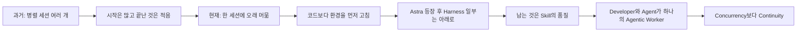
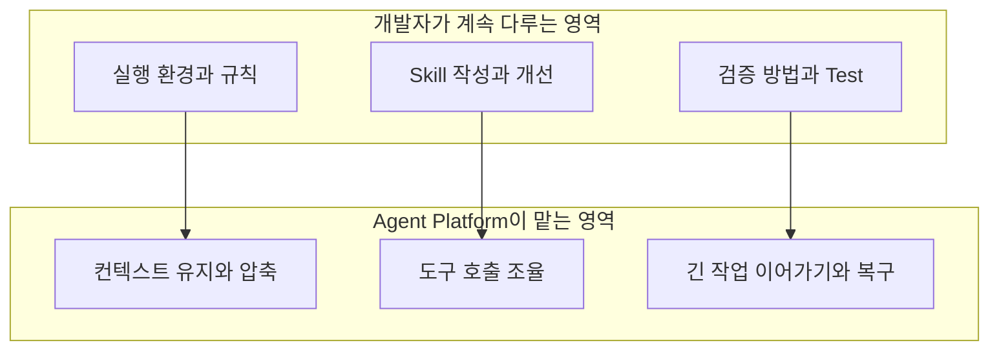
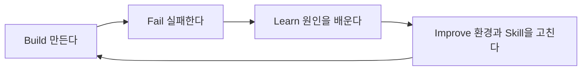
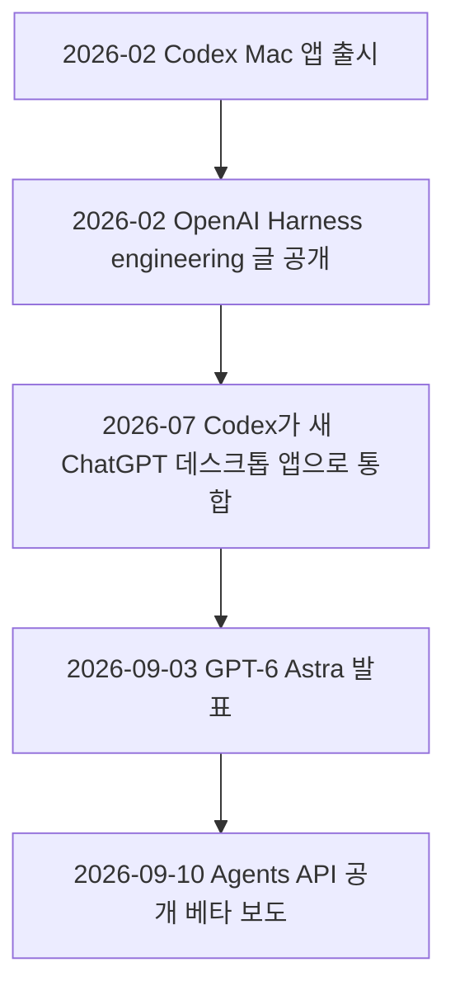
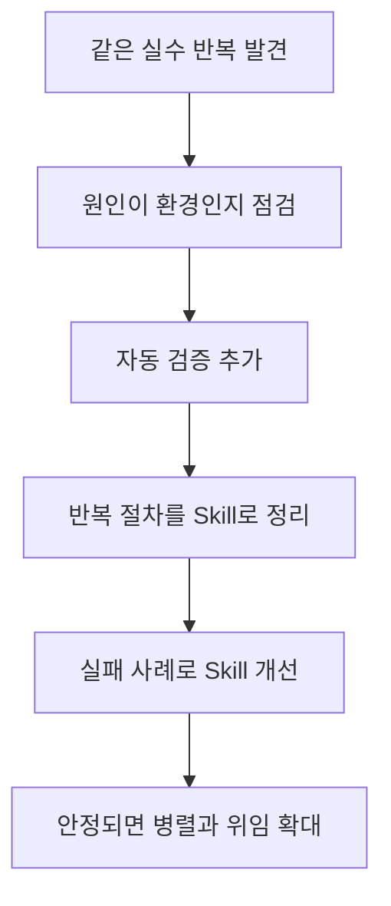

- 작성일: 2026-10-04
- 대상: 일요일 에스프레소를 내리며 쓴 「단상」(Codex, Astra, Harness, Skill에 관한 개인 에세이)
- 확인 범위: 글 본문은 전달받은 텍스트를 기준으로 했습니다. 함께 전달된 Facebook 링크는 사이트가 자동 접근을 막고 있어 열람하지 못했습니다. 따라서 게시글의 작성자, 게시 시각, 댓글 등은 확인하지 못했고, 이 문서에서도 다루지 않습니다.
- 사실 확인 방식: 글 속에 등장하는 기술 용어와 사건(Codex, Astra, Harness, Skill)은 2026년 10월 4일 기준으로 웹에서 다시 검색해 확인했습니다. 각 사실에는 근거의 성격(공식 문서, 언론 보도, 2차 정리글)을 구분해 적었고, 확인하지 못한 부분은 확인하지 못했다고 명시했습니다.


```
단상

어느 일요일.

집에서 에스프레소 한 잔을 내리다가 문득 이런 생각이 들었다.

요즘 나는 Codex 세션을 여러 개 열지 않는다.

예전에는 일을 잘게 나누고,
여러 세션을 동시에 돌렸다.

Frontend 하나.
API 하나.
Refactoring 하나.
Test 하나.

화면에는 뭔가 엄청난 일이 벌어지는 것 같았다.

문제는 프로젝트도 같이 늘어났다는 것이다.

시작한 것은 많은데
이상하게 끝난 것은 별로 없었다.

요즘은 조금 다르게 일한다.

하나의 세션에서 꽤 오래 머문다.

그리고 코드를 만드는 것보다 먼저

환경을 고치고,
검증 방법을 추가하고,
Agent가 반복해서 틀리는 부분을 찾아내고,
필요한 Skill을 만들고,
기존 Skill을 다시 다듬는다.

그러다 보니 재미있는 변화가 생겼다.

Agent의 성능을 높이려고
매번 더 자세한 Prompt를 쓰는 것이 아니라,

Agent가 일을 잘할 수 있는 환경 자체를 개선하게 된다.

Astra가 등장했다고 Harness가 사라진 것은 아니다.

오히려 내가 직접 관리해야 했던
Harness의 상당 부분이 더 아래로 내려간 느낌에 가깝다.

Context를 어떻게 유지할지,
Tool을 어떻게 사용할지,
긴 작업을 어떻게 이어갈지 같은 것은
점점 Agent Platform의 몫이 된다.

하지만 Skill은 남는다.

그리고 더 중요해진 것은
Skill의 개수가 아니라 품질이다.

좋은 Skill 하나,
명확한 환경 하나,
확실한 Test 하나가

세션 열 개보다 나을 때가 많다.

요즘 내가 CLI에서 Agent와 같이 일하는 방식은
UI나 API를 하나 더 만드는 느낌과는 조금 다르다.

Developer + Agent가 하나의 Agentic Worker가 되어

일을 하면서
자신이 일하는 환경까지 계속 개선한다.

Build → Fail → Learn → Improve → Build.

그래서 요즘은
Concurrency보다 Continuity에 조금 더 마음이 간다.

여러 Agent를 얼마나 많이 띄웠는가보다

어제보다 오늘,
이 환경에서 Agent가 조금 더 잘 일하게 되었는가.

아마 Agentic Engineering의 생산성은
모델에게 일을 얼마나 많이 시키느냐보다

함께 일할 수 있는 환경을 얼마나 잘 길들이느냐에서 나오는지도 모르겠다.

에스프레소 한 잔을 다 마실 때쯤 이런 생각이 들었다.

나는 요즘 코드를 만드는 것보다

AI 개발자의 작업장을 만들고 있는 것 같다.

https://www.facebook.com/share/19jj1vu9q9/
```

---

## 1. 한눈에 보는 요약

이 글은 한 개발자가 AI 코딩 에이전트와 일하는 방식을 바꾼 경험을 담담하게 적은 에세이입니다. 과거에는 Frontend, API, Refactoring, Test처럼 일을 잘게 나누어 에이전트 세션 여러 개를 동시에 돌렸습니다. 화면은 분주했지만 프로젝트만 늘어났고 끝나는 것은 드물었습니다. 지금은 하나의 세션에 오래 머물면서, 코드를 만들기 전에 환경을 고치고, 검증 방법을 추가하고, 에이전트가 반복해서 틀리는 지점을 찾아 Skill로 만들거나 다듬습니다.

글의 중심 주장은 세 가지로 정리됩니다.

첫째, 에이전트의 성능을 올리는 방법은 더 긴 프롬프트가 아니라 에이전트가 일을 잘할 수 있는 환경을 개선하는 것입니다. 둘째, 새 모델(Astra)이 나왔다고 Harness가 사라지는 것이 아니라, 개발자가 직접 관리하던 Harness의 상당 부분이 에이전트 플랫폼 쪽으로 내려갔고, 그 위에서 개발자가 다룰 것은 Skill의 품질입니다. 셋째, 생산성은 동시에 몇 개의 에이전트를 띄웠는지(Concurrency)가 아니라, 같은 환경에서 에이전트가 어제보다 오늘 더 잘 일하게 되었는지(Continuity)에서 나옵니다.

마지막 문장은 글 전체를 압축합니다. 글쓴이는 요즘 코드를 만드는 것보다 "AI 개발자의 작업장"을 만들고 있다고 느낍니다.

---

## 2. 글의 흐름 한눈에 보기

글은 에세이답게 이야기가 흐르지만, 구조로 풀어 보면 "과거의 방식과 그 문제 → 현재의 방식 → 왜 달라졌는가 → 결론"의 순서로 짜여 있습니다.



---

## 3. 단락별 상세 해설

### 3.1 도입: 일요일, 에스프레소, 그리고 문득 든 생각

글은 집에서 에스프레소를 내리다가 떠오른 생각이라는 일상적인 장면으로 시작합니다. 이 도입은 단순한 분위기 조성이 아니라 글의 성격을 알려 줍니다. 이 글은 기술 문서나 벤치마크 분석이 아니라 글쓴이 개인의 작업 경험에서 나온 소회, 곧 "단상"입니다. 그래서 글 속의 판단은 모두 글쓴이의 체감이며, 측정된 데이터로 뒷받침된 주장은 아닙니다. 이 점은 뒤의 검증 단계에서 다시 짚겠습니다.

첫 문장 "요즘 나는 Codex 세션을 여러 개 열지 않는다"가 글 전체의 선언문 역할을 합니다. 여기서 Codex는 OpenAI의 코딩 에이전트 제품군을 가리킵니다. 터미널(CLI), IDE 확장, 데스크톱 앱에서 쓸 수 있다는 점은 OpenAI의 Codex 문서에서 확인됩니다.

### 3.2 과거의 방식: 일을 잘게 나누어 세션을 동시에 돌리다

글쓴이는 예전에 일을 잘게 나누어 여러 세션을 동시에 돌렸다고 회상합니다. Frontend 하나, API 하나, Refactoring 하나, Test 하나. 이렇게 역할별로 세션을 하나씩 배정하는 방식입니다.

이런 작업 방식은 도구가 뒷받침해 온 흐름이기도 합니다. 9to5Mac은 OpenAI가 2026년 2월에 Codex 전용 Mac 앱을 내놓았고, 이 앱이 여러 코딩 에이전트를 실행하고 변경 사항을 검토하고 작업을 예약하는 허브로 소개되었다고 정리합니다. 즉, 여러 에이전트를 나란히 돌리는 방식은 제품이 일부러 지원해 온 사용 방식입니다. 글쓴이가 그 방식을 시도해 본 것은 자연스러운 일입니다.

"화면에는 뭔가 엄청난 일이 벌어지는 것 같았다"는 문장에 이 글의 비판 지점이 있습니다. 여러 세션이 동시에 움직이는 모습은 생산적으로 보이지만, 겉모습이 곧 결과는 아닙니다. 글쓴이는 이 차이를 다음 문장으로 정리합니다. 시작한 것은 많은데 끝난 것은 별로 없었다는 것입니다. 병렬로 일을 벌이면 시작 비용은 낮아지지만, 각 갈래의 마무리와 통합, 검증은 결국 사람의 주의력을 요구합니다. 그 주의력은 한정되어 있으므로, 시작이 늘어날수록 끝나는 비율이 떨어질 수 있다는 것이 글쓴이의 경험입니다. 다만 이것은 글쓴이 본인의 작업에서 나온 경험담이며, 병렬 실행 일반이 비효율적이라는 일반 법칙으로 읽으면 안 됩니다.

### 3.3 현재의 방식: 한 세션에 오래 머문다

지금의 방식은 그 반대입니다. 하나의 세션에서 꽤 오래 머뭅니다. 그리고 글쓴이가 그 세션에서 가장 먼저 하는 일은 코드를 만드는 것이 아닙니다. 글은 다섯 가지 행동을 나열합니다.

1. 환경을 고친다.
2. 검증 방법을 추가한다.
3. Agent가 반복해서 틀리는 부분을 찾아낸다.
4. 필요한 Skill을 만든다.
5. 기존 Skill을 다시 다듬는다.

이 다섯 가지의 공통점은 "이번 결과물"이 아니라 "다음번에도 잘 되는 조건"을 만든다는 것입니다. 오늘 코드 한 조각을 얻는 일과, 에이전트가 같은 실수를 되풀이하지 않게 만드는 일은 다릅니다. 후자는 한 번 해 두면 이후의 모든 작업에 효과가 남는 투자입니다.

여기서 "반복해서 틀리는 부분"이라는 표현에 주목할 만합니다. 한 번의 실수는 우연일 수 있지만 반복되는 실수는 환경의 결함을 가리킵니다. 지시가 모호했거나, 필요한 정보가 에이전트의 눈에 보이지 않았거나, 결과를 자동으로 확인할 수단이 없었다는 뜻일 수 있습니다. 글쓴이는 그 실수를 프롬프트로 때우지 않고 환경과 Skill로 구조적으로 해결합니다.

### 3.4 핵심 전환: 프롬프트에서 환경으로

글의 핵심 문장은 다음 대목입니다. 에이전트의 성능을 높이려고 매번 더 자세한 프롬프트를 쓰는 것이 아니라, 에이전트가 일을 잘할 수 있는 환경 자체를 개선하게 된다는 것입니다.

이 관점은 글쓴이만의 독창적인 발견이라기보다 업계에서 "Harness engineering"이라는 이름으로 정리되고 있는 흐름과 맞닿아 있습니다. OpenAI는 2026년 초에 「Harness engineering: leveraging Codex in an agent-first world」라는 글을 공개했습니다. 이 글은 소프트웨어 엔지니어링 팀의 주된 일이 코드를 직접 쓰는 것에서 환경을 설계하고, 의도를 명세하고, 에이전트가 신뢰할 수 있게 일하도록 피드백 루프를 만드는 것으로 바뀐다고 설명합니다.

이 OpenAI 글에서 눈에 띄는 대목을 몇 가지 옮기면 글쓴이의 경험이 어떤 맥락에 놓이는지 이해하기 쉽습니다.

- 초기에 진행이 더뎠던 이유는 Codex의 능력이 부족해서가 아니라 환경이 충분히 명세되지 않아서였다고 설명합니다.
- 에이전트에게 1,000쪽짜리 지침서가 아니라 "지도"를 주라는 교훈을 early lesson으로 꼽습니다.
- 사람의 시간과 주의력이 고정된 제약이므로, 애플리케이션 UI와 로그, 지표 같은 것을 Codex가 직접 읽을 수 있게 만드는 데 힘썼다고 합니다.
- 이 실험에서는 약 1,500건의 풀 리퀘스트가 3명의 엔지니어로 구성된 작은 팀에 의해 열리고 병합되었다고 소개합니다.
- 하나의 Codex 실행이 한 작업에 여섯 시간 이상 매달리는 일이 흔하다고 말합니다.

글쓴이의 문장 "프롬프트를 더 쓰지 말고 환경을 고쳐라"는 OpenAI 글의 요지와 같은 방향입니다. 다만 두 글은 서로 다른 출처이며, 글쓴이가 이 OpenAI 글을 참고했는지는 본문에 나오지 않으므로 둘의 관계를 단정해서는 안 됩니다. 확인되는 것은 "같은 방향의 주장이 공식 자료에도 있다"는 사실까지입니다.

흥미로운 보충이 하나 있습니다. InfoQ의 요약에 따르면 이 Harness는 단순히 문서만이 아니라 아키텍처 경계와 의존성 계층을 기계적 규칙과 구조 테스트로 강제하는 것까지 포함합니다. 글쓴이가 말한 "검증 방법을 추가한다"는 행동은 바로 이 영역, 곧 사람의 판단 없이도 결과가 맞는지 확인할 수 있는 장치를 만드는 일에 해당한다고 볼 수 있습니다. 이는 두 자료를 연결한 제 해석이며, 글쓴이가 어떤 검증을 추가했는지는 글에 구체적으로 나오지 않습니다.

### 3.5 Astra의 등장과 Harness: 무엇이 아래로 내려갔나

글은 이렇게 말합니다. Astra가 등장했다고 Harness가 사라진 것은 아니다. 오히려 내가 직접 관리해야 했던 Harness의 상당 부분이 더 아래로 내려간 느낌에 가깝다. Context를 어떻게 유지할지, Tool을 어떻게 사용할지, 긴 작업을 어떻게 이어갈지 같은 것은 점점 Agent Platform의 몫이 된다.

먼저 용어를 확인하겠습니다. 글은 "Astra"가 무엇인지 풀어 쓰지 않았지만, Codex와 함께 언급된 문맥과 아래 검색 결과로 볼 때 OpenAI가 2026년 9월 3일에 발표한 GPT-6 Astra를 가리키는 것으로 판단됩니다. 이 판단은 문맥에 기댄 해석이므로 글쓴이에게 직접 확인된 사항은 아닙니다.

**GPT-6 Astra에 대해 확인되는 사실**

- OpenAI는 GPT-6 Astra를 2026년 9월 3일에 발표했습니다. 발표 당시에는 일부 조직에 먼저 제공되었고, 이후 며칠에 걸쳐 ChatGPT Plus, Pro, Business, Enterprise 사용자와 OpenAI API, AWS로 확대한다고 밝혔습니다(9to5Mac이 OpenAI 발표문을 인용해 보도).
- API 모델 이름은 `gpt-6-astra`입니다.
- Codex에서 Astra를 쓰려면 Codex CLI 버전이 0.153.0 이상이어야 한다고 Notebookcheck가 보도했습니다.
- 접근 권한은 요금제에 따라 다릅니다. OpenAI 개발자 커뮤니티의 공지와 Notebookcheck에 따르면 Plus 요금제는 일반 채팅이 아니라 ChatGPT Work와 Codex에서 Astra를 쓸 수 있고, 일반 채팅에서 Astra 기반 GPT-6 Pro는 상위 요금제에서 제공됩니다. 점진적 출시이므로 시점에 따라 달라질 수 있습니다.

**글의 주장과 직접 연결되는 변화**

글쓴이가 말한 "Context를 어떻게 유지할지"는 Astra 발표의 핵심 Codex 변화와 정확히 겹칩니다. OpenAI는 Codex가 컨텍스트 창이 가득 찼을 때 맥락을 보존하고 되살리는 새로운 방식을 도입했다고 밝혔습니다. 종래에는 긴 세션에서 모델이 작업 내용을 하나의 요약으로 압축(compaction)했는데, 압축할 때마다 "왜 어떤 수정이 실패했는지", "어떤 컴포넌트가 어떻게 동작하는지" 같은 세부가 빠질 수 있었습니다. Astra는 Codex에서 컨텍스트 창을 넘나들며 노트를 유지하고, 이전 컨텍스트 창의 내용도 검색할 수 있게 해서, 요약 한 덩어리로 반복 압축하지 않고도 축적된 세부를 보존한다고 합니다. 이 기능은 발표 시점에 실험적 기능이며 앞으로 몇 주 안에 Astra의 기본값이 될 것이라고 안내되었습니다. 현재 기본값으로 전환되었는지는 이번 조사에서 확인하지 못했습니다.

글쓴이가 말한 "긴 작업을 어떻게 이어갈지"도 같은 맥락에서 설명됩니다. OpenAI의 Agents API 문서는 관리형 Codex Harness가 세션 관리, 오케스트레이션, 컨텍스트 압축, 복구를 OpenAI가 맡고, 애플리케이션은 도구를 제공하고 실행 환경을 고르는 구조라고 설명합니다. 관리형 Harness가 지원하는 기능으로는 샌드박스에서 명령과 코드 실행, 관련 Skill과 지침 적용, 도구나 MCP를 통한 외부 데이터 연결, 작업 중 방향 조정(steering), 이전 작업 요약을 통한 컨텍스트 관리, 하위 작업을 나눠 서브에이전트에게 위임, 중단된 세션 재개가 문서에 열거되어 있습니다.

이 Agents API는 공개 베타로 출시되었고, 암호화폐 전문 매체 CryptoRank의 보도는 출시일을 2026년 9월 10일로 적고 있습니다. 출시일은 이 한 건의 2차 보도에 근거한 것이므로 정확한 날짜가 필요하면 OpenAI의 공식 공지로 다시 확인하시기 바랍니다. OpenAI의 소개 글 자체는 이 API가 Codex를 구동하는 것과 같은 Harness와 인프라를 개발자에게 제공하는 것이며, Harness는 오픈소스 Codex Harness를 기반으로 한다고 밝힙니다.

정리하면, 글쓴이가 "아래로 내려갔다"고 느낀 것은 단순한 기분이 아니라 실제 제품 구조의 변화와 부합합니다. 그러나 "내가 관리해야 했던 Harness의 상당 부분"이 정확히 무엇이고 얼마나 줄었는지는 글쓴이 개인의 작업 환경에 달린 이야기이며, 외부에서 검증할 수 없습니다.

아래 그림은 글의 이 대목을 구조로 옮긴 것입니다. 왼쪽은 플랫폼이 맡는 영역, 오른쪽은 개발자가 계속 다루는 영역입니다.



### 3.6 그래도 남는 것: Skill, 그리고 개수보다 품질

글은 "하지만 Skill은 남는다"고 말하고, 더 중요해진 것은 Skill의 개수가 아니라 품질이라고 덧붙입니다. 좋은 Skill 하나, 명확한 환경 하나, 확실한 Test 하나가 세션 열 개보다 나을 때가 많다는 것입니다.

Skill이 무엇인지부터 정확히 짚겠습니다. OpenAI의 Codex 문서에 따르면 Skill은 `SKILL.md` 파일이 들어 있는 디렉터리이고, 필요하면 스크립트와 참고 자료를 곁들일 수 있습니다. `SKILL.md`에는 `name`과 `description`이 반드시 있어야 합니다. Skill은 개방형 에이전트 스킬 표준(agentskills.io)을 따르며 Codex CLI, IDE 확장, Codex 앱에서 모두 쓸 수 있습니다.

Skill 설계에서 특히 중요한 점은 불러오는 방식입니다. Codex는 평소에 각 Skill의 이름과 설명 같은 메타데이터만 들고 있다가, 어떤 Skill을 쓰기로 결정했을 때 비로소 `SKILL.md`의 전체 지침을 읽습니다. 그리고 설치된 Skill이 많으면 Codex가 Skill 설명을 먼저 줄여 버린다고 문서에 적혀 있습니다. 또한 Skill은 사용자가 명시적으로 부를 수도 있고, 작업이 Skill의 `description`과 맞으면 Codex가 스스로 골라 쓰기도 합니다(암시적 호출).

이 구조를 알면 글쓴이의 "개수보다 품질"이라는 주장이 왜 설득력 있는지 이해할 수 있습니다. 에이전트가 Skill을 고르는 단서는 `description`입니다. Skill이 많아질수록 설명이 줄어들거나 서로 비슷한 설명끼리 겹쳐서 선택이 흐려질 수 있고, 잘못 고르면 오히려 작업이 어긋납니다. 이 부분은 문서의 동작 설명에서 이끌어 낸 제 해석입니다. 문서가 직접 "Skill을 적게 만들라"고 권하는 것은 아닙니다. 다만 같은 이름의 Skill 두 개가 있어도 Codex가 합치지 않고 둘 다 선택 목록에 보여 준다고 문서에 명시되어 있으므로, 이름과 설명을 명확하게 관리해야 한다는 점은 문서에서 읽히는 사실입니다.

Skill이 읽는 위치에 대해서도 문서가 알려 줍니다. Codex는 저장소, 사용자, 관리자, 시스템 위치에서 Skill을 읽습니다. 글쓴이가 "필요한 Skill을 만들고, 기존 Skill을 다시 다듬는다"고 쓴 것은 이런 구조 안에서 Skill을 일회성 메모가 아니라 계속 가꾸는 자산으로 다룬다는 뜻으로 읽힙니다. 또 문서는 Codex가 Skill 변경을 자동으로 감지한다고 설명하므로, 세션을 끊지 않고 Skill을 고쳐 가며 일하는 방식과도 잘 맞습니다.

### 3.7 Agentic Worker와 개선 루프

글쓴이는 CLI에서 에이전트와 같이 일하는 방식이 UI나 API를 하나 더 만드는 느낌과는 다르다고 말합니다. 제품을 하나 더 만드는 일이 아니라는 뜻입니다. 대신 Developer와 Agent가 하나의 Agentic Worker가 되어, 일을 하면서 자신이 일하는 환경까지 계속 개선한다고 설명합니다.

"Agentic Worker"는 업계에서 확립된 정의가 있는 용어가 아니라 글쓴이가 쓴 표현입니다. 문맥상 사람과 에이전트가 따로 노는 두 주체가 아니라 하나의 작업 단위로 움직인다는 의미로 이해하면 됩니다. 여기서 결정적인 것은 일하는 주체가 결과물만 만드는 것이 아니라 자기 작업장도 함께 고친다는 점입니다.

이 과정을 글쓴이는 한 줄의 순환으로 요약합니다. Build → Fail → Learn → Improve → Build.



이 루프에서 중요한 것은 "Learn"과 "Improve"가 사람의 머릿속에서 끝나지 않고 환경과 Skill이라는 파일로 남는다는 점입니다. 실패에서 얻은 교훈이 문서와 검증 장치에 기록되면, 같은 세션뿐 아니라 이후의 모든 세션이 그 혜택을 받습니다. 앞서 본 OpenAI의 Harness engineering 글도 에이전트가 접근할 수 없는 것은 사실상 존재하지 않는 것이라는 관점에서, 필요한 맥락을 저장소 안으로 계속 옮겨 담았다고 설명합니다. 두 이야기는 같은 원리를 다른 규모에서 말하고 있습니다.

### 3.8 결론부: Concurrency보다 Continuity

글의 가장 철학적인 대목입니다. 글쓴이는 여러 Agent를 얼마나 많이 띄웠는가보다 "어제보다 오늘, 이 환경에서 Agent가 조금 더 잘 일하게 되었는가"가 중요하다고 말합니다.

Concurrency(동시성)는 동시에 몇 개를 돌리느냐의 문제이고, Continuity(연속성)는 같은 환경에서 개선이 쌓이느냐의 문제입니다. 동시성은 오늘의 처리량을 늘리지만, 연속성은 내일의 처리 능력 자체를 올립니다. 세션을 닫으면 사라지는 노력은 연속성이 없는 노력입니다. 반대로 Skill, 문서, 테스트처럼 파일로 남은 개선은 세션이 바뀌어도 이어집니다.

여기서 균형을 잡아 둘 필요가 있습니다. 이 글은 병렬 실행이 틀렸다고 증명하는 글이 아닙니다. 확인된 사실 몇 가지를 놓고 보면 오히려 병렬과 위임은 여전히 플랫폼의 중심 기능입니다. Agents API는 `multi_agent` 설정으로 서브에이전트를 켜고 동시에 실행할 수 있는 최대 개수(`max_concurrent_subagents`)를 지정할 수 있으며, 문서의 예제에서는 이 값이 4로 쓰였습니다. 보도에 따르면 이 API는 주 에이전트가 하위 작업을 병렬로 위임하는 다중 에이전트 위임을 일급 기능으로 제공합니다. OpenAI의 Harness engineering 글에서도 앱을 git worktree마다 띄울 수 있게 만들어 변경마다 인스턴스를 하나씩 실행했다고 소개합니다.

그러므로 글쓴이의 주장을 가장 정확하게 읽으면 이렇습니다. 병렬 자체가 문제가 아니라, 환경과 검증이 갖춰지기 전에 병렬을 늘리면 시작만 많아지고 마무리가 따라오지 못한다는 개인적 교훈입니다. 환경이 잘 정비되어 있다면 병렬과 위임은 그 위에서 효과를 낼 수 있습니다. 이 해석은 글의 취지와 확인된 사실을 맞춰 본 제 판단이며, 글쓴이가 직접 이렇게 서술한 것은 아닙니다.

### 3.9 마무리: 코드가 아니라 작업장을 만든다

글은 에스프레소를 다 마실 즈음의 생각으로 끝납니다. 요즘 코드를 만드는 것보다 AI 개발자의 작업장을 만들고 있는 것 같다는 고백입니다. 앞에서 한 말들이 하나의 은유로 모입니다. 목수에게 비유하면 가구를 만드는 일과 공방을 정비하는 일의 차이입니다. 공구가 제자리에 있고, 치수를 재는 기준이 분명하고, 자주 쓰는 지그가 갖춰진 공방에서는 같은 사람이 더 좋은 가구를 더 꾸준히 만듭니다. 글쓴이에게 Skill은 지그이고, Test는 치수 기준이며, 환경은 공방 자체입니다.

---

## 4. 용어 해설

| 용어 | 쉬운 설명 | 근거 수준 |
|---|---|---|
| Codex | OpenAI의 코딩 에이전트. CLI, IDE 확장, 데스크톱 앱에서 사용 | 공식 문서 |
| GPT-6 Astra | 2026년 9월 3일 발표된 OpenAI 모델. API 이름 `gpt-6-astra` | 언론 보도와 공식 문서의 예제 |
| Harness | 모델 호출, 도구, 컨텍스트를 조율하는 에이전트 실행 틀. 모델 자체가 아니라 모델을 둘러싼 소프트웨어 | OpenAI 공식 글 |
| Harness engineering | 코드를 직접 쓰기보다 환경을 설계하고, 의도를 명세하고, 피드백 루프를 만드는 일에 집중하는 접근 | OpenAI 공식 글, InfoQ 요약 |
| Context compaction | 컨텍스트 창이 차면 지금까지의 작업을 요약해 공간을 확보하는 방식 | OpenAI 발표문(9to5Mac 인용) |
| Skill | `SKILL.md`와 선택적 스크립트, 참고 자료로 이루어진 작업별 지침 묶음 | 공식 문서 |
| Agents API | Codex Harness를 OpenAI가 관리해 주는 API. 공개 베타 | 공식 문서 |
| Agentic Worker | 글쓴이의 표현. 개발자와 에이전트가 하나의 작업 단위로 움직인다는 의미 | 글쓴이의 용어 |
| Concurrency / Continuity | 글쓴이의 대비. 동시에 돌리는 수 대 개선이 이어지는 정도 | 글쓴이의 개념 |

---

## 5. 최신 사실 확인 결과

아래는 글의 맥락과 직접 관련된 사건을 시간 순서로 정리한 것입니다. 모든 항목은 2026년 10월 4일 기준 웹 검색 결과입니다.



**Codex 앱의 진화.** 9to5Mac에 따르면 OpenAI는 2026년 2월에 Codex Mac 앱을 출시했고, 2026년 7월에는 Codex가 사실상 새 ChatGPT 데스크톱 앱이 되어 Chat, Work, Codex를 하나로 합쳤으며 기존 네이티브 클라이언트는 ChatGPT Classic으로 이름이 바뀌었습니다.

**Harness engineering 글.** InfoQ의 보도 경로 기준으로 2026년 2월에 소개되었습니다. 첫 커밋이 2025년 8월 말이라는 점, 코드 전체가 Codex로 작성되었다는 점, 환경이 충분히 명세되지 않았던 것이 초기 속도를 늦춘 원인이었다는 점이 글에 나옵니다.

**GPT-6 Astra.** 발표는 2026년 9월 3일입니다. OpenAI는 이 모델이 컴퓨터 사용, 브라우징, 소프트웨어 엔지니어링, 사이버보안, 과학, 전문 업무에서 최고 수준이라고 소개했습니다. 사이버보안 능력이 크게 올라 Preparedness Framework의 "Critical" 기준에 해당한다고 스스로 밝혔고, 그래서 단계적으로 출시한다고 설명했습니다. 이 수치와 성능 주장은 OpenAI 자체 발표이므로 독립 검증이 필요한 벤더 주장으로 분류해야 합니다. 한 2차 정리글도 벤치마크 최고점 주장은 앞으로 몇 주 동안 독립적으로 검증되어야 한다고 신중하게 언급했습니다.

**Astra의 부가 정보(2차 정리글).** Developers Digest는 `gpt-6-astra`의 API 가격을 입력 100만 토큰당 10달러, 출력 100만 토큰당 50달러, 컨텍스트 창 1,050,000 토큰으로 정리했습니다. Overchat은 비동기 도구 호출, WebSocket을 통한 턴 도중 조정, 캐시를 초기화하지 않고 추론 강도를 바꾸는 기능 등을 Astra의 새 기능으로 정리했습니다. 두 곳 모두 1차 공식 문서가 아니라 2차 정리글이므로 가격이나 세부 기능은 OpenAI 공식 가격 페이지에서 다시 확인하시기 바랍니다.

**Agents API.** 공식 문서에서 Agents API는 Codex Harness를 OpenAI가 관리하는 API로 제공하며, 세션 관리, 오케스트레이션, 컨텍스트 압축, 복구를 OpenAI가 맡는다고 설명합니다. 실행 환경은 OpenAI가 관리하는 샌드박스, 사용자 인프라, 또는 샌드박스 파트너 중에서 고를 수 있다고 소개 글에 적혀 있습니다. 문서에는 데이터 보관과 관련해 현재 미국에서만 데이터 레지던시를 지원하고 Zero Data Retention은 지원하지 않는다는 제약도 명시되어 있습니다. 기업 환경에서 쓰려면 이 점을 반드시 확인해야 합니다.

---

## 6. 글의 주장과 확인된 사실 대조

| 글의 주장 | 확인 결과 | 판정 |
|---|---|---|
| Codex를 병렬 세션으로 돌릴 수 있다 | Codex 앱이 여러 코딩 에이전트를 실행하는 허브로 소개됨(9to5Mac) | 사실과 부합 |
| 병렬 세션을 늘렸더니 끝난 일이 적었다 | 글쓴이 개인 경험. 외부 검증 불가 | 경험담 |
| 프롬프트보다 환경을 개선하는 쪽이 낫다 | OpenAI의 Harness engineering 글이 같은 방향을 제시. 다만 두 글의 직접 관계는 확인 불가 | 공식 자료와 같은 방향 |
| Astra가 나왔어도 Harness는 사라지지 않았다 | Astra 이후에도 Codex Harness가 오픈소스로 유지되고 Agents API로 제공됨 | 사실과 부합 |
| Context 유지 같은 부분이 플랫폼의 몫이 된다 | Astra의 컨텍스트 노트 기능, Agents API의 세션 관리와 압축 담당 | 사실과 부합 |
| Tool 사용과 긴 작업의 지속도 플랫폼이 맡는다 | Agents API 문서가 도구 연결, 서브에이전트 위임, 세션 재개를 관리형 기능으로 열거 | 사실과 부합 |
| Skill은 남고 개수보다 품질이 중요하다 | Skill이 계속 지원되고 설명 기반으로 선택됨. "품질이 중요하다"는 평가는 글쓴이의 판단 | 사실 기반의 의견 |
| 좋은 Skill 하나가 세션 열 개보다 낫다 | 글쓴이의 체감. 정량 근거 없음 | 경험담 |
| Concurrency보다 Continuity가 생산성을 좌우한다 | 글쓴이의 가설. 글 스스로 "아마 ~인지도 모르겠다"로 완곡하게 표현 | 가설 |

글쓴이는 마지막 가설을 단정하지 않고 "모르겠다"로 열어 두었습니다. 이 문서도 같은 태도를 유지하는 것이 정확합니다.

---

## 7. 읽을 때 유의할 점

첫째, 이 글은 측정이 아니라 회고입니다. 병렬 세션이 비효율적이었다는 대목은 글쓴이 한 사람의 작업 맥락에서 나온 것입니다. 팀 규모, 코드베이스 성격, 테스트 인프라가 다르면 결론이 달라질 수 있습니다.

둘째, 플랫폼으로 내려간 Harness의 범위는 제품과 버전에 따라 다릅니다. 컨텍스트 노트 기능은 발표 시점에 실험적이었고 기본값 전환은 예정으로 안내되었습니다. 이 글을 근거로 자신의 환경에서 같은 효과를 기대하기 전에, 사용하는 Codex 버전과 설정에서 해당 기능이 켜져 있는지 확인해야 합니다.

셋째, 관리형 서비스를 쓸 때는 데이터 처리 조건을 따로 점검해야 합니다. Agents API의 데이터 보관 제약은 앞서 본 대로입니다.

넷째, "Harness가 아래로 내려갔다"는 말이 "Harness 설계를 몰라도 된다"는 뜻은 아닙니다. 글쓴이 스스로 환경과 Skill과 Test는 여전히 개발자의 몫이라고 말하고 있습니다. 내려간 것은 컨텍스트 유지나 도구 조율 같은 저수준의 반복 작업이고, 올라온 것은 에이전트가 반복해서 틀리는 지점을 알아채고 구조적으로 고치는 일입니다.

---

## 8. 실무에 옮겨 본다면 (해석과 제안)

이 절은 글과 확인된 자료를 바탕으로 한 제안이며, 글쓴이가 권고한 내용이 아닙니다.

글의 방식을 따라 해 보고 싶다면 순서를 이렇게 잡아 볼 수 있습니다.

1. 에이전트가 같은 실수를 두 번 하면 프롬프트를 늘리기 전에 원인이 환경에 있는지 먼저 의심합니다. 필요한 정보가 에이전트에게 보이지 않았는지, 결과를 확인할 수단이 없었는지를 봅니다.
2. 사람이 눈으로 확인하던 것을 명령 한 줄로 실행되는 검증으로 바꿉니다. 테스트, 린트, 구조 검사처럼 통과와 실패가 분명한 것이 좋습니다.
3. 반복되는 작업 절차는 Skill로 묶습니다. `description`에는 "언제 이 Skill을 써야 하는가"가 분명히 드러나게 씁니다. Codex가 설명을 보고 Skill을 고르기 때문입니다.
4. Skill은 만든 뒤에 방치하지 않고 실패 사례가 생길 때마다 고칩니다. Skill의 개수를 세는 대신 한 번 쓰일 때마다 성공했는지를 봅니다.
5. 환경이 어느 정도 안정되면 그때 병렬과 위임을 늘립니다.



---

## 9. 참고 자료

접근일은 모두 2026-10-04입니다. 근거 수준을 함께 표시했습니다.

**공식 자료**
- OpenAI, Agents API 개요 문서: https://developers.openai.com/api/docs/guides/agents-api/overview
- OpenAI, Agents API 소개 글: https://openai.com/ru-RU/index/introducing-the-agents-api/
- OpenAI, Codex Agent Skills 문서: https://developers.openai.com/codex/skills
- OpenAI, Harness engineering: leveraging Codex in an agent-first world: https://openai.com/en/index/harness-engineering/
- OpenAI 개발자 커뮤니티, GPT-6 Astra 요금제별 접근 관련 공지 스레드: https://community.openai.com/t/clarification-needed-gpt-6-astra-was-announced-for-all-chatgpt-plus-users-but-plus-access-is-currently-limited-to-work-codex/1395038

**언론 보도**
- 9to5Mac, OpenAI releasing major upgrade to ChatGPT and Codex with GPT-6 Astra (2026-09-04): https://9to5mac.com/2026/09/04/openai-releasing-major-upgrade-to-chatgpt-and-codex-with-gpt-6-astra-details-here/
- Notebookcheck, GPT-6 Astra is on ChatGPT Plus, but only in Work and Codex: https://www.notebookcheck.net/GPT-6-Astra-is-on-ChatGPT-Plus-but-only-in-Work-and-Codex.1391574.0.html
- InfoQ, OpenAI Introduces Harness Engineering (2026-02): https://www.infoq.com/news/2026/02/openai-harness-engineering-codex
- CryptoRank, OpenAI Formalizes the Codex Harness as a Managed API (Agents API 출시일 보도): https://cryptorank.io/news/feed/5afdd-openai-formalizes-the-codex-harness-as-a-managed-api-betting-that-enterprises-want-orchestration-without-the-overhead

**2차 정리글 (세부 수치는 공식 자료로 재확인 권장)**
- Developers Digest, GPT-6 Astra Release Guide: https://www.developersdigest.tech/blog/gpt-6-astra-release-guide-2026
- Overchat, GPT-6 Astra: Everything to Know: https://overchat.ai/ai-hub/gpt-6-astra
- Tech Insider, OpenAI GPT-6 Astra: ChatGPT, Codex Upgrade Explained: https://tech-insider.org/openai-gpt-6-astra-chatgpt-codex-upgrade-2026/

**열람하지 못한 자료**
- 글과 함께 전달된 Facebook 공유 링크(https://www.facebook.com/share/19jj1vu9q9/): 사이트가 자동 접근을 허용하지 않아 확인하지 못했습니다.

---

작성일: 2026-10-04
