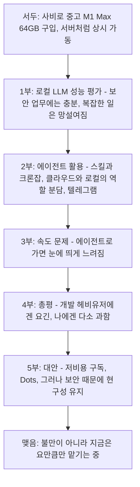
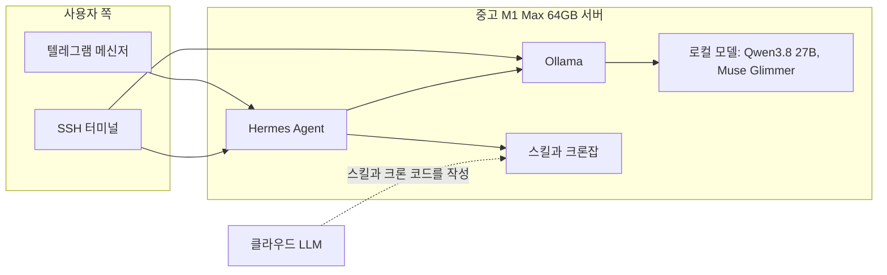
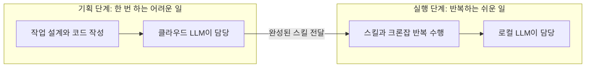
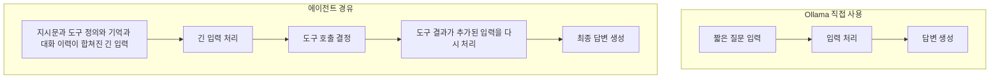
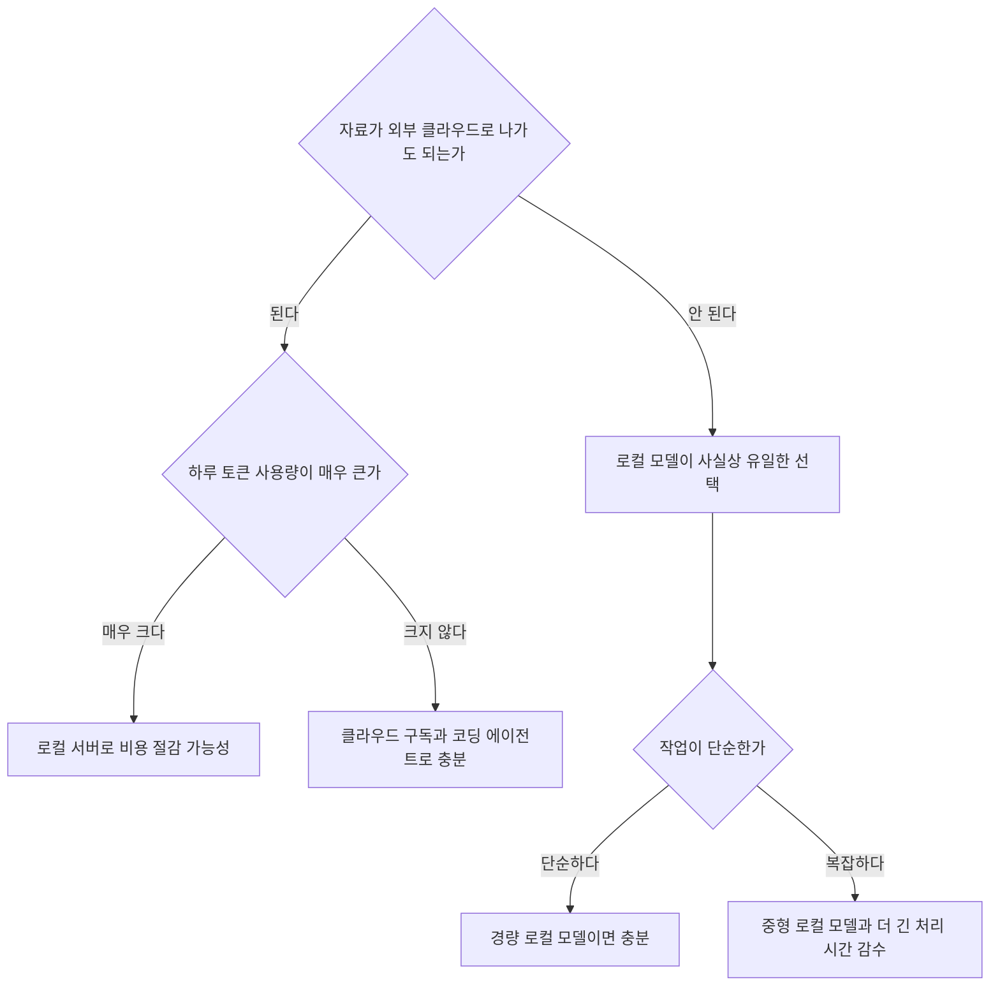

작성일: 2026-10-04

## 0. 이 문서를 읽기 전에

이 문서는 어떤 사람이 SNS에 올린 ["로컬 LLM과 에이전트를 석 달째 쓰고 있는 소감"](https://www.facebook.com/share/p/19aqYAmr3Z/) 글을 풀어서 설명하고, 글에 등장하는 모델·도구·서비스가 실제로 무엇인지 최신 자료로 확인해 덧붙인 해설서입니다.

먼저 밝혀둘 점이 있습니다. 함께 전달된 페이스북 링크는 사이트가 자동 접근을 허용하지 않아 열어볼 수 없었습니다. 따라서 글의 내용은 함께 붙여넣어 주신 본문 텍스트만을 근거로 삼았고, 작성자가 누구인지, 댓글에서 어떤 논의가 있었는지는 알지 못합니다. 본문에 없는 내용을 작성자의 생각으로 지어내지 않았으며, 작성자의 말과 제가 확인한 외부 사실은 서로 구분해서 적었습니다.

이 문서에서 "확인했다"고 표시한 내용은 공식 문서·공식 발표 또는 신뢰할 만한 보도로 확인한 것이고, "확인하지 못했다"고 표시한 내용은 이번 조사에서 근거를 찾지 못한 것입니다. 마지막 장에 이 구분을 표로 모아두었습니다.

## 1. 한 문단 요약

작성자는 업무 보안 때문에 클라우드 LLM을 쓰기 어려운 일을 처리하려고, 통합 메모리 64GB짜리 중고 M1 Max 맥을 사비로 구입해 서버처럼 상시 켜두고 로컬 LLM 에이전트를 돌려왔습니다. 석 달 동안 쓴 결론은 "유용하고 만족스럽지만, 나처럼 필요한 부분에만 쏙쏙 쓰는 사람에게는 서버까지 두는 것이 약간 과하다"는 것입니다. 로컬 모델은 어지간한 일에는 충분하지만 정교하고 복잡한 일, 즉 실제 리서치나 코드 생성에서는 클라우드 모델과 격차가 있습니다. 에이전트에서는 스킬과 크론잡이 가장 큰 수확이었고, 반대로 가장 큰 아쉬움은 성능이 아니라 속도였습니다. 그리고 작성자는 비용 절약 효과는 하루 종일 개발에 토큰을 쓰는 사람에게 더 크게 돌아갈 것이라고 보며, 보안만 확실하다면 최근 나온 OpenAI의 Dots 같은 클라우드 에이전트도 괜찮은 대안일 수 있다고 말합니다. 글 전체의 톤은 불만이 아니라, "지금 내 사용량과 상황에서는 이 정도가 적당하다"는 차분한 정리입니다.

## 2. 글의 구조를 한눈에 보기

작성자의 글은 크게 여섯 덩어리로 이루어져 있습니다. 아래 도표는 그 흐름을 정리한 것입니다.

이 순서가 말해주는 것은, 글이 "기술 찬양"이나 "기술 비판"이 아니라 개인의 사용 패턴과 비용 대비 효용을 따져보는 회고라는 점입니다.

## 3. 작성자의 환경: 무엇을 어떻게 연결해 쓰는가

### 3.1 전체 구성

본문에 따르면 작성자는 중고 M1 Max(통합 메모리 64GB)를 서버처럼 켜두고, 그 위에서 Hermes 에이전트를 돌립니다. 모델은 Ollama를 통해 Qwen3.8 27B와 Muse Glimmer(글에서는 "뮤즈 글리머")를 번갈아 연결해 쓰며, 외출 중에는 텔레그램으로, 자리에서는 SSH로 접속합니다. 스킬이나 크론잡의 코드를 만들 때는 클라우드 LLM을 쓰고, 만들어진 것을 반복 실행하는 일은 로컬 모델에 맡깁니다.

도표에서 SSH가 Hermes와 Ollama 양쪽에 연결된 것은, 작성자가 "이동 중이 아니고 단발성 일이면 에이전트를 거치지 않고 SSH로 Ollama를 직접 구동한다"고 말했기 때문입니다.

### 3.2 등장하는 이름들이 실제로 무엇인지 (확인한 사실)

**Hermes Agent.** Nous Research가 만든 오픈소스 에이전트입니다. 공식 저장소는 이 에이전트를 "경험에서 스킬을 만들고, 사용하면서 스킬을 개선하며, 자기 과거 대화를 검색하는 학습 루프를 가진 에이전트"로 소개합니다. 텔레그램, 디스코드, 슬랙, 왓츠앱 등 여러 메신저에서 같은 에이전트를 쓸 수 있는 메시징 게이트웨이와 크론 스케줄링, 스킬 시스템이 기본 기능으로 문서화되어 있습니다. 작성자가 "스스로 자기를 고쳐가며 발전하는 개념이 흥미롭다"고 한 것은 바로 이 학습 루프를 가리키는 것으로 보입니다. 다만 작성자가 구체적으로 어떤 기능을 켜서 쓰는지는 본문에서 알 수 없습니다.

**Qwen3.8 27B.** Ollama가 2026년 8월 14일 공식 계정으로 "Qwen 3.8 27B를 Ollama에서 쓸 수 있다"고 알렸고, 그 게시물에는 Hermes Agent를 포함한 여러 에이전트 도구와 함께 쓰는 명령어와 애플 실리콘 최적화 버전(`qwen3.8:27b-mlx`)이 언급되어 있습니다. 모델 자체는 Apache 2.0 라이선스의 270억 파라미터급 모델이며, Ollama 기본 빌드는 약 18GB, 4비트 양자화 기준으로 약 17GB 안팎의 VRAM 또는 통합 메모리가 필요하다고 소개됩니다(2차 자료). 64GB 통합 메모리라면 모델을 올리고도 문맥(컨텍스트)과 다른 작업을 위한 여유가 있는 크기입니다.

**Muse Glimmer.** Meta Superintelligence Labs가 2026년 8월 10일 공개한 모델입니다. 공식 블로그는 300억 파라미터 모델이며 Apache 2.0 라이선스로 가중치를 공개했고 "상시 구동되는 로컬 에이전트 작업"에 맞춰 최적화했다고 설명합니다. 모델 카드에는 Muse Spark에서 증류(distillation)했고, 이미지를 이해하는 인코더를 포함하며, OpenClaw와 Hermes Agent 등 에이전트 틀과 함께 동작한다고 적혀 있습니다. 한 분석 글은 Meta가 64GB 통합 메모리 맥북 프로에서 이 모델을 시연했다고 전합니다(2차 자료). 작성자의 64GB 맥은 그 시연 환경과 같은 메모리 규모입니다.

**Dots.** 헷갈리기 쉬운 이름이지만, 글에서 말하는 것은 OpenAI가 2026년 9월 29일 DevDay에서 발표한 상시 가동형 ChatGPT 에이전트입니다. 자세한 내용은 5장에서 다룹니다.

## 4. 로컬 LLM 성능에 대한 작성자의 평가

### 4.1 "어지간한 일에는 도움이 되지만, 정교하고 복잡한 일에는 망설여진다"

작성자가 로컬 모델에 주로 맡기는 일은 두 가지입니다. 하나는 엠바고가 풀리기 전의 논문이나 보고서를 빠르게 초벌 정리하고 탐색하는 일이고, 다른 하나는 분야 전문가 풀 목록을 만들어 두고 주제별로 문의하기 적절한 사람을 추천받는 일입니다. 둘 다 "내용이 바깥으로 나가면 곤란한" 성격의 일이라는 점이 공통점입니다. 이 정도 일에서는 로컬 모델 성능이 나쁘지 않다고 평가합니다.

흥미로운 지적은 그 다음입니다. 논문 초벌 정리 정도는 9B급 경량 모델도 꽤 빠르고 잘 해내기 때문에, 27B급을 돌릴 수 있는 서버를 따로 두는 것이 과하게 느껴진다는 것입니다. 즉 작업 난이도가 낮으면 작은 모델로 충분하고, 난이도가 높으면 로컬 모델로는 부족하니, 중간 크기 모델을 위한 전용 서버의 자리가 애매해진다는 논리입니다.

### 4.2 복잡한 일에서는 프런티어급이 아니어도 클라우드와 차이가 난다

실제 리서치나 코드 생성처럼 결과물이 "그대로 쓰이는" 작업에서는 클라우드 모델을 연결하는 편이 속이 편하다고 합니다. 데이터 분석에서도 마찬가지입니다. 작성자는 새로운 분석 기법을 공부하면서 코드를 주고받고 토론하는 방식을 시험 중인데, 이때도 클라우드 모델이 시행착오를 확 줄여준다고 평가합니다. 작성자의 표현대로 "프런티어급이 아니어도" 클라우드 모델이 앞선다는 점이 중요합니다. 격차가 최고 성능 모델과의 비교에서만 나타나는 것이 아니라, 일반적인 중형급 클라우드 모델과의 비교에서도 체감된다는 뜻이기 때문입니다.

한편 이 평가는 작성자 본인의 사용 경험이며, 모델 간 성능을 객관적으로 비교한 벤치마크는 아닙니다. 참고로 Muse Glimmer 관련 분석 글들은 Meta가 직접 발표한 벤치마크에서 이전 세대 Qwen 27B급과 비교해 일부는 앞서고 일부는 못 미친다고 전하는데, 이것도 제조사 발표 기준이라는 점을 감안해서 읽어야 합니다.

## 5. 에이전트: 스킬, 크론잡, 그리고 "기획 노동과 실행 노동의 분리"

### 5.1 스킬과 크론잡이 왜 혁신적이었나

작성자는 에이전트에서 가장 만족스러운 부분으로 스킬과 크론잡을 꼽습니다. 반복적으로 손으로 하던 작업 여러 개를 자동화해 시간을 아끼고 모니터링에 드는 수고를 줄였다는 것입니다. 결과물은 대부분 손봐야 하지만 그래도 절약 효과가 크다고 합니다.

여기서 눈여겨볼 대목은 "자동화는 예전에도 코드로 많이 해왔는데, 스킬로 만들어두고 말로 지시할 수 있는 점이 꽤 혁신적"이라는 말입니다. 원래도 실행 코드와 웹훅을 만들어 썼던 사람이므로, 새로 생긴 것은 자동화 자체가 아니라 자동화를 부르는 방식이 자연어가 되었다는 점입니다. 그러면서도 "말로 하지만 코드 기반으로 작동하니 LLM 작업의 가장 큰 불만이던 재현성 부족을 많이 커버해준다"고 평가합니다. 매번 모델이 알아서 즉흥적으로 처리하는 것이 아니라, 정해진 코드를 불러 쓰기 때문에 결과가 일정하다는 뜻입니다.

이 설명은 Hermes의 공식 문서와 잘 맞아떨어집니다. 크론 문서에 따르면 크론잡은 자연어로 일정과 지시를 주어 만들 수 있고, 한 개 이상의 스킬을 붙여서 실행할 수 있으며, 결과를 텔레그램 등으로 전달할 수 있습니다. 또 모델 호출 없이 스크립트만 실행하는 "no-agent 모드"도 문서에 있습니다. 다만 작성자가 이 모드를 쓰는지는 본문에서 알 수 없으므로, 어디까지나 "구조적으로 이런 구성이 가능하다"는 설명으로만 받아들이면 됩니다.

### 5.2 모델의 이원화: 기획은 클라우드, 실행은 로컬

작성자는 서버의 LLM을 둘로 나누어 씁니다. 스킬이나 크론 작업을 코드로 만드는 단계는 주로 클라우드 LLM에게 맡기고, 로컬 모델에게는 완성된 것을 반복 수행하는 일만 맡기는 경우가 많다고 합니다. 이를 "기획 노동과 실행 노동의 분리"라고 표현했습니다.

이 분리가 합리적인 이유는 일의 성격이 다르기 때문입니다. 코드를 처음 설계하는 일은 정교함이 필요하지만 한 번만 하면 되고, 완성된 코드를 돌리는 일은 정교함이 덜 필요하지만 계속 반복됩니다. 어려운 일은 성능 좋은 클라우드에, 반복되는 쉬운 일은 비용이 들지 않는 로컬에 배치하는 셈입니다. 또 설계 단계에서 외부로 나가는 정보는 작업의 구조뿐이고, 실제 민감한 자료는 실행 단계의 로컬 서버에서만 다뤄진다는 부수 효과도 생깁니다. 다만 이 부수 효과는 작성자가 글에서 직접 말한 것이 아니라 구조에서 읽어낼 수 있는 점이므로, 작성자의 의도라고 단정하지는 않겠습니다.

### 5.3 메신저로 요청하고 받는 편리함

텔레그램으로 요청을 주고받을 수 있게 된 것도 "생각보다 편리하다"고 합니다. 로컬 LLM에 언제든 접속할 수 있다는 점이 든든하다는 감상도 덧붙였습니다. Hermes 공식 문서는 텔레그램 연동을 상세히 다루고 있으며, 크론잡의 결과를 지정한 텔레그램 채팅이나 토픽으로 보내는 기능도 설명합니다. 즉 "서버가 정해진 시간에 일을 하고, 결과를 내 휴대폰 메신저로 보내준다"는 사용 방식이 공식적으로 지원되는 흐름입니다.

## 6. 가장 큰 걸림돌은 성능이 아니라 속도

### 6.1 작성자의 관찰

작성자가 로컬 모델을 에이전트의 메인으로 쓰기 가장 망설이는 이유는 성능이 아니라 속도입니다. Ollama에서 직접 쓸 때는 클라우드만큼은 아니어도 쓸 만한데, 에이전트를 거치면 상당히 느려져서 실시간 대화의 느낌이 사라진다고 합니다. 간단한 작업에서도 그렇습니다. 작성자는 원인을 "아마 맥락을 계속 업데이트하는 것 같다"고 추측하고 있습니다. 대처 방법은 두 가지입니다. 할 일이 있으면 미리 던져놓고 다른 일을 하면서 병렬로 진행하고, 이동 중이 아닌 단발성 작업은 에이전트를 거치지 않고 SSH로 Ollama를 직접 돌립니다.

### 6.2 왜 에이전트를 거치면 느려지는가 (확인 가능한 범위)

작성자의 추측은 방향이 맞을 가능성이 높습니다. Apple이 WWDC 2026 세션에서 로컬 에이전트를 설명하면서 첫 번째 과제로 꼽은 것이 바로 "프롬프트 처리"입니다. 에이전트 구조에서는 모델이 도구의 실행 결과를 받을 때마다 새로 들어온 문맥을 전부 처리한 뒤에야 다음 단계를 판단할 수 있다는 설명입니다. 또 에이전트 도구들은 시스템 프롬프트와 도구 정의를 길게 붙여서 보내는 경향이 있어서, 로컬 모델은 응답을 한 글자 만들기 전에 이 긴 입력을 먼저 읽어야 한다는 점을 지적하는 오픈소스 프로젝트도 있었습니다.

위 도표는 일반적인 에이전트 구조를 단순화한 것으로, 작성자의 Hermes 환경에서 실제로 어느 단계가 얼마나 걸리는지를 측정한 것은 아닙니다. 그래서 정확히는 이렇게 정리할 수 있습니다. "에이전트 경유 시 입력이 길어지고 반복 처리가 늘어나 느려진다"는 것은 일반적으로 알려진 현상이고 작성자의 추측과 일치하지만, 작성자의 서버에서 병목이 어디인지는 이 글만으로는 확인할 수 없습니다.

참고로 Apple 세션은 M5 칩의 신경 가속기로 프롬프트 처리가 약 4배 빨라진다고 설명했는데, 이것은 M5에 대한 이야기이므로 M1 Max에 그대로 적용된다고 볼 근거는 없습니다.

## 7. 총평: 누구에게 맞는 구성인가

### 7.1 작성자의 결론

작성자는 로컬 LLM과 에이전트 조합이 "개발로 종일 엄청난 토큰을 쓰는 사람에게는 비용 절약 차원에서 아주 요긴할 것"이라고 봅니다. 반면 자신처럼 필요한 부분에만 쏙쏙 쓰는 사람에게는 유용하고 만족스럽긴 해도 서버를 따로 두기에는 과하다고 느낍니다. 그 근거는 세 가지입니다.

1. 보안이 필요한 일 외에는 클라우드 모델을 써도 토큰 문제가 없습니다. 복잡한 일을 드물게만 하기 때문입니다.
2. 자동화와 크론잡은 원래도 실행 코드와 웹훅으로 해왔기 때문에 크게 다를 것이 없습니다.
3. 데이터 분석은 에이전트에게 통째로 맡기면 과정이 깜깜이가 되므로, 지금처럼 코드 조각을 요청해 직접 실행하고 결과를 놓고 의견을 나누는 방식이 낫습니다.

다만 스킬이라는 개념의 유용함과, 에이전트가 스스로를 고쳐가며 발전한다는 개념의 흥미로움은 높게 평가합니다.

### 7.2 상황별로 보면

작성자의 사례는 도표의 가장 왼쪽 갈래, 즉 "자료를 바깥으로 보낼 수 없다"에서 출발합니다. 그 갈래 안에서도 작업이 대부분 단순하기 때문에, 중형 모델용 서버가 약간 과잉이라는 결론에 도달한 것입니다. 이 도표는 작성자의 논리를 제가 구조화한 것이며, 작성자가 이런 도표를 제시한 것은 아닙니다.

## 8. Dots는 무엇이고, 작성자의 판단에 어떻게 연결되는가

### 8.1 Dots의 정체 (확인한 사실)

OpenAI는 2026년 9월 29일 샌프란시스코에서 열린 DevDay 2026에서 Dots를 발표했습니다. 여러 보도와 설명을 종합하면 다음과 같습니다.

- Dots는 ChatGPT 안에서 동작하는 상시 가동형(always-on) 에이전트이며, GPT-6 Astra 모델을 기반으로 합니다.
- 각 dot은 자신만의 클라우드 컴퓨터를 갖고, 대화가 끝난 뒤에도 일을 이어가며, 피드백을 통해 시간이 지나면서 학습한다고 소개됩니다.
- OpenAI의 플러그인 생태계를 통해 4,000개가 넘는 앱에 연결할 수 있고, ChatGPT뿐 아니라 슬랙과 팀즈에서도 접근할 수 있습니다.
- 사용자의 계정에 영향을 주거나 정보를 공유할 수 있는 행동은 사용자가 정한 규칙과 OpenAI의 안전 기준에 맞는지 자동으로 검토하며, 안전 문제가 감지되면 모니터링 시스템이 dot을 일시 중지하거나 중단할 수 있다고 합니다. OpenAI 스스로도 dots가 여전히 실수할 수 있다고 밝혔습니다.
- 제공 대상은 ChatGPT Pro와 Business Premium 사용자이며, 해당 요금제에 dot 하나가 포함됩니다. Enterprise는 워크스페이스 관리자가 승인하면 써볼 수 있고, 추후 더 많은 dot을 추가할 수 있게 한다는 계획입니다. dot은 데스크톱 앱이나 데스크톱 브라우저에서 만들고, 만든 뒤에는 모바일 앱에서도 대화할 수 있습니다.
- 한 설명 글은 OpenAI가 dots 자체에 대한 공개 API를 발표하지 않았다고 정리했습니다.

작성자가 쓴 표현인 "Dots까지 나온 시점에서 이것도 금세 옛날 이야기가 될지도 모른다"는 말은 글을 쓴 시점이 발표 직후라는 점과 맞습니다. 발표일(9월 29일)로부터 불과 며칠밖에 지나지 않은 시점입니다.

### 8.2 작성자의 판단과 비교해 볼 점

작성자는 "보안에 대한 믿음만 확실하다면 Dots 같은 서비스를 쓰는 것도 괜찮을 것"이라고 하면서도, 학술지 등에서 발표 전 자료에 클라우드 LLM을 쓰는 데 조심스러워하므로 자신도 따라야 해서 대안을 쓴다고 말합니다.

여기에는 한 가지 짚어둘 지점이 있습니다. 작성자는 "저비용 구독으로 코덱스나 클로드 코드만 잘 활용해도 괜찮을 것"이라고 하면서 Dots를 같은 선상의 대안으로 언급했는데, 확인된 바로는 Dots는 Pro와 Business Premium 플랜 사용자가 대상입니다. 이 플랜들의 정확한 요금은 이번 조사에서 확인하지 못했으므로, Dots가 "저비용 구독" 범위에 들어가는지는 말할 수 없습니다. 비용을 따질 때는 공식 요금 페이지를 직접 확인해야 합니다.

또 하나, Dots가 클라우드에서 동작하는 에이전트라는 점은 작성자의 핵심 제약인 "발표 전 자료를 외부 클라우드에 올리지 않는다"와 정면으로 충돌합니다. 작성자가 "보안에 대한 믿음만 확실하다면"이라는 단서를 단 것도 이 때문으로 읽힙니다. 이 조건은 서비스 품질의 문제가 아니라 자료의 성격과 소속 기관·학술지의 규정에 달린 문제입니다.

## 9. 보안 제약의 배경: 발표 전 자료와 생성형 AI

작성자가 "학술지 등에서도 발표 전 자료에 대해 클라우드 LLM 이용을 조심스러워한다"고 한 부분은 실제 출판 규정과 부합합니다. 이번에 확인한 몇 가지 사례는 다음과 같습니다.

여러 학술지의 AI 정책 문서는 심사자와 편집자가 아직 출판되지 않은 원고와 관련 파일, 이미지, 정보를 생성형 AI 도구에 올려서는 안 된다고 명시합니다. 이유로는 기밀 유지, 소유권, 데이터 보호 문제를 듭니다. 일부 정책은 심사자가 원고를 분석하거나 요약하는 데 생성형 AI를 쓰는 것 자체를 하지 말라고 하며, 쓸 수 있는 범위를 심사 의견의 문장을 다듬는 정도로 제한합니다. 미국 NIH는 연구비 심사 과정에서 생성형 AI 사용을 전면 금지하고 있다고 정책 비교 자료가 정리하고 있습니다(공지 번호 NOT-OD-23-149).

여기서 작성자 상황에 대해 정확히 말할 수 있는 범위는 이렇습니다. 작성자가 어떤 지위로 이 자료를 다루는지(심사자인지, 취재·분석 담당인지 등), 어느 기관의 어떤 규정을 따르는지는 글에 나와 있지 않습니다. 따라서 위 정책들은 "이런 종류의 제한이 실제로 널리 존재한다"는 맥락을 보여줄 뿐, 작성자에게 적용되는 규정이 무엇인지를 알려주는 것은 아닙니다. 또 위 정책들 가운데에는 "로컬에서 돌리는 모델이라면 괜찮다"고 명시한 것을 이번에 확인하지 못했습니다. 외부 서버로 자료가 전송되지 않는 로컬 구성이 기밀 유지 측면에서 구조적으로 유리하다는 것은 분명하지만, 개별 규정이 이를 허용하는지는 각자 해당 규정을 확인해야 합니다.

## 10. 이 글에서 얻을 수 있는 실용적 교훈

첫째, 로컬 모델을 도입하는 이유가 "성능"이나 "절약"이 아니라 "자료를 내보낼 수 없는 제약"이라면, 선택지가 사실상 좁아지므로 그 안에서 구성을 최적화하는 것이 현실적입니다.

둘째, 모델 크기를 맞출 때는 일의 난이도 분포를 먼저 봐야 합니다. 작성자의 경우 쉬운 일이 대부분이라 경량 모델로 충분했고, 어려운 일은 어차피 클라우드로 보내게 되니 중형 로컬 모델의 몫이 애매해졌습니다.

셋째, 에이전트의 가치는 "모델이 똑똑한가"보다 "반복 업무를 재현 가능하게 코드화할 수 있는가"에서 나올 수 있습니다. 스킬로 코드를 만들어 두고 로컬이 반복 실행하는 구조는 모델 성능 요구 수준을 낮춰줍니다.

넷째, 에이전트의 속도 문제는 작업 방식으로 우회할 수 있습니다. 실시간 대화를 기대하지 않고 미리 던져두는 비동기 방식으로 쓰거나, 단발성 작업은 에이전트를 건너뛰고 모델에 직접 요청하는 것입니다.

다섯째, 나에게 맞는 구성은 사용량에 달려 있습니다. 작성자 스스로 "더 많은 역할을 맡기면 유용할 수도 있겠지만, 아직은 요만큼만"이라고 맺었듯이, 도입 규모는 필요가 늘어나는 속도에 맞춰 조절하는 것이 낫습니다.

## 11. 근거 확인 현황표

| 구분 | 내용 | 상태 |
|---|---|---|
| 작성자 경험 | M1 Max 64GB 사용, Hermes+Ollama 구성, 모델 이원화, 속도 불만 | 본문에서 확인, 외부 검증 대상 아님 |
| 외부 사실 | Dots는 2026-09-29 OpenAI가 발표, GPT-6 Astra 기반, Pro·Business Premium 대상 | 복수의 보도와 설명으로 확인 |
| 외부 사실 | Muse Glimmer는 2026-08-10 Meta가 Apache 2.0으로 공개한 30B 모델 | 공식 블로그·모델 카드·보도로 확인 |
| 외부 사실 | Qwen3.8 27B는 2026-08-14 Ollama에서 사용 가능, 애플 실리콘용 MLX 빌드 존재 | Ollama 공식 게시물로 확인 |
| 외부 사실 | Hermes Agent는 스킬, 크론, 텔레그램 게이트웨이, 학습 루프를 제공 | 공식 저장소와 문서로 확인 |
| 외부 사실 | 다수 학술지·NIH가 미발표 원고의 생성형 AI 업로드를 제한 | 정책 문서와 비교 자료로 확인 |
| 해석 | 에이전트에서 느려지는 원인이 긴 입력의 반복 처리라는 설명 | 일반적 설명과 일치하나 작성자 환경에서 측정된 것은 아님 |
| 미확인 | Dots의 정확한 요금, Dots가 작성자 보안 요건을 충족하는지 | 확인하지 못함 |
| 미확인 | 원문 페이스북 게시물의 작성자, 댓글, 게시 시각 | 접근 불가 |
| 미확인 | M1 Max에서 Qwen3.8 27B와 Muse Glimmer의 실측 속도 | 확인하지 못함 |

## 12. 참고한 자료

- OpenAI Dots 발표 보도: BetaNews, 9to5Google, Slashdot(Bloomberg 인용), DataCamp 해설 (2026년 9월 29일 전후 기사)
- Hermes Agent 공식 저장소: https://github.com/nousresearch/hermes-agent
- Hermes Agent 크론 문서: https://hermes-agent.nousresearch.com/docs/user-guide/features/cron
- Hermes Agent 텔레그램 문서: https://hermes-agent.nousresearch.com/docs/user-guide/messaging/telegram
- Ollama의 Qwen 3.8 27B 공지(2026-08-14): https://x.com/ollama/status/2088314436088168491
- Qwen 3.8 27B 로컬 구동 가이드(2차): https://www.yottalabs.ai/post/how-to-run-qwen-3-8-27b-locally-ollama-gguf-single-gpu-2026
- Meta의 Muse Glimmer 공식 소개: https://research.meta.ai/blog/introducing-muse-glimmer-open-agentic-model
- Muse Glimmer 모델 카드: https://huggingface.co/meta-models/Muse-Glimmer-30B
- Muse Glimmer 분석(2차): Forbes, MindStudio, wavect 가이드
- Apple WWDC 2026 로컬 에이전트 세션 요약: https://nonstrict.eu/wwdcindex/wwdc2026/232/
- 생성형 AI와 동료평가 정책 비교(2차): https://casrai.org/compare/ai-in-peer-review-publisher-policy-comparison

2026-10-04
