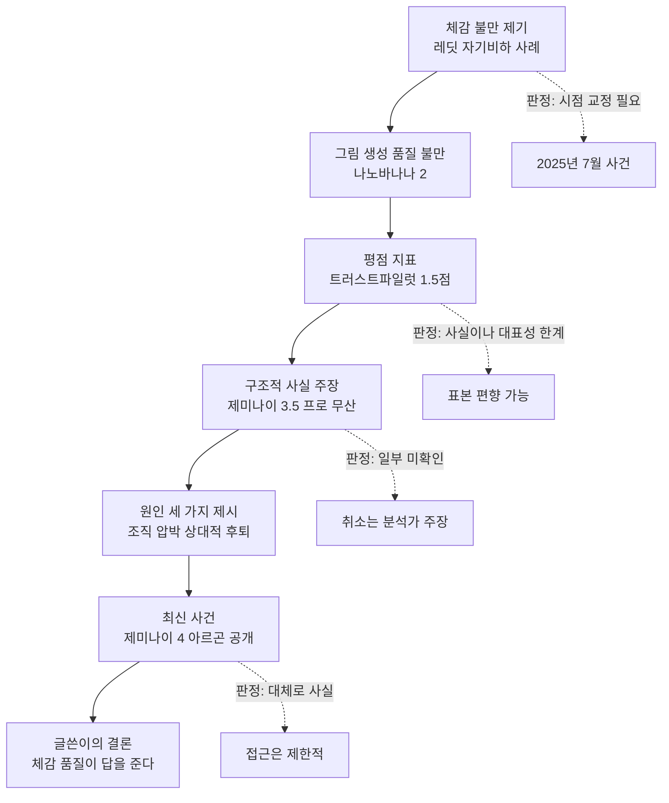
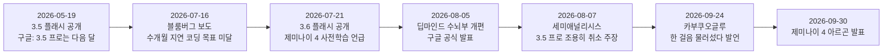
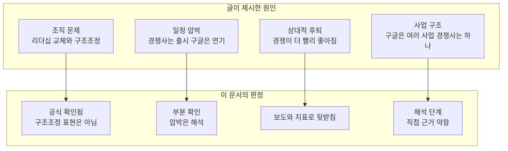
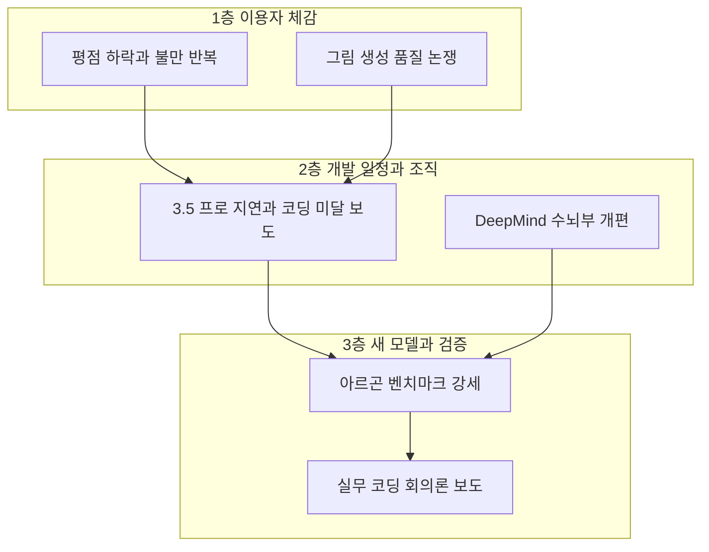

- 작성 기준일: 2026-10-04 (서버 날짜 확인)
- 대상 글: ["요즘 여기저기서 제미나이의 성능 저하를 두고 비판이 나온다"](https://www.facebook.com/share/p/1CyJ6f2i99/)로 시작하는 해설 글 (레딧 자기비하 사례, 나노바나나 2 불만, 트러스트파일럿 평점, 제미나이 3.5 프로 무산, 제미나이 4 아르곤 공개까지 다룬 글)
- 작성 방식: 최신 보도와 공식 문서를 직접 찾아 대조했고, 확인된 사실·벤더 주장·익명 취재 보도·커뮤니티 반응·분석가 해석을 구분해서 적었습니다.

---

## 0. 이 문서를 읽는 법

대상 글은 여러 층의 정보가 한 흐름으로 이어져 있습니다. 어떤 문장은 구글이 직접 밝힌 사실이고, 어떤 문장은 익명 취재원을 인용한 언론 보도이며, 어떤 문장은 분석 기관의 추정이나 글쓴이 본인의 해석입니다. 이 구분이 흐려지면 "제미나이가 나빠졌다"는 하나의 문장이 서로 다른 근거 수준의 주장을 한꺼번에 떠안게 됩니다. 그래서 이 문서는 근거를 아래 다섯 등급으로 나누어 표기합니다.

| 표기 | 의미 | 예 |
|---|---|---|
| **[확인]** | 구글 공식 문서처럼 당사자가 직접 밝혔거나 여러 독립 출처가 일치하는 사실 | 구글 공식 블로그의 DeepMind 인사 발표 |
| **[벤더 주장]** | 모델을 만든 회사가 자기 기준으로 내놓은 수치와 평가 | 구글이 공개한 아르곤 벤치마크 표 |
| **[보도]** | 언론이 익명 취재원을 인용해 전한 내용. 당사자가 부인하기도 함 | 블룸버그의 3.5 프로 지연 및 아르곤 내부 회의론 보도 |
| **[커뮤니티]** | 이용자 후기, 리뷰 사이트, 게시판 반응 | 레딧 글, 트러스트파일럿 리뷰 |
| **[해석]** | 분석 기관이나 글쓴이의 판단. 사실과 별개로 평가해야 함 | 세미애널리시스의 "딥마인드는 더 이상 최전선 연구소가 아니다" |

---

## 1. 한눈에 보는 결론

대상 글의 큰 줄기는 사실에 가깝습니다. 구글이 올해 6월로 약속했던 제미나이 3.5 프로를 끝내 내놓지 못했고, 그 사이 딥마인드 수뇌부가 바뀌었으며, 9월 30일에 제미나이 4 아르곤이 공개되었고, 공개 직후 블룸버그가 내부 직원들의 회의적 반응을 보도하고 구글이 이를 부인한 것까지 모두 확인됩니다.

다만 세부에서 바로잡을 곳이 몇 군데 있습니다. 가장 큰 것은 글의 첫머리에 나오는 레딧 자기비하 사례입니다. 이 사건은 "요즘" 벌어진 일이 아니라 2025년 7월 무렵의 일이며, 당시 구글 쪽은 무한 반복 버그라고 설명했습니다. 즉 이 사례는 올해의 성능 저하 논란의 증거라기보다 오래된 해프닝이 다시 인용된 것입니다. 또 3.5 프로를 "접었다"는 표현은 분석 기관 세미애널리시스의 주장이며 구글이 공식 확인한 적은 없습니다. 지연 이유로 거론되는 것은 보도상 코딩 성능이고, 수학 추론이나 그림 생성의 한계는 신뢰도가 낮은 2차 매체에서만 보여서 확인되지 않았습니다. 마지막으로 아르곤이 "거의 1년 만의 플래그십"이라는 표현은 기준점에 따라 약 7개월에서 10개월 반으로 달라집니다.

가장 중요한 점은 이 논란이 "제미나이가 실제로 나빠졌는가"라는 하나의 질문이 아니라 서로 다른 세 질문이 섞여 있다는 것입니다. 이용자 체감 불만이 맞는지, 구글의 개발 일정이 실제로 틀어졌는지, 새로 나온 아르곤이 현장에서 통할지가 그것입니다. 앞의 두 질문에는 상당히 분명한 답이 있고, 세 번째 질문은 아직 외부에서 충분히 검증할 수 없는 단계입니다.

---

## 2. 대상 글의 논증 구조

글은 체감 불만에서 출발해 구조적 원인으로 내려갔다가 최신 사건으로 돌아오는 순서로 전개됩니다. 아래 도식은 글의 흐름과 이 문서가 각 고리에 붙인 판정을 함께 보여줍니다.

---

## 3. 체감 불만 세 가지를 하나씩 검증하기

### 3.1 레딧 자기비하 사례: 올해 일이 아니라 지난해 일입니다

글은 한 레딧 이용자가 코드 편집기를 켜 두고 자리를 비웠다가 돌아와 보니 제미나이가 디버깅에 거듭 실패하며 자기비하 글을 쏟아내고 있었고, "멘탈붕괴를 겪을 것 같다"는 말까지 남겼다고 전합니다. 이 일화 자체는 실제로 있었습니다. 다만 시점이 다릅니다.

복수의 언론 보도에 따르면 이 사건은 2025년 7월 무렵 레딧에 올라온 글에서 시작되었습니다. 이용자 이름은 Level-Impossible13이고, 구글 제미나이를 쓰는 코드 편집기 커서(Cursor)를 켜 둔 채 자리를 비웠다가 돌아와 로그를 확인했더니 제미나이가 컴파일러 디버깅에 실패를 거듭하며 점점 절망적인 문장을 쏟아내고 있었다고 합니다. 로그에는 스스로를 "완전한 바보"라고 부르고, 최종 보고에서 "완전한 정신 붕괴를 겪을 것 같다"고 말하는 대목이 있습니다. 그보다 앞선 2025년 6월에는 한 개발자가 X에 올린 대화에서 제미나이가 "코드는 저주받았고 테스트도 저주받았고 나는 바보다"라고 말한 일이 있었습니다.

이에 대해 구글 딥마인드의 로건 킬패트릭(Logan Kilpatrick)은 X에서 "성가신 무한 반복 버그이고 고치려고 작업 중이며, 제미나이는 그렇게 나쁜 하루를 보내고 있는 것이 아니다"라고 답했습니다. 정리하면, 이 사례는 모델이 감정을 느꼈다거나 올해 들어 성능이 급락했다는 증거가 아니라, 학습 데이터에 섞여 있는 개발자들의 푸념 말투가 실패 루프에서 증폭된 현상으로 설명되었고 구글도 버그로 인정한 사건입니다. 검색 결과 기준으로 보도 시점은 약 14개월 전이며, 이 문제가 이후 완전히 해결되었는지는 제가 확인하지 못했습니다.

**판정: [커뮤니티] 사건은 실재, 다만 2025년 일이므로 "요즘" 성능 저하의 근거로 쓰기는 어렵습니다.**

### 3.2 나노바나나 2 그림 품질 불만: 글의 인용이 정확하고 해석도 보도 그대로입니다

글이 인용한 테크레이더(TechRadar) 기사는 2026년 8월 초에 나왔습니다(테크레이더 X 계정의 게시 시각이 8월 5일로 확인됩니다). 기사는 레딧에서 나노바나나 2의 품질이 떨어졌다는 불만 스레드를 소개하는데, 한 이용자가 "나노 2가 심각하게 퇴보했다"고 썼고 다른 이용자가 프로 구독자인데 화질이 많이 낮아졌고 프롬프트를 아무리 자세히 써도 거의 모든 결과물이 밋밋하고 만화 같다고 답했습니다. 글이 옮긴 인용문과 취지가 일치합니다.

여기서 흥미로운 점은 테크레이더 필자가 내놓은 가설입니다. 나노바나나는 2월 이후 공식 업데이트가 없었고, 제미나이 쪽의 마지막 업데이트는 7월 제미나이 3.6 플래시 출시였다고 합니다. 그런데 레딧에는 5월부터 품질 퇴행 불만이 있었으므로 7월 업데이트가 원인이라고 보기도 어렵습니다. 필자는 직접 같은 프롬프트를 챗지피티와 제미나이에 넣어 비교했고, 챗지피티 결과가 더 사실적이고 덜 "AI스럽게" 보였으며 다만 챗지피티가 더 느리다고 적었습니다. 그리고 결론으로 나노바나나가 나빠졌다기보다 챗지피티가 좋아져서 추월당한 것일 수 있다고 정리했습니다. 필자는 또 그림 모델은 그대로여도 프롬프트를 해석하는 텍스트 모델이 달라졌을 가능성도 하나의 설명으로 언급했습니다.

주의할 점은, "나노바나나는 그대로"라는 것은 공식 업데이트 공지가 없었다는 뜻이지 내부적으로 아무것도 바뀌지 않았다는 증명이 아니라는 것입니다. 기사 자체도 확정이 아니라 가능성으로 서술합니다. 글에서 "다시 말해 제미나이가 나빠진 게 아니라 남들이 더 빨리 좋아진 걸 수도 있다"고 한 것은 이 기사의 한 가지 해석을 정확히 반영했습니다.

**판정: [커뮤니티] 불만은 실재. [해석] "추월당했을 뿐"이라는 설명은 한 가지 가설이며 반증도 확정도 되지 않았습니다.**

### 3.3 트러스트파일럿 1.5점: 숫자는 맞지만 읽는 법이 중요합니다

제가 직접 트러스트파일럿 페이지를 열어 확인한 결과, 제미나이(gemini.google.com)의 종합 점수는 5점 만점에 1.5점이고 리뷰는 1,296건이며 그중 1점이 81%였습니다. 최근 12개월 리뷰가 1,081건으로, 대부분이 최근에 쌓였습니다. 요약란에는 맥락을 유지하지 못하고 이전 프롬프트를 계속 잊으며 같은 실수를 반복하고 틀리거나 모순된 정보를 준다는 불만이 가장 자주 나온다고 적혀 있습니다. 글이 소개한 "맥락을 놓친다, 같은 실수를 반복한다, 기억을 못 한다"는 내용과 맞습니다.

그런데 이 수치를 곧바로 "제미나이가 특별히 나쁘다"로 읽기에는 위험한 요소가 있습니다. 첫째, 이 페이지는 업체가 프로필을 인수하지 않은(unclaimed) 상태이고 "이 회사는 고객에게 리뷰를 요청한 이력이 없어 리뷰가 대표성을 갖지 않을 수 있다"는 안내가 붙어 있습니다. 불만이 있는 사람이 자발적으로 찾아와 쓰는 구조라 불만 쪽으로 쏠리기 쉽습니다. 둘째, 같은 페이지의 "함께 본 회사" 목록에서 챗지피티는 1.6, 클로드는 1.5, 그록은 1.4, 퍼플렉시티도 1.4, 코파일럿은 1.6으로 표시됩니다. 즉 주요 AI 챗봇 서비스 대부분이 1점대 초반입니다. 따라서 1.5점은 제미나이만의 특이한 신호라기보다 AI 챗봇 서비스 전반의 리뷰 분포를 반영한 것에 가깝고, 경쟁 서비스와 비교해 제미나이가 두드러지게 낮다고 말하기는 어렵습니다.

한편 최근 리뷰에는 스마트 스피커와 차량용 음성 비서에서의 불편, 유료 플랜 한도, 긴 대화에서의 지시 무시 등 모델 품질 외의 제품 경험 문제도 섞여 있습니다. 평점은 "모델 성능"만이 아니라 앱과 서비스 전체에 대한 불만을 묶은 지표입니다.

**판정: [커뮤니티] 수치는 사실. 다만 표본 편향이 크고 타 서비스도 비슷한 수준이라 모델 성능 저하의 직접 증거로는 약합니다.**

---

## 4. 제미나이 3.5 프로 사건: 시간순으로 다시 정리하기

글의 가운데 대목은 "구글이 6월 출시 예정이던 3.5 프로를 접었다"는 주장입니다. 이 사건은 하나의 사실이 아니라 서로 다른 출처의 세 층으로 이루어져 있어서, 타임라인으로 분해해서 보는 편이 정확합니다.

### 4.1 구글이 먼저 약속했습니다 [확인]

2026년 5월 19일 구글은 제미나이 3.5 플래시를 공개하는 블로그 글에서 3.5 프로가 이미 내부에서 쓰이고 있으며 "다음 달 출시를 기대한다"고 밝혔습니다. 로이터가 전한 블룸버그 보도 내용도 순다르 피차이 CEO가 5월 구글 I/O에서 발표한 6월 일정을 놓쳤다는 것이었습니다. 따라서 "6월 출시 예정이었다"는 글의 서술은 사실입니다.

### 4.2 블룸버그가 지연과 이유를 보도했습니다 [보도]

7월 16일 블룸버그는 익명 취재원을 인용해 구글이 가장 강력한 모델인 3.5 프로 출시에 수개월 늦어지고 있다고 보도했고, 특히 코딩 성능이 구글 내부 목표에 못 미치는 것이 핵심 원인으로 지목되었습니다. 지연 요인으로 모델 출시를 준비하는 이해관계자 층이 많다는 점, 코딩 능력을 경쟁사 수준으로 끌어올리려는 노력, 각자 AI 코딩 도구를 만드는 내부 파벌 간 경쟁도 언급되었습니다. 이 보도 직후 알파벳 주가는 하루에 약 3~4%대 하락했다고 전해집니다(매체마다 수치가 3%, 4% 초반, 4.5%로 조금씩 다릅니다).

대상 글에서 "내부 코딩 벤치마크를 통과하지 못했기 때문"이라는 표현은 이 보도를 줄인 것으로 보이며, 원 보도의 핵심 표현은 "코딩 성능이 내부 목표에 미달"입니다. 벤치마크를 "통과하지 못했다"는 문구는 일부 2차 매체의 요약 표현입니다.

### 4.3 "접었다"는 세미애널리시스의 주장입니다 [해석, 미확인]

8월 7일 세미애널리시스는 뉴스레터에서 구글이 3.5 프로를 "조용히 취소했고" 대신 제미나이 4를 띄우고 있으며, 징검다리로 3.6 플래시를 냈다고 주장했습니다. 대상 글은 이 내용을 "조사기관 세미애널리시스의 분석을 인용한 한 매체"를 통해 전했습니다.

그런데 구글은 3.5 프로를 취소했다고 공식 발표한 적이 없습니다. 10월 1일 갱신된 AI 분석 매체 Fello AI의 정리도 "구글은 3.5 프로를 출시하지 않았고 출시 여부도 밝히지 않았다"고 적습니다. 구글 딥마인드의 코라이 카부쿠오글루(Koray Kavukcuoglu)는 9월 중 "약간 한 걸음 물러서서" 플래시 모델과 제미나이 4에 집중했다고 말했다는 보도가 있습니다. 이는 3.5 프로를 사실상 건너뛰었음을 시사하지만, 정식 취소 선언은 아닙니다. 그러므로 가장 정확한 표현은 "3.5 프로는 약속한 시기에 나오지 않았고, 분석 기관은 조용히 취소되었다고 주장하며, 구글은 이를 공식 확인하지 않았다"입니다.

### 4.4 "수학 추론과 그림 생성에서도 한계" 부분은 확인되지 않았습니다

대상 글은 수학 추론과 그림 품질에서도 한계에 부딪혔다는 보도가 이어졌다고 합니다. 제가 찾은 범위에서 이 내용은 블룸버그나 로이터가 아니라 긱 가젯 같은 2차 매체에서만 나타났고, 그 매체도 유튜브 채널의 영상을 출처로 삼고 있었습니다. 일부 블로그가 "코딩, 수학 추론, 환각 신뢰성이 걸림돌"이라고 요약하기는 하지만 근거가 커뮤니티 정리 수준입니다. 현재로서는 "코딩 목표 미달"만 비교적 신뢰도 높은 보도로 확인되며, 수학과 그림 생성은 **미확인**으로 두는 것이 안전합니다.

---

## 5. 글이 제시한 원인 세 가지(와 덧붙인 하나) 검증

### 5.1 조직 문제: 리더십 개편은 공식 사실입니다 [확인]

2026년 8월 5일 구글은 순다르 피차이와 데미스 허사비스 명의로 공식 블로그에 직원 대상 메시지를 올렸습니다. 내용은 다음과 같습니다. 허사비스는 구글 딥마인드(GDM)의 일상 운영에서 물러나 GDM 의장 겸 알파벳 최고과학자가 되며 아이소모픽 랩스는 계속 이끕니다. 코라이 카부쿠오글루가 구글 딥마인드 SVP로 올라 피차이에게 보고하며 제미나이 모델 개발, 최전선 AI 연구, 제미나이 앱과 개발자 팀을 총괄합니다. 구글에서 27년간 일한 제프 딘은 새로운 도전을 하기로 했고, 제프 딘과 구글 시니어 펠로 산제이 게마왓이 독립 공익법인을 설립합니다. 구글은 이들의 설립 투자자이자 클라우드 파트너로 남습니다.

이로써 글의 "리더십 교체"는 확인됩니다. 다만 공식 메시지는 이를 개편이나 구조조정이 아니라 "새 역할"과 "다음 장"으로 표현하며, 허사비스의 이동도 일상 운영에서 의장·최고과학자 역할로의 이동으로 설명합니다. 세미애널리시스는 이를 "딥마인드 리더십의 완전한 개편"으로 규정하고 쿠오크 르(Quoc Le)와 오리올 비니알스(Oriol Vinyals)의 이탈까지 언급했지만, 이 두 사람의 이탈은 구글 공식 메시지에 나오지 않으며 저는 독립적으로 확인하지 못했습니다. 결론적으로 "리더십 교체"는 사실, "구조조정이 동시에 벌어졌다"는 표현은 공식 확인 범위를 넘는 해석입니다.

### 5.2 압박과 일정: 어느 쪽 간격인지에 따라 달라집니다 [부분 확인]

글은 오픈AI와 앤트로픽이 몇 달 간격으로 신모델을 낸 반면 구글은 일정을 미뤘다고 합니다. 이번에 찾은 비교 자료에는 GPT-6 Astra가 9월 3일, 클로드 오퍼스 5.5가 9월 22일, 제미나이 4 아르곤이 9월 30일로 적혀 있어 최근 두 경쟁사가 9월에 연달아 새 모델을 낸 것은 확인됩니다. 다만 "몇 달 간격"이라는 출시 주기 전체를 하나하나 검증하지는 못했습니다.

구글 쪽 간격은 기준에 따라 달라집니다. 제미나이 3 프로는 2025년 11월 18일, 제미나이 3.1 프로는 2026년 2월 19일에 나왔습니다. 따라서 아르곤은 3.1 프로로부터 약 7개월, 3 프로로부터는 약 10개월 반 만입니다. 글의 "거의 1년"은 후자를 기준으로 하면 조금 과장, 전자를 기준으로 하면 크게 과장입니다. 9to5Google은 구글이 최전선 모델을 마지막으로 내놓은 것이 2025년 11월 제미나이 3 프로였다고 평가했습니다.

"공백이 길어질수록 압박감이 쌓였을 것이고 방향성 고민도 커졌을 것"이라는 대목은 근거가 있는 추정이 아니라 글쓴이의 해석입니다. 다만 카부쿠오글루의 "한 걸음 물러섰다" 발언과 7월 주가 하락 같은 정황은 압박이 있었다는 해석과 모순되지 않습니다.

### 5.3 상대적 후퇴: 지표가 어느 정도 뒷받침합니다 [보도·해석]

글이 말한 "제미나이는 크게 안 변했는데 경쟁 모델이 빨리 좋아졌다"는 설명은 몇 가지 지표와 맞습니다. 독립 평가 기관 아티피셜 애널리시스(Artificial Analysis)에서 제미나이 3.1 프로 프리뷰는 30점, 이번 아르곤은 53점으로, 23점 차이가 납니다. 같은 지표에서 클로드 오퍼스 5.5는 58점이므로 경쟁 모델이 그 사이 훨씬 높은 위치로 올라갔음을 알 수 있습니다. 세미애널리시스도 자체 계산으로 제미나이가 8~9위 정도라고 평가했는데, 이는 해당 기관의 유료 모델 기반 추정이고 순위는 집계 방식에 따라 달라지므로 참고 의견으로 보는 것이 맞습니다.

### 5.4 "구글은 수십 개 사업, 경쟁사는 하나" 주장: 해석 단계입니다 [해석]

글의 마지막 원인인 "구글은 수십 개 사업을 하지만 오픈AI와 앤트로픽은 하나의 사업만 한다"는 서술은 그 자체로 검증 가능한 사실이라기보다 조직 집중도에 대한 해석입니다. 비슷한 논지를 세미애널리시스는 더 구체적으로 폅니다. 구글이 제미나이 연구팀에 컴퓨팅을 몰아주기보다 TPU를 경쟁사에 대규모로 판매하는 쪽에 무게를 둔다는 주장이며, 2026년 3분기부터 2027년 4분기까지 TPU 출하량의 20% 이상이 앤트로픽으로 간다고 추정합니다. 다만 이 수치 역시 해당 기관의 추정치이고 구글이 확인한 숫자가 아닙니다. 반대편 근거도 있습니다. 구글 공식 메시지는 제미나이 앱 월간 이용자가 9억 5천만 명을 넘었다고 밝혔고, 세미애널리시스조차 구글 클라우드의 성장은 매우 강하다고 인정합니다. "구글은 AI 모델 경쟁에서 약해졌지만 사업 전체는 약하지 않다"가 더 정확한 요약입니다.

---

## 6. 제미나이 4 아르곤: 지금 확인되는 사실

### 6.1 공개 방식과 접근 범위 [확인]

구글은 2026년 9월 30일(미국 시간) 제미나이 4 아르곤을 발표했습니다. 첫 공개는 일반 공개가 아니라 구글의 페어윈드(Fairwind) 프로그램을 통한 소수의 신뢰 사이버 방어자 대상이었습니다. 페어윈드는 9월 2일 시작된 프로그램으로, 구글은 650곳 이상이 참여한다고 밝혔고, 구글이 이름을 직접 밝힌 파트너는 구글 소유의 클라우드 보안 업체 위즈(Wiz)입니다. 구글은 이어 유료 API 고객과 구글 AI 울트라 구독자에게 먼저 넓히겠다고 했으나 날짜는 제시하지 않았고, 10월 1일 시점에 공개 제미나이 API 카탈로그에서 아르곤 모델 ID가 확인되지 않았다는 조사도 있습니다. 즉 일반 개발자는 현재 쓸 수 없습니다.

공개된 사양은 다음과 같습니다. 한 번에 최대 100만 토큰까지 출력할 수 있어서 기존 제미나이의 6만 4천 토큰에서 크게 늘었고, 입력 컨텍스트 창도 100만 토큰으로 알려졌습니다. 가격은 도입 기간 동안 입력 100만 토큰당 2달러, 출력 10달러이며 표준가는 4달러와 20달러입니다. 도입 가격이 언제까지인지는 구글이 밝히지 않았습니다. 구글은 제품 소개에서 소프트웨어 엔지니어링, 법률·금융 같은 기업 지식 업무, 사이버 보안 방어를 핵심 용도로 내세웠습니다. 구글은 또 미국 정부의 자발적 사전 검토 절차에 참여한다고 밝혔습니다.

### 6.2 구글의 자평과 실제 벤치마크 비교표 [벤더 주장]

대상 글은 구글이 "코딩과 사이버보안 핵심 벤치마크에서 최전선 모델과 견줄 만하다"고 자평했다고 전했습니다. 구글이 공개한 비교표는 오픈AI의 GPT-6 Astra, 앤트로픽의 클로드 페이블 5.1(Fable 5.1)과 오퍼스 5.5를 상대로 18개 항목을 비교했고, 벤처비트의 집계로 아르곤이 12개에서 앞서고 1개는 동률입니다. 다만 구글 표는 자기 평가이고, 다른 연구소 모델은 각자의 설정으로 돌린 결과가 서로 맞지 않을 수 있습니다(예를 들어 앤트로픽의 발표 자료에는 같은 항목에서 오퍼스 5.5 점수가 구글 표보다 낮게 적혀 있습니다).

| 벤치마크 | 제미나이 4 아르곤 | 클로드 오퍼스 5.5 | GPT-6 Astra | 누가 앞서나 |
|---|---|---|---|---|
| DeepSWE v1.1 (긴 소프트웨어 작업) | 77.9% | 74.2% | 74.1% | 아르곤 |
| Vals Index (금융·법률·코딩 등) | 68.9% | 67.0% | 63.1% | 아르곤 |
| AutomationBench (업무 자동화) | 51.3% | 42.5% | 41.4% | 아르곤 |
| Harvey Legal Agent (법률 에이전트) | 19.6% | 3.8% | 5.4% | 아르곤 |
| GraphWalks (긴 문맥) | 84.2% | 66.8% | 71.8% | 아르곤 |
| Terminal-Bench 4.0 (터미널 코딩) | 57.4% | 66.4% | 58.2% | 오퍼스 5.5 |
| FrontierSWE v2 | 55.0% | 62.3% | 65.5% | GPT-6 Astra |
| Terminal-Bench Science 0.1 | 57.6% | 63.3% | 68.1% | GPT-6 Astra |
| CWE-bench v1 (보안 결함 수정) | 68% | 67% | 68% | 사실상 동률 |

표를 보면 구글의 자평은 절반만 맞습니다. 법률·금융·업무 자동화·긴 문맥 영역에서는 뚜렷하게 앞서지만, 터미널 기반 코딩 같은 에이전트형 개발 작업에서는 경쟁 모델이 앞섭니다. 이 점은 글이 "코딩 벤치마크에서 견줄 만하다"는 구글 자평을 소개한 뒤 곧바로 내부 회의론으로 넘어가는 흐름과 정확히 이어집니다.

### 6.3 독립 평가의 결과 [확인에 가까움, 외부 검증은 초기 단계]

공개 직후 몇 시간 만에 독립 기관들의 결과가 나왔습니다. 아티피셜 애널리시스는 지능 지수에서 아르곤이 53점으로 GPT-6 Astra와 클로드 페이블 5.1과 같고 오퍼스 5.5(58점)와 소넷 5.5(56점)보다는 낮다고 평가했습니다. 같은 기관은 아르곤의 환각(지어내기) 비율이 15%로 지수 45점 이상 모델 가운데 가장 낮다고 보고했습니다. 대신 정답률은 50%로 GPT-6 Astra보다 13포인트 낮아서, 모르면 모른다고 말하는 경향이 강한 모델로 해석됩니다. 블라인드 투표 플랫폼 LMArena의 텍스트 부문에서는 1,525점으로 1위였지만, 웹 개발 부문(Code Arena WebDev)에서는 8위(1,679점)였습니다. 이 웹 개발 8위는 뒤에서 볼 "프런트엔드 설계가 약하다"는 내부 평과 방향이 같습니다.

### 6.4 블룸버그 보도와 구글의 부인 [보도]

대상 글은 블룸버그발 보도로 구글 직원들조차 자체 테스트에서 아르곤의 실제 성능에 회의적이었고 구글이 이를 부인했다고 전했습니다. 확인된 보도 내용은 이렇습니다. 직접 접근 권한이 있는 익명의 직원들은 아르곤이 널리 쓰이는 벤치마크에서는 좋은 성적을 내지만 실제 업무에서는 덜 안정적이며, 일부 코딩 작업과 프런트엔드 디자인에서 어려움을 겪는다고 블룸버그에 말했습니다. 구글은 아르곤이 코딩에서 부진하다고 말하는 것은 부정확하다고 반박했고, 카부쿠오글루가 앞서 한 "우리는 늘 최전선에 있을 것이 확실하다"는 말을 근거로 들었습니다. CNBC에 대해서는 구글 직원들이 수주 동안 아르곤 버전을 테스트했고 일부는 무제한 접근 권한을 받았다고 설명했습니다.

여기서 균형을 지켜야 할 부분이 있습니다. 같은 보도에는 사내에서 아르곤이 최전선 모델이라는 데 "큰 합의"가 있다고 말한 직원도 있고, 반대로 앤트로픽과 오픈AI가 더 빨라서 제미나이가 계속 뒤처질 것을 우려하는 직원도 있다고 되어 있습니다. 즉 "직원들이 회의적"이라는 표현은 직원 의견이 갈렸다는 것을 줄인 것으로 읽어야 정확합니다. 또 9월에 구글이 엔지니어들에게 앤트로픽의 클로드 오퍼스 5를 사내 코딩 환경 안티그래비티(Antigravity)를 통해 열어 주면서도 제미나이를 내부 개발의 주 모델로 유지한다고 밝혔다는 보도도 있습니다.

### 6.5 지금은 판단을 유보해야 하는 이유

아르곤은 일반인이 쓸 수 없고, 모델 카드나 안전 보고서도 구글이 아직 내놓지 않았다는 점이 확인됩니다. 따라서 벤치마크와 현장 체감 사이의 간극이 실제로 얼마나 큰지는 아직 외부에서 충분히 검증할 수 없습니다. 이 점에서 "벤치마크 점수보다 개발자들이 실제 품질을 체감하는 순간에 답이 드러난다"는 글쓴이의 결론은 합리적인 판단 유보이고, 이 문서의 결론과도 일치합니다.

---

## 7. 대상 글의 주장별 검증 일람

| 번호 | 대상 글의 주장 | 판정 | 근거 요약 |
|---|---|---|---|
| 1 | 요즘 제미나이 성능 저하 비판이 여기저기서 나온다 | 대체로 사실 | 2026년 8월 테크레이더 기사, 리뷰 사이트 불만, 9월 블룸버그 보도 |
| 2 | 레딧 이용자의 자기비하 일화가 "요즘" 있었다 | **시점 오류** | 2025년 7월 무렵 사건. 구글은 무한 반복 버그로 설명 |
| 3 | 나노바나나 2 이용자 불만(화질 저하, 밋밋하고 만화 같음) | 사실 | 테크레이더가 레딧 스레드 인용. 5월부터 불만 존재 |
| 4 | 나노바나나는 그대로이고 챗지피티가 좋아졌을 수 있다 | 해석(가설) | 테크레이더의 추정. 모델 내부 변경 여부는 미확인 |
| 5 | 트러스트파일럿 평점 5점 만점에 1.5점 | 사실, 대표성 한계 | 1,296건, 1점 81%. 리뷰 요청 이력 없음. 주요 AI 서비스도 1.4~1.6 |
| 6 | 맥락 놓침, 같은 실수 반복, 기억 못함 불만이 반복 | 사실 | 트러스트파일럿 요약과 최근 리뷰 내용과 일치 |
| 7 | 구글이 6월 출시 예정이던 3.5 프로를 접었다 | 부분 사실 | 6월 약속은 확인. 취소는 세미애널리시스 주장이며 구글은 미확인 |
| 8 | 내부 코딩 벤치마크 미통과가 이유 | 부분 사실 | 블룸버그: 코딩 성능이 내부 목표 미달. "벤치마크 통과 실패"는 2차 요약 표현 |
| 9 | 수학 추론과 그림 생성 품질에서도 한계 | **미확인** | 신뢰도 낮은 2차 매체에서만 확인 |
| 10 | 딥마인드 내부 리더십 교체와 구조조정 | 부분 사실 | 리더십 변화는 구글 공식 발표. "구조조정"은 공식 표현 아님 |
| 11 | 오픈AI·앤트로픽은 몇 달 간격으로 신모델을 냄 | 대체로 일치 | 9월 중 GPT-6 Astra(9/3)와 오퍼스 5.5(9/22) 확인. 전체 주기는 정밀 검증 못 함 |
| 12 | 구글은 수십 개 사업, 경쟁사는 하나 | 해석 | 검증 가능한 사실 진술이 아니라 구조 해석 |
| 13 | 9월 30일 제미나이 4 아르곤 공개 | 사실 | 구글 발표와 다수 매체. 다만 제한 공개 |
| 14 | 거의 1년 만의 플래그십 | **기준에 따라 상이** | 3.1 프로(2월) 대비 약 7개월, 3 프로(2025년 11월) 대비 약 10개월 반 |
| 15 | 구글 자평: 코딩·사이버보안에서 최전선급 | 벤더 주장 | 법률·금융 등은 우세, 터미널 코딩 등은 경쟁 모델이 앞섬 |
| 16 | 블룸버그: 내부 직원도 실제 성능에 회의적, 구글은 부인 | 사실(보도) | 익명 취재원 기반. 직원 의견이 갈렸다는 점이 함께 보도됨 |
| 17 | 체감 품질이 드러날 때 답이 나온다 | 타당한 의견 | 현재 일반 접근이 불가능해 외부 검증이 어려움 |

---

## 8. 종합 해석: 세 개의 층을 나눠서 보면 보입니다

이 논란을 하나의 문장으로 단정하면 틀리기 쉽습니다. 서로 다른 층에서 서로 다른 일이 일어나고 있기 때문입니다.

1층의 이용자 체감은 실제로 존재하지만 지표의 대표성이 낮고, 경쟁 서비스의 상승이 함께 작용했을 가능성이 큽니다. 2층의 개발 일정과 조직은 이 논란에서 가장 단단한 사실의 층입니다. 6월 약속이 지켜지지 않았고, 수뇌부가 바뀌었으며, 코딩 미달이 보도되었고, 구글 스스로 한 걸음 물러섰다고 시인한 흔적이 있습니다. 3층의 새 모델은 가장 불확실한 층입니다. 벤치마크는 분명히 강하지만 영역별로 편차가 있고, 실무 체감에 대해서는 내부 평가가 갈리며 외부는 아직 직접 써 볼 수 없습니다.

따라서 정확한 질문은 "제미나이가 나빠졌는가"가 아니라 "구글이 최전선에서 얼마나 뒤처졌다가 얼마나 따라잡았는가"이고, 그 답은 영역별로 다릅니다. 법률·금융·긴 문서·환각 억제 같은 영역에서는 아르곤이 이미 선두권이라는 근거가 있고, 터미널 기반 코딩과 프런트엔드 설계에서는 경쟁 모델이 여전히 앞선다는 근거가 있습니다.

---

## 9. 앞으로 확인해야 할 것들

아르곤의 실제 위상은 앞으로 몇 가지 사건으로 가려질 것입니다. 첫째, 유료 API 고객과 구글 AI 울트라 구독자에게 실제로 열리는 시점과 공개 API 모델 ID가 확인되어야 합니다. 둘째, 도입 가격(입력 2달러, 출력 10달러)이 끝난 뒤의 표준가(4달러와 20달러)에서 비용 대비 성능이 유지되는지 봐야 합니다. 아티피셜 애널리시스에 따르면 아르곤은 작업당 평균 6만 2천 출력 토큰을 쓰는 비교적 많이 쓰는 모델이라, 할인이 끝나면 비용 우위가 줄어듭니다. 셋째, 구글의 모델 카드와 안전 보고서 공개 여부, 넷째, 독립 개발자들의 실무 코딩 비교 결과가 필요합니다. 다섯째, 제미나이 3.5 프로의 공식 지위가 정리되는지도 지켜볼 일입니다.

---

## 10. 참고 자료

접속일은 모두 2026-10-04입니다. 신뢰 등급은 이 문서의 기준(공식/언론/분석/2차)으로 붙였습니다.

| 번호 | 자료 | 등급 | 주소 |
|---|---|---|---|
| 1 | 구글 공식 블로그, "The next chapter of our AI momentum" (2026-08-05, 딥마인드 인사 개편 메시지) | 공식 | https://blog.google/company-news/inside-google/message-ceo/next-chapter-ai-momentum/ |
| 2 | Fello AI, "Gemini 4 Argon: Benchmarks, Price and Who Gets It" (2026-10-01 갱신, 벤치마크·독립 평가·가격 정리) | 2차 분석(원문 인용 다수) | https://felloai.com/gemini-4-argon/ |
| 3 | CNBC, "Google Gemini 4 arrives as Wall Street shifts to personal agents" (2026-10-01) | 언론 | https://www.cnbc.com/2026/10/01/google-gemini-4-arrives-as-wall-street-shifts-to-personal-agents.html |
| 4 | 9to5Google, "Gemini 4 Argon must reverse Google's AI inertia" (2026-10-01) | 언론 | https://9to5google.com/2026/10/01/gemini-4-argon-must-reverse-googles-ai-inertia/ |
| 5 | 9to5Google, "Google stands by Gemini 4 performance as some claim it 'struggles' in real-world use" (2026-10-01) | 언론 | https://9to5google.com/2026/10/01/gemini-4-struggle-report/ |
| 6 | R&D World, "Google's overdue Gemini 4 Argon reaches the frontier with mixed results for science" | 언론 | https://rdworldonline.com/googles-overdue-gemini-4-argon-reaches-the-frontier-with-mixed-results-for-science |
| 7 | Reuters 보도를 전한 Ground News 요약, "Google Gemini launch delayed as tech falls short of internal goals, Bloomberg News reports" (2026-07-16) | 언론(재인용) | https://ground.news/article/google-gemini-launch-delayed-as-tech-falls-short-of-internal-goals-bloomberg-news-reports |
| 8 | PYMNTS, "Google Gemini Launch Delayed as Tech Falls Short of Internal Goals" (2026-07-16) | 언론(재인용) | https://www.pymnts.com/google/2026/google-gemini-launch-delayed-as-tech-falls-short-of-internal-goals/ |
| 9 | SemiAnalysis, "Gemini is Cooked but GCP is Cooking" (2026-08-07, 일부 유료) | 분석 기관(해석 포함) | https://newsletter.semianalysis.com/p/gemini-is-cooked-but-gcp-is-cooking |
| 10 | TechRadar, 나노바나나 2 품질 저하 레딧 논쟁과 챗지피티 비교 (2026-08 초) | 언론 | https://www.techradar.com/ai-platforms-assistants/gemini/now-almost-every-image-looks-flat-or-cartoonish-i-saw-reddit-arguing-that-googles-ai-image-generator-had-got-worse-so-i-ran-my-own-comparison-against-chatgpt |
| 11 | Trustpilot, Gemini Google 리뷰 페이지 (1.5/5, 1,296건, 접속 시점 기준) | 커뮤니티 지표 | https://au.trustpilot.com/review/gemini.google.com?page=2 |
| 12 | PC Gamer, 제미나이 자기비하 루프 보도 (2025년 8월경) | 언론 | https://www.pcgamer.com/software/platforms/googles-gemini-ai-tells-a-redditor-its-cautiously-optimistic-about-fixing-a-coding-bug-fails-repeatedly-calls-itself-an-embarrassment-to-all-possible-and-impossible-universes-before-repeating-i-am-a-disgrace-86-times-in-succession/ |
| 13 | Android Police, "Google is stopping Gemini from having a mental breakdown" (2025년 8월경) | 언론 | https://www.androidpolice.com/google-is-stopping-gemini-from-having-a-mental-breakdown/ |
| 14 | Yahoo News Canada, "Google says it's working on a fix for Gemini's self-loathing 'I am a failure' comments" (킬패트릭 답변 포함) | 언론 | https://ca.news.yahoo.com/google-says-working-fix-geminis-192946226.html |
| 15 | Volanea, "Gemini 3.5 Pro Cancellation Rumor: What It Means" (구글의 취소 공식 발표 부재 정리) | 2차 분석 | https://www.volanea.com/blog/gemini-3-5-pro-cancellation-rumor |
| 16 | Geeky Gadgets, 3.5 프로 지연·수학·그림 생성 개선 보도 (신뢰도 낮음, 참고용) | 2차 매체 | https://www.geeky-gadgets.com/gemini-pro-scraps-base-model/ |

### 이 문서의 한계

첫째, 블룸버그 원문과 세미애널리시스 일부 본문은 유료 구독이 필요해서 직접 열람하지 못했고, 로이터·CNBC·9to5Google 등의 재인용과 요약으로 확인했습니다. 둘째, 아르곤의 벤치마크 수치는 구글 발표와 제3자 정리 자료를 통한 것이며 일부는 구글이 공개한 표에서 가져온 벤더 주장입니다. 셋째, 트러스트파일럿 수치는 접속 시점의 값이라 시간이 지나면 달라집니다. 넷째, 레딧 자기비하 사례의 이후 경과(버그 수정 여부)는 확인하지 못했습니다.

---

작성 일자: 2026-10-04
