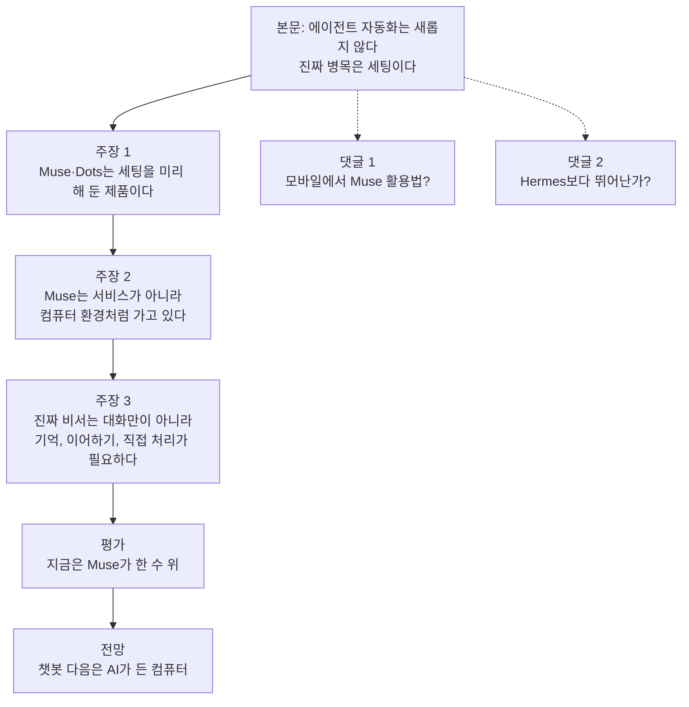
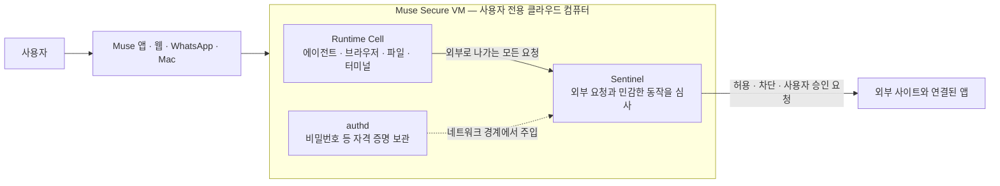
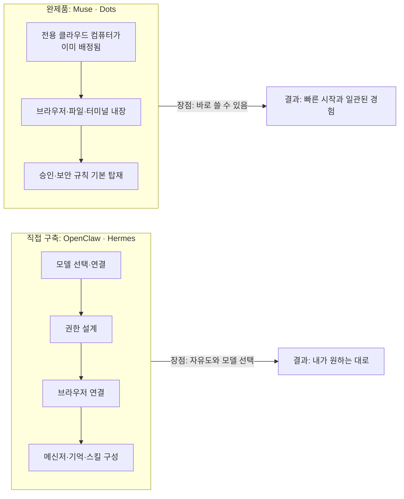
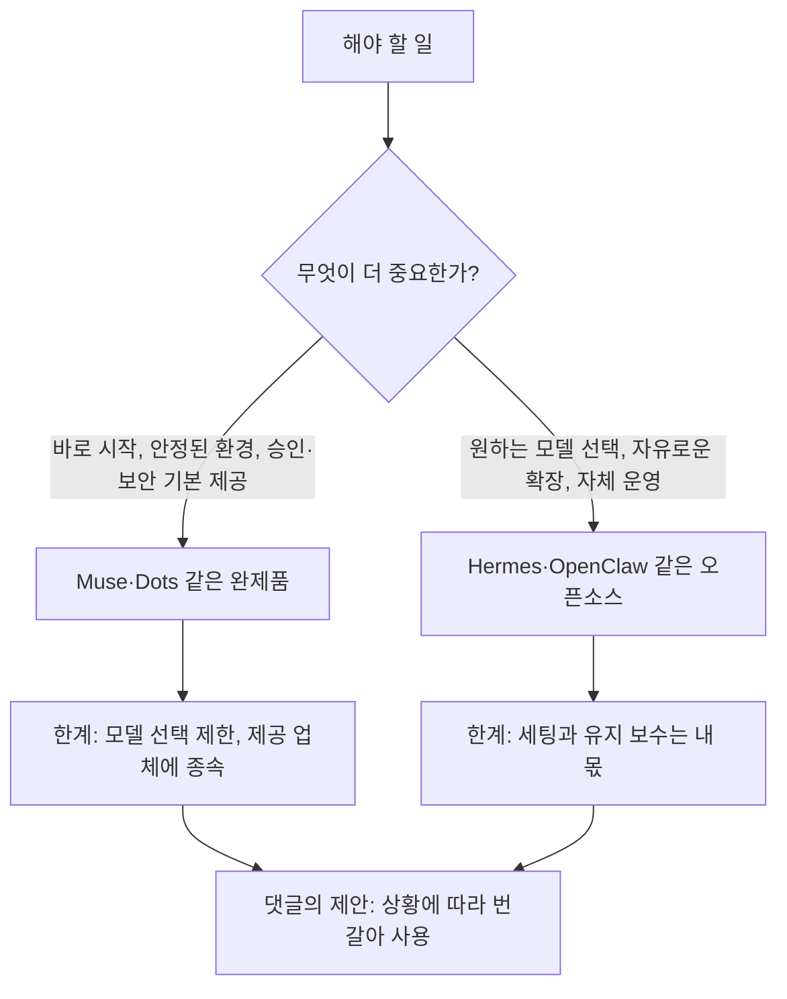
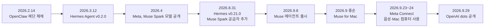

- 작성 기준일: 2026년 10월 4일
- 대상: 스레드(Threads)에 올라온 AI 에이전트 비교 글 1건과 그 아래 댓글 문답 2건
- 원칙: 공개된 자료로 확인되는 내용은 사실로, 글쓴이의 주관적 평가와 예측은 의견으로 분리해 서술했습니다. 확인하지 못한 부분은 확인하지 못했다고 적었습니다.

> 
> OpenClaw나 Hermes 만져본 입장에선 에이전트 자동화가 새롭진 않다. 브라우저 열고 파일 만지고 코드 돌리는 거, 결국 AI한테 컴퓨터 쓰게 만드는 거니까.
> 
> 문제는 세팅이다. 모델 붙이고 권한 잡고 브라우저 연결하고. 하나 꼬이면 원인 찾기도 쉽지 않다.
> 
> 그래서 Muse나 Dots가 나온다. 쓸 만한 기능 미리 세팅해놓고 바로 쓰게 만드는 거지.
> 
> Muse 써보면서 드는 생각은, 이게 서비스가 아니라 하나의 컴퓨터 환경처럼 가고 있다는 거다. 커스텀 Linux에 AI, 브라우저, 파일, 터미널까지.
> 
> AI가 진짜 비서가 되려면 대화만 잘해선 안 된다. 뭘 자주 하는지 알고, 이전 작업 이어가고, 필요하면 직접 처리해야 한다. AI가 머물 작업 환경이 있어야지.
> 
> 둘 다 써보면 지금은 Muse가 한 수 위다. 자동화도 잘 되고, 뭘 하고 있는지 화면으로 볼 수 있다는 게 크다.
> 
> 챗봇 다음은 AI 앱이 아니라, AI가 들어있는 컴퓨터에 더 가까울지도 모른다.
> 
> https://www.threads.com/share/BBfBveYygY/
> 

---

## 1. 먼저 한 문단으로 요약하면

이 글은 "AI에게 컴퓨터를 쓰게 만드는 일(에이전트 자동화)" 자체는 이미 OpenClaw나 Hermes 같은 오픈소스 도구로 해 본 사람에게 새롭지 않다는 말로 시작합니다. 진짜 문제는 기능이 아니라 세팅이라고 짚습니다. 모델을 붙이고, 권한을 잡고, 브라우저를 연결하는 과정에서 하나라도 꼬이면 원인을 찾기 어렵다는 것입니다. 그래서 필요한 기능을 미리 갖춰 놓고 바로 쓰게 해 주는 상품, 즉 Meta의 Muse와 (문맥상) OpenAI의 Dots가 등장했다고 설명합니다. 글쓴이는 Muse를 직접 써 보니 단순한 서비스가 아니라 "AI가 살 수 있는 컴퓨터 환경"에 가까워지고 있다고 느꼈고, 두 제품 가운데서는 지금 Muse가 한 수 위라고 평가합니다. 결론은 "챗봇 다음 단계는 AI 앱이 아니라 AI가 들어 있는 컴퓨터일지도 모른다"는 전망입니다.

댓글 두 개는 이 주장을 실사용 관점에서 보충합니다. 하나는 "모바일에서는 Muse를 쓸 데가 없는데 활용법이 있느냐"는 질문과 그에 대한 답이고, 다른 하나는 "Hermes보다 뛰어나냐"는 질문과 그에 대한 답입니다.

---

## 2. 글의 구조 한눈에 보기

본문은 "문제 제기 → 해결책의 등장 → 직접 써 본 인상 → 비교 평가 → 전망"의 순서로 짜여 있습니다. 댓글은 글쓴이가 본문에서 던진 생각을 구체적인 사용 사례와 선택 기준으로 풀어 주는 역할을 합니다.

---

## 3. 등장하는 이름들 정리

본문에는 설명 없이 제품 이름이 연달아 나오기 때문에, 먼저 각각이 무엇인지 정리하겠습니다.

### 3-1. OpenClaw

오픈소스 개인용 AI 에이전트입니다. 사용자의 컴퓨터나 서버에 "Gateway"라는 중심 프로세스를 띄워 두고, 여기에 AI 모델, 메신저 채널, 도구, 브라우저 제어, 앱을 연결하는 구조입니다. 한 비교 글은 이 프로젝트가 Peter Steinberger가 만든 Moltbot에서 출발했고 2026년 2월 14일부터 재단 체제로 운영된다고 설명합니다. 공식 릴리스 기준으로 2026년 9월 23일에 공개된 2026.9.6이 최신 안정 버전으로 확인되며, 9월 한 달에만 안정 릴리스가 여섯 번 나올 만큼 업데이트가 빠릅니다. 이 글의 표현을 빌리면 "내가 직접 설치하고 관리하는" 도구입니다.

### 3-2. Hermes (Hermes Agent)

AI 연구 조직 Nous Research가 만든 오픈소스(MIT 라이선스) 에이전트입니다. 가장 큰 특징은 "스스로 개선되는 학습 루프"입니다. 일을 하면서 스킬(재사용 가능한 절차)을 스스로 만들고, 세션을 넘어 기억을 유지하며, 크론(예약 실행) 작업도 돌립니다. 사용할 모델을 자유롭게 고를 수 있어서 Nous Portal, OpenAI, Anthropic, 로컬 모델 등을 바꿔 끼울 수 있습니다. 공식 릴리스 페이지에 따르면 2026년 9월 24일에 v0.21.5가 나왔고, 8월 말 v0.21.0부터는 Meta Model API(Muse Spark)가 기본 제공 공급자 플러그인으로 들어갔습니다. 즉 Muse를 움직이는 모델 계열도 Hermes에 연결해 쓸 수 있습니다. 또한 이전 버전부터 OpenAI Codex 인증을 공급자로 지원해 왔습니다.

### 3-3. Muse (Meta)

Meta가 2026년 9월 8일에 공개한 개인용 AI 에이전트입니다. 단순히 답변하는 챗봇이 아니라 이메일 발송, 여행 예약, 양식 작성, 요금 협상, 승인된 결제 같은 일을 대신 처리하고, 앱을 닫은 뒤에도 일을 계속하는 것을 내세웁니다. 모델은 Meta의 Muse Spark 계열입니다. 자세한 구조는 4장에서 다룹니다.

### 3-4. Dots (OpenAI)

글에는 회사 이름이 적혀 있지 않습니다. 다만 "Muse나 Dots"라고 나란히 묶어 부르는 문맥, 그리고 시기상 2026년 9월 29일 OpenAI DevDay에서 발표된 상시 가동형 에이전트 "dots"를 가리키는 것으로 보입니다. 이름이 같은 다른 앱(콘텐츠 큐레이션 앱 등)도 존재하므로, 이 연결은 문맥에 근거한 해석이라는 점을 밝혀 둡니다. 자세한 내용은 5장에서 다룹니다.

### 3-5. 댓글에 나오는 용어

- **하네스(harness)**: 모델 자체가 아니라, 모델을 감싸서 도구를 호출하고 권한을 관리하고 작업 흐름을 이끄는 실행 틀을 말합니다. "같은 모델이라도 어떤 하네스에 넣느냐에 따라 성능이 달라진다"는 것이 최근 에이전트 분야의 핵심 관점입니다.
- **툴콜링(tool calling)**: 모델이 검색, 파일 편집, 브라우저 조작 같은 외부 도구를 정확히 골라 호출하는 능력입니다.
- **코덱스(Codex)**: OpenAI의 코딩 에이전트입니다.

---

## 4. Muse를 사실 중심으로 자세히 보기

### 4-1. 무엇이 "컴퓨터 환경"이라는 말인가

글쓴이가 "커스텀 Linux에 AI, 브라우저, 파일, 터미널까지"라고 쓴 부분은 실제 공개된 구조와 맞아떨어집니다. Meta는 사용자마다 "Muse Secure VM"이라는 전용 클라우드 컴퓨터를 하나씩 배정한다고 설명합니다. 이 컴퓨터는 격리된 리눅스 가상 머신이며 자체 브라우저를 갖고, 코드를 컴파일하고, 사용자가 만든 스킬을 개발하고, 여러 하위 에이전트를 동시에 돌리고, 예약 작업을 실행할 정도의 CPU·메모리·저장소를 갖췄습니다. 보도에 따르면 사용자당 2 vCPU와 8GB 메모리 수준의 샌드박스이고, Meta의 David Singleton은 책상 밑에 놓인 실제 컴퓨터로 할 법한 일을 거의 다 할 수 있게 설계했다고 말했습니다. 사용자는 소프트웨어를 설치하고 코드를 쓰고 웹을 탐색할 수 있습니다.

글쓴이가 말한 "뭘 하고 있는지 화면으로 볼 수 있다"와 관련해 확인되는 사실은, 앱의 라이브러리 탭에 파일 탐색기가 있어서 시스템 파일부터 Muse가 추론 과정에서 만든 마크다운 파일까지 열어 볼 수 있다는 점입니다. 작업 과정을 사용자가 들여다볼 수 있게 한 설계입니다. 다만 브라우저 조작 장면을 실시간 영상처럼 보여 주는지는 제가 확인한 자료에 명시되어 있지 않았습니다. 이 부분은 글쓴이의 사용 경험으로 받아들이는 것이 정확합니다.

### 4-2. 안전 장치: Sentinel과 격리 구조

개인 계정에 로그인하고 결제까지 하는 에이전트라면 보안이 핵심입니다. Meta가 밝힌 구조를 정리하면 다음과 같습니다.

핵심은 두 가지입니다. 첫째, 에이전트가 자유롭게 움직이는 작업 공간(Runtime Cell)과 민감한 통제 기능이 분리되어 있습니다. 둘째, 비밀번호나 결제 수단은 모델이 직접 보지 못하고 네트워크 경계에서 별도 프로세스가 주입합니다. Meta의 Alexandr Wang도 에이전트가 실제 비밀번호나 결제 정보를 보지 않는다고 말했습니다. 외부로 나가는 요청과 연결된 앱의 동작은 Sentinel이 허용·차단·사용자 승인으로 가르며, 에이전트가 이를 무시할 수 없다고 설명됩니다.

이것이 본문의 "세팅" 문제와 직접 연결됩니다. 오픈소스 도구에서는 권한 범위, 비밀 값 관리, 브라우저 연결을 사용자가 직접 설계해야 합니다. Muse는 이를 제품 안에 미리 구현해 둔 형태입니다.

### 4-3. 가격과 제공 지역

- 가격: 대부분의 일상적 사용은 무료이고, 사용량에 따라 Power(월 20달러)와 Max(월 100달러) 구독이 있습니다. Meta 도움말을 인용한 한 보도는 Power가 주당 5억 토큰, Max가 주당 30억 토큰이라고 정리했습니다. 가입 시 결제 카드 등록이 필요하다고 전하는 매체도 있습니다.
- 광고: 출시 시점에는 제품 내 광고가 없고, Meta는 대화가 광고 시스템과 공유되지 않는다고 밝혔습니다. Wang은 구독이 컴퓨팅 비용을 충당하기 위한 것이고, 커머스를 추가 수익원으로 보고 있다고 말했습니다.
- 지역: 출시 때는 미국 한정, 만 18세 이상이었습니다. 9월 말 시점의 한 정리 글은 미국과 캐나다로 표기합니다. 제가 확인한 자료 어디에도 한국이 제공 지역으로 언급되지는 않았습니다. 한국에서의 이용 가능 여부와 방법은 직접 확인이 필요합니다.
- 접속 경로: iOS·Android 앱, 웹(muse.ai), WhatsApp, 그리고 9월 중순 출시된 Mac 앱입니다.

### 4-4. 최근 업데이트 (Meta Connect 2026, 9월 23~24일)

- 음성 모드: 길게 대화하는 동안에도 Muse가 백그라운드에서 일을 처리하고, 목소리를 말로 설명해 바꿀 수 있다고 소개되었습니다. 다만 일부 자료는 영상 대화·아바타의 제공 시점이 아직 정해지지 않았다고 구분해 전하므로, 기능별 출시 상태는 앱에서 확인하는 것이 안전합니다.
- Mac 앱의 컴퓨터 사용: 사용자의 허락 아래 Mac의 어떤 앱이든 조작할 수 있게 되었습니다. 클라우드 VM 밖, 내 컴퓨터까지 작업 범위가 넓어진 것입니다.
- Muse 전용 이메일 주소(곧 제공), 1,500개 이상의 연결 앱, 쇼핑 연동 확대, AI 안경 지원 예고, 휴대용 기기 Muse Charm 공개. Wang은 더 강력한 모델을 예고하기도 했습니다.

---

## 5. Dots(OpenAI)를 사실 중심으로 자세히 보기

OpenAI는 2026년 9월 29일 샌프란시스코 DevDay에서 "dots"를 공개했습니다. 보도된 내용을 모으면 다음과 같습니다.

- 성격: 채팅창을 닫아도 계속 일하는 상시 가동형 개인 에이전트입니다. 이름을 붙여 개인화할 수 있습니다.
- 모델: 플래그십 모델 GPT-6 Astra 기반입니다.
- 구조: 각 dot이 자체 클라우드 컴퓨터와 브라우저를 받습니다. 사용자가 원하면 언제든 dot의 컴퓨터에 들어가 작업을 확인할 수 있습니다. 이 점은 글쓴이가 Muse의 장점으로 꼽은 "과정을 볼 수 있다"와 같은 방향의 설계라서, 이 항목만으로 두 제품의 우열을 가르기는 어렵습니다.
- 연결: 플러그인으로 4,000개 이상의 앱·서비스와 연결되고, ChatGPT뿐 아니라 Slack, Microsoft Teams, 문자, 전화(음성 통화)로도 대화할 수 있습니다.
- 안전: 사용자가 접근 가능한 앱과 독립적으로 할 수 있는 동작의 범위를 정하고, 필수 승인 규칙을 걸 수 있습니다. 비밀번호 변경 같은 민감한 동작은 에이전트에게 허용되지 않으며, 저장된 비밀번호로 로그인하되 그 값을 모델에 노출하지 않는다고 합니다. 그럼에도 OpenAI는 중요한 결과물은 반드시 검토하라고 경고합니다.
- 제공 대상: 출시 시점에는 ChatGPT Pro, Business Premium 사용자에게 기본 dot 하나가 주어지고, Enterprise는 베타입니다. 여러 dot 관리는 이후 지원 예정입니다. 비즈니스·엔터프라이즈 작업 내용은 기본적으로 학습에 쓰지 않으며, 개인 요금제는 학습 활용을 끌 수 있습니다.

발표가 9월 29일이므로 글쓴이가 Dots를 써 본 기간은 길어야 며칠입니다. "둘 다 써 보면 지금은 Muse가 한 수 위"라는 평가는 이 짧은 비교 기간과, 제공 대상이 유료 상위 요금제에 한정되어 있다는 조건 위에서 나온 인상으로 읽는 것이 적절합니다.

---

## 6. 본문 문장별 해설

### "에이전트 자동화가 새롭진 않다 — 결국 AI한테 컴퓨터 쓰게 만드는 거니까"

맞는 말입니다. OpenClaw와 Hermes는 이미 브라우저 제어, 파일 조작, 코드 실행을 제공해 왔습니다. 새로운 것은 능력이 아니라 포장 방식입니다.

### "문제는 세팅이다"

오픈소스 에이전트를 직접 운영해 본 사람이면 공감할 대목입니다. 모델 공급자 연결, 인증, 권한, 브라우저 자동화 의존성, 메신저 연동은 각자 따로 고장 날 수 있고, 증상이 한곳에서 나타나도 원인은 다른 곳에 있는 경우가 많습니다. 실제로 오픈소스 저장소의 이슈 게시판에는 설정 점검 도구(`hermes doctor`, `openclaw doctor --fix`)가 필요할 만큼 환경 문제가 흔하다는 흔적이 보입니다.

### "그래서 Muse나 Dots가 나온다"

"미리 세팅해 놓고 바로 쓰게 만든다"는 설명은 제품 구조와 일치합니다. 두 제품 모두 전용 클라우드 컴퓨터, 브라우저, 연결 앱, 승인 규칙을 한 묶음으로 제공합니다. 이 설명은 인과를 단정한 것이 아니라 제품 포지셔닝에 대한 글쓴이의 해석이라는 점은 알아 두면 좋습니다.

### "서비스가 아니라 하나의 컴퓨터 환경처럼 가고 있다"

전체 글의 핵심 통찰입니다. 한 분석 글도 같은 흐름을 짚으며, 앞으로 개인용 AI가 "추론 엔진"과 "에이전트 컴퓨터"라는 교체 가능한 두 층으로 나뉠 수 있다고 봤습니다. 추론 엔진은 어느 회사 모델이든 될 수 있고, 에이전트가 사는 컴퓨터가 제품의 본체가 된다는 시각입니다.

### "AI가 진짜 비서가 되려면 대화만 잘해선 안 된다"

글쓴이는 세 가지 조건을 듭니다. (1) 내가 뭘 자주 하는지 안다, (2) 이전 작업을 이어간다, (3) 필요하면 직접 처리한다. 이는 기억, 지속성, 실행 능력이라는 세 요소로 정리됩니다. 이 세 가지는 Hermes가 내세우는 학습 루프·기억·예약 실행, Muse와 dots가 내세우는 상시 가동·목표 관리와 맞닿아 있습니다. 여기서 "AI가 머물 작업 환경"이라는 표현이 앞의 "컴퓨터 환경" 주장과 이어집니다.

### "지금은 Muse가 한 수 위다"

이 문장은 글쓴이의 주관적 비교입니다. 객관적으로 검증된 순위가 아닙니다. 두 제품이 모두 공개된 지 몇 주, 며칠인 시점이고 같은 조건에서 비교한 공개 벤치마크도 제가 찾은 범위에서는 없었습니다. 글쓴이가 근거로 든 "자동화가 잘 된다", "무엇을 하는지 볼 수 있다"는 사용 인상은 참고할 가치가 있지만, 본인의 사용 방식과 요금제 조건에서 다시 확인해 보는 것이 좋습니다.

### "챗봇 다음은 AI 앱이 아니라, AI가 들어 있는 컴퓨터에 더 가까울지도"

"~일지도 모른다"라는 어미에서 보듯 단정이 아니라 전망입니다. 다만 이 방향성을 뒷받침하는 객관적 정황은 많습니다. Meta는 Muse를 전용 클라우드 컴퓨터, Mac 앱의 컴퓨터 사용, 휴대용 기기까지 넓히고 있고, OpenAI도 dots에 자체 컴퓨터와 브라우저를 주었습니다. 한 오픈소스 프로젝트의 문서는 xAI의 Grok Bot, Manus 같은 제품도 "지속되는 클라우드 컴퓨터 위에서 일하는 에이전트"라는 같은 계열로 분류합니다.

---

## 7. 댓글 문답 해설

### 7-1. "모바일로는 Muse를 딱히 쓸 게 없는데 좋은 활용법이 있을까요?"

글쓴이의 답은 복권 당첨 자동 확인과 골프 예약을 모두 모바일에서 시켰으니 마이크를 적극 활용하라는 내용입니다. 이 답에는 두 가지 핵심이 담겨 있습니다.

첫째, 사례의 성격입니다. 복권 당첨 확인은 정해진 시점에 반복되는 일이고, 골프 예약은 웹사이트에서 여러 단계를 거치는 일입니다. 둘 다 "내가 앱을 열어 직접 하면 번거롭지만 말로 맡기면 되는 일"입니다. Muse가 사용자 전용 컴퓨터에서 예약 작업을 돌리고 브라우저를 조작할 수 있다는 공식 설명과 정확히 맞는 용도입니다. 다만 글쓴이가 어떤 방식으로 설정했는지는 댓글에 나와 있지 않습니다.

둘째, "마이크를 활용하라"는 조언입니다. 모바일에서 긴 지시문을 타자로 치는 것은 불편하므로 음성으로 맡기라는 뜻으로 읽힙니다. 다만 키보드의 받아쓰기를 말하는지, Muse의 음성 모드를 말하는지는 댓글만으로는 알 수 없습니다. 참고로 Meta는 Connect에서 대화 중에도 백그라운드로 일을 처리하는 음성 모드를 소개했습니다. 정리하면 모바일의 가치는 "스마트폰에서 앱을 쓰는 것"이 아니라 "말로 일을 던져 놓고 결과만 받는 것"에 있다는 관점입니다.

### 7-2. "Hermes보다 뛰어난가요?"

글쓴이의 답을 풀어 쓰면 이렇습니다.

1. **Hermes의 강점은 지능을 고를 수 있다는 점**입니다. Hermes는 여러 모델 공급자를 바꿔 끼울 수 있는 구조이고, 공식 릴리스 기록에도 OpenAI Codex 인증, Claude·ChatGPT·SuperGrok 계정 연동, Muse Spark 공급자 추가 등이 확인됩니다. 즉 "내가 원하는 두뇌"를 넣을 수 있습니다.
2. **Muse의 약점은 지능이 다소 떨어진다는 점**입니다. 이는 글쓴이의 체감 평가이며, 제가 확인한 범위에서 이를 객관적으로 입증하는 공개 비교는 없었습니다.
3. **Muse의 강점은 툴콜링과 에이전트 하네스가 잘 되어 있다는 점**입니다. 같은 모델이라도 하네스에 따라 결과가 크게 달라진다는 연구 결과가 이 관점을 뒷받침합니다. 장기 과제용 에이전트 벤치마크 논문(WildClawBench)은 하네스가 모델과 나란히 실제 성능을 좌우한다고 결론 냈고, 비교 대상 중 Hermes Agent가 네 모델 중 세 모델에서 가장 좋은 하네스였다고 보고했습니다. 이는 오히려 Hermes의 하네스도 강하다는 근거이므로, Muse의 하네스가 더 낫다는 글쓴이 주장은 별도의 직접 비교로 확인되어야 합니다.
4. **현재는 무료이지만 높은 지능이 들어간 버전은 유료화할 것으로 보인다**는 부분은 예측입니다. 확인되는 사실은 이렇습니다. 지금도 Muse에는 무료 구간과 사용량 기준 유료 요금제가 있습니다. 요금제는 모델 등급이 아니라 사용량으로 나뉜다고 소개되며, Meta는 더 강력한 모델을 예고했지만 그것이 유료 전용이 될지는 발표된 바 없습니다.
5. **그 전까지는 Hermes나 Codex와 지능을 교류해 가며 쓰라**는 조언은 실용적인 역할 분담입니다. Muse는 "일을 시키고 실행하는 환경", Hermes나 Codex는 "더 깊은 추론이 필요한 두뇌"로 번갈아 쓰라는 뜻으로 읽힙니다.

---

## 8. 흐름 파악을 위한 시간순 정리

글쓴이가 "OpenClaw나 Hermes를 만져본 입장"에서 쓴 글이라는 점이 이 흐름에서 이해됩니다. 오픈소스 에이전트가 먼저 대중화되어 "AI가 컴퓨터를 쓰는 일"을 보편화했고, 그 뒤를 대형 업체가 "세팅을 없앤 완제품"으로 따라붙은 순서입니다.

---

## 9. 한눈에 비교

| 구분 | OpenClaw | Hermes Agent | Muse (Meta) | Dots (OpenAI) |
|---|---|---|---|---|
| 성격 | 오픈소스 개인 에이전트 | 오픈소스, 자기 개선형 에이전트 | 완제품 개인 에이전트 | 완제품 상시 가동 에이전트 |
| 실행 위치 | 내가 운영하는 기기·서버 | 내가 운영하는 기기·서버(클라우드 호스팅 옵션도 있음) | Meta 클라우드의 전용 VM, Mac 앱 | OpenAI 클라우드의 전용 컴퓨터 |
| 모델 | 사용자가 선택 | 사용자가 선택(다수 공급자) | Muse Spark 계열 | GPT-6 Astra |
| 세팅 부담 | 큼 | 큼 | 작음 | 작음 |
| 강점 | 메신저·채널 연동, 확장성 | 학습 루프, 기억, 모델 선택 | 쉬운 시작, 보안 구조, 모바일·WhatsApp | 4,000개 이상 앱 연결, Slack·Teams 연동 |
| 비용 | 소프트웨어 무료(모델 비용 별도) | 소프트웨어 무료(모델 비용 별도) | 무료 구간 + 월 20/100달러 | ChatGPT Pro·Business Premium 등 상위 요금제 |
| 제공 범위 | 전 세계 설치 가능 | 전 세계 설치 가능 | 미국(및 캐나다 표기), 한국 언급 없음 | 지원 지역 한정 |

표의 값은 앞서 정리한 공개 자료에 근거했으며, 요금과 제공 지역은 자주 바뀌므로 이용 전에 공식 페이지를 다시 확인하시기 바랍니다.

---

## 10. 읽을 때 주의할 점

1. **사실과 의견을 구분해서 읽어야 합니다.** "Muse가 한 수 위", "지능이 떨어진다", "유료화할 것 같다"는 모두 글쓴이의 판단입니다. 반면 "Muse는 전용 리눅스 가상 머신에서 돌아간다", "dots는 자체 클라우드 컴퓨터를 갖는다"는 공개된 제품 설명으로 확인되는 사실입니다.
2. **제공 지역과 요금을 확인해야 합니다.** Muse는 미국 중심으로 출시되었고, 제가 본 자료에는 한국이 포함되어 있지 않았습니다. Dots도 상위 요금제와 지원 지역에 한정됩니다.
3. **완제품은 편한 대신 종속됩니다.** Muse와 dots는 각사의 클라우드와 모델 위에서만 돌아갑니다. 모델 선택의 자유와 데이터 위치의 통제를 중시한다면 Hermes·OpenClaw가 여전히 의미 있는 선택지입니다.
4. **에이전트는 실수할 수 있습니다.** OpenAI도 중요한 결과물은 검토하라고 경고합니다. 결제, 메시지 발송처럼 되돌리기 어려운 동작은 승인 규칙을 켜 두는 쪽이 안전합니다.
5. **보안 연구도 함께 보아야 합니다.** 오픈소스 에이전트를 대상으로 한 프롬프트 주입 공격 연구가 이미 나와 있습니다. 어떤 방식이든 에이전트에게 부여하는 권한의 범위가 곧 위험의 크기라는 점은 같습니다.

---

## 11. 결론

이 글이 말하려는 바를 한 줄로 줄이면 "AI의 경쟁력이 모델의 말솜씨에서, 그 모델이 일할 수 있는 환경으로 옮겨 가고 있다"입니다. OpenClaw와 Hermes가 그 가능성을 증명했다면, Muse와 dots는 그것을 누구나 설정 없이 쓰게 만드는 단계로 보입니다. 글쓴이의 실사용 경험은 Muse가 현재 앞선다는 쪽이지만, 이는 제품이 나온 지 얼마 되지 않은 시점의 개인 평가입니다. 댓글이 제안하듯 Muse 같은 완제품의 편리한 실행 환경과, Hermes·Codex처럼 고르는 두뇌를 상황에 맞게 섞어 쓰는 것이 지금으로서는 가장 현실적인 접근입니다.

---

## 참고 출처 (2026년 10월 4일 기준 검색)

**Muse**
- The Decoder, Meta's Muse agent gives every user a full cloud computer running Ubuntu Linux: https://the-decoder.com/metas-muse-agent-gives-every-user-a-full-cloud-computer-running-ubuntu-linux/
- CNBC, Meta personal AI agents 발표 보도: https://www.cnbc.com/2026/09/08/meta-personal-ai-agents-public-reckoning-privacy-safety.html
- AI Weekly, Muse Secure VM 구조 요약: https://aiweekly.co/alerts/meta-debuts-muse-ai-agent-that-runs-in-its-own-secure-vm
- Vellum, Official Muse Breakdown: https://www.vellum.ai/blog/official-muse-breakdown
- Edapt, Muse 작동 방식과 가격: https://www.edapt.me/blogs/meta-muse-personal-ai-agent-explained
- ChatMaxima, Muse 출시 정보 및 요금: https://chatmaxima.com/blog/meta-muse-ai-agent-businesses-whatsapp-messenger/
- AI Agents Library, 접근성과 지역 정리: https://www.aiagentslibrary.com/blog/meta-muse-ai/
- Fieldy, Muse 가격과 문제점: https://www.fieldy.ai/blog/meta-muse
- Zima, Muse Secure VM 해설: https://shop.zimaspace.com/blogs/tech-ai-hub/meta-muse-secure-vm-always-on-ai-agent
- Meta, Everything We Announced at Meta Connect 2026: https://www.meta.com/blog/meta-connect-2026-everything-we-announced/
- The Neuron, Connect 2026 정리: https://www.theneuron.ai/news/metas-big-ai-bet-now-fits-on-your-keychain/
- Meta, Introducing Muse Spark: https://about.fb.com/news/2026/04/introducing-muse-spark-meta-superintelligence-labs/

**Dots**
- VentureBeat: https://venturebeat.com/technology/openai-launches-dots-always-on-ai-agent-coworkers-and-chatgpt-space-where-they-can-collaborate-with-human-teams
- Technology.org: https://www.technology.org/2026/09/30/openai-dots-always-on-ai-agents-chatgpt/
- MobiDevices: https://mobidevices.com/en/openai-dots
- AI Weekly: https://aiweekly.co/alerts/openai-unveils-dots-always-on-personal-agents-at-devday

**Hermes / OpenClaw**
- Hermes Agent 공식 릴리스: https://github.com/NousResearch/hermes-agent/releases
- Hermes v0.14.0 릴리스 노트: https://github.com/NousResearch/Hermes-Agent/releases/tag/v2026.5.16
- Turing Post, Hermes Agent vs OpenClaw: https://www.turingpost.com/p/hermes
- Parallel, OpenClaw vs Hermes 비교: https://parallel.ai/articles/openclaw-vs-nousresearch-hermes
- innFactory, 두 프레임워크 비교: https://innfactory.ai/en/blog/openclaw-vs-hermes-agent-comparison/
- BetterClaw, OpenClaw 최신 버전: https://www.betterclaw.io/blog/openclaw-latest-version
- WildClawBench (하네스 비교 논문): https://arxiv.org/pdf/2605.10912
