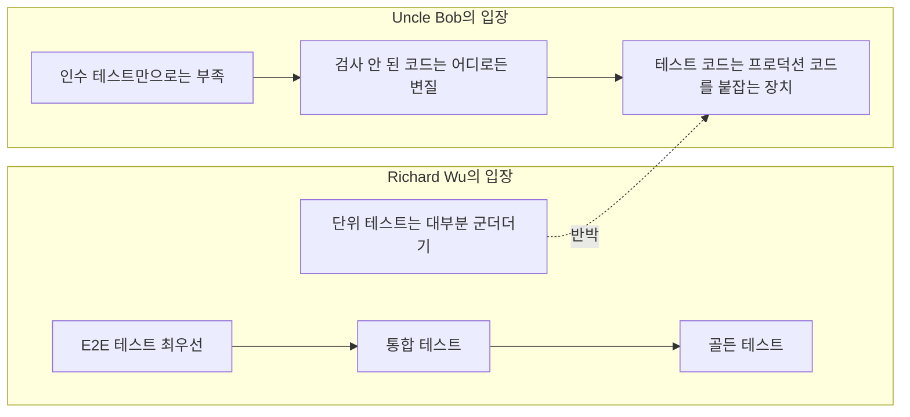
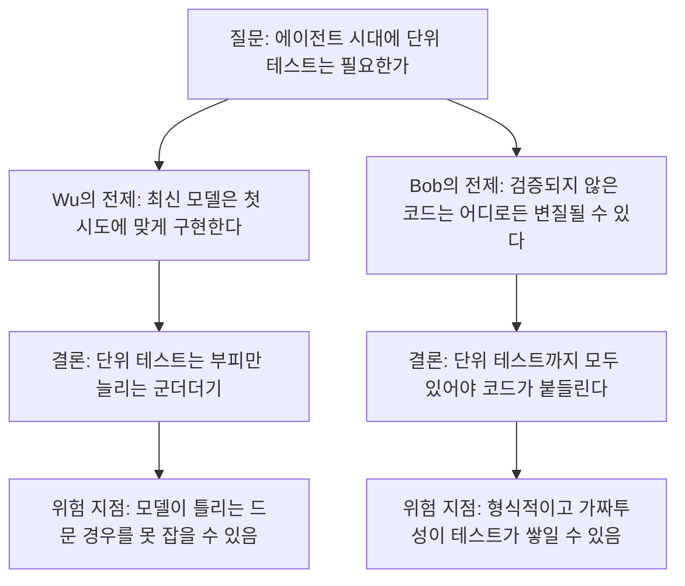
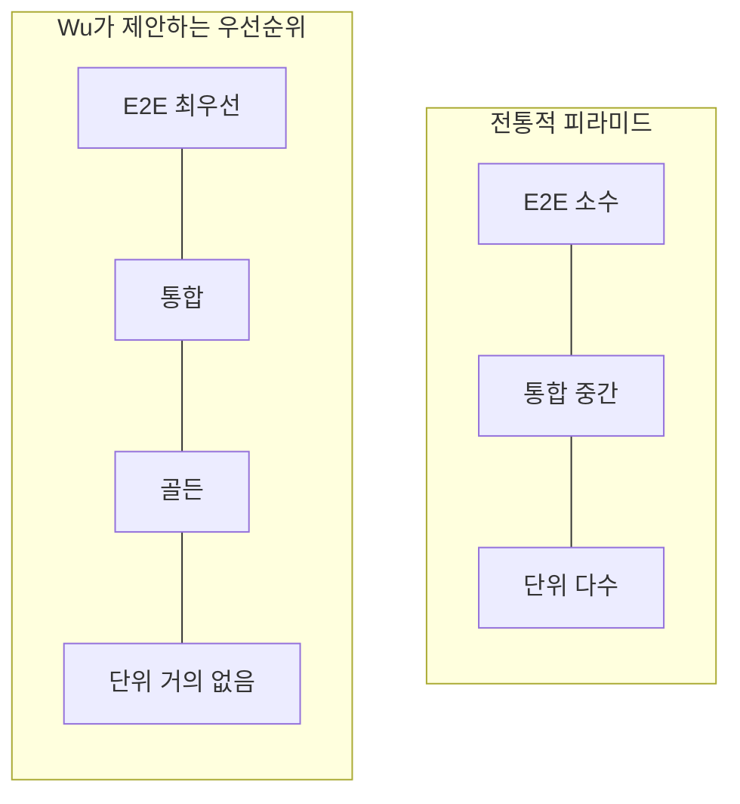
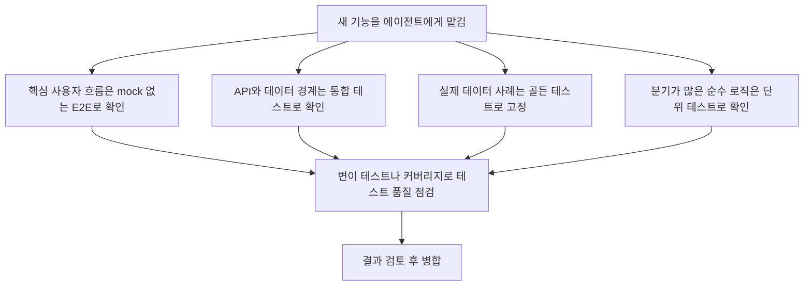

## Richard Wu vs Uncle Bob Martin 논쟁 완전 해설

- 작성 기준일: 2026-10-04
- 이 문서는 두 사람의 X(구 트위터) 게시글 원문(사용자 제공)과, 웹 검색으로 확인한 관련 자료를 바탕으로 작성했습니다. 확인되지 않은 내용은 "해석" 또는 "확인되지 않음"으로 구분해 적었습니다.

> https://x.com/0xrwu/status/2106160407576490289
> 
> IMO the only tests you should have in the age of coding agents are, in order of priority:
> 1. Full E2E tests. Nothing mocked out at all. Can even be something that runs in prod on test accounts via Playwright or equivalent.
> 2. Integration tests. Agents make more mistakes as things bleed between data/API boundaries where schemas can drift.
> 3. Golden tests. This helps ground the code with real examples of data, and can be used as regressions against edge cases.
> 
> Unit tests are bloat 99% of the time if you’re using a frontier model since they’re smart enough now to get the implementation (and subsequent iterations) right on the first shot, so they only add bloat at this point.
> 

—-
> https://x.com/unclebobmartin/status/2106352027299115501
> 
> That’s an old argument that goes way back into the early 2000s. Lots of people frustrated with test driven development said all we really need are acceptance tests. The problem with that is that acceptance tests and integration tests leave an awful lot of the code uncovered. And uncovered code can go in any direction that remains unchecked.
> 
> The bloat argument is a red herring. The production code doesn’t bloat. The test code is the vice that keeps the production code stable. And those tests are cheap.
> 

---

## 1. 한눈에 보기

이 글은 "AI 코딩 에이전트가 코드를 써 주는 시대에도 단위 테스트(unit test)가 필요한가?"라는 질문을 두고 오간 두 개의 게시글을 다룹니다.

**첫 번째 글: Richard Wu (@0xrwu)**
코딩 에이전트 시대에 가져야 할 테스트는 우선순위 순서대로 세 가지뿐이라고 주장합니다.

1. 아무것도 mock(가짜로 대체)하지 않는 완전한 E2E(End-to-End) 테스트
2. 통합(integration) 테스트
3. 골든(golden) 테스트

그리고 최신 수준(frontier)의 모델을 쓴다면 단위 테스트는 99%의 경우 "bloat(군더더기)"라고 말합니다. 모델이 이미 똑똑해서 구현과 이후의 수정까지 첫 시도에 맞게 해내므로, 단위 테스트는 부피만 늘린다는 논리입니다.

**두 번째 글: Uncle Bob Martin (@unclebobmartin)**
이 반박 글의 요지는 다음과 같습니다.

- 이것은 2000년대 초반부터 있었던 오래된 논쟁이다. 당시 TDD(테스트 주도 개발)에 좌절한 사람들이 "인수 테스트(acceptance test)만 있으면 된다"고 했다.
- 문제는 인수 테스트와 통합 테스트가 코드의 상당 부분을 검사하지 못한 채 남긴다는 것이다. 검사되지 않은 코드는 확인받지 않은 어느 방향으로든 변질될 수 있다.
- "bloat" 논거는 헛다리(red herring)다. 늘어나는 것은 테스트 코드이지 프로덕션 코드가 아니다. 테스트 코드는 프로덕션 코드를 안정되게 붙잡아 두는 "바이스(vise, 조임 도구)" 같은 것이고, 그 테스트는 만들기도 싸다.

즉 한쪽은 "테스트를 줄여 군살을 빼자", 다른 쪽은 "테스트야말로 코드를 붙잡는 장치이니 줄이면 위험하다"고 말하는 셈입니다.

---

## 2. 먼저 용어부터: 테스트 종류를 쉽게 이해하기

논쟁을 이해하려면 테스트 종류의 차이를 알아야 합니다. 아래 설명은 일반적인 소프트웨어 공학 정의를 쉽게 풀어 쓴 것입니다.

### 2.1 단위 테스트 (Unit test)

함수 하나나 클래스 하나처럼 아주 작은 단위를, 주변 요소와 떼어 놓고 검사하는 테스트입니다. 예를 들어 "할인율을 계산하는 함수에 10000원과 20%를 넣으면 8000원이 나오는가?"를 확인하는 식입니다. 빠르고 실패 원인을 좁히기 쉽다는 것이 장점입니다. 다만 주변을 mock으로 대체하는 경우가 많아서, 실제로 부품들이 맞물려 동작하는지는 알려주지 못합니다.

Uncle Bob 본인의 정의(그의 블로그 "First-Class Tests")에 따르면 단위 테스트는 프로그래머가 "프로덕션 코드가 내가 기대한 대로 동작하는지" 확인하려고 쓰는 테스트이고, 인수 테스트는 비즈니스 쪽이 "프로덕션 코드가 비즈니스가 기대한 대로 동작하는지" 확인하려고 쓰는 테스트입니다. 이 구분은 이번 논쟁의 핵심 배경입니다.

### 2.2 통합 테스트 (Integration test)

여러 부품이 실제로 맞물리는 지점을 검사합니다. 예를 들어 API 서버가 실제 데이터베이스와 대화하는지, 서비스 A가 서비스 B의 응답 형식을 제대로 해석하는지를 확인합니다. Richard Wu가 말한 "data/API 경계에서 스키마가 어긋나는(drift) 문제"를 잡는 것이 바로 이 층입니다.

### 2.3 E2E 테스트 (End-to-End test)

사용자가 앱을 쓰는 것과 같은 방식으로, 처음부터 끝까지 전체 흐름을 검사합니다. Wu가 언급한 Playwright는 실제 브라우저를 자동으로 조작하는 도구입니다. 로그인하고, 상품을 담고, 결제 화면까지 가는 과정을 사람이 클릭하듯 자동 실행하는 방식입니다. Wu는 "아무것도 mock하지 않는" 테스트, 심지어 운영(prod) 환경에서 테스트 계정으로 돌리는 것까지 허용 범위로 제시했습니다.

### 2.4 골든 테스트 (Golden test)

"정답으로 인정된 기준 결과"를 저장해 두고, 이후 실행 결과를 그것과 비교하는 방식입니다. 스냅샷 테스트와 비슷한 발상입니다. Wu의 글에서는 "실제 데이터의 사례로 코드를 땅에 고정(ground)시키고, 엣지 케이스에 대한 회귀(regression) 방지에 쓴다"고 설명되어 있으므로, 실제 데이터 기반의 기준 입출력 쌍으로 이해하면 됩니다. (참고로 UI 분야에서는 화면 렌더링 결과를 기준 결과물과 비교하는 의미로도 쓰이지만, Wu가 말한 용법은 데이터 기반으로 보는 것이 글의 문맥에 맞습니다.)

### 2.5 인수 테스트 (Acceptance test)

"이 기능이 고객이 원한 대로 동작하는가"를 확인하는 테스트입니다. 업무 요구사항 관점에서 "완료(done)"를 정의합니다. 구현 방식은 E2E와 겹칠 수 있지만, 누가 어떤 목적으로 쓰느냐에 초점을 둔 개념입니다.

### 2.6 그 밖에 알아둘 용어

| 용어 | 쉬운 설명 |
|---|---|
| mock | 진짜 대신 쓰는 가짜 부품. 예: 실제 결제 서버 대신 항상 "성공"을 돌려주는 가짜 |
| 스키마 드리프트 | 서로 주고받는 데이터의 형식이 한쪽만 바뀌어 어긋나는 현상 |
| 회귀(regression) | 예전에 잘 되던 것이 수정 후 다시 깨지는 일 |
| 커버리지(coverage) | 테스트가 실행해 본 코드의 비율 |
| 변이 테스트(mutation testing) | 코드를 일부러 조금씩 망가뜨려 보고, 테스트가 그 망가짐을 잡아내는지 확인하는 기법 |
| TDD | 테스트를 먼저 쓰고, 그 테스트를 통과시키는 코드를 쓰는 개발 방식 |

---

## 3. Richard Wu의 주장 자세히 읽기

### 3.1 주장의 구조

Wu의 글은 세 부분으로 나뉩니다.

1. **무엇을 남길 것인가**: E2E, 통합, 골든 테스트 순서.
2. **왜 그것들인가**: 각 항목마다 이유를 짧게 붙였습니다.
3. **무엇을 버릴 것인가**: 단위 테스트. 이유는 "최신 모델은 첫 시도에 구현과 이후 반복 수정까지 맞게 해내서, 단위 테스트는 부피만 늘린다"는 것입니다.

### 3.2 세 가지 테스트의 이유

**① E2E (아무것도 mock하지 않음)**
실제 환경과 가장 가까운 검증입니다. 사람이 쓰는 경로 그대로 돌려 보므로 "결국 제품이 동작하는가"에 대한 가장 직접적인 답을 줍니다. 운영 환경의 테스트 계정으로 돌리는 방식까지 언급한 것은, 가짜 환경이 아니라 진짜 환경에서 확인하겠다는 뜻으로 읽힙니다.

**② 통합 테스트**
Wu는 "에이전트는 데이터/API 경계에서 스키마가 어긋나는 곳에서 더 많은 실수를 한다"고 적었습니다. 즉 에이전트의 약점이 함수 내부 로직보다 부품 사이의 접점에 있다고 보는 것입니다. 이 접점을 확인하는 것이 통합 테스트입니다.

**③ 골든 테스트**
실제 데이터 사례를 기준으로 삼아 코드가 현실에서 벗어나지 않게 붙들고, 이미 발견한 엣지 케이스가 다시 깨지지 않도록 회귀 방지 장치로 씁니다.

### 3.3 단위 테스트에 대한 주장의 성격

여기서 한 가지 구분이 필요합니다. "단위 테스트는 99%의 경우 군더더기"라는 말은 Wu의 의견(IMO, "in my opinion")이며, 글 안에 이를 뒷받침하는 측정 자료는 제시되어 있지 않습니다. 이번 조사에서도 "99%"라는 수치를 입증하는 자료는 확인하지 못했습니다. 따라서 이 숫자는 사실 보고라기보다 강한 어조의 주관적 평가로 받아들이는 것이 정확합니다.

---

## 4. Uncle Bob의 반박 자세히 읽기

### 4.1 "오래된 논쟁이다"

Uncle Bob은 먼저 이 주장이 새롭지 않다고 말합니다. 2000년대 초반에 TDD가 번거롭다고 느낀 사람들이 "정말 필요한 것은 인수 테스트뿐"이라고 했었다는 것입니다. 이 역사 서술은 Uncle Bob 본인의 회고이며, 이 문서에서 별도 문헌으로 교차 검증하지는 못했습니다. 다만 그가 오래전부터 단위 테스트와 인수 테스트를 구분해 논해 온 것은 그의 과거 블로그 글들에서 확인됩니다. 예를 들어 그는 "TDD with Acceptance Tests and Unit Tests"라는 글에서 두 테스트가 같은 것을 검사하더라도 코드를 통과하는 경로가 다르다고 설명했습니다. 단위 테스트는 코드 깊숙이 들어가 독립된 단위를 검사하고, 인수 테스트는 훨씬 큰 통합 덩어리를 다룬다는 취지입니다.

### 4.2 핵심 논거 ①: 커버리지의 구멍

> 인수 테스트와 통합 테스트는 코드의 상당 부분을 검사하지 않은 채 남긴다. 그리고 검사되지 않은 코드는 확인되지 않은 어떤 방향으로도 갈 수 있다.

이것을 쉬운 예로 풀어 보겠습니다. (아래는 이해를 돕기 위한 가상의 예시입니다.)

> 쇼핑몰 결제 모듈에 "결제 서버가 응답하지 않을 때 재시도 후 주문을 취소하는 분기"가 있다고 합시다. 사용자 흐름을 따라가는 E2E 테스트는 보통 "결제 성공"이라는 정상 경로만 지나갑니다. 타임아웃 분기는 한 번도 실행되지 않습니다. 이 분기를 에이전트가 나중에 수정하다가 잘못 바꿔도, E2E 테스트는 계속 초록불일 수 있습니다.

Uncle Bob이 말하는 "uncovered code(커버되지 않은 코드)"의 위험이 바로 이런 것입니다. 테스트가 실행해 보지 않은 코드는 바뀌어도 아무도 알아채지 못합니다.

### 4.3 핵심 논거 ②: bloat는 헛다리

> 프로덕션 코드는 bloat되지 않는다. 테스트 코드는 프로덕션 코드를 안정시키는 바이스(vise)다. 그리고 그 테스트는 싸다.

Wu의 "bloat"는 단위 테스트가 저장소에 쌓여 부피를 키운다는 뜻으로 읽힙니다. Uncle Bob은 이를 두 가지로 받아칩니다.

- 배포되는 프로덕션 코드가 비대해지는 것이 아니다. 늘어나는 것은 테스트 쪽이다.
- 테스트 코드는 프로덕션 코드가 멋대로 움직이지 못하게 잡아 주는 고정 장치이므로, 부피가 아니라 기능으로 평가해야 한다.
- 에이전트가 테스트를 써 주는 시대에는 테스트를 만드는 비용도 낮다.

### 4.4 Uncle Bob의 최근 실천: 코드를 읽지 않고 제약으로 둘러싼다

검색 결과, Uncle Bob은 이 논쟁 이전에도 에이전트와 일하는 방식을 공개적으로 밝혔습니다. 그의 X 게시글(검색 결과 기준 약 72일 전)에는 이런 취지의 내용이 있습니다.

- 자신은 에이전트가 쓴 코드를 읽지 않는 전략을 쓴다.
- 대신 에이전트를 "극단적인 제약"으로 둘러싼다. 단위 테스트, gherkin 테스트, QA 절차, 품질 지표, 변이 테스트, 테스트 커버리지 등이 포함된다.
- 에이전트가 이 모든 제약의 관문(gauntlet)을 통과해야 하므로 결과 코드에 높은 신뢰를 갖는다.

이 맥락을 알면 이번 반박이 더 잘 이해됩니다. 그의 방식은 "코드를 사람이 읽어서 검증하는 대신, 테스트와 지표가 검증을 대신하게 하는 것"입니다. 그렇다면 단위 테스트를 줄이자는 제안은 그가 신뢰의 근거로 삼는 제약의 한 층을 걷어내자는 말로 들렸을 것입니다. (이 연결은 두 게시글과 그의 이전 글을 종합한 해석입니다.)

---

## 5. 두 사람은 정확히 어디서 엇갈리는가

### 5.1 서로 다른 전제

두 주장은 사실상 서로 다른 전제 위에 서 있습니다.

- **Wu의 전제**: 모델의 구현 품질이 충분히 높다. 따라서 검증의 초점은 "내부 로직의 정확성"에서 "전체 동작과 경계 접합부의 정확성"으로 옮겨가야 한다.
- **Bob의 전제**: 구현이 지금 맞더라도 앞으로의 수정에서 어디가 어떻게 바뀔지 모른다. 변경을 감지하는 그물은 촘촘할수록 좋고, 그 비용(테스트 작성)은 에이전트 덕에 낮아졌다.

### 5.2 "비용"이라는 단어를 서로 다르게 쓴다

Wu가 말하는 비용은 "저장소에 쌓이는 군더더기와 그것을 유지하는 부담"에 가깝고, Bob이 말하는 비용은 "테스트를 만드는 데 드는 노력"에 가깝습니다. 같은 단어를 서로 다른 의미로 쓰고 있어서 논쟁이 엇갈리는 면이 있습니다. (해석)

### 5.3 실제로 둘 다 일리 있는 지점이 있다

관련 논의를 검색해 보면 두 사람의 우려가 모두 현실의 관찰과 닿아 있음을 볼 수 있습니다.

**Wu 쪽 우려를 뒷받침하는 관찰들**

- Uncle Bob의 에이전트 전략을 다룬 Hacker News 토론에서, 한 참여자는 에이전트가 쓰는 테스트가 사람이 쓴 형식적인 테스트처럼 "입력, 메서드, 부수효과를 너무 많이 가짜로 만들어서 사실상 아무것도 검사하지 않는다"고 적었습니다. 또 다른 참여자는 AI가 로직이 맞는지 확인하려고 테스트를 쓰는 것이 아니라, 이미 쓴 코드에 대해 테스트가 통과하도록 쓰는 것이 아닌지 걱정했습니다. 이는 개별 사용자의 의견이며 통계는 아닙니다.
- GitHub의 한 연구 이슈(deftai/directive #5141, 약 4일 전 게시)는 같은 에이전트가 구현과 단위 테스트를 한 루프에서 함께 쓰면, 테스트가 코드를 제약하는 대신 코드를 그대로 되풀이하는 "동어반복(tautological) 테스트"가 되기 쉽다고 정리했습니다. 이 이슈는 AI 도구 세션으로 수행한 조사를 정리한 문서로 보이므로, 정설이 아니라 참고 의견으로 다루는 것이 안전합니다. 같은 이슈는 OpenAI Codex 저장소의 정책이라며 "에이전트 변경에는 단위 테스트보다 통합 테스트를 선호한다"는 취지의 문구를 인용하고 있는데, 원본 정책 문서는 이번 조사에서 직접 확인하지 못했습니다.

**Bob 쪽 우려를 뒷받침하는 관찰들**

- 같은 HN 토론에서 Uncle Bob의 주장으로 소개된 내용 중에는 "변이 테스트를 쓰면 LLM이 버그 적은 코드를 만든다", "테스트는 더 나은 구조의 코드를 강제한다"가 있습니다. 이는 토론 참여자가 전달한 요약이므로 원문으로 확인된 인용은 아닙니다.
- 앞의 deftai 이슈는 에이전트가 쓴 단위 테스트가 통과해도 UAT/통합/E2E 단계에서는 실제 결함이 잡히는 사례가 있다고 적었습니다. 이는 "단위 테스트만으로는 부족하다"는 뜻이어서 Wu의 입장과 맞닿아 있습니다. 반대로 "그렇다고 단위 테스트가 쓸모없다"는 뜻은 아닙니다.

### 5.4 의외로 겹치는 부분

두 사람이 완전히 반대편에 있는 것은 아닙니다. 둘 다 다음에는 동의하는 것으로 읽힙니다.

- 에이전트가 쓴 코드는 자동화된 검증 없이 믿으면 안 된다.
- 테스트는 단순한 부속이 아니라 시스템의 일부로 다뤄야 한다. (Uncle Bob은 과거 글에서 테스트를 "일급 시민(first-class citizen)"으로 대하지 않아서 사람들이 단위 테스트를 포기하게 된다고 썼습니다.)

차이는 "어느 층에 얼마나 투자할 것인가"에 있습니다.

---

## 6. 테스트 피라미드 관점에서 보기

전통적인 모델은 아래가 넓은 피라미드입니다. 가장 많은 단위 테스트가 바닥에 있고, 위로 갈수록 통합, E2E 순으로 적어집니다.

검색으로 확인한 관련 자료에서는 이런 흐름이 보입니다.

- 한 테스트 전략 블로그(Autonoma 블로그, 약 181일 전)는 전통적 비율을 단위 70 : 통합 20 : E2E 10으로 소개하면서, AI 시대에는 50 : 30 : 20처럼 통합과 E2E의 비중을 키우는 권고를 제시했습니다. 이는 특정 업체 블로그의 권고이지 업계 표준이 아닙니다.
- "Testing Trophy"라는 모델은 통합 테스트를 가장 큰 비중으로 두는 방식이며, 한 에이전트용 스킬 문서는 이를 따라 "통합 테스트를 기본으로, 순수 함수에만 단위 테스트"를 지침으로 삼고 있습니다.

즉 "단위 테스트의 비중을 줄이고 통합/E2E의 비중을 늘리자"는 흐름 자체는 Wu 한 사람의 생각이 아니라 여러 곳에서 논의되고 있습니다. 다만 "단위 테스트를 거의 없애자"까지 가는 것은 Wu의 더 강한 주장입니다. (해석)

---

## 7. 에이전트 환경에서 특히 따져볼 쟁점들

### 7.1 누가 테스트를 쓰는가

에이전트가 구현과 테스트를 모두 쓰면, 테스트가 "요구사항의 독립적인 표현"이 아니라 "구현의 복사본"이 될 위험이 있습니다. 앞서 본 관찰들이 가리키는 문제입니다. 이 경우 단위 테스트의 개수가 아니라 품질이 핵심이 됩니다.

### 7.2 변이 테스트라는 품질 점검 장치

Uncle Bob이 제약 목록에 변이 테스트를 넣은 이유를 이 문제와 연결해 볼 수 있습니다. 코드를 일부러 조금씩 바꿨는데도 테스트가 계속 통과한다면, 그 테스트는 실질적인 검사를 하지 못하고 있다는 신호입니다. 형식적인 테스트를 걸러내는 방법으로 쓸 수 있습니다. (일반적인 변이 테스트의 원리에 기반한 설명입니다.)

### 7.3 속도와 피드백 주기

Uncle Bob은 과거 블로그("Test Time")에서 자신의 FitNesse 프로젝트를 예로 들었습니다. 약 72,000줄의 Java 코드 중 약 31,000줄이 단위 테스트이고, 인수 테스트도 약 300개가 있으며, 전체 컴파일/빌드/테스트에 노트북에서 약 1분 45초가 걸린다고 했습니다. 느린 테스트는 개발 루프에서 외면받기 쉽다는 것이 그의 평소 관점입니다. E2E 테스트는 일반적으로 단위 테스트보다 느리므로, E2E 중심 전략은 피드백 속도 면에서 부담이 될 수 있습니다. 반대로 에이전트가 백그라운드에서 오래 돌아도 괜찮은 환경이라면 이 부담은 줄어듭니다. (이 마지막 문장은 해석입니다.)

### 7.4 mock 없는 테스트의 현실적 비용

Wu가 말한 "아무것도 mock하지 않는 E2E"는 신뢰도가 높은 만큼 준비와 유지가 어렵습니다. 외부 서비스, 테스트 계정, 데이터 초기화, 불안정한(flaky) 실패 등의 문제가 따라옵니다. 실제로 최근 대형 오픈소스 저장소에서도 에이전트 호스트의 E2E·통합 테스트가 타임아웃과 경합(race) 때문에 불안정해져서, 이를 안정화하는 작업이 별도로 병합된 사례가 확인됩니다(microsoft/vscode PR #327421, 2026-07-25 병합). E2E는 강력하지만 거저 얻어지지 않는다는 점을 보여 주는 예입니다.

---

## 8. 정리: 두 관점을 함께 쓰는 현실적인 방법

아래는 두 주장과 확인된 자료에서 도출한 **참고용 조합안**이며, 특정 프로젝트에 대한 정답은 아닙니다. 프로젝트의 성격, 위험도, 팀 규모에 따라 달라질 수 있습니다.

핵심 아이디어를 풀어 쓰면 다음과 같습니다.

1. **흐름 전체는 E2E, 접합부는 통합 테스트로 지킨다.** 이것은 Wu의 우선순위와 일치하며, 에이전트가 자주 실수하는 지점을 직접 겨냥합니다.
2. **실제 데이터 사례는 골든 테스트로 남긴다.** 한 번 발견한 엣지 케이스가 다시 깨지는 것을 막습니다.
3. **단위 테스트는 "개수"가 아니라 "가치"로 고른다.** 순수 계산, 분기가 복잡한 규칙, 오류 처리처럼 E2E가 거의 지나가지 않는 경로가 대상입니다. 이 부분은 Uncle Bob이 말한 "검사 안 된 코드" 문제를 막는 용도입니다.
4. **테스트 자체의 품질을 점검한다.** 변이 테스트나 커버리지 같은 지표, 그리고 "mock으로 도배된 테스트 금지" 같은 규칙으로 동어반복 테스트를 걸러냅니다. 앞서 본 자료에서는 이런 테스트 정책을 AGENTS.md 같은 에이전트 지침 파일에 적어 에이전트가 따르게 하자는 제안이 있었습니다.
5. **보호해야 할 기준 테스트는 에이전트가 함부로 고치지 못하게 한다.** 같은 자료는 구현자가 가볍게 바꿀 수 없는 보호된 골든/픽스처 스위트를 제안했습니다. 에이전트가 테스트를 통과시키려고 테스트 자체를 고쳐 버리는 일을 막기 위한 것입니다.

---

## 9. 이 문서의 한계와 확인되지 않은 부분

- X 게시글 원문 페이지는 자동 접근이 차단되어 직접 열람하지 못했습니다. 두 게시글의 인용은 사용자가 제공한 원문 텍스트를 기준으로 했습니다.
- Wu의 "99%"와 "첫 시도에 맞게 구현한다"는 주장을 검증하는 정량 자료는 이번 조사에서 확인하지 못했습니다.
- Uncle Bob이 말한 "2000년대 초반의 인수 테스트 논쟁"은 그의 회고를 그대로 전달한 것이며, 별도 문헌으로 교차 검증하지 못했습니다.
- HN 토론과 GitHub 이슈의 내용은 개별 참여자와 작성자의 의견·정리이며, 학술적 연구 결과나 업계 통계가 아닙니다.
- 테스트 비율 권고(70/20/10, 50/30/20 등)는 특정 블로그의 주장이며 표준이 아닙니다.
- 이 논쟁은 이후 새로운 댓글이나 후속 글로 더 전개되었을 수 있습니다. 본 문서는 위 시점까지 검색으로 확인된 범위를 반영합니다.

---

## 10. 참고한 자료

- Richard Wu (@0xrwu) 게시글: https://x.com/0xrwu/status/2106160407576490289
- Uncle Bob Martin (@unclebobmartin) 반박 게시글: https://x.com/unclebobmartin/status/2106352027299115501
- Uncle Bob의 에이전트 활용 전략 게시글: https://x.com/unclebobmartin/status/2080257779395154409
- DEV Community, "What Uncle Bob's 'I Don't Read Code Anymore' Taught Me About Testing": https://dev.to/sleyn/what-uncle-bobs-i-dont-read-code-anymore-taught-me-about-testing-38c2
- Hacker News 토론 "Uncle Bob: It's Over": https://news.ycombinator.com/item?id=47998601
- GitHub 이슈 deftai/directive #5141: https://github.com/deftai/directive/issues/5141
- Uncle Bob, "First-Class Tests": https://blog.cleancoder.com/uncle-bob/2017/05/05/TestDefinitions.html
- Uncle Bob, "Test Time": https://blog.cleancoder.com/uncle-bob/2014/09/03/TestTime.html
- Uncle Bob, "TDD with Acceptance Tests and Unit Tests": https://sites.google.com/site/unclebobconsultingllc/tdd-with-acceptance-tests-and-unit-tests
- Autonoma, "Unit vs Integration vs E2E Testing": https://getautonoma.com/blog/unit-vs-integration-vs-e2e-testing
- Smithery, writing-tests 스킬: https://smithery.ai/skills/third774/writing-tests
- microsoft/vscode PR #327421: https://github.com/microsoft/vscode/pull/327421

---

작성 일자: 2026-10-04
