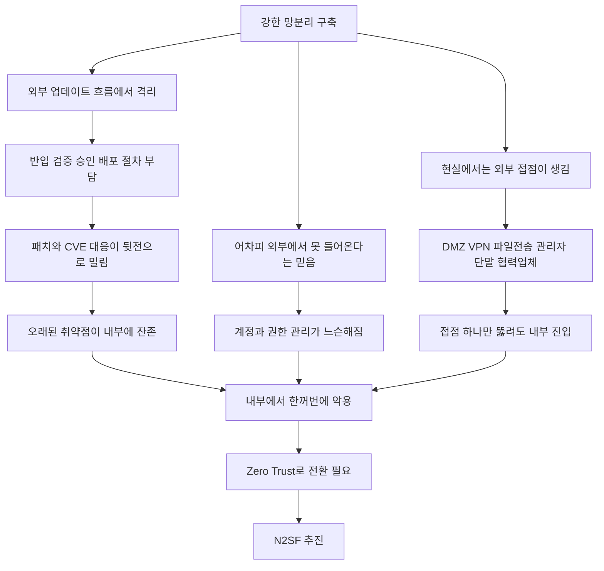
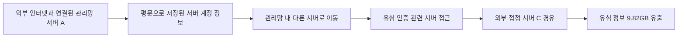
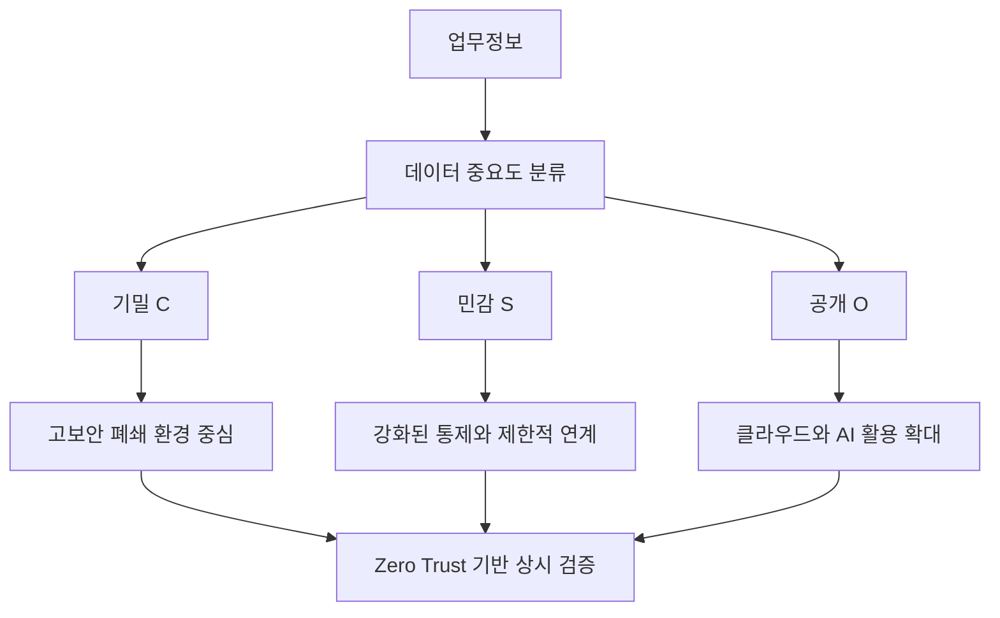
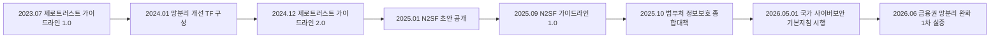
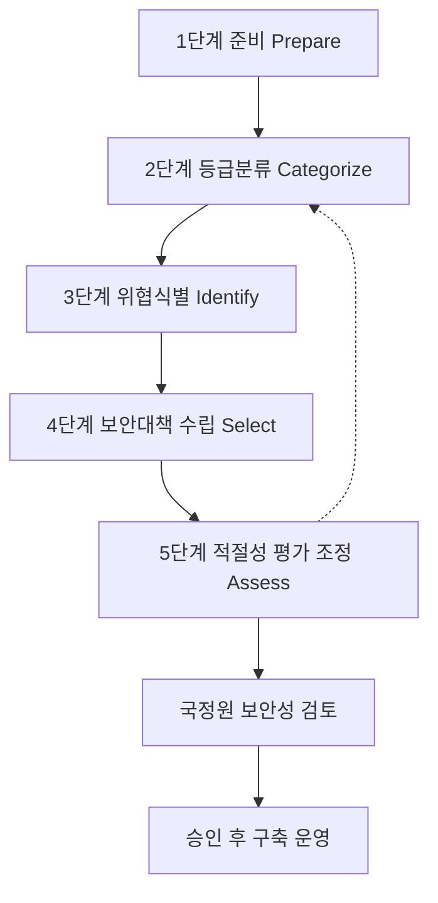
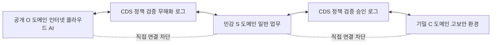
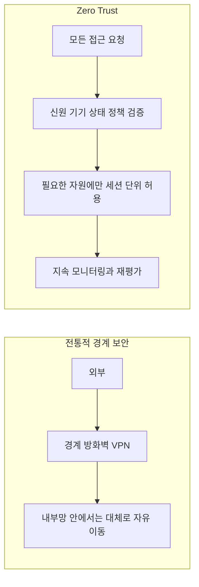
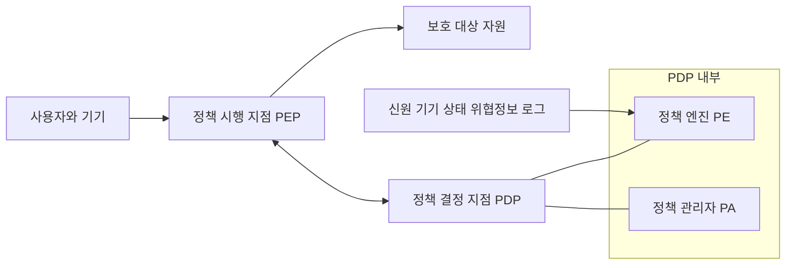
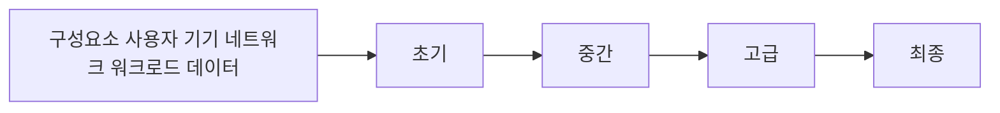

- 작성 기준일: 2026년 10월 4일
- 검토 대상: 한국의 망분리(폐쇄망) 보안 체계가 오히려 해킹의 원인이 되었다는 취지의 Threads 게시글(본문은 사용자가 붙여 넣은 텍스트를 기준으로 했으며, Threads 링크 자체는 직접 열람하지 않았습니다)

> 
> 현재 국내 각종 부처와 공공기관, 기업들이 반복해서 해킹당하는 이유 중 하나는 역설적으로 지난 10여 년간 철저하게 구축해온 폐쇄망 중심의 보안체계 때문이다.
> 
> 한국은 보안을 이유로 내부망과 외부망을 강하게 격리해왔다. 금융기관과 공공기관을 중심으로 시작된 망분리는 중견·대기업까지 광범위하게 자리 잡았다.
> 
> 문제는 그다음부터다.
> 인터넷을 막아버리니 내부 시스템은 세상과 함께 업데이트되기 어려워졌다. OS 업데이트, 라이브러리 패치, CVE 대응, 보안 솔루션 업데이트 하나에도 반입·검증·승인·배포 절차가 따라붙는다.
> 
> 시스템이 잘 돌아가면 결국 이런 일들은 뒷전으로 밀린다.
> 그렇게 외부에서는 이미 수년 전에 발견되고 패치된 취약점이 폐쇄망 안에서는 살아남는다. 계정과 권한 관리도 느슨해지기 쉽다. ‘어차피 외부에서 못 들어온다’는 믿음 때문이다.
> 
> 하지만 현실의 폐쇄망은 완전히 폐쇄되어 있지도 않다.
> 외부 데이터를 받아야 하고 유지보수도 해야 한다. 협력업체도 접속해야 한다.
> 
> 결국 DMZ, VPN, 파일전송 시스템, 관리자 단말 등 외부와 연결되는 통로가 생긴다.
> 
> 공격자는 이 중 하나만 뚫으면 된다.
> 일단 내부에 들어오면 오래된 OS와 라이브러리, 패치되지 않은 취약점, 과도한 관리자 권한, 허술한 계정 관리가 한꺼번에 공격자의 무기가 된다.
> 
> 성벽은 엄청나게 높게 쌓았는데 성벽 안의 방문들은 제대로 잠그지 않은 셈이다. 이것이 폐쇄망 보안의 가장 위험한 역설이다.
> 
> 세상과 격리하면 안전해질 것이라 생각했지만, 오랜 격리는 내부 보안을 낡게 만들 수 있다. 그리고 ‘폐쇄망이니까 안전하다’는 믿음은 그 낡음을 오랫동안 감춰준다.
> 
> 그래서 Zero Trust가 중요해졌다.
> 내부에 들어왔다고 믿어주지 않는다. 사용자도 검증하고 장비도 검증한다. 서버 간 접근도 확인하고 권한도 최소한으로 제한한다. 하나가 뚫려도 전체가 무너지지 않도록 만든다.
> 
> 물론 한국도 이제 Zero Trust와 N2SF를 추진하며 기존 망분리 체계를 바꾸기 시작하는 조짐이 보인다.
> 
> 하지만 이건 보안문제라기 보다는 최근 핫한 클로드나 챗지피티와 같은 AI  서비스를 쓰지 못해서 움직이는 것이기도 하다.
> 
> 그러면 망분리 정책을 좀 느슨하게 풀면서 했었어야 하지만 잘 알다싶이 아무도 변화에 대한 사건 사고들을 책임지기 싫으니 계속 미뤄왔던 것 뿐이다.
> 
> https://www.threads.com/share/_zX1pPYTv/
> 

---

## 목차

1. 이 글이 말하려는 것: 한 문장 요약과 논리 구조
2. 배경 지식: 망분리가 무엇이고 왜 생겼나
3. 주장 ① 폐쇄망은 시간이 지나면 낡는다
4. 주장 ② 폐쇄망은 실제로 완전히 닫혀 있지 않다
5. 실제 사고로 확인해 보기: SK텔레콤 사례
6. 주장 ③ 그래서 Zero Trust가 필요하다
7. 주장 ④ 한국도 N2SF로 바꾸기 시작했다: 이미 시행 중입니다
8. 주장 ⑤ AI 때문에 움직인 것이고, 책임을 피하려고 미뤘다
9. 2026년 10월 현재: 금융권의 연쇄 사고가 던지는 질문
10. 균형 잡기: 이 글이 놓치고 있을 수 있는 부분
11. 종합 정리
12. 근거의 확실성 구분표
13. 참고 자료

부록 A. N2SF 상세 해설

부록 B. Zero Trust 상세 해설

부록 C. N2SF와 Zero Trust의 관계, 그리고 본문 논지와 연결하기

---

## 1. 이 글이 말하려는 것: 한 문장 요약과 논리 구조

글쓴이의 핵심 주장은 이렇습니다. 한국은 지난 10여 년 동안 내부망과 외부망을 강하게 갈라놓는 망분리를 철저히 해 왔는데, 바로 그 철저함 때문에 내부 시스템이 세상의 보안 업데이트 흐름에서 떨어져 나가 낡아졌고, "어차피 밖에서 못 들어온다"는 믿음 속에서 계정과 권한 관리도 느슨해졌다는 것입니다. 그런데 현실의 폐쇄망은 협력업체 접속, 유지보수, 외부 데이터 반입 같은 이유로 DMZ, VPN, 파일전송 시스템, 관리자 단말 같은 통로를 갖게 되고, 공격자는 그중 하나만 뚫으면 되며, 일단 들어오면 낡은 내부가 한꺼번에 무기로 바뀐다는 이야기입니다. 글쓴이는 이를 "성벽은 높이 쌓았는데 성벽 안의 방문은 잠그지 않은 상태"라고 비유하고, 그래서 내부에 들어왔다고 믿어 주지 않는 Zero Trust가 중요해졌으며, 한국도 N2SF를 통해 바꾸기 시작했지만 그 동력은 보안보다는 Claude나 ChatGPT 같은 AI 서비스를 쓰지 못하는 불편이었고, 변화에 따른 사고의 책임을 아무도 지기 싫어서 계속 미뤄 왔을 뿐이라고 마무리합니다.

이 논리를 단계별로 풀어 보면 아래와 같습니다.

이 글을 읽을 때 중요한 점은, 위 도표의 각 화살표가 모두 같은 수준으로 입증된 사실은 아니라는 것입니다. 정부가 공식적으로 밝힌 것, 사고 조사 결과로 확인된 것, 글쓴이가 현장 경험이나 관찰에 기대어 해석한 것이 섞여 있습니다. 아래에서는 이 구분을 하나씩 짚어 가며 설명하겠습니다.

---

## 2. 배경 지식: 망분리가 무엇이고 왜 생겼나

망분리는 업무용 내부 전산망과 인터넷에 연결된 외부망을 분리해서, 외부에서 들어오는 해킹이 내부의 중요한 시스템과 데이터에 닿지 못하게 막는 보안 방식입니다. 한국에서는 공공 부문과 금융 부문에서 각각 다른 시기에 도입되었습니다.

공공 부문은 군과 국가기관을 중심으로 2007년경 도입되었다고 한 보안 시장 보고서가 설명하고 있고[24], 소프트캠프의 기고는 2006년부터 물리적 망분리 정책을 기반으로 보안을 유지해 왔다고 서술합니다[7]. 두 자료의 연도가 1년 차이 나는데, 이는 어느 시점을 도입으로 보느냐의 차이로 보이며, 어느 쪽이든 20년 가까이 유지된 정책이라는 점은 같습니다. 법적 근거는 국정원의 「국가 정보보안 기본지침」 제40조였습니다[1].

금융 부문은 2013년 대규모 전산장애 이후 전자금융감독규정에 따라 업무용 시스템과 전산실 내 정보처리시스템을 외부 통신망과 분리·차단하는 규제를 받아 왔습니다[17][21]. 머니투데이는 이 규제가 2015년 랜섬웨어 사태를 막아 내는 등 보안 면에서 성과를 냈다고 평가하면서도, 최근 생성형 AI 같은 기술을 내부망에서 활용하는 데는 걸림돌이 되었다고 보도했습니다[17]. 이 대목은 뒤에서 다시 중요하게 쓰입니다. 망분리가 "효과가 없었다"는 것이 아니라 "한때는 효과가 있었지만 환경이 바뀌었다"가 보도의 결론이기 때문입니다.

글쓴이가 말한 "지난 10여 년간 철저하게 구축해 온 폐쇄망"은 이처럼 금융(2013년~)과 공공(2006~2007년~)에서 시작된 정책을 가리키는 것으로 이해하면 됩니다. 다만 글에서 "중견·대기업까지 광범위하게 자리 잡았다"고 한 부분은, 제가 검색한 범위에서는 이를 직접 뒷받침하는 통계나 공식 자료를 찾지 못했습니다. 글쓴이의 관찰로 보는 것이 안전합니다.

---

## 3. 주장 ① 폐쇄망은 시간이 지나면 낡는다

글쓴이는 인터넷을 막으면 OS 업데이트, 라이브러리 패치, CVE 대응, 보안 솔루션 업데이트 하나에도 반입, 검증, 승인, 배포 절차가 붙고, 시스템이 잘 돌아가는 동안 이런 일은 뒷전으로 밀린다고 말합니다. 그래서 외부에서는 수년 전에 발견되어 패치된 취약점이 폐쇄망 안에서는 살아남는다는 것입니다.

이 주장의 구조는 매우 이해하기 쉽습니다. 인터넷에 연결된 서버는 자동 업데이트로 보안 패치를 받을 수 있지만, 연결이 끊긴 서버는 누군가가 USB나 전용 반입 시스템으로 패치 파일을 가져와 검증하고, 결재를 받고, 서버마다 적용해야 합니다. 이 과정이 번거로우면 "잘 돌아가는데 굳이 건드릴 필요 없다"는 유혹이 생깁니다. 이런 현상 자체는 보안 실무에서 흔히 지적되는 것입니다.

다만 이 주장이 한국의 폐쇄망 전반에서 얼마나 널리 사실인지를 보여 주는 통계는 제가 찾은 자료에는 없었습니다. 또한 정부가 N2SF를 도입하며 내세운 공식 이유는 "폐쇄망이 낡아서 위험하다"가 아니라, 획일적인 물리적 망분리가 AI와 클라우드 활용의 걸림돌이 된다는 것이었습니다[2][8]. 따라서 "폐쇄망이 보안을 낡게 만든다"는 명제는 글쓴이의 해석이고, 정부의 공식 입장과는 결이 다릅니다. 이 점은 뒤의 10장에서 다시 정리합니다.

---

## 4. 주장 ② 폐쇄망은 실제로 완전히 닫혀 있지 않다

글쓴이는 폐쇄망도 외부 데이터를 받아야 하고, 유지보수도 해야 하고, 협력업체도 접속해야 하므로 결국 DMZ, VPN, 파일전송 시스템, 관리자 단말 같은 통로가 생긴다고 말합니다. 이 부분은 보안의 일반 원리로 볼 때 타당합니다. "완전히 끊긴 망"은 실제 운영 환경에서는 거의 존재하기 어렵고, 연결이 필요한 순간마다 예외 통로가 만들어지며, 그 통로가 곧 공격 표면이 됩니다.

흥미로운 것은 최근 사고 기사에서도 이 구조가 반복해서 등장한다는 점입니다. 2026년 10월 신한은행 사고를 분석한 기사는 금융권 환경에서 외부망과 내부망 사이의 완충지대인 DMZ를 통해 비정상 트래픽과 API 요청을 엄격히 통제해야 하는데 그 점검이 소홀했던 것 아니냐는 지적을 전했고[15], 보안뉴스의 카드뉴스 목록에는 피싱 메일이 외주망의 뒷문을 열어 처방전 정보가 대량 유출된 공급망 사고도 소개되어 있습니다(해당 기사 본문은 확인하지 못했고 제목만 확인했습니다). 협력업체와 외주 쪽이 약한 고리가 된다는 글쓴이의 직관은 이런 사례들과 방향이 같습니다.

---

## 5. 실제 사고로 확인해 보기: SK텔레콤 사례

글쓴이의 주장을 가장 구체적으로 비춰 볼 수 있는 공개 자료는 2025년 SK텔레콤 침해사고에 대한 정부 민관합동조사단의 최종 조사 결과입니다. 이 사건은 "외부와 연결된 통로 하나가 뚫린 뒤, 내부의 허술한 계정 관리가 확산 경로가 되었다"는 서사와 상당 부분 겹칩니다.

2025년 7월 4일 발표된 조사 결과에 따르면, SK텔레콤 전체 서버 4만 2,605대를 조사해 28대에서 악성코드 33종(BPFDoor 계열 27종 포함)을 확인했고, 악성코드가 처음 설치된 시점은 2021년 8월로 추정되었습니다[12][30]. 침투는 외부 인터넷과 연결된 시스템 관리망 안의 한 서버(서버 A)에서 시작되었고, 그 서버에는 관리망 내 다른 서버들의 계정 ID와 비밀번호가 암호화되지 않은 평문으로 저장되어 있었으며, 공격자는 이 정보를 이용해 다른 서버로 옮겨 간 것으로 추정되었습니다[11][12]. 조사단은 SK텔레콤이 관리망 서버의 계정 정보를 장기간 바꾸지 않았다는 점도 확인했고, 유심 정보가 담긴 서버에서 9.82GB 분량의 데이터가 외부 인터넷 접점이 있는 다른 서버를 거쳐 빠져나갔다고 밝혔습니다[12][13]. 조사단이 정리한 원인은 계정정보 관리 부실, 과거 침해사고에 대한 대응 미흡, 주요 정보 암호화 미흡이었습니다[30]. 재발 방지 대책으로는 서버 계정 정보의 저장 제한과 암호화, 서버 접속 시 다중인증 도입 등이 권고되었습니다[30][11].

이 사례를 글쓴이의 주장에 비추어 읽을 때 조심해야 할 점이 있습니다. 첫째, 조사 결과 어디에도 "SK텔레콤의 망분리 때문에 사고가 났다"는 판단은 없습니다. 조사단이 지목한 원인은 계정 관리, 암호화, 대응 체계 같은 기본 보안 관리의 부실입니다[30]. 둘째, 침투 경로가 "외부 인터넷과 연결된 관리망 서버"였다는 점은 "폐쇄망에도 외부 접점이 있고 그 접점 하나가 뚫리면 내부가 위험해진다"는 글쓴이의 일반 논지와 잘 맞습니다. 셋째, 통신사 코어망이 공공기관식 망분리를 그대로 적용받은 환경이었는지는 이 자료만으로는 알 수 없으므로, 이 사건을 "망분리 정책의 부작용 사례"라고 단정할 수는 없습니다. 정확히 말하면 이 사건은 "외부 접점과 허술한 내부 계정 관리가 결합하면 피해가 커진다"는 점을 보여 주는 사례이지, "폐쇄망이 원인"이라는 것을 증명하는 사례는 아닙니다.

같은 시기의 KT 사고도 참고할 만합니다. 민관합동조사단의 최종 결과에서 KT 사고는 펨토셀(소형 기지국) 관리 부실에서 비롯되어 368명이 약 2억 4,300만 원의 무단 소액결제 피해를 입었고, 2만 2,227명의 가입자 식별번호와 단말기 식별번호, 전화번호가 유출된 것으로 정리되었습니다[14]. 이 역시 "외부와 맞닿은 장비의 관리 부실"이라는 유형입니다.

---

## 6. 주장 ③ 그래서 Zero Trust가 필요하다

글쓴이는 Zero Trust를 "내부에 들어왔다고 믿어 주지 않는 것"으로 설명합니다. 사용자도 검증하고 장비도 검증하며, 서버 간 접근도 확인하고, 권한은 최소한으로 제한해서 하나가 뚫려도 전체가 무너지지 않게 만든다는 것입니다.

이 설명은 한국 정부 가이드라인이 말하는 핵심과 일치합니다. 과기정통부가 발표한 제로트러스트 가이드라인은 경계에 의존하는 보안으로는 내부 자산을 지킬 수 없다는 인식에서, 보호할 데이터와 서비스를 각각의 자원으로 나누어 보호함으로써 하나가 해킹되어도 인접 자원은 지키고, 내부 사용자라도 권한 밖의 행동은 차단하고 분석하는 것을 핵심으로 소개되었습니다(파수의 해설 기사 기준, 가이드라인 1.0은 2023년 7월 발간)[31][22]. 이후 가이드라인 2.0이 2024년 12월 발표되었다고 보안뉴스는 정리했고[22], 과기정통부는 2025년 3월 제로트러스트 3대 핵심 요소로 인증체계 강화, 마이크로 세그멘테이션, 소프트웨어 정의 경계를 제시하며 시범사업을 지원한다고 밝혔습니다[32].

쉽게 비유하면 이렇습니다. 전통적인 경계 보안은 "정문에서 신분증을 확인하고, 일단 건물 안에 들어오면 모든 방을 자유롭게 다닐 수 있는" 방식입니다. Zero Trust는 "건물에 들어온 뒤에도 방마다 출입증을 다시 확인하고, 그 사람에게 필요한 방만 열어 주며, 이상한 행동이 보이면 즉시 막는" 방식입니다. 글쓴이의 "성벽과 방문" 비유가 바로 이 차이를 가리킵니다.

---

## 7. 주장 ④ 한국도 N2SF로 바꾸기 시작했다: 이미 시행 중입니다

글쓴이는 "한국도 이제 Zero Trust와 N2SF를 추진하며 기존 망분리 체계를 바꾸기 시작하는 조짐이 보인다"고 썼습니다. 이 문장은 작성 시점에 따라서는 맞았을 수 있으나, 2026년 10월 4일 현재 기준으로는 한 단계 더 나아가 있습니다. N2SF는 이미 법적 근거를 갖추어 시행되고 있기 때문입니다.

### 7.1 N2SF가 무엇인가

N2SF(National Network Security Framework, 국가 망 보안체계)는 국가정보원이 마련한 체계로, 업무정보를 기밀(C), 민감(S), 공개(O)의 세 등급으로 분류하고 등급과 도메인에 따라 정보시스템과 보안통제를 차등 적용하는 것이 핵심입니다[1][3]. 기존 망분리가 "모든 업무를 인터넷망과 업무망으로 일률적으로 가른다"였다면, N2SF는 "데이터의 중요도에 따라 보호 수준을 다르게 한다"입니다. 예를 들어 공개 등급 데이터는 클라우드나 생성형 AI 환경에서 활용하고, 기밀과 민감 등급은 고보안 환경에서 관리하는 식입니다(금융권 사례 해설 기준)[29].

보안뉴스는 N2SF를 도입하면서 가장 큰 쟁점이 "데이터를 어떻게 분류할 것인가"이고, 등급 분류가 먼저 이뤄져야 다음 단계가 진행된다고 짚었습니다[7]. 다시 말해 N2SF는 망을 없애는 정책이 아니라, 망을 나누는 기준을 '네트워크 위치'에서 '데이터의 중요도'로 옮기는 정책입니다. 한 업계 인터뷰에서도 기존 정책을 완전히 폐지하는 것이 아니라 새로운 보안 기술을 결합해 공공망 활용 범위를 확대하는 방향이라고 설명했습니다[27]. 법률 해설은 이를 획일적 '차단'에서 데이터 중심의 '유연한 통제'로의 전환이라고 표현했습니다[1].

### 7.2 도입 경과

경과를 시간순으로 정리하면 다음과 같습니다. 2024년 1월 대통령의 망분리 제도 개선 지시로 범부처 합동 TF가 구성되었다고 보안뉴스는 전합니다[7]. 이후 국정원이 다층보안체계(MLS)라는 이름으로 추진하다가 명칭을 N2SF로 확정한 것으로 정리하는 자료가 있는데, 2024년 9월 선포, 2024년 12월 명칭 확정이라는 일정은 한 개의 해설 글에 기대고 있어 단일 출처 정보로 취급하는 것이 안전합니다[34]. 2025년 1월에는 가이드라인 초안이 공개되었고[23], 2025년 9월 30일 가이드라인 1.0이 공개되었으며[22], 같은 해 10월 22일에는 범부처 정보보호 종합대책이 발표되었습니다[8]. 그리고 2026년 4월 17일 국정원 담당관이 컨퍼런스에서 개정 방향을 공개[3]한 데 이어, 2026년 5월 1일자로 「국가 정보보안 기본지침」이 「국가 사이버보안 기본지침」으로 이름을 바꾸고 일부 개정되었습니다[1][2].

### 7.3 2026년 5월 개정의 구체적 내용

법률 해설에 따르면 이번 개정의 핵심은 종전 제40조의 일률적 내부망·인터넷망 분리 조항을 삭제하고, 정보 등급과 도메인 구분에 기반한 N2SF를 신설(제39조의2부터 제39조의5)한 것입니다[1]. 국정원 담당관의 발표를 전한 보도에 따르면 정보화 예산 대비 보안 예산 15% 이상, 정보화 인력 대비 보안 인력 10% 이상 확보는 종전의 '노력해야 한다'라는 권고에서 의무로 바뀌었고, 원격근무자와 정보시스템 관리자에 대한 다중인증(MFA) 적용이 의무화되었으며, 보안 위협을 높인다는 비판을 받던 플러그인 소프트웨어의 강제 설치는 최소화하고 단말관제체계(EDR)는 확대하기로 했습니다[3][4]. 안랩의 해설은 여기에 더해 AI 시스템 도입 시 데이터 유출 방지 등 보안대책 수립을 의무화하는 조항, 표준 통합인증체계 도입, 보안성이 강화된 단말 활용 시 민감 등급 시스템까지 원격 접속을 허용하는 규정 등이 포함되었다고 정리했습니다[2]. 해킹 사고가 났을 때 자료를 삭제하거나 포맷해서 조사를 방해하는 일을 막는 조항도 신설된다고 아이티데일리가 전했습니다[6].

여기서 눈여겨볼 점이 있습니다. 글쓴이가 지적한 "허술한 계정 관리"와 "과도한 관리자 권한"의 문제를 제도가 직접 겨냥한 흔적이 보입니다. 관리자에 대한 다중인증 의무화, 통합인증체계 도입, 보안 예산과 인력의 의무화는 모두 "성벽 안의 방문을 잠그는" 쪽의 조치이기 때문입니다. 또한 국정원은 2026년도 사이버보안 평가에서 N2SF 구축에 가산점 1점을 부여하고 '망 분리 시행' 평가지표도 N2SF 적용으로 바꾸었다고 하여[7], 기관들이 움직일 유인도 만들었습니다.

한 가지 짚어 둘 것은 적용 범위입니다. 이 지침은 국가·공공기관을 대상으로 하는 것이며, 민간 기업에 같은 의무를 그대로 강제하는 것은 아닙니다. 다만 공공 IT 사업에 참여하는 민간 기업과 클라우드 사업자에게는 새로운 협조 의무가 부여되는 부분이 있다고 법률 해설은 설명합니다[1]. 민간 기업으로의 확산은 정책 방향과 시장의 움직임에 달린 문제입니다.

---

## 8. 주장 ⑤ AI 때문에 움직인 것이고, 책임을 피하려고 미뤘다

글쓴이는 이번 변화가 보안 문제라기보다 Claude나 ChatGPT 같은 AI 서비스를 쓰지 못해서 움직인 것이라고 보고, 망분리를 느슨하게 풀면서 했어야 하는 일을 아무도 사건 사고의 책임을 지기 싫어서 미뤄 왔다고 말합니다. 이 문장은 두 부분으로 나누어 검증해야 합니다.

### 8.1 "AI 때문에 움직였다"는 부분

이 부분은 상당 부분 근거가 있습니다. 국정원 지침 개정의 취지를 설명한 안랩 자료는 제40조 삭제의 배경을 기존의 획일적 물리적 망분리가 AI와 클라우드 활용의 걸림돌이 된다는 판단이라고 정리했고[2], 정부의 종합대책 발표문도 클라우드와 AI 확산 등 글로벌 변화에 맞지 않는 획일적 물리적 망분리를 데이터 보안 중심으로 전환하겠다고 밝혔습니다[8]. 지티티코리아 인터뷰에서는 문서 작성, 데이터 분석, 정책 보고서 작성 같은 업무에 AI 도구 활용이 확대되는데 공공기관 시스템은 여전히 인터넷망과 업무망을 물리적으로 분리하는 방식이라 기술 활용 범위가 제한된다는 점이 지적되었습니다[28]. 금융권에서도 같은 맥락의 보도가 이어졌습니다[17].

그러나 "보안 문제라기보다"라는 부분은 정확하지 않습니다. 정부가 종합대책을 낸 직접적 배경은 통신, 금융, 정부 업무시스템까지 이어진 해킹 사고였고, 종합대책 안에는 획일적 망분리의 전환뿐 아니라 1,600여 개 IT 시스템 점검, 해킹 정황 시 기업 신고 없이도 조사할 수 있는 권한 확대, CEO 책임 강화 같은 보안 조치가 함께 들어 있습니다[8][9][10]. 즉 AI 활용이라는 요구와 연쇄 해킹이라는 위기감이 함께 작용했다고 보는 것이 자료에 더 가깝습니다. 종합대책 발표 당일의 부처 브리핑에서도 설치를 강요하는 보안 소프트웨어를 단계적으로 제한하는 대신 다중 인증과 AI 기반 탐지 시스템으로 보안을 강화하겠다고 말했습니다[9].

### 8.2 "책임지기 싫어서 미뤘다"는 부분

이 부분은 제가 찾은 어떤 공식 자료나 보도에서도 직접 확인되지 않았습니다. 조직 내부의 의사결정 문화에 대한 글쓴이의 해석이며, 설득력 있는 가설일 수는 있어도 사실로 서술할 수는 없습니다. 관련해서 확인된 것은, 2024년 1월에 개선 지시와 TF가 있었고 실제 지침 개정은 2026년 5월에 이뤄졌다는 일정 정도입니다[7][1]. 이 기간이 길었는지, 그 이유가 무엇이었는지는 자료로 판단할 수 없습니다.

---

## 9. 2026년 10월 현재: 금융권의 연쇄 사고가 던지는 질문

이 글을 읽는 시점에서 가장 중요한 최신 상황은 금융권입니다. 금융권은 공공과 별개로 금융위원회가 망분리 완화를 단계적으로 추진해 왔습니다. 보도에 따르면 금융위는 총자산 10조 원 이상, 상시 종업원 1,000명 이상이며 전담 CISO를 둔 약 49개 금융사 가운데 보안 역량이 뛰어난 곳부터 보안 목적의 생성형 AI 활용에 한해 망분리 규제를 완화하기로 했고, 선정된 금융사는 고성능 AI로 취약점을 점검하고 그 결과를 당국에 보고해야 합니다[17][19]. 선정된 곳은 향후 1년간 보안용 AI와 SaaS에 대해 망분리 예외를 적용받는 것으로 보도되었고, 8~9월 2차, 4분기 이후 3차로 확대할 계획이라고 합니다[19]. 한 경제지는 금융당국이 연내 전면 해제 방침을 공식화했다고 보도했고[20], 다른 보도는 당국이 이번 조치를 미국의 고성능 AI(미토스)가 제기하는 보안 위협에 대응하기 위한 방안으로 설명했다고 전했습니다[21].

다만 선정 금융사 명단은 공식 확인되지 않은 부분이 있습니다. 금융위원회는 6월 15일 보도설명자료에서 1차 테스트 참여 금융회사는 아직 정해진 바 없고, 보안상의 이유로 선정 절차가 끝난 뒤에도 명단을 공개하지 않을 방침이라고 밝혔습니다[18]. 따라서 어느 금융사가 포함되었는지는 언론 보도에 근거한 것이며, 아래 신한은행에 관한 내용도 보안뉴스의 보도에 따른 것입니다.

그런데 바로 이 시점에 사고가 이어졌습니다. 보안뉴스에 따르면 2026년 10월 1일 신한은행을 시작으로 KB국민은행, 하나은행, BNK부산은행, 예가람저축은행, 현대캐피탈 등에서 잇달아 침해 사고 소식이 전해졌고, AI 에이전트를 활용한 정황이 발견되어 우려가 커졌습니다. 금융위원회는 이억원 위원장 주재로 10월 4일 전 금융업권 협회장과 침해 사고 금융사 CEO를 긴급 소집했습니다. 다만 금융당국은 이 공격들이 같은 세력의 소행인지, 별개의 공격이 점검 과정에서 드러난 것인지는 확인에 시간이 더 필요하다는 입장입니다[16].

신한은행 사고는 특히 글쓴이의 논지와 흥미로운 대조를 이룹니다. 보안뉴스 보도에 따르면 약 2만 5천 명의 대출 관련 정보가 유출되었고, 연 소득과 대출 한도 같은 금융 상황을 가늠할 수 있는 정보와 함께 개인 식별값(CI) 97건, 주민등록번호 66건이 유출 항목에 포함되었습니다. 업계에서 추정하는 원인은 고도의 지능형 공격이 아니라 크리덴셜 스터핑(다른 곳에서 유출된 계정 정보를 대입하는 공격)과, 로그인 이후 데이터 열람 권한을 서버에서 다시 확인하지 않는 API 권한 검증 누락이라고 합니다. 최초 침투 경로는 대출모집인용 모바일 조회 서비스로 추정되며, 로그인 시도 횟수 제한이나 계정 잠금이 없었던 것으로 보인다고 보도는 전했습니다. 신한은행은 외부 IP 차단과 서비스 중단 등 긴급 조치를 했고 실제 금융 피해가 발생하면 전액 보상하겠다고 밝혔습니다[15]. 보도는 원인에 대해 '추정', '보인다'로 서술하고 있으므로, 공식 조사 결과가 나오기 전까지는 확정된 사실이 아닙니다.

이 사건이 시사하는 바는 두 가지입니다. 하나는 글쓴이의 "성벽 안의 방문을 잠그지 않았다"는 비유가 오히려 이 사례에서는 "성문 밖에서 열려 있는 창구의 자물쇠가 약했다"로 바뀐다는 점입니다. 이 사고는 폐쇄망이 낡아서 생긴 문제가 아니라, 외부에 열려 있는 서비스의 인증과 인가가 허술했던 문제로 보도되었습니다. 다른 하나는 그럼에도 글쓴이의 큰 결론, 즉 "경계 하나에 기대지 말고 사용자, 요청, 권한을 계속 검증해야 한다"는 Zero Trust의 원칙이 오히려 더 강하게 확인된다는 점입니다. 로그인 한 번으로 데이터 전체를 열어 주는 구조가 바로 Zero Trust가 지양하는 구조이기 때문입니다.

---

## 10. 균형 잡기: 이 글이 놓치고 있을 수 있는 부분

글쓴이의 문제의식은 설득력이 있지만, 다음 다섯 가지는 함께 고려해야 합니다.

첫째, 인과관계의 비약입니다. "폐쇄망 때문에 해킹당한다"는 문장은 폐쇄망이 있기 때문에 사고가 난다는 인과를 암시하지만, 제가 확인한 사고 조사 결과(SK텔레콤, KT, 신한은행 보도)는 어느 것도 망분리를 원인으로 지목하지 않았습니다. 원인으로 지목된 것은 계정 관리, 암호화, 장비 관리, 인증·인가 같은 기본 보안 관리의 문제였습니다[30][14][15]. 폐쇄망의 믿음이 이런 부실을 키웠다는 해석은 가능하지만, 이는 입증된 것이 아니라 해석입니다.

둘째, 망분리의 실제 성과입니다. 앞서 보았듯 금융권 망분리는 2015년 랜섬웨어 사태 방어 등에서 성과를 낸 것으로 평가되기도 합니다[17]. 정책 전환이 "망분리는 무용했다"는 뜻은 아닙니다. 정부 측 설명도 기존 정책을 폐지하는 동시에 새로운 기술을 결합하는 방향임을 강조합니다[27].

셋째, 완화의 위험입니다. 금융위가 보안 역량이 뛰어난 곳부터 완화한다고 밝힌 이유가, 보안 능력이 떨어지는 곳의 규제를 풀면 집중 공격 대상이 될 수 있기 때문이라고 보도되었습니다[33]. 규제를 풀면 그만큼 통제의 책임이 기관에 옮겨 간다는 뜻이고, 이 때문에 N2SF는 보안 예산과 인력 의무화, MFA 의무화, EDR 확대 같은 보강 장치를 함께 담았습니다[3][4]. 글쓴이가 말한 "책임지기 싫다"는 현상도, 반대로 보면 책임을 지는 구조(CEO와 CISO 책임 강화)를 함께 설계해야 변화가 가능하다는 방증으로 읽을 수 있습니다.

넷째, 새로운 위험입니다. 10월의 금융권 사고에서는 AI 에이전트를 활용한 공격 정황이 거론되고 있습니다[16][15]. 공격 측도 AI를 쓰기 시작했다는 뜻이며, 낡은 내부를 오래 방치하는 것의 위험이 이전보다 커졌다는 글쓴이의 문제의식은 이 점에서 오히려 설득력이 커집니다. 다만 AI 공격 정황은 현재 보도 단계의 추정으로, 공식 조사 결과가 아닙니다.

다섯째, 근거의 편중입니다. 이 문서에서 사용한 최신 자료 상당수가 보안 전문 매체와 보안 업체의 해설에 기대고 있습니다. 보안 업체는 새 제도가 만드는 시장에 이해관계가 있을 수 있으므로, 업체가 작성한 글의 전망과 사실 서술은 구분해서 읽어야 합니다. 이 문서는 가능한 한 정부 발표, 법률 해설, 복수 매체 보도를 우선 근거로 삼았습니다.

---

## 11. 종합 정리

글쓴이의 글은 한국 보안 정책의 흐름을 쉽고 강한 비유로 요약한 좋은 문제 제기입니다. 사실로 확인되는 부분은 다음과 같습니다. 한국은 공공과 금융에서 오랜 기간 물리적 망분리를 유지해 왔고, 정부는 이것이 AI와 클라우드 시대에 맞지 않는다고 보아 2026년 5월 1일자로 망분리 조항을 삭제하고 데이터 등급 기반의 N2SF를 법적 체계에 넣었으며, 그 안에는 관리자 다중인증, 보안 예산과 인력 의무화 같은 내부 통제 강화책이 함께 들어 있습니다. 또한 Zero Trust는 정부 가이드라인이 일관되게 권고하는 방향이고, 외부 접점 하나와 허술한 내부 계정 관리가 결합해 피해가 커진 대표 사례가 2025년 SK텔레콤 사고 조사에서 확인됩니다.

반면 보강하거나 수정해서 읽어야 할 부분도 있습니다. N2SF는 "추진하기 시작한 조짐"이 아니라 이미 시행 중이고, 정부가 밝힌 변화의 이유는 낡은 내부 보안보다 AI·클라우드 활용성과 연쇄 해킹에 대한 대응이 함께 작용한 것이며, 폐쇄망 자체가 사고의 원인이라는 직접적 증거는 제가 찾은 자료에 없습니다. "아무도 책임지기 싫어서 미뤘다"는 것은 해석입니다.

가장 현실적인 결론은 이렇게 정리할 수 있습니다. 망을 나누는 것이 문제가 아니라, 나눠 놓았다는 이유로 안쪽을 점검하지 않은 것이 문제입니다. 반대로 망분리를 풀었다고 보안이 저절로 좋아지는 것도 아니어서, 풀어낸 만큼 인증, 권한, 패치, 모니터링을 더 촘촘하게 해야 합니다. 2026년 10월의 금융권 사고들은 이 마지막 문장이 구호가 아니라 실무의 문제라는 점을 보여 주고 있습니다. 앞으로 금융위의 점검 결과와 공식 조사 발표가 나오면 이 문서의 9장 내용은 갱신이 필요할 수 있습니다.

---

## 12. 근거의 확실성 구분표

| 구분 | 내용 | 근거 수준 |
|---|---|---|
| 확인된 사실 | 2026년 5월 1일자 국가 사이버보안 기본지침 개정, 제40조 삭제, N2SF 신설 | 법률 해설과 복수 매체가 일치[1][2][3][4] |
| 확인된 사실 | 보안 예산 15%, 인력 10% 의무화, 원격근무자와 관리자 MFA 의무화 | 복수 매체 일치[3][4] |
| 확인된 사실 | 범부처 정보보호 종합대책(2025.10.22)에 획일적 물리적 망분리의 데이터 보안 중심 전환 포함 | 정부 발표문과 브리핑[8][9] |
| 확인된 사실 | SK텔레콤 침해사고 최종 조사 결과(외부 연결 관리망 서버, 평문 계정, 2021년 8월 최초 설치 추정 등) | 정부 정책뉴스와 복수 매체[11][12][13][30] |
| 확인된 사실 | 금융위가 금융사 명단 비공개 방침 | 금융위 보도설명자료[18] |
| 매체 보도(추후 변동 가능) | 금융권 망분리 완화 1차 10개사 선정, 1년간 보안용 AI·SaaS 예외 | 복수 매체 보도이나 공식 명단은 비공개[17][19][20] |
| 매체 보도(원인은 추정) | 2026년 10월 신한은행 등 금융권 연쇄 침해, 크리덴셜 스터핑·API 권한 검증 누락 추정, AI 에이전트 활용 정황 | 보안뉴스 보도, 공식 조사 전[15][16] |
| 단일 출처 | N2SF 명칭 변경 일정(2024년 9월 선포, 12월 확정) | 해설 글 1건[34] |
| 업체 작성 자료 | KISA 실증 사업 규모, 금융권 N2SF 사례 해설 | 보안 업체 홍보성 자료로 사실 확인은 별도 필요[29][2] |
| 해석(글쓴이 주장) | 폐쇄망이 시스템을 낡게 만든다, 믿음이 내부 관리를 느슨하게 한다 | 직접 입증하는 자료 미확인 |
| 해석(글쓴이 주장) | 아무도 책임지기 싫어서 변화를 미뤘다 | 직접 입증하는 자료 미확인 |
| 해석(글쓴이 주장) | 중견·대기업까지 망분리가 광범위하게 자리 잡았다 | 검색 범위에서 통계 미확인 |

---

## 부록 A. N2SF 상세 해설

본문 7장에서 N2SF의 큰 그림을 설명했습니다. 이 부록에서는 N2SF를 실제로 적용한다고 할 때 기관이 무엇을 하는지, 등급은 어떻게 나누는지, 보안통제는 어떤 영역으로 구성되는지, 서로 다른 등급의 영역을 어떻게 이어 주는지를 차례로 풀어 보겠습니다. 이 부록의 세부 내용은 국정원 「국가 망 보안체계 보안 가이드라인 1.0」(2025년 9월 공개)을 해설한 언론 기사와 보안 업체·개인 기술 블로그의 설명에 기대고 있으며, 가이드라인 원문과 부록을 직접 열람해 대조한 것은 아닙니다. 따라서 정확한 문구와 항목 수는 국가사이버안보센터에서 배포하는 원문으로 확인하시길 권합니다.

### A-1. N2SF를 한 문장으로 말하면

N2SF는 "기관이 하는 업무와 그 업무가 다루는 정보를 먼저 파악하고, 정보의 중요도(C·S·O)에 따라 필요한 보안통제를 골라 적용한 뒤, 국정원의 보안성 검토를 받는" 절차형 보안 프레임워크입니다. 안랩의 해설은 기존에 업무망과 인터넷망이라는 두 개의 집을 따로 쓰던 방식에서, 이제는 하나의 집 안에서 데이터의 중요도에 따라 서로 다른 등급의 자물쇠를 채우는 것과 같다고 비유했습니다[37]. 이 비유는 N2SF의 성격을 잘 보여 줍니다. 망을 물리적으로 둘로 가르는 것이 목적이 아니라, 정보마다 필요한 만큼의 보호를 설계하는 것이 목적이기 때문입니다.

### A-2. 5단계 적용 절차

N2SF는 각급 기관이 정보화사업의 자체 보안대책을 세울 때 활용하는 절차로, 준비(Prepare), C/S/O 등급분류(Categorize), 위협식별(Identify), 보안대책 수립(Select), 적절성 평가·조정(Assess)의 5단계로 진행됩니다[37][38]. 이글루코퍼레이션의 해설에 따르면 각 단계에서 나온 산출물로 국가정보원에 보안성 검토를 요청하고 통과해야 합니다[38].

각 단계를 풀어 쓰면 다음과 같습니다. 준비 단계에서는 기관의 업무와 정보 서비스를 식별합니다. 보안뉴스가 소개한 한 업체의 적용 사례에서는 기관의 업무를 정보서비스 단위로 다시 정의하는 것부터 시작했다고 합니다[7]. 등급분류 단계에서는 식별한 업무정보를 C/S/O로 나누고, 그 정보를 생산·저장·처리·이동·폐기하는 정보시스템의 등급도 정합니다[40]. 위협식별 단계에서는 해당 서비스에 어떤 위협 시나리오가 있는지를 도출합니다[7]. 보안대책 수립 단계에서는 물리적·관리적·기술적 수단의 보안통제 항목을 고르고 구현계획과 정보서비스 구성도를 작성합니다[40]. 마지막 평가·조정 단계에서는 앞선 단계의 산출물을 가지고 대책이 적절한지 점검하고, 필요하면 다시 등급이나 통제를 조정합니다[38].

이 절차의 의미는 "솔루션을 먼저 고르는 것이 아니라 정보와 위협을 먼저 정의한다"는 데 있습니다. 보안뉴스는 N2SF가 기존 망분리와 가장 크게 다른 점이 "데이터를 어떻게 분류할 것인가"이며, 등급분류가 먼저 이뤄져야 다음 단계로 넘어갈 수 있다고 짚었습니다[7].

### A-3. C·S·O 등급의 기준

세 등급의 의미를 쉬운 말로 정리하면 아래와 같습니다. 분류의 법적 기준은 정보공개법, 공공데이터법 등 관련 법령을 따른다고 해설됩니다[35][38].

| 등급 | 영문 | 대표적 대상 | 비고 |
|---|---|---|---|
| C(기밀) | Classified | 공개되면 국가안보, 외교, 수사, 국민의 생명·안전에 중대한 영향을 줄 수 있는 정보. 법률에 따라 비밀로 지정된 정보 등 | 안랩 해설[37] |
| S(민감) | Sensitive | 개인정보나 내부 자료 등 중요한 업무 정보 | ZDNet 보도의 예시[35] |
| O(공개) | Open | 보도자료처럼 외부에 비교적 공개된 업무 정보 | ZDNet 보도의 예시[35] |

정보시스템의 등급은 기본적으로 그 시스템이 처리하는 업무정보의 등급과 같게 정하고, 여러 등급의 정보가 섞여 있으면 가장 높은 등급을 부여하는 것이 원칙이라고 한 기술 블로그가 가이드라인을 해설합니다. 같은 글은 인터넷 영역은 O등급, 일반 업무 영역은 S등급, 기밀을 취급하는 환경은 C등급으로 보는 것이 원칙이라고 정리했습니다[40]. 이 마지막 문장은 개인 블로그 한 곳의 해설이므로 원문 확인이 필요한 단일 출처 정보입니다.

여기서 흔한 오해 하나를 짚어 둡니다. 'O 등급이면 아무 보안도 필요 없다'는 뜻이 아닙니다. 공개 등급이라도 해당 시스템은 무결성과 가용성을 지켜야 하며, 인터넷에 열려 있다는 이유로 공격의 첫 표적이 됩니다. 등급은 "기밀성 중심의 통제 강도를 가르는 기준선"이지 "보호 여부를 가르는 기준"이 아니라는 점은 이글루코퍼레이션 해설이 소개하는 기준선 표기 방식에서도 엿보입니다. 그 해설에 따르면 가이드라인은 등급별로 우선 적용을 검토할 통제 항목을 표시하고, 항목 자체가 해당 등급의 기밀성에 문제가 있어 사용을 제한하라고 권고하는 경우는 따로 표시합니다[38].

### A-4. 보안통제의 여섯 영역과 항목 수

N2SF 가이드라인 1.0의 보안통제는 권한, 인증, 분리 및 격리, 통제, 데이터, 정보자산의 6개 영역으로 나뉜다고 ZDNet Korea가 보도했습니다[36]. 같은 보도에 따르면 초안에서 170여 개였던 세부 통제 항목이 정식 1.0에서 260여 개로 늘었고, 항목 설명도 보완되었으며, 미국 NSA 등 글로벌 표준을 반영해 크로스 도메인 솔루션(CDS) 개념이 새로 추가되었고, N2SF 적용 시 나오는 산출물 양식도 표준화되었습니다[36].

항목 수는 자료마다 다르게 표기되어 있습니다. ZDNet은 260여 개[36]라고 했고, 한 업체가 만든 통제 매트릭스 사이트는 27개 통제그룹, 274개 통제항목으로 정리했으며[41], 보안뉴스가 인용한 한 업체 관계자는 6개 영역 280여 개 통제라고 표현하면서 영역 이름도 접근통제, 망 구조, 데이터 보호, 단말, 계정, 운영관리로 달리 적었습니다[7]. 이런 차이는 집계 방식이나 문서 버전, 요약 방식의 차이에서 올 수 있으나, 제가 확인한 자료만으로는 원인을 알 수 없습니다. 이 문서에서는 공식 문서를 해설한 언론 보도를 우선해 "260여 개, 6개 영역(권한·인증·분리 및 격리·통제·데이터·정보자산)"을 기준으로 삼고, 다른 수치는 참고로만 소개합니다.

여섯 영역의 이름이 말하는 바를 일반적인 보안 개념으로 풀어 보면 다음과 같습니다. 이 표의 설명은 영역 이름과 통제 매트릭스에 나타난 그룹명(예: 최소 권한)에서 유추한 일반론이므로, 항목별 정확한 요구사항은 원문을 보셔야 합니다.

| 영역 | 일반적으로 다루는 질문 | 근거 |
|---|---|---|
| 권한 | 누가 어디까지 할 수 있는가. 최소 권한 원칙 등 | 영역명[36], 통제그룹 예시 '최소 권한'[41] |
| 인증 | 접속하는 사람과 기기가 정말 본인·정당한 기기인가. 다중인증, 통합인증 등 | 영역명[36] |
| 분리 및 격리 | 서로 다른 등급과 영역을 어떻게 나누고 이어 줄 것인가. CDS 포함 | 영역명[36], 도메인 간 정보 흐름 통제 항목 예시[41] |
| 통제 | 접근과 행위를 정책에 따라 어떻게 통제하고 기록·감시할 것인가 | 영역명[36] |
| 데이터 | 데이터를 저장·전송·사용 중에 어떻게 보호할 것인가 | 영역명[36] |
| 정보자산 | 어떤 자산이 있고 어떤 상태인지 식별·관리하고 있는가 | 영역명[36] |

### A-5. 등급이 다른 영역을 잇는 열쇠: CDS

N2SF에서 가장 눈에 띄는 기술 개념은 CDS(Cross Domain Solution, 크로스 도메인 솔루션)입니다. 보안등급이 서로 다른 네트워크 도메인 사이의 직접 연결을 막고, 오직 승인된 CDS를 거치는 경로로만 통신하게 한다는 것이 가이드라인의 요지라고 보안 업체들의 해설이 설명합니다[7][42]. 기존의 망연계(망 사이 자료 전송) 솔루션이 "파일을 옮겨 주는 도구"였다면, CDS는 정책에 따라 무엇을 얼마나 통과시킬지 판단하는 통제 장치라는 설명입니다[42].

통제 매트릭스 사이트가 정리한 CDS 관련 항목의 이름을 보면 그 성격을 짐작할 수 있습니다. 일방향 전송 기술(데이터 다이오드) 적용, 검증 기반 릴레이 시스템, 파일 유형 기반 전송 정책, 콘텐츠 무해화(CDR), 메타데이터 기반 통제, CDS 우회 경로 탐지 및 차단, 도메인 간 정보 교환 승인 프로세스, CDS 통제 로그의 기록과 감사 등이 그것입니다[41]. 다만 이 목록은 업체가 정리한 사이트에 나온 항목명이며 공식 원문을 대조한 것은 아닙니다.

쉽게 말해 CDS는 "등급이 다른 방 사이에 놓인 검문소"입니다. 방과 방을 문으로 직접 이어 놓지 않고, 반드시 검문소를 거치게 하며, 검문소가 무엇이 지나갔는지 기록합니다. 본문에서 언급한 SKT 사례처럼 한 서버의 계정 정보로 다른 서버까지 이동하는 일을 어렵게 만드는 구조적 장치이기도 합니다. 다만 이 마지막 연결은 제 해석이며, 조사 결과가 CDS 같은 장치의 부재를 원인으로 지목한 것은 아닙니다.

### A-6. 실제 적용 모델: 생성형 AI와 업무 단말의 인터넷 이용

N2SF가 "AI 활용"을 겨냥한다는 점은 정부 실증 사업의 모델에서도 보입니다. 한 보안 업체 PR 자료에 따르면 KISA 주도 N2SF 실증·도입 지원 사업은 총 55억 원 규모(도입 지원 45억 원, 실증 용역 9억 9천만 원)이고, '업무 환경에서 생성형 AI 활용', '외부 클라우드 활용 업무 협업 체계' 등 현장 수요가 큰 6개 모델을 선정했습니다[29]. 휴네시온의 해설은 자사가 참여한 사업이 업무 환경에서의 생성형 AI 활용과 업무 단말의 인터넷 이용이라는 두 가지 모델을 구현하는 것이라고 설명합니다[42]. 이 수치와 모델 구성은 업체가 전한 내용이어서 KISA 공식 공고로 확인하는 것이 좋습니다.

금융권 사례로는 IBK기업은행이 데이터를 C·S·O로 나누고 기밀·민감 정보는 폐쇄형 고보안 환경에, 공개 정보는 클라우드와 생성형 AI 환경에서 활용하도록 하면서 제로트러스트를 결합한 구조를 설계했다는 업체 해설이 있습니다[29]. 이 역시 업체 자료이므로 사례의 규모나 성과는 별도 확인이 필요합니다.

### A-7. 제도 측면: 평가, 예산, 인력

제도적으로는 국정원이 2026년도 국가·공공기관 사이버보안 평가에서 N2SF 구축에 가산점 1점을 주고 '망 분리 시행' 평가지표를 N2SF 적용으로 바꾸었다고 보안뉴스가 전했습니다[7]. 2026년 5월 1일자 지침 개정으로 보안 예산 15%, 인력 10% 이상이 의무가 된 점은 본문 7장에서 설명한 대로입니다[3][4].

### A-8. N2SF가 풀어야 할 과제

N2SF가 곧바로 모든 문제를 해결하는 것은 아닙니다. 확인된 쟁점을 정리하면 첫째, 데이터 분류의 어려움입니다. 보안뉴스는 등급분류가 선행되어야 하는데 이것이 기존 망분리와 다른 핵심 쟁점이라고 짚었습니다[7]. 둘째, 기존 망분리 환경에 특화되었던 솔루션 영역은 N2SF 전환에 따라 재정의가 필요할 수 있다고 법률 해설이 전망합니다[1]. 셋째, 국정원이 의견을 수렴한 대로 세부 통제 항목과 적용 사례가 계속 갱신될 것이라는 점입니다. 국정원 관계자는 새로운 보안 위협에 대응해 지침을 계속 업데이트하겠다고 밝혔습니다[4]. 이 세 가지는 N2SF가 완성된 정답이 아니라 운영하면서 다듬어 가는 체계임을 보여 줍니다.

---

## 부록 B. Zero Trust 상세 해설

### B-1. Zero Trust의 출발점: "신뢰를 기본값에서 빼자"

Zero Trust(제로 트러스트)는 "절대 신뢰하지 않고, 항상 확인한다"는 두 가지 기본 원칙으로 요약됩니다[48]. 사용자와 기기를 기업 내부망 같은 특권 네트워크 안에 있다는 이유만으로, 또는 이전에 한 번 검증되었다는 이유만으로 신뢰하지 않는다는 개념이며, 이를 경계 없는 보안(perimeterless security)이라고도 부릅니다[49]. 구체적으로는 신원 검증, 접속 기기의 상태 확인, 명시적으로 허가된 자원에 대한 최소 권한 접근을 통해 구현됩니다[49].

경계 기반 보안과 비교해 보면 차이가 선명합니다.

### B-2. 표준의 뿌리: NIST SP 800-207과 7가지 원칙

Zero Trust를 체계화한 대표 문서는 미국 NIST가 2020년 8월에 발간한 SP 800-207 「Zero Trust Architecture」입니다[47][46]. 이 문서는 제로 트러스트 아키텍처가 따라야 할 기본 원칙(tenets) 7가지를 제시합니다. 원문은 NIST 사이트(https://csrc.nist.gov/publications/detail/sp/800-207/final)에서 볼 수 있으며, 아래 요약은 이를 해설한 복수의 자료[45][46][47]를 바탕으로 한 것입니다.

| 번호 | 원칙(요지) | 쉬운 설명 |
|---|---|---|
| 1 | 모든 데이터 소스와 컴퓨팅 서비스를 보호할 자원으로 본다 | 서버뿐 아니라 사용자 기기, 클라우드 서비스, 사내 시스템이 모두 보호 대상입니다[46] |
| 2 | 네트워크 위치와 무관하게 모든 통신을 보호한다 | 내부망이라고 평문으로 오가도 된다는 가정을 버립니다[46] |
| 3 | 개별 자원에 대한 접근은 세션 단위로 허용한다 | 한 번 통과했다고 계속 열어 두지 않고 요청 때마다 다시 판단합니다[45][47] |
| 4 | 접근 여부는 동적 정책으로 결정한다 | 신원, 애플리케이션, 요청 기기의 상태, 행동·환경 속성까지 고려합니다[45] |
| 5 | 보유·관련 자산의 무결성과 보안 상태를 모니터링한다 | 패치가 안 된 기기는 접근을 줄이거나 막을 수 있습니다[46] |
| 6 | 모든 인증과 인가는 접근 허용 전에 동적으로 엄격하게 시행한다 | 접속 후가 아니라 접속 전에, 그리고 계속 확인합니다[45] |
| 7 | 자산·네트워크·통신 현황에 대한 정보를 최대한 수집해 보안 태세를 개선한다 | 로그와 활동 데이터를 정책 개선에 되먹임합니다[46] |

위 7가지 중 1, 2, 5, 7번의 표현은 여러 해설이 서로 조금씩 다르게 요약하고 있어, 표의 문구는 의미를 옮긴 것이며 원문 직역이 아닙니다.

NIST는 이를 구현하는 논리 구성요소도 설명합니다. 접근 요청이 들어오면 정책 결정 지점(PDP, Policy Decision Point)이 허용 여부를 판단하고, 정책 시행 지점(PEP, Policy Enforcement Point)이 사용자와 보호 대상 자원 사이에서 그 판단을 실제로 집행합니다. PDP는 다시 정책 엔진(PE)과 정책 관리자(PA)로 구성됩니다[47].

### B-3. 핵심 기술 요소를 일상 언어로

Zero Trust를 구성하는 기술 요소 중 본문과 직접 연결되는 것을 쉬운 말로 풀어 보겠습니다. 한국 보안 업체의 해설은 핵심 원칙을 기본적 불신, 지속적 검증, 최소 권한 부여, 마이크로 세그멘테이션으로 정리합니다[44].

기본적 불신은 내부와 외부를 구분하지 않고 신뢰를 기본값에서 제외하는 것입니다. 지속적 검증은 사용자의 신분, 기기 상태, 권한 수준을 한 번이 아니라 계속 확인하는 것입니다. 최소 권한은 일을 하는 데 필요한 만큼만 접근을 허용하는 것이고, 여기에는 관리자 권한을 상시로 두지 않고 필요할 때만 부여하는 방식이 자주 포함됩니다. 마이크로 세그멘테이션은 네트워크를 잘게 나눠서 한 곳이 뚫려도 옆 구역으로 번지는 횡적 이동(lateral movement)을 막는 방식입니다[44]. 본문 5장의 SKT 사례에서 확인된 "한 서버의 평문 계정 정보로 다른 서버에 접속"하는 경로는 바로 이 횡적 이동에 해당합니다[11][12]. 조사단이 권고한 서버 접속 시 다중인증 도입과 계정 정보 저장 제한[30]은 이 경로를 좁히는 조치로 볼 수 있습니다. 다만 이를 "제로 트러스트가 있었으면 막았을 것"이라고 단정할 수는 없고, 제 해석에 그칩니다.

### B-4. 한국의 제로트러스트 가이드라인: 1.0에서 2.0으로

한국에서는 과기정통부와 KISA, 한국제로트러스트포럼이 2023년 7월 「제로트러스트 가이드라인 1.0」을 발간했고[22], 2024년 12월 2.0이 나왔습니다[22][43]. 가이드라인 1.0이 개념을 정립하고 도입을 돕는 데 초점을 두었다면, 2.0은 성숙도 모델을 확장하고 다양한 환경에 적용하도록 했다고 해설됩니다[44]. SK쉴더스의 정리에 따르면 2.0은 성숙도 모델을 4단계로 확장하고, 기업 망 핵심 요소의 정의를 20개에서 27개로 늘렸으며, 52가지 보안 세부 역량과 성숙도 수준별 특징을 정의했습니다[43]. 마크애니 해설은 기존의 5가지 주요 구성요소(사용자, 기기, 네트워크, 워크로드, 데이터)에 기능과 세부 성숙도를 더하고, 3단계(초기-발전-성숙)이던 성숙도를 4단계(초기-중간-고급-최종)로 확장했으며 미국 CISA의 제로트러스트 성숙도 모델 2.0을 참고했다고 설명합니다[44]. 이 두 업체 해설에서 세부 수치와 단계 이름은 일치하지 않는 부분이 있어, 정확한 구조는 KISA가 배포하는 가이드라인 원문으로 확인해야 합니다.

정부 지원 측면에서는 과기정통부가 2025년 3월 제로트러스트의 3대 핵심 요소(인증체계 강화, 마이크로 세그멘테이션, 소프트웨어 정의 경계)를 준수하는 신규 시범 과제를 지원하고 도입·전환 컨설팅도 제공하겠다고 밝혔습니다[32]. 또 보안뉴스는 N2SF가 제로트러스트 아키텍처를 수용할 수 있는 구조적 기반을 제공한다고 정리했습니다[22].

### B-5. 오해 바로잡기: Zero Trust는 제품이 아니라 여정입니다

Zero Trust와 관련해 가장 흔한 오해는 "특정 제품을 사면 Zero Trust가 된다"는 생각입니다. 한 보안 업체의 해설은 NIST의 원칙이 특정 솔루션을 지정하지 않는 것은 의도된 것이며, Zero Trust가 도구 하나 또는 도구 모음이라는 것은 가장 큰 오해 중 하나라고 지적합니다[50]. 다른 해설도 Zero Trust를 한 번에 완성되는 일이 아니라 단계적으로 나아가는 여정으로 설명합니다[51]. 한 국내 분석은 새 제품을 산다고 한 번에 갖춰지는 것도, 한 부서가 도입한다고 조직 전체에 적용되는 것도 아니며 신원, 기기, 정책, 모니터링이라는 네 축이 같은 속도로 성숙해야 의미가 있다고 정리했습니다[52].

또 하나의 오해는 "Zero Trust는 망분리를 완전히 없애는 것"이라는 생각입니다. Zero Trust는 네트워크를 나누지 말라는 개념이 아니라, 네트워크 위치만으로 신뢰를 주지 말라는 개념입니다. 오히려 마이크로 세그멘테이션처럼 더 잘게 나누는 기술을 포함합니다[44]. 이 문장은 위 원칙에서 이끌어 낸 설명이며, 특정 문헌의 직접 인용은 아닙니다.

---

## 부록 C. N2SF와 Zero Trust의 관계, 그리고 본문 논지와 연결하기

### C-1. 둘은 같은 것이 아니라 서로 다른 층위입니다

N2SF와 Zero Trust는 자주 함께 언급되지만 성격이 다릅니다. Zero Trust는 국가나 업종을 가리지 않는 일반적인 보안 아키텍처 원칙(신뢰를 기본값에서 빼고 계속 검증한다)이고, N2SF는 한국 국가·공공기관이 따라야 하는 제도적 프레임워크(정보를 C·S·O로 분류하고 절차에 따라 통제를 선택해 보안성 검토를 받는다)입니다. 보안뉴스는 N2SF가 제로트러스트 아키텍처를 수용할 수 있는 구조적 기반을 제공한다고 평가했고[22], 휴네시온은 N2SF 환경의 핵심을 CDS 연계 체계와 제로트러스트 관점의 보안 통제의 조합으로 보았습니다[7]. 이 설명을 비유로 정리하면 "N2SF는 어떤 정보에 어느 정도의 보호가 필요한지를 정하는 설계도의 틀이고, Zero Trust는 그 보호를 집행하는 방식에 관한 원칙"으로 이해하면 쉽습니다. 이 비유는 제 정리이며 공식 정의는 아닙니다.

| 비교 항목 | N2SF | Zero Trust |
|---|---|---|
| 성격 | 한국 국가·공공 부문의 제도적 프레임워크 | 일반적인 보안 아키텍처 원칙과 모델 |
| 출발 질문 | 이 정보는 얼마나 중요하고 어떤 통제가 필요한가 | 이 요청을 지금 이 조건에서 허용해도 되는가 |
| 핵심 장치 | C·S·O 등급, 5단계 절차, 6개 영역 통제, CDS, 보안성 검토 | 지속 검증, 최소 권한, 마이크로 세그멘테이션, PDP와 PEP |
| 근거 | 국가 사이버보안 기본지침과 N2SF 보안가이드라인[1][36] | NIST SP 800-207, 한국 제로트러스트 가이드라인[22][47] |
| 적용 대상 | 국가·공공기관(민간에는 협조 의무 등 일부)[1] | 공공·민간 모두 |

### C-2. 글쓴이의 "성벽과 방문" 비유로 다시 읽기

본문의 비유를 두 개념에 대입해 보겠습니다. 성벽은 망분리라는 경계입니다. N2SF는 성 안을 "공개 광장, 일반 사무동, 기밀 보관동"으로 나누고 동마다 서로 다른 출입 통제를 두며, 동 사이에는 검문소(CDS)를 세우도록 요구합니다. Zero Trust는 그 출입 통제가 어떤 방식으로 작동해야 하는지를 말합니다. 성 안에 들어온 사람이라도 방마다 신원과 기기 상태를 다시 확인하고, 필요한 방만 열어 주며, 이상한 행동은 계속 감시한다는 것입니다.

이렇게 보면 글쓴이가 지적한 "허술한 계정 관리, 과도한 관리자 권한, 오래된 취약점"은 N2SF의 권한·인증·정보자산 영역과, Zero Trust의 최소 권한·지속 검증·자산 상태 모니터링 원칙이 정확히 겨냥하는 지점입니다. 2026년 5월 개정 지침의 관리자 다중인증 의무와 통합인증체계 도입, 보안 예산·인력 의무화는 제도가 같은 지점을 겨냥한 사례입니다[3][2].

### C-3. 현장에 적용할 때 유의할 점

마지막으로 이 두 개념을 도입하려는 조직이 기억할 점을 정리합니다. 이 항목은 앞에서 확인한 자료들에서 이끌어 낸 제 해석이며 확정된 규범이 아닙니다.

첫째, 분류가 출발점입니다. 정보를 C·S·O로 나누는 일이 선행되지 않으면 이후 모든 통제 선택이 흔들립니다[7]. 둘째, 완화에는 보강이 따라야 합니다. 금융위가 보안 역량이 높은 곳부터 완화하는 방식을 택한 것[33]과 N2SF가 예산·인력·MFA를 의무화한 것[3]은 같은 논리입니다. 셋째, 기본기를 먼저 점검해야 합니다. 2026년 10월 신한은행 사고 보도에서 업계 전문가들이 지적한 것은 로그인 시도 제한, 서버단 권한 검증 같은 기본 통제의 부재였고[15], 이는 Zero Trust 원칙 3, 4, 6번(세션 단위 접근, 동적 정책, 접근 전 엄격한 인증·인가)이 말하는 내용과 맞닿아 있습니다. 다만 이 사고의 원인은 공식 조사 전이므로 단정할 수 없습니다. 넷째, 도입은 한 번에 끝나는 프로젝트가 아니라 성숙도를 높여 가는 과정입니다[52][43].

---

## 13. 참고 자료

[1] 법률신문(화우), "국가 사이버보안 기본지침 시행", 2026.05.07 — https://www.lawtimes.co.kr/news/articleView.html?idxno=220417

[2] 안랩, "국가 사이버보안 기본지침 개정 핵심 정리… 무엇이 달라졌나" — https://www.ahnlab.com/ko/contents/content-center/36176

[3] 보안뉴스, "N2SF 보안 정책 제도화... 국가사이버보안 기본지침 5월 시행", 2026.04.17 — https://www.boannews.com/news/articleView.html?idxno=143227

[4] 세계일보, "국정원, 망분리 폐지…N2SF 보안체계 5월 시행" — https://m.segye.com/ampView/20260417510540

[5] 디지털데일리, "국정원 '사이버보안 기본지침' 5월 시행…N2SF 정책 신설", 2026.04.17 — https://m.ddaily.co.kr/page/view/2026041712442340954

[6] 아이티데일리, "'망분리 폐지'…국정원, N2SF 기반 신규 지침 5월 시행" — https://www.itdaily.kr/news/articleView.html?idxno=238940

[7] 보안뉴스, "[2026 N2SF 대응 솔루션 리포트] 국가 망 보안체계, 공공 데이터 보안 강화 넘어 보안 산업 성장 이끈다", 2026.02.04 — https://m.boannews.com/html/detail.html?idx=141870

[8] 대한민국 정책브리핑, "범부처 정보보호 대책 발표…해킹 정황 시 기업 신고 없어도 조사", 2025.10.22 — https://www.korea.kr/news/policyNewsView.do?newsId=148952831

[9] 대한민국 정책브리핑, "범부처 정보보호 종합대책 발표 - 부처 브리핑" — https://www.korea.kr/briefing/policyBriefingView.do?newsId=156722097

[10] 경향신문, "해킹 정황 있으면 기업 신고 없어도 조사···정부, 정보보호 종합대책 발표", 2025.10.22 — https://www.khan.co.kr/article/202510221400011

[11] 대한민국 정책브리핑, "SK텔레콤 침해사고 최종 조사결과 발표" — https://www.korea.kr/news/policyNewsView.do?newsId=156721622

[12] 보안뉴스, "[SKT 해킹 사태] SKT 악성코드, 이렇게 침투했다...'총체적 관리 부실·대응 미흡'", 2025.07.04 — https://m.boannews.com/html/detail.html?idx=138001

[13] 데이터넷, "SKT 해킹, 계정관리 소홀한 서버에서 시작···위약금 면제 조치 발표" — https://www.datanet.co.kr/news/articleView.html?idxno=203442

[14] 보안뉴스, "KT 해킹 사고 원인 '펨토셀', 침투 테스트 해보니... 보안에 여전히 취약", 2025.12.31 — https://m.boannews.com/html/detail.html?idx=141268

[15] 보안뉴스, "[은행이 뚫린다] 'AI 혁신 전 기본기부터'... 초보적 공격에 신한은행 고객 정보 유출", 2026.10.02 — https://www.boannews.com/news/articleView.html?idxno=146174

[16] 보안뉴스, "[은행이 뚫린다] 잇단 침해 사고에 금융위, 4일 금융업권 긴급 점검회의 소집", 2026.10.03 — https://www.boannews.com/news/articleView.html?idxno=146188

[17] 머니투데이, "[단독] 신한·하나·우리은행 등 10개 금융사, '13년만 망분리 완화' 선정", 2026.06.14 — https://www.mt.co.kr/finance/2026/06/14/2026061413432863065

[18] 금융위원회, 보도설명자료 "보안목적 1차 망분리 규제 완화 테스트 금융회사는 아직 정해진 바 없습니다", 2026.06.15 — https://fsc.go.kr/no010102/87104

[19] 딜사이트, "AX 경쟁 본격화되는데…망분리 완화 첫 승부서 밀린 KB·농협은행" — https://dealsite.co.kr/articles/164691

[20] 글로벌이코노믹, "신한·하나·우리·카뱅, 망분리 완화 첫 관문 통과… 챗봇·WM·여신 AI 확산", 2026.06.15 — https://www.g-enews.com/article/Finance/2026/06/202606151436598688e30fcb1ba8_1

[21] CEOSCOREDAILY, "신한·하나·우리, 망분리 규제 '완화'…은행권 AX 전환 본격화", 2026.06.16 — https://m.ceoscoredaily.com/page/view/2026061515561165315

[22] 보안뉴스, "[2025 제로트러스트 보안 솔루션 리포트] 차세대 보안 '철학'에서 '아키텍처'로 완성되는 Zero Trust", 2025.11.03 — https://m.boannews.com/html/detail.html?idx=139975

[23] 디지털데일리, "국가망보안체계 예고편 나왔다…'N²SF 가이드라인' 초안 공개", 2025.01.23 — https://m.ddaily.co.kr/page/view/2025012316455942967

[24] 보안뉴스, "[2026 보안 시장 백서] 'CISO가 선택한 망연계 솔루션 기업은 어디?'", 2026.02.25 — https://m.boannews.com/html/detail.html?idx=142165

[25] SK쉴더스, "국가 망 보안체계(N²SF) 도입과 시사점" — https://www.skshieldus.com/kor/eqstinsight/headline2505.html

[26] 아이뉴스24(네이트 뉴스), "'2025년 대한민국이 뚫렸다'…'유통·통신·금융·게임' 해킹 도미노", 2025.12.26 — https://m.news.nate.com/view/20251226n22886

[27] 지티티코리아, "AI 시대 공공망 보안 전환 시작...국가망 보안체계 N2SF 도입 본격화" — https://www.gttkorea.com/news/articleView.html?idxno=24866

[28] 이 번호는 [27]과 같은 기사입니다. 본문에서 공공기관의 AI 활용 제약을 언급한 부분은 [27]을 보시면 됩니다.

[29] 드림시큐리티, "2026 망 분리 완화의 실체, N2SF 도입으로 생성형 AI 보안과 업무 효율 다 잡는 법"(업체 작성) — https://www.dreamsecurity.com/pr/news/1091

[30] 정보통신신문, "SKT, 계정정보 관리 부실…침해 사고 대응 미흡" — https://www.koit.co.kr/news/articleView.html?idxno=200478

[31] 파수 블로그(Medium), "제로트러스트 가이드라인 공개…경계 보안 약점 극복하는 전환점"(업체 작성) — https://medium.com/@fasoo.marcom

[32] 파이낸셜뉴스, "과기정통부, 제로트러스트·AI 보안 등 정보보호 신기술 개발에 총 100억원 투입", 2025.03.13 — https://www.fnnews.com/news/202503130903522393

[33] 서울경제, "[단독]망분리 규제 완화, 신한·하나·우리·카뱅 뽑혔다", 2026.06.14 — https://v.daum.net/v/5gTgFYYChb

[34] 파스업(PaaS-UP) 해설 글, "물리적 망분리의 종언, CSO 데이터 등급제와 N²SF의 시대가 열리다"(2024년 9월 선포·12월 명칭 확정 일정의 단일 출처) — https://ideas.paasup.io/n2sf-cso/

[35] ZDNet Korea, "'보안 시장 새 질서'...N2SF 지침 1.0 발표 눈앞", 2025.09.05 — https://zdnet.co.kr/view/?no=20250905180026

[36] ZDNet Korea, "국정원 보안 통제 항목 176→260여개로...N2SF 정식 지침 공표", 2025.09.09 — https://zdnet.co.kr/view/?no=20250909182304

[37] 안랩, "국가 망 보안체계(N2SF) 전환 가이드: 핵심 개념과 안랩의 대응 전략"(업체 작성) — https://www.ahnlab.com/ko/contents/content-center/36104

[38] 이글루코퍼레이션, "[보안 101] N2SF란 무엇인가요?"(업체 작성) — https://www.igloo.co.kr/security-information/%EB%B3%B4%EC%95%88101-n2sf%EB%9E%80-%EB%AC%B4%EC%97%87%EC%9D%B8%EA%B0%80%EC%9A%94/

[39] CSLEE Tech Blog, "알아봅시다! 국가망 보안체계(N2SF)"(개인 기술 블로그, 추가 참고용) — https://blog.cslee.co.kr/national-network-security-framework/

[40] 도리의 디지털라이프, "국가 망 보안체계 (N2SF) 보안가이드라인"(개인 기술 블로그, 단일 출처) — https://blog.skby.net/%EA%B5%AD%EA%B0%80-%EB%A7%9D-%EB%B3%B4%EC%95%88%EC%B2%B4%EA%B3%84-n2sf-%EB%B3%B4%EC%95%88%EA%B0%80%EC%9D%B4%EB%93%9C%EB%9D%BC%EC%9D%B8/

[41] Logpresso, "N2SF 보안통제 매트릭스"(업체 제작 사이트) — https://n2sf.logpresso.com/index.html

[42] 데이터넷, "[N2SF&제로 트러스트 인사이트-솔루션] 휴네시온 '아이원넷 CDS'"(업체 솔루션 소개) — https://www.datanet.co.kr/news/articleView.html?idxno=212679

[43] SK쉴더스, "보안의 새로운 패러다임, 제로트러스트" — https://www.skshieldus.com/kor/eqstinsight/headline2503.html

[44] 마크애니 블로그, "[2025 시큐리티 키워드] 제로트러스트 2.0, 이것 뭐에요? ①"(업체 작성) — http://www.markany.com/blog/?bmode=view&idx=141126112

[45] Barracuda, "The core principles of Zero Trust – NIST"(NIST SP 800-207 원칙 해설) — https://blog.barracuda.com/2022/07/06/the-core-principles-of-zero-trust-nist

[46] Teleport, "Zero Trust Architecture"(NIST SP 800-207 원칙 해설) — https://goteleport.com/learn/zero-trust-architecture/

[47] NordLayer, "NIST SP 800-207: zero-trust architecture framework explained" — https://nordlayer.com/learn/zero-trust/nist-sp-800-207/

[48] IBM, "제로 트러스트의 발전, 그리고 제로 트러스트 도입을 지원하는 프레임워크" — https://www.ibm.com/kr-ko/think/insights/the-evolution-of-zero-trust-and-the-frameworks-that-guide-it

[49] Wikipedia, "Zero trust architecture" — https://en.wikipedia.org/wiki/Zero_trust_architecture

[50] Cimcor, "The 7 tenets of zero trust" — https://www.cimcor.com/blog/the-7-tenets-of-zero-trust

[51] CSO Online, "7 tenets of zero trust explained" — https://www.csoonline.com/article/3626432/7-tenets-of-zero-trust-explained.html

[52] Zero Trust 보안 아키텍처 설계 원칙(국내 보안 분석 글) — https://www.teknologiainfo.net/zero-trust/

[원문] NIST SP 800-207 Zero Trust Architecture, 2020.08 — https://csrc.nist.gov/publications/detail/sp/800-207/final
