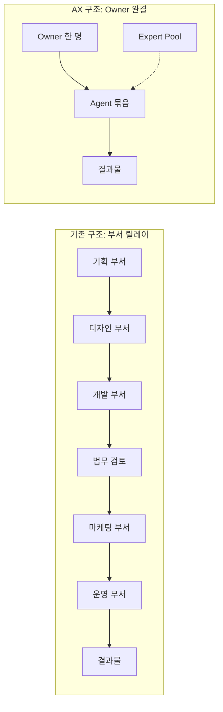
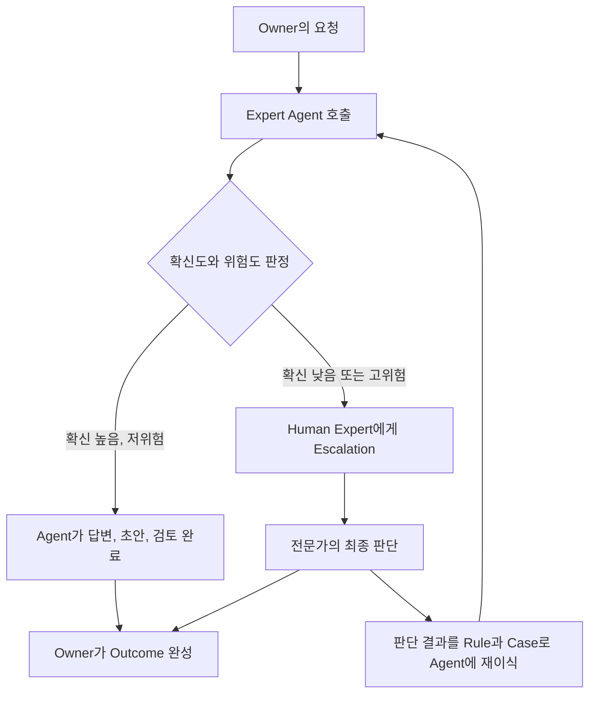
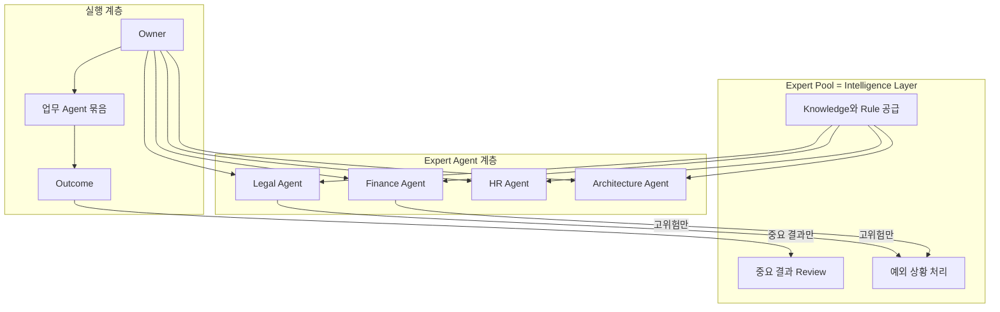
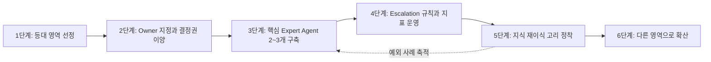
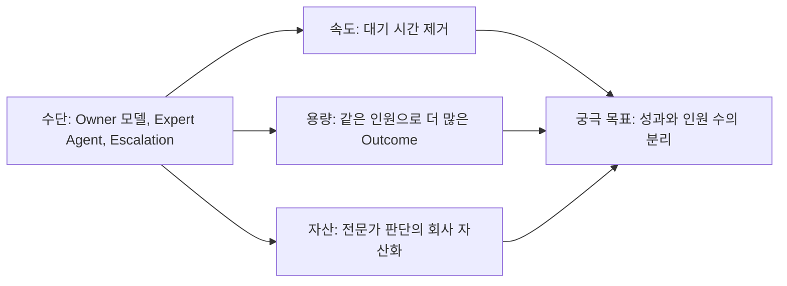
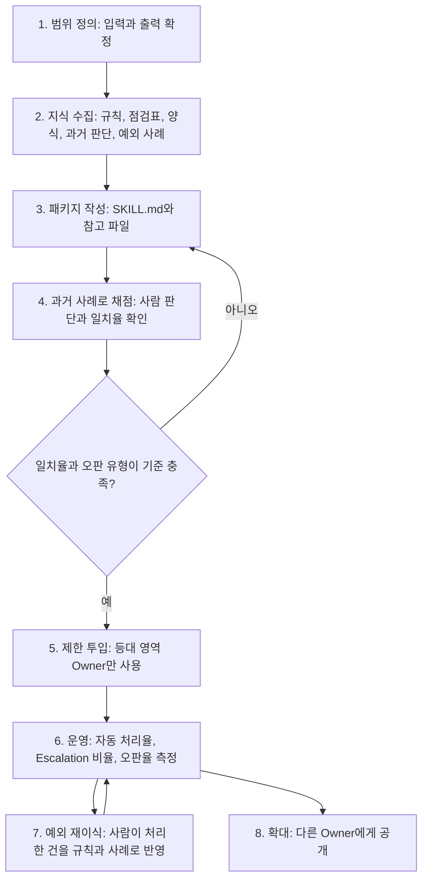
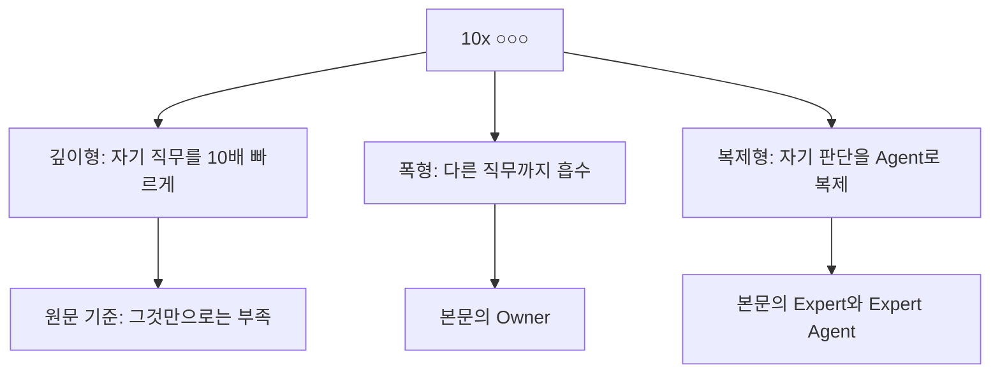

## 1 Owner = 5~10 FTE-equivalent Capability

- 작성일: 2026-10-05
- 문서 성격: 주어진 AX(AI Transformation) 조직론 글을 해설하고, 2025~2026년에 공개된 외부 자료와 대조해 검증한 설명 문서

> 
> **1 Owner = 5~10 FTE-equivalent capability.**
> 
> AX의 판은 애초에 한 사람이 기존 조직의 5~10명분 업무 범위를 처리할 수 있도록 짜야 한다. 정확히 말하면 자기 부서 사람 5~10명을 대체한다는 의미보다는, 하나의 일을 끝내기 위해 기존에 의존해야 했던 타 부서 사람 5~10명의 기능을 한 명의 Owner가 가져오는 것이다.
> 
> 지금까지의 조직은 하나의 결과물을 만들기 위해 기획, 디자인, 개발, 마케팅, 영업, 운영 같은 여러 부서가 연결되어야 했다. 문제는 사람이 많아서가 아니라, 일이 부서를 건널 때마다 설명하고 전달하고 기다리고 승인받아야 한다는 데 있다. 조직이 커질수록 이 coordination cost는 계속 커진다.
> 
> AX의 1차적인 목표는 이 협업을 더 잘하게 만드는 것이 아니다. 오히려 협업이 필요 없는 구조를 만드는 것이다. 한 명이 End-to-End Owner가 되고, 웬만한 업무는 자기 안에서 끝내야 한다.
> 
> 필요한 전문성은 다른 부서에 일을 넘겨서 얻는 것이 아니라 AI Agent와 전문가의 도움을 받아 해결한다.
> 
> 그래서 AX 시대의 핵심 인재는 단순히 AI를 잘 쓰는 사람이 아니다. 1인 Operation이면서 동시에 Agent Builder여야 한다. 조사, 기획, 문서 작성, 데이터 분석, 디자인 초안, 개발, QA, 영업, 운영까지 필요한 기능을 Agent로 만들어 자기 업무 안에 붙일 수 있어야 한다.
> 
> 물론 한 사람이 모든 분야의 전문가가 될 필요는 없다. 각 부서의 전문가는 여전히 필요하다. 다만 그들의 역할이 달라진다. 직접 일을 대신 처리하는 사람이 아니라 Rule과 Knowledge를 제공하고, 초안을 만들고, 중요한 결과를 Review하고, 예외상황만 처리하는 Expert Pool이 된다.
> 
> 여기서 한 단계 더 가야 한다. 각 Expert는 자신을 대신할 Expert Agent를 하나씩 만들어야 한다.
> 
> Legal Expert는 Legal Agent를, Finance Expert는 Finance Agent를, HR은 HR Agent를, 개발 리드는 Architecture Agent를 만든다. Owner는 사람을 부르기 전에 먼저 이 Agent를 호출한다.
> 
> 이 Agent는 단순한 Q&A 봇이면 안 된다. 질문에 답하고, 초안을 만들고, 결과물을 검토하고, 리스크를 판정할 수 있어야 한다. 그리고 Agent가 확신이 없거나 고위험 케이스라고 판단할 때만 Human Expert에게 Escalation한다.
> 
> 즉 구조는 “Owner가 Expert에게 일을 넘긴다”가 아니라 “Owner가 Expert의 지식을 호출한다”가 되어야 한다. Expert는 자기 시간을 계속 팔아서는 안 되고, 자신의 판단 기준을 Rule, Checklist, Template, Past Decision, Exception Case 형태로 Agent에 계속 이식해야 한다.
> 
> 이 구조가 반복되면 Expert의 역할도 바뀐다. 예전에는 “내가 직접 처리한다”였다면 이제는 “내 판단을 Agent로 복제하고, 예외만 내가 처리한다”가 된다. Expert의 성과 역시 몇 건을 직접 처리했느냐가 아니라, 얼마나 많은 업무를 자신의 개입 없이 Agent가 처리하게 만들었느냐로 봐야 한다.
> 
> 결국 Expert Pool은 지원부서가 아니라 Intelligence Layer가 된다. 사람을 빌려주는 조직이 아니라, 회사 전체 Owner들이 언제든 호출할 수 있는 전문지식, 판단기준, Agent, Review 체계를 만드는 조직이다.
> 
> 이렇게 되면 회사의 기본 구조도 바뀐다. 기존에는 Department → Department → Department를 거쳐 결과가 나왔다면, AX 조직에서는 Owner → Agent → Outcome으로 가고, Expert Pool은 그 위에서 Knowledge, Review, Exception Handling을 제공한다.
> 
> 결국 조직의 기본 단위가 Department에서 Owner로 바뀌는 것이다. 기존에는 “이건 어느 부서에 요청해야 하지?”라고 물었다면, AX 조직에서는 “누가 이 Outcome의 Owner이고, 어떤 Agent를 붙이면 혼자 끝낼 수 있지?”라고 물어야 한다.
> 
> 이렇게 보면 AX의 생산성 목표도 명확해진다. 한 명이 자기 직무만 더 빨리 하는 정도로는 부족하다. 한 명의 Owner가 과거 하나의 일을 완성하기 위해 필요했던 여러 부서의 5~10명 기능을 흡수할 수 있어야 한다.
> 
> 결국 AX는 사람을 AI로 단순 대체하는 프로젝트가 아니다. 부서 간에 분산되어 있던 기능과 의사결정권을 한 명의 Owner에게 모으고, 그 사람이 Agent를 이용해 하나의 작은 조직처럼 움직이게 만드는 조직 재설계다.
> 
> AX의 목표는 더 적은 사람이 같은 일을 하는 것이 아니다. 한 사람이 과거에는 여러 부서가 필요했던 일을 끝까지 소유하고 완결할 수 있게 만드는 것이다.
> 


---

## 0. 이 문서를 읽는 방법

이 문서는 "1 Owner = 5~10 FTE-equivalent capability"라는 문장으로 시작하는 AX 조직론 글을 한 단락씩 풀어서 설명합니다. 원문은 하나의 주장(의견)이며, 이 문서는 그 주장이 무엇을 말하는지, 왜 그런 말이 나오는지, 외부에서 실제로 확인되는 비슷한 흐름은 무엇인지, 그리고 어디에 한계와 위험이 있는지를 차례로 다룹니다.

거짓이나 막연한 추측이 섞이지 않도록 문장의 성격을 다음 세 가지로 구분해 표시합니다.

| 표시 | 의미 |
|---|---|
| **[사실]** | 공개된 문서, 기사, 공식 발표로 확인되는 내용 |
| **[주장]** | 기업이나 컨설팅사, 원문 저자가 내세우는 견해나 전망 (검증된 결과가 아님) |
| **[해석]** | 이 문서가 원문과 자료를 바탕으로 덧붙이는 설명, 예시, 제안 |

본문에 나오는 업무 시나리오(예: 신규 서비스 출시 사례)는 이해를 돕기 위해 만든 **가상의 예시**이며, 특정 기업의 실제 사례가 아닙니다. 실제 기업 사례는 반드시 출처와 함께 따로 표기했습니다.

---

## 1. 한 문장으로 요약하면

원문의 핵심은 이렇게 정리할 수 있습니다.

> **AX는 "AI로 사람을 줄이는 프로젝트"가 아니라, 여러 부서에 흩어져 있던 기능과 결정권을 한 명의 Owner에게 모으고, 그 Owner가 AI Agent와 전문가 지식을 호출해 하나의 작은 조직처럼 일을 끝까지 완결하게 만드는 조직 재설계다.**

여기서 "5 ~ 10 FTE"는 "한 사람이 열 사람 몫의 타이핑을 한다"는 뜻이 아닙니다. 하나의 결과물을 만들기 위해 과거에 **다른 부서에서 빌려와야 했던 5~10명분의 기능** (기획, 디자인, 개발, 법무 검토, 재무 검토, 마케팅 등)을 한 명의 Owner가 Agent의 힘을 빌려 **자기 안으로 가져온다**는 뜻입니다.

---

## 2. 용어부터 정확히: FTE, Owner, Agent, Expert Pool

본격적인 설명에 앞서 원문에 나오는 용어를 정리하겠습니다.

**FTE(Full-Time Equivalent)** 는 "전일제 근무자 환산 인원"이라는 뜻의 인력 산정 단위입니다. 주 40시간 일하는 한 사람이 1 FTE이고, 주 20시간 일하는 파트타이머 두 명을 합치면 역시 1 FTE가 됩니다. 원문이 굳이 "FTE-equivalent **capability**"라고 쓴 것은 "사람 수"가 아니라 "그 사람들이 제공하던 **능력의 범위**"를 환산하겠다는 의도로 읽힙니다 [해석].

**Owner** 는 특정 결과물(Outcome)에 대해 처음부터 끝까지 책임과 결정권을 가진 사람입니다. 흔히 말하는 "담당자"와 다른 점은, 담당자는 자기 단계만 처리하고 다음 부서로 넘기지만 Owner는 결과가 고객에게 전달될 때까지 전 과정을 소유한다는 점입니다.

**Agent** 는 목표를 받으면 스스로 계획을 세우고, 도구를 쓰고, 중간 결과를 확인하면서 여러 단계의 작업을 수행하는 AI 시스템입니다. 단순히 질문에 한 번 답하는 챗봇과 달리 "일을 맡길 수 있는" 단위라는 점이 핵심입니다.

**Expert Pool** 은 법무, 재무, 인사, 아키텍처 같은 전문 영역의 사람들을 말합니다. 원문은 이들이 "일을 대신 처리해 주는 지원 부서"에서 "판단 기준과 지식을 공급하는 계층(Intelligence Layer)"으로 바뀌어야 한다고 주장합니다.

---

## 3. 왜 이런 주장이 나오는가: 문제는 사람 수가 아니라 "부서를 건너는 비용"

### 3-1. 원문이 지목하는 진짜 병목

원문은 기존 조직의 문제를 이렇게 진단합니다. 하나의 결과물을 만들려면 기획, 디자인, 개발, 마케팅, 영업, 운영이 줄줄이 연결되어야 하는데, 문제는 사람이 많다는 사실 자체가 아니라 **일이 부서를 건널 때마다 설명하고, 전달하고, 기다리고, 승인받아야 한다**는 데 있다는 것입니다. 원문은 이를 **coordination cost(조정 비용)** 라고 부릅니다.

이 진단은 소프트웨어 공학과 경영학에서 오래전부터 알려진 현상과 맞닿아 있습니다 [해석]. 프레더릭 브룩스(Frederick Brooks)가 1975년 『맨먼스 미신(The Mythical Man-Month)』에서 지적했듯, 함께 일하는 사람이 늘어나면 서로 소통해야 하는 경로의 수는 사람 수보다 훨씬 빠르게 늘어납니다. n명이 모두 서로 조율해야 한다면 소통 경로는 n×(n−1)÷2개가 됩니다.

| 함께 조율해야 하는 사람 수 | 필요한 소통 경로 수 |
|---|---|
| 2명 | 1개 |
| 5명 | 10개 |
| 10명 | 45개 |
| 20명 | 190개 |

사람이 2배 늘면 소통 경로는 4배 가까이 늘어납니다. 원문이 말하는 "조직이 커질수록 coordination cost는 계속 커진다"는 문장은 바로 이 산술적 구조를 가리킵니다.

### 3-2. 컨설팅 업계도 같은 지점을 지목한다

**[사실]** 맥킨지(McKinsey)는 2025년 9월 26일 공개한 보고서 「The agentic organization: Contours of the next paradigm for the AI era」에서, 전통적 조직은 기능별 사일로(functional silo)로 만들어졌고, 디지털 기업의 교차기능 제품팀조차 **업무 인계(handover)** 와 "피자 두 판 팀", "던바의 수" 같은 **인간 팀 규모의 한계**에 여전히 묶여 있다고 설명했습니다.

즉 원문과 맥킨지는 공통적으로 "협업 자체가 비용"이라는 지점을 바라보고 있습니다. 다만 해법의 강도는 다릅니다. 이 차이는 뒤에서 다시 다룹니다.

### 3-3. 그림으로 보는 구조 변화



왼쪽 구조에서는 화살표 하나하나가 "설명하고, 전달하고, 기다리고, 승인받는" 지점입니다. 오른쪽 구조에서는 그 화살표 대부분이 Owner 내부로 흡수되고, 전문가는 점선처럼 "옆에서 지식을 공급"하는 형태로 바뀝니다.

---

## 4. "협업을 잘하게"가 아니라 "협업이 필요 없게"

### 4-1. 원문의 가장 도발적인 문장

원문에서 가장 강한 주장은 이 부분입니다. AX의 1차 목표는 **협업을 더 잘하게 만드는 것이 아니라, 협업이 필요 없는 구조를 만드는 것**이라는 문장입니다 [주장].

많은 기업의 AI 도입은 "회의록 자동 요약", "메신저 답장 초안", "부서 간 요청서 작성 자동화"처럼 **기존 협업을 더 매끄럽게** 만드는 데서 시작합니다. 원문은 이것이 본질이 아니라고 봅니다. 협업을 10% 빠르게 만드는 것보다, 애초에 그 협업 단계 자체를 없애는 쪽이 훨씬 큰 효과를 낸다는 논리입니다.

### 4-2. 가상의 예시로 이해하기

이해를 돕기 위해 가상의 상황을 하나 들어보겠습니다 [해석, 가상 예시].

어느 회사가 "소상공인 대상 신규 구독 요금제"를 출시한다고 해봅시다. 기존 방식이라면 다음과 같이 흘러갑니다. 기획자가 요금제 구조를 정리해 디자인팀에 요청서를 보내고, 디자인팀은 일정이 밀려 일주일 뒤에 시안을 줍니다. 개발팀은 다음 스프린트에 일정을 잡고, 약관 문구는 법무팀 검토 대기열에 들어갑니다. 가격 정책은 재무팀 승인을 기다리고, 마케팅팀은 개발이 끝나야 캠페인 문안을 쓰기 시작합니다. 실제로 "일하는 시간"보다 "기다리는 시간"이 훨씬 깁니다.

AX 구조에서는 한 명의 Owner가 이 요금제의 출시를 소유합니다. Owner는 리서치 Agent로 경쟁 요금제를 조사하고, 기획 Agent와 함께 요금 구조를 설계하고, 디자인 Agent로 화면 초안을 만들고, 코딩 Agent로 결제 화면을 구현합니다. 약관은 사람 법무팀에 넘기는 대신 **Legal Agent**를 먼저 호출해 초안을 받고 위험 조항을 점검합니다. 가격의 수익성은 **Finance Agent**가 기존 승인 기준에 비춰 판정합니다. Legal Agent가 "이 환불 조항은 과거 분쟁 사례와 유사해 고위험"이라고 판단하는 경우에만 사람 법무 전문가에게 넘어갑니다.

이 시나리오에서 Owner가 흡수한 기능을 세어보면 리서치, 기획, 디자인, 개발, 법무 1차 검토, 재무 1차 검토, 마케팅 문안까지 대략 5~7개 역할입니다. 원문이 말하는 "5~10 FTE-equivalent capability"가 가리키는 그림이 바로 이것입니다.

---

## 5. 핵심 인재상: 1인 Operation이면서 Agent Builder

### 5-1. "AI를 잘 쓰는 사람"으로는 부족하다

원문은 AX 시대의 핵심 인재를 단순히 AI 도구를 능숙하게 쓰는 사람으로 보지 않습니다. 두 가지 정체성을 동시에 요구합니다 [주장].

첫째는 **1인 Operation** 입니다. 하나의 결과물을 처음부터 끝까지 혼자 굴릴 수 있는 운영 능력을 말합니다. 둘째는 **Agent Builder** 입니다. 조사, 기획, 문서 작성, 데이터 분석, 디자인 초안, 개발, QA, 영업, 운영처럼 필요한 기능을 Agent로 만들어 자기 업무에 붙일 수 있어야 한다는 것입니다.

둘의 차이를 비유하면 이렇습니다. AI를 잘 쓰는 사람은 "좋은 계산기를 가진 사람"이고, Agent Builder는 "필요할 때마다 자기 업무에 맞는 계산기를 직접 만들어 쓰는 사람"입니다.

### 5-2. 외부에서 확인되는 같은 방향의 움직임

이 인재상은 원문만의 독특한 주장이 아니라, 2025년 이후 여러 기업과 연구 기관이 비슷한 언어로 이야기하고 있습니다.

**[사실] 마이크로소프트 "Agent Boss"** — 마이크로소프트는 2025년 4월 23일 발표한 「2025 Work Trend Index」(31개국 3만 1천 명 조사)에서 "Frontier Firm"이라는 새로운 기업 형태를 제시하고, 모든 직원이 **에이전트를 직접 만들고, 위임하고, 관리하는 사람**, 즉 "agent boss"가 될 것이라고 전망했습니다. 이 정의에는 "만든다(builds)"가 명시적으로 들어 있어, 원문의 Agent Builder와 매우 가깝습니다. 같은 보고서는 사람과 에이전트의 적정 배합을 뜻하는 **human-agent ratio** 라는 지표를 새로 제안했습니다. 다만 "Frontier Firm이 된다"는 전망 자체는 마이크로소프트의 **[주장]** 입니다.

**[사실] 링크드인 "Full Stack Builder"** — 링크드인의 당시 최고제품책임자(CPO) 토머 코언(Tomer Cohen)은 2025년 4월 2일 공개된 Computer Weekly 인터뷰에서 Full Stack Builder 프로그램을 소개하며, 기존에 **여러 기능에 걸친 5~10개 팀과 함께 일하던 다학제 프로세스를 AI를 활용해 한 사람이 처리하는 흐름으로 압축**하는 실험을 하고 있다고 설명했습니다. 원문의 "5~10"이라는 숫자와 매우 비슷한 표현이 실제 기업 책임자의 입에서 나왔다는 점이 흥미롭습니다. 이후 2025년 12월 Lenny's Podcast 방송분 소개에 따르면 링크드인은 기존 APM(Associate Product Manager) 프로그램을 없애고 코딩·디자인·PM 역량을 함께 가르치는 APB(Associate Product Builder) 프로그램으로 대체했으며, "Full Stack Builder"라는 공식 직함과 경력 사다리를 도입했습니다. 참고로 토머 코언은 이후 약 14년간 몸담은 링크드인 CPO 자리에서 물러나 자문 역할을 맡고 있다고 공개 강의 소개에 적혀 있습니다.

**[사실] 맥킨지 "M자형 감독자"** — 앞서 언급한 맥킨지 보고서는 사람이 에이전트와 함께 일하면서 세 가지 역할이 떠오르고 있다고 정리합니다. 여러 영역에 걸쳐 에이전트와 혼합 인력을 조율하는 **M자형 감독자(M-shaped supervisor)**, 워크플로를 재설계하고 예외를 처리하며 품질을 지키는 **T자형 전문가(T-shaped expert)**, 그리고 시스템 대신 사람에게 더 많은 시간을 쓰는 **AI 증강 현장 인력** 입니다. 원문의 Owner는 M자형 감독자에, Expert Pool은 T자형 전문가에 거의 그대로 대응합니다 [해석].

| 원문의 개념 | 마이크로소프트 | 링크드인 | 맥킨지 |
|---|---|---|---|
| Owner (1인 Operation) | Agent Boss | Full Stack Builder | M자형 감독자 |
| Agent Builder 역량 | 에이전트를 만들고 위임하고 관리 | AI로 스펙·디자인·코드까지 직접 수행 | 에이전트 팩토리를 감독 |
| Expert Pool | (직접 대응 개념 없음) | (직접 대응 개념 없음) | T자형 전문가 |
| 협업 단계 제거 | 조직도 대신 Work Chart | 5~10개 팀 협업을 1인 흐름으로 압축 | 인계(handover) 제약 극복 |

### 5-3. 모든 분야의 전문가가 될 필요는 없다

원문은 중요한 단서를 하나 답니다. Owner가 모든 분야의 전문가가 될 필요는 없고, **각 부서의 전문가는 여전히 필요하다**는 점입니다. 바뀌는 것은 전문가의 "존재"가 아니라 "역할"입니다. 이 부분이 원문의 두 번째 축입니다.

---

## 6. Expert Pool의 역할 변화: 일을 대신 해주는 사람에서 기준을 공급하는 사람으로

### 6-1. 네 가지 새 역할

원문에 따르면 전문가는 더 이상 Owner의 일을 넘겨받아 대신 처리하지 않습니다. 대신 다음 네 가지 역할을 맡습니다 [주장].

첫째, **Rule과 Knowledge 제공** 입니다. "이런 경우엔 이렇게 판단한다"는 기준을 문서화해 공급합니다. 둘째, **초안 작성** 입니다. 필요하면 표준 초안이나 템플릿을 만들어 둡니다. 셋째, **중요 결과의 Review** 입니다. 모든 결과가 아니라 중요한 결과만 검토합니다. 넷째, **예외 상황 처리** 입니다. 규칙으로 판단할 수 없는 새로운 상황만 직접 다룹니다.

| 구분 | 기존 전문가 | AX 시대 전문가 |
|---|---|---|
| 기본 동작 | 요청을 받아 직접 처리 | 판단 기준을 Agent에 이식 |
| 업무 흐름 | 요청서 접수 → 대기열 → 처리 → 회신 | Agent가 1차 처리, 예외만 사람에게 |
| 시간 사용 | 반복 요청 처리에 대부분 소진 | 규칙 설계, 고위험 판단, 품질 관리 |
| 성과 지표 | 직접 처리한 건수 | 자신의 개입 없이 처리된 업무 비율 |
| 조직 내 위치 | 지원 부서 | Intelligence Layer |

### 6-2. 맥킨지의 거버넌스 설명과의 연결

**[사실]** 맥킨지 보고서도 비슷한 변화를 묘사합니다. 사람의 책임과 감독은 여전히 필수이지만 그 성격이 바뀌어, 컴플라이언스 담당자와 리더는 한 줄 한 줄 검토하는 대신 **정책을 정의하고, 이상치를 모니터링하고, 사람이 개입하는 수준을 조정**하게 된다고 설명합니다. 또한 워크플로 안에 **비평(critic) 에이전트, 가드레일 에이전트, 컴플라이언스 에이전트** 를 내장해 "에이전트가 에이전트를 통제"하는 구조를 제시합니다.

원문의 "Expert는 예외만 처리한다"는 주장과 맥킨지의 "사람은 정책을 정의하고 이상치를 본다"는 설명은 같은 방향을 가리킵니다 [해석].

---

## 7. 한 단계 더: 모든 전문가는 자신의 Expert Agent를 만든다

### 7-1. 원문이 그리는 그림

원문은 여기서 한 걸음 더 나아갑니다. 각 Expert가 **자신을 대신할 Expert Agent를 하나씩 만들어야 한다**는 것입니다 [주장]. 법무 전문가는 Legal Agent를, 재무 전문가는 Finance Agent를, 인사 담당자는 HR Agent를, 개발 리드는 Architecture Agent를 만듭니다. Owner는 사람을 부르기 전에 **먼저 이 Agent를 호출**합니다.

### 7-2. 단순 Q&A 봇이면 안 되는 이유

원문은 이 Agent가 단순한 질의응답 봇이어서는 안 된다고 강조합니다. 다음 네 가지를 할 수 있어야 합니다.

| 기능 | 의미 | Legal Agent 예시 [해석] |
|---|---|---|
| 답변 | 질문에 근거와 함께 답한다 | "이 이벤트 경품 금액이면 별도 고지 의무가 있는가?" |
| 초안 작성 | 바로 쓸 수 있는 문서를 만든다 | 이용약관 변경 조항 초안 작성 |
| 결과물 검토 | Owner가 만든 결과를 점검한다 | 마케팅 문구의 과장 광고 소지 점검 |
| 리스크 판정 | 위험도를 등급으로 판단한다 | "저위험: 진행 가능 / 고위험: 법무 검토 필요" |

질문에 답만 하는 봇은 결국 Owner가 그 답을 해석하고 적용하는 부담을 그대로 집니다. 반면 초안을 만들고, 검토하고, 위험을 판정하는 Agent는 **전문가가 하던 "판단" 자체를 일부 대신**합니다. 이것이 단순 FAQ 챗봇과 Expert Agent의 결정적인 차이입니다 [해석].

### 7-3. Escalation 구조

원문의 핵심 장치는 **Escalation(상향 이관)** 입니다. Agent가 확신이 없거나 고위험이라고 판단할 때만 사람 전문가에게 넘깁니다.



이 그림에서 가장 중요한 화살표는 "판단 결과를 Rule과 Case로 Agent에 재이식"입니다. 전문가가 예외를 처리할 때마다 그 판단이 Agent에 다시 들어가면, 다음에 비슷한 상황이 오면 Agent가 스스로 처리할 수 있게 됩니다. 시간이 갈수록 Escalation 비율이 줄어드는 **학습 고리**가 만들어지는 것입니다 [해석].

### 7-4. "일을 넘긴다"에서 "지식을 호출한다"로

원문은 이 구조를 한 문장으로 요약합니다. **"Owner가 Expert에게 일을 넘긴다"가 아니라 "Owner가 Expert의 지식을 호출한다"** 가 되어야 한다는 것입니다.

이 차이는 생각보다 큽니다. 일을 넘기면 Owner는 기다려야 하고, 그동안 결과물의 맥락은 끊깁니다. 지식을 호출하면 Owner는 기다리지 않고 바로 다음 단계로 나아갑니다. 전문가의 시간은 "요청 처리"가 아니라 "지식 공급"에 쓰입니다.

### 7-5. 전문가가 Agent에 이식해야 할 다섯 가지 지식

원문은 전문가가 자기 시간을 계속 팔아서는 안 되고, 판단 기준을 다섯 가지 형태로 Agent에 계속 이식해야 한다고 말합니다.

| 지식 형태 | 설명 | 재무 영역 예시 [해석] |
|---|---|---|
| Rule (규칙) | 명시적인 판단 규칙 | "할인율 20% 초과 시 마진 검증 필수" |
| Checklist (점검표) | 빠뜨리면 안 되는 확인 항목 | 신규 요금제 승인 전 확인할 8개 항목 |
| Template (템플릿) | 표준화된 문서 양식 | 투자 대비 효과 분석 표준 양식 |
| Past Decision (과거 판단) | 실제로 내렸던 결정과 그 이유 | "작년 3분기 유사 프로모션은 이런 이유로 승인" |
| Exception Case (예외 사례) | 규칙이 통하지 않았던 사례 | "정부 지원 사업 연계 시 규칙 예외 적용" |

이 다섯 가지 중 마지막 두 가지가 특히 중요합니다. Rule과 Checklist만으로는 "교과서적인" 판단만 가능합니다. 실제 전문가의 노하우는 **과거에 왜 그렇게 결정했는지, 어떤 경우에 규칙을 깼는지** 에 담겨 있기 때문입니다 [해석].

### 7-6. 이 아이디어를 구현할 수 있는 실제 기술 수단

원문이 말하는 "판단 기준을 Agent에 이식한다"는 아이디어는 이미 기술적으로 구현 수단이 존재합니다. 대표적인 예가 **Agent Skills** 입니다.

**[사실]** Anthropic의 공식 문서에 따르면 Agent Skills는 지시문, 스크립트, 참고 자료를 담은 폴더 형태로 에이전트에게 특정 역량을 부여하는 방식이며, 사용자 정의 Skill로 **도메인 전문성과 조직 지식을 패키징**할 수 있습니다. 하나의 Skill은 SKILL.md라는 마크다운 파일을 중심으로 구성되며, 에이전트는 평소에는 Skill의 짧은 설명만 알고 있다가 관련 작업이 들어오면 그때 전체 지시문을 불러와 사용합니다(점진적 공개, progressive disclosure). 이 형식은 2025년 말 개방형 표준으로 공개되었고, 이후 OpenAI도 ChatGPT와 Codex CLI에서 Skills를 지원하기 시작했다고 여러 기술 매체가 보도했습니다.

원문의 다섯 가지 지식 형태를 Skill에 대응시키면 이렇게 볼 수 있습니다 [해석]. Rule과 Checklist는 SKILL.md 본문의 지시문으로, Template은 Skill 폴더 안의 양식 파일로, Past Decision과 Exception Case는 필요할 때만 불러오는 참고 문서로 담을 수 있습니다. 즉 "법무 전문가가 Legal Agent를 만든다"는 말은, 현실적으로는 "법무 전문가가 자기 판단 기준을 Skill 패키지로 정리하고 계속 갱신한다"는 작업으로 구체화될 수 있습니다.

---

## 8. 전문가의 성과 지표가 바뀐다

### 8-1. "몇 건 처리했나"에서 "몇 건을 내 개입 없이 처리하게 만들었나"로

원문은 Expert의 역할이 "내가 직접 처리한다"에서 **"내 판단을 Agent로 복제하고, 예외만 내가 처리한다"** 로 바뀐다고 말합니다. 그리고 성과 역시 직접 처리 건수가 아니라 **얼마나 많은 업무를 자신의 개입 없이 Agent가 처리하게 만들었느냐**로 봐야 한다고 주장합니다 [주장].

이것은 전문가 입장에서 보면 상당히 급진적인 변화입니다. 기존 평가 체계에서는 "법무팀이 올해 계약서 1,200건을 검토했다"가 성과입니다. 새 체계에서는 "Legal Agent가 계약서 1,200건 중 1,000건을 법무팀 개입 없이 처리했고, 그중 오판은 없었다"가 성과입니다.

### 8-2. 맥킨지도 같은 방향을 제시한다

**[사실]** 맥킨지 보고서는 에이전트가 실행을 맡게 되면서 **과업 완료 중심의 성과 관리가, 사람이 에이전트를 얼마나 잘 조율하고 가치를 만들어내며 결과를 내는지를 추적하는 체계로 바뀔 것**이라고 설명합니다. 또한 HR 시스템이 사람 직원뿐 아니라 에이전트와 에이전트 워크플로의 저장소 역할도 하게 될 것이라고 전망합니다 [주장].

### 8-3. 실제로 측정한다면: 지표 제안

원문의 아이디어를 실제 평가 지표로 바꾸면 다음과 같은 형태가 될 수 있습니다 [해석, 이 문서의 제안].

| 지표 | 정의 | 왜 필요한가 |
|---|---|---|
| 자동 처리율 | 전문가 개입 없이 Agent가 완결한 요청 비율 | 원문이 말하는 핵심 성과 |
| Escalation 비율 | Agent가 사람에게 넘긴 요청 비율 | 낮아질수록 지식 이식이 잘 된 것 |
| 오판율 | Agent가 처리했지만 사후에 잘못으로 드러난 비율 | 자동 처리율만 보면 품질이 무너질 수 있음 |
| 지식 반영 시간 | 예외 판단이 Agent 규칙에 반영되기까지 걸린 시간 | 학습 고리가 실제로 돌고 있는지 확인 |
| Owner 대기 시간 | Owner가 전문 판단을 기다린 총 시간 | coordination cost가 줄었는지 직접 측정 |

여기서 **오판율을 반드시 함께 봐야 한다**는 점이 중요합니다. 자동 처리율만 성과로 삼으면 전문가가 Escalation 기준을 느슨하게 만들어 숫자를 부풀릴 유인이 생기기 때문입니다 [해석].

---

## 9. Expert Pool은 Intelligence Layer가 된다

### 9-1. 사람을 빌려주는 조직에서 판단을 공급하는 조직으로

원문은 이 모든 변화의 결과로 Expert Pool이 **지원 부서가 아니라 Intelligence Layer** 가 된다고 말합니다. 사람을 빌려주는 조직이 아니라, 회사 전체 Owner들이 언제든 호출할 수 있는 **전문지식, 판단 기준, Agent, Review 체계**를 만드는 조직이라는 뜻입니다.

비유하자면, 기존 지원 부서는 "필요할 때 사람을 보내주는 인력 사무소"였다면, Intelligence Layer는 "누구나 언제든 접속할 수 있는 회사의 두뇌 인프라"에 가깝습니다 [해석].

### 9-2. 새로운 조직 구조

원문은 회사의 기본 흐름이 **Department → Department → Department** 에서 **Owner → Agent → Outcome** 으로 바뀌고, Expert Pool은 그 위에서 Knowledge, Review, Exception Handling을 제공한다고 설명합니다.



이 그림을 아래에서 위로 읽으면 이해가 쉽습니다. 맨 아래 실행 계층에서 Owner가 업무 Agent로 결과를 만듭니다. Owner는 전문 판단이 필요하면 가운데 Expert Agent 계층을 호출합니다. 맨 위 Intelligence Layer의 사람 전문가는 Agent에 지식을 공급하고, 고위험 예외와 중요 결과에만 개입합니다.

### 9-3. 맥킨지가 제시한 숫자

**[사실]** 맥킨지 보고서에는 이 구조와 비슷한 실무 관찰이 나옵니다. 맥킨지는 자사 경험상 **2~5명의 사람 팀이 이미 50~100개의 전문화된 에이전트로 구성된 "에이전트 팩토리"를 감독하며**, 고객 온보딩, 제품 출시, 결산 마감 같은 엔드투엔드 프로세스를 운영할 수 있다고 밝혔습니다. 또한 한 글로벌 은행이 열 개의 에이전트 스쿼드로 고객확인(KYC) 프로세스를 관리하고 있고, 또 다른 은행은 사람이 감독하는 에이전트 스쿼드로 레거시 핵심 시스템을 현대화하면서 시간과 노력을 최대 50% 줄였다고 소개합니다. 단, 이 수치는 맥킨지가 자사 고객 경험을 근거로 제시한 것이며 독립적으로 검증된 통계는 아닙니다 [주장 성격 병기].

---

## 10. 조직의 기본 단위가 Department에서 Owner로 바뀐다

### 10-1. 질문이 바뀐다

원문은 조직의 기본 단위가 바뀌면 일을 시작할 때 던지는 **질문 자체가 바뀐다**고 말합니다.

| 상황 | 기존 조직의 질문 | AX 조직의 질문 |
|---|---|---|
| 새 일이 생겼을 때 | 이건 어느 부서에 요청해야 하지? | 누가 이 Outcome의 Owner인가? |
| 전문 판단이 필요할 때 | 법무팀 일정이 언제 비지? | Legal Agent가 처리할 수 있는가? |
| 인력이 부족할 때 | 사람을 몇 명 더 뽑아야 하지? | 어떤 Agent를 붙이면 혼자 끝낼 수 있지? |
| 일이 늦어질 때 | 어느 부서에서 막혔지? | 어떤 지식이 아직 Agent에 없지? |

### 10-2. 쇼피파이의 실제 사례

이 "질문의 전환"을 실제 경영 방침으로 만든 대표 사례가 쇼피파이(Shopify)입니다.

**[사실]** 쇼피파이 CEO 토비 뤼트케(Tobi Lütke)는 2025년 4월 7일, 유출될 조짐이 있던 내부 메모를 X에 직접 공개했습니다. 메모의 제목은 "반사적인 AI 사용은 이제 쇼피파이의 기본 기대치"라는 취지였습니다. 이 메모에서 그는 **팀이 인력이나 자원을 추가로 요청하기 전에, 왜 AI로는 원하는 일을 해낼 수 없는지 먼저 입증해야 한다**고 밝혔습니다. 또한 "자율 AI 에이전트가 이미 팀의 일원이라면 이 영역은 어떤 모습일까?"라는 질문을 던지라고 권했고, AI 활용 여부를 성과 평가와 동료 평가 질문지에 포함하겠다고 했습니다.

원문의 "어떤 Agent를 붙이면 혼자 끝낼 수 있지?"라는 질문은 쇼피파이의 이 원칙과 사실상 같은 문제의식을 담고 있습니다 [해석]. 다만 쇼피파이 메모는 "증원 전에 AI 가능성부터 검토하라"는 **채용 원칙**이고, 원문은 한 걸음 더 나아가 **조직 구조 자체를 Owner 중심으로 재편하라**는 주장이라는 점에서 범위가 다릅니다.

---

## 11. 생산성 목표의 재정의: "빨리"가 아니라 "넓게"

### 11-1. 개인 속도 향상으로는 부족하다

원문은 AX의 생산성 목표를 명확히 구분합니다. **한 명이 자기 직무만 더 빨리 하는 정도로는 부족하다**는 것입니다. 목표는 한 명의 Owner가 과거 하나의 일을 완성하기 위해 필요했던 **여러 부서의 5~10명 기능을 흡수**하는 것입니다 [주장].

이 차이를 쉽게 표현하면 "깊이의 생산성"과 "폭의 생산성"의 차이입니다 [해석].

| 구분 | 깊이의 생산성 (기존 AI 도입) | 폭의 생산성 (원문의 AX) |
|---|---|---|
| 목표 | 내 직무를 더 빠르게 | 다른 직무까지 내 안으로 |
| 예시 | 개발자가 코드를 2배 빨리 작성 | 개발자가 기획, 디자인, QA, 배포까지 완결 |
| 효과 범위 | 해당 단계의 시간 단축 | 단계 사이의 대기와 전달 비용 제거 |
| 한계 | 다른 부서의 대기 시간은 그대로 | Owner의 역량과 책임 부담이 커짐 |

개발 단계가 2배 빨라져도, 전체 리드타임의 대부분이 디자인 대기, 법무 대기, 승인 대기라면 체감 효과는 미미합니다. 원문이 "협업 제거"를 강조하는 이유가 여기에 있습니다.

### 11-2. 기술적 전제: AI가 혼자 할 수 있는 일의 길이가 늘고 있다

이 구상이 가능하려면 AI가 사람의 지속적인 감독 없이 긴 작업을 수행할 수 있어야 합니다.

**[사실]** 맥킨지 보고서는 AI 평가 기관 METR의 측정을 인용해, **AI가 안정적으로 완료할 수 있는 작업의 길이가 2019년 이후 약 7개월마다, 2024년 이후에는 약 4개월마다 두 배로 늘어났으며**, 보고서 작성 시점(2025년 9월) 기준 약 2시간 수준에 도달했다고 설명합니다. 맥킨지는 여기서 더 나아가 2027년이면 AI가 감독 없이 나흘 분량의 일을 완료할 수도 있다고 전망했는데, 이는 추세 연장에 기반한 **[주장]** 입니다.

### 11-3. "5~10"이라는 숫자를 어떻게 받아들여야 하나

여기서 정직하게 짚어야 할 점이 있습니다. **"1 Owner = 5~10 FTE"라는 숫자는 공개된 연구로 측정·검증된 결과가 아닙니다.** 이 문서가 조사한 범위에서, 조직 전체 가치사슬 수준에서 "한 사람이 5~10명분의 타 부서 기능을 흡수했다"는 것을 통제된 방식으로 측정한 공개 연구는 확인되지 않았습니다.

따라서 이 숫자는 **설계 목표(target)** 로 읽는 것이 정확합니다 [해석]. 원문 스스로도 "판을 그렇게 짜야 한다"는 당위 형태로 썼습니다. 외부에서 확인되는 가장 가까운 근거는 링크드인 CPO가 언급한 "5~10개 팀과의 협업을 한 사람의 흐름으로 압축하는 실험"과, 맥킨지의 "2~5명이 50~100개 에이전트를 감독" 관찰 정도입니다. 둘 다 방향성을 뒷받침하지만, 원문의 숫자를 그대로 증명하지는 않습니다.

---

## 12. 비판적 검토: 이 구상이 실패할 수 있는 지점

좋은 조직론일수록 실패 조건을 알아야 제대로 쓸 수 있습니다. 원문은 방향을 강하게 제시하지만, 실행 단계에서 부딪힐 위험은 거의 다루지 않습니다. 외부 자료를 바탕으로 주요 위험을 정리합니다.

### 12-1. 에이전트 프로젝트의 높은 실패율

**[사실]** 가트너(Gartner)는 2025년 6월, **에이전틱 AI 프로젝트의 40% 이상이 2027년 말까지 비용 증가, 불분명한 사업 가치, 부적절한 위험 통제 때문에 취소될 것**이라고 전망했습니다. 가트너는 많은 벤더가 기존 챗봇이나 AI 비서를 "에이전트"로 이름만 바꿔 파는 "에이전트 워싱"을 하고 있으며, 수천 개 벤더 중 실제 에이전틱 역량을 갖춘 곳은 약 130곳 정도라고 추정했습니다. 같은 발표에서 가트너는 2028년까지 일상 업무 의사결정의 최소 15%가 에이전틱 AI로 자율 처리될 것이라는 전망도 함께 내놓았습니다(2024년 0% 대비).

이것이 원문에 주는 시사점은 분명합니다 [해석]. Expert Agent를 "모든 전문가가 하나씩" 만드는 것은 구호로는 쉽지만, 실제로는 각 Agent가 운영 비용, 품질 관리, 위험 통제를 감당해야 합니다. 데모에서 잘 작동하는 Agent와 실제 업무를 안정적으로 처리하는 Agent 사이에는 큰 간극이 있습니다.

### 12-2. "워크슬롭": 품질 부담이 하류로 떠넘겨지는 문제

**[사실]** 2025년 9월 하버드 비즈니스 리뷰(HBR)에 실린 BetterUp Labs와 스탠퍼드 소셜미디어랩의 연구는 **"워크슬롭(workslop)"**, 즉 그럴듯해 보이지만 실제로는 과업을 의미 있게 진전시키지 못하는 AI 생성 결과물을 문제로 지적했습니다. 미국 전일제 직원 1,150명 조사에서 약 40%가 지난 한 달 동안 이런 결과물을 받았다고 답했고, 연구진은 워크슬롭이 **해석하고, 고치고, 다시 하는 부담을 받는 사람에게 떠넘긴다**고 설명했습니다. 관련 보도에 따르면 한 건당 약 2시간의 재작업이 발생하는 것으로 추산되었습니다.

이 연구는 원문의 구조에 직접적인 경고를 줍니다 [해석]. Owner가 Agent로 빠르게 만든 결과물의 품질이 낮으면, 그 부담은 결국 Review를 맡은 Expert Pool이나 최종 고객에게 넘어갑니다. "협업이 사라진 것처럼 보이지만 실제로는 검토 부담이 다른 곳으로 이동했을 뿐"인 상황이 생길 수 있습니다.

### 12-3. 사람의 감독 역량이 새로운 병목이 된다

**[사실]** 맥킨지 보고서 스스로도 이 점을 인정합니다. 에이전트 도입의 규모는 결국 **사람이 제공할 수 있는 감독 역량에 의해 제한**될 것이며, 거버넌스 자체가 생산성의 병목이 될 수 있다고 지적했습니다. 위험을 관리할 만큼 충분히 감독하면서도 에이전트를 사람의 속도로 끌어내리지 않는 균형점을 찾는 것이 과제라는 것입니다.

원문의 "Agent가 확신이 없을 때만 Escalation"이라는 장치는 이 균형을 맞추기 위한 핵심 설계입니다. 그런데 이것이 작동하려면 **Agent가 자신이 틀릴 수 있다는 것을 스스로 알아야** 합니다. AI가 자신 있게 틀리는 경우가 여전히 존재한다는 점을 고려하면, Escalation 기준을 Agent의 자기 판단에만 맡기는 것은 위험합니다 [해석]. 금액, 대상, 법적 영향 같은 **객관적인 고위험 조건은 Agent 판단과 무관하게 무조건 사람에게 가도록** 규칙으로 고정해 두는 이중 장치가 필요합니다.

### 12-4. 그 밖에 원문이 다루지 않은 위험

다음은 외부 자료로 직접 확인된 것이 아니라, 원문의 구조를 논리적으로 따져볼 때 드러나는 위험입니다 [해석].

**Owner 과부하와 단일 장애점.** 한 사람이 5~10개 기능을 흡수하면, 그 사람이 아프거나 퇴사할 때 결과물 전체가 멈춥니다. 기존 부서 구조의 "느림"은 동시에 "중복과 대체 가능성"이라는 안전장치이기도 했습니다.

**책임 소재의 모호함.** Legal Agent가 저위험으로 판정해 통과시킨 조항이 문제가 되면 책임은 Owner에게 있을까요, Agent를 만든 법무 전문가에게 있을까요? 맥킨지도 최종 책임은 사람이 진다고 강조하지만, 그 "사람"이 누구인지는 조직이 미리 정해야 합니다.

**전문가의 인센티브 충돌.** 원문은 전문가에게 "자기 판단을 Agent로 복제하라"고 요구합니다. 그러나 전문가 입장에서는 자기 노하우를 Agent에 넘길수록 자신의 대체 가능성이 커진다고 느낄 수 있습니다. 성과 지표를 바꾸는 것만으로는 부족하고, 지식을 이식한 사람이 더 높은 평가와 더 중요한 역할을 받는다는 **신뢰할 수 있는 보상 구조**가 함께 설계되어야 합니다.

**암묵지의 한계.** 전문가 판단의 상당 부분은 말로 정리되지 않는 경험적 감각입니다. Rule, Checklist, Template로 옮길 수 있는 부분과 그렇지 않은 부분을 구분하지 않으면, Agent는 겉보기에만 전문가처럼 행동할 수 있습니다.

**모든 일이 Owner 모델에 맞지는 않음.** 맥킨지 역시 모든 일에 에이전틱 AI가 필요한 것은 아니라고 언급합니다. 대규모 인프라 공사, 장기 연구, 규제 산업의 핵심 의사결정처럼 본질적으로 여러 전문가의 동시 판단이 필요한 일은 여전히 팀 단위가 적합할 수 있습니다.

### 12-5. 위험과 대응 정리

| 위험 | 근거 성격 | 대응 방향 [해석] |
|---|---|---|
| 에이전트 프로젝트 대량 취소 | [사실] 가트너 전망 | 고가치 영역부터 소수 Agent로 시작, 사업 가치로 측정 |
| 워크슬롭과 검토 부담 이동 | [사실] HBR 연구 | Owner에게 최종 품질 책임 부여, 오판율 지표 병행 |
| 감독 역량 병목 | [사실] 맥킨지 지적 | 객관적 고위험 조건은 규칙으로 고정 Escalation |
| Owner 과부하, 단일 장애점 | [해석] | Owner 간 상호 백업, 작업 맥락의 문서화 |
| 책임 소재 모호 | [해석] | Agent 판정 결과의 책임 주체를 사전 규정 |
| 전문가 저항 | [해석] | 지식 이식 기여를 승진과 보상에 반영 |
| 암묵지 미이식 | [해석] | Past Decision과 Exception Case 축적을 우선 |

---

## 13. 실천 관점의 로드맵 제안

원문은 "무엇을 해야 하는가"는 분명히 말하지만 "어떤 순서로 해야 하는가"는 다루지 않습니다. 아래는 원문의 구조와 맥킨지가 권고한 "한두 개의 등대(lighthouse) 영역부터 시작하라"는 원칙을 결합한 단계별 제안입니다 [해석, 이 문서의 제안].



**1단계: 등대 영역 선정.** 결과물이 명확하고, 부서 간 대기 시간이 길며, 실패해도 피해가 제한적인 영역 하나를 고릅니다. 맥킨지는 이런 영역을 "가치가 크고, 조직 전체에 잘 보이며, 기술적 성숙도가 충분한 전략 영역"으로 정의합니다.

**2단계: Owner 지정과 결정권 이양.** 이름만 Owner가 아니라 실제 결정권을 넘겨야 합니다. 여전히 모든 결정마다 부서장 승인이 필요하다면 구조는 바뀌지 않은 것입니다. 원문이 "기능과 의사결정권을 모은다"고 쓴 이유가 여기에 있습니다.

**3단계: 핵심 Expert Agent 2~3개 구축.** 모든 전문가가 동시에 Agent를 만들 필요는 없습니다. 등대 영역에서 가장 자주 병목이 되는 전문 영역(예: 법무 검토, 보안 검토) 두세 개부터 시작합니다.

**4단계: Escalation 규칙과 지표 운영.** Agent의 자기 판단에 의한 Escalation과, 금액이나 대상 같은 객관 조건에 의한 강제 Escalation을 함께 설정합니다. 자동 처리율과 오판율을 동시에 측정합니다.

**5단계: 지식 재이식 고리 정착.** 전문가가 처리한 예외가 일정 기간 안에 Agent 규칙에 반영되는지 관리합니다. 이 고리가 돌아야 Escalation 비율이 점차 줄어듭니다.

**6단계: 다른 영역으로 확산.** 등대 영역에서 검증된 Expert Agent는 다른 Owner들도 호출할 수 있는 공용 자산이 됩니다. 이때 비로소 Expert Pool이 "회사 전체의 Intelligence Layer"로 기능하기 시작합니다.

---

## 14. 결론: AX는 인력 감축이 아니라 "완결 단위"의 재설계

원문의 마지막 두 문단은 이 글 전체의 결론입니다.

AX는 **사람을 AI로 단순 대체하는 프로젝트가 아니라**, 부서 간에 분산되어 있던 기능과 의사결정권을 한 명의 Owner에게 모으고, 그 사람이 Agent를 이용해 **하나의 작은 조직처럼 움직이게 만드는 조직 재설계**라는 것입니다. 그리고 AX의 목표는 **더 적은 사람이 같은 일을 하는 것이 아니라, 한 사람이 과거에는 여러 부서가 필요했던 일을 끝까지 소유하고 완결할 수 있게 만드는 것**이라고 맺습니다.

이 문서의 관점에서 정리하면, 원문의 가장 큰 기여는 AI 도입의 질문을 바꾼 데 있습니다 [해석]. "AI로 무엇을 자동화할까?"가 아니라 "일이 완결되는 단위를 어디에 둘까?"를 묻게 만든다는 점입니다. 마이크로소프트의 Agent Boss, 링크드인의 Full Stack Builder, 맥킨지의 에이전틱 조직, 쇼피파이의 "증원 전 AI 검토" 원칙은 모두 서로 다른 언어로 같은 방향을 가리키고 있습니다.

동시에 "5~10 FTE"는 검증된 결과가 아니라 설계 목표이며, 에이전트 프로젝트의 높은 실패율, 품질 부담의 하류 이동, 감독 역량의 병목, 전문가 인센티브 문제 같은 현실적 장벽이 존재합니다. 따라서 이 구상을 실행하려는 조직은 원문의 방향성은 받아들이되, 작은 영역에서 측정 가능한 방식으로 시작하고, 자동 처리율과 오판율을 함께 보며, 전문가가 지식을 이식할수록 더 인정받는 구조를 먼저 만들어야 합니다.

한 문장으로 다시 요약하면 이렇습니다.

> **AX 조직의 단위는 부서가 아니라 Owner이고, 전문가의 가치는 처리한 건수가 아니라 자기 없이도 돌아가게 만든 판단의 양이며, 그 둘을 잇는 것이 Expert Agent와 Escalation이다.**

---

## 별첨 A. AX로 궁극적으로 얻고자 하는 것

### A-1. 결론부터

> **AX의 궁극적 목표는 "회사의 성과가 인원 수에 비례해서만 늘어나는 구조"를 끊는 것이다.**
> 즉, 처리할 수 있는 일의 양과 속도를 사람 수(Headcount)에서 분리(decoupling)하는 것이다.

조직 재설계는 목적이 아니라 **수단**입니다. Owner 모델, Expert Agent, Escalation은 모두 이 분리를 만들어내기 위한 장치일 뿐입니다. 조직도를 바꿨는데 일이 늘 때마다 여전히 사람을 더 뽑아야 한다면, 그 AX는 실패한 것입니다.

**[사실]** 맥킨지도 에이전틱 기업이 기존 기업을 흔들 수 있는 이유로 근본적으로 다른 수준의 생산성(직원 1인당 매출), **성장과 분리된 비용 구조**, 더 빠른 출시 속도를 꼽았습니다. 원문의 "1 Owner = 5~10 FTE"는 이 분리를 개인 단위로 표현한 목표치입니다 [해석].

### A-2. 구체적으로 얻는 것 세 가지



**① 속도 — 아이디어에서 고객까지의 시간을 줄인다.**
줄이려는 것은 "일하는 시간"이 아니라 "기다리는 시간"입니다. 부서 간 요청, 대기열, 승인 대기가 리드타임의 대부분을 차지한다면, 개인 작업 속도를 2배 올려도 전체는 거의 빨라지지 않습니다. Owner가 기능을 흡수하면 이 대기 구간 자체가 사라집니다.

**② 용량 — 같은 인원으로 동시에 굴리는 Outcome 수를 늘린다.**
기존 구조에서 회사가 동시에 진행할 수 있는 프로젝트 수는 가장 바쁜 지원 부서(법무, 디자인, 개발 등)의 처리량에 묶입니다. Expert Agent가 1차 판단을 대신하면 이 병목이 풀리고, Owner 수만큼 일이 병렬로 진행됩니다. 일이 늘어도 사람을 비례해서 늘리지 않아도 됩니다.

**③ 자산 — 전문가의 판단을 사람의 머릿속에서 회사의 자산으로 옮긴다.**
지금까지 전문가의 판단 기준은 그 사람이 퇴사하면 함께 사라졌고, 한 번에 한 곳에서만 쓸 수 있었습니다. Rule, Checklist, Template, Past Decision, Exception Case로 Agent에 이식된 판단은 퇴사 후에도 남고, 수십 명의 Owner가 동시에 호출할 수 있으며, 예외가 쌓일수록 정교해집니다. 세 가지 중 **가장 오래 남는 경쟁력**이 이것입니다 [해석].

### A-3. AX의 목표가 "아닌" 것

방향을 흐리게 만드는 대표적인 착각은 다음과 같습니다 [해석].

| 흔한 착각 | 왜 목표가 아닌가 |
|---|---|
| 인건비 절감 | 결과일 수는 있어도 목표가 되면 사람만 줄고 구조는 그대로 남는다 |
| AI 도구 사용률 | 모두가 AI를 써도 부서 간 대기가 그대로면 리드타임은 변하지 않는다 |
| Agent 개수, 데모 수 | 운영되지 않는 Agent는 자산이 아니라 유지 비용이다 |
| 협업 효율화 | 원문의 핵심은 협업을 매끄럽게가 아니라 협업 단계를 없애는 것이다 |

### A-4. 달성 여부를 판정하는 세 가지 질문

AX가 목표에 다가가고 있는지는 아래 세 질문으로 판정할 수 있습니다 [해석, 이 문서의 제안].

| 질문 | 측정 지표 | 성공의 모습 |
|---|---|---|
| 일이 늘 때 사람도 같이 늘어나는가? | 처리 Outcome 수 대비 인원 증가율 | Outcome은 늘고 인원은 거의 그대로 |
| 아이디어가 고객에게 닿기까지 얼마나 걸리는가? | 리드타임 중 대기 시간 비율 | 대기 구간이 눈에 띄게 줄어듦 |
| 전문가가 빠져도 판단이 돌아가는가? | Expert Agent 자동 처리율과 오판율 | 자동 처리율은 오르고 오판율은 낮게 유지 |

세 질문 모두에 "그렇다"고 답할 수 있다면 조직 재설계가 수단으로서 제 역할을 한 것이고, 그렇지 않다면 이름만 바뀐 조직도일 가능성이 큽니다.

---

## 별첨 B. Expert Agent 설계 명세: 전문가 한 명이 자기 Agent를 실제로 만드는 방법

### B-1. 왜 이 주제인가

본문은 "모든 Expert는 자신을 대신할 Expert Agent를 만들어야 한다"고 설명했지만, **무엇을, 어떤 순서로, 어떤 형태로** 만들어야 하는지는 다루지 않았습니다. 원문 구상 전체가 이 Agent의 품질에 달려 있습니다. Expert Agent가 부실하면 Owner는 결국 사람 전문가를 다시 부르고, 협업 단계는 그대로 되살아납니다. 이 별첨은 그 빈칸을 채우기 위한 **설계 명세 예시**입니다.

아래 내용은 특정 기업의 실제 사례가 아니라, 본문에서 다룬 원문의 구조와 Agent Skills 형식을 결합해 만든 **이 문서의 제안**입니다 [해석]. 예시 영역은 이해하기 쉬운 "마케팅 문구 및 약관 1차 검토"를 맡는 Legal Agent로 잡았습니다.

### B-2. 설계 원칙 다섯 가지

**① 범위를 좁게 정의한다.** "법무 전반을 처리하는 Agent"는 만들 수 없습니다. "마케팅 문구와 이용약관 변경 조항의 1차 검토"처럼 입력과 출력이 분명한 범위로 시작합니다. 본문에서 다룬 가트너 전망에서도 살아남는 프로젝트는 범위가 명확한 영역이라는 점이 강조되었습니다.

**② 출력 형식을 고정한다.** Agent의 답이 매번 다른 모양이면 Owner가 해석하는 부담이 다시 생깁니다. 판정 등급, 근거, 수정안, Escalation 여부를 항상 같은 틀로 내놓게 합니다.

**③ Escalation은 두 갈래로 건다.** Agent의 자기 판단(확신이 낮음)에만 맡기지 않고, 금액이나 대상처럼 **객관적인 조건이면 무조건 사람에게 넘기는 강제 규칙**을 함께 둡니다. 본문 12-3에서 짚은 "AI가 자신 있게 틀리는" 위험에 대한 대비입니다.

**④ 과거 판단으로 먼저 시험한다.** 실제 업무에 투입하기 전에, 전문가가 과거에 내렸던 판단 사례로 Agent를 채점합니다. 사람의 판단과 얼마나 일치하는지 보고 나서 투입 여부를 정합니다.

**⑤ 예외는 반드시 다시 이식한다.** 사람이 처리한 Escalation 건은 정해진 기간 안에 Agent의 규칙이나 사례로 반영합니다. 이 고리가 끊기면 Agent는 출시 시점 수준에 머물고, Escalation은 줄지 않습니다.

### B-3. 지식 패키지 구조 예시

**[사실]** 본문 7-6에서 설명했듯 Agent Skills는 SKILL.md 파일을 중심으로 한 폴더 형식이며, SKILL.md에는 YAML 형식의 머리말(frontmatter)이 필요하고, 에이전트는 평소에는 이름과 설명만 알고 있다가 관련 작업이 들어오면 본문과 참고 파일을 불러옵니다.

이 구조에 원문의 다섯 가지 지식 형태를 배치하면 다음과 같습니다 [해석].

```text
legal-review-agent/
├── SKILL.md                  ← 역할, 검토 절차, 출력 형식, Escalation 규칙 (Rule)
├── checklists/
│   ├── marketing-copy.md     ← 마케팅 문구 점검 항목 (Checklist)
│   └── terms-change.md       ← 약관 변경 점검 항목 (Checklist)
├── templates/
│   ├── disclaimer.md         ← 표준 고지 문구 (Template)
│   └── review-report.md      ← 검토 결과 보고 양식 (Template)
├── decisions/
│   └── past-decisions.md     ← 과거 승인과 반려 판단, 그 이유 (Past Decision)
└── exceptions/
    └── exception-cases.md    ← 규칙을 예외 적용한 사례 (Exception Case)
```

SKILL.md 본문의 뼈대는 다음과 같이 잡을 수 있습니다 [해석, 예시].

```text
---
name: legal-review-agent
description: 마케팅 문구와 이용약관 변경 조항의 1차 법무 검토.
  판정 등급, 근거, 수정안을 제시하고 고위험 건은 법무 담당자에게 넘긴다.
---

# 역할
마케팅 문구와 약관 변경안을 검토해 위험도를 판정한다.
최종 법률 판단을 내리지 않으며, 판정은 1차 검토 의견이다.

# 검토 절차
1. 입력 유형을 확인한다 (마케팅 문구 / 약관 변경)
2. 해당 checklists 파일의 항목을 하나씩 점검한다
3. decisions와 exceptions에서 유사 사례를 찾는다
4. 강제 Escalation 조건에 해당하는지 먼저 확인한다
5. 아래 출력 형식으로 결과를 작성한다

# 강제 Escalation 조건 (Agent 판단과 무관하게 사람에게)
- 환불, 해지, 개인정보 처리 조항이 바뀌는 경우
- 경쟁사를 직접 언급하는 비교 문구
- 유사 사례를 찾지 못한 새로운 유형

# 출력 형식
- 판정: 진행 가능 / 수정 후 진행 / 법무 검토 필요
- 근거: 해당 점검 항목과 유사 사례
- 수정안: 문제 문구별 대체 문구
- 확신도: 높음 / 중간 / 낮음 (낮음이면 법무 검토 필요로 처리)
```

여기서 강제 Escalation 조건과 판정 기준은 예시일 뿐이며, 실제 내용은 각 조직의 법무 담당자가 자기 업무 기준에 맞게 채워야 합니다.

### B-4. 판정 등급과 Escalation 규칙

| 판정 등급 | 의미 | Owner의 다음 행동 | 사람 개입 |
|---|---|---|---|
| 진행 가능 | 점검 항목 모두 통과, 유사 승인 사례 있음 | 그대로 진행 | 없음 |
| 수정 후 진행 | 문제 문구가 있으나 표준 수정안으로 해결 가능 | 수정안 반영 후 진행 | 없음 (사후 표본 검토) |
| 법무 검토 필요 | 강제 조건 해당, 또는 확신도 낮음 | 법무 담당자에게 이관 | 있음 |

"수정 후 진행" 건도 사람이 전혀 보지 않으면 오판을 발견할 방법이 없습니다. 그래서 일정 비율을 **사후 표본 검토**로 확인해 오판율을 측정하는 장치를 둡니다 [해석].

### B-5. 만들고, 시험하고, 투입하고, 키우는 순서



가장 중요한 단계는 **4번 채점**입니다. 예를 들어 법무 담당자가 지난 분기에 처리한 검토 건을 Agent에게 다시 풀게 하고, 사람의 실제 판단과 비교합니다 [해석, 가상 예시]. 이때 일치율 하나만 보면 안 되고, **어느 방향으로 틀렸는지**를 따로 봐야 합니다.

| 오판 유형 | 의미 | 위험도 |
|---|---|---|
| 과잉 경고 | 사람은 통과시킨 건을 Agent가 "검토 필요"로 판정 | 낮음 (Escalation이 늘어날 뿐) |
| 과소 경고 | 사람은 반려한 건을 Agent가 "진행 가능"으로 판정 | 높음 (문제가 그대로 고객에게 나감) |

투입 기준은 "과소 경고가 사실상 없을 것"이어야 하고, 과잉 경고는 운영하면서 줄여나가면 됩니다. 처음부터 자동 처리율을 높이려고 기준을 느슨하게 잡으면, 본문 12-2에서 다룬 워크슬롭처럼 품질 부담이 고객 쪽으로 넘어갑니다.

### B-6. 역할과 책임 분담

본문 12-4에서 지적한 "책임 소재의 모호함"은 Agent를 만들기 전에 정해둬야 합니다 [해석].

| 주체 | 책임 |
|---|---|
| Expert (법무 담당자) | 지식 패키지의 정확성, 강제 Escalation 조건 설정, 예외 재이식, 오판율 관리 |
| Owner | Agent 판정을 근거로 진행한 결과물의 최종 품질, "법무 검토 필요" 판정을 무시하지 않을 의무 |
| AX 플랫폼 담당 조직 | Agent 실행 환경, 호출 기록 보관, 접근 권한 관리 |
| 경영진 | 자동 처리 가능한 위험 수준의 상한 결정 |

특히 Owner가 "법무 검토 필요" 판정을 받고도 그대로 진행할 수 있다면 Escalation 체계 전체가 무력화됩니다. 이 판정은 **권고가 아니라 진행을 멈추는 신호**로 운영해야 합니다.

### B-7. 전문가가 첫 4주에 할 일

전문가 입장에서 "Agent를 만들라"는 요구는 막연하게 들리기 쉽습니다. 아래처럼 쪼개면 일상 업무와 병행할 수 있는 크기가 됩니다 [해석, 이 문서의 제안].

| 주차 | 할 일 | 산출물 |
|---|---|---|
| 1주차 | 최근 반복 요청을 유형별로 분류하고, Agent에 맡길 범위 하나를 고른다 | 범위 정의 한 장 |
| 2주차 | 머릿속 판단 기준을 점검표와 강제 Escalation 조건으로 적는다 | SKILL.md 초안, 점검표 |
| 3주차 | 과거 판단 사례와 예외 사례를 모아 이유와 함께 정리한다 | 과거 판단, 예외 사례 파일 |
| 4주차 | 과거 사례로 채점하고, 과소 경고가 나온 부분을 고친다 | 채점 결과, 투입 여부 결정 |

이렇게 만든 Agent의 성과는 본문 8장에서 제안한 지표, 즉 자동 처리율, Escalation 비율, 오판율, 지식 반영 시간으로 평가합니다. 이것이 원문이 말한 "Expert의 성과는 자기 개입 없이 Agent가 처리하게 만든 업무의 양"을 실제로 측정 가능한 형태로 옮긴 모습입니다.

---

## 별첨 C. "10x ○○○"란 무엇인가: 10x Developer에서 10x Lawyer까지

### C-1. 용어의 뜻

"10x ○○○"는 **"10x + 직무명"** 형태로 쓰이는 표현입니다. 10x Developer(개발자), 10x Engineer(엔지니어), 10x Lawyer(변호사), 10x Banker(금융인)처럼 앞에 붙은 "10x"가 **같은 직무의 평범한 사람보다 열 배의 성과를 내는 사람**이라는 뜻을 더합니다.

다만 이 "10배"는 정밀하게 측정된 배수가 아니라 **"한 자릿수가 다를 만큼 큰 차이"를 뜻하는 관용적 표현**으로 이해하는 것이 정확합니다. 그 이유는 아래 기원을 보면 알 수 있습니다.

### C-2. 기원: 1968년 프로그래머 연구

**[사실]** "10x 개발자"라는 표현의 뿌리는 색맨(Sackman), 에릭슨(Erikson), 그랜트(Grant)가 1968년 1월 Communications of the ACM에 발표한 연구입니다. 이 연구는 원래 프로그래머가 컴퓨터를 직접 쓰는 방식(온라인)과 그렇지 않은 방식(오프라인)의 성과를 비교하려던 것이었고, 10배 차이를 증명하려던 연구가 아니었습니다. 그런데 그 과정에서 **개인 간 성과 편차가 예상보다 훨씬 크다**는 사실이 드러났습니다.

소프트웨어 공학자 스티브 맥코넬(Steve McConnell)의 정리에 따르면, 이 연구는 평균 경력 7년의 전문 프로그래머들을 대상으로 했으며 최상위와 최하위 사이에 다음과 같은 차이를 관찰했습니다.

| 측정 항목 | 최상위 대 최하위 비율 |
|---|---|
| 초기 코딩 시간 | 약 20 대 1 |
| 디버깅 시간 | 25 대 1 이상 |
| 프로그램 크기 | 약 5 대 1 |
| 프로그램 실행 속도 | 약 10 대 1 |

이 연구는 또한 **경력의 길이와 코드 품질 또는 생산성 사이에 관계가 없었다**는 결과도 보고했습니다.

**[사실] 한계도 분명합니다.** 맥코넬 스스로도 이 연구에 방법론적 결함이 있었다고 인정했습니다. 예를 들어 저수준 언어로 작업한 사람과 고수준 언어로 작업한 사람의 결과를 섞어서 비교했다는 점입니다. 이후 이 "10배" 주장의 연구 근거를 둘러싼 비판과 반론이 오랫동안 이어졌습니다. 2019년 7월에는 "10x 엔지니어의 특징"을 정의하려던 트윗 스레드가 화제가 되면서 이 표현이 조롱 섞인 인터넷 밈이 되기도 했습니다.

정리하면, 원래의 "10x 개발자"는 **사람마다 타고나거나 쌓아온 역량 차이가 크다**는 관찰에서 나온 말이며, 그 숫자 자체는 엄밀한 측정값이 아닙니다.

### C-3. "10x"의 본질은 더 많이 하는 것이 아니라 더 잘 결정하는 것

**[사실]** 개발자이자 작가인 예브게니 브리크만(Yevgeniy Brikman)은 2013년 글에서, 10x 프로그래머를 "남보다 열 배 많은 코드를 치는 사람"으로 보는 것은 프로그래밍을 공장 노동처럼 보는 오해라고 반박했습니다. 그의 요지는 이렇습니다. 10x 프로그래머는 문제를 다르게 모델링해서 **해야 할 일의 양 자체를 열 배 줄이고**, 처음에 좋은 결정을 내려 몇 달 치의 낭비를 피하는 사람이라는 것입니다. 그는 10x가 되는 길은 일을 열 배 더 하는 것이 아니라 **더 나은 결정을 열 배 더 자주 내리는 것**이라고 정리했습니다.

이 관점은 이 문서의 본문과 정확히 맞닿습니다 [해석]. 본문 11장에서 "개인 속도를 2배 올려도 부서 간 대기가 그대로면 효과가 미미하다"고 했는데, 브리크만의 10x도 **속도가 아니라 판단의 질**에서 나옵니다.

### C-4. AI 시대에 "10x"의 의미가 바뀌었다

AI 코딩 도구와 에이전트가 보급되면서 "10x"라는 말의 의미가 이동했습니다 [해석].

| 구분 | 원래의 10x | AI 시대의 10x |
|---|---|---|
| 차이의 원천 | 개인의 타고난 재능과 오랜 경험 | 개인 역량 × AI와 Agent의 활용 수준 |
| 성격 | 소수만 가진 희귀한 특성 | 방법을 익히면 도달할 수 있는 목표 |
| 일하는 방식 | 혼자 더 잘, 더 빨리 | Agent에게 위임하고 결과를 판단 |
| 핵심 역량 | 코딩 실력, 문제 모델링 | 문제 정의, 위임 설계, 결과 검증 |
| 비교 대상 | 같은 팀의 평범한 동료 | 과거에 그 일을 하던 팀 전체 |

가장 큰 변화는 **비교 대상**입니다. 예전의 10x 개발자는 "옆자리 동료보다 열 배 잘하는 사람"이었습니다. AI 시대의 10x는 점점 **"예전에 여러 명이 하던 일을 혼자 해내는 사람"** 을 가리키게 되었습니다. 이것이 본문의 Owner 개념과 만나는 지점입니다.

### C-5. 10x가 개발자를 넘어 다른 직무로 번지다: 10x Lawyer

AI 코딩 도구가 개발자에게 먼저 퍼진 뒤, 같은 현상이 다른 전문직으로 번지면서 "10x ○○○"라는 표현도 확장되었습니다.

**[사실] 10x Lawyer.** 2026년 3월 17일 공개된 미국 법률 팟캐스트 「Block & Order」의 에피소드 "The 10x Lawyer: How AI Is Reshaping Law"에서는 AI 네이티브 로펌을 세운 변호사 잭 샤피로(Zack Shapiro)가 출연해 AI 도구가 법률 업무 방식을 어떻게 바꾸고 있는지, 그리고 **"10x 변호사"의 등장**을 전망했습니다. 이 에피소드는 동시에 AI 시대에도 **판단력과 의사결정 능력이 변호사에게 여전히 결정적**이라는 점을 강조했습니다.

**[사실] 국내 논의.** 노정석·최승준이 진행하는 국내 팟캐스트 「AI 프론티어」에서는 AI 인재를 두 유형으로 나누는 논의가 있었습니다. 그중 하나가 **도메인 전문가형**으로, 변호사나 투자은행 출신처럼 깊은 분야 지식을 가진 사람이 AI를 극한까지 활용해 스스로를 10x Lawyer, 10x Banker로 바꾸고, **예전에는 조직 전체가 하던 문제 해결을 에이전트와 함께 혼자 또는 소수로 제공**하려 한다는 설명입니다. 같은 논의에서 다른 하나는 목표 설정까지 AI에 맡겨 최적화하는 **메타 옵티마이저형**이었고, 두 유형 모두 AI 활용은 필요조건일 뿐 충분조건은 아니며 진짜 차별점은 **어떤 문제를 푸는가와 도메인 감각**이라고 정리되었습니다. (이 블로그의 10x-lawyer 태그는 이 팟캐스트 EP 91 「26년 1Q 비즈니스 관점에서의 AI」 관련 글들에 붙어 있습니다.)

### C-6. 이 문서와의 관계: 10x ○○○는 Owner인가, Expert인가

여기서 중요한 구분이 필요합니다 [해석]. "10x ○○○"라고 다 같은 10x가 아닙니다. 본문의 구조에 비춰보면 10x는 세 가지 방향으로 나뉩니다.



**① 깊이형 10x.** 개발자가 AI로 코드를 열 배 빨리 쓰는 경우입니다. 원문은 이것을 명시적으로 **"부족하다"** 고 했습니다. 다른 부서의 대기 시간이 그대로라면 전체 결과물은 크게 빨라지지 않기 때문입니다.

**② 폭형 10x.** 개발자가 기획, 디자인, QA, 배포까지 혼자 끝내는 경우입니다. 이것이 본문의 **Owner**이자, 원문의 "1 Owner = 5~10 FTE"가 가리키는 사람입니다. 링크드인의 Full Stack Builder가 대표적입니다.

**③ 복제형 10x.** 10x Lawyer가 자기 판단 기준을 Legal Agent로 만들어, 회사 안의 수많은 Owner가 그 판단을 동시에 쓰게 만드는 경우입니다. 이것이 본문의 **Expert와 Expert Agent**입니다. 이 경우 "10배"는 한 사람의 처리량이 아니라 **그 사람의 판단이 복제되어 쓰이는 횟수**에서 나옵니다.

| 유형 | 늘어나는 것 | 본문의 대응 개념 | AX 관점의 가치 |
|---|---|---|---|
| 깊이형 | 자기 직무의 처리 속도 | (해당 없음) | 낮음: 조직 병목은 그대로 |
| 폭형 | 혼자 완결하는 기능의 범위 | Owner | 높음: 협업 단계 제거 |
| 복제형 | 자기 판단이 쓰이는 범위 | Expert, Expert Agent | 가장 높음: 판단의 회사 자산화 |

AX 조직이 실제로 원하는 10x는 **②와 ③이 맞물린 상태**입니다. 폭형 10x인 Owner가 복제형 10x인 Expert의 Agent를 호출해 일을 끝내는 구조가 바로 본문 9장에서 그린 "Owner → Agent → Outcome, 그 위의 Expert Pool"입니다. 별첨 A의 표현으로 말하면, 폭형은 **속도와 용량**을, 복제형은 **판단의 자산화**를 만들어냅니다.

### C-7. 주의할 점

**숫자에 매이지 말 것.** C-2에서 보았듯 "10x"의 원래 근거부터 방법론 논쟁이 있었습니다. AI 시대의 10x 역시 대부분 개인 경험이나 전망에 기반한 표현이며, 조직 차원에서 통제된 방식으로 측정된 배수가 아닙니다 [해석]. 본문 11-3에서 "5~10 FTE"를 설계 목표로 읽어야 한다고 한 것과 같은 이유입니다.

**도메인 지식이 먼저다.** 앞의 「AI 프론티어」 논의에서도, 짧은 기간에 낯선 분야를 따라잡았다는 경험이 사실은 오랜 기간 쌓아온 기본 토대 덕분이었다는 반론이 나왔고 당사자도 이를 인정했습니다. 10x Lawyer가 가능한 이유는 AI 때문이 아니라 **변호사로서의 판단 기준이 이미 있기 때문**입니다. 판단 기준이 없는 사람이 AI를 쓰면 10x가 아니라 본문 12-2에서 다룬 워크슬롭을 10배로 만들 수 있습니다.

**지속 가능성.** 같은 논의에서 최승준은 AI로 여러 작업을 동시에 처리하더라도 실제 학습을 통해 **내면화하지 않으면 사람이 결국 소진된다**는 점을 지적했습니다. 한 사람에게 10배의 범위를 맡기는 구조는 본문 12-4의 "Owner 과부하와 단일 장애점" 위험과 직결됩니다.

### C-8. 한 줄 정리

> **원래의 10x는 "옆 사람보다 열 배 잘하는 개인"이었고, AI 시대의 10x는 "예전 팀 전체의 일을 혼자 끝내는 Owner" 또는 "자기 판단을 Agent로 복제해 회사 전체가 쓰게 만드는 Expert"다. AX가 원하는 것은 앞의 것이 아니라 뒤의 두 가지다.**

---

## 참고 자료

아래 자료는 이 문서 작성 시점(2026-10-05)에 웹에서 확인했습니다. 원문 글 자체의 작성자와 최초 게시처는 이 문서가 확인하지 못했으므로 표기하지 않았습니다.

1. McKinsey & Company, "The agentic organization: Contours of the next paradigm for the AI era", 2025-09-26
   https://www.mckinsey.com/capabilities/people-and-organizational-performance/our-insights/the-agentic-organization-contours-of-the-next-paradigm-for-the-ai-era

2. Microsoft, "The 2025 Annual Work Trend Index: The Frontier Firm is born" (Jared Spataro), 2025-04
   https://news.microsoft.com/source/asia/2025/04/24/the-2025-annual-work-trend-index-the-frontier-firm-is-born/

3. Constellation Research, "Microsoft: Human, AI agent ratios will be critical to success as new roles emerge", 2025-04
   https://www.constellationr.com/insights/news/microsoft-human-ai-agent-ratios-will-be-critical-success-new-roles-emerge

4. Computer Weekly, "Interview: Tomer Cohen, chief product officer, LinkedIn", 2025-04-02
   https://www.computerweekly.com/news/366621679/Interview-Tomer-Cohen-chief-product-officer-LinkedIn

5. Lenny's Newsletter, "Why LinkedIn is turning PMs into AI-powered full stack builders | Tomer Cohen", 2025-12
   https://www.lennysnewsletter.com/i/180042347/my-takeaways-from-this-conversation

6. Maven, "The Rise of the Full Stack Builder" (Tomer Cohen, Ben Erez) 강의 소개
   https://maven.com/p/385695/the-rise-of-the-full-stack-builder

7. Slator, "In Internal Memo, Shopify CEO Says AI Has Already Sped Up Translations 100x", 2025-04
   https://slator.com/in-internal-memo-shopify-ceo-says-ai-has-already-sped-up-translations-100x/

8. Workplace Journal, "Shopify CEO calls for reflexive AI use as baseline expectation", 2025-04
   https://workplacejournal.co.uk/2025/04/shopify-ceo-calls-for-reflexive-ai-use-as-baseline-expectation-no-headcount-growth-until-options-explored/

9. Anthropic (Claude Platform Docs), "Agent Skills overview"
   https://platform.claude.com/docs/en/agents-and-tools/agent-skills/overview

10. You.com, "Why Agent Skills Matter for Your Organization", 2026-02-26
    https://you.com/resources/why-agent-skills-matter-for-your-organization

11. inference.sh, "Agent Skills: The Open Standard for AI Capabilities"
    https://inference.sh/blog/skills/agent-skills-overview

12. Outlook Business, "Over 40% of Agentic AI Projects Will Be Scrapped by 2027, Says Gartner", 2025-06
    https://www.outlookbusiness.com/artificial-intelligence/over-40-of-agentic-ai-projects-will-be-scrapped-by-2027-says-gartner

13. CRN India, "Gartner: 40% of Agentic AI projects could be canceled by 2027", 2025-06
    https://www.crn.in/?p=72052

14. Axios, "AI workslop sabotages productivity, study finds", 2025-09-24
    https://www.axios.com/2025/09/24/ai-workslop-workplace-efficiency-study

15. TechCrunch, "Beware co-workers who produce AI-generated workslop", 2025-09
    https://techcrunch.com/?p=3051235

16. Frederick P. Brooks Jr., 『The Mythical Man-Month: Essays on Software Engineering』, Addison-Wesley, 1975 (소통 경로 증가 원리의 고전적 출처)

17. Construx (Steve McConnell), "Productivity Variations Among Software Developers and Teams: The Origin of 10x"
    https://www.construx.com/blog/productivity-variations-among-software-developers-and-teams-the-origin-of-10x/

18. Construx (Steve McConnell), "Origins of 10X – How Valid is the Underlying Research?"
    https://www.construx.com/blog/the-origins-of-10x-how-valid-is-the-underlying-research/

19. Meme.com, "10X Engineer" (용어 기원과 2019년 밈 확산 정리)
    https://meme.com/memes/10x-engineer

20. Yevgeniy Brikman, "The 10x developer is not a myth", 2013-09-29
    https://ybrikman.com/blog/2013/09/29/the-10x-developer-is-not-myth

21. FRB Law, "Block & Order | The 10x Lawyer: How AI Is Reshaping Law feat. Zack Shapiro", 2026-03-17
    https://frblaw.com/podcast/block-order-the-10x-lawyer-how-ai-is-reshaping-law-feat-zack-shapiro/

22. BLUEBUG'S BLOG, 태그 "10x-developer" (관련 글 9편)
    https://k82022603.github.io/tags/10x-developer/

23. BLUEBUG'S BLOG, 태그 "10x-lawyer" (AI 프론티어 EP 91 관련 글 3편)
    https://k82022603.github.io/tags/10x-lawyer/
