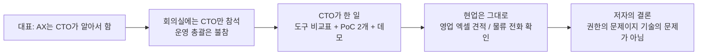
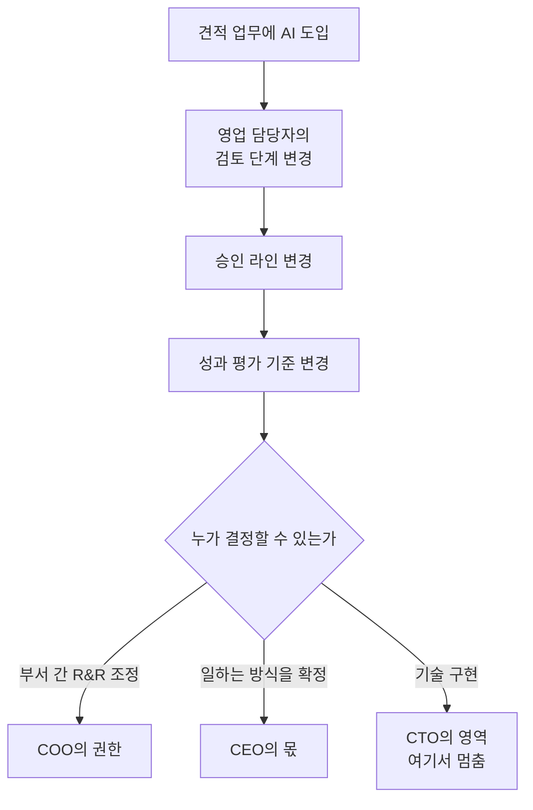
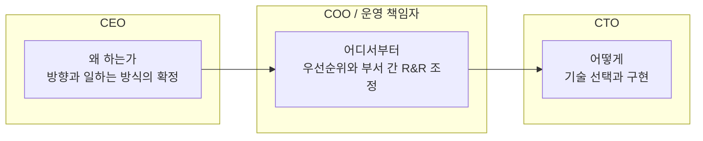
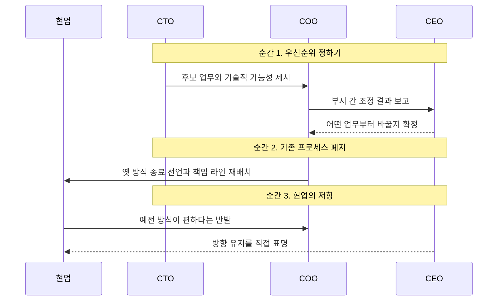

## 이 문서를 읽는 방법

이 문서는 한 컨설턴트가 Threads에 올린 글을 처음부터 끝까지 풀어서 설명하고, 글이 펼치는 주장이 실제 조사 자료와 얼마나 맞아떨어지는지 확인한 결과를 정리한 것입니다. 글 자체는 저자가 고객사 미팅에서 직접 겪은 장면과 거기서 얻은 경험칙을 담은 현장 기록입니다. 따라서 문서는 두 층으로 나뉩니다. 첫째는 "글이 무엇을 말하고 있는가"이고, 둘째는 "그 말이 외부 자료로 어디까지 뒷받침되는가"입니다. 두 층을 섞지 않으려고 노력했습니다. 글에서 나온 이야기는 어디까지나 저자 한 사람의 관찰이라는 점을 분명히 하고, 외부 자료로 확인된 내용에는 출처를 달았습니다.

한 가지 밝혀둘 점이 있습니다. 원문 링크는 사이트가 자동화된 접근을 막고 있어 직접 열어 확인하지 못했습니다. 그래서 이 문서의 글 요약은 전달받은 본문 텍스트에만 근거합니다. 글에 등장하는 회사, 대표, CTO가 누구인지는 본문에 나와 있지 않으며, 이 문서도 그것을 추측하지 않습니다.

---

## 1. 글의 줄거리: 한 번의 미팅에서 시작된 이야기

저자는 전날 어떤 회사와 미팅을 했습니다. 대표가 가장 먼저 꺼낸 말은 "AX는 우리 CTO가 알아서 하고 있어요"였습니다. 그런데 회의실에는 실제로 CTO만 앉아 있었고, 현업 운영을 총괄하는 책임자는 다른 일정이 있다며 자리에 없었습니다. 저자는 이 장면을 "너무 많이 봤다"고 표현합니다. 한 번의 우연이 아니라 반복되는 패턴이라는 뜻입니다.

한 시간 정도 이야기를 들어 보니 상황은 예상한 그대로였습니다. CTO는 도구 비교표를 만들었고, PoC(개념 검증)를 두 개 돌려 놓았으며, 그럴듯한 데모 화면까지 갖추고 있었습니다. 기술 쪽 준비는 성실하게 되어 있었던 셈입니다. 그러나 정작 현업의 일하는 방식은 하나도 바뀌지 않았습니다. 영업팀은 여전히 엑셀로 견적을 뽑았고, 물류팀은 여전히 전화로 재고를 확인하고 있었습니다.

저자는 여기서 책임을 CTO에게 돌리지 않습니다. CTO가 잘못한 것이 아니라 "프로세스를 바꿀 권한이 없었을 뿐"이라고 선을 긋습니다. 그리고 글 전체를 관통하는 한 줄 결론을 내놓습니다. AX는 기술 프로젝트가 아니라 일하는 방식을 바꾸는 프로젝트이고, 그 일은 COO와 CEO가 직접 들어오지 않으면 움직이지 않는다는 것입니다.

---

## 2. 용어부터 정리하기: AX가 무엇인가

AX는 AI Transformation, 즉 AI 전환을 줄여 부르는 말입니다. 국내 기업 실무 자료들은 AX를 기존 시스템에 AI 기능을 덧붙이는 일이 아니라 기업의 의사결정과 운영 방식 자체를 바꾸는 과정으로 설명합니다. 이전의 디지털 전환(DX)이 종이 문서를 파일로 바꾸고 업무를 전산화하는 데 무게를 두었다면, AX는 AI가 스스로 대안을 제시하거나 업무를 직접 수행하도록 만드는 데 목적이 있다는 구분입니다.

이 구분은 저자의 문제의식과 맞닿아 있습니다. 한 국내 IT 컨설팅 블로그는 DX를 진행한 많은 기업이 디지털화 수준에서 멈췄다고 지적합니다. 종이 계약서가 전자계약으로, 엑셀이 ERP로, 전화 문의가 홈페이지 폼으로 바뀌어 시스템은 분명 디지털이 되었지만, 그 위에서 사람이 일하는 순서와 방식은 그대로인 경우가 대부분이었다는 것입니다. 저자가 본 "데모는 있는데 현업은 그대로"인 장면은 DX 시절의 한계가 AX에서 되풀이되는 모습으로 읽을 수 있습니다. 다만 이것은 해당 블로그가 만난 기업들에 대한 관찰이므로, 모든 기업에 적용되는 통계가 아니라는 점은 감안해야 합니다.

---

## 3. 왜 CTO 혼자서는 안 되는가: 글의 핵심 논리

### 가장 어려운 것은 모델 선택이 아니라 "누가 무엇을 그만두는가"

저자는 AX에서 가장 어려운 일이 모델을 고르는 것이 아니라고 말합니다. 진짜 어려운 것은 "누가 어떤 일을 그만두고, 누가 결과를 책임지는가"를 정하는 일입니다. 견적 업무에 AI를 붙이는 상황을 예로 듭니다. AI가 초안을 만들어 주면 영업 담당자가 하던 검토 단계가 달라집니다. 검토 단계가 달라지면 승인 라인도 달라져야 하고, 사람들이 무엇으로 평가받는지, 즉 성과 평가 기준도 따라서 달라져야 합니다.

이 연쇄를 따라가 보면 기술 도입이 곧바로 조직의 권한, 책임, 보상 문제로 번진다는 것을 알 수 있습니다. 그런데 CTO가 영업본부장에게 "이렇게 바꾸세요"라고 말할 수 있느냐는 것이 저자의 질문이고, 답은 "못 한다"입니다. 저자의 정리에 따르면 부서 간 역할과 책임(R&R)의 조정은 COO의 권한이고, "이 일은 이제 이렇게 한다"고 못 박는 것은 CEO의 몫입니다.

### 흔한 안티패턴: 킥오프에서 한마디 하고 빠지는 대표

글은 흔한 실패 시나리오도 하나 소개합니다. 대표가 킥오프 자리에서 "AI 적극 활용하자"라고 한마디 하고 자리를 뜹니다. 석 달이 지나면 현업은 "바빠서 못 쓴다"고 하고, IT는 "만들어 놨는데 안 쓴다"고 말합니다. 서로를 탓하는 사이 구독료만 조용히 빠져나갑니다. 저자는 이때 "기술은 거의 다 준비돼 있었다"는 점을 강조합니다. 즉 실패의 원인이 기술이 아니라 결정과 집행의 공백이라는 주장입니다.

이 시나리오가 특정 회사의 실제 사례인지, 여러 사례를 합친 일반화인지는 글에서 밝히지 않았습니다. 그래서 이 부분은 "저자가 반복해서 목격했다고 말하는 전형적 패턴" 정도로 받아들이는 것이 정확합니다.

---

## 4. 저자의 처방: 세 순간에는 반드시 결정권자가 있어야 한다

저자는 요즘 미팅을 잡을 때 조건을 하나 건다고 합니다. 첫 워크숍에는 대표와 운영 책임자가 꼭 같이 앉아 있어야 한다는 것입니다. 모든 회의에 참석하라는 요구는 아닙니다. 대신 세 가지 순간에는 반드시 있어야 한다고 합니다.

첫 번째는 어떤 업무부터 바꿀지 우선순위를 정할 때입니다. 우선순위는 곧 어느 부서의 일을 먼저 건드리느냐의 문제이므로, 부서 간 이해관계를 조정할 수 있는 사람이 필요합니다. 두 번째는 기존 프로세스를 실제로 없애는 결정을 할 때입니다. 새 방식을 얹기만 하고 옛 방식을 없애지 않으면 현업에는 일이 두 배로 늘어날 뿐이고, 없애는 결정은 누군가 책임을 지고 내려야 합니다. 세 번째는 현업이 "예전 방식이 편한데요" 하고 버틸 때입니다. 변화에 대한 자연스러운 저항 앞에서 최종적으로 방향을 지켜 줄 수 있는 사람이 필요하다는 뜻입니다.

저자는 이 세 순간에 결정권자가 없으면 CTO가 아무리 잘 만들어도 사내 데모로 끝난다고 단언합니다. 그리고 역할 분담을 이렇게 요약합니다. CTO는 "어떻게"를, COO는 "어디서부터"를, CEO는 "왜 해야 하는지"를 쥐고 있어야 하며, 셋 중 하나만 빠져도 무언가 굴러가긴 하지만 방향이 잡히지 않는다는 것입니다.

위 도표는 글의 내용을 이해하기 쉽게 시각화한 것입니다. 글에 나온 "세 순간"과 "세 역할"을 한 장면으로 엮은 것이므로, 각 화살표의 구체적 행동은 저자가 말한 원칙을 풀어 그린 것이지 실제 회의록이 아닙니다.

---

## 5. 글의 주장은 외부 자료와 맞는가

저자의 글은 개인 경험담입니다. 그래서 같은 방향을 가리키는 공개 자료가 있는지 확인해 보았습니다. 결론부터 말하면, 큰 방향은 여러 조사와 일치하지만, 자료마다 성격이 다르므로 각각 어디까지 말해 주는지 구분해서 읽어야 합니다.

### 5-1. McKinsey 글로벌 설문: CEO 감독과 워크플로 재설계

가장 직접적인 근거는 McKinsey가 2025년 3월에 발표한 AI 설문 보고서입니다. 이 보고서는 조직이 생성형 AI로 얻는 재무적 성과와 25가지 조직 속성 사이의 상관관계를 분석했습니다. 그 결과 AI 거버넌스, 즉 AI를 책임 있게 개발하고 운영하기 위한 정책과 절차를 CEO가 직접 감독하는 것이 자체 보고된 이익 영향(EBIT 영향)과 가장 높은 상관을 보이는 요소 중 하나였고, 특히 규모가 큰 기업에서는 그 영향이 가장 컸다고 밝혔습니다. 같은 보고서는 테스트한 25개 속성 가운데 업무 흐름의 재설계가 EBIT 영향을 보는 능력에 가장 큰 효과를 냈다고도 밝혔습니다.

이 결과를 저자의 글에 대응시키면, "CEO가 들어와야 한다"와 "프로세스가 바뀌어야 한다"는 두 주장이 모두 이 조사의 두 대표 발견과 맞물립니다. 같은 보고서에서 AI를 쓰는 조직의 응답자 중 CEO가 AI 거버넌스를 감독한다고 답한 비율은 28%였고, 이사회가 감독한다는 응답은 17%였습니다. 즉 상관관계가 높은데도 실제로 CEO가 직접 챙기는 기업은 소수라는 이야기이고, 이는 저자가 마지막에 던진 질문 "대표님이 직접 챙기는 곳이 진짜 있느냐"에 대한 하나의 데이터가 됩니다.

여기서 반드시 짚어야 할 한계가 있습니다. 이 분석은 인과관계가 아니라 상관관계이고, 이익 영향도 응답자가 스스로 보고한 값입니다. 따라서 "CEO가 감독하면 이익이 늘어난다"고 단정할 수는 없고, "CEO 감독이 있는 조직에서 성과 보고가 더 좋은 경향이 있다" 정도가 정확한 표현입니다.

### 5-2. McKinsey 2025년 말 보고서: 상위 성과 조직의 특징

McKinsey의 더 최근 AI 현황 보고서를 다룬 2차 자료들에 따르면, 조사에 참여한 조직 중 약 88%가 적어도 하나의 업무 기능에서 AI를 쓰고 있었습니다. 반면 AI로 인한 EBIT 영향을 보고한 조직은 약 39%였고, 대부분은 귀속 비율이 5% 미만이었습니다. AI 덕분에 EBIT의 5% 이상을 얻는다고 답한 "상위 성과 조직"은 전체의 약 6% 수준이었습니다. 이 상위 성과 조직들은 그렇지 않은 조직보다 업무 흐름을 근본적으로 재설계했다고 답한 비율이 훨씬 높았는데, 한 분석 글은 이를 55% 대 20%로 소개하며 약 2.8배 차이라고 정리했습니다.

이 수치들은 McKinsey 원문이 아니라 해당 보고서를 해설한 2차 자료에서 가져온 것이므로, 정확한 수치가 필요한 보고서나 발표에 쓰실 때는 원 보고서를 직접 확인하시길 권합니다. 다만 "많은 조직이 AI를 쓰지만 실제 재무 성과로 이어진 곳은 적고, 차이를 만드는 것은 일하는 방식의 재설계"라는 방향성은 여러 해설에서 일관되게 나타납니다.

### 5-3. MIT NANDA 보고서와 Gartner 전망: 데모에서 멈추는 프로젝트들

저자가 묘사한 "PoC와 데모는 있는데 현업은 그대로"라는 상태가 업계 전반의 현상인지 보여 주는 자료도 있습니다. MIT의 NANDA 프로젝트가 2025년 8월에 낸 "The GenAI Divide: State of AI in Business 2025"는 기업용 생성형 AI 파일럿의 약 95%가 측정 가능한 재무 성과를 내지 못했다고 보고했습니다. 이 보고서를 소개한 매체들은 내부 개발 노력이 조정 부족과 현업 요구와의 불일치로 정체되는 경향도 함께 전합니다. 이 수치는 매우 널리 인용되는 반면, "측정 가능한 재무 성과가 없다"는 기준이 파일럿 단계의 짧은 기간을 어떻게 다루는지 등 세부 정의는 원문을 확인해야 정확히 알 수 있습니다.

Gartner는 2025년 6월 보도자료에서, 에이전트형 AI 프로젝트의 40% 이상이 2027년 말까지 취소될 것이라고 예측했습니다. 이유로는 비용 증가, 불분명한 사업 가치, 부족한 위험 통제를 꼽았습니다. Gartner 분석가는 현재의 많은 에이전트 프로젝트가 초기 단계의 실험이나 개념 검증이며 유행에 이끌려 잘못 적용되는 경우가 많다고 말했습니다. 이 40%는 이미 일어난 일에 대한 통계가 아니라 미래에 대한 예측이라는 점에 주의해야 합니다.

두 자료는 저자의 글과 같은 사실을 직접 입증하지는 않습니다. 이 자료들은 "AI 프로젝트가 데모와 파일럿 단계에서 재무 성과로 넘어가지 못하는 일이 흔하다"는 큰 그림을 보여 줄 뿐이고, 그 이유가 "COO와 CEO의 부재" 때문이라고까지는 말하지 않습니다. 이 인과 고리는 저자의 해석이며, McKinsey 조사에서 확인되는 CEO 감독과의 상관관계가 이를 부분적으로 지지하는 정도입니다.

### 5-4. 국내 사례: SK그룹 최태원 회장의 AX 선언

국내에서 최고경영자가 직접 AX를 전면에 내세운 사례도 있습니다. 2026년 6월 11일부터 13일까지 경기 이천 SKMS연구소에서 열린 "2026 뉴 이천포럼"에서 최태원 SK그룹 회장은 전방위로 전속력으로 AX에 돌입해야 한다고 강조했습니다. 이번 포럼은 2019년부터 열려 온 행사인데, 사흘 전체를 하나의 주제로 채운 것은 처음이었고 그 주제가 AI였다고 보도되었습니다.

특히 눈에 띄는 대목은 AX의 첫걸음에 대한 최 회장의 발언입니다. 보도에 따르면 그는 AX의 첫 단계가 우리가 하는 일을 명확히 정의하고 AI로 무엇을 어떻게 혁신할지 파악하는 것이라고 말했습니다. 또 구성원 한 사람당 AI 에이전트 하나를 두는 "1인 1 에이전트" 체제를 제안하며 "나의 AI"에서 "우리의 AI"로 나아가자고 했습니다. 일을 정의하는 것으로 시작한다는 발언은 저자가 말한 "무엇을 그만두고 무엇을 책임질지 정하는 것이 가장 어렵다"는 문제의식과 방향이 비슷합니다.

다만 이 사례를 저자의 주장이 입증된 증거로 쓰는 것은 적절하지 않습니다. 이것은 대기업 총수가 AX를 선언한 보도일 뿐, 그 이후 실제 프로세스가 얼마나 바뀌었는지나 성과가 어땠는지는 보도 시점 기준으로 확인할 수 없습니다. "경영진 최상단이 공개적으로 AX를 이끌겠다고 나서는 사례가 존재한다" 정도로만 받아들이는 것이 안전합니다.

### 5-4-1. 자료별 한계 요약

| 자료 | 말해 주는 것 | 말해 주지 않는 것 |
|---|---|---|
| McKinsey 2025년 3월 설문 | CEO의 AI 거버넌스 감독과 워크플로 재설계가 자체 보고 성과와 상관이 높음. CEO 감독 비율은 28% | 인과관계. 응답은 자체 보고 |
| McKinsey 이후 보고서 해설(2차 자료) | AI 사용은 광범위하나 EBIT 영향 보고는 약 39%, 상위 성과 조직은 약 6% | 원문 수치의 정확한 정의 |
| MIT NANDA 2025 | 생성형 AI 파일럿의 약 95%가 측정 가능한 재무 성과 없음 | 실패 원인이 경영진 부재 때문인지 여부 |
| Gartner 2025년 6월 | 에이전트형 AI 프로젝트 40% 이상이 2027년 말까지 취소 예측 | 이미 발생한 통계가 아닌 예측 |
| SK그룹 이천포럼 보도 | CEO가 직접 AX를 선언하고 "일의 정의"를 첫 단계로 제시 | 이후 실제 성과 |

---

## 6. 저자의 글에서 확인된 것과 해석인 것의 구분

글을 읽을 때 저자의 서술을 세 층으로 나누어 보면 이해가 쉽습니다.

첫째는 저자가 직접 본 사실입니다. 대표가 "CTO가 알아서 한다"고 말했다는 것, 회의실에 CTO만 있었다는 것, PoC가 두 개 있었고 현업 방식은 그대로였다는 것이 여기에 속합니다. 이는 저자 한 사람의 관찰이며 제3자가 확인할 수 없습니다.

둘째는 저자의 해석입니다. "CTO 잘못이 아니라 권한 부재"라는 진단, "R&R 조정은 COO, 일하는 방식의 확정은 CEO"라는 권한 배분, "세 순간에 결정권자가 필요하다"는 처방이 여기에 해당합니다. 이는 경험에서 나온 합리적 가설이지만, 회사마다 조직 구조와 권한 배분은 다릅니다. 예를 들어 어떤 회사는 CTO가 운영 권한까지 갖고 있을 수 있고, COO 직책 자체가 없는 회사도 있을 것입니다. 글은 이런 예외를 다루지 않으므로, "대부분의 경우에 해당하는 원칙"이 아니라 "저자가 자주 보는 구도"로 읽어야 합니다.

셋째는 외부 자료와 겹치는 부분입니다. 앞 장에서 살폈듯이 CEO 감독과 워크플로 재설계가 성과와 연결된다는 McKinsey 설문, 파일럿이 성과로 이어지지 못하는 사례가 많다는 MIT와 Gartner 자료가 이에 해당합니다. 이 겹침은 저자의 직관이 근거 없는 것이 아님을 보여 주지만, 저자의 구체적 처방이 효과적임을 입증하는 증거는 아닙니다.

---

## 7. 현업에서 이 글을 어떻게 활용할 수 있는가

글의 처방을 실제 도입 프로젝트에 가져다 쓴다면, 저자가 제시한 세 순간을 일종의 점검표로 활용할 수 있습니다. 킥오프 단계에서는 "어떤 업무부터 바꿀지"를 정하는 자리에 대표와 운영 책임자가 함께 있는지 확인합니다. 실행 단계에서는 새 방식이 도입될 때 기존 방식을 언제, 누가, 어떻게 종료할지를 문서로 못 박았는지 확인합니다. 정착 단계에서는 현업의 저항이 나타났을 때 누가 최종 판단을 내리는지 미리 정해 두었는지 확인합니다.

이 세 질문에 답이 없다면, 기술이 아무리 잘 준비되어 있어도 저자가 묘사한 "사내 데모로 끝나는 프로젝트"가 될 위험이 있다는 것이 글의 메시지입니다. 이 점검표는 저자의 경험칙을 정리한 것이지, 검증된 성공 공식이 아니라는 점은 다시 한번 강조합니다.

---

## 8. 마무리: 글이 던진 질문

저자는 글의 끝에서 독자에게 묻습니다. 회사에서 AI 도입 이야기가 나오면 결국 누구에게 떨어지는지, 그리고 대표가 직접 챙기는 곳이 실제로 있는지입니다. 이 질문은 McKinsey 조사에서 CEO가 AI 거버넌스를 직접 감독한다고 답한 조직이 28%에 그쳤다는 수치와 묘하게 겹칩니다. 물론 그 수치가 곧 "대표가 직접 챙기는 회사는 소수"라는 뜻은 아닙니다. 조사는 AI 거버넌스 감독이라는 특정 역할을 물은 것이고, 대표가 다른 방식으로 관여하는 경우까지 포함하지는 않기 때문입니다. 그래도 저자의 질문이 단순한 푸념이 아니라 실제로 측정되고 있는 조직적 간극을 가리키고 있다는 점은 분명합니다.

정리하면 이 글의 요지는 한 문장으로 모입니다. AX의 병목은 기술 선택이 아니라 일하는 방식을 바꾸는 결정에 있고, 그 결정은 기술 책임자가 내릴 수 있는 종류의 결정이 아니라는 것입니다. 이 주장은 저자 개인의 관찰에서 출발했지만, 공개된 조사 자료의 큰 흐름과도 어긋나지 않습니다. 다만 구체적인 역할 배분과 처방의 효과는 조직마다 달라질 수 있으므로, 각자의 조직 구조에 맞춰 검증해 가며 적용하시길 권합니다.

---

## 참고한 자료

- McKinsey, "The state of AI: How organizations are rewiring to capture value" (2025년 3월): https://www.mckinsey.com/capabilities/quantumblack/our-insights/the-state-of-ai-how-organizations-are-rewiring-to-capture-value
- McKinsey 후속 AI 현황 보고서 해설(2차 자료): CX Today, "McKinsey's State Of AI: The Scaling Gap Is Now CX's Problem" https://www.cxtoday.com/ai-automation-in-cx/mckinseys-state-of-ai-the-scaling-gap-is-now-cxs-problem/ / Libertify 해설 https://www.libertify.com/interactive-library/mckinsey-state-of-ai-2025-agents-innovation-transformation/
- Gartner 보도자료, "Gartner Predicts Over 40% of Agentic AI Projects Will Be Canceled by End of 2027" (2025년 6월 25일): https://www.gartner.com/en/newsroom/press-releases/2025-06-25-gartner-predicts-over-40-percent-of-agentic-ai-projects-will-be-canceled-by-end-of-2027
- MIT NANDA, "The GenAI Divide: State of AI in Business 2025" 해설(2차 자료): https://nationalcioreview.com/articles-insights/extra-bytes/mit-finds-genai-projects-fail-roi-in-95-of-companies/
- Korea Herald(헤럴드경제) 영문판, SK그룹 2026 뉴 이천포럼 보도 (2026년 6월 14일): https://biz.heraldcorp.com/article/10780716
- 아시아경제 영문판, SK그룹 최태원 회장 "1인 1 에이전트" 보도: https://view.asiae.co.kr/en/article/2026061410573729416
- AX와 DX의 차이에 관한 국내 실무 해설: https://eopla.net/magazines/44621 / https://www.alchera.ai/resource/blog/ac-enterprise-ax-fast-implementation-method
