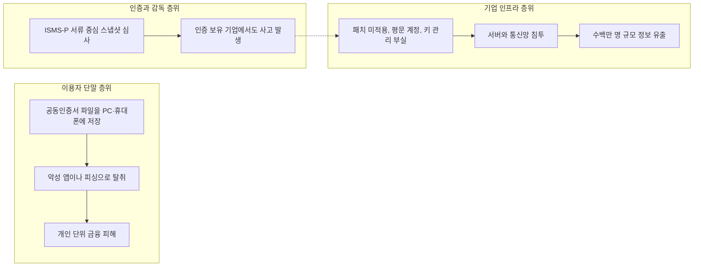
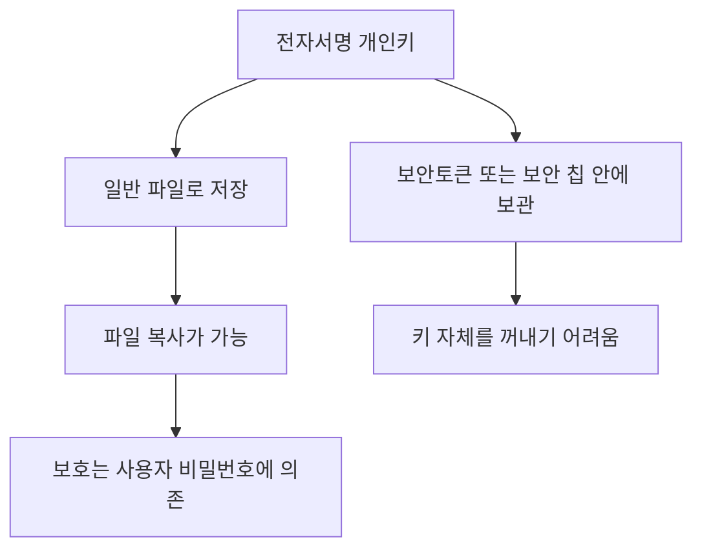
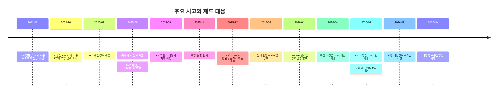
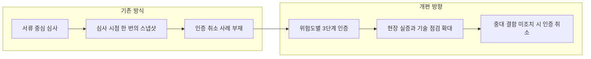

- 작성 기준일: 2026-10-05
- 목적: SNS에서 공유된 한 게시글의 주장과 그에 달린 댓글을, 2025~2026년에 실제로 확인된 사고 조사 결과와 제도 변화에 비추어 하나씩 점검한다.

> 
> 은행이나 통신사나 그런 곳들이 계속 뚫리는 이유는 두 가지. 공동인증서와 국가가 강제하는 보안 인증 체계 때문이다.
> 
> 공동인증서는 해커들에게 아주 좋은 해킹 툴이며, 국가가 강제하는 보안 인증 체계는 매우 허술하지만 인증을 받으려면 따를 수 밖에 없기 때문이다.
> 
> https://www.facebook.com/share/p/19NMQB7FPB/
> 

---

## 0. 먼저 결론부터

게시글은 한 문장으로 요약하면 "은행이나 통신사가 계속 뚫리는 이유는 두 가지, 공동인증서와 국가가 강제하는 보안 인증 체계다"라는 주장이다. 이 주장을 최신 자료로 검증해 보면, 절반은 근거가 탄탄하고 절반은 근거가 확인되지 않는다.

탄탄한 쪽은 "국가 보안 인증 체계가 사고를 막아 주지 못했다"는 부분이다. 정부 스스로 이 점을 인정하고 2026년 4월에 제도 전면 개편안을 내놓았다. 정부 발표에 따르면 최근 3년간 인증을 받은 기업 가운데 약 14%에 해당하는 179개 사에서 침해 사고가 있었다. 롯데카드는 ISMS-P 인증을 받은 지 이틀 만에 해킹을 당했고, 쿠팡은 인증을 받고 갱신까지 마친 상태에서 대규모 유출을 겪었다.

확인되지 않는 쪽은 "공동인증서가 은행과 통신사가 뚫리는 원인"이라는 부분이다. 공동인증서가 이용자 단말에서 탈취되기 쉬운 구조라는 점은 오래전부터 지적되어 왔고 실제 악성코드 사례도 있다. 그러나 이번에 살펴본 SK텔레콤, KT, 롯데카드, 쿠팡 네 건의 대형 사고에서 정부와 감독기관이 밝힌 직접 원인은 모두 기업 내부의 서버·망·키 관리 문제였다. 이번 검색 범위 안에서 이 사고들의 원인으로 공동인증서가 지목된 공식 자료는 찾지 못했다.

그래서 이 문서의 가장 중요한 메시지는 이렇다. "뚫린다"는 말에는 서로 다른 두 층위가 섞여 있다. 하나는 이용자 개인의 인증서가 털리는 문제이고, 다른 하나는 기업의 서버와 망이 침투당해 수백만 명의 정보가 한꺼번에 나가는 문제다. 게시글은 이 둘을 하나로 묶어 두 개의 원인으로 설명하지만, 실제 조사 결과는 훨씬 더 복합적이다.

### 이 문서의 근거 표기 방식

문장 끝에 붙은 표기는 근거의 종류를 뜻한다.

- **[공식]** 정부·감독기관의 발표, 또는 그 발표를 그대로 전한 보도
- **[보도]** 언론 보도 또는 전문가 해설
- **[해석]** 필자의 분석이나 일반적인 기술 설명으로, 검증된 사실과는 구분해서 읽어야 한다

---

## 1. 게시글은 무엇을 말하고 있나

게시글의 요지는 두 가지다. 첫째, 공동인증서는 해커에게 아주 좋은 해킹 도구다. 둘째, 국가가 강제하는 보안 인증 체계는 매우 허술하지만, 인증을 받으려면 기업이 그 체계를 따를 수밖에 없다. 그래서 은행이나 통신사 같은 곳이 계속 뚫린다는 것이 전체 논리다.

이 글에 달린 댓글 중 눈에 띄는 것은 "SSH 접속할 때 아이디·비밀번호 대신 키 값 기반으로 처리하듯이, 금융권도 진작에 바뀌었어야 한다"는 내용이다. 이 댓글은 공동인증서가 비밀번호 방식에 가까운 낡은 인증이라는 전제를 깔고 있는데, 이 전제가 맞는지는 3장에서 따로 다룬다.

---

## 2. 먼저 구분해야 할 세 개의 층위

"뚫린다"는 표현이 어디서 무슨 일이 벌어진 것인지에 따라 원인도 해법도 완전히 달라진다. 이 문서에서는 사고를 세 층위로 나누어 본다.

첫 번째는 **이용자 단말 층위**다. 내 PC나 휴대폰에 저장된 인증서 파일이 악성코드로 빠져나가는 문제이고, 피해는 보통 개인 단위로 발생한다. 공동인증서 논쟁은 주로 이 층위에서 벌어진다.

두 번째는 **기업 인프라 층위**다. 통신사나 카드사, 쇼핑몰의 서버와 내부망이 침투당해 수백만~수천만 명의 정보가 한 번에 나가는 문제다. 최근 몇 년간 크게 보도된 사고는 대부분 여기에 속한다.

세 번째는 **인증과 감독 층위**다. 기업이 "보안 관리 체계를 갖췄다"고 국가로부터 인증받았는데도 사고가 난다면, 그 인증이 실제 안전을 얼마나 보증하는지가 문제가 된다. 게시글의 두 번째 주장이 이 층위에 해당한다.

게시글은 첫 번째 층위의 문제(공동인증서)를 근거로 두 번째 층위의 사고(은행·통신사가 뚫림)를 설명하려는데, 두 층위는 서로 다른 곳에서 일어나는 일이어서 이 연결은 별도의 증거가 필요하다.

---

## 3. 공동인증서: 무엇이고, 왜 위험하다는 말이 나오는가

### 3.1 이름이 바뀐 공인인증서

공동인증서는 과거 공인인증서의 새 이름이다. 2020년 12월 10일 개정 전자서명법이 시행되면서 공인인증서의 독점적 지위가 사라졌고, 기존 인증서는 유효기간까지 그대로 쓸 수 있으며 새로 발급받는 것은 '공동인증서'라는 이름이 붙게 되었다. **[보도]** 이때부터 통신사 PASS, 카카오, 네이버, 토스 같은 민간 인증서도 같은 자리에서 쓸 수 있게 되었다. 금융결제원의 금융인증서는 클라우드에 인증서를 저장하고 지문이나 간편 비밀번호를 쓰는 방식으로 소개되었다. **[보도]**

따라서 게시글의 "국가가 강제하는"이라는 표현을 공동인증서에 적용하면 현재 사실과는 맞지 않는다. 적어도 법적으로는 2020년 12월에 공동인증서 사용 강제와 독점이 사라졌다. 다만 현실의 사용 관행은 쉽게 바뀌지 않았다. 폐지 1년여 뒤인 2022년 1월 보도에 따르면 정부24에서 공동인증서 사용률은 84.5%였다. **[보도]** 이 수치는 4년 반 전 자료여서 현재 비중을 보여 주지는 못한다는 점을 밝혀 둔다. 최신 이용 비중 통계는 이번 검색에서 확인하지 못했다.

### 3.2 "해커에게 좋은 도구"라는 말의 근거

이 말에는 실제 근거가 있다. 공동인증서는 사용자 PC나 스마트폰의 저장소에 NPKI라는 폴더로 저장되는 방식이 오래 쓰였다. 2013년 보도에서 보안 전문가들은 이 폴더가 마음만 먹으면 쉽게 복사할 수 있는 구조라고 설명했고, 그 무렵 금융감독원은 악성코드로 유출된 인증서 461개를 폐기했다고 밝혔다. **[보도]** KISA와 인증기관들이 NPKI 폴더를 없애는 방안을 추진했다는 보도에서도, 공격자들이 NPKI 폴더를 찾아 압축해 전송하는 악성코드를 만들어 배포하고 있다고 적혀 있다. **[보도, 게재일 미확인]** 은행도 이용자 안내문에서 PC 하드디스크에 저장된 공동인증서가 해킹으로 유출될 수 있고, 가짜 은행 사이트로 인증서 비밀번호까지 빼내는 사례가 있다고 경고한다. **[보도]**

최근 사례도 있다. 2025년 4월 카스퍼스키가 공개한 '숨니봇' 공격은 결혼식 청첩장으로 위장한 링크로 악성 앱을 설치하게 만들어 은행 디지털 인증서와 연락처, 메시지, 사진 등을 빼내는 방식이었고, 국내 안드로이드 사용자를 겨냥해 2024년 8월에 시작된 것으로 보도되었다. **[보도]** 이통사 인증 앱인 PASS를 흉내 낸 피싱 사이트로 개인정보를 빼내는 시도도 2025년 8월에 보도되었다. **[보도]** 이런 사례들은 인증서와 인증 수단이 이용자를 노린 공격의 표적이 된다는 점을 보여 준다.

### 3.3 그런데 이것이 기업 대형 사고의 원인인가

여기서 게시글의 논리가 약해진다. 위 사례들은 이용자 개인의 단말이 감염되는 사고이고 피해도 개인 단위로 발생한다. 반면 SK텔레콤, KT, 롯데카드, 쿠팡에서 정부와 감독기관이 확인한 원인은 4장에서 보듯 서버 관리, 계정 관리, 암호화, 패치, 키 관리 같은 기업 내부의 문제였다. 이번에 확인한 공식 자료에서 이 네 사고의 원인으로 공동인증서가 지목된 대목은 없었다. **[공식·보도 종합, 검색 범위 내]**

이용자 층위의 위험이 실재한다는 것과, 그것이 대형 기업 사고의 원인이라는 것은 별개의 명제다. 앞의 것은 근거가 있지만 뒤의 것은 이번 조사에서 근거를 찾지 못했다.

### 3.4 댓글의 "키 기반 인증" 논점은 어떻게 봐야 하나

댓글은 SSH의 키 기반 접속을 예로 들며 금융권도 그렇게 바뀌었어야 한다고 말한다. 여기에는 기술적으로 정리해 둘 점이 있다. **[해석]**

공동인증서는 사실 이미 공개키 기반 구조(PKI)를 쓴다. 개인키로 전자서명을 만들고 상대방은 공개키로 검증하는 구조이므로, 아이디·비밀번호 방식과는 원리가 다르다. 문제는 암호 이론이 아니라 개인키를 어디에 어떻게 보관하느냐다. 공동인증서의 개인키가 일반 파일로 저장되어 복사될 수 있는 구조라면, 그 파일을 지키는 것은 사실상 사용자가 정한 비밀번호 하나뿐이다. SSH 개인키 파일도 같은 약점을 가진다. 키 파일이 passphrase 없이 놓여 있거나 파일째 유출되면 키 기반이라는 사실만으로는 안전하지 않다.

그래서 해법은 키 파일을 꺼낼 수 없게 만드는 쪽에 있다. 우리은행 안내문은 보안토큰이 물리적 보안과 암호 연산 기능을 가진 칩을 내장해 유출을 막는 휴대 저장매체라고 설명한다. **[보도·금융기관 안내]**

흥미로운 점은 이번 대형 사고들에서도 키와 인증서의 관리 실패가 반복해서 등장한다는 것이다. KT 사고에서는 펨토셀 인증서의 유효기간이 10년으로 너무 길게 설정되어 있었고, 쿠팡 사고는 인증 서명키 관리 문제에서 시작되었다. 둘 다 이용자의 공동인증서와는 다른 종류의 인증서와 키이지만, "키 기반으로 바꾸면 안전하다"는 말만으로는 부족하고 키의 수명, 보관, 폐기, 회수 관리가 실제 안전을 좌우한다는 점을 보여 준다. 이는 필자의 해석이다.

---

## 4. 2025~2026년 대형 사고에서 실제로 확인된 원인

네 개의 사고에서 정부와 감독기관이 확인한 내용을 차례로 정리한다. 이 장의 내용은 대부분 정부 조사 결과와 제재 결정에 근거한 것이다.

### 4.1 SK텔레콤: 평문 계정, 암호화 미흡, 3년 전의 침해 징후

과기정통부 민관합동조사단은 2025년 7월 4일 최종 결과를 발표했다. 공격자는 2021년 8월 외부 인터넷과 맞닿은 서버로 침투해 평문으로 저장된 계정 정보를 확인했고, 이를 바탕으로 내부 서버와 핵심망 시스템에 악성코드를 설치한 뒤 고객관리망까지 감염시켰으며, 2025년 4월 유심 정보를 외부로 유출했다. 조사단은 계정 정보 평문 저장, 중요 정보 미암호화, 침해 사고 신고 지연과 누락, 디지털 포렌식 방해, 거버넌스 미흡, 보안 투자와 인력 부족 등을 문제로 지적했다. 일부 서버는 2022년에 이미 침해 사실이 있었는데도 정부에 신고하지 않았다고 한다. **[공식]**

개인정보보호위원회는 2025년 8월 27일 전체회의에서 SK텔레콤에 과징금 1,347억 9,100만 원과 과태료 960만 원을 부과하기로 의결했다. 유출된 정보는 알뜰폰을 포함한 LTE·5G 이용자 2,324만 4,649명의 25종 정보로, 전화번호, 가입자식별번호(IMSI), 유심인증키 등이 포함되었다. 개인정보위는 SK텔레콤이 3년 전 해커가 HSS에 접속한 사실을 확인하고도 악성 프로그램 설치 여부를 확인하지 않았다는 점, 그리고 개인정보보호책임자(CPO)의 역할이 웹·앱 같은 IT 영역에 국한되어 있었다는 점도 문제로 삼았다. **[공식·보도]** 이후 SK텔레콤은 이 과징금에 불복해 2026년 1월 취소소송을 제기한 것으로 보도되었다. **[보도]**

### 4.2 KT: 펨토셀 인증서 10년, 접속 IP 무제한, 11개월간 미탐지

개인정보위는 2026년 7월 29일 전체회의에서 KT에 과징금 539억 7,900만 원과 시정명령, 개선권고, 공표명령을 의결했다. 조사에 따르면 해커는 유실된 KT 펨토셀에서 인증서를 빼낸 뒤 직접 만든 불법 펨토셀에 이를 심어 KT 이동통신망에 접속했다. 그 과정에서 이용자 단말과 내부망 사이를 오가는 정보를 가로채고, 추가로 확보한 이름과 생년월일 등을 결합해 소액결제를 시도했다. **[공식·보도]**

관리 부실의 구체적 내용도 확인되었다. 펨토셀 인증서의 유효기간을 10년으로 길게 설정했고, 내부망에 접속하는 IP를 제한하지 않았으며, 관리 서버에 접근할 수 있는 우회 경로가 있었고, 해커가 침투했을 때의 대응 체계도 마련되어 있지 않았다. 해커는 2024년 10월부터 2025년 9월까지 약 11개월간 내부망에 접속했지만 KT는 소액결제 피해 민원이 들어온 뒤에야 이를 파악했다. **[공식·보도]**

피해 규모는 기관마다 집계가 다르다. 개인정보위 기준으로는 1만 6,647명의 정보가 유출되었고 368명이 약 2억 4천만 원의 무단 소액결제 피해를 입었다. 민관합동조사단의 2025년 12월 최종 발표에서는 가입자식별번호 등이 유출된 규모가 2만 2,227명으로 보도되었다. 두 수치의 차이가 어디서 오는지는 이번 검색에서 확인하지 못했다. 또한 개인정보위는 KT가 2025년 4월 악성코드 점검 과정에서 침해 서버 10대의 로그를 삭제했고 거짓 자료를 제출해 조사를 방해했다고 보아 수사기관에 고발하기로 했다. 같은 조사 결과 발표에서 LG유플러스는 서버 폐기 혐의로 수사 의뢰 대상이 되었으나, 그 폐기가 조사 착수 이전에 이뤄져 현행법의 조사방해 조항을 적용하기 어려웠다고 한다. **[공식·보도]**

이 사건에서 하나 더 눈여겨볼 대목은 소액결제가 문자(SMS)와 자동응답(ARS) 인증을 가로채는 방식으로 이뤄졌다는 점이다. 즉 통신망 안쪽이 뚫리면 그 위에 얹힌 문자 기반 인증도 함께 무력해질 수 있다. 이것은 공동인증서와는 별개의 인증 수단 문제로, 필자가 사건에서 읽어낸 해석이다. **[해석]**

### 4.3 롯데카드: 8년 전 패치, 암호화 미이행, 백신 미설치

롯데카드 해킹으로는 약 297만 명의 신용정보가 유출되었고, 이 가운데 약 28만 3천 명은 카드 비밀번호와 CVC 번호까지 빠져나간 것으로 확인되었다. **[공식·보도]** 매일경제 보도는 2017년 서버 보안을 강화하는 과정에서 보강 작업(패치)이 누락된 곳을 해커가 파고든 것이 직접적 원인이라고 전했다. **[보도]**

금융위원회는 2026년 7월 31일 롯데카드에 1.5개월 업무정지와 과징금 50억 원을 부과하기로 의결했다. 금융감독원 검사에서 온라인 결제 시스템 운영 중 보안 패치를 적용하지 않았고, 주민등록번호와 비밀번호를 암호화하지 않았으며, 바이러스 백신 소프트웨어를 설치하지 않은 사실이 확인되었다. 해킹 사고를 이유로 한 업무정지는 이번이 처음이다. 앞서 개인정보위도 2026년 3월 롯데카드에 과징금 96억 2천만 원과 과태료 480만 원을 의결했다. **[공식·보도]**

롯데카드의 사례는 이 문서의 핵심 쟁점인 인증 체계와도 직접 닿는다. 롯데카드는 2025년 금융보안원으로부터 ISMS-P를 받은 지 이틀 만에 해킹 공격을 받은 것으로 보도되었다. **[보도]**

### 4.4 쿠팡: 인증 서명키 관리와 퇴사자 관리

쿠팡 민관합동조사단은 이 사고가 고도화된 외부 해킹보다는 인증·암호키 관리 미흡 같은 내부 보안 관리 부실에서 비롯되었다고 발표했고, 유출된 개인정보는 3,367만여 건으로 확인되었다. **[공식·보도]** 개인정보위는 2026년 6월 10일 쿠팡에 과징금 6,246억 8,100만 원과 과태료 1,680만 원을 의결했는데, 이 가운데 유출 사고 관련 과징금이 4,235억 7,500만 원이고 유출 규모는 약 3,322만 명으로 발표되었다. 개인정보위는 쿠팡의 '대체 인증 서명키' 관리 문제에서 사고가 시작되었고, 퇴사자 관리 실패가 사고를 키웠으며, 개인정보가 담긴 페이지의 차단 임계치 설정이 미흡했고 탐지된 다수의 이상 행위를 상세 분석하지 않아 막을 기회를 놓쳤다고 판단했다. 또 접속 기록이 부족해 최초 유출 시점과 피해 범위를 확인하기 어려워졌다고 설명했다. **[공식·보도]**

국회 현안질의 당시 보도에서는 퇴사한 전직 직원이 유출 경로로 지목되었고 수사 중이라고 전해졌다. 이는 당시 보도 기준이며 이후 수사 결과는 이번에 확인하지 못했다. **[보도]**

### 4.5 네 사고를 한눈에 비교

| 사건 | 공식 확인된 직접 원인(요지) | 규모 | 제재(이번 검색 기준) |
|---|---|---|---|
| SK텔레콤 | 외부 접점 서버 침투, 평문 계정 정보, 핵심 정보 미암호화, 침해 징후 후속 조치 미흡 | 2,324만 4,649명(알뜰폰 포함) | 개인정보위 과징금 1,347억 9,100만 원 |
| KT | 펨토셀 인증서 유효기간 10년, 접속 IP 미제한, 우회 경로, 대응 체계 부재 | 1만 6,647명(개인정보위), 2만 2,227명(조사단 보도) | 과징금 539억 7,900만 원, 조사방해 고발 |
| 롯데카드 | 보안 패치 미실시, 주민번호·비밀번호 암호화 미이행, 백신 미설치 | 약 297만 명 | 금융위 1.5개월 업무정지·과징금 50억 원, 개인정보위 과징금 96억 2천만 원 |
| 쿠팡 | 인증 서명키 관리 실패, 퇴사자 관리, 이상 행위 탐지·분석 미흡 | 3,367만여 건(조사단), 약 3,322만 명(개인정보위) | 개인정보위 과징금 6,246억 8,100만 원 |

이 표에서 공통점을 찾으면 **패치, 암호화, 계정과 키의 관리, 이상 징후 탐지와 대응** 같은 기본기가 반복해서 등장한다. 공동인증서는 어느 행에도 직접 원인으로 등장하지 않는다. **[해석: 표 내용 종합]**

---

## 5. 국가 보안 인증 체계(ISMS·ISMS-P): 왜 비판받고, 무엇이 바뀌는가

### 5.1 제도가 무엇인가

ISMS와 ISMS-P는 기업이 정보보호와 개인정보보호를 위한 관리체계를 제대로 갖추고 운영하는지를 평가해 인증해 주는 제도다. 정보통신망법 제47조와 개인정보보호법 제32조의2에 근거하며 국제표준 ISO 27001·27701을 바탕으로 운영되어 왔다. 2026년 2월 기준 ISMS 의무 대상은 593개 사로 소개되었다. **[보도·법무법인 해설]** 공식 인증 안내 사이트에 따르면 인증 기준은 관리체계 수립·운영 분야 16개 항목과 보호대책 요구사항 분야 64개 항목 등으로 구성되고, 한국인터넷진흥원(KISA)이 법정 인증기관이며 금융보안원이 지정 인증기관으로 올라 있다. **[공식]**

게시글의 "인증을 받으려면 따를 수밖에 없다"는 말은 일부 맞다. ISMS는 일정 요건에 해당하는 기업에 의무였고, 개인정보 보호까지 포괄하는 ISMS-P는 지금까지 기업 자율에 맡겨져 왔다. 이 자율 인증을 2027년 7월부터 주요 기업을 대상으로 의무화한다는 것이 새 방향이다. **[보도]**

### 5.2 "인증이 있어도 뚫린다"는 비판의 근거

비판의 근거는 숫자와 사례 양쪽에 있다.

개인정보위는 2025년 12월 기준 ISMS-P 인증을 받은 263개 기업 중 27개 사에서 최근 5년간 33건의 개인정보 유출 사고가 있었다고 밝혔다. **[공식·보도]** 2026년 4월 정부 발표에서는 최근 3년간 인증 기업 중 약 14%인 179개 사에서 침해 사고가 있었다고 했다. **[공식·보도]** 두 수치는 기간과 모집단이 달라 직접 비교할 수 없다.

쿠팡은 ISMS-P를 2021년에 처음 받고 2024년에 갱신했으며, 인증 기준 중 퇴직·직무 변경 시 접근 권한을 회수하라는 항목(2.2.5)이 있는데도 퇴사자가 시스템에 접근하는 것을 막지 못했다는 지적을 받았다. 쿠팡 민관합동조사단장은 ISMS 인증 기준에 미달되는 부분이 있었다고 답했다. **[보도]** 쿠팡은 ISMS-P 외에도 ISO 27001, PCI DSS 등 국내외 보안·프라이버시 인증을 모두 7개 보유한 것으로 알려졌다. **[보도]** 또한 2025년 12월 보도에서는 ISMS-P를 보유한 기업이 과징금을 받을 때 일부 감경받을 수 있다는 점이 '과징금 할인 쿠폰'이라는 비판으로 이어졌다. 이 감경 규정이 이후 어떻게 바뀌었는지는 이번에 확인하지 못했다. **[보도]**

여기서 한 가지 구분이 필요하다. 인증 제도의 한계는 크게 두 갈래로 나뉜다. 하나는 "인증 기준과 심사 방식 자체의 한계"이고, 다른 하나는 "인증을 받을 때는 갖추었지만 이후 운영에서 지키지 않은 문제"다. 쿠팡의 사례는 후자의 성격이 강하다. 개인정보위원장도 심사 시점에 한 번 받은 인증서로 만족하는 것이 아니라 일정 수준 이상의 보호 조치가 지속적으로 유지되는 구조가 필요하고, 특정 시점의 한 번의 심사로 상태를 판단하는 '스냅샷' 방식의 한계를 극복해야 한다고 말했다. **[공식·보도]** 그러니 "인증 체계가 허술하다"는 말은 기준 자체가 낮다는 뜻이라기보다, 심사 시점에만 맞추면 통과할 수 있고 사후 점검이 약했다는 뜻에 더 가깝다. 이 구분은 필자의 해석이다. **[해석]**

### 5.3 정부의 개편안(2026년 4월 10일 발표)

개인정보위와 과기정통부는 2026년 4월 10일 「정보보호 및 개인정보보호 관리체계 인증제 실효성 강화방안」을 발표했다. 발표 배경에는 통신사와 이커머스 등 인증 기업에서 연이어 터진 해킹이 있었다. **[공식·보도]** 주요 내용은 다음과 같이 정리된다.

첫째, 획일적이던 인증을 위험도에 따라 강화·표준·간편 3단계로 나눈다. 통신사나 대형 플랫폼 같은 고위험군에는 강화 인증 기준이 적용되는데, 여기에는 보안 위협 사례와 주요국 보안 요구를 반영한 20개 항목이 추가되고, 적응형 인증(MFA) 등 강화된 인증 수단과 외부 네트워크 접점 최소화 같은 특화 요구가 담긴다. **[공식·보도]**

둘째, 보안 사고의 주된 원인인 외부 인터넷 연결 자산을 인증 범위에 포함해, 기업이 서버나 클라우드 자산을 임의로 제외하고 인증받는 편법을 막는다. 본심사 전에 비밀번호 암호화나 최신 패치 같은 핵심 항목을 먼저 점검하는 예비 단계도 만든다. **[공식·보도]**

셋째, 사후 관리를 강화한다. 인증 취득 후 중대한 보안 사고가 나거나 개선 권고를 이행하지 않으면 인증을 취소할 수 있는 기준을 만들고, 심사 품질이 미달하는 심사 기관에는 업무 정지나 지정 취소를 할 수 있는 법적 근거를 둔다. **[공식·보도]** 한 실무 해설에 따르면 서류 확인에서 벗어나 심사원이 현장에서 직접 시연·검증하는 방식으로 바뀌고, 점검 자산 수도 기존 10대에서 최대 500대로 늘어나며, 제도 시행 이래 인증 취소 사례가 없었던 관행을 바꾸는 것이 핵심이라고 한다. 다만 이 세부 수치는 정부 원문이 아닌 해설 자료에서 확인한 것이므로 정확한 적용 시점과 범위는 원문 확인이 필요하다. **[보도·해설]**

이 개편이 실제로 사고를 줄일지는 아직 알 수 없다. 현장 실증 심사와 의무화는 2027년 이후에 본격화되는 부분이 많아서, 효과를 평가하기에는 이르다.

---

## 6. 법과 제재의 변화: 이미 시행된 것들

제재 쪽에서는 이미 시행된 변화가 있다. 개정 개인정보보호법이 2026년 9월 11일부터 시행되었다. 핵심은 반복적이거나 중대한 위반에 대해 과징금 상한을 전체 매출액의 최대 10%로 올린 것이다. 적용 요건은 고의 또는 중대한 과실로 3년 내 같은 위반을 반복한 경우, 1천만 명 이상의 대규모 피해를 낸 경우, 시정명령을 받고도 이행하지 않아 유출이 발생한 경우 등이며, 일반 위반의 상한은 기존처럼 3%다. 반대편에는 인센티브도 있다. 사고 전 3개 사업연도 범위에서 개인정보 보호를 위해 설비·예산·인력을 적극 투입한 기업은 부과 기준금액의 최대 40%까지 감경받을 수 있다. **[공식·보도]**

거버넌스도 바뀌었다. 사업주와 대표자가 개인정보 처리·보호의 최종 책임자로 법률에 명시되었고, 일정 규모 이상 기업이 개인정보보호책임자(CPO)를 지정·변경·해제할 때는 이사회 의결을 거쳐 개인정보위에 신고해야 한다. 유출 사실이 확인되지 않아도 유출 가능성을 알게 되면 72시간 이내에 통지해야 하고, 통지·신고 대상도 위조·변조·훼손까지 넓어졌다. **[공식·보도]** 2026년 10월 1일부터는 개정 정보통신망법이 시행되어 최고정보보호책임자(CISO)의 역할과 이사회 보고 의무가 확대되었다. **[보도]**

금융권은 별도의 흐름이 있다. 금융위원회는 롯데카드 제재를 발표하며, 중대한 보안 사고 시 전체 매출액의 3% 이내에서 징벌적 과징금을 부과하고 CISO의 권한을 강화하는 전자금융거래법 개정안의 국회 통과를 적극 지원하겠다고 밝혔다. **[공식·보도]** 이는 2026년 7월 31일 시점의 상태이며, 이후 통과 여부는 이번 검색에서 확인하지 못했다.

이렇게 보면 제도의 방향은 "인증서를 받았는지"가 아니라 "사고가 났을 때 경영진과 기업이 실제로 어떤 책임을 지는지"로 무게가 옮겨가고 있다. 한 법무법인 해설도 이번 개편으로 감독의 초점이 '인증 보유'에서 '실질적 운영 입증'으로 이동했다고 평가한다. **[보도·해설]**

---

## 7. 게시글의 주장을 하나씩 점검하기

| 게시글의 주장 | 점검 결과 | 근거 요약 |
|---|---|---|
| 은행·통신사가 계속 뚫리는 이유는 두 가지다 | **단정이 과하다** | 정부·감독기관 조사는 패치, 암호화, 계정·키 관리, 탐지, 거버넌스 등 복수의 원인을 지목했고, 원인은 사건마다 다르다 |
| 공동인증서는 해커에게 아주 좋은 해킹 도구다 | **이용자 층위에서는 근거 있음, 기업 사고의 원인으로는 확인 안 됨** | 파일 저장 방식의 탈취 위험과 악성 앱 사례는 있으나, 네 대형 사고의 공식 원인에는 공동인증서가 없다 |
| 국가가 강제하는 보안 인증 체계는 매우 허술하다 | **상당 부분 정부도 인정** | 인증 기업 약 14%(179개 사)에서 사고, 롯데카드·쿠팡 사례, 2026년 4월 전면 개편안. 다만 '허술'의 정도는 해석의 영역 |
| 인증을 받으려면 따를 수밖에 없다 | **부분적으로 맞음** | ISMS는 의무 대상이 있고 ISMS-P는 지금까지 자율이었으나 2027년 7월부터 주요 기업 의무화 예정 |
| (댓글) SSH 키처럼 금융권도 키 기반이어야 했다 | **방향은 맞지만 전제를 보정해야 함** | 공동인증서도 이미 공개키 기반이며 문제는 개인키 보관·수명·폐기 관리. 키 기반으로 바꿔도 관리가 부실하면 쿠팡·KT처럼 뚫린다 [해석] |

점검 결과를 한 문장으로 줄이면, 게시글은 인증 체계의 실효성 문제를 정확히 짚었지만 공동인증서를 원인으로 지목한 부분은 이번 조사 결과로 뒷받침되지 않으며, 정부 조사가 가리키는 공통 원인은 '기본 보안 관리의 부실'이다.

---

## 8. 쉽게 이해하기 위한 비유

아파트 단지에 비유해 보면 이해가 쉽다. **[해석: 설명용 비유]**

공동인증서는 입주민 각자가 들고 다니는 **현관 열쇠**에 해당한다. 열쇠를 아무 데나 두거나 복제당하면 그 집이 털릴 수 있다. 이것이 이용자 층위의 문제다.

반면 단지 전체가 털리는 사고는 열쇠 문제와 거리가 멀다. 경비실 출입 명부가 종이에 평문으로 방치되어 있거나, 8년 전에 고장 난 후문 자물쇠를 고치지 않았거나, 퇴사한 경비원의 마스터키를 회수하지 않았다면 열쇠를 아무리 튼튼하게 만들어도 소용이 없다. 이것이 기업 인프라 층위의 문제이고, 앞의 네 사고가 여기에 가깝다.

보안 인증은 이 단지에 대한 **정기 안전 점검 필증**이다. 점검 날 서류가 갖춰져 있으면 필증이 나오지만, 점검이 끝난 뒤에도 후문 자물쇠가 계속 잠겨 있는지는 별개다. 정부가 이번에 하려는 것은 점검 날만이 아니라 평소에도 잠겨 있는지 확인하고, 잠겨 있지 않다면 필증을 취소하는 방향으로 제도를 바꾸는 일이다.

---

## 9. 이 문서의 한계와 확인하지 못한 것

정직하게 밝혀야 할 한계가 몇 가지 있다.

첫째, 게시글의 원문 링크에는 직접 접속하지 않았고, 제공된 본문과 댓글 내용을 기준으로 분석했다. 게시글 작성자가 어떤 근거를 염두에 두고 있는지는 알 수 없다.

둘째, "공동인증서가 네 대형 사고의 원인이 아니다"는 것은 이번에 검색한 공식 자료의 범위 안에서 그렇게 확인된다는 뜻이다. 모든 조사 보고서의 전문을 읽은 것은 아니므로, 보고서 일부에 공동인증서 관련 언급이 있을 가능성까지 배제하는 단정은 아니다.

셋째, 공동인증서의 최신 이용 비중과 최근의 인증서 유출 건수에 대한 신뢰할 만한 통계는 확인하지 못했다. 검색 중 인증서 유출 건수와 피해액을 금융감독원 집계라며 제시한 글이 있었지만, 광고성 게시물이었고 원출처를 확인하지 못해 이 문서에서는 사용하지 않았다.

넷째, 쿠팡 유출 경로로 지목된 전직 직원 관련 수사 결과, 전자금융거래법 개정안의 국회 통과 여부, KT·SK텔레콤의 행정소송 결과처럼 계속 진행 중인 사안은 이 문서 작성 시점 이후 바뀔 수 있다.

다섯째, 이 문서는 기업 사고의 공식 원인과 제도 변화를 중심으로 다루었고, 개인 이용자가 실제로 어떤 인증 수단을 쓰는 것이 가장 안전한지에 대한 권고는 포함하지 않았다.

---

## 10. 참고 자료

접근일은 모두 2026-10-05이다. 게재일은 확인된 경우에만 적었다.

### 인증 제도와 개편

- 머니투데이, "대규모 해킹이 불러온 '보안 대수술'…과징금 세지고 인증 실효성↑" (2026-04-20) https://www.mt.co.kr/tech/2026/04/20/2026042014502279533
- 아시아경제, "'인증 받아도 해킹 공격엔 무방비'…정보보호 인증체계 손본다" (2026-03-12) https://view.asiae.co.kr/article/2026031217065118508
- 이데일리, "위험 기반 3단계 인증 체계 재편… 대규모 사업자 ISMS-P 의무화" (2026-04 발표 관련) https://edaily.co.kr/News/Read?mediaCodeNo=257&newsId=02430486645414808
- 법무법인 화우 뉴스레터, "ISMS·ISMS-P 인증제 전면 개편" (2026-04-13) https://www.hwawoo.com/kor/insights/newsletter/14720
- CELA, "ISMS / ISMS-P 인증제도 절차 강화방안 발표" (2026-04-29, 실무 해설) https://www.cela.kr/4/?bmode=view&idx=171057649
- ISMS-P 인증 공식 안내 https://isms-p.or.kr/sysm/intro/selectSysmCertDetail.do

### 개정 법률

- 뉴시스(네이트), "개인정보 유출되면 최대 매출 10% 과징금…개정法 9월 시행" (2026-03-09) https://news.nate.com/view/20260309n26517
- 리포테라, "개인정보 털린 기업의 최후… 매출 10% 징벌 철퇴" (2026-09-10) https://www.reportera.co.kr/news/personal-data-leak-10-percent-fine-cpo-reform/
- 법률신문, "개인정보 반복 위반 땐 매출 10% 과징금, 이사회 보고도 의무화" https://www.lawtimes.co.kr/news/articleView.html?idxno=225888
- 법률신문, "9·10월 시행 개인정보·정보통신망법 주요 개정사항" https://www.lawtimes.co.kr/news/articleView.html?idxno=226177

### 개별 사고

- 바이라인네트워크, "과기정통부, SKT 해킹사고 조사 결과 발표" (2025-07-04) https://byline.network/2025/07/4-318/
- 경향신문, "해킹사고로 2300만명 고객 개인정보 유출…SKT '역대 최대' 과징금 1348억원" (2025-08-28) https://www.khan.co.kr/article/202508282051025
- 디지털데일리(네이트), "과징금·소송·경찰조사까지…통신 3사, 끝모를 '혹한의 계절'" (2026-02-01) https://m.news.nate.com/view/20260201n01895
- 서울신문, "'소형기지국 해킹' 사고 KT… 과징금 540억 부과" (2026-07-31) https://www.seoul.co.kr/news/society/2026/07/31/20260731008010
- 연합뉴스(파이낸셜뉴스), "[일지] KT, 무단 소액결제 사고부터 개인정보위 과징금까지" (2026-07-30) https://www.fnnews.com/news/202607301023124019
- 데일리시큐, "개인정보위, KT 펨토셀 개인정보 유출에 과징금 539억 원" (2026-08-03) https://www.dailysecu.com/news/articleView.html?idxno=207880
- 네이트뉴스, "정보유출·소액결제 피해…개인정보위, KT에 과징금" (2026-07-30) https://news.nate.com/view/20260730n32877
- 보안뉴스, "KT 해킹 사고 원인 '펨토셀', 침투 테스트 해보니..." (2025-12) https://m.boannews.com/html/detail.html?idx=141268
- 바이라인네트워크, "금융위, 롯데카드 297만명 유출사고에 1.5개월 신규회원 카드발급 정지" (2026-07-31) https://byline.network/2026/07/31-322/
- 비즈워치, "금융위, 롯데카드 업무정지 1.5개월…해킹 제재 첫 사례" (2026-07-31) https://news.bizwatch.co.kr/article/finance/2026/07/31/0041
- 비즈워치, "롯데카드 과징금 96억원은 서막" (2026-03-13) https://news.bizwatch.co.kr/article/finance/2026/03/12/0039
- 쿠키뉴스, "금융 당국 '롯데카드, 일벌백계 원칙으로 엄정 제재'" (2025-09-18) https://www.kukinews.com/article/view/kuk202509180210
- 매일경제(다음), "뚫렸는데도 모르고, 얼마나 털렸는지도 깜깜…롯데카드 해킹사태 '총체적 난국'" (2025-09-18) https://v.daum.net/v/20250918190600587
- 바이라인네트워크, "쿠팡이 보안에서 실패한 것들" (2026-06-11) https://byline.network/2026/06/11-664/
- 아이뉴스24, "쿠팡 개인정보 3367만명·배송지 목록 1.4억 건 털렸다 [일문일답]" (게재일 미확인) https://www.inews24.com/v/mtl/1938043
- 지디넷코리아(다음), "쿠팡 대규모 개인정보유출로 ISMS-P 실효성 또 도마" (2025-12-01) https://v.daum.net/v/20251201223638519
- 비즈워치, "ISMS 인증 받았는데…뒷문 열려있던 쿠팡" (2025-12-02) https://news.bizwatch.co.kr/article/mobile/2025/12/02/0028
- 헤럴드경제, "쿠팡, 보안인증 7개나 있었는데…'인증제 실효성 의문'" (2025-12-03) https://www.heraldk.com/article/2025120215235650067
- 뉴시스, "3370만명 털렸는데 '보안 우수'?…쿠팡, 사상 첫 정부 보안 인증 박탈되나" (2025-12-03) https://www.newsis.com/view/NISX20251203_0003427365

### 공동인증서

- 파이낸셜뉴스, "공인인증서 폐지 D-2, 이제 '공동인증서'로 바뀐다" (2020-12-07) https://www.fnnews.com/news/202012071645225503
- 바이라인네트워크, "불편하다던 공인인증서, 사용률이 80%가 넘는다고?" (2022-01-26) https://byline.network/2022/01/26-179/
- 지디넷코리아, "공인인증서 해킹이 위험한 진짜 이유" (2013-02-12) https://zdnet.co.kr/view/?no=20130212114620
- 디지털데일리, "공인인증서 저장되는 NPKI 폴더 사라진다" (게재일 미확인) http://www.ddaily.co.kr/news/article.html?no=127099
- 우리은행, "공동인증서 안전 이용 안내" (게재일 미확인) https://spib.wooribank.com/pib/Dream?withyou=CTCER0023
- 보안뉴스, "청첩장 속 악성코드, 은행 앱 정보 빼간다...카스퍼스키 숨니봇 공격 발견" (2025-04-18) https://m.boannews.com/html/detail.html?idx=136929
- 보안뉴스, "이통사 인증 '패스' 앱 모방 피싱 증가에 누리랩, '출처 불명 URL 절대 클릭 금지' 주의" (2025-08-28) https://m.boannews.com/html/detail.html?idx=138960

---

작성 일자: 2026-10-05
