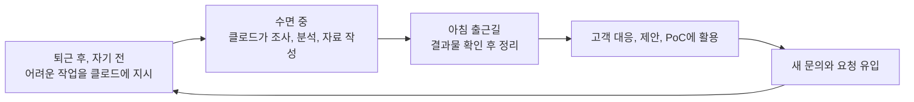
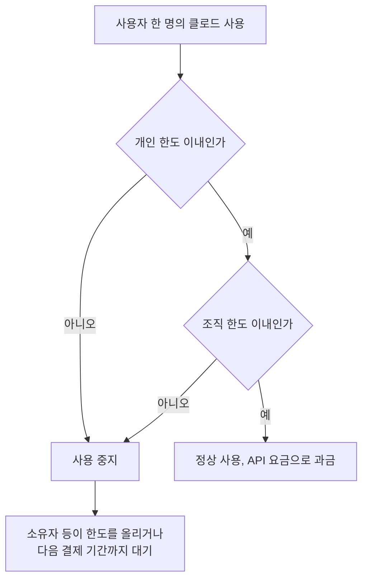
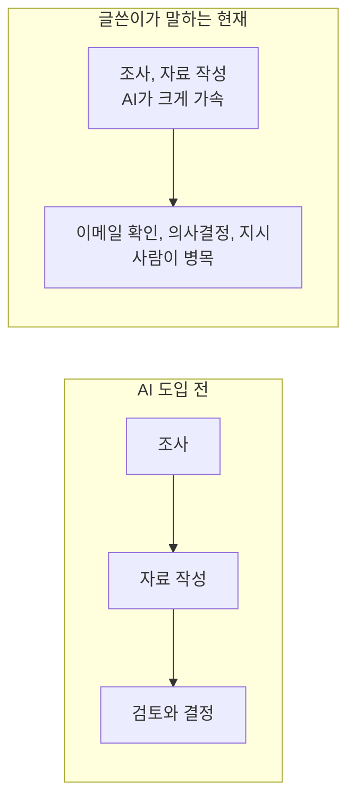
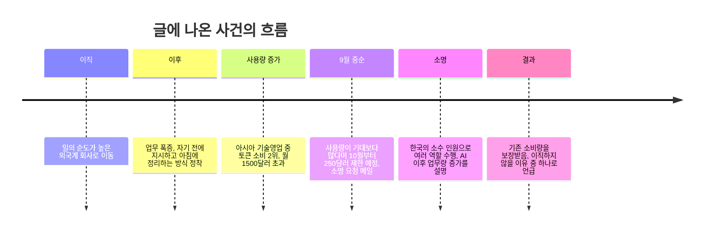

작성 기준일: 2026년 10월 5일

> 
> 일의 순도가 높아서 이직하게 된 외국계 회사에서, 순도 높은 일만으로도 주 52시간은커녕 잠도 4시간 수준으로 줄여도 다 쳐낼 수 없는 상황에 와 보니, 의지할 곳은 클로드 엔터프라이즈밖에 없었다. 그래서 매번 자기 전에 어려운 일을 클로드에게 시켜 놓고, 아침에 일어나면 출근길에 그것을 정리해서 활용하는 식으로 살았는데 (예: 고객 전달용 자료 생성, 매일같이 새로 추가되는 신규 판매대상 제조사에 대한 조사, 고객의 기술적인 질문에 대한 조사/분석, PoC 환경을 자체적으로 간단하게 생성하고 모의 테스트 진행 등), 이랬더니 우리회사 아시아 전체 기술영업 중에서 클로드 엔터프라이즈 토큰 소비량 2위를 찍었다. (월 1500달러 넘게 썼음)
> 
> 9월 중순에 메일이 와서는 기대보다 클로드 엔터프라이즈 버전을 너무 많이 쓰는데, 10월부터는 250달러로 제한될 예정이니, 더 써야 하면 소명하라고 하더라.
> 
> 그래서 이메일을 보낸 담당자에게 대답했다. 나는 한국에서 진짜 손에 꼽는 소수의 인원만으로 본업인 기술영업뿐만 아니라 솔루션 아키텍트, 기술 검증팀, 딜리버리 매니저, 서비스 팀 리더 등의 역할을 모두 수행하고 있다고.
> 
> 정말 AI가 도입된 후로는 AI 때문에 업무량이 더 늘었다는 말을 체감한다. 10개 이상의 업체를 동시에 고객사에게 제안하고 PoC 수행하고 기술적인 질문에 응대할 수 있게 되었으니까.
> 
> 이제 병목은 나 자신이다. 내가 이메일을 확인하는 속도, 내가 의사결정하는 속도, 내가 우리회사 클로드에게 일을 시키는 속도가 가장 큰 병목이 되었다. 일에 깔려죽지 않고 살아남기 위해서 내가 내리는 의사결정 속도를 늦추지 않기 위해서 클로드에게 더 어려운 지시를 해서 (예를 들어 지식 그래프라던지, 내 업무 맥락을 더 정확하게 파악하기 위한 문서 구조화라던지) 이것을 따라잡으려고 애쓰고 있는데, 가끔 이게 맞는가 하는 의문은 든다. 하지만 수직상승 중인 고객사 문의/요청과 그에 맞춰 성장중인 매출을 생각하면 안할 수도 없다.
> 
> 그나마 해피엔딩이라면, 클로드 엔터프라이즈는 기존에 내가 쓰던 소비량을 보장받을 수 있게 되었다. 이직하지 않는 중요한 이유 중 하나가 될 것 같다.
> 
> https://www.threads.com/share/BAMNJkfryx/
> 

## 0. 먼저 밝혀둘 것: 이 글이 근거로 삼은 것과 삼지 않은 것

이 글은 크게 두 가지 재료로 만들어졌습니다. 하나는 요청하신 글 본문 자체이고, 다른 하나는 Anthropic 공식 도움말 센터의 Enterprise 플랜 문서(2026년 9월 1일자)와 결제 방식 문서, 그리고 2026년 8~9월에 갱신된 요금 정리 글들입니다.

글이 올라온 Threads 주소는 사이트 쪽에서 자동 접근을 막고 있어 직접 열어 보지 못했습니다. 그래서 글쓴이가 누구인지, 어느 회사인지, 어떤 방식으로 사용량을 집계했는지 같은 부분은 확인할 방법이 없었고, 이 문서에서도 추측하지 않았습니다. 본문에 적힌 개인 경험(월 1,500달러 이상 사용, 아시아 기술영업 중 2위, 9월 중순 메일, 10월부터 250달러 한도 등)은 모두 "글쓴이가 이렇게 말했다"는 수준으로만 다루고, 사실로 검증된 것처럼 쓰지 않았습니다. 반대로 요금 구조와 한도 설정 방식 같은 제품 규칙은 공식 문서로 확인한 내용만 적었습니다.

## 1. 한 문단으로 요약

이 글은 외국계 회사의 기술영업 담당자가 업무량이 사람 한 명의 한계를 넘어선 상황에서, 퇴근 전에 어려운 작업을 클로드에게 맡겨 두고 아침 출근길에 결과물을 정리해 쓰는 방식으로 버텨 온 경험담입니다. 그렇게 쓰다 보니 회사 내 아시아 기술영업 가운데 클로드 엔터프라이즈 사용량이 두 번째로 많아졌고(월 1,500달러 이상), 9월 중순에 "10월부터는 월 250달러로 제한할 예정이니 더 써야 하면 소명하라"는 메일을 받았습니다. 글쓴이는 자신이 한국에서 여러 역할을 혼자 수행하고 있다는 점을 설명했고, 결과적으로 기존 사용량을 보장받게 되었으며, 그것이 이직하지 않을 이유 중 하나가 되었다는 이야기로 끝납니다. 중간에는 "AI 덕분에 일이 줄지 않고 오히려 늘었다", "이제 병목은 나 자신이다"라는 생각이 담겨 있습니다.

## 2. 글쓴이가 처한 상황을 풀어서 이해하기

글쓴이는 "일의 순도가 높아서" 외국계 회사로 이직했다고 말합니다. 여기서 순도가 높다는 것은 잡무가 적고 핵심 업무 위주라는 뜻으로 읽힙니다. 그런데 그 순도 높은 일만으로도 주 52시간은커녕 수면을 4시간까지 줄여도 다 처리할 수 없는 지경이라고 합니다. 한국에서 소수의 인원만 있다 보니 기술영업이라는 본업 외에 솔루션 아키텍트, 기술 검증팀, 딜리버리 매니저, 서비스 팀 리더 역할까지 한 사람이 맡고 있다는 것이 글쓴이의 설명입니다.

이 상황에서 글쓴이가 택한 방법은 클로드에게 일을 대신 시키는 것이었습니다. 글에 나온 구체적인 업무는 다음과 같습니다.

- 고객에게 전달할 자료 생성
- 매일 새로 추가되는 신규 판매 대상 제조사 조사
- 고객이 던진 기술적인 질문에 대한 조사와 분석
- PoC(개념 검증) 환경을 직접 간단하게 만들고 모의 테스트 진행

일하는 방식은 단순합니다. 자기 전에 어렵고 오래 걸리는 일을 지시해 놓고, 아침에 일어나 출근길에 결과를 훑어 정리해서 씁니다. 사람이 자는 시간을 AI의 작업 시간으로 바꾼 셈입니다.

## 3. "사용량 2위, 월 1,500달러"가 의미하는 것

글쓴이는 이렇게 쓰다 보니 회사의 아시아 전체 기술영업 가운데 클로드 엔터프라이즈 토큰 소비량이 2위가 되었고, 월 1,500달러가 넘었다고 합니다. 이 순위와 금액은 글쓴이 본인의 말이라 외부에서 확인할 수 없습니다.

다만 1,500달러라는 금액이 어떤 구조에서 나오는지는 공식 문서로 설명할 수 있습니다. Anthropic의 현재 Enterprise 플랜은 좌석 요금과 사용량 요금이 분리되어 있습니다. 도움말 센터 문서에 따르면 좌석 요금은 플랫폼 접근권일 뿐 사용량을 포함하지 않으며, 웹, 데스크톱, 모바일에서의 클로드는 물론 Claude Code와 Cowork까지 모든 사용량이 표준 API 요금으로 별도 청구됩니다. 좌석별 사용량 한도도 없고, 포함된 토큰 허용량도 없습니다. 쉽게 말해 휴대폰 요금제로 비유하면 "기본료는 싸고, 쓴 만큼 종량제로 낸다"는 구조입니다.

좌석 요금의 구체적인 숫자는 공식 도움말 문서에는 "사용자당 월 단위, 연간 결제"라고만 되어 있고 금액은 가격 페이지를 참고하라고 안내합니다. 가격 페이지를 인용한 2026년 8~9월 정리 글들은 월 20달러(연간 결제 기준)라고 일관되게 적고 있습니다. 따라서 어느 한 사람이 많이 쓰면 그만큼 회사 청구서가 늘어나는 구조이고, 그래서 글쓴이의 회사 입장에서는 개인별 사용량이 눈에 띄는 비용 항목이 될 수 있습니다. 이것이 9월 중순 메일이 온 맥락을 이해하는 데 도움이 됩니다. 다만 그 메일을 보낸 담당자나 회사가 실제로 어떤 판단으로 한도를 정했는지는 글에 나오지 않으므로 여기서 단정하지 않습니다.

## 4. "10월부터 250달러로 제한"은 제품 기능으로는 어떤 모습인가

글쓴이가 받은 메일은 Anthropic이 보낸 것이 아니라 회사 내부 담당자가 보낸 것으로 보이며, 글에도 "이메일을 보낸 담당자"라고만 되어 있습니다. 소명을 요구하는 절차 자체는 회사 내부 규정이라 Anthropic 문서에는 나오지 않습니다.

하지만 "개인별로 월 250달러까지만 쓰게 한다"는 것을 가능하게 하는 기능은 문서에 분명히 있습니다. 바로 지출 한도(spend limit)입니다. 결제 문서에 따르면 소유자, 기본 소유자, 또는 결제 권한을 "관리 가능"으로 받은 사용자 지정 역할이 조직 설정의 사용량 메뉴에서 한도를 정할 수 있고, 한도는 두 층위로 설정됩니다.

- 조직 수준: 조직 전체 사용량의 최대 지출
- 개인 수준: 특정 사용자 한 명의 최대 지출

두 한도는 계층적으로 작동해서, 사용자는 자기 개인 한도와 조직 한도 중 더 낮은 쪽을 넘을 수 없습니다. 한도에 닿았을 때의 동작은 요금제 유형에 따라 조금 다릅니다. 영업팀과 계약하는 방식(sales-assisted)에서는 한도에 도달하면 사용이 멈추고, 다음 결제 기간이 시작되거나 소유자가 한도를 올릴 때까지 기다려야 합니다. 온라인으로 직접 가입하는 방식(self-serve)에서는 크레딧을 선결제하고 한도가 함께 작동하므로, 크레딧이 남아 있어도 한도에 닿으면 사용이 멈춥니다.

여기서 중요한 점이 하나 더 있습니다. 소유자는 한도를 "무제한"으로 설정할 수 있지만 그래도 소비는 청구되며, 사용량 과금 자체를 끌 수는 없다고 문서는 밝힙니다. 그리고 관리 화면에는 "한도에 막힌 사용자" 현황, 한도에 근접한 사용자 수, 한도 때문에 일하지 못한 일수 같은 지표가 있어서 관리자가 파워 유저에게 여유를 줘야 하는지 판단하도록 돕습니다. 글쓴이의 "소명하라"는 메일은 바로 이런 관리자의 판단 과정에 해당한다고 이해하면 자연스럽습니다. 다만 이는 기능과 글의 내용이 서로 맞아떨어진다는 설명일 뿐, 글쓴이의 회사가 정확히 어떤 설정을 썼는지는 확인된 바 없습니다.

## 5. 글쓴이가 한 "소명"의 내용

글쓴이가 담당자에게 답한 핵심은 두 가지입니다. 첫째, 한국에서 손에 꼽을 만큼 적은 인원으로 본업인 기술영업뿐 아니라 솔루션 아키텍트, 기술 검증, 딜리버리 매니저, 서비스 팀 리더 역할까지 한 사람이 수행하고 있다는 점입니다. 둘째, AI가 도입된 뒤 오히려 업무량이 늘었다는 체감입니다. 10개 이상의 업체를 동시에 고객사에 제안하고, PoC를 수행하고, 기술 질문에 응대할 수 있게 되었으니 일의 총량이 커졌다는 논리입니다.

여기에는 회사가 비용을 볼 때 흔히 놓치기 쉬운 관점이 들어 있습니다. 사용량 자체는 비용이지만, 글쓴이의 주장대로라면 그 사용량이 고객 제안과 PoC 처리량을 키우고, 이것이 "수직상승 중인 고객사 문의/요청과 그에 맞춰 성장중인 매출"로 이어진다는 것입니다. 이 매출 성장 역시 글쓴이 본인의 서술이므로 외부 검증은 되지 않았습니다. 글에서 확인할 수 있는 사실은 소명 이후 기존 사용량을 보장받게 되었다는 결과까지입니다. 구체적으로 한도가 얼마로 조정되었는지는 적혀 있지 않습니다.

## 6. "이제 병목은 나 자신이다"라는 말을 쉽게 풀어보면

이 글에서 가장 생각할 거리가 많은 부분은 후반부입니다. 글쓴이는 AI 덕분에 처리할 수 있는 업무가 늘어난 만큼, 그 업무를 확인하고 결정하고 지시하는 일은 여전히 사람의 몫이라서 이제 그 사람 자신이 가장 느린 구간이 되었다고 말합니다. 구체적으로는 이메일을 확인하는 속도, 의사결정을 내리는 속도, 클로드에게 일을 시키는 속도 세 가지를 꼽습니다.

공장 생산 라인으로 비유하면 이해하기 쉽습니다. 앞 공정의 기계를 아무리 빠르게 바꿔도, 마지막에 검수하는 사람이 한 명이면 전체 출하량은 그 검수 속도에 묶입니다. 글쓴이의 경우 AI가 조사와 자료 작성 구간을 크게 빠르게 만들었더니, 남은 가장 느린 구간이 자신의 확인과 결정이 되었다는 이야기입니다. 제약이 걸린 가장 느린 지점을 중심으로 전체 성과를 관리해야 한다는 생각은 경영학의 제약이론(Theory of Constraints)에서 잘 알려진 관점이며, 글쓴이의 상황이 그 구도와 닮아 있다고 볼 수 있습니다.

그래서 글쓴이가 택한 대응은 병목인 자기 자신의 속도를 올리기 위해 클로드에게 더 어려운 일을 시키는 것입니다. 글에는 두 가지 예가 나옵니다. 하나는 지식 그래프이고, 다른 하나는 자신의 업무 맥락을 더 정확히 파악하도록 문서를 구조화하는 일입니다. 쉽게 말해 "내가 판단하는 데 필요한 맥락을 AI가 미리 정리해 두게 하자"는 시도입니다.

그러면서도 글쓴이는 "가끔 이게 맞는가 하는 의문이 든다"고 솔직하게 적습니다. 일을 줄이려고 도입한 도구 때문에 일이 늘고, 그 일을 따라잡으려고 도구를 더 쓰는 순환에 들어섰다는 자각이 담긴 대목입니다. 그럼에도 고객 문의와 매출이 오르고 있어 멈출 수 없다고 말합니다. 이 글의 정서는 자랑이라기보다 양가감정에 가깝다고 읽는 편이 정확합니다.

## 7. 전체 흐름을 시간순으로 정리

## 8. 이 글에서 사실로 말할 수 있는 것과 없는 것

| 구분 | 내용 |
| --- | --- |
| 공식 문서로 확인된 것 | Enterprise 플랜은 좌석 요금과 사용량 요금이 분리되고, 사용량은 표준 API 요금으로 청구되며, 좌석별 한도나 포함 토큰이 없다 |
| 공식 문서로 확인된 것 | 관리자가 조직과 개인 단위로 지출 한도를 설정할 수 있고, 한도에 닿으면 사용이 멈추며, 소유자가 한도를 올릴 수 있다 |
| 공식 문서로 확인된 것 | 한도를 무제한으로 둬도 사용량 과금 자체는 끌 수 없다 |
| 글쓴이 본인의 주장이라 검증 불가 | 월 1,500달러 초과, 아시아 기술영업 중 2위, 9월 중순 메일의 구체 문구, 250달러 한도, 매출 성장 |
| 글에 나오지 않아 알 수 없는 것 | 회사가 실제로 어떤 요금제와 한도 설정을 썼는지, 소명 후 최종 한도 금액, 회사 내부 심사 기준 |

## 9. 제품 규칙 참고: 이 글을 읽을 때 오해하기 쉬운 점

첫째, "엔터프라이즈니까 무제한"이라고 생각하기 쉽지만, 현재 구조에서 좌석별 사용량 한도가 없다는 말은 "제한 없이 공짜로 쓴다"가 아니라 "쓴 만큼 API 요금으로 과금된다"는 뜻입니다. 문서도 이 점을 분명히 합니다. 따라서 회사가 개인별 한도를 두는 것은 제품이 막아서가 아니라 관리자가 비용을 통제하려고 선택하는 설정입니다.

둘째, 모든 Enterprise 고객이 같은 구조는 아닙니다. 과거의 Standard와 Premium 좌석으로 구성된 좌석 기반 플랜은 좌석별 사용량 한도가 있고, 이전에 Chat 및 Chat + Claude Code 좌석을 쓰던 조직은 다음 계약 갱신 때 단일 Enterprise 좌석으로 전환됩니다. 글쓴이의 회사가 어느 쪽인지는 글에 나오지 않습니다.

셋째, 가격과 플랜은 Anthropic의 재량으로 바뀔 수 있다고 공식 문서가 명시하고 있습니다. 이 문서의 요금 설명은 2026년 10월 5일 시점에 확인한 내용입니다.

참고로 한 요금 정리 글 중 하나는 Anthropic 문서를 인용해 Claude Code의 평균 지출이 개발자당 활성일 하루 약 13달러, 월 150~250달러 범위라고 전합니다. 이는 2차 자료의 인용이므로 참고 수준으로만 보시기 바랍니다. 글쓴이의 사용 패턴(잠들기 전 대량 위임)이 이 평균과 어떻게 비교되는지는 글만으로는 판단할 수 없습니다.

## 10. 이 이야기에서 가져갈 만한 시사점

글쓴이의 경험이 보여주는 것은 크게 세 가지입니다. 첫째, AI를 깊이 쓰는 사람의 사용량은 일반적인 평균을 쉽게 넘어서고, 사용량 과금 구조에서는 그것이 곧바로 조직의 비용 관리 이슈가 됩니다. 둘째, 그 비용이 정당한지는 사용량 숫자 하나가 아니라 그 사용이 만들어낸 성과와 함께 설명해야 설득력이 생깁니다. 글쓴이가 역할 범위와 동시 진행 업체 수, 매출 흐름을 들어 소명한 방식이 그런 예입니다. 셋째, AI로 생산 속도가 올라가면 사람의 확인과 결정이 새로운 병목이 되므로, 그 지점을 돕는 방향(맥락 정리, 구조화된 문서, 지식 그래프)으로 AI 활용이 이동하게 된다는 것입니다. 다만 글쓴이 스스로도 이 순환이 맞는지 의문을 갖고 있듯이, 이것이 바람직한 방향인지는 열려 있는 질문으로 남습니다.

## 참고한 출처

- Claude Help Center, "What is the Enterprise plan?" (2026년 9월 1일자): https://support.claude.com/en/articles/9797531-what-is-the-enterprise-plan
- Claude Help Center, "How am I billed for my Enterprise plan?": https://support.claude.com/en/articles/11526368-how-am-i-billed-for-my-enterprise-plan
- SpotSaaS, "Claude Enterprise Pricing 2026" (가격 페이지 인용 정리): https://www.spotsaas.com/blog/claude-enterprise-pricing
- Justin McKelvey, "Claude Enterprise Pricing (2026)" (2026년 9월 기준 정리): https://justinmckelvey.com/blog/claude-enterprise-pricing
- Morph, "Claude Code Team Pricing (2026)" (Claude Code 평균 지출 인용): https://www.morphllm.com/claude-code-team-pricing
- 원문 글: https://www.threads.com/share/BAMNJkfryx/ (자동 접근이 차단되어 직접 열람하지 못했고, 전달해 주신 본문을 기준으로 정리)
