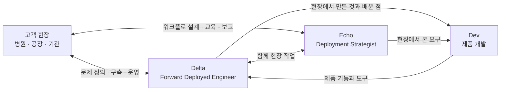
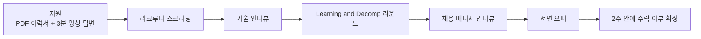
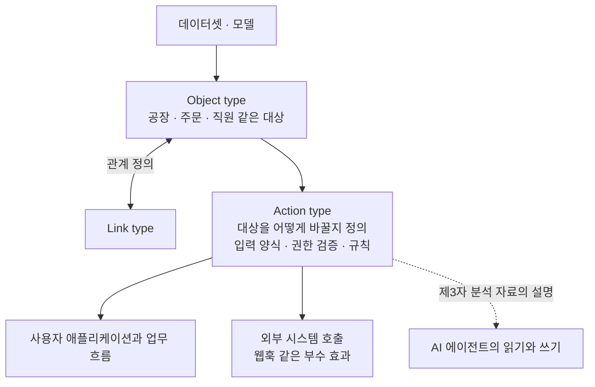

- 작성 기준일: 2026년 10월 5일 (월)
- 확인 방법: 팔란티어·앤트로픽·데이터브릭스·채널톡 등 각사 공식 채용 페이지, 팔란티어 공식 문서, 채용 정보 집계 사이트를 직접 열어 대조했습니다. 확인하지 못한 부분은 "확인하지 못했다"고 따로 적었고, 추측으로 채우지 않았습니다.


```
팔란티어 서울 채용공고 보다가 멈춤

Forward Deployed Engineer(FDE)를 신입이랑 인턴으로도 뽑는 중

공고에 이렇게 써 있음
"신입이어도 티켓 큐를 넘겨받지 않는다"
고객 회사 안에 들어가서 문제를 같이 찾고, 코드로 끝까지 해결하는 개발자 자리

FDE가 뭐냐면

팔란티어가 이 자리를 처음 만들었다고 공고에 직접 적어 둠
사내 팀 이름은 Delta, 짝이 되는 비개발 자리는 Echo(Deployment Strategist)
병원, 공장 같은 고객 현장에 붙어 있어서 출장이 25~50%

요즘은 AI 회사들이 같은 이름을 씀
앤트로픽 FDE는 고객 시스템 안에서 Claude로 실제 서비스를 만들고 MCP 서버, 서브에이전트까지 넘겨주는 일
데이터브릭스도 서울에서 FDE 두 자리

한국 회사도 이 이름으로 뽑는 중

현대카드 Forward Deployed Engineer 10월 5일(월) 오후 1시 마감
마키나락스 FDE LLM (창원) 경력 무관
올리브영 Forward Deployed AI Engineer 4년 이상
토스 Forward Deployed Engineer
크래프톤 AI Transformation Specialist (FDE) 7년 이상
채널톡 Forward Deployed Engineer 시니어

카드사, 뷰티, 게임사까지. 개발만 하는 자리보다 현장 문제를 정하는 자리로 읽힘

신입이 지금 넣어볼 수 있는 곳

팔란티어 서울 FDE 신입, 인턴
2026, 2027 졸업, 한국어와 영어 업무 수준, PDF 이력서에 3분 영상 답변
개발 안 하면 Deployment Strategist 신입도 같은 조건

공고들이 공통으로 보는 건 사용자랑 문제를 같이 정해 본 경험. 이력서에 그 한 줄은 꼭 넣을 것

FDE 공고 모아둔 곳
https://ipsajeon.com/?utm_source

https://www.threads.com/share/BAVCCDm7oD/

```

---

## 1. 먼저 결론부터

공유해 주신 내용은 Threads에 올라온 게시물 한 편과 그 아래에 달린 댓글 세 개입니다. 게시물은 팔란티어 서울이 Forward Deployed Engineer(이하 FDE)를 신입과 인턴으로도 뽑고 있다는 소식을 전하면서, 같은 이름의 직무를 AI 기업과 국내 기업들도 쓰기 시작했다는 점, 그리고 신입이 지금 넣어볼 수 있는 곳을 정리한 글입니다. 댓글은 "이게 파견직 프로그래머랑 뭐가 다르냐"는 질문, "좋은 일자리는 아니니 젊은 사람에게는 추천하지 않는다"는 의견, 그리고 "국내 기업이 FDE를 하면 실패한다"는 긴 반론으로 이어집니다.

게시물의 핵심 사실은 대부분 공식 공고로 확인됩니다. 팔란티어가 이 직무를 처음 만들었다고 공고에 직접 적어 둔 것, 신입에게 티켓 큐를 넘기지 않는다는 문구, 팀 이름 Delta와 Echo, 출장 25~50%, 지원 서류(PDF 이력서와 3분 영상 답변) 모두 사실입니다. 다만 몇 군데는 정확히 짚어야 합니다. 인턴은 2026·2027 졸업이 아니라 2027·2028 졸업 대상이고, Deployment Strategist는 출장 비율이 25~75%로 FDE와 다르며, 마키나락스의 "경력 무관"과 크래프톤의 "7년 이상" 같은 일부 조건은 제가 확인한 자료와 일치하지 않거나 확인되지 않았습니다. 이 차이는 4장과 6장에서 하나씩 설명합니다.

---

## 2. 글은 어떻게 구성되어 있나

게시물 본문은 크게 네 덩어리입니다. 첫째는 팔란티어 서울 공고에서 인상 깊었던 문구와 FDE가 하는 일의 요약입니다. 둘째는 FDE라는 이름을 요즘 AI 회사들도 쓴다는 설명으로, 앤트로픽과 데이터브릭스가 예로 나옵니다. 셋째는 현대카드, 마키나락스, 올리브영, 토스, 크래프톤, 채널톡 같은 국내 회사들의 FDE 공고 목록입니다. 넷째는 신입이 지금 지원할 수 있는 곳(팔란티어 서울 FDE 신입·인턴, Deployment Strategist 신입)과 이력서에 꼭 넣으라는 한 줄의 조언입니다.

댓글은 서로 결이 다릅니다. 첫 번째 댓글은 질문이고, 두 번째는 짧은 의견이며, 세 번째가 가장 길고 기술적인 반론입니다. 세 번째 댓글에는 Ontology의 Action 객체 타입, AIP, S-1 공시 같은 팔란티어 내부 용어가 나오기 때문에, 이 용어들이 무엇인지 알아야 댓글이 무슨 말을 하는지 이해할 수 있습니다. 5장에서 풀어 설명합니다.

---

## 3. FDE란 무엇인가

### 3.1 팔란티어의 공식 설명

팔란티어 서울 FDE 신입 공고는 FDE를 이렇게 소개합니다. 결과에 대한 극단적인 헌신이 팔란티어의 운영 철학이고, 팔란티어가 이 포지션을 개척했으며, 엔지니어가 고객 곁에 직접 들어가 가장 시급한 문제를 해결한다는 것입니다. 병원 침대부터 공장 현장까지 고객의 현실 속에 들어가 문제가 자기 문제가 될 때까지 붙어 있고, 제품이 현재 제공하는 범위 바깥까지 만들어 나가며, 기존 공식에서 벗어나서라도 문제를 푼다고 설명합니다. 게시물이 "팔란티어가 이 자리를 처음 만들었다고 공고에 직접 적어 둠"이라고 한 것은 이 대목을 가리키며, 공고 원문과 일치합니다.

주요 업무는 공고에 네 가지로 나옵니다. 다른 엔지니어들과 함께 아키텍처와 설계 결정을 내리는 일, 기존 가정이 무너질 만큼 큰 규모의 데이터를 다루는 일, 특정 고객의 현실에 맞춘 맞춤 애플리케이션과 LLM 워크플로, 프로덕션 솔루션을 만드는 일, 그리고 현장 사용자부터 의사결정권자인 임원까지 이해관계자와의 관계를 직접 책임지는 일입니다. 프로젝트는 고객과의 첫 대화부터 제품 출시까지 처음부터 끝까지 맡는 방식으로 소규모 팀에서 진행된다고 적혀 있습니다.

### 3.2 "티켓 큐" 문구의 정확한 의미

게시물이 따옴표로 인용한 문구는 공고의 영어 원문에서 왔습니다. 신입 공고에는 "You will not be handed a ticket queue."라는 문장이 있고, 그 앞뒤로 신입은 첫날부터 책임을 위임받으며 고객, 혼란, 결과로부터 보호받지 않는다고 적혀 있습니다. 즉 "정해진 요청 목록을 받아서 처리하는 자리가 아니다"라는 뜻이고, 인턴 공고에도 같은 취지의 문장이 있습니다. 다만 이것은 회사가 자기 직무를 설명한 문장입니다. 실제 현장에서 모든 신입이 그렇게 일하는지는 공고만으로 증명되지 않습니다.

### 3.3 Delta, Echo, Dev: 팔란티어 안의 팀 구분

팔란티어 서울 채용 페이지는 직무를 팀별로 나눠 보여 줍니다. FDE 계열 세 자리(경력직 Forward Deployed Software Engineer, FDE 인턴, FDE 신입)는 Delta 팀에 속하고, Deployment Strategist 두 자리(경력, 신입)는 Echo 팀에 속합니다. 같은 페이지에 Dev라는 팀 분류도 따로 있습니다. 게시물이 말한 "사내 팀 이름은 Delta, 짝이 되는 비개발 자리는 Echo"는 이 구분과 맞습니다.

여기서 "비개발"이라는 표현은 단순화입니다. Deployment Strategist 신입 공고의 필수 요건에는 Python, R, Matlab, SQL 같은 프로그래밍·스크립팅·통계 패키지 경험이 들어 있습니다. 코드를 안 쓰는 자리가 아니라, 주된 역할이 문제 정의, 데이터 이해, 사용자 교육, 임원 대상 발표 쪽에 있는 자리라고 읽는 편이 정확합니다.

Dev 팀과 Delta 팀의 관계는 팔란티어에서 8년 일한 전직 FDE가 쓴 글에서 잘 설명됩니다. 그 글에 따르면 자신이 입사한 시기의 팔란티어에는 고객과 일하는 엔지니어(FDE)와 핵심 제품을 만드는 제품 개발(PD) 엔지니어가 있었고, PD 엔지니어가 FDE가 만든 것을 제품으로 일반화하며 FDE가 더 빠르게 일하도록 돕는 소프트웨어를 만든다고 합니다. 한 개인의 회고이고 입사 시점 기준이라는 점은 감안해야 하지만, 공식 채용 문구와 방향이 같습니다. Deployment Strategist 공고에도 현장에서 본 것을 팔란티어 전체 제품에 반영하기 위해 소프트웨어 엔지니어링·제품 디자인 팀과 함께 일한다는 항목이 있기 때문입니다.



위 그림에서 Delta·Echo와 고객 사이의 화살표, Echo와 Dev 사이의 화살표는 각각 FDE 공고와 Deployment Strategist 공고의 업무 설명에 근거합니다. Dev에서 Delta로 가는 화살표와 Delta에서 Dev로 가는 화살표는 위에서 소개한 전직 FDE의 회고에 근거한 것이므로, 공식 조직도가 아니라 설명용 도식으로 봐 주세요.

### 3.4 "파견직 프로그래머랑 달라?"에 대한 답

첫 번째 댓글의 질문은 핵심을 찌릅니다. 일반적으로 파견은 고용 주체와 일하는 곳이 다르고 고객사의 지시 아래에서 일하는 구조를 말합니다. 팔란티어 공고가 스스로를 구분하는 방식은 세 가지입니다. 첫째, 고용 주체가 고객사가 아니라 팔란티어 자신입니다. 둘째, 제품이 지금 제공하는 범위 바깥까지 만들고 필요하면 제품의 한계를 넘거나 다시 쓴다고 합니다. 셋째, 요청을 받아 처리하는 티켓 큐 방식이 아니라 문제 발견부터 출시까지 맡는다고 합니다. 이 차이는 공고의 자기 설명입니다. 실제로 현장에서 얼마나 다른지는 사람마다 평가가 갈리며, 이 글의 두 번째와 세 번째 댓글이 바로 그 논쟁의 일부입니다.

---

## 4. 팔란티어 서울 공고, 사실관계 점검

2026년 10월 5일 기준 팔란티어 서울 채용 페이지에는 다섯 개 공고가 있습니다. 경력직 Forward Deployed Software Engineer, FDE 인턴(Commercial), FDE 신입(Commercial), Deployment Strategist, Deployment Strategist 신입(Commercial)입니다.

신입 FDE 공고의 조건은 다음과 같습니다. 근무 형태는 정규직 하이브리드이고, 한국어와 영어로 읽고 쓰고 말하는 비즈니스 수준의 능력이 필요합니다. 컴퓨터공학, 전자전기, 수학, 소프트웨어공학, 물리, 데이터사이언스 같은 공학 학위를 선호하고, Python, Java, C++, TypeScript/JavaScript 중 하나 이상에 능숙해야 합니다. 졸업 시기는 2026년 또는 2027년이어야 하며, 제출물은 PDF 이력서와 3분 분량의 영상 답변입니다. 지원하면 서면 오퍼를 받은 뒤 2주 안에 수락 여부를 확정하겠다는 약속에 동의하게 됩니다. 출장은 팀과 지역에 따라 25~50%를 예상하라고 되어 있습니다.

인턴 공고는 몇 가지가 다릅니다. 근무 형태가 하이브리드가 아니라 온사이트이고, 졸업 시기가 2027년 또는 2028년이며, 한국어와 영어를 유창하게 구사하는 능력이 필수라고 적혀 있습니다. 출장 25~50%와 제출물(PDF 이력서와 3분 영상)은 신입과 같습니다. 게시물이 "2026, 2027 졸업"이라고 쓴 것은 신입 공고에만 해당하므로, 인턴 지원을 생각하신다면 2027·2028 졸업 조건을 확인하셔야 합니다.

Deployment Strategist 신입은 게시물의 "같은 조건"이 반만 맞습니다. 졸업 시기(2026 또는 2027), 한국어·영어 비즈니스 수준, 제출물(PDF 이력서와 3분 영상)은 같습니다. 하지만 출장은 25~75%로 FDE보다 상한이 높고, 필수 요건에 프로그래밍·스크립팅·통계 패키지 경험이 들어 있습니다. 하는 일도 고객 분석가를 만나 핵심 질문과 불편을 찾고, 관련 데이터셋을 찾아 FDE와 함께 안정적인 파이프라인으로 연결하고, 새 사용자 그룹을 위한 맞춤 워크플로를 만들고, 사용자 교육을 이끌고, 분석가부터 임원까지 대상으로 결과를 발표하는 쪽에 가깝습니다.

그 밖에 알아 둘 점이 두 가지 있습니다. 첫째, 제가 열어 본 팔란티어 공고 페이지에는 접수 마감일이 적혀 있지 않았습니다. 팔란티어 서울 FDE 신입 공고의 게시일은 2026년 8월 10일로 표시되어 있습니다. 둘째, 서울에는 이와 별개로 미국 정부 업무를 지원하면서 근무지가 서울인 "Korea Forward Deployed" 계열 공고도 있습니다. 이 공고는 온사이트이고 SOFA를 통한 배치 같은 조건이 언급되어 있어, 게시물이 말한 Commercial 계열 신입·인턴 공고와는 성격이 다릅니다.

면접 과정은 공식 문서가 아니라 지원자 후기에서 확인되는 수준입니다. 글래스도어에 올라온 후기에 따르면 FDSE 신입 지원은 리크루터 스크리닝, 기술 인터뷰, "Learning and Decomp" 라운드, 채용 매니저 인터뷰 순으로 진행되며 평균 채용 소요 기간은 약 45일입니다. 한 면접 준비 사이트는 Decomp 라운드를 모호한 현실 시스템을 분해해 보는 라운드라고 설명합니다. 다만 이 후기는 미국을 포함한 전체 FDSE 신입 지원자 기준이고 서울 공고에 그대로 적용된다는 근거는 없습니다.



이 흐름도에서 A와 G는 팔란티어 서울 공고에 근거하고, B부터 E까지는 지원자 후기에 근거한 것이므로 서울 공식 절차로 읽으시면 안 됩니다.

---

## 5. 댓글 세 개 읽기

### 5.1 두 번째 댓글: "좋은 일자리는 아니다"

이 댓글은 작성자가 팔란티어의 국내 고객사로서 경험한 바가 있다고 밝히며, 좋은 일자리가 아니니 젊은 사람에게는 권하지 않는다고 말합니다. 이것은 평가이자 개인 의견이어서 사실 여부를 가릴 수는 없습니다. 공고에서 객관적으로 확인되는 근무 조건은 출장 25~50%(Deployment Strategist는 25~75%), 인턴은 온사이트, 신입은 하이브리드, 한국어·영어 모두 비즈니스 수준이 필요하다는 정도입니다. 이 조건을 어떻게 평가할지는 지원자의 몫입니다.

### 5.2 세 번째 댓글: 용어부터 풀기

세 번째 댓글은 길어서 요점을 먼저 정리해 보겠습니다. 작성자는 "국내 기업의 FDE는 반드시 실패한다"고 단언합니다. 이유로 든 내용은 대략 다음과 같습니다. 팔란티어는 현장에 엔지니어를 보낼 때 파일럿과 AIP를 들고 가는데, 국내 기업에는 그런 자체 플랫폼이 있을 리 없으니 처음부터 SI와 다를 바 없다는 인식이 생긴다는 것입니다. 게다가 FDE가 무언가를 구축하면서 그 내용을 DS에게 환류해 실제로 쓰이도록 Action 객체 타입을 정의해 줘야 하는데, 이걸 국내 기업이 하겠다는 것은 말이 안 된다는 주장입니다. 마지막에는 팔란티어의 S-1 공시와 회고록을 보면 난이도가 극악에 가까운데 그게 될 리 없다고 덧붙입니다.

이 댓글을 이해하려면 세 가지 용어를 알아야 합니다.

**Ontology(온톨로지)와 Action type.** 팔란티어 공식 문서는 Ontology를 조직의 운영 계층으로 설명합니다. 데이터셋, 가상 테이블, 모델 위에 놓여서 공장, 설비, 제품 같은 물리적 자산이나 고객 주문, 금융 거래 같은 개념과 연결해 줍니다. 구성 요소는 크게 세 가지입니다. 대상을 나타내는 Object type, 대상 사이의 관계를 정의하는 Link type, 그리고 대상을 어떻게 바꿀 수 있는지를 정의하는 Action type입니다. 공식 문서의 예시로는 직원의 역할 속성을 바꾸는 "Assign Employee"라는 Action type이 있습니다. 이 Action은 사용자가 입력할 값의 양식을 정하고, 새 관리자와의 링크를 자동으로 만드는 규칙을 포함할 수 있으며, 인사 담당자만 실행할 수 있도록 권한을 검증할 수도 있습니다. Action은 하나의 트랜잭션으로 객체의 속성을 바꾸고, 외부 시스템에 요청을 보내는 웹훅 같은 부수 효과도 함께 정의할 수 있습니다.

**AIP.** 팔란티어의 AI 플랫폼입니다. 공식 문서 중 제가 열어 본 Ontology 문서들은 AIP를 따로 길게 설명하지 않았습니다. 다만 제3자 분석 자료는 Ontology를 AIP와 연결된 의미·행동 계층이라고 소개하면서, 워크플로와 애플리케이션뿐 아니라 자동화된 에이전트가 기업 데이터를 읽고 시스템에 다시 쓰는 상호작용까지 지원하려는 구조라고 설명합니다. 이것은 제3자 요약이므로 참고만 해 주세요.

**DS.** 댓글은 이 약어를 풀어 쓰지 않았습니다. 이 글의 맥락에서 가장 가까운 후보는 Echo 팀의 Deployment Strategist이지만, 댓글 작성자가 데이터 사이언티스트를 뜻했는지 Deployment Strategist를 뜻했는지는 확정할 수 없습니다. 이하에서는 의미를 정하지 않고 "DS"로만 표기하겠습니다.



그림에서 점선으로 이은 AI 에이전트 연결은 공식 문서가 아니라 제3자 분석 자료의 설명이라는 뜻입니다.

### 5.3 세 번째 댓글에서 확인되는 것과 확인되지 않는 것

확인되는 것은 개념 수준입니다. Ontology에서 Action type이 "객체를 어떻게 바꿀 수 있는가"를 정의하는 요소이고, 같은 Action 로직과 검증을 여러 사용자 애플리케이션에서 일관되게 쓸 수 있다는 점은 공식 문서에 있습니다. 따라서 "읽기만 하는 데이터 분석을 넘어 실제 업무를 바꾸려면 행동 정의가 필요하다"는 댓글의 기술적 직관은 팔란티어 문서의 구조와 맞닿아 있습니다.

확인되지 않는 것도 분명히 있습니다. "국내 기업 FDE는 100% 실패한다"는 것은 작성자 본인의 판단이며, 이를 입증하거나 반박할 객관적 자료를 저는 찾지 못했습니다. "국내 기업에는 자체 플랫폼이 있을 리 없다"는 일반화는 제가 확인한 공고들과 완전히 맞지는 않습니다. 예를 들어 마키나락스는 자사 AI 플랫폼을 기반으로 한 AI 솔루션을 제공한다고 소개하고 있고, 채널톡 FDE 팀은 자사 제품(ALF 레시피, 코파일럿)을 현장에서 검증해 제품팀이 가져갈 수 있는 프로토타입으로 만든다고 설명합니다. 다만 이 플랫폼들이 팔란티어 수준인지는 공고만으로는 판단할 수 없고, 성공과 실패를 판정할 자료도 아직 없습니다. 마지막으로 "S-1 회고록에서 난이도가 극악이라고 읽었다"는 대목은 제가 해당 서술을 찾지 못했습니다. 미국 SEC에 제출된 팔란티어 S-1 자체는 존재하며, 회사가 2003년 대테러 업무용 소프트웨어를 만들려고 설립되었고 2016년에 Foundry를 출시했으며 2020년 상반기 기준 고객이 125곳이라는 내용, 그리고 소프트웨어가 최전선에 있으니 자신들도 그렇다는 취지의 서술이 포함되어 있습니다. 하지만 댓글이 말하는 구체적 문단은 확인하지 못했습니다.

---

## 6. FDE라는 이름, 다른 회사들은 어떻게 쓰나

### 6.1 AI 기업

**앤트로픽.** 공식 채용 페이지의 FDE 공고(Applied AI 팀 소속)는 가장 전략적인 고객 안에 직접 들어가 변혁적인 AI 도입을 이끄는 자리라고 설명합니다. 업무에는 프로덕션 워크플로에서 쓰일 MCP 서버, 서브 에이전트, 에이전트 스킬 같은 기술 산출물을 고객에게 전달하는 일과 기업 환경에서의 앤트로픽 제품 도입을 밀착 지원하는 일이 들어 있고, 요건으로 FDE이거나 컨설팅 경험이 있는 소프트웨어 엔지니어 등 기술·고객 대면 직무 4년 이상 경력이 적혀 있습니다. 게시물의 설명과 일치하지만, 게시물이 언급하지 않은 경력 요건이 있다는 점은 알아 두셔야 합니다. 제가 확인한 앤트로픽 FDE 공고는 샌프란시스코와 런던 등이었고 서울 공고는 찾지 못했습니다.

앤트로픽은 최근 FDE 역량을 키우는 프로그램도 내놓았습니다. 공식 Claude Frontier Academy 페이지는 1억 달러를 투자하고 2027년 말까지 1만 명의 엔지니어를 이 프로그램으로 교육하며 첫 자격 인증은 2027년 초에 나올 예정이라고 안내합니다. 같은 페이지에서 FDE 레지던시는 일부 고객·파트너 대상의 얼리 액세스 단계이며, 관심이 있으면 앤트로픽 계정팀이나 파트너 매니저에게 문의하라고 합니다. 한 업계 매체는 이 발표 시점을 10월 2일로 전합니다. 또 다른 매체는 앤트로픽이 골드만삭스, 블랙스톤, 헬먼앤프리드먼과 15억 달러 규모의 합작 법인을 세우고 FDE를 고객 기업 안에 배치한다고 보도했는데, 이는 2차 보도이므로 확정 사실이 아니라 참고 정보로만 적습니다.

**오픈AI.** 게시물에는 없지만 함께 알아 둘 만한 정보입니다. 채용 정보 집계 사이트에 2026년 6월 29일 게시된 오픈AI 서울 FDE 공고가 있고, 경력 5년 이상, 정규직으로 표시되어 있습니다.

**데이터브릭스.** 서울 FDE 공고가 두 개 확인됩니다. 하나는 데이터브릭스 플랫폼으로 고객의 데이터·AI 문제를 해결하고 프로덕션까지 끌고 가는 Forward Deployed Engineer이고, 한국 FDE 디렉터에게 보고한다고 되어 있습니다. 다른 하나는 AI Forward Deployed Engineering 팀의 "AI Engineer - FDE"입니다. 둘 다 2026년 6월경 게시된 것으로 표시됩니다. 게시물이 말한 "서울에서 FDE 두 자리"와 일치합니다.

### 6.2 국내 기업

아래 표는 게시물이 나열한 회사들을 제가 직접 확인한 결과입니다. 집계 사이트를 통해서만 확인한 항목은 원문 공고에서 다시 확인하시길 권합니다.

| 회사 | 게시물의 설명 | 제가 확인한 내용 | 판정 |
|---|---|---|---|
| 현대카드 | FDE, 10월 5일(월) 오후 1시 마감 | 현대카드 채용 사이트에 FDE 공고가 2026.09.21~2026.10.05 13:00 접수, 경력 일반채용으로 표시 | 일치 (마감이 오늘이므로 시각을 확인하세요) |
| 마키나락스 | FDE LLM(창원), 경력 무관 | FDE-LLM(창원) 공고 확인. 합격 시 처음 3개월 서울 온보딩 후 창원 근무. 집계 사이트 한 곳은 "경력 1년 이상"으로 표시 | 직무는 일치, 경력 조건은 불일치 가능성 |
| 올리브영 | Forward Deployed AI Engineer, 4년 이상 | 같은 직무명의 공고가 "경력 4년 이상"과 "경력 6~15년" 두 가지로 올라와 있음 | 4년 이상 공고가 있어 일치, 다른 조건 공고도 존재 |
| 토스 | Forward Deployed Engineer | 토스 AIOC 팀의 첫 FDE 공고. 전화 기반 업무(상담, 영업 전화)를 AI로 자동화 | 일치 (경력 조건은 확인하지 못함) |
| 크래프톤 | AI Transformation Specialist (FDE), 7년 이상 | 이 정확한 직함은 찾지 못함. AI Transformation Dept.에 AI FDE 계약직(학생 대상 안내)과 7년 이상 경력을 요구하는 다른 공고가 있음 | 직함·경력 조건 확인 불가 |
| 채널톡 | Forward Deployed Engineer, 시니어 | FDE 공고가 "시니어/정규직, 하이브리드"로 표시. 같은 팀의 Enterprise Solution Engineer는 주니어·시니어 모두 | 일치 |

회사별로 조금 더 보충하겠습니다.

현대카드 공고는 국내외 파트너사를 대상으로 데이터 솔루션 기반 AI 플랫폼을 설계·구축하는 업무로 소개됩니다. 파트너사 현장의 비즈니스 문제를 정의하고, AI 플랫폼의 기능을 고객사의 목적에 맞게 매핑해 데이터 연동부터 성능 검증까지 전 과정을 수행한다고 합니다. 자격 요건에는 FDE나 기술 컨설팅 같은 클라이언트 대면 프로젝트의 수행·리딩 경험이 들어 있습니다. 다만 이 상세 문구는 올해 6월부터 8월 초까지 올라 있던 이전 공고를 옮긴 집계 사이트에서 본 것이라, 현재 접수 중인 공고와 문구가 다를 수 있습니다. 접수 마감이 오늘(2026년 10월 5일) 오후 1시로 표시되어 있으니, 이 글을 읽는 시점에 이미 지났을 수 있습니다.

마키나락스의 창원 FDE-LLM 직무는 RAG와 파인튜닝으로 LLM 성능을 높이고, 설비 로그·이미지·문서 같은 제조·산업 데이터를 기반으로 LLM·VLM을 활용한 지능형 분석과 자동화 시스템을 개발하는 일입니다. 게시물이 "경력 무관"이라고 한 부분은 제가 본 집계 페이지의 "경력 1년 이상" 표기와 다릅니다. 마키나락스 원문 공고가 바뀌었을 수도 있어서 어느 쪽이 맞는지 단정하지 않고, 지원 전에 원문에서 확인하시길 권합니다.

올리브영은 AI전략팀이 전사 AI 트랜스포메이션을 이끄는 조직이라고 밝히며, 이 직무가 요구사항을 받아 개발만 하는 자리가 아니라 설계부터 배포까지 주도한다고 설명합니다. AI API Gateway 같은 전사 AI 인프라 구축과 AI 유즈케이스의 백엔드 설계·개발이 포함되고, 백엔드 기술로 Java, Kotlin, Spring Boot가 언급됩니다.

토스는 이 팀이 AI로 전화 기반 업무(인바운드 상담과 아웃바운드 영업 전화)를 자동화하며, FDE는 고객 조직의 지식 시스템과 업무 정책을 AI가 프로덕션에서 쓸 수 있도록 백엔드·데이터 연동을 설계하고 안정화한다고 합니다. 기술 범위로 LLM/RAG, ASR/TTS, 에이전틱 워크플로, 실시간 통화 연동이 나옵니다.

크래프톤은 확인된 범위가 제한적입니다. 서울대 컴퓨터공학부 공지(2026년 5월 22일)에 따르면 AI Transformation Dept. 소속 AI FDE 계약직을 학생 대상으로 안내했습니다. 현업의 반복 업무와 비효율을 찾아내고 Claude Code, Codex, LLM API 같은 도구로 작동하는 프로토타입을 만들고 시연하는 역할이며, 6개월 이상 근무 가능한 계약직이고 역삼 오피스 대면 근무입니다. 이 공지는 학생과 신입에 가까운 대상을 겨냥하고 있어서 "7년 이상"이라는 게시물의 조건과는 결이 다릅니다. 반대로 같은 부서의 Sr. AI DevOps Engineer, Sr. AI DBA 같은 공고에는 7년 이상이 요구되므로, 게시물의 "7년 이상"이 다른 직함과 섞였을 가능성이 있지만 이것은 추정이라 단정하지 않겠습니다.

채널톡 FDE 팀은 AX(AI Transformation)의 문제를 엔지니어링으로 푸는 팀으로, 고객 현장의 복잡한 CX·운영 문제를 직접 보고 ALF 레시피와 코파일럿으로 확장 가능하게 푼다고 소개합니다. 고객사별 일회성 커스텀이 아니라 현장에서 검증된 솔루션을 바탕으로 제품팀이 가져갈 수 있는 프로토타입을 빠르게 만드는 팀이라고 밝히고, 이 FDE 공고는 문제 정의와 우선순위 정리까지 맡는 Technical Project Manager 성격의 역할이라고 설명합니다.

게시물이 마지막에 쓴 평가, 즉 "개발만 하는 자리보다 현장 문제를 정하는 자리로 읽힘"은 위 공고들과 방향이 맞습니다. 현대카드는 비즈니스 문제를 정의한다고 적고, 토스는 아직 밝혀지지 않은 문제를 정의하는 과정을 즐기는 사람을 찾고, 채널톡은 문제 정의와 우선순위 정리를 역할에 포함시킵니다.

---

## 7. 신입이 이 글에서 가져갈 것

게시물의 실용적 조언은 "사용자와 문제를 같이 정해 본 경험을 이력서에 한 줄 넣어라"입니다. 팔란티어 공고도 이 방향을 뒷받침합니다. 공고는 기술자와 비기술자가 섞인 팀에서 목표가 바뀌고 사용자가 반박하는 환경, 불완전한 정보로 결정을 내리는 능력, 제품의 기존 한계를 넘는 태도를 가치로 꼽습니다. 자격 요건 자체는 전공, 프로그래밍 언어 숙련도, 졸업 시기, 한국어·영어 비즈니스 수준처럼 기본적인 것들이고, 차별점은 제출물 쪽에 있습니다. 이력서 PDF 한 장과 3분 영상 답변이 전부이기 때문에, 짧은 영상 안에서 문제를 어떻게 정의했는지 보여 주는 연습이 필요하다는 정도까지는 공고에서 읽어낼 수 있습니다. 영상 질문의 구체적 내용은 제가 확인하지 못했습니다.

현실적인 주의점도 있습니다. 첫째, 인턴과 신입, FDE와 Deployment Strategist는 졸업 시기와 출장 비율이 서로 다르니 지원 전에 해당 공고를 직접 열어 보세요. 둘째, 국내 회사 FDE 공고 대부분은 경력직(현대카드, 올리브영, 크래프톤의 일부 공고, 채널톡 시니어, 오픈AI, 앤트로픽)이라서, 신입이 바로 넣을 수 있는 곳은 제가 확인한 범위에서 팔란티어 서울(신입·인턴)과 채널톡의 일부 주니어 포지션, 크래프톤의 계약직 정도입니다. 셋째, 댓글의 비판은 객관적 증거가 아니라 개인 경험과 의견이지만, 출장 비중이나 근무 형태 같은 공고상의 사실과 함께 놓고 스스로 판단할 재료로는 충분히 의미가 있습니다.

---

## 8. 확인하지 못한 것 정리

이 글에서 제가 확정하지 못한 항목을 한곳에 모았습니다. 팔란티어 서울 공고의 접수 마감일은 공고 페이지에 적혀 있지 않았습니다. 팔란티어 영상 답변 질문의 구체적 내용과 서울 지원의 실제 면접 절차도 확인하지 못했습니다. 마키나락스 창원 FDE-LLM의 경력 조건은 출처마다 달랐고, 크래프톤 "AI Transformation Specialist (FDE) 7년 이상"이라는 정확한 직함은 찾지 못했습니다. 토스 FDE의 경력 요건도 확인하지 못했습니다. 현대카드 접수는 오늘 오후 1시 마감으로 표시되어 있어 이미 지났을 수 있습니다. 게시물 끝에 걸려 있던 FDE 공고 모음 사이트 링크는 열어 보지 않았습니다. 댓글이 인용한 S-1 속 구체적 서술과 "국내 FDE는 실패한다"는 주장의 근거도 확인하지 못했습니다.

---

## 9. 출처

공식 채용 페이지와 공식 문서
- 팔란티어 서울 채용 목록: https://jobs.lever.co/palantir?location=Seoul%2C+South+Korea
- 팔란티어 FDE 신입(Commercial): https://jobs.lever.co/palantir/341d5cae-a473-4813-9a6c-0f67fcc1b253
- 팔란티어 FDE 인턴(Commercial): https://jobs.lever.co/palantir/2ad0ab10-34c3-410d-883b-8052864a95cd
- 팔란티어 Deployment Strategist 신입(Commercial): https://jobs.lever.co/palantir/d5f11334-3a73-4094-b7e0-d05b54e475b8
- 팔란티어 FDSE Korea Forward Deployed: https://jobs.lever.co/palantir/a39bf84c-6648-4871-bd07-9b882d401c4c
- 팔란티어 Ontology 문서: https://palantir.com/docs/foundry/ontology , https://palantir.com/docs/foundry/action-types , https://www.palantir.com/docs/foundry/ontology/core-concepts
- 팔란티어 S-1 (SEC): https://www.sec.gov/Archives/edgar/data/1321655/000119312520230013/d904406ds1.htm
- 앤트로픽 FDE 공고: https://www.anthropic.com/careers/jobs/4985877008
- Claude Frontier Academy: https://claude.com/ko/programs/frontier-academy
- 데이터브릭스 서울 FDE: https://www.databricks.com/company/careers/professional-services-operations/forward-deployed-engineer-8540455002
- 현대카드·커머셜 인재모집: https://careerhyundai.recruiter.co.kr/career/home
- 채널톡 FDE: https://jobs.lever.co/zoyi/905bc3bd-d788-4d17-b463-ae23b6a910b2 , https://jobs.lever.co/zoyi/0834ff94-8479-403c-b6ad-e7079b86e90c
- 서울대 컴퓨터공학부 공지(크래프톤 AI FDE): https://cse.snu.ac.kr/community/notice/25161

집계 사이트와 2차 자료 (원문 재확인 권장)
- 현대카드 FDE 직무 설명(이전 공고): https://bebee.com/kr/jobs/forward-deployed-engineer-hyundaicardhyundaicommercial-seoul--theirstack-708984415
- 마키나락스 FDE-LLM(창원): https://inthiswork.com/?p=360812 , https://career.rememberapp.co.kr/job/posting/313601 , https://jobs.hub71.com/companies/dtonic-corporation/jobs/83403991-100-forward-deployed-engineer-llm-1
- 올리브영 Forward Deployed AI Engineer: https://www.wanted.co.kr/wd/334746 , https://www.wanted.co.kr/wd/388977
- 토스 FDE: https://freehire.me/jobs/forward-deployed-engineer-toss-bv3dy3bh
- 크래프톤 AI Transformation Dept. 공고: https://www.startuphub.ai/jobs/krafton/ai-transformation-dept-sr-ai-devops-engineer-7-491002
- 오픈AI 서울 FDE: https://zighang.com/recruitment/045889ee-109e-4ff0-9d54-67eeb2397d30
- 팔란티어 FDSE 신입 면접 후기(글래스도어): https://www.glassdoor.com/Interview/Palantir-Technologies-Forward-Deployed-Software-Engineer-New-Grad-Interview-Questions-EI_IE236375.0,21_KO22,65.htm
- 면접 준비 사이트 설명: https://www.tryexponent.com/jobs/fde/palantir
- 팔란티어 전직 FDE의 회고: https://nabeelqu.co/reflections-on-palantir
- Ontology의 AI 연결에 대한 제3자 분석: https://www.airframe.ai/product/palantir-com-platforms-ontology/analysis
- 앤트로픽 합작 법인 보도: https://letsdatascience.com/blog/ais-four-biggest-players-just-spent-9-billion-proving
- Frontier Academy 발표 시점 보도: https://www.digitalapplied.com/blog/forward-deployed-engineer-role-skills-hiring
