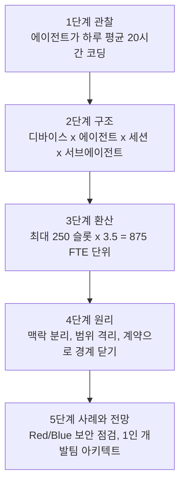
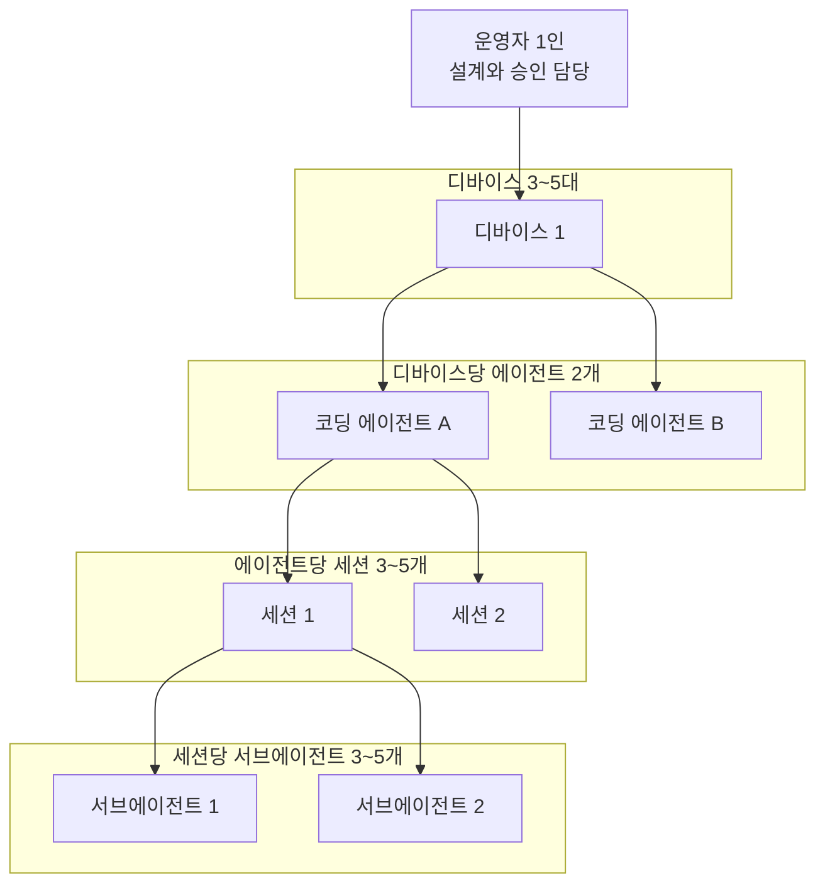
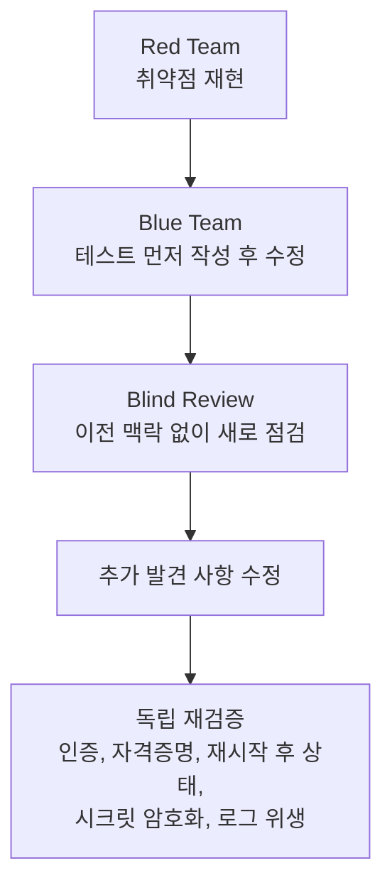

- 분석 대상: 사용자가 제공한 게시글 본문(Facebook 공유 링크 `https://www.facebook.com/share/p/1DvnUdQLRz/`에서 가져온 것으로 전달된 텍스트)
- 작성 기준일: 2026-10-05


```
요즘 나는 혼자서 최대 875명분의 시니어 개발자 작업 단위를 동시에 지휘한다.
지난 30일을 돌아보니, 내 에이전트들이 코딩한 시간이 주 7일, 하루 평균 20시간이었다.
내가 깨어 있는 시간보다 코드가 돌아가는 시간이 더 길다. 하루 8시간 기준으로 환산시 약 3.5명분이다.

진짜 차이는 시간을 직렬로 쓰지 않는다는 점이다.
한 디바이스를 로컬 서버처럼 두고, 그 위에서 코딩 에이전트 두 개를 돌린다. 
에이전트마다 세션을 3~5개 열고, 각 세션은 다시 서브에이전트 3~5개를 백그라운드에서 병렬로 돌린다.
이런 디바이스를 동시에 3~5대 돌린다.

기존 Contract와 Invariant를 건드리지 않는 작업은 내 승인 없이 끝까지 Autonomous Mode로 달리게 한다.
평소에는 3대 × 2 에이전트 × 4 세션 × 4 서브에이전트, 약 100개의 실행 슬롯이 동시에 돌아간다.
최대치로 계산하면 5 × 2 × 5 × 5 = 250개이고, 여기에 시간 환산치 3.5를 곱하면 약 875명분의 FTE 작업 단위가 된다.
물론 내가 시니어 개발자 875명의 생산성을 낸다는 뜻은 아니다.

다만 분명히 경험하고 있는 건, AI 시대의 생산성 단위가 "한 사람이 몇 시간 일하느냐"에서 
"얼마나 많은 독립 실행 단위를 동시에 설계하고 통제할 수 있느냐"로 바뀌고 있다는 점이다.

2~3년 전 우리 엔지니어링·프로덕트 조직이 약 120명이었을 때, 사람이 늘어난다고 생산성이 선형으로 늘지는 않는다는 걸 배웠다.
Dependency가 꼬이고, Legacy가 쌓이고, 팀 간 커뮤니케이션 비용이 커지고, Security와 Release Constraint가 늘면서 
어느 순간부터는 기능 세 개를 동시에 배포하는 것조차 쉽지 않더라.

사람 조직에는 Coordination Tax가 있다. 당연히 AI 에이전트에도 Dependency는 있다. 
다만 잘 설계하면 Context를 끊고, Scope를 격리하고, Contract로 경계를 닫아 서로 독립적으로 병렬 실행시킬 수 있다. 
한 사람이 운영 가능한 방식으로 말이다!

최근 Superwork 퍼블릭 공개를 준비하며 한 보안 작업이 좋은 예다.
외부 펜테스트에 들어가기 전에, 내부에서 먼저 끝까지 털어봤다.
멀티 에이전트를 Red Team과 Blue Team으로 나눠 한쪽에는 공격만, 다른 쪽에는 방어와 수정만 맡겼다.
Red Team이 독립적으로 취약점을 재현하면 Blue Team이 test-first로 고쳤다.
그다음 별도의 blind review가 앞 라운드에서 모두가 놓친 문제를 새로 찾아냈고, 그것까지 고친 뒤 인증, 자격증명, 재시작 후 상태, 
시크릿 암호화와 로그 위생까지 독립적으로 재검증했다.

중요한 건 같은 에이전트가 “내가 만들었으니 문제없다”며 자기 숙제를 채점하게 하지 않았다는 것이다. 간혹 사람 팀에서는 발생하는 일이다.
Maker와 Checker 에이전트의 Context를 끊었다. 서로 다른 모델과 세션이 공격하고, 방어하고, 
다시 공격하면서 이전 Context의 확신을 상속하지 않게 했다.
사람 조직에서 비싸게 발생하던 역할 분리, 병렬 검증, 독립 리뷰 자체를 소프트웨어처럼 복제할 수 있게 된 것이다.

정말 Solopreneur의 시대가 오고 있음이 느껴진다. 하지만 그 기회는 프롬프트를 잘 치고 Vibe Coding을 잘하는 사람의 것은 아닐것 같다.
수십, 수백 개의 AI 작업자들을 동시에 움직이면서도 하나의 시스템이 운영에서 무너지지 않게 통제할 수 있는 사람의 것이라는 생각이든다.
숲을 조망하면서 동시에 나무의 디테일까지 내려갈 수 있는 설계력, SaaS와 LLM, Agent 아키텍처에 대한 깊은 이해가 한 사람에게 있다면 
AI 코딩의 약점을 상당 부분 구조로 상쇄할 수 있다.

Architect에게 온 “1인 개발팀”의 역설적 기회가 아닐까. 

어쩌면 앞으로 조직의 가장 중요한 생산성 지표는 “직원이 몇 명인가?”가 아니라 
“한 사람이 몇 개의 안전한 에이전트 실행 단위를 병렬로 지휘할 수 있는가?”가 될지도 모르겠다.

```

---

## 0. 먼저 읽는 요약

이 글은 한 명의 아키텍트가 코딩 에이전트를 대규모로 병렬 운영하면서 얻은 경험을 바탕으로, "AI 시대의 생산성 단위는 일하는 시간이 아니라 동시에 설계하고 통제할 수 있는 독립 실행 단위의 수"라는 주장을 펼칩니다. 글쓴이는 평소 약 100개, 최대 250개의 실행 슬롯을 동시에 돌리고, 여기에 지난 30일간의 에이전트 가동 시간을 환산한 값(3.5)을 곱해 "최대 875명분의 시니어 개발자 작업 단위"라는 숫자를 제시합니다. 그러면서도 "내가 시니어 개발자 875명의 생산성을 낸다는 뜻은 아니다"라고 스스로 선을 긋습니다.

글의 후반부는 숫자 자랑이 아니라 구조에 대한 이야기입니다. 사람 조직에는 조율 비용(글쓴이의 표현으로 Coordination Tax)이 있고, 에이전트에도 의존성은 있지만 맥락을 끊고, 범위를 격리하고, 계약(Contract)으로 경계를 닫으면 독립적으로 병렬 실행할 수 있다는 것입니다. 이를 보여 주는 사례로 외부 모의해킹(펜테스트) 전에 수행한 Red Team / Blue Team 멀티 에이전트 보안 점검을 듭니다. 마지막으로 이런 방식의 기회는 프롬프트를 잘 쓰는 사람이 아니라 시스템 전체를 설계하고 통제할 수 있는 사람, 즉 아키텍트에게 돌아갈 것이라는 전망으로 끝납니다.

이 문서는 글의 내용을 쉬운 말로 풀어 설명하고, 검색으로 확인할 수 있는 배경 사실과 글쓴이 본인의 주장을 구분해서 정리합니다. 특히 "875"라는 숫자가 어떻게 만들어졌는지, 그 숫자가 무엇을 뜻하고 무엇을 뜻하지 않는지를 계산 단계별로 풀었습니다.

---

## 1. 이 글의 출처와 확인 범위

먼저 투명하게 밝혀 둘 점이 있습니다. Facebook 링크는 해당 사이트가 자동 접근을 허용하지 않아 직접 열어 볼 수 없었습니다. 따라서 이 문서의 분석은 사용자가 붙여 넣은 본문 텍스트에 근거합니다. 게시글의 작성자 이름, 게시 일시, 댓글, 반응은 확인하지 못했습니다.

글에 등장하는 "Superwork"라는 이름은 검색으로 확인되는 실재 개념과 맞닿아 있습니다. 유호현 토블에이아이(tobl.ai) 대표가 '슈퍼워크 프레임워크'라는 방법론을 직접 개발했다는 내용이 2026년 1월 전자신문 기사에 나오고, 같은 인물이 공저한 책 『슈퍼휴먼 슈퍼워크』(골든래빗, 유호현·김진실 지음)가 2026년 출간되었습니다. 다만 이것은 "같은 이름의 개념이 존재한다"는 사실일 뿐, 이 게시글의 작성자가 그 인물이라는 증거는 아닙니다. 링크를 열 수 없었기 때문에 작성자는 확정하지 않습니다. 또한 글에 나온 "Superwork 퍼블릭 공개"가 구체적으로 무엇이고 언제 이뤄졌는지는 검색으로 확인되지 않았습니다.

이 문서에서는 내용을 세 가지로 구분해 표시합니다.

- **[본문 주장]**: 게시글이 직접 말한 내용. 글쓴이의 자기 보고이며 외부에서 검증되지 않았습니다.
- **[확인된 배경]**: 검색을 통해 1차 자료 또는 신뢰할 만한 보도로 확인한 사실.
- **[분석]**: 본문 숫자와 확인된 사실을 바탕으로 이 문서가 직접 계산하거나 해석한 내용.

---

## 2. 글의 논리 구조 한눈에 보기

글은 겉으로는 일기처럼 흘러가지만, 정리하면 다섯 단계의 논증입니다.



1단계는 "내가 깨어 있는 시간보다 코드가 돌아가는 시간이 더 길다"는 관찰입니다. 2단계는 그것이 어떤 구조로 가능한지 설명합니다. 3단계는 그 구조를 숫자로 환산합니다. 4단계는 왜 그런 병렬화가 사람 조직에서는 어렵고 에이전트에서는 가능한지, 즉 원리를 말합니다. 5단계는 구체적 사례와 앞으로의 전망입니다. 아래 장에서 단계마다 풀어 보겠습니다.

---

## 3. 글이 설명하는 운영 구조: 100개에서 250개의 실행 슬롯

### 3.1 계층 구조

글쓴이가 설명하는 구조는 네 겹으로 이루어져 있습니다. 가장 바깥에 "디바이스"가 있습니다. 한 대의 기기를 로컬 서버처럼 두고, 그 위에서 코딩 에이전트 두 개를 돌립니다. 에이전트마다 세션을 3~5개 열고, 각 세션은 다시 서브에이전트 3~5개를 백그라운드에서 병렬로 실행합니다. 이런 디바이스를 동시에 3~5대 운영한다고 합니다.

쉽게 비유하면 이렇습니다. 사무실(디바이스)이 여러 개 있고, 각 사무실에 팀장(에이전트)이 두 명 있으며, 팀장마다 프로젝트(세션)를 서너 개 맡고, 프로젝트마다 실무자(서브에이전트)가 서너 명 붙어 있는 모양입니다. 다만 여기서 모든 구성원은 사람이 아니라 AI입니다.



위 그림은 한 갈래만 그린 것이고, 실제로는 이 구조가 디바이스 수만큼, 에이전트 수만큼 복제됩니다.

### 3.2 자율 실행의 조건

글에서 특히 중요한 문장은 "기존 Contract와 Invariant를 건드리지 않는 작업은 내 승인 없이 끝까지 Autonomous Mode로 달리게 한다"입니다. 여기서 두 용어를 풀어 보겠습니다.

- **Contract(계약)**: 모듈이나 서비스 사이에서 "이 입력을 주면 이 출력을 돌려준다"고 약속한 인터페이스입니다. API 명세, 데이터 스키마, 함수 시그니처 같은 것이 해당합니다.
- **Invariant(불변 조건)**: 시스템이 어떤 상황에서도 반드시 지켜야 하는 성질입니다. 예를 들어 "잔액은 음수가 될 수 없다", "인증 없이는 다른 사용자의 데이터를 읽을 수 없다" 같은 규칙입니다.

즉 글쓴이의 운영 원칙은 "경계를 바꾸지 않는 작업은 자율에 맡기고, 경계를 바꾸는 작업만 사람이 승인한다"로 요약됩니다. 사람의 판단이 필요한 지점을 계약과 불변 조건이라는 좁은 관문으로 모아 두었기 때문에, 나머지 대부분은 사람 없이 달릴 수 있다는 논리입니다. 이것이 한 사람이 수백 개의 실행 단위를 감당할 수 있다고 주장하는 핵심 근거입니다.

---

## 4. "875"는 어떻게 계산된 숫자인가

### 4.1 본문에 나온 계산

본문의 계산을 순서대로 다시 적으면 다음과 같습니다.

| 항목 | 계산 | 결과 | 비고 |
|---|---|---|---|
| 평소 슬롯 수 | 3대 × 2 에이전트 × 4 세션 × 4 서브에이전트 | 96 | 본문은 "약 100개"로 표현 |
| 최대 슬롯 수 | 5대 × 2 에이전트 × 5 세션 × 5 서브에이전트 | 250 | 본문과 일치 |
| 시간 환산치 | 하루 평균 20시간 × 주 7일 ÷ (주 40시간) | 3.5 | [분석] 아래 설명 참고 |
| FTE 작업 단위 | 250 × 3.5 | 875 | 본문과 일치 |

슬롯 수의 곱셈은 정확합니다. 3×2×4×4는 96이고, 5×2×5×5는 250이며, 250×3.5는 875입니다.

### 4.2 3.5라는 환산치의 의미

본문은 "하루 8시간 기준으로 환산시 약 3.5명분"이라고 적었습니다. 그런데 하루 20시간을 하루 8시간으로 단순히 나누면 2.5가 됩니다. 3.5가 나오려면 "주 7일 × 20시간 = 주 140시간"을 "주 5일 × 8시간 = 주 40시간"으로 나눠야 합니다. 140 ÷ 40 = 3.5입니다. 이 문서는 글쓴이가 이 방식으로 계산했을 것으로 읽습니다만, 본문에 계산 근거가 명시되어 있지는 않으므로 [분석]으로 분류합니다. 어느 쪽이든 "에이전트가 쉬지 않고 돌기 때문에 사람 한 명의 근무 시간보다 훨씬 길다"는 취지는 같습니다.

### 4.3 이 숫자가 뜻하는 것과 뜻하지 않는 것

875는 "생산성"의 측정값이 아니라 "용량(capacity)"의 환산값입니다. 몇 가지를 구분해서 읽어야 합니다.

첫째, 이 숫자는 슬롯이 모두 가득 차서, 모두 유효한 작업을 하고 있다고 가정할 때의 상한입니다. 글쓴이가 "평소에는 100개"라고 말하므로, 평소 기준으로 같은 계산을 하면 약 350(100 × 3.5)이 됩니다. [분석]

둘째, 3.5라는 시간 환산치는 30일간의 실제 가동 시간에서 나온 값이고, 250이라는 슬롯 수는 최대치입니다. 평균 가동 시간과 최대 슬롯 수를 곱한 것이므로, 두 값이 같은 시점에 동시에 성립했다는 보장은 없습니다. [분석]

셋째, "에이전트가 코드를 생성하는 시간"과 "시니어 개발자가 일하는 시간"은 같은 단위가 아닙니다. 시니어 개발자의 하루에는 설계 판단, 리뷰, 회의, 조율이 포함되고, 에이전트의 가동 시간에는 대기, 재시도, 실패한 시도가 포함될 수 있습니다. 어느 쪽이 더 생산적인지는 이 숫자만으로 알 수 없습니다. [분석]

넷째, 본문의 "하루 평균 20시간, 주 7일"이 어떤 방식으로 측정되었는지(로그 기준인지, 세션 열린 시간 기준인지)는 설명되어 있지 않습니다. [본문 주장]이며 외부 검증이 불가능합니다.

글쓴이 본인도 이 한계를 알고 있습니다. "물론 내가 시니어 개발자 875명의 생산성을 낸다는 뜻은 아니다"라는 문장이 그 표시입니다. 그가 정말 말하고 싶은 것은 숫자가 아니라 단위의 변화, 즉 "한 사람이 몇 시간 일하느냐"에서 "얼마나 많은 독립 실행 단위를 동시에 설계하고 통제하느냐"로 생산성의 기준이 이동하고 있다는 관찰입니다.

---

## 5. 왜 사람 조직은 선형으로 늘지 않는가: 조율 비용의 문제

### 5.1 글쓴이의 경험

글쓴이는 2~3년 전 엔지니어링·프로덕트 조직이 약 120명이었을 때를 회상합니다. 사람이 늘어난다고 생산성이 선형으로 늘지 않았고, 의존성이 꼬이고, 레거시가 쌓이고, 팀 간 커뮤니케이션 비용이 커지고, 보안과 릴리스 제약이 늘면서 기능 세 개를 동시에 배포하는 것조차 쉽지 않았다고 합니다. 이를 "Coordination Tax(조율 세금)"라고 부릅니다. [본문 주장] 이 120명 조직이 어느 회사의 것인지는 본문에 없고 검증할 수 없습니다.

### 5.2 소프트웨어 공학의 오래된 통찰과의 연결

이 경험은 소프트웨어 공학의 고전적 관찰과 일치합니다. 프레드 브룩스(Fred Brooks)가 1975년 『맨먼스 미신(The Mythical Man-Month)』에서 제시한 법칙은 "늦은 소프트웨어 프로젝트에 인력을 더하면 더 늦어진다"입니다. [확인된 배경] 그 이유는 새 인력이 업무를 익히는 시간, 의사소통 경로의 증가, 일의 분할 불가능성입니다. 의사소통 경로의 수는 사람 수 n에 대해 n(n-1)/2로 늘어납니다. 이 책에서는 개발자 50명이면 1,225개의 소통 경로가 생긴다는 예를 듭니다.

같은 공식을 글쓴이의 120명 조직에 적용하면 120 × 119 ÷ 2 = 7,140개입니다. [분석] 물론 실제 조직은 모두가 모두와 소통하지 않고 팀과 계층으로 나뉘어 있으므로 7,140이 실제 소통량은 아닙니다. 다만 인원이 늘수록 잠재적 조율 경로가 제곱에 가깝게 늘어난다는 방향성은 글쓴이의 경험담과 일치합니다.

브룩스의 법칙에는 한계도 있습니다. 일이 깔끔하게 나뉘고 사람들이 서로 독립적으로 일할 수 있는 경우에는 인력 추가가 효과를 낸다는 점입니다. 이 지점이 글쓴이의 논리와 맞닿습니다. 글쓴이는 "에이전트에도 의존성은 있다. 다만 잘 설계하면 서로 독립적으로 병렬 실행시킬 수 있다"고 말합니다. 즉 맥락을 끊고, 범위를 격리하고, 계약으로 경계를 닫으면 일을 브룩스가 말한 "분할 가능한 일"로 만들 수 있다는 주장입니다.

### 5.3 반대편의 근거: 병렬화가 잘 맞지 않는 영역

다만 이 주장에는 확인된 반론이 있습니다. Anthropic의 엔지니어링 블로그 글 "How we built our multi-agent research system"은 병렬 서브에이전트가 효과적인 영역과 그렇지 않은 영역을 구분합니다. [확인된 배경]

- 이 글에서 Claude Opus 4를 리드 에이전트로, Claude Sonnet 4를 서브에이전트로 둔 멀티 에이전트 시스템이 단일 Claude Opus 4보다 내부 연구 평가에서 90.2% 높은 성능을 냈다고 보고합니다.
- 성능 차이의 상당 부분은 토큰 사용량으로 설명되었고(해당 평가에서 분산의 80%), 멀티 에이전트 시스템은 일반 채팅보다 약 15배 많은 토큰을 쓴다고 보고합니다.
- 또한 "대부분의 코딩 작업은 연구보다 병렬화할 수 있는 부분이 적고, LLM 에이전트는 다른 에이전트에게 실시간으로 조율하고 위임하는 일에 아직 능숙하지 않다"고 적고 있습니다.

이 반론은 글쓴이의 주장을 부정한다기보다 조건을 분명히 해 줍니다. 병렬 에이전트가 잘 작동하려면 작업이 서로 독립적이어야 하고, 코딩에서는 그 독립성을 사람(설계자)이 만들어 줘야 합니다. 글쓴이가 "Contract로 경계를 닫는다"고 강조한 것이 바로 그 독립성을 인위적으로 만드는 방법으로 읽힙니다. 또 Anthropic의 글은 2025년 6월의 것이고 이후 모델과 도구가 발전했으므로, 이 한계가 현재도 같은 정도로 유효한지는 이 문서가 확정할 수 없습니다.

한편 병렬 코딩 에이전트에 대한 업계 관찰도 있습니다. 사이먼 윌리슨(Simon Willison)은 2025년 10월 "Embracing the parallel coding agent lifestyle"에서 여러 터미널에서 서로 다른 코딩 에이전트를 동시에 돌리는 방식을 소개했고, 개발 전문 뉴스레터 The Pragmatic Engineer는 이를 다루며 "지금까지 병렬 에이전트를 성공적으로 쓴다고 들은 사람은 대부분 시니어 이상 엔지니어"라고 전했습니다. [확인된 배경] 이것은 글쓴이의 후반 주장, 즉 이 방식이 시니어 설계 역량을 가진 사람에게 유리하다는 주장과 같은 방향의 관찰입니다. 다만 그 뉴스레터 역시 병렬 작업이 오히려 더 많은 문제와 반복 작업을 낳아 이득을 상쇄할 가능성이 있다는 불확실성을 함께 적고 있습니다.

---

## 6. 보안 점검 사례: Red Team, Blue Team, 그리고 독립 검증

글에서 가장 구체적인 부분입니다. Superwork 퍼블릭 공개를 준비하면서 외부 펜테스트(모의해킹) 전에 내부에서 먼저 철저히 점검했다는 이야기입니다.

### 6.1 진행 흐름

글의 설명을 순서대로 정리하면 다음과 같습니다. [본문 주장]

1. 멀티 에이전트를 Red Team(공격)과 Blue Team(방어·수정)으로 나눕니다. 한쪽에는 공격만, 다른 쪽에는 방어와 수정만 맡깁니다.
2. Red Team이 독립적으로 취약점을 재현합니다.
3. Blue Team이 test-first 방식으로 수정합니다. 즉 먼저 취약점을 재현하는 테스트를 만들고, 그 테스트가 통과하도록 코드를 고칩니다.
4. 별도의 blind review가 앞 라운드에서 모두가 놓친 문제를 새로 찾습니다. blind review는 앞선 작업의 맥락과 결론을 모른 채 처음 보는 시각으로 검토하는 방식입니다.
5. 그 문제까지 고친 뒤, 인증, 자격증명, 재시작 후 상태, 시크릿 암호화, 로그 위생을 독립적으로 재검증합니다.



### 6.2 핵심은 "자기 숙제를 자기가 채점하지 않는다"

글쓴이가 가장 강조하는 대목은 같은 에이전트가 "내가 만들었으니 문제없다"며 자기 결과를 채점하게 하지 않았다는 것입니다. Maker(만드는 쪽)와 Checker(검사하는 쪽)의 맥락을 끊고, 서로 다른 모델과 세션이 공격하고, 방어하고, 다시 공격하게 하여 이전 맥락의 확신이 상속되지 않도록 했다고 합니다.

이 원칙은 외부 자료로 뒷받침됩니다. Anthropic Engineering의 "Harness design for long-running application development"는 장시간 자율 코딩에서 두 번째 문제로 "자기 평가(self-evaluation)"를 지목합니다. 생성하는 에이전트가 자기 결과를 평가하게 하면 관대해지기 쉬우므로, 생성 에이전트와 평가 에이전트를 분리한 구조(계획-생성-평가의 3 에이전트)를 설계했다는 내용입니다. 또한 별도의 평가자를 회의적으로 조정하는 편이, 생성자가 자기 결과에 비판적이도록 만드는 것보다 훨씬 다루기 쉽다고 설명합니다. [확인된 배경] 글쓴이의 "Maker와 Checker 분리"는 이 구조와 같은 원리를 보안 점검에 적용한 사례로 이해할 수 있습니다. 이 Anthropic 글의 정확한 게시일은 2차 자료에 따르면 2026년 3월 24일입니다.

사람 조직에서도 이 원칙은 새롭지 않습니다. 코드 리뷰, 감사의 독립성, 모의해킹을 외부 팀에 맡기는 관행이 모두 같은 생각에서 나왔습니다. 글쓴이의 표현으로 "사람 조직에서 비싸게 발생하던 역할 분리, 병렬 검증, 독립 리뷰 자체를 소프트웨어처럼 복제할 수 있게 된 것"이 핵심 주장입니다. 이 문장은 해석에 가깝고, 같은 수준의 독립성이 실제로 확보되는지는 설계와 운영에 달려 있습니다.

### 6.3 이 사례에서 확인할 수 없는 것

이 보안 점검의 결과, 즉 몇 건의 취약점을 찾았고 어떤 종류였는지, 이후 외부 펜테스트에서 어떤 결과가 나왔는지는 본문에 없습니다. 또 "다른 모델과 세션"이 구체적으로 어떤 모델인지도 적혀 있지 않습니다. 따라서 이 사례는 "이런 절차로 점검했다"는 방법론의 소개로 읽어야 하고, "이 방법으로 보안이 충분히 확보되었다"는 결론으로 읽어서는 안 됩니다. 에이전트끼리의 검증이 사람 전문가의 모의해킹을 대체한다는 주장도 본문에는 없으며, 글쓴이도 외부 펜테스트를 앞두고 내부 선행 점검을 한 것이라고 말합니다.

---

## 7. 후반부의 주장: Solopreneur와 아키텍트의 기회

### 7.1 주장의 내용

글의 마지막 단락들은 전망입니다. "정말 Solopreneur(1인 창업가)의 시대가 오고 있음이 느껴진다. 하지만 그 기회는 프롬프트를 잘 치고 Vibe Coding을 잘하는 사람의 것은 아닐 것 같다." 대신 수십, 수백 개의 AI 작업자를 동시에 움직이면서도 하나의 시스템이 운영에서 무너지지 않게 통제할 수 있는 사람의 것이라고 말합니다.

이때 필요한 능력으로 글쓴이는 두 가지를 듭니다. 하나는 숲을 조망하면서 동시에 나무의 디테일까지 내려갈 수 있는 설계력입니다. 다른 하나는 SaaS, LLM, 에이전트 아키텍처에 대한 깊은 이해입니다. 이런 능력이 한 사람에게 있으면 AI 코딩의 약점을 상당 부분 구조로 상쇄할 수 있다는 것입니다. 그래서 "Architect에게 온 1인 개발팀의 역설적 기회"라고 부릅니다.

### 7.2 새로운 생산성 지표 제안

마지막 문장은 가설 형태의 제안입니다. 앞으로 조직의 가장 중요한 생산성 지표는 "직원이 몇 명인가?"가 아니라 "한 사람이 몇 개의 안전한 에이전트 실행 단위를 병렬로 지휘할 수 있는가?"가 될지도 모른다는 것입니다. 여기서 "안전한"이라는 수식어가 중요합니다. 단순히 많이 돌리는 것이 아니라, 계약과 불변 조건을 지키고, 독립 검증을 거친 실행 단위만 센다는 뜻으로 읽힙니다.

### 7.3 이 주장을 읽을 때의 균형

이 전망은 글쓴이의 의견이며 아직 검증된 법칙이 아닙니다. 몇 가지 열린 질문이 있습니다.

- 에이전트 실행 단위 수는 토큰 비용에 비례해 커집니다. Anthropic은 멀티 에이전트 시스템이 채팅 대비 약 15배의 토큰을 쓴다고 보고했습니다. 글쓴이의 운영 비용이 얼마인지는 본문에 없으므로, 경제성은 확인할 수 없습니다. [확인된 배경 + 본문 정보 부재]
- "한 사람이 지휘할 수 있는 단위 수"의 상한이 어디인지는 사람의 주의력과 검토 능력에 달려 있습니다. 승인이 필요한 변경(계약과 불변 조건에 닿는 변경)이 늘어나는 순간 사람이 병목이 됩니다. [분석]
- 같은 방식이 모든 종류의 프로젝트에 통하는지는 불분명합니다. 글쓴이의 사례는 본인이 설계하고 경계를 잘 아는 시스템에서 나온 경험입니다. 반면 의존성이 강한 대규모 레거시에서는 계약으로 경계를 닫는 일 자체가 큰 작업일 수 있습니다. [분석]

---

## 8. 본문 주장별 검증 현황

| 본문 주장 | 구분 | 확인 상태 |
|---|---|---|
| 지난 30일간 에이전트 코딩 시간이 하루 평균 20시간, 주 7일 | 본문 주장 | 자기 보고. 측정 방식 미제시, 외부 검증 불가 |
| 평소 약 100 슬롯, 최대 250 슬롯 | 본문 주장 + 계산 | 곱셈은 정확(96, 250). 실제 운영 상태는 검증 불가 |
| 250 × 3.5 = 875 | 계산 | 산술은 정확. 3.5는 주 140시간 ÷ 주 40시간으로 읽힘(본문에 명시 없음). 용량 환산값이며 생산성 측정값은 아님 |
| 사람 조직은 선형으로 확장되지 않는다 | 일반 명제 | 브룩스의 법칙 등 소프트웨어 공학 고전과 방향 일치 |
| 맥락 분리·범위 격리·계약으로 에이전트를 독립 병렬화할 수 있다 | 본문 주장 | 원리는 타당하나, Anthropic은 코딩이 연구보다 병렬화가 어렵다고 보고. 조건부로 성립 |
| Maker와 Checker를 분리해야 한다 | 본문 주장 | Anthropic Engineering의 자기 평가 문제 및 생성자-평가자 분리 설계와 같은 원리 |
| Red/Blue Team 멀티 에이전트로 내부 보안 점검을 수행했다 | 본문 주장 | 수행 사실과 결과 모두 검증 불가. 방법론으로서는 합리적 |
| 시니어 설계 역량이 병렬 에이전트 운영에 유리하다 | 본문 주장 | The Pragmatic Engineer가 시니어 이상 엔지니어의 성공 사례가 대부분이라고 전함(제한적 관찰) |
| 미래 생산성 지표가 "안전한 병렬 실행 단위 수"가 된다 | 전망 | 검증되지 않은 의견. 글쓴이도 "~일지도 모르겠다"고 표현 |

---

## 9. 이 글에서 가져갈 수 있는 실무적 시사점

이 글의 숫자(875)보다 오래 남을 것은 운영 원칙입니다. 글에 직접 나온 내용과 확인된 배경을 바탕으로 정리하면 다음과 같습니다.

첫째, 병렬화의 전제는 독립성입니다. 에이전트를 늘리기 전에 작업 단위를 서로 간섭하지 않게 쪼개야 하고, 그 경계는 계약으로 명문화되어야 합니다. 글쓴이가 "Context를 끊고, Scope를 격리하고, Contract로 경계를 닫는다"고 순서대로 말한 이유입니다.

둘째, 사람의 승인은 경계가 바뀌는 지점에만 두는 것이 효율적입니다. 모든 변경을 사람이 보면 병목이 되고, 아무것도 보지 않으면 위험합니다. 계약과 불변 조건을 기준선으로 삼는 방식은 그 중간을 노립니다.

셋째, 만드는 쪽과 검사하는 쪽은 분리해야 합니다. 같은 맥락을 공유한 에이전트는 이전 판단의 확신을 이어받기 쉽습니다. Anthropic도 자기 평가의 관대함을 문제로 지목하고 평가자를 분리했습니다.

넷째, 숫자를 인용할 때는 용량과 성과를 구분해야 합니다. "875명분"이라는 표현은 인상적이지만, 이를 그대로 생산성으로 옮기면 오해가 생깁니다. 이 글의 올바른 요약은 "최대 용량 기준으로 한 사람이 통제할 수 있다고 주장하는 병렬 실행 단위의 규모"입니다.

---

## 10. 용어 사전

| 용어 | 쉬운 설명 |
|---|---|
| FTE (Full-Time Equivalent) | 정규직 1명이 하는 일의 양을 기준으로 환산한 단위 |
| 코딩 에이전트 | 코드를 읽고, 쓰고, 실행하고, 수정하는 일을 스스로 반복하는 AI 프로그램 |
| 세션 | 에이전트가 하나의 작업 흐름을 이어 가는 대화 단위 |
| 서브에이전트 | 상위 에이전트가 특정 하위 작업을 맡기려고 띄우는 별도의 에이전트 |
| 슬롯 | 이 문서에서 동시에 돌아가는 서브에이전트 실행 칸을 가리키는 말 |
| Contract | 모듈 사이의 입출력 약속(API, 스키마 등) |
| Invariant | 어떤 경우에도 깨지면 안 되는 시스템 불변 조건 |
| Autonomous Mode | 사람의 승인 없이 에이전트가 끝까지 작업을 진행하는 실행 방식 |
| Coordination Tax | 사람이나 에이전트가 늘어날 때 조율에 드는 추가 비용을 가리키는 표현 |
| Red Team / Blue Team | 공격 역할과 방어 역할을 나누어 점검하는 보안 훈련 방식 |
| Test-first | 먼저 실패하는 테스트를 만들고, 그 테스트를 통과하도록 코드를 고치는 방식 |
| Blind review | 앞선 맥락을 모른 채 독립적으로 수행하는 검토 |
| Maker / Checker | 만드는 주체와 검증하는 주체를 분리하는 원칙 |
| 펜테스트 | 외부 전문가가 실제 공격자처럼 시스템의 취약점을 찾아보는 모의해킹 |
| Solopreneur | 직원 없이 혼자 사업을 운영하는 1인 창업가 |
| Vibe Coding | 자연어로 AI에게 요청하며 결과를 보고 다듬는 방식의 코딩 |

---

## 11. 참고자료

접근일은 모두 2026-10-05입니다.

1. 유호현·김진실, 『슈퍼휴먼 슈퍼워크』 상품 정보 (교보eBook). 저자 소개, 출간일(eBook 2026-04-10, 국내도서 2026-03-16), 슈퍼워크 개념 소개. https://ebook-product.kyobobook.co.kr/dig/epd/ebook/E000012748777
2. 전자신문, "팀 전체를 에이전트 코딩 체계로 전환하는 전략… 유호현 토블에이아이 대표, '슈퍼워크 프레임워크' 방법론 소개" (2026-01). 슈퍼워크 프레임워크 방법론 소개. https://www.etnews.com/20260120000048
3. Anthropic Engineering, "How we built our multi-agent research system". 멀티 에이전트 연구 시스템의 성능, 토큰 비용, 코딩의 병렬화 한계. https://www.anthropic.com/engineering/multi-agent-research-system
4. Anthropic Engineering, "Harness design for long-running application development". 자기 평가 문제와 생성자-평가자 분리 구조. https://anthropic.com/engineering/harness-design-long-running-apps
5. InfoQ, "Anthropic Designs Three-Agent Harness Supports Long-Running Full-Stack AI Development" (2026-04). 위 Anthropic 글에 대한 2차 보도. https://infoq.com/news/2026/04/anthropic-three-agent-harness-ai/
6. Simon Willison, "Embracing the parallel coding agent lifestyle" (2025-10-05). 병렬 코딩 에이전트 운영 패턴. https://simonwillison.net/2025/Oct/5/parallel-coding-agents/
7. Gergely Orosz, The Pragmatic Engineer, "New trend: programming by kicking off parallel AI agents". 병렬 에이전트 활용과 시니어 엔지니어에 관한 관찰. https://blog.pragmaticengineer.com/new-trend-programming-by-kicking-off-parallel-ai-agents/
8. Wikipedia, "The Mythical Man-Month". 브룩스의 법칙과 의사소통 경로 n(n-1)/2. https://en.wikipedia.org/wiki/The_Mythical_Man-Month
9. 분석 대상 게시글 (Facebook 공유 링크). 자동 접근이 허용되지 않아 직접 열람하지 못했고, 사용자가 제공한 본문 텍스트로 분석함. https://www.facebook.com/share/p/1DvnUdQLRz/

---

작성 일자: 2026-10-05
