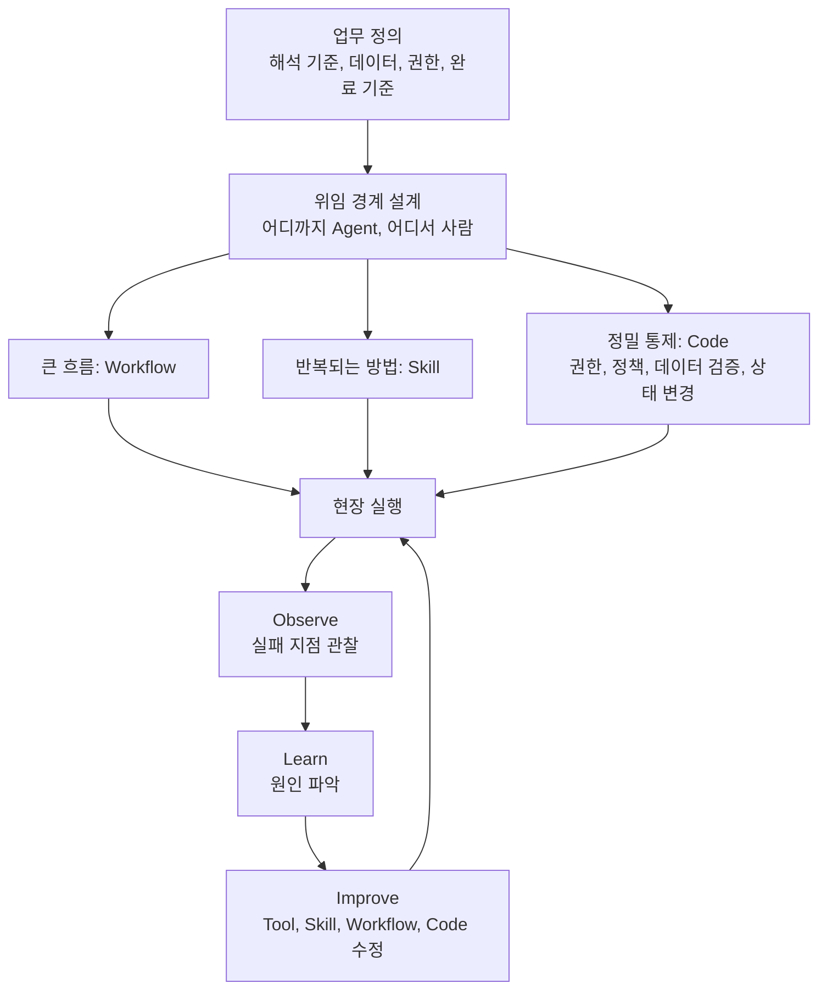
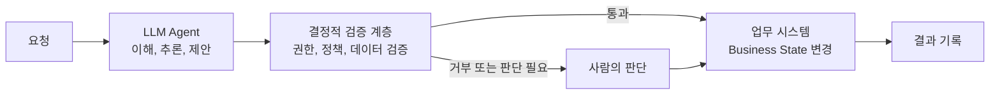

작성 기준일: 2026년 10월 6일


```
단상

요즘 Agent를 만들면서 자꾸 조직 운영과 비슷하다는 생각이 든다.

Agent에게 맡길 일은
사람에게도 맡길 수 있는 수준으로 정의되어 있어야 한다.

사람도 매번 다르게 해석하고,
어떤 데이터를 봐야 하는지 모르고,
권한도 없고,
완료의 기준조차 모르는 일을

“AI니까 알아서 해.”

라고 넘긴다고 갑자기 일이 되지는 않는다.

Agent가 추론해서 새로운 관점을 제시할 수는 있다.
하지만 중요한 것은
어디까지 맡기고 어디에서 사람이 판단할지를 설계하는 것이다.

모든 단계를 사람이 승인할 필요도 없고,
모든 판단을 Agent에게 넘길 필요도 없다.

그리고 요즘은 가능하면
Code부터 작성하지 않으려고 한다.

업무의 큰 흐름은 Workflow로 만들고,
반복해서 필요한 일하는 방법은 Skill로 만든다.

하지만 권한 확인, 정책 적용, 데이터 검증,
Business State를 실제로 변경하는 세밀한 제어까지
“LLM이 잘 알아서 하겠지”라고 할 수는 없다.

그곳에는 여전히 Code가 필요하다.

그래서 Platform도 만능이 아니다.

좋은 Platform 하나 설치했다고
다음 날 Agentic Enterprise가 되는 것은 아니다.

현장에 들어가서 실제 일을 시켜봐야 한다.

실패한 지점을 보고,
Tool을 고치고,
Skill을 개선하고,
Workflow를 바꾸고,
필요하면 Code를 수정한다.

Observe → Execute → Learn → Improve.

결국 이 Loop가 Platform을 진화시킨다.

그리고 한 가지 더.

Agent를 100개 만들었다고
Agentic AI를 잘하고 있는 것은 아니다.

회사도 사람이 많다고 일이 잘되는 것은 아니니까.

똑똑한 사람을 채용한 다음에도
업무와 데이터와 시스템과 조직을 연결해야 일이 된다.

Agent도 똑같다.

이제 중요한 질문은

“How many agents do we have?”

가 아니라

“How much real work can we delegate?”

인 것 같다.

Agent의 Headcount가 아니라
Agent에게 실제로 맡길 수 있는 일의 크기.

요즘 제가 보는 Enterprise Agent의 생산성 지표는
점점 그쪽으로 가고 있다.

https://www.facebook.com/share/1Ba5USXN5v/

```


## 0. 먼저 알려드리는 글의 성격과 근거 범위

이 문서는 "요즘 Agent를 만들면서 자꾸 조직 운영과 비슷하다는 생각이 든다"로 시작하는 짧은 단상을 한 문단씩 풀어 설명하고, 그 주장이 공개된 최신 자료와 어떻게 맞닿아 있는지 확인한 글입니다.

다만 먼저 분명히 해둘 점이 있습니다. 함께 주신 페이스북 공유 링크는 해당 사이트가 자동 접근을 허용하지 않아 열어볼 수 없었습니다. 그래서 이 문서의 해설은 전달해 주신 본문 텍스트만을 대상으로 합니다. 작성자가 누구인지, 어떤 회사의 어떤 플랫폼을 염두에 두고 쓴 글인지 같은 배경은 본문에 나와 있지 않으므로 추정하지 않았습니다.

또 하나의 구분이 필요합니다. 이 단상은 사실을 보고하는 기사가 아니라 현장 경험에서 나온 관점과 주장입니다. 따라서 이 문서는 두 층으로 나누어 서술합니다. 첫째는 "글이 무엇을 말하는가"라는 해설이고, 둘째는 "그 말과 연결되는 외부 자료에는 무엇이 있는가"라는 대조입니다. 외부 자료에서 확인되는 내용은 출처를 밝혀 적었고, 확인하지 못한 부분은 확인하지 못했다고 적었습니다. 글의 마지막에 참고한 출처를 모아 두었습니다.

## 1. 한 문장 요약

이 글의 핵심은 이렇게 정리할 수 있습니다. Agent는 마법의 도구가 아니라 "새로 입사한 구성원"에 가깝기 때문에, 사람에게 맡기기 어려울 만큼 모호한 일은 Agent에게도 맡길 수 없고, 그래서 Agent 도입의 성패는 Agent의 숫자가 아니라 "실제로 위임 가능한 일의 크기"에 달려 있다는 주장입니다.

이 주장은 다섯 개의 하위 주장으로 이루어져 있습니다. 하나, 일은 사람에게 줄 수 있을 정도로 정의되어야 한다. 둘, 어디까지 Agent에게 맡기고 어디에서 사람이 판단할지 설계해야 한다. 셋, 큰 흐름은 Workflow로, 반복되는 노하우는 Skill로 만들되 권한·정책·검증·상태 변경 같은 정밀 통제에는 여전히 Code가 필요하다. 넷, Platform을 설치한다고 끝나지 않으며 현장에서 Observe → Execute → Learn → Improve의 Loop를 돌려야 한다. 다섯, 성과 지표는 Agent의 개수가 아니라 맡길 수 있는 일의 크기여야 한다.

아래에서 이 다섯 가지를 차례로 풀어보겠습니다.

## 2. 전체 구조 한눈에 보기

글이 제안하는 설계 사고를 하나의 흐름으로 그려보면 다음과 같습니다. 이 도식은 글의 논리를 이해하기 쉽게 재구성한 것이며, 원문에 있는 그림이 아니라 본문 내용을 바탕으로 제가 정리한 것입니다.



도식에서 눈여겨볼 점은 Workflow, Skill, Code가 서로 경쟁하는 선택지가 아니라 역할이 나뉜 층이라는 사실입니다. 그리고 이 모든 것이 한 번 만들고 끝나는 것이 아니라 현장 실행 뒤의 관찰과 개선으로 계속 되돌아온다는 점이 글 후반부의 중심 메시지입니다.

## 3. 문단별 상세 해설

### 3-1. "Agent를 만드는 일은 조직을 운영하는 일과 비슷하다"

글은 첫머리에서 은유를 하나 놓고 시작합니다. Agent에게 맡길 일은 사람에게도 맡길 수 있는 수준으로 정의되어 있어야 한다는 것입니다.

그 근거로 작성자는 사람이 일을 못 하게 되는 네 가지 상황을 듭니다. 매번 다르게 해석하는 경우, 어떤 데이터를 봐야 하는지 모르는 경우, 권한이 없는 경우, 완료의 기준조차 모르는 경우입니다. 이 네 가지는 Agent 설계에 그대로 대응됩니다. 해석의 일관성은 지침과 예시의 명확성에, 데이터는 검색과 연결 도구에, 권한은 접근 제어에, 완료의 기준은 평가 기준에 대응됩니다.

여기서 "AI니까 알아서 해"라는 말이 비판의 대상이 됩니다. 새로 들어온 직원에게 "알아서 잘 해보세요"라고만 말하면 일이 되지 않는 것처럼, Agent도 마찬가지라는 뜻입니다. 이 주장은 결국 "업무 정의의 품질이 Agent 성능의 상한을 정한다"는 이야기로 읽힙니다.

이 관점은 Anthropic이 2024년 12월에 공개한 엔지니어링 글 "Building effective agents"의 조언과 방향이 같습니다. 이 글에서 Anthropic은 고객사들과 일하며 배운 점을 정리하면서, 도구가 어떤 에이전트 시스템에서도 중요한 요소가 된다고 말하고, SWE-bench용 에이전트를 만들 때 전체 프롬프트보다 도구를 다듬는 데 더 많은 시간을 썼다고 밝힙니다. 즉 "무엇을 볼 수 있고 무엇을 할 수 있는가"를 정의하는 일이 모델의 똑똑함 못지않게 중요하다는 것입니다. (출처 1)

### 3-2. "Agent가 새로운 관점을 줄 수는 있지만, 중요한 것은 위임의 경계 설계다"

두 번째 문단은 균형을 잡습니다. Agent가 추론해서 새로운 관점을 제시할 수 있다는 점은 인정하되, 정작 중요한 것은 "어디까지 맡기고 어디에서 사람이 판단할지"를 설계하는 일이라고 말합니다. 그리고 모든 단계를 사람이 승인할 필요도, 모든 판단을 Agent에게 넘길 필요도 없다고 덧붙입니다.

이 문단은 두 가지 극단을 모두 경계합니다. 모든 단계마다 사람이 승인하는 방식은 안전해 보이지만 속도와 효용을 잃고, 사람의 주의력도 소진시킵니다. 반대로 모든 판단을 넘기는 방식은 효율적으로 보이지만 통제 공백이 생깁니다.

이 균형 감각은 Anthropic이 2026년 2월 18일에 공개한 연구 "Measuring AI agent autonomy in practice"에서 데이터로 확인되는 부분이 있습니다. Anthropic은 Claude Code와 공개 API에서 나온 수백만 건의 사람-에이전트 상호작용을 분석했습니다. 연구의 핵심 결론은 에이전트에 대한 효과적인 감독을 위해서는 배포 이후의 새로운 모니터링 인프라와 사람과 AI가 함께 자율성과 위험을 관리하는 새로운 상호작용 방식이 필요하다는 것입니다. 또한 모델이 감당할 수 있는 자율성이 실제로 발휘되는 자율성보다 크다는 "deployment overhang"이 관찰된다고 밝혔습니다. 그리고 숙련된 사용자일수록 수동 승인 없이 Claude를 실행하는 경우가 늘어난다고 설명합니다. (출처 2)

이 연구를 소개한 일본 매체 Gigazine의 요약에 따르면, 초보 사용자는 행동마다 미리 승인하는 "사전 승인" 방식을, 숙련 사용자는 자율적으로 돌리다가 문제가 생기면 즉시 개입하는 "능동 모니터링" 방식을 쓰는 경향이 있었습니다. 같은 요약은 API 행동의 약 80%에 권한 제한이나 사람의 승인 같은 보호 장치가 적용되어 있고 되돌릴 수 없는 행동은 전체의 0.8%에 그쳤다고 전합니다. 이 수치는 원문 연구를 다룬 2차 요약에서 가져온 것이므로, 정확한 정의가 필요하면 Anthropic의 원문을 확인하시기 바랍니다. (출처 3)

정리하면, 작성자가 말한 "전부 승인도, 전부 위임도 아닌 설계"는 현장에서도 실제로 관찰되는 방향입니다. 다만 이 연구는 주로 코딩 에이전트 사용 데이터를 바탕으로 하므로, 기업 업무 전반에 그대로 일반화할 수는 없다는 한계를 함께 기억해야 합니다.

### 3-3. "가능하면 Code부터 작성하지 않는다. Workflow와 Skill로 만든다"

세 번째 문단은 이 글에서 가장 실무적인 대목입니다. 작성자는 요즘 가능하면 Code부터 쓰지 않으려 한다고 말합니다. 업무의 큰 흐름은 Workflow로, 반복해서 필요한 일하는 방법은 Skill로 만든다는 것입니다.

여기에 쓰인 용어들을 외부 자료에 비추어 정리해 보겠습니다.

**Workflow의 의미.** Anthropic의 "Building effective agents"는 Workflow를 "LLM과 도구가 미리 정해진 코드 경로를 따라 조율되는 시스템"으로, Agent를 "LLM이 스스로 처리 과정과 도구 사용을 동적으로 지휘하는 시스템"으로 구분합니다. 그리고 가능한 한 가장 단순한 해법을 찾고 필요할 때만 복잡도를 높이라고 권고합니다. 더 복잡한 구조가 필요할 때도, 잘 정의된 작업에는 Workflow가 예측 가능성과 일관성을 주고, 대규모의 유연성과 모델 주도 판단이 필요할 때 Agent가 더 낫다고 설명합니다. (출처 1) 이 구분에 따르면 작성자가 말하는 "업무의 큰 흐름을 Workflow로"는 예측 가능한 뼈대를 먼저 세우라는 뜻으로 이해할 수 있습니다.

**Skill의 의미.** Agent Skills는 Anthropic이 2025년 10월 16일 처음 공개했고, 2025년 12월 18일 독립된 오픈 표준으로 내놓았습니다. 사양은 agentskills.io에서 관리됩니다. (출처 4, 5) 기본 구조는 `SKILL.md`라는 마크다운 파일과 선택적 참조 파일, 스크립트를 담은 폴더입니다. 핵심 설계 원리는 "점진적 공개(progressive disclosure)"입니다. 각 Skill의 요약 정보만 시작 시점에 컨텍스트에 올려두고, 작업이 해당 Skill과 맞을 때에만 전체 지침을 불러오는 방식입니다. Anthropic 제품 담당자는 이를 두고 Skill 하나의 요약이 수십 토큰밖에 차지하지 않는다고 설명했습니다. (출처 4) 이 방식 덕분에 모든 노하우를 거대한 시스템 프롬프트에 몰아넣지 않아도 됩니다.

Skill의 위치도 분명합니다. Anthropic은 MCP는 Claude를 데이터에 연결하고, Skill은 그 데이터로 무엇을 할지 가르친다는 취지로 둘의 역할을 구분했습니다. (출처 6) 작성자가 말한 "반복해서 필요한 일하는 방법"은 정확히 이 Skill의 자리입니다. 팀이 쌓은 업무 요령을 사람에게 인수인계 문서로 남기듯, Agent에게도 재사용 가능한 형태로 남기는 것입니다.

생태계 측면에서도 이 선택은 실용적입니다. 한 분석 글에 따르면 2026년 중반 기준 공식 클라이언트 쇼케이스에 오른 제품 중 약 40개가 Skill을 불러올 수 있고, Claude, OpenAI Codex, Cursor, Gemini CLI, GitHub Copilot, VS Code 등이 포함됩니다. (출처 7) 이 수치는 특정 매체의 집계이므로 대략적인 규모로만 받아들이시는 것이 안전합니다. 반면 확인된 사실로 말할 수 있는 점은, 한 번 만든 Skill을 여러 도구에서 재사용할 수 있는 표준이 실제로 열려 있다는 것입니다.

한 가지 주의할 점도 있습니다. Skill 생태계가 커지면서 보안 위험도 보고되었습니다. 한 분석 글은 2026년 2월까지 보안 연구자들이 커뮤니티 허브에서 악성 Skill 341개를 발견했다고 전합니다. (출처 8) Anthropic은 신뢰할 수 있는 출처의 Skill만 설치하고, 출처가 불분명한 것은 꼼꼼히 점검하라고 권고합니다. (출처 4) Skill은 "지침"이지만 스크립트를 포함할 수 있어서, 사람에게 업무 매뉴얼을 줄 때와 달리 검증 절차가 필요합니다.

### 3-4. "하지만 권한, 정책, 데이터 검증, 상태 변경에는 여전히 Code가 필요하다"

네 번째 문단이 이 글의 균형추입니다. 앞에서 "Code부터 쓰지 않는다"고 했지만, 권한 확인, 정책 적용, 데이터 검증, 그리고 Business State를 실제로 바꾸는 세밀한 제어까지 "LLM이 알아서 하겠지"라고 할 수는 없다는 것입니다.

여기서 Business State는 주문 상태, 결제 상태, 재고, 승인 이력처럼 업무 시스템이 "사실"로 기록하는 값을 가리킵니다. LLM의 출력은 확률적이지만 이 값들은 한 번 바뀌면 되돌리기 어렵거나 책임이 따릅니다. 그래서 "제안은 LLM이, 실행의 허가와 반영은 결정적(deterministic)인 코드가" 맡는 구조가 필요하다는 주장입니다.

이 주장은 학계와 업계 자료에서 여러 방식으로 뒷받침됩니다.

첫째, 학술 쪽입니다. 2025년 7월 arXiv에 공개된 논문 "Towards Enforcing Company Policy Adherence in Agentic Workflows"는 기업 정책 준수를 위해 결정적이고 투명하며 모듈화된 프레임워크를 제안합니다. 이 논문의 접근은 정책 문서를 검증 가능한 가드 코드로 바꾸고, 실행 중에 도구 호출이 일어나기 전에 그 코드를 적용하는 것입니다. 논문은 이 방식을 사후에 위반 여부를 점검하는 접근과 구분해 "사전적(proactive)" 집행이라고 부릅니다. (출처 9)

둘째, 실무 쪽 관점입니다. 호주 커먼웰스은행(CommBank) 기술 블로그의 글은 프롬프트 엔지니어링과 LLM 기반 가드레일만으로는 부족하다고 지적하면서, 기업의 업무 절차를 살펴보면 단계들이 크게 두 부류로 나뉜다고 설명합니다. 이 글의 흥미로운 대목은 균형입니다. 정책 엔진은 LLM 기반 가드레일을 대체하는 것이 아니라 코드로 옮길 수 있는 정책에 결정성을 부여하는 것이라고 밝히고, 반대로 에이전트를 과하게 제약하면 로봇처럼 경직된 행동이 나온다고 경고합니다. (출처 10) 이 점은 작성자의 입장과 정확히 겹칩니다. 전부 코드로 막자는 것도, 전부 LLM에 맡기자는 것도 아니라 층을 나누자는 것입니다.

셋째, 제품 문서 쪽입니다. 업무 프로세스 플랫폼 Flowable의 가드레일 문서는 모델 호출이 필요 없는 규칙 기반 검사(값의 최소·최대, 정규식, 허용·차단 목록 등)와 자연어 정책을 판정하는 LLM 기반 "정책 에이전트"를 겹쳐서 쓰는 구성을 소개합니다. 값싸고 명백한 경우는 모델 호출 없이 걸러내고, LLM 판정은 미묘한 정책에 남겨두는 방식입니다. (출처 11) 다만 이것은 특정 벤더의 제품 설명이므로, "이런 구성이 존재하고 쓰인다"는 사례로만 읽으시기 바랍니다.

이 세 자료를 종합하면 작성자의 네 번째 문단은 근거가 탄탄합니다. 다만 "어떤 정책을 코드로, 어떤 정책을 LLM 판단에 둘 것인가"에 대한 보편적인 기준은 제가 확인한 범위에서 정립되어 있지 않았습니다. 이 경계 설정이야말로 현장에서 계속 조정해야 하는 부분이며, 글의 다음 문단이 바로 그 이야기로 이어집니다.

아래 도식은 이 "제안과 허가의 분리"를 개념적으로 나타낸 것입니다. 특정 제품의 구조가 아니라 위 자료들이 공통으로 말하는 원리를 단순화한 그림입니다.



### 3-5. "Platform도 만능이 아니다. 현장에서 Observe → Execute → Learn → Improve를 돌려야 한다"

다섯 번째 문단은 Platform에 대한 현실 인식입니다. 좋은 Platform 하나를 설치했다고 다음 날 "Agentic Enterprise"가 되지는 않으며, 현장에 들어가 실제 일을 시켜보고, 실패한 지점을 보고, Tool을 고치고, Skill을 개선하고, Workflow를 바꾸고, 필요하면 Code를 수정해야 한다는 이야기입니다. 이를 작성자는 Observe → Execute → Learn → Improve라는 Loop로 요약합니다.

이 Loop 자체는 작성자의 프레임워크이며, 제가 찾은 범위에서 이 이름을 가진 공인된 표준이나 외부 모델은 확인되지 않았습니다. 다만 그 내용이 가리키는 방향은 외부 자료와 맞닿아 있습니다.

먼저 Anthropic의 자율성 연구는 배포 이후 모니터링 인프라의 필요성을 핵심 결론으로 꼽았습니다. (출처 2) 이는 "배포한 뒤 관찰하고 개선한다"는 Loop의 첫 단계인 Observe와 같은 문제의식입니다.

다음으로 Gartner의 2025년 6월 예측이 있습니다. Gartner는 비용 급증, 불분명한 사업 가치, 부족한 위험 관리 때문에 2027년 말까지 에이전트형 AI 프로젝트의 40% 이상이 취소될 것이라고 전망했습니다. 분석가 Anushree Verma는 현재 프로젝트 대부분이 초기 실험이나 개념 증명 단계이며 과열된 기대에 이끌려 잘못 적용되는 경우가 많다고 말했습니다. Gartner는 또한 기존 제품(AI 어시스턴트, RPA, 챗봇)에 "에이전트"라는 이름만 붙이는 "agent washing"이 만연하며, 수천 곳의 에이전트 벤더 중 실제 역량을 갖춘 곳은 약 130곳이라고 추산했습니다. (출처 12) 이 수치는 Gartner의 전망이자 추산이지 확정된 결과가 아니라는 점에 유의해야 합니다. 그럼에도 "Platform이나 Agent 제품을 들여오는 것만으로 성과가 나지 않는다"는 작성자의 문제의식과 방향이 같습니다.

흥미롭게도 Gartner는 같은 발표에서 비관만 하지 않았습니다. 2028년까지 일상 업무 의사결정의 최소 15%가 에이전트형 AI에 의해 자율적으로 내려지고, 기업용 소프트웨어 애플리케이션의 33%가 에이전트형 AI를 포함하게 될 것이라고 예측했습니다. (출처 12) 또 Gartner는 개별 작업의 보강보다 기업 전체의 생산성에 초점을 맞춰야 한다고 권고했습니다. (출처 12) 이 권고는 바로 다음 문단의 "지표" 이야기와 연결됩니다.

### 3-6. "Agent를 100개 만들었다고 잘하는 것이 아니다"

여섯 번째 문단은 비유를 하나 더 보탭니다. 회사도 사람이 많다고 일이 잘되는 것이 아니고, 똑똑한 사람을 채용한 뒤에도 업무, 데이터, 시스템, 조직을 연결해야 일이 된다는 것입니다. Agent도 같다는 결론입니다.

이 문단의 논점은 "공급(Agent 수)"과 "성과(실제 처리되는 일)"를 구분하라는 것입니다. 앞서 본 Gartner의 지적처럼, 이름만 에이전트인 제품이 시장에 넘치고 프로젝트 상당수가 실험 단계에 머무는 상황에서는 Agent의 숫자가 곧 성과를 뜻하지 않습니다. 이 점에서 작성자의 문제 제기는 외부 전망과 부합합니다.

### 3-7. "How many agents do we have?"가 아니라 "How much real work can we delegate?"

마지막 문단은 결론이자 지표 제안입니다. 중요한 질문은 Agent가 몇 개인가가 아니라 실제로 얼마나 큰 일을 위임할 수 있는가이고, Agent의 Headcount가 아니라 "Agent에게 실제로 맡길 수 있는 일의 크기"가 Enterprise Agent의 생산성 지표가 되어 간다는 것입니다. 작성자는 이를 "요즘 제가 보는" 지표라고 표현하므로, 보편적으로 합의된 지표가 아니라 개인의 관점이라는 점이 글 안에서 이미 밝혀져 있습니다.

이 지표를 어떻게 측정할 수 있을지는 글에 구체적으로 나와 있지 않습니다. 다만 외부 자료에서 "일의 크기"를 다루는 유사한 시도를 하나 확인할 수 있었습니다. Anthropic의 자율성 연구는 대표적인 능력 평가로 METR의 "Measuring AI Ability to Complete Long Tasks"를 언급하면서, 이 평가가 Claude Opus 4.5가 사람이 거의 5시간 걸리는 작업을 50% 성공률로 완료할 수 있다고 추정한다고 소개합니다. (출처 2) 이것은 모델의 능력을 "사람이 걸리는 작업 시간"으로 환산해 보는 방식으로, 작성자가 말하는 "맡길 수 있는 일의 크기"와 개념적으로 가깝습니다.

하지만 두 가지를 구분해야 합니다. 첫째, 이것은 모델 능력 벤치마크이지 기업이 실제로 위임에 성공한 업무량을 재는 지표가 아닙니다. 둘째, Anthropic 자신도 능력 평가와 실제 사용 측정 어느 쪽도 단독으로는 자율성의 전체 그림을 주지 못한다고 말합니다. (출처 2) 그리고 Anthropic의 관찰에 따르면 모델이 감당할 수 있는 수준과 실제로 허용된 수준 사이에 간극(deployment overhang)이 있습니다. (출처 2) 다시 말해 "능력"과 "실제로 위임된 일의 크기"는 다른 값이며, 작성자가 후자에 주목하자고 하는 것은 이 간극을 정확히 겨냥한 것으로 볼 수 있습니다. 위임된 일의 크기를 기업 단위로 표준화해 재는 방법은 제가 확인한 범위에서는 정립된 것을 찾지 못했습니다.

## 4. 핵심 개념 쉽게 다시 풀어쓰기

여기까지의 내용을 비유로 다시 정리해 보겠습니다.

새로 입사한 유능한 직원을 상상해 보십시오. 이 직원은 똑똑하지만 우리 회사의 업무 방식, 데이터 위치, 결재 권한, 일이 끝났다는 기준을 모릅니다. 이 직원에게 필요한 것은 우선 일의 정의입니다. 무엇을, 어떤 자료를 보고, 어디까지 스스로 결정해도 되는지 알려주어야 합니다. 이것이 "위임 경계 설계"입니다.

그다음 업무의 큰 흐름은 업무 절차서로 만들어 줍니다. 이것이 Workflow입니다. 자주 쓰는 요령은 매뉴얼로 정리해 필요할 때 꺼내 보게 합니다. 이것이 Skill입니다. 하지만 결제 승인이나 고객 정보 접근처럼 실수하면 안 되는 일은 직원의 재량에만 맡기지 않고 시스템이 자동으로 막거나 확인하는 장치를 둡니다. 이것이 Code로 구현하는 권한·정책·검증 계층입니다.

마지막으로, 직원을 현장에 배치한 뒤에는 어디서 막히는지 지켜보고, 매뉴얼과 도구와 절차를 고쳐 나갑니다. 이것이 Observe → Execute → Learn → Improve입니다. 그리고 이 조직의 성과는 "직원이 몇 명인가"가 아니라 "그들이 실제로 얼마나 큰 일을 책임지고 해내는가"로 측정합니다.

## 5. 이 글의 주장 가운데 검증된 것과 관점인 것

독자가 글을 읽을 때 사실과 의견을 구분할 수 있도록 정리합니다.

외부 자료로 방향이 뒷받침되는 부분은 다음과 같습니다. Workflow와 Agent의 구분, 그리고 단순한 해법부터 시작하라는 원칙은 Anthropic의 공개 글에 명시되어 있습니다. Skill이 반복되는 지침을 점진적 공개 방식으로 제공하는 오픈 표준이라는 점도 확인됩니다. 정책 준수에 결정적 코드 계층이 필요하다는 논지는 학술 논문과 업계 글에서 복수로 확인됩니다. 에이전트형 AI 프로젝트가 도입만으로 성과가 나지 않고 상당수가 중단될 수 있다는 전망은 Gartner가 내놓았습니다. 승인 전부도 위임 전부도 아닌 중간 설계가 현실이라는 점은 Anthropic의 자율성 연구와 방향이 맞습니다.

반면 작성자 개인의 관점이거나 외부에서 확인하지 못한 부분은 다음과 같습니다. Observe → Execute → Learn → Improve라는 Loop의 명칭과 구성은 작성자의 프레임이며 공인된 표준이 아닙니다. "Agent에게 맡길 수 있는 일의 크기"가 Enterprise Agent의 핵심 생산성 지표가 되어 간다는 진단은 작성자가 "요즘 보는" 관점으로 제시한 것이며, 이를 일반적인 흐름으로 확인해 주는 자료는 찾지 못했습니다. "가능하면 Code부터 쓰지 않는다"는 개발 순서도 작성자의 실무 선호이며, 어떤 경우에도 옳다고 말할 근거는 없습니다. Anthropic조차 Workflow와 Agent 중 무엇을 택할지는 평가를 통과하는 가장 단순한 패턴을 고르라고 말할 뿐입니다. (출처 1)

## 6. 글을 읽을 때 유의할 점

이 단상은 짧은 글이어서 몇 가지가 생략되어 있습니다. 위임 가능한 일의 크기를 구체적으로 어떻게 정의하고 측정할지, Workflow·Skill·Code 사이의 경계를 무엇을 기준으로 나눌지, 사람이 판단해야 하는 지점을 어떤 신호로 정할지는 글에 나와 있지 않습니다. 이 부분은 조직마다 다르게 풀어야 하는 실무 과제로 보입니다.

또한 외부 자료 중 일부는 2차 요약이나 벤더 블로그라는 점을 감안해야 합니다. Gigazine의 요약, Flowable의 제품 문서, 개별 분석 블로그의 수치는 방향을 확인하는 용도로는 유용하지만, 정확한 수치가 필요한 보고서에 인용하려면 원문을 따로 확인하시기를 권합니다.

## 7. 정리

이 글은 Agent 도입을 기술 문제가 아니라 일의 설계 문제로 바라봅니다. 맡길 일을 사람에게 줄 수 있을 정도로 선명하게 정의하고, 위임의 경계를 설계하고, 흐름은 Workflow로, 노하우는 Skill로, 통제가 필요한 곳은 Code로 나누고, 현장에서 계속 관찰하고 고쳐 나가야 한다는 것이 요지입니다. 그리고 그 성과는 Agent의 수가 아니라 실제로 위임된 일의 크기로 보자는 제안으로 마무리됩니다.

공개된 자료들은 이 방향을 대체로 지지합니다. 다만 "일의 크기"를 재는 구체적 지표와 Loop의 운영 방법은 아직 업계가 합의한 표준이 없고, 각 조직이 자기 현장에서 채워 가야 할 부분으로 남아 있습니다.

## 출처

1. Anthropic, "Building effective agents" (2024년 12월). https://www.anthropic.com/engineering/building-effective-agents
2. Anthropic, "Measuring AI agent autonomy in practice" (2026년 2월). https://www.anthropic.com/research/measuring-agent-autonomy
3. Gigazine, Anthropic의 에이전트 자율성 보고서 소개 기사 (2026년 2월 19일). https://gigazine.net/gsc_news/en/20260219-anthropic-claude-ai-agent-report
4. VentureBeat, "Anthropic launches enterprise Agent Skills and opens the standard". https://venturebeat.com/ai/anthropic-launches-enterprise-agent-skills-and-opens-the-standard
5. Firecrawl 블로그, Agent Skills 개요 (2026년 4월). https://www.firecrawl.dev/blog/agent-skills
6. Medium, "Unveiling Agent Skill: Anthropic's Open Standard for Enhancing AI Agents" (2026년 1월 1일). https://medium.com/@lmpo/unveiling-agent-skill-anthropics-open-standard-for-enhancing-ai-agents-1b47bd067d71
7. Pickaxe, "What are AI agent skills". https://pickaxe.co/post/what-are-ai-agent-skills
8. SumProduct, "AI Agent Skills" 블로그. https://sumproduct.com/blog/ai-blog-ai-agent-skills/
9. arXiv 2507.16459, "Towards Enforcing Company Policy Adherence in Agentic Workflows". https://arxiv.org/pdf/2507.16459
10. CommBank Technology, "Enforcing Compliance While Retaining Agency: A Rule-Based Policy Engine Approach for ReAct Agents". https://medium.com/commbank-technology/enforcing-compliance-while-retaining-agency-a-rule-based-policy-engine-approach-for-react-agents-a9a8a1b4a88c
11. Flowable, Guardrails 기능 문서. https://release.flowable.com/features/guardrails/
12. Gartner 예측 보도 (2025년 6월). 예: https://www.crn.in/?p=72052 , https://w.media/over-40-percent-of-agentic-ai-projects-could-face-the-axe-by-end-of-2027-gartner/

참고: 원문 단상이 올라온 페이스북 공유 링크(https://www.facebook.com/share/1Ba5USXN5v/)는 자동 접근이 차단되어 열람하지 못했고, 전달받은 본문 텍스트만을 해설 대상으로 삼았습니다.
