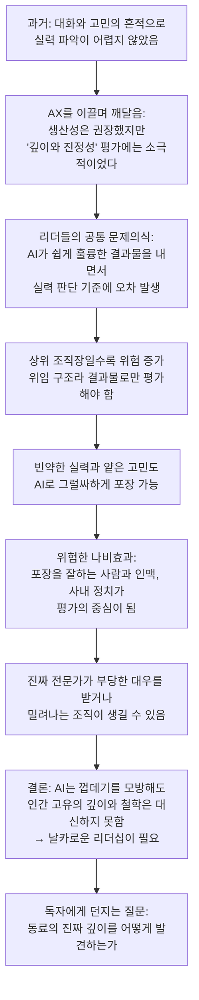
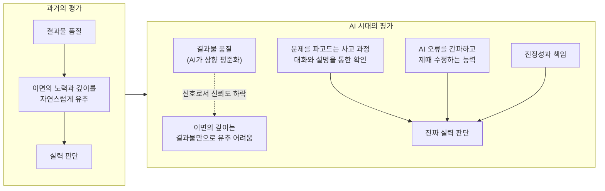
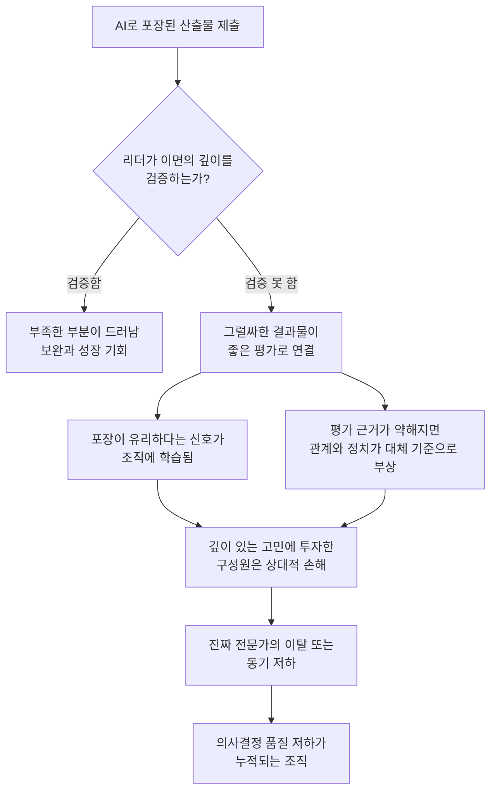

## 크래프톤 임경영 VP의 링크드인 인사이트 상세 해설

- 작성 기준일: 2026년 10월 6일
- 이 문서는 사용자가 제공한 공유글 본문과, 웹에서 확인한 공개 기사·연구 보도를 근거로 작성했습니다. 근거가 확인되지 않는 내용은 단정하지 않고 "확인되지 않음"으로 구분했습니다.

> 
> 과거에는 동료를 평가할 때 '실력'을 가늠하는 것이 그리 복잡한 문제가 아니었습니다. 대화를 나누어 보고, 그 사람이 문제를 해결해 나가는 치열한 고민의 흔적을 따라가다 보면 그 됨됨이와 진짜 실력을 파악하는 것은 결코 어려운 일이 아니었으니까요.
> 
> 하지만 최근 AX(AI Transformation)를 이끌며 뼈아프게 직면한 새로운 화두가 있습니다. AI로 생산성을 높이는 일은 적극 권장해 왔지만, 정작 AI가 가려버린 '업무의 깊이'와 '진정성'을 어떻게 평가할 것인가에 대해서는 우리가 너무 소극적이지 않았나 하는 반성입니다.
> 
> 최근 여러 리더들과 대화를 나누며 공통적으로 튀어나온 묵직한 물음표가 있습니다.
> "AI가 너무 쉽게 훌륭한 결과물을 내놓으면서, 진짜 실력을 판가름하는 기준에 심각한 오차가 생기고 있다"는 것입니다.
> 
> 이 오차는 특히 상위 조직장으로 갈수록 훨씬 더 큰 위험을 초래합니다.
> 리더는 모든 실무를 직접 챙길 수 없기에 필연적으로 업무를 위임하고 그 결과물을 통해 평가해야 합니다. 과거에는 결과물만 봐도 그 이면의 땀과 깊이를 유추할 수 있었지만, > 이제는 빈약한 실력과 얕은 고민마저도 AI를 통해 너무나 '그럴싸하게' 포장될 수 있는 시대가 되었습니다.
> 이러한 착시 현상을 경계하지 않으면 기업에는 매우 위험한 나비효과가 일어날 수 있습니다.
> 
> 부족한 실력은 AI의 화려한 문장과 산출물 뒤로 교묘하게 감추고, 결국 보이지 않는 인맥과 사내 정치가 평가의 주가 되는 현상. 이로 인해 묵묵히 본질적인 고민을 거듭하는 진짜 전문가들이 오히려 부당한 대우를 받거나 밀려나는 끔찍한 조직들이 생겨날 것입니다.
> 
> AI는 업무의 껍데기를 완벽하게 모방할 수 있지만, 문제를 파고드는 인간 고유의 깊이와 철학까지 대신해 주지는 않습니다.
> 
> 화려하게 포장된 산출물 이면에 숨겨진 '진짜 깊이와 치열함'을 어떻게 꿰뚫어 볼 것인가. AI가 모든 것을 상향 평준화시키는 것처럼 보이는 지금이야말로, 구성원의 진짜 역량을 알아보고 평가하는 '현명하고 날카로운 리더십'이 그 어느 때보다 절실한 시점입니다.
> 
> 여러분은 AI가 만들어낸 그럴싸한 포장지 속에서, 동료의 '진짜 깊이'를 어떻게 발견하고 계신가요?
> 
> https://www.facebook.com/share/p/1H3eLirHDP/
> 

---

## 1. 이 문서를 읽기 전에: 자료의 범위와 한계

본문을 해설하기에 앞서, 어떤 자료를 바탕으로 했는지부터 밝혀 둡니다.

- **공유글 본문**: 사용자가 대화창에 붙여 넣은 텍스트입니다. 공유된 페이스북 링크는 사이트가 자동 접근을 허용하지 않아 열어 볼 수 없었습니다. 따라서 원문의 게시 일자, 반응, 댓글은 확인하지 못했고, 본문은 사용자가 붙여 넣은 그대로를 기준으로 해설합니다.
- **인물과 회사 배경**: 2026년 6월 18일 열린 넥슨 개발자 컨퍼런스(NDC 26)의 대담 세션을 다룬 여러 언론 보도(디지털데일리, 딜사이트 등)와, 크래프톤 AI 리더십을 다룬 허프포스트코리아 보도를 확인했습니다.
- **외부 연구 근거**: 공유글이 말하는 현상과 맞닿아 있는 연구로, 스탠퍼드 소셜미디어 랩과 베터업 랩스(BetterUp Labs)가 하버드 비즈니스 리뷰(HBR)에 발표한 'workslop(워크슬롭)' 연구의 보도 내용을 확인했습니다.

한 가지 분명히 해 둘 점이 있습니다. 공유글은 칼럼 형식의 문제 제기이며, 통계나 실험 결과를 제시하는 글이 아닙니다. 그래서 이 문서의 해설은 "글이 무엇을 주장하는가"를 정확히 풀어 쓰는 데 중심을 두고, 그 주장을 뒷받침하거나 보완하는 공개 자료를 별도로 덧붙이는 구조로 되어 있습니다.

---

## 2. 한눈에 보는 핵심

공유글의 핵심은 한 문장으로 줄일 수 있습니다.

**AI가 결과물의 겉모양을 누구나 그럴듯하게 만들어 주는 시대에는, 결과물만 보고 사람의 실력과 진정성을 판단하던 과거의 평가 방식이 더 이상 믿을 만하지 않다.**

글쓴이는 이 문제를 세 단계로 풀어 갑니다. 먼저 과거에는 대화와 고민의 흔적만 따라가도 실력을 파악하기 어렵지 않았다고 말합니다. 그다음 AI가 산출물의 품질을 상향 평준화하면서 이 판단 기준에 오차가 생겼고, 특히 위임을 통해 결과물로만 구성원을 평가해야 하는 상위 조직장일수록 그 위험이 커진다고 지적합니다. 마지막으로 이 착시를 방치하면 실력 없이 포장만 잘하는 사람이 유리해지고, 묵묵히 본질을 파고드는 전문가가 불이익을 받는 조직이 생길 수 있다고 경고합니다.

공유자(사용자께서 소개한 코치의 말씀)는 여기에 두 가지를 덧붙입니다. 하나는 평가 대상에 "AI가 잘못한 부분을 제때 간파하고 고치는 AI 에이전트 관리 능력"도 포함되어야 한다는 점이고, 다른 하나는 포장된 성과가 누적될수록 조직에 독이 쌓이며 그 독이 AI 이전보다 훨씬 교묘해졌다는 점입니다.

---

## 3. 글쓴이와 배경: 왜 이 글에 무게가 실리는가

### 3.1 글쓴이는 누구인가

글쓴이인 임경영 VP는 크래프톤의 'AI 트랜스포메이션 본부'를 총괄하고 있습니다. 허프포스트코리아 보도에 따르면 그는 지난해 12월까지 롯데온의 CTO를 맡았다가 크래프톤에 합류했으며, 크래프톤의 AI 리더십을 구성하는 핵심 인물 세 명(설창환 스튜디오 서포트 본부장, 임경영 AI 트랜스포메이션 본부 총괄, 이강욱 최고인공지능책임자) 가운데 한 명으로 소개되었습니다.

### 3.2 크래프톤의 AX는 어디까지 와 있는가

2026년 6월 18일 NDC 26에서 임경영 VP는 강덕원 넥슨코리아 AI본부장과 대담을 가졌고, 진행은 김상균 경희대 교수가 맡았습니다. 주제는 "넥슨과 크래프톤의 AX 여정, 무엇을 시도하고 무엇을 포기했나"였으며, 성공 사례보다 시행착오에 초점을 맞춘 자리였습니다. 디지털데일리 보도로 확인되는 크래프톤 쪽 내용은 다음과 같습니다.

- 크래프톤은 모든 업무에서 AI를 가장 먼저 써 보는 것을 목표로 하는 'AI 퍼스트'를 지향하며, 한꺼번에 전부를 AI로 바꾸기보다 작은 단위 업무부터 전환해 효과를 측정하고 있다고 임 VP가 설명했습니다.
- 같은 보도에서 임 VP는 같은 해 2월 사내 조사에서 직원의 97.6%가 AI 도구를 쓰고 있다고 답했다고 밝혔고, 최상위 조직장의 의지 표명이 도구 도입과 현업 활용 확산에 큰 영향을 주었다고 말했습니다.
- 인프라 측면에서는 '크래프톤 플레이그라운드'라는 공통 배포 파이프라인과 데이터 파운데이션을 만들어, 각 조직이 AI로 만든 자동화 결과물을 표준화하고 자산화하도록 했습니다.
- 시행착오로는 엔터프라이즈급 AI 도구를 섣불리 도입했다가 회사 고유의 특성에 맞게 세부 조정하기 어려웠던 경험을 꼽았고, AI로 만든 도구라도 실제 사용자가 늘지 않으면 실패로 봐야 한다는 취지로 말했습니다.
- 현업 지원을 위해 각 조직에 파견되어 기술·인프라·방법론을 돕는 별도 인력을 운영하며, 결과물을 모으는 사내 포털을 만들고 마켓플레이스 형태로의 확장도 검토하고 있습니다.

이 대담의 결론부에서 기자는 AX의 경쟁력이 AI를 얼마나 빨리 많이 쓰느냐보다, 어떤 업무와 판단을 사람에게 남길지 정하는 일에 달려 있다는 방향으로 정리했습니다. 이는 이번에 해설하는 공유글의 문제의식, 즉 "AI가 대신하는 영역과 사람이 책임져야 하는 영역을 구분해서 평가해야 한다"는 생각과 같은 줄기에 있습니다. 다만 두 자료가 같은 사람의 생각이라는 점만 확인될 뿐, 공유글이 NDC 발언을 직접 인용하거나 그 연장선에서 쓰였다는 근거는 없으므로 연결은 참고 수준으로 읽어 주시기 바랍니다.

### 3.3 확인된 사실 사이의 작은 불일치

AI 퍼스트 선언 시점이 보도마다 조금 다릅니다. 허프포스트코리아는 2025년 10월로, 디지털데일리의 NDC 26 기사는 2025년 11월로 적었습니다. 어느 쪽이 정확한지는 이번 조사에서 확정하지 못했으므로, 이 문서에서는 "2025년 가을 무렵"으로만 이해하시면 됩니다.

---

## 4. 글의 논리 구조

공유글은 문제 제기에서 시작해 위험 경고를 거쳐 질문으로 끝나는 구조입니다. 흐름을 도식으로 정리하면 다음과 같습니다.

이 구조에서 중요한 것은 D 단계입니다. 글쓴이는 문제를 "구성원 개개인의 윤리 문제"로 두지 않고, "위임과 결과물 중심 평가라는 리더십 구조의 문제"로 설명합니다. 그래서 해결책을 구성원에게 요구하는 대신 리더의 평가 능력에서 찾습니다.

---

## 5. 본문 단락별 상세 해설

### 5.1 "과거에는 실력을 가늠하는 것이 복잡하지 않았다"

글의 첫 단락은 기준선을 세웁니다. 과거에는 동료와 대화를 나누고, 그 사람이 문제를 풀어 가는 과정의 고민 흔적을 따라가면 됨됨이와 실력이 드러났다는 것입니다.

여기서 핵심은 **결과물과 과정이 한 묶음으로 보였다**는 점입니다. 보고서나 기획안을 만들려면 사람이 직접 자료를 찾고, 구조를 짜고, 문장을 다듬어야 했습니다. 그래서 결과물의 짜임새, 논리의 빈틈, 문장의 밀도 같은 것이 곧 그 사람의 사고 수준을 비추는 거울 역할을 했습니다. 평가자는 결과물만 보고도 그 뒤의 노력과 이해 수준을 어느 정도 거꾸로 추정할 수 있었습니다.

### 5.2 "AI가 가려버린 업무의 깊이와 진정성"

두 번째 단락에서 글쓴이는 자기반성의 형식으로 문제를 꺼냅니다. AI로 생산성을 높이는 일은 적극 권장해 왔지만, AI 때문에 보이지 않게 된 업무의 깊이와 진정성을 평가하는 일에는 소극적이었다는 고백입니다.

이 대목이 설득력을 갖는 이유는 문제 제기가 "AI 도입을 멈추자"가 아니라 "도입은 계속하되 평가 체계가 따라가지 못했다"는 방향이라는 점입니다. 크래프톤이 AI 도구 활용을 사실상 전사 표준으로 만든 조직이라는 배경(3.2절)을 감안하면, 도입을 앞장서 이끈 당사자가 평가의 빈 곳을 직접 짚었다는 점에서 무게가 실립니다.

### 5.3 "리더들의 공통된 물음표"

세 번째 단락은 여러 리더와의 대화에서 공통으로 나온 물음을 전합니다. AI가 너무 쉽게 훌륭한 결과물을 내놓다 보니, 진짜 실력을 판가름하는 기준에 심각한 오차가 생기고 있다는 것입니다.

이 단락은 글쓴이 한 사람의 의견이 아니라 현장 리더들 사이의 공통 인식으로 문제를 제시합니다. 다만 몇 명의 리더와 어떤 형식으로 나눈 대화인지는 본문에 나오지 않으므로, 이것을 통계적 조사 결과로 읽어서는 안 되고 현장에서 모은 정성적 관찰로 이해하는 것이 정확합니다.

### 5.4 "상위 조직장일수록 더 큰 위험"

네 번째 단락은 글에서 가장 날카로운 부분입니다. 논리는 이렇게 전개됩니다.

1. 리더는 모든 실무를 직접 챙길 수 없다.
2. 그래서 업무를 위임하고, 올라온 결과물을 보고 평가할 수밖에 없다.
3. 과거에는 결과물만 봐도 그 이면의 땀과 깊이를 유추할 수 있었다.
4. 이제는 빈약한 실력과 얕은 고민조차 AI로 그럴듯하게 포장될 수 있다.
5. 따라서 결과물에서 이면을 유추하는 방식이 더는 안전하지 않다.

조직의 위계가 높아질수록 평가자와 실무 사이의 거리가 멀어지고, 그만큼 "결과물이라는 요약된 신호"에 더 많이 의존하게 됩니다. 그 신호가 왜곡되기 쉬워졌다면, 의존도가 높은 상위 리더일수록 더 크게 오판할 수 있다는 것이 글쓴이의 논리입니다.

### 5.5 "위험한 나비효과"

다섯 번째 단락은 착시가 방치될 때의 시나리오를 그립니다. 부족한 실력은 AI의 화려한 문장과 산출물 뒤로 감춰지고, 결국 보이지 않는 인맥과 사내 정치가 평가의 주가 되며, 그 결과 묵묵히 본질을 고민하는 전문가들이 부당하게 대우받거나 밀려나는 조직이 생길 수 있다는 것입니다.

이 부분은 미래에 대한 경고이며 현재 일어난 사실의 보고가 아닙니다. 글쓴이도 "생겨날 것입니다"라는 가능성의 어조로 쓰고 있습니다. 여기서 논리의 연결 고리를 풀어 보면 이렇습니다. 결과물이 더 이상 실력을 구별해 주지 못하면, 평가자는 결과물 말고 다른 단서에 기대게 됩니다. 그 다른 단서가 관계의 친밀도나 정치적 거리라면, 실력과 무관한 요인이 평가를 좌우하게 됩니다. 글쓴이는 이 연쇄를 가장 우려합니다.

### 5.6 "AI는 껍데기를 모방할 뿐, 깊이와 철학은 대신하지 못한다"

여섯 번째 단락은 글의 결론으로 넘어가는 다리입니다. AI는 업무의 겉모양을 완벽하게 흉내 낼 수 있지만, 문제를 파고드는 인간 고유의 깊이와 철학까지 대신하지는 못한다는 선언입니다.

이 문장은 두 가지로 읽을 수 있습니다. 하나는 평가자가 찾아야 할 대상이 "산출물의 품질"에서 "문제를 대하는 사고의 깊이"로 옮겨 가야 한다는 뜻입니다. 다른 하나는 사람이 책임지고 남겨야 할 몫이 판단과 철학이라는 뜻입니다. 앞서 본 NDC 대담에서 강덕원 본부장이 "AI가 무엇을 대신할 수 있는지 찾는 단계를 넘어 사람이 반드시 무엇을 해야 하는지 정해야 한다"고 말한 것과 같은 방향의 문제의식입니다.

### 5.7 마무리 질문

글은 "동료의 진짜 깊이를 어떻게 발견하고 계신가요?"라는 질문으로 끝납니다. 글쓴이는 구체적인 평가 기법이나 체크리스트를 제시하지 않았습니다. 즉 이 글은 해법을 제시하는 글이라기보다 논의를 시작하게 만드는 문제 제기의 글입니다. 이 점은 해설을 읽을 때 기대치를 정확히 맞추는 데 중요합니다.

---

## 6. 공유자 코멘트의 세 가지 확장 포인트

사용자께서 글 앞에 붙이신 코멘트는 원문의 문제의식에 세 가지를 더합니다.

### 6.1 평가 기준을 새로 잡아야 한다는 필요

코멘트는 인간이 하던 일을 AI가 해내기 때문에 인간에 대한 평가 기준을 새롭게 정립해야 한다고 말합니다. 이는 원문의 "기준에 오차가 생기고 있다"를 한 걸음 더 밀어, 오차를 감시하는 수준을 넘어 기준 자체를 재설계해야 한다는 주장입니다.

### 6.2 AI 에이전트 관리 능력이라는 새 평가 축

코멘트는 진짜 실력과 진정성뿐 아니라, AI가 잘못한 부분을 늦지 않게 적절히 간파하고 수정하는 능력도 중요하다고 짚습니다. 이것은 원문에는 직접 나오지 않는, 공유자가 새로 얹은 관점입니다.

이 관점의 의미는 이렇게 풀 수 있습니다. 과거의 실력은 "직접 만들어 내는 능력"이 중심이었다면, AI와 함께 일하는 환경에서는 "AI가 만든 것을 검증하고 바로잡는 능력"이 결과의 품질을 갈라놓는 변수가 됩니다. 같은 AI를 쓰더라도 오류를 알아보고 고치는 사람과 그대로 전달하는 사람의 결과물은 겉으로 비슷해도 신뢰도가 다릅니다.

### 6.3 누적되는 독, 그리고 더 교묘해진 독

코멘트의 마지막 주장은 번지르르하게 포장된 성과가 쌓일수록 조직에 치명적인 독이 된다는 것입니다. 그리고 그런 독은 AI 이전에도 있었지만 이제 훨씬 교묘하고 치명적으로 진화했다고 평가합니다. 과거에도 겉치레 보고서나 실속 없는 문서는 있었지만, 그것을 만드는 데에는 어느 정도의 노력이 필요했고 그 노력 자체가 일종의 걸림돌이자 신호였습니다. AI는 그 비용을 거의 0에 가깝게 낮췄고, 그래서 포장의 양과 정교함이 함께 커졌다는 논리입니다.

---

## 7. 공개 연구가 보여 주는 현상: 워크슬롭(workslop)

공유글의 문제의식은 막연한 우려에 그치지 않고, 실제 연구에서도 비슷한 현상이 이름을 얻고 측정되었습니다. 2025년 9월 하버드 비즈니스 리뷰에 소개된 스탠퍼드 소셜미디어 랩과 베터업 랩스의 연구입니다.

### 7.1 워크슬롭의 정의

연구진은 워크슬롭을 "좋은 업무처럼 보이지만 과제를 의미 있게 진전시킬 실질이 부족한 AI 생성 업무 콘텐츠"로 정의했습니다. 테크크런치 보도에 따르면 이런 결과물은 도움이 되지 않거나, 불완전하거나, 핵심 맥락이 빠져 있을 수 있습니다. 그리고 연구진이 가장 해롭다고 본 효과는 일의 부담이 아래쪽으로 넘어간다는 점입니다. 결과물을 받은 사람이 해석하고, 고치고, 다시 해야 하기 때문입니다.

이 정의는 공유글이 말하는 "그럴싸한 포장지 속에 얕은 고민이 숨어 있는 상태"와 거의 같은 현상을 가리킵니다.

### 7.2 조사에서 확인된 수치

여러 매체가 보도한 조사 결과를 종합하면 다음과 같습니다.

| 항목 | 내용 |
| --- | --- |
| 조사 대상 | 미국 전일제 직장인 1,150명 (진행 중인 조사) |
| 최근 한 달 내 워크슬롭을 받아 봤다는 응답 | 40% |
| 받은 업무 콘텐츠 중 워크슬롭이라고 추정한 비율 | 평균 15.4% |
| 한 건을 처리하는 데 쓴 시간 | 건당 약 2시간 |
| 추정 비용 | 직원 1인당 월 약 186달러의 생산성 손실 |
| 워크슬롭을 보낸 동료에 대한 인식 | 약 절반이 덜 창의적이고 덜 유능하며 덜 믿을 만하다고 인식, 42%는 덜 신뢰한다고 응답 |
| 흐름의 방향 | 주로 동료 간이지만, 응답자의 18%는 관리자에게 보낸 적이 있고 16%는 상사에게서 받았다고 응답 |

### 7.3 이 연구가 공유글을 뒷받침하는 부분과 그렇지 않은 부분

연구는 두 가지 면에서 공유글과 연결됩니다. 첫째, 겉보기에 훌륭한 AI 결과물이 실질이 없을 수 있다는 현상이 실제 설문에서 폭넓게 보고되었습니다. 둘째, 워크슬롭을 보낸 사람에 대한 신뢰와 평판이 낮아진다는 결과는, 결과물의 질이 사람에 대한 인식에 영향을 준다는 점을 보여 줍니다.

그러나 한계도 분명히 해야 합니다. 이 연구는 직장인이 느끼는 시간 손실과 동료에 대한 인식을 조사한 것이며, 공유글이 우려하는 "인사 평가가 왜곡되어 진짜 전문가가 밀려난다"는 결과를 직접 측정한 연구가 아닙니다. 또한 수치는 응답자의 자기 보고와 추정에 기반합니다. 따라서 이 연구는 공유글의 문제의식이 현실의 현상과 맞닿아 있음을 보여 주는 정황 근거이지, 글의 모든 주장을 입증하는 증거가 아닙니다.

한편 연구진은 해법으로 리더가 목적과 의도가 분명한 AI 활용의 모범을 보이고, 팀에 명확한 사용 규범과 가이드라인을 세우라고 권고했습니다. 또 AI가 만든 결과물과 사람이 만든 결과물에 같은 기준을 적용하라는 제안도 보도되었습니다.

---

## 8. 평가 패러다임은 어떻게 달라지는가

공유글과 코멘트가 말하는 변화를 비교하면 다음과 같습니다. 이 표는 글의 주장을 이해하기 쉽게 재구성한 것이며, 특정 기관이 발표한 평가 모델이 아닙니다.

이 도식에서 볼 수 있듯 변화의 핵심은 결과물이라는 신호의 신뢰도가 떨어졌다는 것이고, 그 빈자리를 사고 과정의 확인, AI 검증 능력, 진정성과 책임이 채워야 한다는 것이 글의 방향입니다. 다만 이 세 가지를 구체적으로 어떤 절차로 측정할지는 글에 나와 있지 않습니다.

---

## 9. 조직에 독이 쌓이는 과정

공유자 코멘트의 "독이 누적된다"는 표현을 단계로 풀어 보면 다음과 같습니다. 이 도식 역시 글의 논리를 시각화한 것입니다.

도식의 분기점인 "리더가 이면의 깊이를 검증하는가"가 곧 글쓴이가 말하는 "현명하고 날카로운 리더십"이 필요한 지점입니다.

---

## 10. 이 글을 읽을 때 정확히 구분해야 할 것들

### 10.1 글이 말하는 것

- AI가 결과물의 겉모양을 상향 평준화해, 결과물만으로 실력을 판단하기 어려워졌다.
- 위임 구조에 있는 상위 리더일수록 이 오판의 위험이 크다.
- 방치하면 실력과 무관한 요인이 평가를 좌우하는 조직이 생길 수 있다.
- AI는 겉모양을 모방할 수 있어도 인간 고유의 깊이와 철학은 대신하지 못한다.

### 10.2 글이 말하지 않는 것

- 구체적인 평가 방법이나 도구, 체크리스트는 제시하지 않았습니다.
- 크래프톤 내부에서 이런 평가 오류가 실제로 발생했다는 사례나 수치는 없습니다.
- AI 사용을 제한하자는 주장이 아닙니다. 오히려 생산성 향상은 계속 권장해 왔다고 밝히고 있습니다.

### 10.3 이번 조사에서 확인되지 않은 것

- 공유된 페이스북 게시물의 원문 열람 및 게시 일자
- 글쓴이가 언급한 리더 대화의 규모와 방식
- 크래프톤이 이 문제에 대응해 도입한 별도의 평가 제도의 존재 여부 (NDC 26 보도에서는 이와 관련한 내용이 확인되지 않았습니다)

---

## 11. 마무리: 글의 마지막 질문을 대하는 방법

글은 "AI가 만들어낸 그럴싸한 포장지 속에서 동료의 진짜 깊이를 어떻게 발견하는가"라고 묻고 끝납니다. 이 질문에 대한 정답은 글에도, 이번에 확인한 공개 자료에도 정해져 있지 않습니다.

다만 확인된 자료들이 공통으로 가리키는 방향은 있습니다. 스탠퍼드·베터업 연구는 AI 결과물과 사람의 결과물에 같은 기준을 적용하고 사용 규범을 분명히 하라고 권고했고, NDC 26 대담에서 크래프톤과 넥슨은 AI 활용의 속도보다 어떤 업무와 판단을 사람에게 남길지 정하는 일을 강조했습니다. 공유글은 거기에 더해, 평가하는 리더 자신이 결과물 너머의 사고 과정을 들여다보는 능력을 갖춰야 한다고 말합니다. 이 세 가지는 서로 다른 자료에서 나왔지만 "결과물만 보지 말고 결과물이 만들어진 방식과 책임의 소재를 보라"는 점에서 만납니다.

요약하면, 이 글의 가치는 해법의 제시보다 **문제의 이름을 정확히 붙였다는 데** 있습니다. AX가 도구 도입의 단계를 지나 조직 운영과 평가의 단계로 넘어가고 있다는 신호로 읽는 것이 가장 정확한 독해입니다.

---

## 참고한 출처

- 디지털데일리, "AI 도입보다 안착이 과제…넥슨·크래프톤이 찾은 AX 성공 조건" (2026-06-18) — https://www.ddaily.co.kr/page/view/2026061815013124516
- 딜사이트, "넥슨·크래프톤의 AX 실험…속도보다 중요한 건 '실용성'" — https://dealsite.co.kr/articles/163859
- 허프포스트코리아, 크래프톤 AI 리더십 강화 관련 보도 — https://www.huffingtonpost.kr/article/242747
- Axios, "AI 'workslop' sabotages productivity, study finds" (2025-09-24) — https://www.axios.com/2025/09/24/ai-workslop-workplace-efficiency-study
- TechCrunch, "Beware co-workers who produce AI-generated 'workslop'" — https://techcrunch.com/?p=3051235
- The Decoder, "AI-generated 'workslop' is costing companies millions and hurting team morale, study finds" — https://the-decoder.com/ai-generated-workslop-is-costing-companies-millions-and-hurting-team-morale-study-finds/
- Quartz, "'You've been workslopped': Study warns AI is wasting workers' time" — https://qz.com/workslop-ai-stanford-study-office-headache-wasting-workers-time
- The Register, "Many employees are using AI to create 'workslop,' Stanford study says" (2025-09-26) — https://www.theregister.com/2025/09/26/ai_workslop_productivity/
- UNLEASH, 스탠퍼드 소셜미디어 랩 제프 핸콕 인터뷰 보도 — https://www.unleash.ai/artificial-intelligence/40-of-ai-generated-content-is-workslop-and-it-drives-over-9-million-in-lost-productivity-annually-finds-betterup
- 공유글 본문: 사용자 제공 텍스트 (페이스북 원문 링크: https://www.facebook.com/share/p/1H3eLirHDP/ — 자동 접근 불가로 직접 확인하지 못함)
