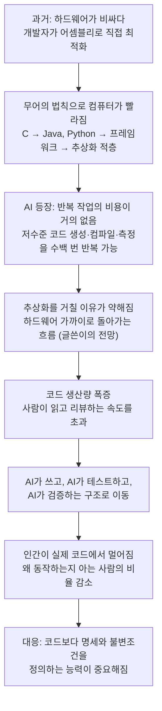
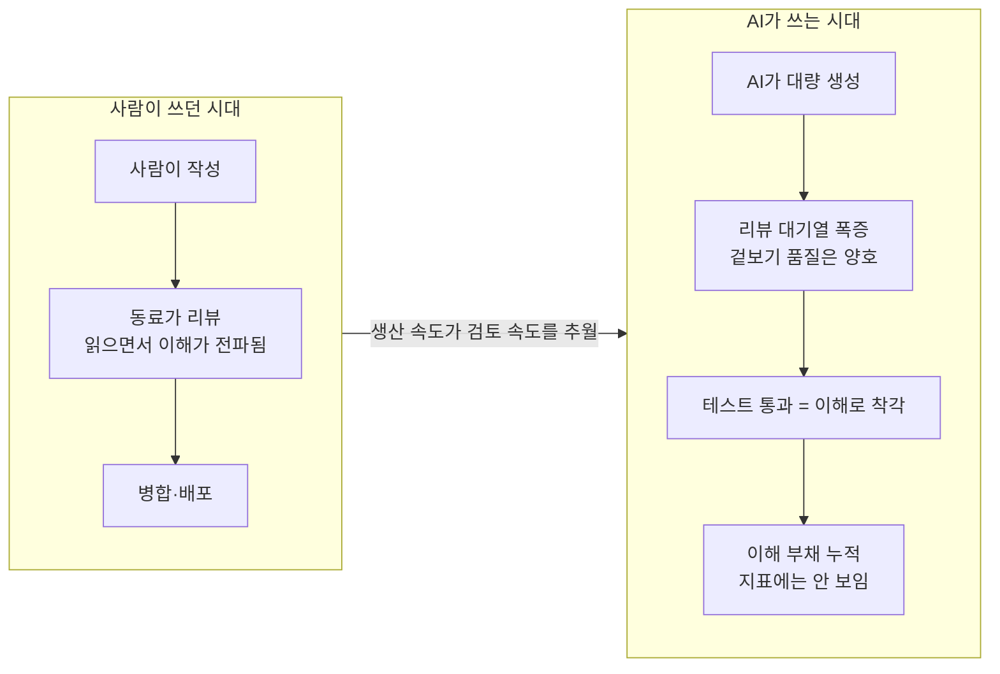
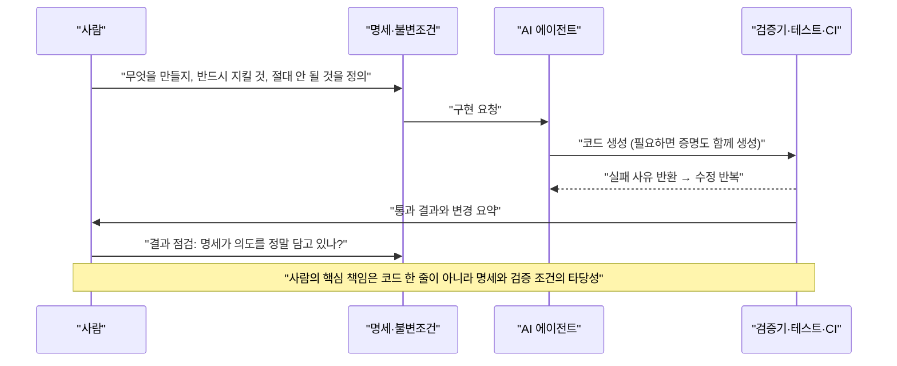

- 작성 기준일: 2026년 10월 6일
- 분석 대상: Threads에 올라온 장문의 글 한 편 (["AI가 위험하다고 느끼는 진짜이유"](https://www.threads.com/share/BAjfwPH2OP/))
- 참고: 해당 Threads 링크는 자동 접근이 차단되어 열람하지 못했습니다. 그래서 요청과 함께 전달된 본문 전체를 기준으로 분석했고, 글에 담긴 주장 하나하나를 공개된 자료로 다시 확인했습니다. 확인된 사실, 공개 자료로 뒷받침되는 해석, 아직 전망에 머무는 부분을 구분해서 적었습니다.

> 
> https://www.threads.com/share/BAjfwPH2OP/
> 
> AI가 위험하다고 느끼는 진짜이유.
> 
> 요즘 AI가 코딩하는 걸 보면서 좀 무서운 생각이 든다. 보통 AI가 위험하다고 하면 개발자 일자리가 없어질 거라는 얘기를 많이 하는데, 나는 그것보다 다른 게 더 위험하다고 생각한다. AI가 만든 코드를 인간이 더 이상 이해하지 못하는 순간이 오는 것이다.
> 
> 예전에는 컴퓨터가 비쌌고, 개발자가 직접 성능을 쥐어짜야 했다. RollerCoaster Tycoon 같은 게임을 거의 어셈블리로 만들었다는 이야기가 괜히 전설처럼 남은 게 아니다. 그런데 Moore's Law 덕분에 컴퓨터가 계속 빨라지면서 상황이 바뀌었다. 굳이 그렇게까지 최적화하지 않아도 됐고, CPU나 메모리를 조금 더 쓰더라도 개발자가 편한 게 더 중요해졌다. 그래서 C보다 Java나 Python 같은 언어를 쓰고, 그 위에 프레임워크를 올리고, 또 그 위에 수많은 abstraction을 쌓았다. 어차피 컴퓨터는 계속 빨라졌으니까.
> 
> 그런데 AI가 등장하면서 이 공식이 다시 깨지고 있다. AI한테는 사람이 귀찮아하는 일이 별로 안 귀찮다. 수천 줄의 저수준 코드를 만들고, 컴파일하고, 돌려보고, 느리면 다시 고치고, 이 과정을 수백 번 반복하는 것도 가능하다. 그렇다면 굳이 인간 개발자의 편의를 위해 만들어놓은 abstraction을 계속 거쳐야 할 이유가 있을까? AI가 직접 하드웨어 가까이 내려가서 최적화하면 된다. 어떻게 보면 다시 Back to the Metal의 시대가 오는 셈이다.
> 
> 문제는 여기서부터다. AI가 하루에 수십만 줄의 코드를 만들어내기 시작하면 그걸 누가 읽을까? 사람이 그 속도를 따라가면서 리뷰하는 건 현실적으로 불가능하다. 결국 AI가 코드를 만들고, 다른 AI가 테스트하고, 또 다른 AI가 보안 취약점을 찾고, 컴파일러나 verification tool이 검증하는 구조로 갈 가능성이 높다. 그렇게 되면 인간은 점점 실제 코드에서 멀어진다.
> 
> 나는 이 부분이 좀 무섭다. 세상을 움직이는 코드는 엄청난 속도로 늘어나는데, 정작 그 코드가 왜 그렇게 작동하는지 완전히 이해하는 사람의 비율은 계속 줄어들 수 있기 때문이다. 특히 AI가 하드웨어에 가까운 저수준 코드를 직접 만들기 시작하면 memory leak, pointer 문제, race condition 같은 작은 실수가 심각한 장애나 보안 문제로 이어질 수도 있다. 그런데 코드의 양과 복잡도가 인간이 감당할 수 있는 수준을 넘어버리면 사람이 일일이 확인하는 것 자체가 불가능해진다.
> 
> 그래서 앞으로 개발자의 역할도 많이 달라질 것 같다. 코드를 얼마나 잘 짜느냐보다 무엇을 만들어야 하는지 정확하게 설명하고, 어떤 조건을 반드시 만족해야 하는지, 그리고 무엇이 절대로 일어나면 안 되는지를 정의하는 능력이 더 중요해질 것이다.
> 
> 코드 자체보다 Spec을 만드는 사람이 중요해지는 것이다. 어쩌면 미래에는 Python이나 Rust보다 인간의 의도를 정확하게 표현한 명세가 더 중요한 프로그래밍 언어가 될 수도 있다.
> 
> 그리고 여기서 가장 아이러니한 부분이 있다. AI가 코딩을 못해서 위험한 게 아니라, 오히려 코딩을 너무 잘하게 되는 게 위험할 수도 있다는 것이다. AI가 인간보다 훨씬 많은 코드를 만들고, 다른 AI가 그 코드를 테스트하고, 또 다른 AI가 수정하고, 다시 AI가 배포하는 세상이 온다면 어느 순간 이런 질문을 하게 될 수도 있다.
> 
> “근데 이게 왜 돌아가는지 정확히 아는 사람 있어?”
> 
> 그 질문에 아무도 대답할 수 없다면, 나는 AI의 진짜 위험은 거기서부터 시작된다고 생각한다.
> 

---

## 1. 이 글이 말하려는 것: 한 문장 요약

이 글의 핵심은 "AI가 개발자의 일자리를 빼앗는 것보다 더 무서운 일은, AI가 만든 코드를 인간이 더 이상 이해하지 못하게 되는 순간"이라는 주장입니다. 글쓴이는 이 주장을 네 단계로 쌓아 올립니다.

첫째, 과거에는 하드웨어가 비쌌기 때문에 개발자가 어셈블리 수준까지 내려가 성능을 쥐어짰습니다. 둘째, 무어의 법칙 덕분에 컴퓨터가 빨라지자 개발자의 편의를 위한 추상화(고수준 언어, 프레임워크)가 계속 쌓였습니다. 셋째, AI는 사람이 귀찮아하는 반복 작업을 개의치 않으므로 이 추상화를 건너뛰고 하드웨어 가까이에서 직접 최적화할 수 있고, 그 결과 코드의 양은 폭증하는데 사람이 읽을 수 있는 비율은 줄어듭니다. 넷째, 그래서 앞으로 개발자의 핵심 역량은 코드를 잘 짜는 능력보다 "무엇을 만들고, 무엇을 반드시 만족해야 하며, 무엇이 절대 일어나면 안 되는지"를 정확히 정의하는 명세(Spec) 능력이 된다는 것입니다.

마지막 문장이 이 글의 정서를 압축합니다. 모든 것을 AI가 만들고, 테스트하고, 고치고, 배포하는 세상에서 "이게 왜 돌아가는지 정확히 아는 사람 있어?"라는 질문에 아무도 답하지 못한다면, 그때부터가 진짜 위험이라는 것입니다.

글의 논리 구조를 도식으로 보면 다음과 같습니다.

---

## 2. 글의 주장을 하나씩 검증하기

### 2-1. "RollerCoaster Tycoon은 거의 어셈블리로 만들었다"는 이야기: 사실입니다

글쓴이가 전설처럼 언급한 이 이야기는 사실로 확인됩니다. 위키백과는 크리스 소여(Chris Sawyer)가 이 게임의 코드 99%를 x86 어셈블리 언어(Microsoft Macro Assembler)로 작성했고 나머지 1%는 C였다고 기록하고 있습니다. 게임 데이터베이스 사이트 Giant Bomb도 소여가 자신의 개인 웹사이트에서 "99% x86 어셈블러/머신코드로 작성되었고, 윈도우와 DirectX를 연결하는 데 소량의 C 코드를 썼다"고 밝혔다고 전합니다. 이 게임은 1999년에 출시되었고, 소여가 기획과 프로그래밍을 사실상 혼자 맡았습니다(그래픽은 사이먼 포스터, 음악은 앨리스터 브림블).

PCGamesN의 회고 기사에 따르면 소여는 코딩용으로 빠른 PC, 테스트용으로 느린 PC 두 대를 갖춰 놓고 작업했고, 성능을 최우선으로 삼았습니다. 이 게임은 1999년 PC 게임 중 판매 1위를 기록했습니다. 소여는 이후 『Chris Sawyer's Locomotion』(2004)도 거의 전적으로 어셈블리로 만들었습니다. 훗날 커뮤니티가 이 어셈블리를 역분석해 C++로 재구현한 오픈소스 프로젝트 OpenRCT2가 있다는 점도 흥미롭습니다.

이 사례가 글에서 하는 역할은 "하드웨어가 귀하던 시절에는 사람이 기계 가까이까지 내려가 직접 짜는 것이 당연했다"는 출발점을 세우는 것입니다. 이 부분에는 과장이 없습니다.

### 2-2. "무어의 법칙 덕분에 추상화가 쌓였다": 큰 흐름은 맞지만 단서가 필요합니다

글쓴이는 컴퓨터가 계속 빨라졌기 때문에 개발자가 CPU와 메모리를 더 쓰더라도 편한 쪽을 택했다고 말합니다. 이 인과 관계는 업계에서 오래 지적되어 온 현상과 맞닿아 있습니다. 컴퓨터 학회지 Communications of the ACM에 실린 한 글은 "무어의 법칙이 비효율적인 소프트웨어를 가려줄 것이라는 기대가 부풀린 '블로트웨어' 현상"을 오래 지켜본 소회를 밝히고, 법칙이 끝나가면 소프트웨어 실무자는 더 효율적인 코드에 집중해야 한다고 말합니다. 소프트웨어가 하드웨어 향상을 잡아먹는다는 취지의 "비르트의 법칙(Wirth's law)"이라는 오래된 격언도 있습니다.

다만 정확히 하려면 두 가지를 덧붙여야 합니다.

첫째, "컴퓨터가 계속 빨라졌다"는 말은 시기에 따라 의미가 다릅니다. CPU 클럭 속도는 2007년경부터 더 이상 오르지 않았고, 그 배경에 데나드 스케일링(Dennard scaling)의 종료가 있었다고 설명됩니다. 존 헤네시(John Hennessy, UC 버클리 발표 요약)도 데나드 스케일링의 종료와 무어의 법칙 둔화가 범용 프로세서의 성능 향상 속도를 크게 늦출 것이며, 그래서 더 효율적인 아키텍처, 특히 특정 영역에 맞춘 구조가 필요하다고 논한 바 있습니다. 즉 "무어의 법칙 덕에 계속 빨라졌다"는 서술은 과거 수십 년의 큰 그림으로는 맞지만, 최근 20년은 "단일 코어가 빨라지는" 방식에서 "코어를 늘리거나 전용 칩을 쓰는" 방식으로 바뀐 시기입니다.

둘째, 무어의 법칙이 "끝났다"고 단정하는 것도 정확하지 않습니다. 2026년 초 자료들을 종합한 팩트체크 요약은 전통적 의미의 트랜지스터 밀도 배증이 느려지고 예측하기 어려워진 것은 맞지만 "사실상 종료"라는 주장은 근거가 부족하며, 대부분의 전문가 자료는 이를 "둔화 또는 변형"으로 설명한다고 정리합니다. 같은 요약은 2026년 초 TSMC가 2nm급(N2) 공정 양산에 들어갔다고 전합니다.

따라서 이 부분은 이렇게 읽는 것이 정확합니다. 글쓴이의 큰 인과(하드웨어 여유가 추상화를 정당화했다)는 업계 통념과 일치하지만, 그 전제가 되는 "하드웨어는 계속 빨라진다"는 지금은 훨씬 복잡한 상태라는 것입니다. 오히려 이 점은 글쓴이의 논지를 약하게 하기보다, AI가 하드웨어에 가까운 최적화에 나설 경제적 동기가 더 커졌다고 해석할 여지를 줍니다. 다만 이것은 사실이 아니라 제 해석이라는 점을 밝혀 둡니다.

### 2-3. "AI는 귀찮은 일이 귀찮지 않다": 근거가 있지만, 아직은 시연 수준입니다

글쓴이는 AI가 수천 줄의 저수준 코드를 만들고, 컴파일하고, 돌려보고, 느리면 고치는 과정을 수백 번 반복할 수 있다고 말합니다. 이 능력을 보여주는 대표 사례가 2026년 2월 Anthropic 연구자 니컬러스 카를리니(Nicholas Carlini)가 공개한 실험입니다.

그는 Claude Opus 4.6 에이전트 16개를 공유 코드베이스에 투입하고 최소한의 감독만 둔 채, 처음부터 Rust로 C 컴파일러를 만들도록 했습니다. Ars Technica 보도에 따르면 약 2주, 거의 2,000번의 Claude Code 세션, 약 2만 달러의 API 비용을 들여 약 10만 줄의 Rust 컴파일러가 만들어졌고, 이 컴파일러는 x86, ARM, RISC-V용 부팅 가능한 Linux 6.9 커널을 빌드할 수 있었습니다. 그 밖에 PostgreSQL, SQLite, Redis, FFmpeg, QEMU 같은 주요 오픈소스 프로젝트도 컴파일했다고 합니다.

그러나 이 사례는 글의 주장을 일부 뒷받침하면서 동시에 단서도 줍니다. 보도와 비평 기사들은 다음을 지적합니다. 이 컴파일러는 기존 컴파일러를 완전히 대체할 수준이 아니고, 생성하는 코드의 효율이 떨어지며, Linux를 실모드에서 부팅하는 데 필요한 16비트 x86 컴파일러 기능이 없고, Rust 코드 품질도 숙련된 전문가의 수준에는 못 미칩니다. 그리고 Anthropic 스스로가 프로덕션에 책임 있게 투입하기에는 해결할 과제가 남아 있다고 인정했습니다.

흥미로운 대목은 따로 있습니다. 보도에 따르면 가장 어려웠던 것은 코드를 쓰는 일 자체가 아니라 에이전트가 일할 환경을 설계하는 일이었습니다. 테스트가 불명확하거나 불완전하면 에이전트는 엉뚱한 문제를 풀었습니다. 카를리니는 에이전트가 이미 있는 기능을 망가뜨리는 문제를 막기 위해 지속적 통합(CI) 파이프라인과 더 엄격한 검증을 도입했고, 리눅스 커널 컴파일 단계에서 막히자 GCC와 에이전트의 컴파일러를 섞어 쓰는 테스트 하네스를 새로 만들었다고 설명합니다. 다시 말해 이 실험에서 인간의 역할은 "코드를 읽는 사람"이 아니라 "에이전트가 무엇으로 성공을 판정받을지 설계하는 사람"에 가까웠습니다. 이는 글쓴이의 마지막 논점(명세와 검증 조건의 중요성)과 정확히 같은 방향입니다.

한편 "AI가 하드웨어에 가까운 저수준 코드로 내려간다"는 흐름을 직접 보여주는 연구도 있습니다. 상하이교통대 연구진이 2025년 6월 공개한 CUDA-LLM 논문은 LLM이 컴파일 성공, 기능 정확성, 실행 속도를 반복 피드백으로 개선하며 GPU 커널을 만들게 하는 방법을 제안했고, 사람이 작성한 일반적인 코드 대비 최대 179배 빠른 커널을 얻었다고 보고합니다. 다만 이 수치는 "최대치"이고 비교 대상도 "일반적인 사람 작성 코드"이며, 평가는 20개 과제에서 이루어졌다는 점을 함께 읽어야 합니다. 전문가가 극한까지 손으로 다듬은 코드와의 비교가 아닙니다.

정리하면, "AI가 반복 개선 루프를 인간이 감당할 수 없는 횟수로 돌릴 수 있다"는 점은 현재 시연으로 확인됩니다. 그러나 "그래서 업계가 추상화를 버리고 하드웨어 가까이로 돌아간다(Back to the Metal)"는 것은 글쓴이의 전망이며, 현재까지 그것을 업계 전반의 추세로 입증한 자료는 찾지 못했습니다.

### 2-4. "사람이 그 속도를 따라가며 리뷰하는 건 불가능하다": 가장 강하게 뒷받침되는 부분입니다

이 주장은 이미 현실이라는 증거가 가장 많습니다. 구글 출신으로 알려진 엔지니어 애디 오스마니(Addy Osmani)는 2026년 3월 14일 글에서 이를 "이해 부채(comprehension debt)"라고 불렀습니다. 그의 정의는 시스템에 존재하는 코드의 양과 그중 어떤 사람이 진정으로 이해하는 양 사이에서 커져가는 간극입니다. (참고로 그의 블로그 소개란은 현재 그가 Anthropic의 Claude Code 팀 소속이라고 밝히고 있습니다.)

그가 짚는 핵심은 속도의 비대칭입니다. 예전에는 시니어가 주니어보다 빨리 리뷰할 수 있었기 때문에 코드 리뷰가 품질 관문이면서 동시에 지식을 전파하는 학습 장치였습니다. 그러나 AI가 코드를 생산하는 지금은 주니어가 시니어가 비판적으로 검토할 수 있는 속도보다 빨리 코드를 만들어 낼 수 있어서, 품질 관문이던 리뷰가 처리량 문제로 바뀝니다. 더 위험한 점은 이 부채가 지표에 잡히지 않는다는 것입니다. 속도 지표, DORA 지표, PR 수, 테스트 커버리지는 모두 좋아 보이는데, 이해는 조용히 빠져나갑니다. 마거릿앤 스토리(Margaret-Anne Storey)가 소개한 학생 팀 사례는 이를 잘 보여줍니다. 일곱 번째 주에 이 팀은 사소한 변경조차 예상 못 한 곳을 망가뜨리지 않고는 할 수 없게 되었는데, 코드가 지저분해서가 아니라 설계 결정의 이유와 구성요소의 상호작용을 아무도 설명하지 못했기 때문이었습니다.

LeadDev가 2026년 3월에 보도한 내용도 같은 방향입니다. 개발자의 96%는 AI 생성 코드가 기능적으로 올바르다고 완전히는 신뢰하지 않지만, 커밋하기 전에 항상 확인한다고 답한 비율은 48%에 그쳤다고 전합니다. 이 기사는 이를 "검증 부채(verification debt)"라고 부르며, 사람이 현실적으로 검증할 수 있는 양보다 더 많은 코드를 수동 검증해야 하는 상황이라고 설명합니다.

여기에 Anthropic의 연구가 중요한 데이터를 더합니다. 2026년 1월 29일 공개된 무작위 대조 실험에서 52명의 (대부분 주니어) 소프트웨어 엔지니어가 처음 접하는 Python 비동기 라이브러리 Trio를 배우는 과제를 수행했습니다. AI 지원 그룹은 평균 약 2분 빨리 끝냈지만 그 차이는 통계적으로 유의하지 않았고, 이어진 이해도 퀴즈에서는 AI 그룹이 50%, 손으로 코딩한 그룹이 67%로 17%p 낮았습니다(효과 크기 d=0.738, p=0.01). 가장 큰 격차는 디버깅 문항에서 나타났습니다. 그리고 AI를 어떻게 쓰느냐가 결과를 갈랐습니다. 코드 생성을 전부 맡기거나 점점 의존하거나, AI에게 디버깅을 떠넘긴 사용 방식은 평균 40% 미만이었고, 코드를 생성한 뒤 질문으로 이해를 확인하거나 개념 질문 중심으로 쓴 방식은 65% 이상이었습니다. 연구진은 인과를 단정하지 않았고, 표본이 작고 측정이 과제 직후의 퀴즈라는 한계를 스스로 밝혔습니다. 또한 이 실험은 Claude Code 같은 에이전트형 도구가 아니라 사이드바 형태의 어시스턴트를 쓴 것이어서, 에이전트형에서는 영향이 더 클 수 있다고 각주에서 예상했을 뿐 측정한 것은 아닙니다.

이 지점에서 글쓴이의 걱정은 "먼 미래의 공상"이 아니라 이미 측정되기 시작한 현상의 연장선이라고 말할 수 있습니다. 다만 위 연구가 보여주는 것은 "학습 중인 개발자의 이해도 저하"이지, "세상의 코드를 아는 사람의 비율이 어느 수준으로 줄었다"는 통계가 아니라는 점은 구분해야 합니다.

### 2-5. "memory leak, pointer, race condition 같은 작은 실수가 치명적 사고가 된다": 통계가 뒷받침합니다

저수준 코드가 위험한 이유로 글쓴이가 든 항목들은 메모리 안전성(memory safety) 문제의 전형입니다. 이 분야의 수치는 오래 축적되어 있습니다. 미국 CISA는 마이크로소프트가 매년 CVE를 부여하는 취약점의 약 70%가 메모리 안전성 문제라고 밝혔고, 구글 크롬 프로젝트도 심각한 보안 버그의 약 70%가 메모리 안전성 문제라고 보고했다고 정리합니다. 구글은 2024년 10월 블로그에서 메모리 안전하지 않은 코드베이스의 심각한 취약점 중 약 70%가 메모리 안전성 버그 때문이며, 실제 공격에 쓰인 제로데이 CVE의 약 75%가 메모리 안전성 취약점이라는 내부 분석을 밝혔습니다.

희망적인 데이터도 있습니다. 같은 글에서 구글은 새 코드를 메모리 안전 언어(Rust 등)로 옮기는 전략을 취한 결과, 안드로이드에서 보고된 메모리 안전성 취약점이 2019년 220건 이상에서 2024년 말 기준 약 36건으로 줄 것으로 전망했습니다. 이는 중요한 교훈을 줍니다. 저수준으로 내려간다는 것이 곧 위험을 키운다는 뜻은 아니며, 어떤 언어와 도구를 거치느냐에 따라 같은 하드웨어 근접성도 안전해질 수 있다는 것입니다. 실제로 앞서 본 컴파일러 실험도 Rust로 쓰였습니다.

한 가지 용어 정리가 필요합니다. 글에 나온 race condition(경쟁 상태)은 메모리 안전성과 겹치는 경우가 많지만(C/C++에서 동기화되지 않은 동시 접근이 메모리 손상으로 이어질 수 있음) 모든 경쟁 상태가 메모리 손상은 아닙니다. 글쓴이가 이 세 가지를 "작은 실수가 큰 사고로 번지는 저수준 오류"라는 한 묶음으로 쓴 것은 취지상 정확하며, 문제가 되는 부분은 없습니다.

결론적으로 이 단락의 우려는 "AI가 저수준 코드를 쓰면 위험하다"가 아니라 "사람이 확인하지 못한 채 AI가 저수준 코드를 대량으로 쓰면, 인간 전문가도 자주 놓쳐 온 부류의 결함이 사람의 눈을 거치지 않고 쌓인다"로 읽어야 정확합니다.

### 2-6. "AI가 만들고 AI가 테스트하고 AI가 검증하는 구조": 한계가 이미 지적되고 있습니다

글쓴이는 다른 AI의 테스트, 취약점 탐지, 컴파일러와 검증 도구가 사람을 대신할 가능성이 높다고 봅니다. 이 방향 자체는 현실적이지만, 오스마니는 테스트만으로는 충분하지 않은 이유를 세 가지로 설명합니다. 모든 관찰 가능한 동작을 덮는 테스트 스위트는 검증 대상 코드보다 복잡해질 수 있다는 것, 생각하지 못한 동작에 대한 테스트는 쓸 수 없다는 것(그는 끌어놓은 항목이 완전히 투명해지는 버그를 예로 듭니다), 그리고 AI가 구현을 바꾸면서 수백 개의 테스트를 그에 맞춰 함께 수정하면 "코드가 맞는가"라는 질문이 "그 테스트 변경이 모두 필요했는가"로 바뀐다는 것입니다. 그는 이 질문에는 테스트가 아니라 이해만이 답할 수 있다고 말합니다.

테스트 자체가 부실해지는 문제도 보고됩니다. 한 개발자 커뮤니티 글은 자신의 코드에서 AI가 만든 테스트 세 건이 사실상 항상 통과하는 동어반복이었다고 전합니다(개인 사례이므로 일반화는 금물입니다). 또 AI 코드 리뷰 도구가 사람이 놓치는 중대한 버그를 찾아낸다는 점은 인정되지만, 그렇다고 이해의 책임이 사라지지는 않는다는 지적이 업계 글에서 반복됩니다.

---

## 3. 글의 결론: "Spec이 새로운 프로그래밍 언어가 된다"

### 3-1. 이미 현실이 된 움직임

글쓴이는 개발자의 역할이 코드를 잘 짜는 능력에서 "무엇을 만들지, 어떤 조건을 만족해야 하는지, 무엇이 절대 일어나면 안 되는지를 정의하는 능력"으로 이동하며, 어쩌면 명세가 Python이나 Rust보다 중요한 프로그래밍 언어가 될 것이라고 말합니다. 이 방향은 이미 "명세 주도 개발(Spec-Driven Development, SDD)"이라는 이름으로 도구화되었습니다.

SDD는 AI 에이전트에게 코드를 시키기 전에 구조화된 명세를 먼저 작성하고, 그 명세에서 계획, 작업 목록, 구현이 모두 이어지도록 하는 작업 방식입니다. 대표적으로 GitHub의 오픈소스 Spec Kit(Specify, Plan, Tasks, Implement 단계)와 AWS의 IDE Kiro(Requirements, Design, Tasks 단계)가 있습니다. 한 도구 비교 글에 따르면 Spec Kit의 GitHub 별 수는 2026년 6월에 11만 5천 개를 넘었습니다(출시 후 1년이 안 되는 기간). 마틴 파울러 사이트에 실린 Thoughtworks 기술자의 정리는 SDD를 세 수준으로 나눕니다. 코드 작성 전에 명세를 쓰는 "spec-first", 명세를 장기간 유지하며 함께 관리하는 "spec-anchored", 사람은 명세만 고치고 코드는 건드리지 않는 "spec-as-source"입니다. 그리고 지금 발견되는 모든 SDD 접근은 spec-first이지만 나머지 둘을 목표로 하는 것은 일부뿐이라고 정리합니다. 글쓴이의 "명세가 곧 프로그래밍 언어"라는 말은 사실상 가장 끝에 있는 spec-as-source의 이야기입니다.

### 3-2. 그러나 명세에도 한계가 있다는 반론

같은 오스마니의 글은 이 길에 대해 신중합니다. 그에 따르면 자연어 명세를 쓰고 AI가 충실히 구현했다고 믿는 방식은 폭포수 방법론이 매력적으로 보였던 이유와 같은 이유로 매력적이지만, 명세를 코드로 옮기는 과정에는 엣지 케이스, 데이터 구조, 오류 처리, 성능 절충처럼 명세가 다 담지 못하는 암묵적 결정이 아주 많습니다. 같은 명세를 구현한 두 엔지니어의 시스템은 관찰 가능한 동작에서 많이 다를 수 있고, 그 차이가 언젠가는 사용자에게 문제가 됩니다. 더 나아가 "완전히 기술하려면 프로그램과 거의 같아지는 명세"는 실행되지 않는 프로그램일 뿐이고, 요구사항은 만들면서 드러나기 때문에 처음부터 올바른 명세란 없는 경우가 많다고 그는 말합니다.

이 반론은 글쓴이의 결론을 부정한다기보다 한계선을 긋습니다. 명세가 중요해진다는 것과 명세만으로 충분하다는 것은 다른 이야기라는 것입니다.

### 3-3. 명세를 "기계가 검증할 수 있는 형태"로 만드는 흐름

글쓴이가 말한 "어떤 조건을 반드시 만족해야 하고, 무엇이 절대로 일어나면 안 되는가"를 가장 엄밀하게 표현하는 방법이 형식 검증(formal verification)입니다. 사람이 쓴 명세에 대해 코드가 그것을 만족한다는 기계 검증 가능한 증명을 함께 만드는 방식으로, 최근 AI 연구에서는 이를 "베리코딩(vericoding)"이라고 부르며 자연어에서 코드를 만드는 바이브 코딩과 대비합니다. POPL 2026의 한 워크숍에서는 Lean, Rust/Verus, Dafny에 대한 형식 명세 모음과 벤치마크가 발표되었습니다.

수치도 나와 있습니다. 한 엔지니어링 블로그가 인용한 베리코딩 벤치마크(Bursuc, Tegmark 등, 2025)는 12,504개 과제에서 기성 모델의 성공률이 Dafny 82%, Verus/Rust 44%, Lean 27%였고, Dafny 성공률이 1년 사이 68%에서 96%로 올랐다고 전합니다. 2026년 6월 30일 arXiv에 올라온 AxDafny 논문은 DafnyBench에서 검증 성공률 92.7%로 기존 최고 기준선보다 6.5%p 높았다고 보고합니다. 그리고 같은 논문은 "검증을 통과하는 것"과 "실제 실행 성능 테스트를 통과하는 것"이 서로 다른 측면을 재며, 검증된 구현 중 상당수가 비효율이나 자원 소모 때문에 시간 제한을 넘겼다고 지적합니다. 즉 형식 검증은 만능이 아닙니다.

또 하나 눈여겨볼 논문이 2026년 6월 무렵 arXiv에 공개된 "FORGE"입니다. 저자들은 자연어 의도에서 최소한의 리뷰로 코드를 받아들이는 바이브 코딩이 저위험 소비자용 소프트웨어에는 충분할 수 있지만, 도입 속도가 보증(assurance) 속도를 앞질렀고, 안전이 중요한 소프트웨어에는 형식 검증 루프를 통해 닫아야 한다고 주장합니다. 이 논문은 제안 단계의 연구이므로, 효과를 입증한 결과로 받아들이기보다 문제의식을 보여주는 사례로 보는 것이 맞습니다.

이 흐름을 한 장의 흐름도로 그리면 다음과 같습니다. 사람이 하는 일은 코드 읽기에서 "성공 조건 정의와 점검"으로 이동합니다.

---

## 4. "AI가 너무 잘해서 위험하다"는 역설에 대하여

이 글에서 가장 인상적인 문장은 AI가 코딩을 못해서가 아니라 너무 잘해서 위험할 수 있다는 역설입니다. 공개 자료로 이 문장을 직접 입증하거나 반박할 수는 없습니다. 이것은 전망이자 가치 판단이기 때문입니다. 다만 자료들이 보여주는 사실은 이 역설의 구조와 일치합니다.

오스마니의 표현대로 AI 코드는 문법적으로 깔끔하고 겉보기에 맞아서, 과거에 "병합해도 되겠다"는 확신을 주던 신호를 그대로 내보냅니다. 겉보기 품질이 높을수록 리뷰가 얕아지고, 테스트가 초록색일수록 이해 부채는 눈에 보이지 않습니다. Anthropic 실험에서 AI에 전부 맡긴 참가자가 가장 빨리 끝났고 에러도 거의 겪지 않았지만 이해도는 낮았다는 결과도 같은 구조입니다. 오류를 겪지 않으면 오류를 고치는 능력이 길러지지 않습니다. 잘 작동하는 도구가 사용자의 확인 습관을 약하게 만든다는 점에서 "잘해서 위험하다"는 말은 은유 이상의 구체적 메커니즘을 갖습니다.

---

## 5. 이 글이 말하지 않은 것, 그리고 균형 잡기

공정하게 읽기 위해 글에 빠져 있는 시각을 정리합니다.

첫째, 이 글은 "인간이 이해하지 못하는 코드가 늘어난다"는 위험만 보고 그 위험을 줄이는 도구의 발전은 짧게 다룹니다. 앞서 본 것처럼 형식 검증과 AI 검증기는 빠르게 발전하고 있고, 메모리 안전 언어는 실제로 취약점을 크게 줄였습니다. 반면 이런 도구가 일반 업무 코드 전반에 적용되는 단계는 아직 아닙니다. 벤치마크 성공률은 알고리즘 문제 중심이며 대규모 실무 시스템과는 거리가 있습니다.

둘째, "하드웨어 가까이로 돌아간다"는 서술은 하나의 가능성입니다. 현재 공개된 가장 큰 사례도 Rust라는 고수준에 가까운 안전한 언어를 택했고, CUDA-LLM 같은 사례는 GPU라는 특정 영역에 한정됩니다. 추상화가 사람의 편의만을 위한 것이 아니라 시스템을 이해하고 검증하기 쉽게 만드는 경계 역할도 한다면, AI 시대에도 추상화가 사라지기보다 다른 모습으로 남을 수 있습니다. 이는 제 해석이며, 어느 쪽이 맞는지는 앞으로의 관찰이 필요합니다.

셋째, 이 글이 던지는 "정확히 아는 사람이 있느냐"는 질문은 새로운 문제이면서 동시에 오래된 문제의 확대입니다. 큰 조직의 코드베이스에서 전체를 아는 사람이 없는 상황은 AI 이전에도 있었다고 알려져 있으나, 이를 정량적으로 뒷받침하는 자료를 이번 조사에서 찾지는 못했으므로 단정하지 않겠습니다. 확실히 말할 수 있는 것은, 코드 생산 속도가 이해 속도를 앞지르는 격차가 AI로 인해 더 빠르게 벌어진다는 점이 2026년의 여러 글과 실험에서 반복적으로 보고되고 있다는 사실입니다.

---

## 6. 실무에서 가져갈 수 있는 것

이 글을 개인의 학습과 팀의 작업 방식에 적용한다면, 공개된 자료에서 근거를 찾을 수 있는 실천은 다음과 같습니다.

AI에게 코드를 맡길 때는 결과만 받지 말고 설명이나 개념 질문을 함께 요청하는 편이 이해도 면에서 유리했습니다. Anthropic 실험에서 높은 점수를 받은 사용 방식이 바로 그런 방식이었기 때문입니다. 팀 차원에서는 오스마니와 일부 업계 글이 제안하듯 코드 리뷰에서 "AI 프롬프트를 보지 않고 이 코드가 왜 동작하는지 설명할 수 있는가"를 확인하고, 이 질문에 답하지 못하는 모듈을 이해 부채의 신호로 취급하는 방법이 있습니다. 변경이 무엇을 해야 하는지를 코드를 쓰기 전에 분명히 적고, 검증을 사후 점검이 아니라 구조적 제약으로 다루라는 제안도 같은 맥락입니다. 그리고 에이전트에게 긴 작업을 맡길 때는 컴파일러 실험이 보여주듯 "무엇이 성공인가"를 판정하는 테스트와 CI를 먼저 단단히 만드는 것이 결과의 질을 좌우합니다.

---

## 7. 마무리

이 글의 가장 큰 가치는 정확한 예측이 아니라 질문의 방향입니다. "AI가 코드를 잘 쓰는가"에서 "그 코드를 사람이 책임질 수 있는가"로 질문의 중심을 옮겼기 때문입니다. 공개 자료를 따라가 보면 이 질문은 이미 학계(이해 부채, 검증 부채), 기업 연구(AI 사용 방식에 따른 이해도 차이), 도구(명세 주도 개발, 형식 검증)에서 각기 다른 언어로 다뤄지고 있습니다. 반면 "AI가 하드웨어 가까이로 돌아가 추상화를 건너뛴다"는 부분은 아직 개별 시연이 있을 뿐 업계의 일반 추세로 확인된 단계가 아니고, "명세가 새로운 프로그래밍 언어가 된다"는 부분은 방향성이 널리 공유되지만 명세의 한계에 대한 진지한 반론도 함께 존재합니다.

그러니 이 글은 "이미 일어난 일"과 "일어날 수 있는 일"을 섞어 쓴 경고문으로 읽는 것이 가장 정확합니다. 확인된 사실은 단단하게, 전망은 전망으로 구분해 받아들이면 됩니다.

---

## 참고 자료

원문 Threads 글은 자동 접근이 차단되어 열람하지 못했고, 아래는 본문 검증에 실제로 사용한 자료입니다.

- RollerCoaster Tycoon (위키백과): https://en.wikipedia.org/wiki/RollerCoaster_Tycoon_(video_game)
- RollerCoaster Tycoon (Giant Bomb, 소여의 웹사이트 발언 인용): https://giantbomb.com/wiki/Games/RollerCoaster_Tycoon
- PCGamesN, 크리스 소여 코딩 회고: https://www.pcgamesn.com/rollercoaster-tycoon/code-chris-sawyer%20
- Communications of the ACM, "Moore's Law and the Sand-Heap Paradox": https://cacmb4.acm.org/magazines/2014/5/174359-moores-law-and-the-sand-heap-paradox/fulltext
- John L. Hennessy 발표 요약 (MIT CSAIL): https://www.csail.mit.edu/node/6838
- Moore's Law 종료 주장 팩트체크 요약 (Lenz): https://lenz.io/c/moores-law-end-2026-3fbe7cd3
- Anthropic Engineering, "Building a C compiler with a team of parallel Claudes": https://anthropic.com/engineering/building-c-compiler
- Ars Technica 보도 요약, 16개 Claude 에이전트 C 컴파일러: https://tagteam.harvard.edu/hub_feeds/3382/feed_items/17233285
- The Register, 해당 실험에 대한 비판적 기사: https://www.theregister.com/2026/02/13/anthropic_c_compiler
- itdaily, 해당 실험 보도: https://itdaily.com/news/innovation/anthropic-claude-c-compiler
- CUDA-LLM 논문: https://arxiv.org/abs/2506.09092
- Addy Osmani, "Comprehension Debt" (2026-03-14): https://addyosmani.com/blog/comprehension-debt/
- LeadDev, "You can't verify all the AI-generated code" (2026-03-03): https://leaddev.com/ai/you-cant-verify-all-the-ai-generated-code
- Anthropic, "How AI assistance impacts the formation of coding skills" (2026-01-29): https://www.anthropic.com/research/AI-assistance-coding-skills
- 위 연구 논문: https://arxiv.org/abs/2601.20245
- CISA, "The Urgent Need for Memory Safety in Software Products": https://cisa.gov/news-events/news/urgent-need-memory-safety-software-products
- Google Security Blog, "Safer with Google: Advancing Memory Safety" (2024-10): https://security.googleblog.com/2024/10/safer-with-google-advancing-memory.html
- POPL 2026, 베리코딩 벤치마크: https://popl26.sigplan.org/details/dafny-2026-papers/13/A-benchmark-for-vericoding-formally-verified-program-synthesis
- AxDafny (arXiv, 2026-06-30): https://arxiv.org/abs/2606.32007
- FORGE, 형식 기법 기반 바이브 코딩 (arXiv): https://arxiv.org/pdf/2606.22413
- Nuvo 엔지니어링 블로그, 에이전트 시대의 형식 검증 (베리코딩 수치 인용): https://nuvo.com/engineering-blog/the-case-for-formal-verification-in-the-agentic-development-era
- Martin Fowler 사이트, Spec-Driven Development 도구 정리 (Kiro, spec-kit, Tessl): https://www.martinfowler.com/articles/exploring-gen-ai/sdd-3-tools.html
- 명세 주도 개발 도구 비교 (Spec Kit 별 수 인용): https://ssojet.com/blog/best-spec-driven-development-tools
