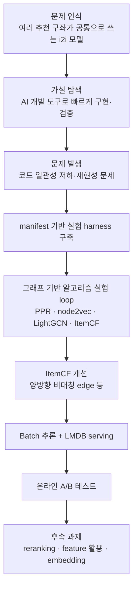
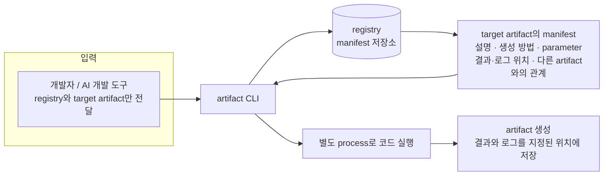
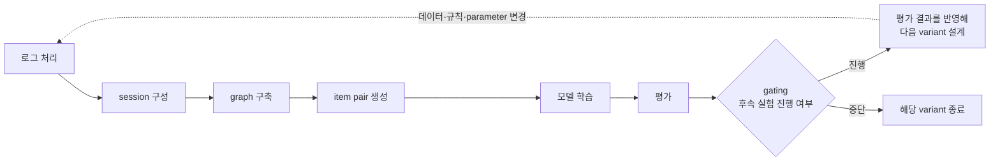
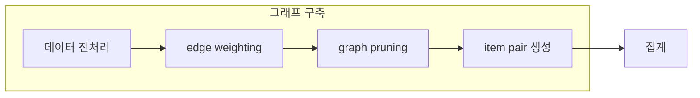
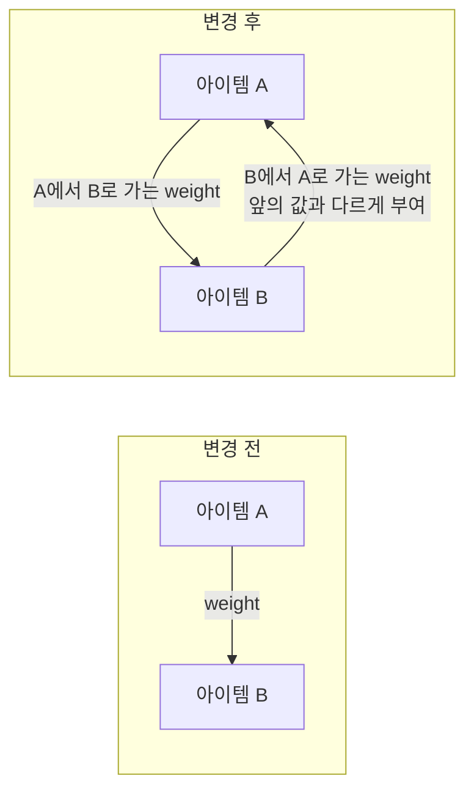
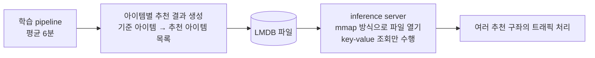
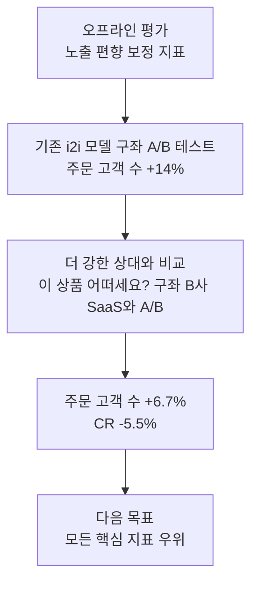
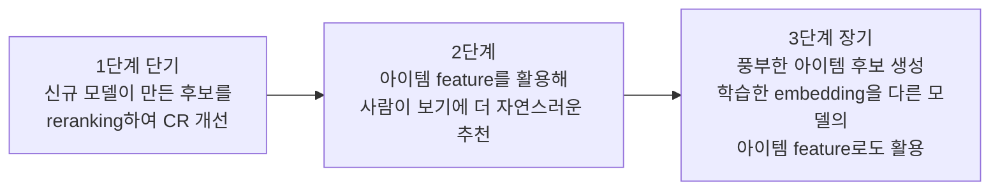

- 대상 글: [「AI 개발 도구와 세션 기반 아이템 그래프를 활용한 i2i 추천 모델 개선」](https://gsretail.tistory.com/99) (GS리테일 DX블로그, 2026.10.06 게시, 작성자 최원일 / AX본부 홈쇼핑AX부문 검색추천파트)
- 함께 읽은 글: [「[AI-DLC 사례 2: 추천] AI로 코딩은 빨라졌는데, 왜 실험은 여전히 어려웠을까?」](https://gsretail.tistory.com/98) (같은 블로그, 2026.08.20 게시, 작성자 장효주)
- 확인일: 2026년 10월 6일

> 
> “AI로 코드를 빨리 짜면 개발도 빨라질까?”
> 
> GS리테일에서 추천 시스템을 개선하며 직접 부딪혀 본 이야기입니다.
> 
> AI 개발 도구로 가설과 실험의 속도는 빨라졌지만, 실험이 늘어나자 코드의 일관성과 재현성이 새로운 문제가 됐습니다.
> 
> 그래서 만든 것이 manifest-driven ML Experiment Harness.
> 
> AI에게 코드를 더 많이 작성시키는 대신, AI가 일할 수 있는 구조와 규칙부터 만들었습니다.
> 
> 그 위에서 Graph, ItemCF, PPR, node2vec, LightGCN 등을 반복해서 실험했고, 결국 실제 서비스 A/B Test의 성과까지 연결했습니다.
> 
> 개인적으로 재미있었던 포인트는 모델 하나보다 “AI와 함께 실험하는 개발 환경을 어떻게 설계했는가”였습니다.
> 
> AI 시대의 개발 생산성은 코드를 얼마나 빨리 만드는지가 아니라, 얼마나 빠르게 가설 → 실험 → 검증 → 개선의 루프를 돌릴 수 있는가에 있는지도 모르겠습니다.
> 
> 추천 시스템과 AI Engineering에 관심 있는 개발자라면 재미있게 읽어보실 수 있을 것 같습니다.
> 
> https://gsretail.tistory.com/99
> 
> 
> #AX블로그
> 
> https://www.facebook.com/share/1CCgecLD6w/
> 

---

## 0. 이 문서를 읽는 방법

이 문서는 두 가지 층으로 구성되어 있습니다. 첫째는 원문 블로그 글에 실제로 적혀 있는 내용을 그대로 풀어 설명하는 부분이고, 둘째는 추천 시스템 분야에서 널리 알려진 개념(ItemCF, PageRank, node2vec, LightGCN 등)을 독자가 이해하기 쉽도록 보충하는 부분입니다. 원문에 근거가 있는 내용과 일반 개념 설명은 문장에서 구분되도록 썼고, 원문이 밝히지 않은 부분(내부 기준, 구체적인 수식, 세부 수치 등)은 추측으로 채우지 않고 "원문은 밝히지 않았다"고 명시했습니다.

확인한 자료는 다음과 같습니다. 원문 두 편은 직접 열어 전문을 읽었습니다. AWS Personalize의 `aws-similar-items` 레시피는 AWS 공식 문서와 AWS 블로그로, LightGCN은 arXiv 논문 초록(arXiv:2002.02126)으로 확인했습니다. 공유해 주신 Facebook 링크는 원문 블로그를 소개하는 공유 링크로 보이며, 이 문서는 블로그 원문과 소개글을 기준으로 작성했습니다.

---

## 1. 핵심 요약

원문의 이야기는 한 문장으로 줄이면 이렇습니다. AI 개발 도구 덕분에 추천 모델 실험 코드를 빠르게 만들 수 있게 되자 오히려 코드 구조가 흐트러지고 실험 결과를 재현하기 어려워졌고, 그래서 저자는 AI에게 더 많은 코드를 시키는 대신 AI가 일관된 구조로 일할 수 있게 해 주는 규칙(manifest 기반 harness)을 먼저 만들었으며, 그 위에서 그래프 기반 아이템 추천 모델을 반복 실험해 실제 서비스 A/B 테스트에서 성과를 냈다는 것입니다.

핵심 사실을 먼저 정리하면 다음과 같습니다.

- 풀려던 문제는 GS SHOP 앱의 여러 추천 구좌가 공통으로 의존하는 아이템 간(item-to-item, i2i) 추천 모델의 성능 개선이었습니다.
- 기존 모델은 ItemCF 계열의 통계 기반 모델로, 수년간 온라인 테스트에서 검증된 강한 베이스라인이었습니다.
- 개선 방향은 세션 단위로 아이템 그래프를 만들고, 그 위에서 ItemCF를 중심으로 PPR, node2vec, LightGCN 등을 실험하는 것이었습니다.
- 실험이 늘면서 생긴 코드 일관성과 재현성 문제는 manifest 기반 harness로 풀었습니다. 작업에 필요한 프롬프트 총량과 turn 수는 체감상 약 40% 줄었다고 합니다.
- 가장 효과가 컸던 단일 기법은 단방향 그래프 edge를 가중치가 서로 다른 양방향(비대칭) edge로 확장하는 것이었고, 1주일 만에 기존 모델과 비슷한 낮은 복잡도로 더 나은 성능의 모델을 얻었습니다.
- 기존 i2i 모델이 서비스하던 구좌의 A/B 테스트에서 주문 고객 수가 평균 14% 높았고, 추천 결과를 생성할 수 있는 요청 비율은 94%에서 97%로 올랐습니다.
- 외부 추천 SaaS(원문에서는 B사)와의 비교 테스트에서는 주문 고객 수는 6.7% 앞섰지만 전환율(CR)은 5.5% 낮았습니다. 이 테스트는 7월부터 9월까지 진행 중인 누적 결과입니다.

전체 흐름을 도식으로 보면 다음과 같습니다.

---

## 2. 글의 배경: 무엇을, 왜 개선하려 했나

### 2.1 GS SHOP의 추천 구좌와 i2i 모델

원문은 GS SHOP 앱에 백여 개에 달하는 추천 영역이 있어 고객의 탐색 경험을 돕고 있다는 말로 시작합니다. 저자는 2025년 GS리테일에 합류해 추천 시스템 전면 재구축 프로젝트를 진행하던 중, 여러 개의 i2i 추천 구좌가 공통으로 의존하는 핵심 모델이 있다는 사실을 알게 되었다고 적었습니다. 그 모델 하나를 개선하면 그에 의존하는 여러 구좌의 비즈니스 지표가 함께 좋아질 가능성이 높다고 판단한 것이 프로젝트의 출발점입니다. 한 번의 개선이 여러 영역의 성과로 번지는 구조에 주목한 셈입니다.

여기서 i2i(item-to-item) 추천이란 특정 상품을 기준으로 "이 상품과 함께 볼 만한 상품", "이 상품을 본 사람이 다음에 볼 만한 상품"을 골라 주는 방식입니다. 사용자 한 사람의 취향 전체를 보고 추천하는 방식과 달리, 기준이 되는 상품 하나가 입력이 됩니다. 상품 상세 페이지 하단의 추천 영역이 대표적인 사용처입니다. 원문에도 상품 상세 페이지 하단의 '이 상품 어떠세요?' 구좌가 i2i 추천 영역으로 등장합니다.

### 2.2 기존 모델: 이기기 어려운 ItemCF 베이스라인

기존 i2i 모델은 ItemCF 계열의 통계 기반 머신러닝 모델입니다. ItemCF(아이템 기반 협업 필터링)는 "같은 사용자 또는 같은 맥락에서 함께 등장한 상품은 서로 관련이 있다"는 공동 발생(co-occurrence) 정보를 바탕으로 상품 간 유사도를 계산하는 고전적인 방법입니다. 참고로 AWS Personalize의 SIMS 레시피도 사용자 이력에서 아이템의 공동 발생을 이용하는 협업 필터링으로 설명되어 있어, 이 계열이 업계에서 흔히 쓰이는 방식임을 알 수 있습니다.

원문은 이 모델을 구현·운영 비용이 낮고 성능과 커버리지가 준수해 시대별 SOTA 모델과의 경쟁에서도 꾸준히 살아남은, 좀처럼 이기기 어려운 베이스라인이라고 평가합니다. 동시에 장기 운영에서 드러난 한계도 세 가지로 밝혔습니다.

1. 조회·장바구니·구매 신호를 개별적으로 처리하는 설계라서 성능과 커버리지에 한계가 있었습니다.
2. 비인기 아이템에 취약했습니다.
3. 홈쇼핑 도메인 특성상 발생하는 구매 spike 패턴을 충분히 반영하기 어려운 구조였습니다.

즉 이 프로젝트의 과제는 "아주 잘 작동하는 오래된 모델을, 그 장점(낮은 복잡도, 낮은 운영 비용)은 유지하면서 한계를 보완해 넘어서는 것"이었습니다.

---

## 3. 가설 탐색: 어떤 방향이 유리하다고 판단했나

### 3.1 AI 개발 도구를 쓴 빠른 가설 검증

저자는 개인적 직관, 이미 알려진 패턴, 로그 분석에서 발견한 행동 패턴을 다각도로 탐색했고, 필요한 코드 구현을 AI 개발 도구에 맡겨 빠르게 실험했다고 합니다. 일부 가설은 알고리즘에 반영한 뒤 온라인·오프라인 실험으로 검증했습니다.

실패한 시도도 솔직하게 적혀 있습니다. EASE, ALS 같은 shallow model(얕은 구조의 행렬분해·오토인코더 계열 모델)을 오프라인에서 테스트했을 때, 학습 데이터에 사용자 취향을 강하게 반영하거나 모델의 정규화 강도를 높이면 두 경우 모두 성능이 하락했습니다. 이 부정적 결과가 이후 방향을 좁히는 단서가 되었습니다.

### 3.2 AWS Personalize 테스트에서 얻은 단서

가장 흥미로운 대목은 인기 아이템(head item)에 관한 가설이 AWS Personalize의 `aws-similar-items` 레시피를 테스트하다가 나왔다는 부분입니다. AWS 공식 문서에 따르면 이 레시피는 사용자-아이템 상호작용 이력과 아이템 메타데이터를 함께 활용해 유사 아이템을 찾는 딥러닝 기반 레시피입니다.

원문이 제시한 테스트 결과는 다음과 같습니다.

- 평균 추천 인기도(ARP)가 기존 모델의 3,896에서 13,018로 3배 이상 높았습니다.
- 상위 1% 아이템이 전체 추천의 50%를 차지할 정도로 인기 아이템 편향이 강했습니다.
- 그런데도 소규모 온라인 A/B 테스트에서는 기존 모델보다 전환율(CR), 순 방문자 수(UV), 평균 주문 금액(AOV)이 모두 높았습니다.
- AWS Personalize 자체는 요구사항과 맞지 않아 도입은 중단했습니다.

저자는 이 결과를 "인기 아이템 정보를 과도하게 정규화하지 않는 방향이 성능에 중요할 수 있다"는 단서로 해석했습니다. 인기 상품을 억누르지 않고 그대로 살리는 편이 이 도메인에서는 유리할 수 있다는 뜻입니다. 참고로 AWS 쪽 문서에는 Similar-Items 레시피에 인기도 반영 정도를 조절하는 `popularity_discount_factor` 하이퍼파라미터가 있다고 소개되어 있습니다. 인기도를 얼마나 반영할지가 추천 품질의 조절 변수라는 점은 업계에서도 별도의 조절 항목으로 다룬다는 방증이지만, GS리테일이 이 파라미터를 썼는지는 원문에 없습니다.

### 3.3 세 가지 가설

이 단서를 종합해 세운 가설은 세 쌍의 대립 개념으로 정리되어 있습니다.

| 대립 축 | 원문의 가설 |
|---|---|
| Inductive vs. transductive | 인기 아이템의 정보 손실을 최소화할 수 있는 transductive 방식을 사용한다 |
| User vs. session | 사용자 단위보다 세션 단위 접근이 인기 아이템을 더 잘 표현하는 데 유리하다 |
| Freshness vs. relevance | 구매력이 높은 상품일수록 수명이 짧거나 상품 간 전이 관계가 빠르게 소멸하므로, 경량 모델이나 근사 추정 기법으로 재학습 주기를 단축한다 |

각 가설을 풀어 쓰면 다음과 같습니다.

**Transductive 방식.** 일반적으로 transductive 방식은 학습 시점에 이미 존재하는 노드(여기서는 아이템) 각각에 대해 직접 표현을 학습하는 방식이고, inductive 방식은 아직 보지 못한 노드에도 적용 가능한 일반 함수를 학습하는 방식입니다. 저자는 인기 아이템 정보를 최대한 보존하려면 아이템별로 정보를 직접 담는 transductive 쪽이 낫다고 가정한 것입니다.

**세션 단위 접근.** 사용자 한 명의 장기 이력 대신, 짧은 행동 구간(세션)을 단위로 삼으면 같은 구간에서 함께 소비된 아이템 관계가 인기 아이템에서도 선명하게 드러날 것이라는 가설입니다.

**Freshness 우선.** 홈쇼핑 상품은 수명이 짧을 수 있으므로 모델 정교함보다 얼마나 자주 다시 학습할 수 있는지가 중요하다는 판단입니다. 이 판단이 뒤에 나오는 "파이프라인 평균 6분"이라는 서빙 설계로 이어집니다.

저자는 이 가설들과 기존 i2i 모델의 성공 방식, 그리고 공개하기 어려운 내부 분석 결과를 종합해 그래프 계열 모델이 가장 유리하다고 결론 내렸습니다. 내부 분석의 구체 내용은 원문이 밝히지 않았습니다.

---

## 4. ML 실험 harness: 이 글의 가장 핵심적인 부분

### 4.1 무엇이 문제였나

모델 구현을 시작하고 AI 개발 도구로 실험 코드를 여러 개 작성해 보니 두 가지 문제가 나타났습니다. 하나는 실험이 반복될수록 코드 구조가 일관성을 잃고 작은 variant(변형)에도 취약해진다는 것이었고, 다른 하나는 코드를 다시 실행해도 같은 실험 결과를 재현하지 못하는 경우가 생긴다는 것이었습니다. 저자는 이 상태로 production에 반영하려면 상당한 refactoring이 필요하다고 판단했고, 그래서 AI 개발 도구가 일정한 구조와 품질의 코드를 쓰도록 유도하는 harness가 필요하다고 보았습니다.

여기서 harness란 AI 에이전트가 제멋대로 코드를 쓰지 않고 정해진 틀 안에서 일하게 만드는 구조와 규칙의 묶음을 가리키는 표현입니다. 소개글의 표현대로 "AI에게 코드를 더 많이 작성시키는 대신, AI가 일할 수 있는 구조와 규칙부터 만든" 것입니다.

### 4.2 manifest 기반 접근의 구조

원문이 정의한 용어를 먼저 정리하면 다음과 같습니다.

- **artifact**: 실험 과정에서 만들어지는 산출물입니다. 원문 맥락상 데이터 처리 결과, 그래프, 학습된 모델, 평가 결과 같은 것들이 해당합니다.
- **artifact manifest(manifest)**: artifact의 설명, 생성 방법, 주요 parameter, 결과 및 로그의 저장 위치, 다른 artifact와의 관계를 정의하는 파일입니다.
- **registry**: manifest들을 모아 둔 저장소입니다.
- **CLI**: registry에서 target artifact의 manifest를 읽어 필요한 코드와 parameter를 파악하고, 해당 코드를 별도 process로 실행하는 도구입니다.

동작 흐름은 다음과 같이 정리할 수 있습니다.

이 구조의 장점은 두 가지로 설명됩니다. 첫째, 개발자는 manifest만 보고도 어떤 artifact가 있고 어떻게 만들어지며 어디에 저장되는지 한눈에 파악할 수 있습니다. 둘째, AI 개발 도구에게 긴 설명 대신 registry와 target artifact만 프롬프트로 전달해도 필요한 맥락을 스스로 파악할 수 있을 것이라고 보았습니다. 다시 말해 manifest가 사람과 AI가 함께 참조하는 문서이자 프로젝트의 색인(index) 역할을 합니다.

### 4.3 직접 만든 최소 기능 CLI와 규약

저자는 필요한 기능의 범위가 명확하고 구현 규모도 크지 않다고 판단해 최소 기능을 갖춘 artifact CLI tool을 직접 만들었습니다. 설계상 특징은 다음과 같습니다.

- 각 parameter 조합을 artifact variant로 표현하고 versioning할 수 있습니다.
- 프로젝트 구조에서 manifest와 artifact가 1:1로 대응하도록 강제합니다. 따라서 artifact의 생성과 조합이 항상 manifest를 기준으로 이뤄집니다.

### 4.4 효과

시범 적용 결과를 원문은 이렇게 적었습니다. manifest 기반 규약이 일관되게 적용되면서 실험 코드의 구조가 안정되었고, 후속 refactoring의 필요성도 줄었습니다. 작업에 필요한 프롬프트 총량과 turn 수는 약 40% 감소했습니다. 다만 원문은 이 수치를 "체감상"이라고 표현했습니다. 엄밀하게 계측한 값이라고 쓰지 않았으므로, 이 40%는 저자의 체감치로 읽는 것이 정확합니다.

왜 이것이 중요한지 풀어 보겠습니다. AI 코딩 도구는 지시를 받을 때마다 그럴듯한 코드를 새로 만들어 내기 때문에, 규칙이 없으면 실험마다 폴더 구조, 설정 방식, 결과 저장 방식이 조금씩 달라집니다. 실험이 열 개, 스무 개로 늘면 "어느 결과가 어떤 코드와 어떤 설정에서 나왔는지" 추적하기가 어려워지고, 이것이 곧 재현성 문제입니다. manifest는 "모든 산출물은 이 형식의 설명서와 짝을 이뤄야 한다"는 규칙을 강제해 이 문제를 구조 차원에서 막습니다.

---

## 5. 알고리즘 실험

### 5.1 실험의 기본 단위: 하나의 loop

실험 설계의 기본 단위는 다음 순서로 이어지는 하나의 loop였습니다.

원문에 따르면 평가 이전의 어느 단계에서든 데이터, 규칙, parameter를 바꿔 variant를 만들 수 있었습니다. 각 variant는 동일한 지표로 평가했고, 결과에 따라 후속 실험을 이어갈지 gating(통과 여부 판정)했으며, 그 평가 결과를 다음 variant 설계에 반영하며 loop를 반복했습니다.

### 5.2 그래프의 구성 방식

- 그래프의 node는 아이템입니다. 별도의 session node는 두지 않았습니다.
- 사용자 행동 로그를 내부 기준으로 구간화해 하나의 session으로 간주하고, 같은 구간에 포함된 아이템들을 edge로 연결합니다.
- edge weight에는 조회(view)·장바구니(cart)·구매(order) 행동별 score를 합산해 단일 edge로 반영했습니다.

이 부분은 기존 모델의 한계로 지적된 "조회·장바구니·구매 신호를 개별적으로 처리한다"는 점과 정확히 대비됩니다. 기존에는 신호별로 따로 계산하던 것을 새 설계에서는 하나의 edge 가중치로 합친 것입니다. 세션을 나누는 내부 기준과 행동별 score의 구체적인 값은 원문에 공개되어 있지 않습니다.

### 5.3 시험한 모델들

이 그래프 위에서 다음 모델들을 학습하고 평가했습니다. 각 모델에 대한 설명은 일반적으로 알려진 개념입니다.

- **Personalized PageRank(PPR)**: 구글의 PageRank를 변형한 방식으로, 특정 시작 노드에서 출발한 무작위 이동을 반복하다가 일정 확률로 시작점으로 되돌아가게 하여 시작 노드와 가까운 노드에 높은 점수를 주는 알고리즘입니다. 한 상품에서 출발해 그래프 위에서 자주 도달하는 상품을 관련 상품으로 보는 방식에 해당합니다.
- **node2vec**: 그래프 위에서 무작위 걷기(random walk)를 만들고, 그 걷기 경로를 문장처럼 취급해 노드의 벡터 표현(embedding)을 학습하는 방법입니다. 벡터가 가까운 아이템을 유사한 아이템으로 봅니다.
- **LightGCN**: 2020년에 발표된 그래프 합성곱 기반 추천 모델입니다. arXiv 초록에 따르면, 그래프 합성곱 신경망(GCN)에서 추천에 꼭 필요한 이웃 정보 집계(neighborhood aggregation)만 남기고 나머지를 덜어 낸 단순한 구조이며, 사용자·아이템 embedding을 상호작용 그래프 위에서 선형으로 전파하고 각 층 embedding의 가중합을 최종 embedding으로 씁니다. 같은 조건에서 당시 최신 GCN 기반 모델인 NGCF 대비 평균 약 16.0%의 상대적 향상을 보였다고 보고되었습니다.
- **ItemCF 계열(edge weight 활용)**: 앞서 설명한 공동 발생 기반 방식에 그래프의 edge weight를 활용한 변형입니다.

### 5.4 평가 지표 설계: 노출 편향 보정

평가 부분에서 원문이 강조한 점은 단순합니다. Recall과 NDCG 같은 일반 추천 지표를 쓰되, 온라인 주문 성과를 추정할 수 있도록 보정했다는 것입니다. 이유는 다음과 같습니다.

서비스 중인 모델은 상품을 노출한 뒤의 고객 반응을 직접 볼 수 있지만, 실험 중인 variant는 고객에게 노출된 적이 없어 반응 데이터가 없습니다. 그래서 일반 지표만으로는 서비스 중인 모델과 실험 모델을 공정하게 비교하기 어렵습니다. 저자는 노출 편향을 보정하고, 팀의 핵심 비즈니스 지표에 맞춰 최적화되도록 정답 데이터셋과 평가 방식을 설계했습니다. 그 결과 이번 프로젝트에서는 오프라인에서 우수했던 variant가 온라인에서 뒤처지는 성능 역전이 발생하지 않았다고 합니다.

용어를 짧게 풀면, Recall은 정답 상품 중 추천 목록에 포함된 비율이고, NDCG는 정답 상품이 목록의 앞쪽에 있을수록 높은 점수를 주는 순위 민감 지표입니다.

### 5.5 실험에서 확인한 사실: 그래프 구축이 성능을 좌우했다

모든 단계의 variant가 성능에 영향을 주지만, 저자는 그래프 구축 단계의 영향이 가장 클 것으로 가정하고 집중 탐색했습니다. 그 결과 실험 초기부터 ItemCF의 지표 상승 폭이 다른 모델보다 두드러졌고, 추정 주문 지표 기준으로 운영 중인 i2i 모델에 빠르게 근접했습니다. 그래서 "ItemCF 알고리즘을 잘 구현하는 것만으로도 조기에 성과를 낼 수 있다"고 판단했습니다.

여기서 독자가 주의할 점이 있습니다. 원문은 PPR, node2vec, LightGCN의 구체적인 수치를 공개하지 않았고, 이 모델들이 ItemCF보다 "상승 폭이 작았다"는 상대 비교만 서술합니다. 이 모델들이 본질적으로 열등하다는 일반적 주장이 아니라, 이 데이터와 이 설정에서 관찰된 결과라는 점을 구분해서 읽어야 합니다.

---

## 6. ItemCF 성능 개선

### 6.1 개선의 두 영역

ItemCF 개선은 그래프 구축과 집계(aggregation)의 두 영역으로 나뉘어 진행됐습니다. 그래프 구축은 다시 네 단계였습니다.

각 단계와 집계 방식에 기존에 알려진 다양한 기법을 적용하고, ablation test(구성요소를 하나씩 바꾸거나 제거해 기여도를 확인하는 실험)로 기법별 기여도를 확인했습니다.

### 6.2 결과: 집계보다 그래프 구축

실험 결과 집계 방식의 변경보다 그래프 구축 방식이 성능에 더 큰 영향을 미쳤습니다. 개별 기법 중 지표 증가 폭이 가장 컸던 것은 **단방향 graph edge를 양방향 비대칭(asymmetric) edge로 확장하는 기법**이었습니다.

원문의 설명은 한 문장입니다. 단방향 edge에 역방향 edge를 추가하되 두 방향의 weight를 서로 다르게 부여한다는 것입니다.

이 기법이 왜 효과적이었는지에 대해서는 원문이 별도 설명을 하지 않았습니다. 따라서 이 문서도 그 이유를 단정하지 않습니다. 다만 "관련성이 방향에 따라 다를 수 있다"는 비대칭성 자체는 직관적으로 이해할 수 있습니다. 예를 들어 어떤 상품을 본 뒤 다른 상품으로 이동하는 비율과 그 반대 방향의 비율이 같을 이유는 없기 때문입니다. 이는 개념 이해를 돕기 위한 일반론이며, GS리테일의 실제 가중치 설계는 원문에 공개되어 있지 않습니다.

이런 개선을 조합해 실험 loop를 반복한 끝에, **1주일 만에** 기존 모델과 비슷한 수준의 낮은 복잡도를 유지하면서도 더 뛰어난 성능의 모델을 만들 수 있었다고 원문은 적었습니다. 이 "1주일"이야말로 4장의 harness와 AI 개발 도구가 만든 속도 효과를 보여 주는 대목입니다.

---

## 7. Serving 구조: 빠르고 싸게, 그리고 자주 갱신

서빙은 batch inference 방식입니다. 흐름은 다음과 같습니다.

원문에 따르면 pipeline이 `{기준 아이템: [추천 아이템]}` 형태의 key-value를 미리 계산해 LMDB 파일에 저장하고, inference server는 이 파일을 mmap 방식으로 열어 조회만 합니다. 요청이 들어올 때마다 모델을 돌리지 않으므로 서빙 비용이 낮고 응답이 빠릅니다. 이 구조로 낮은 serving cost와 빠른 응답 속도를 유지하면서 여러 추천 구좌의 트래픽을 처리할 수 있었고, 전체 pipeline 실행 시간은 평균 6분으로 목표한 freshness 수준을 달성했습니다.

용어를 보충하면, LMDB는 메모리 매핑(memory-mapped) 방식의 경량 key-value 저장소이고, mmap은 파일을 운영체제의 가상 메모리에 직접 연결해 읽는 기법입니다. 이미 계산된 결과를 키로 찾기만 하면 되는 i2i 추천의 특성과 잘 맞는 선택입니다. 앞서 세운 "freshness 우선" 가설, 즉 재학습 주기를 짧게 가져가야 한다는 판단이 6분이라는 pipeline 실행 시간으로 실현된 것입니다.

---

## 8. A/B 테스트 결과

### 8.1 기존 i2i 모델과의 비교

기존 i2i 모델이 서비스하던 추천 구좌 중 하나에 신규 모델을 적용해 온라인 A/B 테스트를 진행했습니다.

| 지표 | 신규 모델 vs 기존 모델 |
|---|---|
| 주문 고객 수 | 평균 14% 높음 |
| 전환율(CR) | 동등 |
| 순 방문자 수(UV) | 14% 높음 |
| 평균 주문 금액(AOV) | 3% 높음 |
| 추천 결과 생성 가능 요청 비율 | 94% → 97% (3%p 상승) |

원문은 이 결과를 유의미한 개선으로 평가합니다. 숫자의 의미를 풀어 보면, CR이 동등한데 UV가 14% 높았으므로 주문 고객 수가 약 14% 늘어난 결과는 서로 맞아떨어집니다. 다만 원문은 CR과 UV의 정확한 산출 기준을 적지 않았으므로, 이 산술적 정합성은 일반적인 정의를 가정한 설명이라는 점을 밝혀 둡니다.

커버리지 3%p 상승에 대한 원문의 해석이 눈여겨볼 만합니다. 수치만 보면 작아 보이지만, 여기에는 기존 모델의 커버리지 한계 때문에 시스템 차원에서 추천을 제공하지 못했던 방송 예정 상품이 포함되어 있다고 합니다. 마침 그 상품군까지 추천을 확대해 달라는 비즈니스 요청이 제기된 시점이었고, 신규 모델로 전환하면서 이를 함께 지원할 수 있었습니다. 즉 성능 숫자뿐 아니라 실무 요구를 해결했다는 점이 의미라는 설명입니다.

### 8.2 외부 추천 SaaS(B사)와의 비교

두 번째 테스트는 더 어려운 상대와의 비교입니다. 상품 상세 페이지 하단의 '이 상품 어떠세요?' 구좌는 팀이 수년간 개선을 시도해 온 i2i 영역입니다. 한때 일부 추천 구좌를 B사의 추천 SaaS로 운영했지만 여러 A/B 테스트에서 자체 모델이 더 높은 성능을 보여 대부분 자체 모델로 전환했습니다. 그러나 이 구좌만큼은 B사 SaaS가 계속 앞섰습니다.

- **과거 테스트**: B사 SaaS는 기존 자체 모델보다 주문 고객 수가 평균 20%, CR이 15% 높았습니다.
- **이번 테스트**(7월~9월 진행 중인 누적 결과): 신규 모델은 B사 SaaS보다 주문 고객 수가 6.7% 높았고, CR은 5.5% 낮았습니다.

원문의 평가는 이렇습니다. 주문 고객 수에서는 역전했지만 전환 효율까지 앞서지는 못했다. 다만 기존 자체 모델과 비교하면 B사 SaaS와의 CR 격차를 크게 줄였다.

이 두 테스트 결과를 읽을 때 주의할 점은 두 가지입니다. 하나는 이 테스트가 아직 진행 중이며 수치가 누적 결과라는 점입니다. 다른 하나는 "과거 테스트"와 "이번 테스트"가 서로 다른 시기의 별개 실험이므로, 두 결과의 퍼센트를 곱하거나 이어 붙여 "기존 모델 대비 신규 모델이 얼마"라고 계산해서는 안 된다는 점입니다. 원문도 그런 환산치를 제시하지 않았습니다.

단계적 검증의 구조는 다음과 같이 요약됩니다.

---

## 9. 성과와 후속 과제

프로젝트의 초기 목표는 여러 추천 구좌가 공통으로 쓰는 i2i 모델을 개선해 한 번의 개선을 여러 영역의 성과로 연결하는 것이었습니다. 원문은 신규 모델이 기존 모델과 비슷한 수준의 낮은 복잡도를 유지하면서 주문 고객 수를 평균 14% 높이고 커버리지와 freshness도 개선했으므로 초기 목표를 달성했다고 평가합니다. 그리고 B사 SaaS와의 테스트 결과로 "모든 핵심 지표에서 우위를 확보한다"는 다음 목표가 가시권에 들어왔다고 적었습니다.

후속 개선은 세 단계로 계획되어 있습니다.

이 세 단계를 포함한 모델은 후속 글에서 소개할 예정이라고 원문은 밝혔습니다. 현재 모델은 주로 "어떤 후보를 가져올 것인가"에 강하고, CR 격차를 메우려면 "가져온 후보를 어떤 순서로 보여 줄 것인가(reranking)"와 "상품 속성 정보를 어떻게 쓸 것인가(feature 활용)"가 다음 과제라는 논리입니다.

---

## 10. 함께 읽으면 좋은 앞선 글: AI로 빨라진 코딩, 병목은 어디로 갔나

같은 블로그의 8월 20일 글(장효주, 같은 검색추천파트)은 이번 글과 주제가 맞닿아 있어 함께 읽으면 이해가 깊어집니다. 이 글은 2026년 7월 7일부터 9일까지 5명이 한 팀이 되어 AI-DLC 방식으로 상품 상세 하단(단품하단) 추천의 후보군 개선을 실험한 3일간의 기록입니다. 이번 글과 같은 프로젝트의 후속이라고 원문이 명시한 것은 아니므로, 같은 파트의 인접한 주제의 글로 이해하시면 정확합니다.

그 글의 주요 내용은 다음과 같습니다.

- **구현이 빨라지자 병목이 판단으로 옮겨갔다.** 여러 아이디어를 구현하고 결과를 만드는 일은 예상만큼 빨랐지만, 어떤 결과가 더 좋은지, 그 숫자를 믿어도 되는지, 어디까지 볼지를 결정하는 일이 병목이 되었습니다.
- **1등이 하나가 아니었다.** 어떤 후보는 주문 상품을 더 많이 찾아왔고, 어떤 후보는 주문 상품을 더 앞쪽에 배치했으며, 어떤 후보는 기존 방식이 놓친 상품을 새로 찾아왔습니다. 서로 다른 질문에 답하고 있었던 것입니다.
- **평가 기준 자체도 실험의 결과물이었다.** 기존의 노출 이후 주문 기반 내부 지표가 기존에 어떤 상품이 노출됐는지의 영향을 받는다는 한계가 발견되어, 상위 16개 결과에서 주문 상품이 앞쪽에 배치되는 정도를 보는 order_NDCG@16을 주요 판단 축에 추가했습니다.
- **모델은 자유롭게, 평가는 엄격하게.** 구현 방식은 달라도 같은 데이터, 같은 평가 기간, 같은 결과 형식으로 맞췄습니다.
- **가장 좋은 숫자를 바로 믿을 수 없었다.** 한 실험에서 order_NDCG@16이 0.097633으로 나왔지만, 평가 시점 이후의 정보(미래 정보)가 섞인 결과였습니다. 같은 아이디어를 누출 없이 다시 구현하니 0.012374로 약 8배 차이가 났습니다. 높은 쪽은 참고용(LEAKY_REF)으로만 남겼습니다.
- **판단에도 구조가 필요했다.** 결과마다 STOP(더 보지 않는다), PARK(가능성은 있으나 추가 검증 필요), KEEP_SOURCE(전체 1등은 아니지만 다른 역할로 유지) 같은 다음 행동 라벨을 붙이고, 이를 한눈에 보는 leaderboard 대시보드를 만들었습니다.
- **빠른 실험은 잘못된 방향도 빠르게 만든다.** 탐색이 기존 상용 추천 결과를 더 잘 재현하는 방향으로 흘러간 적이 있었고, 실험 실행 정보를 별도로 관리하는 큰 구조가 제안됐지만 Kubeflow가 이미 제공하는 기능과 겹쳐 기존 기능에 맡겼습니다.

이번 글(i2i 모델 개선)과 연결 지어 보면, 8월 글이 "빠르게 만든 결과를 어떻게 믿고 어떻게 판단할 것인가"를 다뤘다면 10월 글은 "그 판단 위에서 일관된 구조로 실험을 반복해 실제 서비스 성과까지 연결한 과정"을 다룹니다. 이번 글에서 오프라인에서 우수했던 variant가 온라인에서 뒤처지는 성능 역전이 없었다는 대목은, 평가 설계(노출 편향 보정)의 중요성이라는 8월 글의 문제의식과 이어지는 지점입니다. 두 글의 결론이 같은 방향을 가리킨다는 해석은 이 문서의 읽기이며, 원문이 두 글을 직접 연결해 서술한 것은 아닙니다.

---

## 11. 소개글 문장별 짚어보기

공유해 주신 소개글의 주요 문장을 원문과 대조하면 다음과 같습니다.

- "AI 개발 도구로 가설과 실험의 속도는 빨라졌지만, 실험이 늘어나자 코드의 일관성과 재현성이 새로운 문제가 됐습니다." → 원문 4.1절에 해당하는 내용과 일치합니다.
- "manifest-driven ML Experiment Harness" → 원문은 "ML 실험 harness" 항목에서 "manifest-driven 접근"으로 설명합니다. 소개글의 이름은 이를 요약한 표현입니다.
- "Graph, ItemCF, PPR, node2vec, LightGCN 등을 반복해서 실험" → 원문 5.3절과 일치합니다. 다만 원문에 따르면 최종적으로 성과를 낸 중심은 개선된 ItemCF 계열 모델이었습니다.
- "실제 서비스 A/B Test의 성과까지 연결" → 8장과 일치합니다. 기존 모델 대비 주문 고객 수 평균 14% 개선이 핵심 수치이고, B사 SaaS와의 비교는 진행 중인 누적 결과입니다.
- "개발 생산성은 코드를 얼마나 빨리 만드는지가 아니라, 얼마나 빠르게 가설 → 실험 → 검증 → 개선의 루프를 돌릴 수 있는가" → 원문 본문에 이 문장 그대로 있지는 않습니다. 원문의 실험 loop 설계(5.1절)와 8월 글의 결론에 비추어 타당한 해석이지만, 소개글 작성자의 관점이라는 점을 구분해 둘 필요가 있습니다.

---

## 12. 이 글이 밝히지 않은 것 (해석 시 주의)

정확한 이해를 위해 원문에 공개되지 않은 항목을 정리합니다. 아래 항목은 추측하지 않았습니다.

1. 세션을 나누는 내부 기준과 행동별(view·cart·order) score의 구체적 값
2. 양방향 비대칭 edge에서 두 방향 weight를 정하는 방식과 그 기법이 효과적이었던 이유
3. PPR, node2vec, LightGCN 각각의 정량 결과
4. 오프라인 평가의 정답 데이터셋 구성과 노출 편향 보정의 구체 방법, "추정 주문 지표"의 정의
5. 내부 분석 결과의 내용(그래프 계열이 유리하다고 판단한 근거 중 일부)
6. CR, UV 등 A/B 테스트 지표의 정확한 정의, 테스트 기간 및 트래픽 규모, 통계적 유의성 검정 방법
7. B사 SaaS의 정체와 상세 구성
8. "프롬프트 총량과 turn 수 40% 감소"의 측정 방법(원문은 체감이라고 표현)
9. 후속 단계(reranking, feature 활용, embedding)의 구체 설계

또한 이 사례의 결과는 GS SHOP이라는 특정 서비스의 데이터와 도메인(홈쇼핑, 방송 상품, 구매 spike 패턴 등)에서 얻은 것입니다. "세션 기반 그래프가 항상 사용자 기반보다 낫다"거나 "인기 아이템을 정규화하지 않는 것이 항상 유리하다"처럼 일반화해서 읽으면 안 됩니다. 원문도 이를 일반 법칙이 아니라 이 프로젝트에서 세운 가설과 확인한 결과로 서술하고 있습니다.

---

## 13. 용어 풀이

| 용어 | 설명 |
|---|---|
| i2i (item-to-item) | 기준 상품 하나를 입력으로 관련 상품을 추천하는 방식 |
| ItemCF | 아이템 기반 협업 필터링. 함께 소비된 이력(공동 발생)으로 상품 간 유사도를 계산 |
| head item | 소수의 매우 인기 있는 상위 아이템 |
| ARP | 평균 추천 인기도. 추천 목록에 포함된 아이템들의 평균 인기 수준 |
| CR / UV / AOV | 전환율 / 순 방문자 수 / 평균 주문 금액 |
| Transductive / Inductive | 학습 시 존재하는 노드를 직접 학습하는 방식 / 보지 못한 노드에도 적용되는 일반 함수를 학습하는 방식 |
| EASE, ALS | 협업 필터링에서 쓰이는 얕은 구조의 대표 모델 계열(오토인코더 계열, 행렬분해 계열) |
| PPR | 시작 노드 기준으로 가까운 노드에 높은 점수를 주는 개인화 PageRank |
| node2vec | 무작위 걷기로 노드 embedding을 학습하는 그래프 표현 학습 방법 |
| LightGCN | GCN에서 이웃 정보 집계만 남긴 단순한 추천용 그래프 모델(2020) |
| ablation test | 구성요소를 하나씩 바꾸거나 제거해 기여도를 확인하는 실험 |
| Recall / NDCG | 정답 포함 비율 / 정답이 앞쪽에 있을수록 높은 순위 민감 지표 |
| manifest / registry | artifact의 정의서 / 정의서를 모아 둔 저장소 |
| harness | AI가 일관된 구조 안에서 작업하도록 만드는 구조와 규칙의 묶음 |
| LMDB / mmap | 메모리 매핑 기반 경량 key-value 저장소 / 파일을 가상 메모리에 연결해 읽는 기법 |
| gating | 평가 결과에 따라 후속 실험 진행 여부를 판정하는 것 |
| freshness | 모델과 추천 결과가 최신 데이터를 얼마나 빠르게 반영하는가 |

---

## 14. 맺으며: 이 사례가 주는 시사점

이 글에서 가장 오래 남는 메시지는 모델의 이름이 아니라 작업 방식에 있습니다. 정리하면 다음 네 가지입니다.

첫째, AI가 코드를 빨리 쓴다고 실험이 자동으로 좋아지지 않습니다. 구현 속도가 올라가는 순간 병목은 일관성, 재현성, 평가와 판단으로 이동합니다. 원문이 코드의 일관성과 재현성을 "새로운 문제"라고 부른 이유입니다.

둘째, AI에게는 긴 지시문보다 읽을 수 있는 구조가 효과적일 수 있습니다. manifest와 registry가 사람과 AI 모두의 공통 문서이자 색인으로 기능하면서, 맥락 전달 비용이 줄었다는 것이 저자의 경험입니다(수치는 체감치).

셋째, 평가 설계가 곧 실험의 신뢰도입니다. 노출 편향을 보정한 평가 덕분에 오프라인과 온라인의 순위가 뒤집히지 않았다는 점, 그리고 8월 글에서 미래 정보가 섞인 높은 점수를 걸러낸 경험은 같은 교훈을 가리킵니다.

넷째, 강한 베이스라인을 이기는 길이 반드시 더 복잡한 모델은 아니었습니다. 이 프로젝트에서 가장 큰 향상은 새 모델을 들여오는 것보다 ItemCF의 그래프 구축 방식을 다듬는 데서 나왔고, 복잡도는 기존 수준을 유지했습니다.

---

## 15. 출처

- GS리테일 DX블로그, 「AI 개발 도구와 세션 기반 아이템 그래프를 활용한 i2i 추천 모델 개선」, 2026.10.06 — https://gsretail.tistory.com/99
- GS리테일 DX블로그, 「[AI-DLC 사례 2: 추천] AI로 코딩은 빨라졌는데, 왜 실험은 여전히 어려웠을까?」, 2026.08.20 — https://gsretail.tistory.com/98
- Amazon Personalize 문서, Similar-Items recipe — https://docs.aws.amazon.com/personalize/latest/dg/native-recipe-similar-items.html
- Amazon Personalize 문서, SIMS recipe — https://docs.aws.amazon.com/personalize/latest/dg/native-recipe-sims.html
- AWS Machine Learning Blog, Introducing popularity tuning for Similar-Items in Amazon Personalize — https://aws.amazon.com/blogs/machine-learning/introducing-popularity-tuning-for-similar-items-in-amazon-personalize
- Xiangnan He et al., LightGCN: Simplifying and Powering Graph Convolution Network for Recommendation, arXiv:2002.02126 — https://arxiv.org/abs/2002.02126
