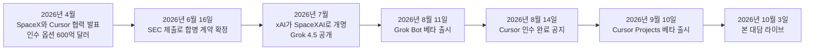
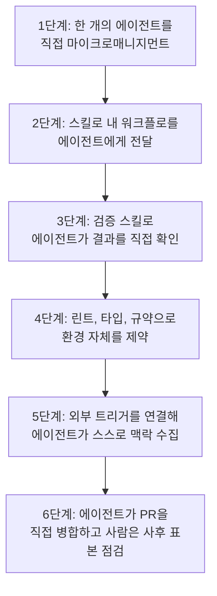
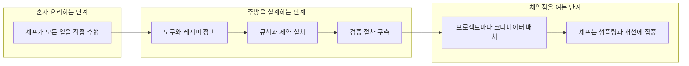
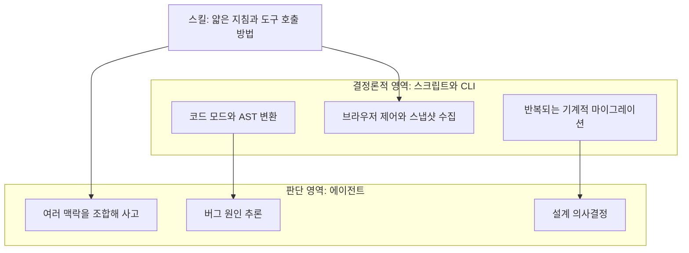
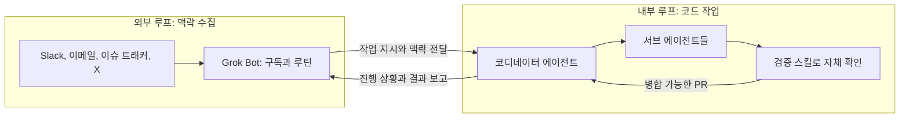
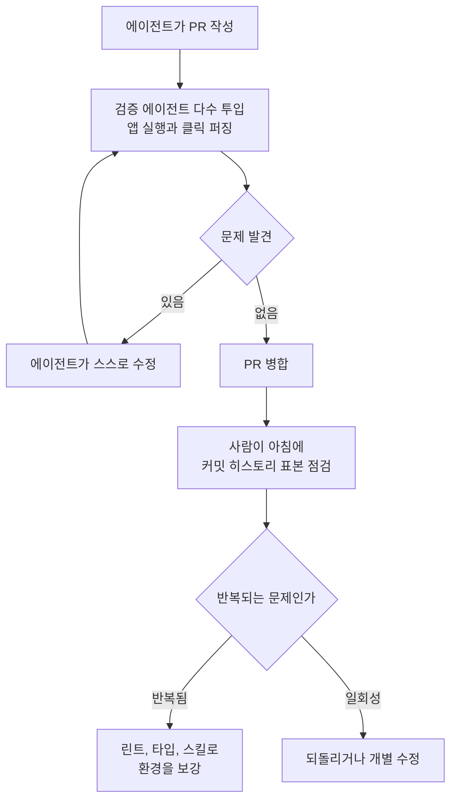

- 작성일: 2026-10-06
- 대상 영상: *LIVE: Poteto (creator of pstack) on shipping 1,000's of PR's a month at SpaceX* (Matt Pocock 채널, 2026-10-03 공개)
- 영상 주소: [https://www.youtube.com/live/MN9dGgmLyso](https://www.youtube.com/live/MN9dGgmLyso)

---

## 0. 이 문서를 읽는 방법

이 문서는 약 1시간 5분 분량의 라이브 대담을 처음부터 끝까지 따라가며, 대화에서 오간 내용을 서술형으로 풀어 설명한 것입니다. 단순한 요약에 그치지 않고 세 가지를 함께 담았습니다. 첫째, 발언의 맥락과 의도를 풀어 쓴 해설입니다. 둘째, 발언 중에 등장한 제품, 사건, 인물이 실제로 존재하는지 웹에서 다시 확인한 결과입니다. 셋째, 말하는 사람의 주장과 외부에서 교차 검증된 사실을 구분하는 표기입니다.

본문에서 쓰는 표기 규칙은 다음과 같습니다.

- **[발언]** 영상에서 Lauren이나 Matt가 직접 한 말입니다. 본인의 경험이나 주장이므로 독립적으로 검증된 사실은 아닙니다.
- **[확인]** 2026-10-06 기준으로 웹 검색을 통해 별도의 출처에서 교차 확인한 내용입니다.
- **[해설]** 제가 이해를 돕기 위해 덧붙인 설명입니다. 사실 주장이 아니라 풀이입니다.

영상 자막은 자동 생성된 것이어서 고유명사가 여러 군데 잘못 받아 적혀 있습니다. 예를 들어 "PAC"은 pstack, "Grockbot"이나 "graphbot"은 Grok Bot, "unsop"은 unslop, "tutology"는 tautology(동어반복)를 가리킵니다. 이 문서에서는 모두 바로잡아 표기했습니다. 용어 정리는 문서 후반부의 부록에 모아 두었습니다.

---

## 1. 한눈에 보는 핵심 메시지

이 대담의 중심 주장은 한 문장으로 줄일 수 있습니다. **"에이전트에게 일을 시키는 것이 아니라, 에이전트가 일하는 환경을 설계하는 것이 엔지니어의 새로운 본업이다."**

Lauren은 지난달 약 2,500개의 PR을 프로덕션에 배포했다고 말합니다. 하지만 그 숫자를 만든 비결은 더 빨리 타이핑하거나 더 많은 채팅창을 여는 데 있지 않았습니다. 그녀가 반복해서 강조한 것은 세 가지 축입니다.

첫 번째는 **검증(verification)** 입니다. 에이전트가 자기 결과물을 직접 실행해 보고, 사람처럼 클릭해 보고, 디버깅 정보까지 읽을 수 있어야 비로소 "루프"가 닫힙니다. 사람이 에이전트와 결과물 사이의 중계자 노릇을 하는 한, 아무리 좋은 스킬이 있어도 신뢰의 사다리를 오를 수 없다는 것이 그녀의 경험입니다.

두 번째는 **환경의 제약(constraints)** 입니다. 린트 규칙, 타입 시스템, 규약화된 디렉터리 구조로 코드베이스 자체를 "나쁜 코드를 쓰기 어려운 곳"으로 만들어 두면, 에이전트가 규칙을 기억하려고 애쓸 필요 없이 환경의 벽에 부딪히며 올바른 길로 가게 됩니다.

세 번째는 **내부 루프와 외부 루프의 연결**입니다. 에이전트가 코드를 고치는 내부 루프에, Slack이나 이슈 트래커, 이메일에서 쏟아지는 외부 정보를 자동으로 끌어들이는 외부 루프를 붙이면, 사람이 "고기 프록시(meat proxy)"로서 정보를 옮겨 나르는 병목이 사라집니다.

이 세 축 위에서 코디네이터 에이전트(Cursor Projects)와 개인 에이전트(Grok Bot)가 일을 분배하고, 사람은 결과를 표본 추출 방식으로 점검하며 환경을 개선합니다. 대담의 비유를 빌리면, 한 개의 주방을 완벽하게 세팅한 셰프가 이제 2호점, 3호점을 연다는 이야기입니다.

---

## 2. 등장인물과 배경

### 2.1 두 사람

진행자 **Matt Pocock**은 TypeScript 교육 콘텐츠로 유명한 개발자이며, 자신의 스킬 라이브러리를 공개해 널리 쓰이고 있습니다. 대담 초반에 직접 언급하듯 이전 방송에는 Uncle Bob(Robert C. Martin)을 초대해 소프트웨어 품질과 에이전트를 다뤘고, 이번 회차는 그 연장선에서 "소프트웨어 팩토리"라는 주제를 다룹니다. **[확인]** Matt의 `mattpocock/skills` 저장소 안의 `grilling` 스킬은 skills.sh 목록 기준으로 설치 수 약 20만 건, GitHub 별 약 17만 개로 표시됩니다(2026-10-06 조회 시점의 페이지 표기).

초대 손님 **Lauren Tan(poteto)** 은 React 컴파일러 코어 팀, Meta, Netflix를 거쳐 Cursor에서 일했고, 현재는 SpaceXAI에서 Grok Bot을 만드는 엔지니어입니다. **[확인]** 그녀의 X 프로필에는 "Grok @Bot at @SpaceXAI. React compiler core team, prev cursor, meta, netflix"라고 적혀 있습니다. 대담에서는 Cursor 합류 시점을 3월이라고 말하는데, 이는 본인 발언입니다.

### 2.2 Cursor는 어떻게 SpaceX의 일부가 되었나

영상에서 Lauren은 "Cursor, 지금은 SpaceX AI"라고 가볍게 말하지만, 이 배경은 최근 몇 달 사이에 벌어진 큰 사건입니다. 아래는 외부 보도와 Cursor 공식 블로그를 바탕으로 정리한 흐름입니다.

**[확인]** 2026년 4월, SpaceX 측은 Cursor와 모델 학습 협력을 발표했고, 이 합의에는 SpaceX가 Cursor를 600억 달러에 인수할 수 있는 옵션, 또는 공동 작업의 대가로 100억 달러를 지급하는 옵션이 들어 있었습니다. 6월 16일의 SEC 제출 서류로 이 옵션이 구속력 있는 합병 계약으로 전환되었고, 8월 14일 Cursor가 공식적으로 인수 완료를 알렸습니다. 거래는 전액 주식 방식이었고, 이후 Cursor는 SpaceX의 완전 자회사가 되어 SpaceXAI 팀에 합류했습니다. 한편 xAI는 7월부터 SpaceXAI라는 이름으로 운영되고 있으며, 7월에 Cursor와 공동 학습한 Grok 4.5가 나왔고 이후 Grok 4.6이 이어졌습니다.

이 타임라인을 알고 나면 대담 속 여러 표현이 이해됩니다. Lauren이 "Cursor에서 agents window 성능 작업을 했다"고 말하는 과거와, "지금은 Grok Bot을 만든다"는 현재가 같은 회사 안의 이동이라는 점, 그리고 "Cursor Projects를 내부 루프로, Grok Bot을 외부 루프로 쓴다"는 설명이 두 제품이 연결된 한 가족이라는 점을 전제로 한다는 것입니다.

---

## 3. 신뢰의 사다리: Lauren은 어떻게 올라갔나

### 3.1 출발점은 번아웃과 사이드 프로젝트

Matt의 첫 질문은 "에이전트를 더 믿을수록 더 많은 일을 맡길 수 있다는 신뢰의 사다리를 당신은 어떻게 올랐느냐"였습니다. Lauren의 답은 Cursor 입사 이전으로 거슬러 올라갑니다.

**[발언]** 그녀는 Meta의 React 팀에서 일하다가 번아웃으로 한 달을 쉬었고, 쉬는 동안 새 사이드 프로젝트를 시작했습니다. 당시는 올해 1~2월경으로, 터미널에서 Claude Code 같은 도구를 쓰는 사람들이 "직접 만든 오케스트레이터"에 열광하던 때였습니다. 그녀도 거기에 이끌려 "내 AI 코딩 환경을 더 효율적으로 만들자"는 곁가지 프로젝트에 빠졌고, 그러다 한 개의 에이전트를 몇 시간씩 마이크로매니지먼트하고 있다는 사실을 깨달았습니다. 스킬을 만들어도 그 효과를 측정하기 어려워서 "눈 감고 비행하는" 느낌이었다고 합니다. 이 초기 작업이 훗날 pstack의 뿌리가 되었고, 그 흔적은 GitHub의 `poteto/noodle` 저장소(스킬과 brain 디렉터리)에 남아 있다고 설명합니다.

**[해설]** 여기서 눈여겨볼 대목은 그녀의 출발 동기입니다. "내 능력을 추출해서 에이전트에게 주고 싶었다"는 것, 즉 에이전트가 자기처럼 코드를 쓰고 자기처럼 워크플로를 진행하게 가르치는 것이었습니다. 스킬은 그 입구였습니다. 이 관점은 대담 후반부의 "스킬은 결국 프로세스를 글로 옮긴 것"이라는 결론과 정확히 이어집니다.

### 3.2 Cursor 합류와 "고기 프록시" 자각

**[발언]** Cursor에 합류한 뒤 그녀는 agents window의 성능 문제를 맡았습니다. React 경력 덕분에 "에이전트 창이 너무 느리니 도와달라"는 요청을 받은 것입니다. 처음에는 완전히 수동이었습니다. 플레임 그래프와 힙 스냅샷을 직접 들여다보며 왜 앱이 느린지 추적했는데, 그러다 같은 깨달음이 다시 찾아왔다고 합니다. 자신이 에이전트와 Chrome DevTools 사이를 오가는 "고기 프록시(meat proxy)"였다는 것입니다.

이때 만든 첫 스킬이 **검증 스킬**이었습니다. **[발언]** 그녀는 이것이 신뢰의 사다리를 한 칸 오르게 해 준 결정적 계기였다고 말합니다. "how", "why", "unslop" 같은 다른 스킬들이 아무리 좋아도, 에이전트가 자기 결과를 직접 볼 수 없는 한 중간에서 여전히 자신이 결과를 확인해 줘야 했기 때문입니다.

### 3.3 "쉬운 길을 올바른 길로 만들기"

**[발언]** 그녀가 스킬을 설계할 때 일관되게 가진 목표는 "easy thing을 right thing으로 만드는 것"이었습니다. 최신 모델도 지름길을 택하고 쉬운 일을 먼저 하는 경향이 있으므로, 올바른 방법이 가장 쉬운 방법이 되도록 판을 짜 둔다는 이야기입니다.

**[해설]** 위 그림은 대담 내용을 제가 단계로 재구성한 것입니다. Lauren이 "사다리 몇 단"이라고 번호를 붙여 말한 것은 아니므로, 이 번호는 이해를 위한 정리일 뿐입니다. 참고로 외부 위키(ratstack.sh)는 그녀의 X 발표 영상을 요약하면서 "코드베이스 변경, 정적 분석, 규칙, 스킬, 스타일 가이드를 더 견고한 것에서 덜 강제적인 것 순으로 놓은 신뢰의 사다리"라고 적고 있어, 같은 용어를 약간 다른 축(집행력의 강도)으로 설명하는 자료도 있습니다. 이 점은 3자 요약이므로 참고만 하시기 바랍니다.

---

## 4. 도메인 전문성은 오히려 더 중요해진다

Matt가 "요즘 많은 사람이 도메인 전문성의 가치가 떨어진다고 생각하는데 어떻게 보느냐"고 묻자, Lauren은 반대로 답합니다.

**[발언]** 모델이 똑똑해질수록 병목은 에이전트가 아니라 "내 의도와 목표를 에이전트가 이해하고 실행할 수 있게 명확히 표현하는 능력"이 됩니다. 그래서 의사나 변호사처럼 비엔지니어링 분야의 깊은 전문성을 가진 사람이 기술에 조금만 호기심이 있어도 큰 이점을 가진다고 봅니다. 머릿속 비전이 충분히 선명하고 그것을 에이전트가 만들 수 있는 방식으로 표현할 수 있으면 훌륭한 제품을 만들 수 있다는 것이죠. (그녀는 이 대목에서 "Opus 5.5가 정말 좋다"고도 말합니다. Anthropic의 최신 모델 계열에 Opus 5.5가 실제로 존재하며, 이 점은 제품 목록에서 확인됩니다.)

**[해설]** 이는 단순한 낙관론이 아니라 이 대담 전체의 논리와 맞물립니다. 환경을 설계하고 검증 기준을 정하고 린트 규칙을 만드는 일은 모두 "무엇이 좋은 결과인가"를 아는 사람만 할 수 있기 때문입니다.

---

## 5. 언어가 곧 도구다: 단어 하나가 에이전트의 사고를 바꾼다

대담 초반 8~10분은 언어에 대한 이야기입니다. Matt는 에이전트가 등장한 이후 줄곧 언어에 집착해 왔다고 말하며, 특정 단어가 에이전트의 사고 흔적(thinking traces)에 걸려들어 반복 강화되는 현상을 이야기합니다. TDD라는 단어를 예로 들며, 중요한 것은 TDD 자체의 옳고 그름이 아니라 그 단어가 에이전트로 하여금 테스트를 먼저 쓰고 우선순위를 다르게 두도록 유도한다는 점이라고 합니다. 그가 만든 "grilling" 스킬도 같은 원리입니다. **[확인]** 이 스킬의 본문은 "모든 측면에 대해 끈질기게 인터뷰하라, 결정 트리의 가지를 하나씩 내려가며 의존 관계를 해소하라, 질문은 한 번에 하나씩 하라, 합의에 도달하기 전에는 행동하지 말라"는 취지로 공개되어 있습니다.

Lauren도 이에 공감하며 Matt가 공유한 팁 하나를 예로 듭니다. 에이전트가 쓰는 쓸모없는 테스트를 줄이기 위해 "tautological tests(동어반복 테스트)"라는 단어를 쓰는 것입니다. 영어가 모국어가 아닌 사람에게는 낯선 단어일 수 있지만, 이 한 단어에 "결과를 단순히 되풀이할 뿐 아무것도 검증하지 않는 테스트"라는 의미가 압축되어 있다는 설명입니다.

**[해설]** 프로그래밍 언어와 자연어가 만나는 지점이라는 Lauren의 표현이 이 부분의 요지입니다. 밑바닥에서는 둘 다 "의사소통"이고, 에이전트 시대에는 정확한 어휘를 고르는 것이 곧 설계 행위가 됩니다. Matt가 드라마(연극) 전공이라 셰익스피어를 오래 접해 왔다는 농담도 같은 맥락입니다.

---

## 6. "소프트웨어 팩토리"가 아니라 "미슐랭 주방"

### 6.1 왜 팩토리라는 말을 싫어하는가

**[발언]** Lauren은 "software factory"라는 용어가 부정확해서가 아니라, 팩토리라는 단어가 품질이나 장인정신을 연상시키지 않는다는 이유로 싫어한다고 말합니다. 제품을 만드는 사람들은 사용자 경험과 만드는 물건에 신경을 쓰는데, 팩토리는 그 가치를 담지 못한다는 것입니다. 그래서 대신 쓰는 은유가 "미슐랭 주방(Michelin kitchen)"입니다. 본인 이름이 potato(감자)이고 요리를 좋아한다는 개인적 이유도 덧붙입니다.

### 6.2 집밥 요리사에서 주방 총괄까지

비유의 전개는 이렇습니다. 집에서 혼자 요리하는 사람은 재료 손질부터 설거지까지 전부 혼자 합니다. 여기에 가족이 하나둘 들어오면 대부분은 스트레스를 받습니다. 도구 위치도 모르는 사람들이 주방을 어슬렁거리기 때문입니다. 이 지점이 바로 "혼자 쓰는 에이전트 한 개"에서 "여러 에이전트와 함께 일하는 것"으로 넘어가는 순간의 불편함입니다. 한계 수용 인원이 한 명인 주방을 어떻게 넓힐 것이냐, 일을 쪼개는 것이 아니라 "쪼갠 합이 전체보다 나아지도록" 나누려면 어떻게 할 것이냐가 질문이 됩니다.

셰프가 되면 직접 요리하는 시간이 줄지만 주방 전체를 조직하는 일이 늘어납니다. 재료를 언제 주문하고, 어떻게 보관하고, 언제 손질할지를 모두 설계해야 하므로 셰프는 주방의 기술 리드이자 CEO에 가깝습니다. 그러면서도 최종 결과물에 대한 책임은 셰프에게 있습니다. 에이전트 시대의 엔지니어도 마찬가지로, 코드를 직접 쓰지 않더라도 이름과 평판이 걸려 있으므로 결과에 책임을 집니다. 그래서 스킬, 환경, 코드베이스가 "새로운 식재료"가 된다는 것이 그녀의 결론입니다.

### 6.3 날 선 칼을 갈아 두는 일

**[발언]** 환경에 시간을 쓰지 않으면 에이전트에 대한 신뢰가 쌓이지 않고, 신뢰가 없으면 계속 붙어서 감독해야 하며, 그러면 생산성을 높일 여유 자체가 없어지는 악순환에 빠집니다. 그녀는 이를 "Notepad만 알고 VS Code, Vim, Git을 모르는 개발자"에 빗대고, 둔한 칼로는 마감 압박이 올수록 더 느려진다고 말합니다. 마늘 으깨개 같은 주방 도구가 존재하는 이유가 있듯, 도구와 결정론은 주방의 효율을 위한 것입니다.

---

## 7. 검증(Verification): 사다리의 가장 중요한 가로대

### 7.1 무엇이며 왜 중요한가

Matt가 "신뢰를 만드는 지렛대는 검증이다. 구체적으로 어떤 모습이냐"고 묻자 Lauren은 단언합니다. **[발언]** "PAC(pstack)을 쓰든 안 쓰든, 도구함에 반드시 있어야 할 단 하나의 스킬은 검증이다."

그녀가 말하는 검증은 에이전트에게 "손과 눈"을 주는 것입니다. 에이전트가 코드를 실제로 실행하고, 일반 사용자가 하듯 상호작용하고, 디버깅이나 트레이스, 스냅샷까지 직접 읽는 것입니다. 이것이 바로 에이전트 "루프"라는 말의 핵심이라고 그녀는 봅니다. 루프라는 용어가 추상적으로 들리지만, 루프가 루프일 수 있게 하는 가장 중요한 부분은 에이전트가 스스로 결과를 검증하는 단계이기 때문입니다.

### 7.2 힐 클라이밍과 autoresearch

검증 루프가 닫히면 힐 클라이밍(hill climbing)이 가능해집니다. **[발언]** 점수를 매길 기준이나 루브릭이 있으면 에이전트가 반복해서 개선을 시도할 수 있고, 그녀는 이를 Cursor agents window의 성능 개선 작업에 처음 적용했다고 말합니다. 그리고 Andrej Karpathy의 autoresearch를 같은 계열의 아이디어로 언급합니다.

**[확인]** Karpathy의 autoresearch는 2026년 3월 공개되었고, 에이전트가 하나의 학습 스크립트(`train.py`)를 수정하고, 고정된 5분 예산 안에서 실험을 돌려 지표가 나아지면 변경을 유지하고 아니면 버리는 루프입니다. 사람은 `program.md`에 목표와 규칙을 적습니다. 한 GPU에서 시간당 약 12회, 밤새 약 100회 실험이 가능하다고 소개됩니다. 이 설계가 효과를 내는 이유로 지목되는 것이 "명확한 단일 점수, 고정된 평가 예산, 좁은 수정 범위"입니다. 즉 검증 가능한 기준이 있어야 루프가 돈다는 Lauren의 논지와 같은 이야기입니다.

### 7.3 검증 CLI: 결정론은 코드로, 판단은 에이전트로

대담에서 가장 기술적으로 흥미로운 대목입니다. Matt가 "검증 스킬 안에 커스텀 CLI까지 만들었다던데 그것이 무엇을 하느냐"고 묻자 Lauren은 두 가지 이유를 듭니다.

첫째는 컨텍스트 윈도우 관리입니다. **[발언]** 올해 초(작년 말~1월경)에는 컨텍스트 압축 품질이 낮아서 "한 번 요약되면 에이전트가 멍청해진다"는 밈이 있었기 때문에 컨텍스트를 아끼는 것이 중요했다고 합니다. 지금은 하네스의 요약 기능이 좋아져 그 비중이 줄었지만, 깨끗한 컨텍스트의 이점은 여전히 있다는 입장입니다.

둘째, 그리고 더 본질적인 이유는 결정론의 분리입니다. **[발언]** 처음 CLI가 없을 때는 에이전트가 검증을 하려고 매번 "세상을 새로 만들었다(rebuild the world)". 에이전트마다 방식이 달랐고, 이전 에이전트가 잘 만든 스크립트도 버려졌습니다. 이는 컨텍스트뿐 아니라 속도 면에서도 낭비였습니다. 그래서 반복되는 기계적 부분을 CLI로 굳히고 스킬 안에 넣어, 모든 에이전트가 같은 도구를 쓰게 했습니다. CLI 자체는 Playwright와 Chrome DevTools 프로토콜을 호출하는 "접착제 같은 것"이며 신기한 소프트웨어는 아니라고 겸손하게 덧붙입니다.

Matt는 이를 두고 "스킬을 작게 유지하면서 복잡한 결정론적 작업을 스크립트로 위임해, 에이전트가 더 일관되게 행동하게 만드는 정보 압축"이라고 해석합니다.

**[발언]** 이 원칙은 마이그레이션에서도 적용됩니다. 특히 에이전트에게 더 적합한 기술로 옮길 때, AST를 훑어 코드를 기계적으로 변환하는 코드모드(codemod)처럼 결정론적 부분은 스크립트에게 맡기고 에이전트는 판단이 필요한 부분에 집중시킨다는 것입니다.

---

## 8. 환경 설계: 나쁜 코드를 쓰기 어렵게 만들기

### 8.1 좋은 코드베이스의 정의

Matt는 좋은 코드베이스를 "변경하기 쉬운 코드베이스"로 정의하고, 가드레일이 사람이든 에이전트든 좁은 길로만 다니게 해 준다고 말합니다. 그러면서 Lauren의 발표가 린트나 타입 체크 같은 자동 점검뿐 아니라 추상화 설계, 심지어 에이전트가 일하는 프레임워크까지 만든 점을 지적하며, 그것이 다른 일에 비해 얼마나 중요한지 묻습니다.

### 8.2 TypeScript의 "타입 좁히기"와 코드베이스 제약의 닮은꼴

**[발언]** Lauren은 이를 "엔지니어의 새 직무는 환경에 시간을 쓰는 것"이라고 요약하고, 곧바로 TypeScript 이야기로 넘어갑니다. 그녀는 TypeScript를 일찍 도입했고 몇 년 전 TypeScript 컨퍼런스에서 타입 시스템과 제약에 대해 발표한 적이 있다고 합니다. 가장 좋아하는 기능은 타입 좁히기(type narrowing)로, 넓은 타입에서 출발해 타입 가드와 런타임 검사로 "이것은 그냥 문자열이 아니라 특정 상수"라고 공간을 좁혀 나가는 것입니다. 코드베이스 제약도 같은 일을 한다는 것이 그녀의 시각입니다. 가능한 경우의 수를 줄여 "한 가지 방법만 남게" 하는 것입니다.

### 8.3 내부 프레임워크 Dune

**[발언]** 그녀의 팀이 쓰는 내부 프레임워크 이름은 Dune입니다. 공개된 오픈소스는 아니며, "Electron 앱을 위한 내부용 Next.js 같은 것"이라고 설명합니다. 아주 엄격한 린트 규칙이 들어 있고, 기능은 전부 정해진 디렉터리에 들어가며, 각 기능은 자기 디렉터리를 갖고, 레지스트리가 코드베이스를 훑어 기능을 발견하는 구조입니다. 그 결과 "나쁜 코드를 쓰기가 사실상 어려운" 환경이 되고, 사람과 에이전트 모두 그 부분에 신경 쓰지 않아도 됩니다.

이 구조의 출발점은 흥미롭습니다. **[발언]** Grok Bot의 첫 몇 버전은 각각 1만 줄 이상의 "갓 파일(god file)" 8개로 이루어져 있었고, 그래서 쪼개야 했으며 그때 기능별 디렉터리 규약이 생겼다고 합니다. 그리고 가장 중요한 것은 에이전트가 실패하는 방식을 관찰하는 일입니다. 실수를 볼 때마다 "이걸 린트 규칙으로 만들 수 없을까, 코드베이스가 이 실수를 불가능하게 만들 수 없을까"를 묻는 습관입니다. Matt는 이 접근이 에이전트의 규칙 기억 부담을 줄이고, 에이전트가 규칙에 "부딪혀서 적절한 순간에 튕겨 나오게" 해 준다고 정리합니다.

**[해설]** 두 사람이 TypeScript 25,000줄짜리 파일 농담을 주고받는 장면이 있는데, 이는 단지 농담일 뿐 본 논지와는 관련이 없습니다.

---

## 9. 2,500개의 PR은 어디서 나오는가

### 9.1 전제 조건: 한 개의 레스토랑부터

Matt가 "신뢰의 사다리와 환경을 갖췄다면 스케일업의 메커니즘은 무엇이냐, 채팅을 월 2,500번 여는 건 아닐 텐데"라고 묻습니다. Lauren은 먼저 단서를 붙입니다. **[발언]** 환경에 시간을 투자한 것이 선결 조건이며, 이를 하지 않았다면 불가능했을 것이라는 것입니다. 한 개의 주방과 한 개의 레스토랑을 완성했으므로 이제 그곳에 상주하지 않아도 되고, 2호점과 3호점을 여는 위치에 있다는 비유를 반복합니다. 각 프로젝트(큰 채팅 하나)가 하나의 레스토랑이며, 자신은 그 사이를 헬리콥터처럼 오간다고 합니다.

### 9.2 내부 루프와 외부 루프

이 대담의 가장 중요한 개념적 틀이 여기서 나옵니다.

**[발언]** Lauren의 정의에서 **내부 루프**는 "에이전트 엔지니어들이 내 의도의 스냅샷을 향해 코드를 만드는 루프"입니다. 문제는 이 스냅샷이 시간이 지나면 낡는다는 점입니다. 새 정보(버그 리포트, 기능 요청, 백엔드 제약 등)가 Slack, Linear, X 같은 외부 시스템에 쌓이는데, 이것이 내부 루프와 연결되어 있지 않으면 사람이 직접 돌아다니며 정보를 모아 에이전트에게 전달하는 프록시가 됩니다. 이 외부 정보를 끌어와 내부 루프로 연결하는 것이 **외부 루프**입니다.

**[발언]** 그래서 질문은 늘 하나입니다. "이 과정에서 내가 병목인 곳은 어디인가? 에이전트는 왜 이 질문에 대해 나를 필요로 하는가?" 그리고 에이전트가 추측이나 환각이 아닌 실제 데이터로 자기 질문에 답할 수 있게 가르칩니다. 유행하는 "회사의 뇌(company brain)"나 "컨텍스트 그래프" 같은 용어는 불필요하게 복잡하다는 것이 그녀의 입장이며, 본질은 "내가 직접 가져다줘야 했던 정보를 에이전트가 스스로 가져오도록 가르치는 것"이라고 말합니다. 이 지점에서 그녀는 Netflix 시절 관리자들이 말하던 "통제가 아닌 맥락(context not control)"이라는 원칙이 에이전트 세계에도 그대로 적용된다고 덧붙입니다.

### 9.3 Grok Bot과 Cursor Projects의 역할 분담

Matt가 "화면에서 실제로 어떻게 운영하느냐"고 묻자 Lauren은 두 제품의 역할을 구분해 설명합니다.

**Grok Bot (외부 루프).** **[발언]** 이메일, 캘린더, Slack, Plaid 등 여러 서비스에 연결되는 "개인 에이전트"입니다. 그녀는 Slack 채널, X, 이메일, Linear를 감시하는 Grok Bot을 여러 개 두고, "Grok Bot 데스크톱 앱의 버그가 올라오면 내 Cursor 프로젝트로 보내라"는 식의 루틴을 맡깁니다. **[확인]** Grok Bot은 2026년 8월 11일 SpaceXAI가 베타로 출시한 제품이며, 각 Bot이 클라우드에 자기만의 컴퓨터를 가지고 사용자의 기존 앱과 웹사이트에 로그인해 작업을 끝까지 수행하다가 승인이 필요할 때만 돌아오는 방식으로 소개되었습니다. SuperGrok Heavy, Cursor Ultra, Cursor Teams Premium 구독자 대상으로 시작했으며, 일부 매체는 월 120달러부터라고 보도했습니다. 지원 플랫폼 표기는 매체마다 달라서(macOS와 iOS만 언급한 곳, Windows와 Linux까지 언급한 곳이 있음) 정확한 지원 범위는 공식 문서를 확인하시는 것이 안전합니다.

**Cursor Projects (내부 루프).** **[발언]** 클라우드에서 자기 컴퓨터를 가진 코디네이터 에이전트입니다. 직접 일하지 않고 작업 목록을 관리하며 서브 에이전트를 만들어 위임합니다. 30개의 이슈가 한꺼번에 들어와도 코디네이터가 가장 효율적인 위상(topology)으로 에이전트들에게 분배합니다. **[확인]** Cursor 공식 changelog에 따르면 Projects는 2026년 9월 10일 베타로 전체 사용자 대상 롤아웃을 시작했고, 코디네이터는 코드를 직접 쓰지 않고 계획과 위임, 결과 보고를 담당합니다. 프로젝트는 자기 클라우드 컴퓨터에서 돌아가므로 노트북을 닫아도 계속되고, 클라우드와 로컬 머신 사이에 동기화되는 공유 컨텍스트 파일 묶음을 유지하며, Slack 채널 감시, 일정 실행, 내 PR 전체 추적 같은 구독을 걸 수 있습니다. 한 매체는 Cursor의 자체 통계(신규 사용자는 병합 PR이 30% 늘고, 많이 쓰는 사용자는 6배)를 전했지만 이는 모두 자체 보고이므로 독립 검증된 수치는 아닙니다.

**[발언]** 두 제품을 이어 붙이면 Grok Bot에게 "이 관련 작업들을 위한 프로젝트를 만들어 줘"라고 말하는 것만으로 Cursor를 열지 않고도 프로젝트가 생성됩니다. Matt가 "관련된 버그 리포트마다 에이전트를 하나씩 띄우면 중복 작업이 생기지 않겠느냐"고 짚자, Lauren은 같은 증상을 가진 여러 리포트를 한 프로젝트로 묶어 보면 원인이 한 지점에 모인다는 점이 오히려 더 큰 이점이라고 답합니다. 개별 리포트만 보면 버그가 A에 있는 것 같지만 여러 개를 함께 보면 실제로는 더 위쪽 B에 있음을 알아채는 식입니다.

### 9.4 PR의 정체: 기능보다 "정원 가꾸기"

**[발언]** 2,500개가 모두 새 기능은 아닙니다. 상당 부분은 "gardening(정원 가꾸기)"이라고 부르는 유지보수 작업입니다. 예를 들어 React에는 발목을 잡는 패턴이 많은데, 그런 나쁜 패턴을 계속 찾는 에이전트를 돌립니다. 흥미로운 점은 이 에이전트에게 곧바로 고치게 하지 않고 문서에 **추가(append)** 하게 한다는 것입니다. 며칠에 한 번 그 문서를 보면 "이건 전부 같은 문제"라는 패턴이 보이고, 이를 통해 각각의 증상을 하나씩 고치는 대신 근본 원인을 잡을 수 있습니다. 즉 즉시 실행 모드에서는 큰 그림을 놓치기 쉬우므로, 일부러 버퍼(큐)를 둬서 사람과 에이전트가 패턴을 볼 수 있게 한다는 설명입니다. 코디네이터가 "숲을 보는" 존재라는 점이 장점이라고도 합니다.

**[확인]** 이 구분은 Cursor가 Projects를 소개하면서 든 세 가지 사용 사례(기능 개발, 수백 개 PR에 걸친 마이그레이션, 린트 규칙 생성과 컴포넌트 추출 같은 지속적 "가드닝")와 일치합니다.

---

## 10. 리뷰는 어떻게 하나: 표본 추출, 그리고 어둡거나 밝은 공장

### 10.1 "2,500개를 다 맛봤나요?"

Matt는 가장 흔한 반박을 대신 던집니다. 그 많은 요리를 하나하나 다 맛봤느냐는 것입니다. Lauren의 답은 "아니다, 하지만 완전히 안 맛보는 것도 아니다"입니다.

**[발언]** 규모가 커지면 모든 접시를 맛볼 수 없으므로 "샘플링"이 되어야 합니다. 이 대목에서는 팩토리 비유가 오히려 더 적절하다고 인정합니다. 공장의 품질 감독관은 모든 제품을 보지 않고 표본을 추출하듯, 매일 PR과 에이전트가 쓴 코드를 엄격하게 들여다보고 비효율과 나쁜 패턴을 찾습니다. 중요한 것은 그다음입니다. 문제를 발견하면 그 에이전트 하나를 고치는 것이 아니라 **환경을 고칩니다**. 일회성 사고라면 놔두지만, 여러 에이전트가 같은 지름길을 택하고 같은 우회 코드를 퍼뜨린다면 스킬, 제약, 린트, 타입 시스템을 수정해 같은 문제가 재발하지 않게 합니다. 이를 충분히 반복하면 환경이 너무나 제약되어 있어서 "한 발 물러설 수" 있게 된다고 말합니다.

그러면서도 그녀는 이것이 쉽지 않다고 강조합니다. **[발언]** "PAC을 쓰면 쉽게 된다고 팔고 싶지 않다. 코드와 에이전트의 실패 지점을 깊이 생각하고 가드레일을 세우는 데 많은 시간과 노력이 든다."

### 10.2 "불 꺼진 공장(dark factory)"인가

Matt가 "사실상 불 꺼진 공장 아니냐"고 하자, Lauren은 "어떤 면에서는 그렇다"고 인정합니다.

**[발언]** 에이전트들이 스스로 PR을 병합하므로 자는 동안에도 24시간 일합니다. 그녀는 10개 이상의 "chief of staff" 에이전트를 두고 각각 다른 영역을 맡깁니다. 하나는 Grok Bot 데스크톱 앱의 성능, 하나는 사용자 보고 버그 수정, 하나는 재미 삼아 다른 언어로 다시 쓰는 탐색(네이티브 앱으로 재구상해 보는 장난감 프로젝트)입니다.

PR이 병합되기 전의 절차도 설명합니다. **[발언]** pstack에는 "full autopilot"이 있고, 이를 켜면 PR마다 여러 검증 에이전트가 생성되어 실제로 앱을 실행하고 클릭해 보며(fuzzing) 회귀와 버그를 찾습니다. 찾으면 스스로 고치고 다시 검증하는 과정을 거쳐 PR을 병합 가능한 상태로 만듭니다. 토큰이 많이 들지만 조절이 가능해 검증 에이전트를 10개가 아니라 1개만 쓸 수도 있습니다. **[확인]** pstack 저장소의 변경 내역에서 `autopilot-full`이라는 플레이북이 보이며, 설명은 "독립적인 PR들을 병합까지 진행하되 PR마다 한 명의 소유자를 두고 병합 가능한 헤드를 루트에서 검증한다"는 취지입니다. 영상에서 말한 기능과 이름이 일치합니다.

사람은 아침에 커밋 히스토리를 보면서 문제가 있으면 되돌리거나(revert) 수정하고 새 린트 규칙을 추가합니다. 처음 이 설정을 켠 날은 "프로덕션 장애를 내면 어쩌지" 하는 두려움이 컸고 용기가 필요했지만, 지금은 "훨씬 잘 잔다"고 말합니다.

Matt는 여기서 중요한 구분을 짚습니다. 이것은 Karpathy가 처음 정의한 "바이브 코딩"처럼 코드의 존재를 잊는 방식이 아니라, **코드와 환경이 핵심**이고 그것이 나쁘면 나쁜 결과가 나오는 방식이라는 것입니다. 그는 "조광기(dimmer switch)처럼 일부는 어둡고 일부는 밝다"고 보며, 레스토랑 주인이 가끔 들러 음식을 맛보듯 **차단(blocking)이 아니라 샘플링**이 핵심이라고 정리합니다.

---

## 11. 되돌릴 수 없는 PR은 어떻게 하나: 검증 가능성과 Bend

Matt는 보안이 중요한 환경(의료, 법률, 금융)을 예로 듭니다. 어떤 PR은 병합 후 되돌릴 수 있는 "양방향 문"이지만, 데이터 손실처럼 되돌릴 수 없는 "일방통행 문"도 있는데 그런 PR이 대부분이면 어떻게 하느냐는 질문입니다.

**[발언]** Lauren의 답은 검증의 품질로 귀결됩니다. 작업이 프로그램적으로 검증 가능한 영역이라면 일방통행 문도 사실상 양방향 문으로 바뀝니다. 소프트웨어 엔지니어링은 상당 부분 검증 가능한 영역이고, 수학은 증명을 쓰면 일부가 검증 가능한 예입니다. 반대로 프로그램적으로 검증하기 매우 어려운 영역이라면 지금 방식으로는 어렵고, 자신도 정답을 모르며 업계가 풀어야 할 숙제라고 솔직하게 말합니다.

여기서 그녀는 앞으로의 전망을 밝힙니다. **[발언]** 에이전트 지향 프로그래밍 언어가 더 많이 나올 것이며, 가장 흥미로운 사례가 **Bend**라고 합니다. 이 언어는 프로그래밍과 증명을 결합하며, 예전에는 증명을 Lean이나 TLA+ 같은 별도 언어로 써야 했다는 배경을 설명합니다. 증명이 코드의 정합성을 수학적으로 형식 검증해 주므로, 컴파일되고 증명이 통과하면 병합하지 않을 이유가 없다는 논리입니다.

**[확인]** 이 발언은 최신 소식과 맞아떨어집니다. Bend는 원래 HigherOrderCO의 "대규모 병렬 고수준 언어"(HVM2 런타임 기반)로 2024년에 화제가 되었는데, 2026년 9월 17일 Victor Taelin이 **Bend 2**를 발표했습니다. 소개 문구는 "AI의 실수를 증명으로 막는 빠른 언어: C 속도, CUDA 병렬성, Lean 증명, Python 문법"이며, 프로젝트가 설명하는 핵심 아이디어는 `LAWS.bend`("증명으로 뒷받침되는 AGENTS.md")에 지켜야 할 불변 조건(law)을 선언하고, 그 증명을 `PROOF.bend`에 두어 컴파일러가 증명 없이는 변경을 받아들이지 않게 하는 구조입니다. 다만 이 언어는 출시 직후이고 한 리뷰어는 "버그가 있을 것으로 예상하라"는 개발자의 경고를 전했으며, 컴파일러 대부분이 AI로 작성되었고 검증 커널만 사람이 감사했다는 설명도 있습니다. 따라서 "검증 가능한 언어의 방향성"을 보여 주는 사례로 읽는 편이 안전하며, 프로덕션 도입 근거로 삼기에는 이릅니다.

---

## 12. 스킬이란 무엇인가: pstack과 Matt의 스킬을 함께 쓰는 법

### 12.1 pstack은 무엇인가

대담 마지막 질문은 "당신의 스킬과 내 스킬을 어떻게 조합해야 하느냐"였습니다.

**[확인]** pstack은 Lauren이 Cursor에서 만든 오픈소스 플러그인으로, Cursor의 소개 페이지는 "내 Cursor 스킬이 지난주 엔지니어링 팀에서 1만 번 사용되었다"고 밝히며 공개 배경을 설명합니다. 핵심은 `/poteto-mode`로, 작업 내용에 맞는 플레이북으로 에이전트를 자동 라우팅하는 상위 스킬입니다. 저장소 README에 따르면 작업이 들어오면 할 일 목록을 열어 원칙 색인을 읽고, 작업에 맞는 플레이북을 골라 단계를 그대로 복사하고, 단계가 발동할 때 다른 스킬로 연결하며, 불필요한 군더더기를 걷어낸(unslop) 답변을 쓰도록 합니다. 또 Cursor의 `/loop` 명령과 잘 어울려 여러 시간 동안 엄밀함을 유지하며 일하게 할 수 있다고 설명합니다. 포함된 스킬로는 `how`, `why`, `architect`, `arena`, `swarm`, `interrogate`, `unslop`, `tdd`, `recall`, `reflect`, `create-verification-skill`, `maintain-verification-skill` 등이 공개 목록에서 확인됩니다. 이후 Claude Code, Codex, OpenCode, Gemini용으로 이식한 커뮤니티 버전도 여럿 나와 있습니다.

### 12.2 "각자 자기 칼을 가져라"

**[발언]** Lauren의 조언은 "pstack이든 Matt의 스킬이든, 둘 다 믿는다면 쓰되 결국 모두가 자기만의 칼을 가져야 한다"입니다. 셰프가 다른 식당으로 옮겨도 자기 칼을 챙겨 가듯, 신뢰란 결국 "내 도구에 대한 신뢰"이고, 도구를 갈고 이해할수록 큰 일을 할 수 있다고 말합니다. 예를 들어 Matt의 grill-me 스타일 스킬과 자신의 skills를 섞거나, 이름이 다른 라우팅 스킬(wayfinder 등)과 pstack의 실행 스킬을 조합하는 사람도 있을 수 있다고 합니다.

### 12.3 내 대화 기록을 광맥으로 쓰기

**[발언]** 가장 실용적인 팁은 과거 트랜스크립트를 채굴하는 것입니다. 에이전트에게 지난 대화에서 내가 계속 개입해 고쳐 준 지점을 찾게 하고, 그 패턴을 린트 규칙이나 새 스킬로 바꾸게 하라는 것입니다. 과거 채팅은 "추상적 아이디어가 아니라 실제로 일어난 프로세스가 물질화된 것"이기 때문입니다. 그녀의 `recall` 스킬이 이 발상에서 나왔습니다. Cursor 앱의 가상화(virtualization) 작업 중 버그가 많아 새 채팅을 열 때마다 이전 채팅의 좋은 맥락을 가져오고 싶었고, 그 반복 작업을 스킬로 압축한 것입니다. **[확인]** `recall` 스킬은 저장소 목록에서 확인되며, 설명은 "내가 했던 작업을 다시 불러오라, 어디까지 했는지 따라잡게 하라" 같은 용도로 소개됩니다.

### 12.4 스킬은 점점 작아지고 "워크플로"에 가까워진다

**[발언]** 지난해의 스킬은 "이 스크립트 명령을 정확히 써라" 같은 구현 세부에 가까웠지만, 최신 모델에서는 그런 부분을 지우고 순수한 절차와 프로세스에 집중할 수 있다고 합니다. 앞으로 스킬은 점점 작고 간결해질 것이라는 전망입니다. 마지막으로 두 사람은 스킬에 마법이 없고 "선택된 단어와 그 안에 담긴 사고"만 있으며, 한 번 그 사고가 글로 옮겨지면 누구나 가져다 쓸 수 있다는 데 동의합니다. Matt의 표현으로는 "표면에 올라와 있으니 그냥 가져가면 된다(nick it)"입니다.

---

## 13. 주장별 사실 확인 표

| 영상 속 주장 또는 언급 | 확인 결과 | 비고 |
|---|---|---|
| "2,500개 PR을 지난달 프로덕션에 배포" | 본인 X 게시물에서 같은 문장 확인(9월 21일 고정 게시) | 숫자는 본인 보고. 독립 감사는 없음 |
| 발표는 원래 Cursor Compile 런던용 | 본인 게시물에서 확인 | Grok Bot 관련 라이브 방송 때문에 불참했다고 적음 |
| Cursor가 SpaceX의 일부가 됨 | Cursor 공식 블로그와 다수 보도로 확인 | 인수 완료 공지는 2026년 8월 14일 |
| Grok Bot 존재 및 기능 | 2026년 8월 11일 베타 출시 확인 | 지원 플랫폼 표기는 매체별로 상이 |
| Cursor Projects와 코디네이터 모델 | 2026년 9월 10일 베타 출시, changelog로 확인 | 성과 통계는 Cursor 자체 보고 |
| pstack과 `/poteto-mode`, `recall`, 검증 스킬 생성 도구 | 공개 저장소와 Cursor 소개 페이지로 확인 | 1만 회 사용은 Cursor 측 문구 |
| `autopilot-full` 같은 완전 자율 병합 모드 | 저장소 변경분에서 플레이북 이름과 설명 확인 | 실제 효과는 본인 경험 |
| Karpathy의 autoresearch | 2026년 3월 공개, 루프 구조 확인 | 영상 속 언급과 취지 일치 |
| Bend가 프로그래밍과 증명을 결합 | Bend 2(2026-09-17)에서 확인 | 출시 초기이며 안정성은 미확인 |
| Matt의 grilling 스킬 | skills.sh 페이지에서 본문과 설치 수 확인 | |
| Dune 프레임워크 | 외부 공개 자료 없음 | 본인이 오픈소스 아니라고 말함 |
| "10개 이상의 chief of staff 에이전트" | 독립 확인 불가 | 본인 발언 |
| "자는 동안 에이전트가 PR 병합" | 독립 확인 불가 | 본인 발언 |

---

## 14. 읽을 때 주의할 점과 비판적 시각

이 대담은 매우 설득력이 있지만 몇 가지는 균형 있게 볼 필요가 있습니다.

첫째, 핵심 수치(2,500 PR, 10개 이상의 코디네이터, 야간 자동 병합)는 본인의 주장이며 외부에서 독립적으로 검증된 지표가 아닙니다. 또 PR 개수는 작업의 크기와 가치를 알려 주지 않습니다. 본인도 상당수가 기능이 아니라 유지보수 성격의 PR이라고 말합니다.

둘째, Lauren은 자신이 만드는 제품(Grok Bot)과 Cursor Projects의 소속 회사 직원이므로, 두 제품을 높게 평가하는 이해관계가 있습니다. 다만 대담의 핵심 조언(검증, 제약, 샘플링 점검)은 특정 제품에 종속되지 않고 다른 도구에서도 적용 가능한 원칙입니다. 이 점은 제3자 이식 버전(Claude Code, Codex, Pi용 pstack)이 여럿 존재한다는 사실이 간접적으로 뒷받침합니다.

셋째, 그녀 스스로 한계를 인정한 부분이 있습니다. 검증이 어려운 도메인(일방통행 문이 많은 영역)에는 답이 없다고 했고, 이 방식은 쉽게 얻어지지 않으며 큰 노력이 필요하다고 했습니다. 또 완전 자율 병합은 토큰을 많이 쓰므로 조절이 필요하다고 했습니다.

넷째, 신뢰를 쌓는 순서가 중요합니다. 그녀도 처음 자동 병합을 켰을 때 두려웠다고 하듯, 환경과 검증이 갖춰지지 않은 상태에서 자율 병합부터 켜는 것은 대담이 권하는 방향이 아닙니다. 대담의 논리는 "검증과 제약이 먼저, 자율성은 그 위에"입니다.

---

## 15. 실무에 옮겨 볼 수 있는 질문들

대담에서 이끌어낼 수 있는, 팀에 바로 적용 가능한 점검 질문을 정리합니다.

에이전트가 만든 결과물을 사람이 직접 눈으로 확인하는 단계가 몇 개나 남아 있는지 세어 보십시오. 그 단계 하나하나가 "내가 고기 프록시로 일하고 있는 곳"이며, 검증 스킬이나 스크립트로 대체할 후보입니다.

에이전트가 같은 실수를 반복할 때 프롬프트를 고치는 대신 린트 규칙, 타입, 디렉터리 규약으로 바꿀 수 있는지 물어보십시오. 그 실수가 "구조적으로 불가능"해질 수 있다면 규칙을 기억시킬 필요가 없어집니다.

스킬 안에 들어 있는 내용 중 매번 같은 결과가 나와야 하는 부분(결정론적 부분)이 있는지 살펴보고, 있다면 스크립트나 CLI로 빼내십시오. 스킬은 판단이 필요한 부분만 남겨 얇게 유지하는 편이 좋습니다.

새 정보가 들어오는 길(이슈, 채팅, 알림)을 에이전트가 스스로 읽을 수 있게 연결해 보십시오. 반대로 모든 이슈에 에이전트를 하나씩 붙이기 전에, 큐에 쌓아 패턴을 보는 단계를 일부러 두는 것도 고려할 만합니다.

마지막으로 리뷰를 "전수 검사"에서 "표본 검사와 환경 개선"으로 옮기려면, 먼저 사후에 되돌리기 쉬운 영역(양방향 문)부터 시작하는 것이 안전합니다.

---

## 부록 A. 자막 오류와 용어 정리

| 자막에 나온 표기 | 실제 의미 |
|---|---|
| PAC, Pstack | pstack, Lauren의 스킬 플러그인 |
| Grockbot, graphbot, Grok @Bot | Grok Bot, SpaceXAI의 에이전트 제품 |
| unsop | unslop, 군더더기 있는 AI식 문장을 정리하는 스킬 |
| tutology | tautology, 동어반복 |
| Wfinder | Matt의 스킬 중 하나로 추정되는 이름(wayfinder로 들림). 확인된 공식 표기는 아님 |
| potato mode | poteto-mode |
| Carpathy | Karpathy |
| 고기 프록시(meat proxy) | 에이전트와 도구 사이에서 정보를 사람이 직접 옮겨 주는 역할 |
| 힐 클라이밍 | 점수 기준을 두고 반복적으로 개선해 나가는 방식 |
| 내부 루프 / 외부 루프 | 코드를 만드는 에이전트 루프 / 외부 정보를 끌어오는 루프 (Lauren의 용어) |
| 코디네이터, chief of staff | 직접 일하지 않고 서브 에이전트에게 위임하고 관리하는 에이전트 |
| 갓 파일 | 한 파일에 너무 많은 책임이 몰려 거대해진 파일 |

## 부록 B. 참고 자료 (2026-10-06 조회)

**대담 및 인물**
- 영상: https://www.youtube.com/live/MN9dGgmLyso
- Lauren Tan(poteto) X 프로필 및 발표 게시물: https://x.com/poteto , https://x.com/poteto/status/2102050467505430555
- 발표 공개 경위 보도(AICoder): https://aicoder.com/news/news-20260921-poteto-cursor-compile-2500-prs
- 발표 요약 위키(3자 요약): https://ratstack.sh/lore/poteto-lauren-tan-2500-prs-dune

**pstack 및 스킬**
- Cursor 소개 페이지: https://cursor.com/ko/lp-team/lauren
- pstack 저장소 미러: https://github.com/backnotprop/pstack
- pstack 스킬 목록: https://supercode.sh/en/skills/backnotprop/pstack
- pstack 변경 내역(PR): https://github.com/cursor/plugins/pull/185/files
- Claude Code 등으로 이식한 버전: https://github.com/michael-denyer/pstack-claude/wiki
- Matt Pocock grilling 스킬: https://skills.sh/mattpocock/skills/grilling

**Cursor, SpaceX, Grok Bot**
- Cursor 공식 블로그, SpaceX 합류: https://cursor.com/blog/joining-spacex
- 인수 완료 보도: https://driveteslacanada.ca/spacex/spacex-closes-cursor-acquisition-60-billion/
- 합병 계약 제출 보도(6월 16일): https://www.mobileworldlive.com/ai-cloud/spacex-seals-60b-cursor-deal-to-boost-ai-coding/
- Engadget 보도: https://www.engadget.com/2237655/spacex-officially-acquired-ai-coding-startup-cursor/
- Grok Bot 출시 분석(DataCamp): https://www.datacamp.com/blog/grok-bot
- Grok Bot 출시 보도(MacRumors): https://macrumors.com/2026/08/11/grok-bot-macos-ios
- Grok Bot 출시 보도(Gigazine): https://gigazine.net/gsc_news/en/20260812-spacexai-grok-bot/
- Cursor Projects 공식 changelog: https://cursor.com/changelog/projects
- Cursor Projects 해설: https://flaviocopes.com/cursor-projects/
- Cursor Projects 베타 보도: https://aiweekly.co/alerts/cursor-ships-projects-beta-with-delegating-coordinator-agent

**기타 언급 항목**
- Karpathy autoresearch 해설: https://www.theneuron.ai/explainer-articles/andrej-karpathys-autoresearch-tiny-repo-big-implications/
- Bend 저장소(원래 병렬 언어): https://github.com/HigherOrderCO/Bend
- Bend 2 출시 리뷰: https://akitaonrails.com/en/2026/09/19/new-ai-language-just-released-bend-2/
- Bend 2 개요: https://www.everydev.ai/tools/bend-lang

---

*작성일: 2026-10-06*
