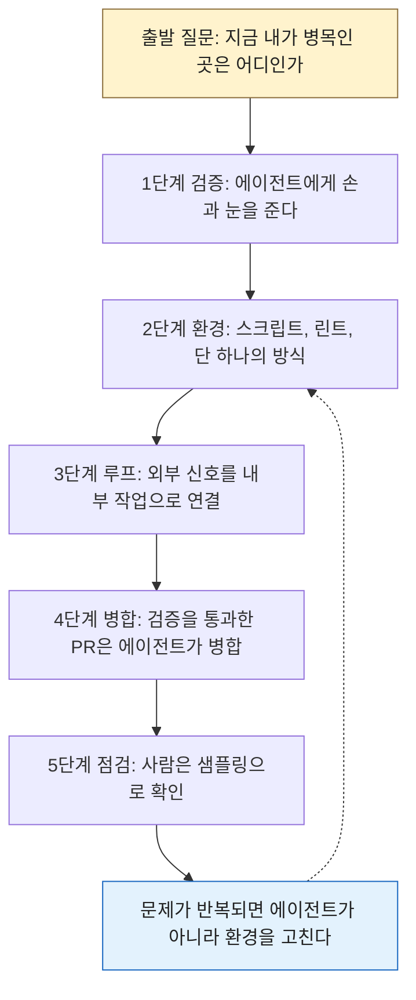
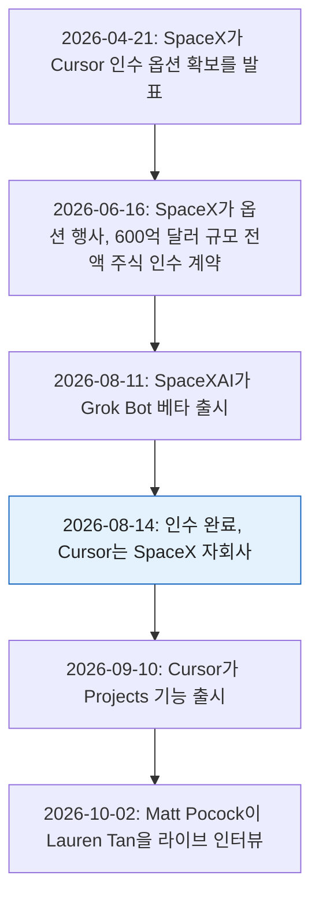
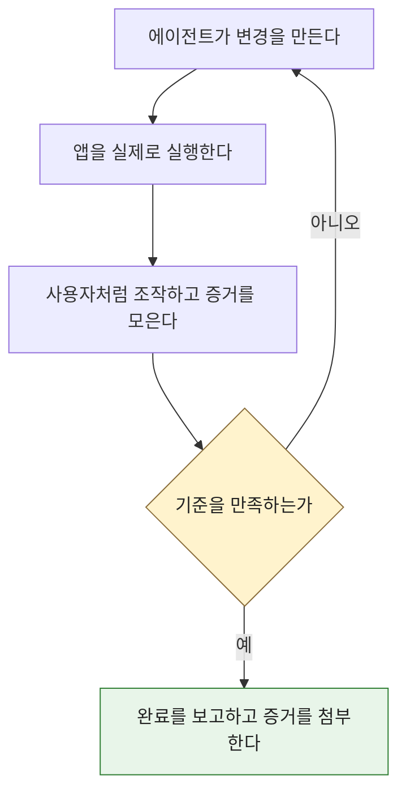
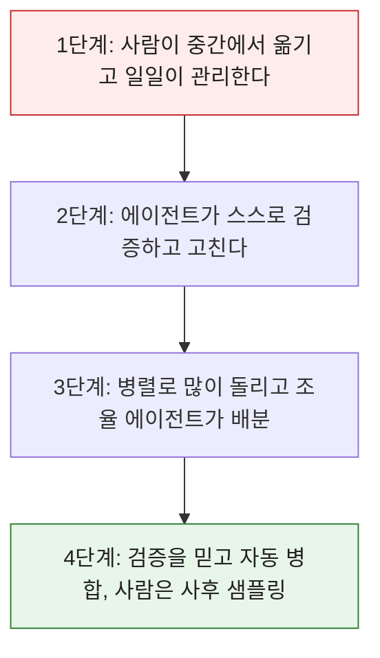
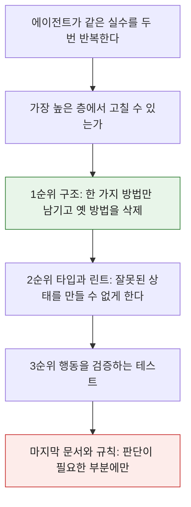
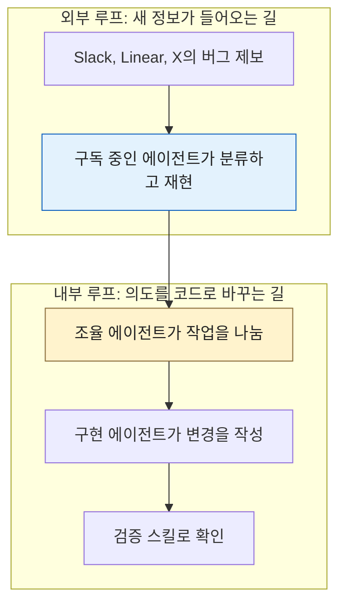
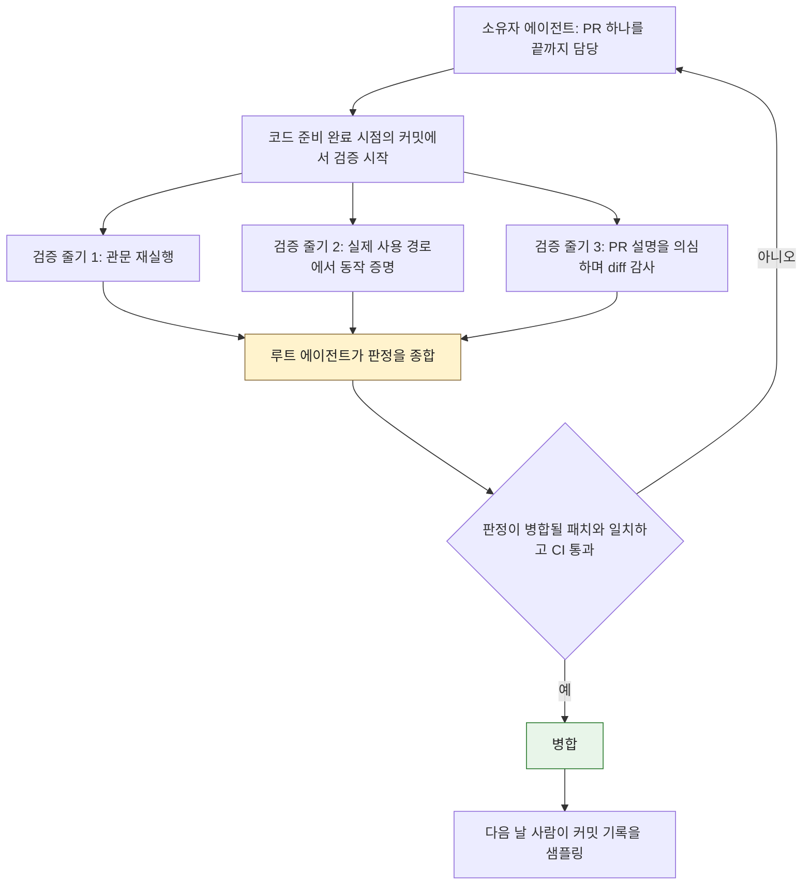
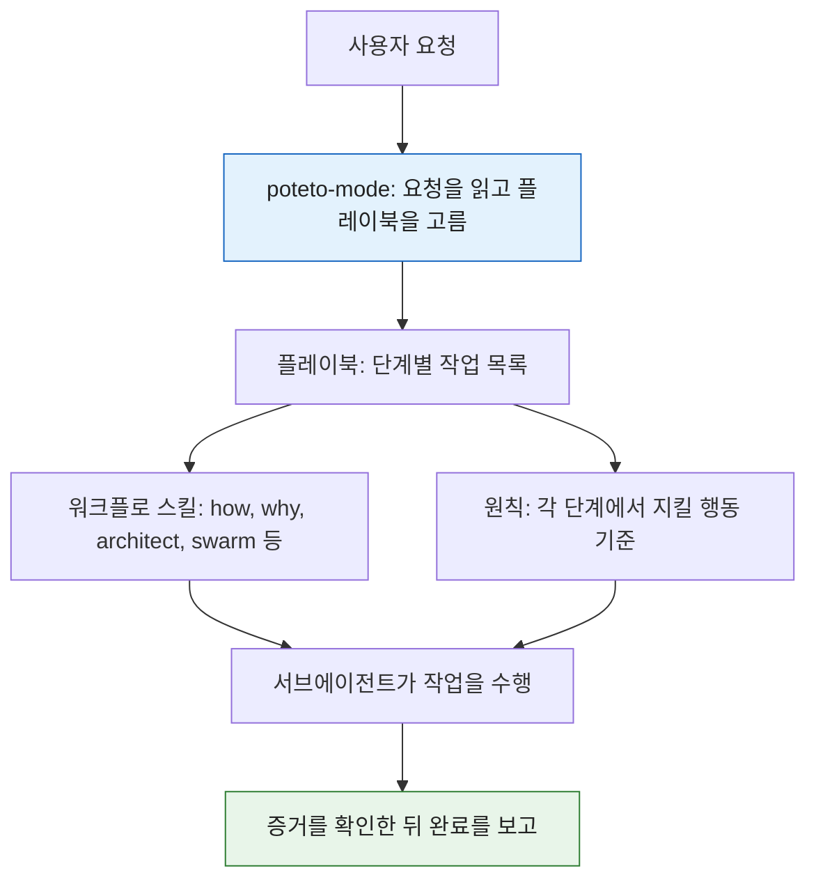

## Poteto(Lauren Tan)의 '미쉐린 주방' 레슨 완전 해설

- **작성 기준일**: 2026-10-06 (서버 시각 확인: 2026-10-06 06:16 KST)
- **다루는 자료**: Matt Pocock 채널의 라이브 인터뷰 ["LIVE: Poteto (creator of pstack) on shipping 1,000's of PR's a month at SpaceX"](https://www.youtube.com/live/MN9dGgmLyso), 그리고 이 인터뷰를 30가지로 정리한 Threads 계정 [aicoffeechat(AICC)](https://www.threads.com/share/_638u2AAO/)의 한국어 스레드
- **문서의 성격**: 인터뷰와 스레드의 내용을 쉽게 풀어 설명하고, 나온 주장을 공식 자료와 해설 기사로 대조해 사실과 해석을 구분한 해설서

---

## 0. 이 문서를 읽는 법

### 0.1 무엇을 근거로 썼는가

이 문서는 세 종류의 자료를 하나로 묶어 해설합니다. 첫째는 Matt Pocock 채널에서 2026년 10월 2일(미국 태평양시 금요일 오전 9시 예고)에 진행된 라이브 인터뷰이고, 둘째는 이 인터뷰를 30가지 교훈으로 정리한 AICC의 한국어 스레드이며, 셋째는 두 자료에 나온 주장을 대조하기 위해 2026-10-06에 검색해서 확인한 공식 문서와 해설 기사입니다.

### 0.2 확인하지 못한 것을 먼저 밝힙니다

영상 전체를 제가 직접 재생해 전사한 것은 아닙니다. 웹 도구로 읽을 수 있었던 것은 영상 페이지의 제목, 설명문, 재생 시간 같은 정보까지였습니다. Threads 원문 링크는 사이트가 자동 접근을 막아 열 수 없었고, 요청해 주신 스레드 전문을 기준 텍스트로 삼았습니다. 그래서 인터뷰 속 발언은 세 곳을 서로 맞춰 보는 방식으로 다뤘습니다. 스레드 전문, 영상을 시간대별로 정리한 제3자 해설(자동 자막 기반), 그리고 별도의 해설 기사입니다. 서로 일치하는 부분은 본문에 그대로 쓰고, 한 곳에서만 확인되는 부분은 그 사실을 표시했습니다.

### 0.3 근거 표기 규칙

본문 곳곳에 다음 다섯 가지 표지를 붙였습니다. 사실과 해석이 섞이지 않게 하려는 장치입니다.

| 표지 | 의미 |
|---|---|
| 【공식】 | 회사나 단체가 직접 공개한 자료(공식 블로그, 변경 이력, 소스 저장소, 제품 페이지) |
| 【저자】 | Lauren Tan 본인이 쓴 글 |
| 【발언】 | 인터뷰에서 Lauren이 한 말. 제가 영상을 직접 듣지 못했으므로 스레드 전문과 제3자 해설을 거쳐 확인한 내용 |
| 【2차】 | 언론, 블로그, 해설자의 정리 |
| 【해석】 | 이 문서 작성자의 설명, 비유, 해석. 근거가 있는 사실이 아니라 이해를 돕기 위한 풀이 |

---

## 1. 한눈에 보기

### 1.1 한 문단 요약

이 이야기의 핵심은 한 문장으로 줄일 수 있습니다. **코드를 직접 짜는 시간을 줄이고, 에이전트가 혼자 일하고 스스로 결과를 증명할 수 있는 환경을 만드는 데 시간을 쓰면, 한 사람이 감당하는 일의 양이 달라진다**는 것입니다. 이야기의 주인공 Lauren Tan(닉네임 poteto)은 자신이 에이전트와 도구 사이를 손으로 이어 주는 '인간 중계기'였다는 것을 깨달은 뒤, 에이전트에게 앱을 직접 실행하고 눈으로 확인하는 능력(검증)을 먼저 주었습니다. 그다음에는 에이전트가 같은 실수를 반복하지 못하게 코드베이스의 구조와 린트 규칙을 손봤고, 마지막으로 새로운 일감이 들어오는 길(Slack, 이슈 트래커 등)을 에이전트에게 직접 연결했습니다. 이 순서가 맞아떨어진 뒤에야 에이전트가 PR을 스스로 병합하고, 사람은 다음 날 아침 기록을 샘플링해서 점검하는 단계에 이르렀다고 합니다.

### 1.2 전체 지도

이 문서의 나머지는 위 다섯 단계를 하나씩 풀어 쓴 것입니다. 스레드의 30가지 교훈은 4장에서 일곱 묶음으로 나누어 모두 다룹니다.

---

## 2. 등장인물과 배경

### 2.1 누가, 누구와, 어떤 자리에서 이야기했나

인터뷰어는 Matt Pocock입니다. 자신의 스킬 라이브러리(mattpocock/skills)를 공개한 개발자 콘텐츠 제작자이고, 이번 라이브의 영상 설명문은 "Lauren Tan(poteto)과 함께, 에이전트로 엄청난 양의 고품질 작업을 내보내는 법을 이야기한다"는 취지입니다【공식】. 영상 페이지에 표시된 재생 시간은 1시간 5분 36초입니다【공식】. Matt는 라이브 이틀 전에 "스킬, 고속 소프트웨어 공장, 에이전트로 출시하는 최신 기법"을 이야기하겠다고 예고했습니다【공식: Matt Pocock의 X 게시물】.

게스트 Lauren Tan은 pstack의 제작자입니다. pstack은 그녀가 매일 쓰는 에이전트용 스킬 묶음을 공개한 것으로, MIT 라이선스로 Cursor의 공식 플러그인 저장소(cursor/plugins)에 들어 있습니다【공식】. 이력은 pstack README의 자기소개를 해설자들이 옮긴 내용에 따르면 Meta, Netflix, Cursor를 거쳤고 React 코어 팀 구성원이며 React Compiler 작업에 참여했습니다【2차】. 스레드는 "Meta React 팀을 나와 번아웃으로 한 달을 쉬었다"고 전하는데, README가 여전히 React 코어 팀 구성원으로 소개한다는 보도와 나란히 놓고 보면 Meta를 떠난 것과 React 오픈소스 코어 팀 소속은 별개로 읽는 것이 자연스럽지만, 이 부분의 정확한 관계는 제가 확인하지 못했습니다. Cursor 합류 시점은 2026년 3월로 보도되었습니다【2차】.

### 2.2 왜 영상 제목에는 'SpaceX'가, 스레드에는 'Cursor'가 나올까

두 표현은 모순이 아닙니다. Cursor가 SpaceX에 인수되었기 때문입니다. 연표로 정리하면 다음과 같습니다.

- 4월의 옵션 발표와 6월 16일의 계약은 CNBC 등 언론 보도로 확인됩니다【2차】. SpaceX가 올해 초 xAI와 합병했다는 점도 같은 보도에 나옵니다【2차】.
- 8월 14일에 인수가 완료되었다는 사실은 Cursor 공식 블로그가 직접 밝혔습니다. 글에서 Cursor는 SpaceX와 함께 세계 최대 규모의 GPU를 활용해 더 강력하고 더 경제적인 모델을 만들겠다고 말합니다【공식】.
- Grok Bot은 SpaceXAI가 8월 11일 베타로 공개했습니다【공식】. 스레드의 "Grokbot", 영상 속 "SpaceX"는 이 흐름 위에 있는 이름입니다.

정리하면 Lauren은 Cursor 소속으로 입사했고, Cursor가 SpaceX에 합류하면서 영상 제목은 SpaceX라는 이름을 쓰게 되었습니다. 스레드가 말하는 "Cursor의 한 엔지니어"와 영상이 말하는 "SpaceX에서 일하는 사람"은 같은 사람입니다. 현재 그녀는 SpaceXAI의 상시 가동 에이전트 제품인 Grok Bot을 만드는 일을 하는 것으로 보도되었습니다【2차】.

### 2.3 AICC 스레드는 어떤 자료인가

스레드는 aicoffeechat 계정이 인터뷰를 보고 한국어로 정리한 **제3자의 요약**입니다. 32개 조각으로 이어진 연재형 게시글이고, 맨 앞에서 "30가지"를 정리했다고 밝힙니다. Lauren 본인이 쓴 글이 아니며, 요약자의 감상("몇 백만원 강의보다 소중한 레슨")도 섞여 있습니다. 이 문서는 그 30가지를 그대로 따라가되, 각 항목이 인터뷰와 공식 자료에서 얼마나 확인되는지 덧붙였습니다.

---

## 3. 가장 먼저 짚을 숫자: "PR 2,500개"

스레드와 영상 제목 모두 '한 달에 PR 수천 개'를 전면에 내세우므로, 이 숫자가 무엇을 뜻하는지부터 정리하는 것이 안전합니다.

| 출처 | 표현 | 성격 |
|---|---|---|
| Lauren의 가이드 1편(2026-08-31) | 한 달에 약 2,000개 PR을 프로덕션에 | 【저자】 본인 집계 |
| Lauren의 가이드 2편 | 8월을 2,462개 PR로 마감 | 【저자】 본인 집계 |
| 발표 영상 제목(2026-09-21경 게시) | 지난달 2,500개 PR | 【저자】【2차】 |
| 인터뷰 중 발언 | "2000 or however many" 정도로 표현 | 【발언】 제3자 해설 인용 |
| 인터뷰 영상 제목 | 한 달에 수천 개(1,000's) | 【공식】 영상 제목 |

이 표에서 읽어야 할 점은 세 가지입니다.

**첫째, 모든 수치는 본인이 집계한 것이고 외부 감사가 없습니다.** 해설자들도 같은 점을 명시합니다【2차】. 숫자가 2,000, 2,462, 2,500으로 조금씩 다른 것도 이 때문에, 하나의 정답을 단정하지 않고 "약 2,000~2,500개, 자기보고"라고 읽는 것이 정확합니다.

**둘째, PR 하나가 기능 하나가 아닙니다.** 본인이 인터뷰에서 직접 이 점을 짚었고, 스레드도 24번 항목에서 같은 이야기를 합니다. 상당수는 그녀가 '코드 가꾸기(gardening)'라고 부르는 정리, 구조 개선, 나쁜 패턴 삭제 작업입니다【발언】.

**셋째, 도구의 출시 시점과 숫자의 시점이 겹치지 않는 부분이 있습니다.** Grok Bot의 베타 출시는 8월 11일, Cursor Projects는 9월 10일입니다【공식】. 그런데 2,462개는 8월 한 달의 숫자입니다. 한 해설자는 그래서 "이 도구들이 그 달 PR 수의 공로를 전부 차지하는 것은 아니다"라고 편집자 주를 달았습니다【2차】. 다만 Grok Bot은 공식 발표문에 따르면 내부 프로토타입 단계부터 사내에서 쓰였으므로, 정식 출시일만으로 사용 시점을 재단할 수도 없습니다【공식】. 결론은 "이 숫자를 특정 도구 하나의 성과로 환산하지 말라"는 정도로 둡니다.

참고로 pstack 공개 당시 Cursor 내부에서 Lauren의 스킬이 일주일에 약 9,000~10,000회 쓰였다는 보도가 있는데, 해설마다 수치가 달라 정확한 값은 확인하지 못했습니다【2차】.

---

## 4. 30가지 교훈 풀어 읽기

스레드의 30가지를 일곱 묶음으로 나누어 설명합니다. 각 항목의 번호는 스레드의 순서와 같습니다.

### 4.1 출발점: 병목은 나였다 (1~5번)

**1. 번아웃 휴가 중 시작한 개인 프로젝트.**
Lauren은 Meta의 React 팀을 떠나 번아웃으로 한 달을 쉬던 중 개인 프로젝트를 시작했습니다. 한 해설은 시기를 2월 무렵으로 적습니다【2차】. 당시에는 터미널에서 직접 만든 '오케스트레이터'(여러 에이전트를 조율하는 프로그램)를 자랑하는 분위기였고, 그녀도 AI 코딩 환경을 더 효율적으로 만드는 일에 빠져 있었습니다. 문제는 에이전트 하나를 일일이 관리하는 데 몇 시간씩 쓰고 있었다는 점, 그리고 스킬(에이전트에게 작업 방법을 적어 주는 지침 문서)을 만들었지만 효과를 잴 방법이 없어 앞이 안 보이는 상태였다는 점입니다. 이 프로젝트의 이름은 noodle이고, 본인은 이것이 나중에 pstack의 바탕이 되었다고 말한 것으로 정리됩니다【발언】【2차】. 그래도 개선을 아주 빠르게 반복했다는 말이 이 대목의 마무리입니다.

**2. 내가 병목, '인간 중계기'였다.**
Cursor에 합류한 뒤 맡은 첫 과제는 에이전트 창이 버벅거리는 성능 문제였습니다. React 경험 때문에 받은 제안이었습니다. 처음에는 플레임 그래프(어떤 함수가 시간을 얼마나 쓰는지 불꽃 모양으로 보여 주는 성능 분석 도표)와 힙 스냅샷(메모리 사용 상태를 찍어 둔 기록)을 직접 들여다보며 원인을 찾았습니다. 그러다 자신이 에이전트와 Chrome 개발자 도구 사이에서 눈으로 본 것을 말로 옮겨 주는 중계기, 즉 영어로 'meat proxy' 노릇을 하고 있다는 것을 깨달았습니다【발언】. 이 시점이 2026년 4월 초로 보도되었습니다【2차】. 이 깨달음이 이후 모든 판단의 출발점이 되므로, 5장 이후에도 같은 질문이 계속 돌아옵니다. "지금 나는 어디서 사람 중계기 노릇을 하고 있는가."

**3. 쉬운 선택을 올바른 선택으로.**
Cursor에 입사한 뒤 그녀는 예전에 만든 스킬이 이제 쓸모없을 거라 생각해 버려 두었습니다. 그런데 에이전트 창과 Grok Bot을 만들면서, 초기 스킬에서 배운 교훈, 특히 검증을 철저히 하는 습관이 여전히 유효하다는 것을 알게 됩니다. 그녀의 경험상 최첨단 모델조차 지름길을 택하고 쉬운 일을 하려는 경향이 있습니다. 그래서 스킬 상당수는 "쉬운 선택이 곧 옳은 선택이 되도록" 설계하는 데 초점을 맞췄다고 합니다【발언】. 예컨대 어떤 일이 끝났다고 말하려면 빌드가 통과했다는 사실이 아니라 실제 결과물로 증명해야 한다는 규칙을 에이전트 쪽에서 가장 쉬운 길로 만드는 식입니다. pstack이 공개한 원칙 중에는 완료를 컴파일 성공이나 에이전트의 자기 보고가 아니라 실제 산출물로 검증하라는 항목이 있습니다【2차】.

**4. AI 시대, 전문성이 더 중요해진다.**
AI 때문에 분야 전문성의 가치가 줄어든다는 시각에 대해 그녀는 오히려 어느 때보다 중요해졌다고 봅니다. 모델이 좋아질수록 병목은 에이전트의 능력이 아니라, **내 의도와 목표를 에이전트가 이해하고 실행할 수 있게 명확히 표현하는 능력**이 되기 때문입니다【발언】. 의사나 변호사처럼 공학 밖에서 깊은 전문성을 가진 사람이 기술을 조금만 알아도 크게 유리하다는 예시가 이어집니다. 머릿속 구상이 선명하고 그것을 설명할 수 있다면 훌륭한 제품을 만들 수 있다는 것입니다.

**5. 에이전트가 꽂히는 단어의 힘.**
에이전트가 등장한 뒤로 단어의 조합과 표현에 숨은 뜻에 계속 빠져 있었다고 합니다. 가장 좋은 순간은 에이전트가 어떤 단어에 '꽂혀서' 그것을 사고 과정에서 계속 다시 쓸 때입니다. 초기 사례가 TDD입니다. 에이전트가 TDD를 정확히 지켜야 하는지는 중요하지 않고, 그 단어가 에이전트로 하여금 테스트를 생각하고 쓰게 하면서 우선순위를 바꿔 놓는 것이 핵심입니다. 집요하게 캐묻는 방식(Matt가 즐겨 쓰는 'grill' 류의 질문법)이 통하는 이유도 그런 단어를 끌어내기 때문이라는 설명입니다【발언】. 인터뷰에서는 Matt가 최근 공유한 'tautological(항진적)'이라는 단어를 Lauren이 가져다 써서 의미 없는 테스트를 줄였다는 사례도 나왔다고 정리됩니다【2차】. 항진적 테스트란 코드가 무엇을 하든 통과해 버려서 아무것도 증명하지 못하는 테스트입니다. 실제로 pstack의 교정 스킬에는 "모든 함수가 아무것도 반환하지 않아도 통과할 테스트는 고치거나 지우라"는 취지의 규칙이 있다고 해설됩니다【2차】.

### 4.2 미쉐린 주방이라는 비유 (6~8번)

세 항목은 한 덩어리의 비유입니다. 먼저 대응표로 정리하면 이해가 빠릅니다.

| 주방의 세계 | 소프트웨어의 세계 |
|---|---|
| 혼자 하는 집밥 | 엔지니어가 코드를 전부 직접 쓰는 방식 |
| 주방에 들어온 가족들 | 한 코드베이스에서 동시에 일하는 여러 에이전트 |
| 조리 도구가 어디 있는지 모르는 사람 | 코드베이스 구조와 도구를 모르는 에이전트 |
| 총주방장(셰프) | 환경과 방식을 조직하고 최종 책임을 지는 엔지니어 |
| 식재료 | 스킬, 환경, 코드베이스 |
| 메뉴 맛보기 | 에이전트가 만든 PR 점검 |
| 비서실장·총괄 셰프 | 일을 나눠 주는 조율 에이전트 |

*이 표는 스레드의 비유를 정리한 설명용 대응표입니다【해석】.*

**6. 소프트웨어 공장 대신 미쉐린 주방.**
인터뷰어 Matt는 대화를 '소프트웨어 공장'이라는 틀로 열었지만, Lauren은 그 말을 좋아하지 않는다고 했습니다. 틀린 표현이라서가 아니라, 공장이라고 하면 사람들이 품질이나 장인정신보다 생산량을 떠올리기 때문입니다. 제품을 만드는 사람에게 중요한 것은 사용자 경험이고 만드는 일 자체입니다. 그래서 더 지향점이 되는 비유로 '미쉐린 주방'을 골랐습니다. 자기 먹을 밥을 하는 일이 실용적인 일이라면, 셰프는 평범한 재료로 어린 시절을 떠올리게 하는 한 끼를 만들어 냅니다【발언】. 해설에 따르면 그녀는 이 비유가 '신뢰의 사다리'와 맞아떨어진다고도 했습니다【2차】. 신뢰의 사다리는 Matt의 첫 질문에 나온 개념으로, 에이전트를 믿을수록 더 어려운 일을 맡기고 동시에 더 많이 돌릴 수 있게 된다는 뜻입니다【2차】.

**7. 주방에 온 가족이 들어오면 생기는 일.**
집에서 요리하는 사람은 채소 손질부터 재료 준비, 뒷정리까지 혼자 다 합니다. 그런데 파트너, 형제자매, 온 가족이 주방에 들어오면 대부분 스트레스를 받습니다. 다들 조리 도구가 어디 있는지도 모르기 때문입니다. 혼자 요리하다 보조 셰프를 몇 명 두려면 일을 합리적으로 나누어야 하고, 나누기 위해 나누는 것이 아니라 **합쳤을 때 결과가 각자 한 일의 합보다 좋아지도록** 나누어야 합니다【발언】. 에이전트 여러 대를 풀어 놓기 전에 "이 일을 나누면 합이 더 커지는가"를 먼저 묻는다는 뜻입니다. '조리 도구가 어디 있는지 모른다'는 대목은 에이전트가 처음 보는 코드베이스에서 겪는 상황과 겹칩니다【해석】.

**8. 셰프는 주방의 기술 책임자다.**
셰프는 모든 음식을 직접 만들지 않고 주방 전체를 조직합니다. 언제 재료를 주문하고, 어떻게 보관하고, 언제까지 준비할지 정하는 것은 요리와는 별개의 일입니다. 요즘 엔지니어도 같습니다. 코드는 에이전트가 짜더라도 최종 결과에 대한 책임은 사람에게 있고, 작업에는 내 이름과 평판이 걸려 있습니다. 그래서 스킬, 환경, 코드베이스를 어떻게 구성하느냐가 제품을 만드는 새로운 '재료'가 됩니다【발언】.

### 4.3 검증이 모든 것의 토대 (9~13번)

**9. 가장 중요한 스킬 하나, 검증.**
어떤 스킬 모음을 쓰든 툴킷에 꼭 있어야 할 스킬은 검증이라고 그녀는 말합니다. 검증이란 에이전트에게 **손과 눈**을 주는 것입니다. 에이전트가 직접 앱을 실행하고, 사용자처럼 써 보고, 디버깅하고, 트레이스와 스냅샷을 뜰 수 있게 하는 것입니다【발언】. Cursor에서 처음 만든 스킬이 바로 이것이었고, 이 스킬 덕분에 '신뢰의 사다리'를 오르기 시작했습니다. 반면 how, why, unslop 같은 다른 스킬만으로는 여전히 그녀가 결과와 에이전트 사이를 중개해야 했습니다. 에이전트가 결과를 직접 볼 수 없으면 반복 개선도 할 수 없기 때문입니다.

pstack에는 이 검증 스킬을 만들어 주는 스킬(create-verification-skill)이 들어 있습니다. 해설에 따르면 이 스킬은 저장소를 조사한 뒤 프로젝트 전용 검증 스킬을 쓰는데, 고정된 여섯 부분을 갖춥니다【2차】.

| 부분 | 하는 일 |
|---|---|
| Launch(실행) | 앱을 켜는 정확한 명령과 준비 완료를 알아보는 방법 |
| Doctor(점검) | 이 인스턴스를 조작할 가치가 있는지 읽기만 하는 한 번의 확인 |
| Drive(조작) | 이 저장소의 실제 선택자와 명령. 자리표시자 금지 |
| Evidence(증거) | 무엇을 어디에 남길지, 증거는 실제 사용자 경로에서 나와야 한다는 규칙 |
| Cleanup(정리) | 내가 띄운 것만 종료하고 증거는 지우지 않기 |
| Helpers(보조) | 제공하는 스크립트는 실행 가능해야 하고 호출 방법을 명시 |

문서의 마지막 줄은 실행해 본 적 없는 생성물은 완성품이 아니라 초안이라는 취지의 경고입니다【2차】. 또 앱의 기능 지도(Feature Map)를 만들어 두고 유지보수 스킬(maintain-verification-skill)로 갱신하는 방식도 쓰입니다. 하루에 한 번 이상 갱신하길 권한다고 소개됩니다【2차】.

**10. 루프를 루프로 만드는 건 검증.**
'루프'라는 말은 추상적으로 들리지만, 그녀가 보기에 루프를 루프로 만드는 핵심은 검증입니다. 에이전트가 자기 작업을 스스로 검증하면 사람이 끼어들 필요가 없어집니다. 처음 활용한 사례는 Cursor 에이전트 창의 성능 개선이었습니다. 연구소에서 말하는 '힐 클라이밍', 즉 평가 기준을 두고 에이전트가 계속 개선을 시도하게 하는 방식을 목표로 했고, Andrej Karpathy의 autoresearch에도 같은 아이디어가 많이 담겨 있다고 합니다【발언】.

autoresearch는 공개 저장소로 확인됩니다. 구조는 단순합니다. 에이전트는 학습 코드 파일 하나만 고치고, 학습은 정확히 5분으로 고정되며, 평가 지표(val_bpb, 낮을수록 좋음)가 개선되면 변경을 유지하고 아니면 버립니다. 사람은 코드가 아니라 에이전트에게 주는 지침 문서(program.md)를 다듬습니다. 밤새 약 100번의 실험을 돌려 놓고 아침에 결과 기록을 본다는 설계입니다【공식】. 평가 기준이 있기에 에이전트가 "더 좋아졌는가"를 스스로 판단할 수 있다는 점이 힐 클라이밍의 본질입니다.

**11. 검증 스킬에 CLI를 넣은 이유.**
스킬에 CLI(명령줄 도구)를 넣은 이유 중 하나는 컨텍스트(에이전트가 한 번에 기억해 두는 작업 공간)를 아끼려는 것이었습니다. 작년 말에서 올해 초에는 압축·요약 성능이 좋지 않아, 한 번 압축하면 에이전트가 멍청해진다는 농담이 돌 정도였습니다. 지금은 요약이 많이 좋아졌지만 깨끗한 컨텍스트에는 여전히 이점이 있습니다. 해설에 따르면 CLI가 남은 더 큰 이유가 하나 더 있습니다. CLI가 없을 때는 에이전트마다 검증 환경을 새로 구성했고 방식도 제각각이었으며, 잘 돌아간 스크립트도 쓰고 나면 버려졌습니다. 같은 도구를 모든 에이전트가 호출하게 하면 이 낭비가 사라집니다【2차】. 그녀 스스로는 이 CLI를 새로울 것 없는, Playwright와 Chrome DevTools Protocol을 묶는 접착제 정도로 겸손하게 설명합니다【2차】. 그녀에게 CLI는 스킬이 하는 일 중 절차가 정해진 부분을 스크립트로 옮겨 쓸데없이 판단이 들어가는 일을 없애는 수단입니다. pstack의 원칙에는 반복되는 수작업을 도구로 만들라는 'Build the Lever(지렛대를 만들라)'가 있습니다【2차】.

**12. 판단은 에이전트에, 절차는 코드에.**
그녀는 작업을 연속선으로 봅니다. 한쪽 끝에는 여러 맥락을 모아 생각해야 하는 판단 중심의 일이 있고, 다른 쪽 끝에는 한 패턴에서 다른 패턴으로 바꾸는 리팩터링처럼 기계적인 일이 있습니다. 기계적인 일을 에이전트가 매번 새로 고민할 필요는 없습니다. 그래서 절차가 정해진 부분은 코드로 빼내고 판단이 필요한 부분만 에이전트에게 남깁니다. 스킬은 그 맞춤 도구의 사용법을 짧게 적은 포장이 됩니다【발언】.

**13. 결정론과 비결정론을 나눠 써라.**
같은 입력에 항상 같은 결과를 내는 처리를 '결정론적'이라 하고, 매번 달라질 수 있는 AI의 판단을 '비결정론적'이라고 부릅니다. 핵심 원칙은 둘을 효율적으로 나눠 쓰는 것입니다. 에이전트는 판단이 필요한 곳에서 능력을 발휘하게 하고, 기계적이고 단순한 곳은 순수하게 결정론적으로 처리합니다. 에이전트가 쓰기 좋은 기술로 옮기는 대규모 마이그레이션의 상당 부분도 코드모드, 즉 코드의 문법 구조(AST)를 훑으며 기계적으로 바꾸는 스크립트가 맡을 수 있습니다【발언】. 100개 파일을 에이전트가 하나씩 다시 쓰는 것보다, 변환 규칙을 한 번 쓴 스크립트가 100개를 같은 방식으로 바꾸는 쪽이 빠르고 실수도 적다는 뜻으로 읽힙니다【해석】.

### 4.4 새로운 직무: 환경 만들기 (14~17번)

**14. 엔지니어의 새 직무는 환경 만들기.**
에이전트를 믿을 수 있게 만들고 스킬과 도구를 갖추는 데 시간을 쓰지 않으면 신뢰의 사다리 맨 아래에 갇힙니다. 에이전트의 작업을 믿지 못하니 일일이 관리하는 수밖에 없고, 그건 시간이 아주 많이 들며, 그 상태로는 자기 생산성을 높이는 같은 더 큰 문제를 생각할 여유조차 없습니다【발언】. 아래 도식은 '신뢰의 사다리'를 이해하기 쉽게 단순화한 것으로, 인터뷰에서 이 네 단계가 이렇게 명시된 것은 아닙니다【해석】.

**15. 무딘 칼로는 미쉐린 주방 못 한다.**
메모장만 알고 VS Code도 Vim도 Git도 모르는 채 코드를 짜는 개발자를 떠올려 보라고 합니다. 칼을 갈지 않으면 모든 일이 오래 걸리고, 마감이 다가오면 좋은 도구도 없이 출시 압박에만 매달리는 굴레에 갇힙니다. 마늘 써는 게 느리면 마늘 으깨는 도구를 사면 되듯, 도구는 이유가 있어서 발명되었습니다. 미쉐린 주방의 요리사들에게 도구가 없다면 모든 것이 비효율적이고 다들 제각기 자기 방법을 지어낼 것이라는 이야기입니다【발언】.

**16. 방법이 하나뿐인 코드베이스.**
그녀가 만드는 Dune은 오픈소스가 아닌 사내 프레임워크로, Electron 앱용 사내 Next.js 같은 것입니다. 아주 엄격한 린트 규칙(코드 스타일과 위험한 패턴을 자동으로 검사하는 규칙)을 갖추고, 무언가를 하는 방법이 하나뿐이도록 설계되어 있습니다. 기능마다 자기 폴더가 있고, 등록 목록과 코드베이스 탐색으로 기능을 찾아냅니다. 이런 관례와 린트 규칙 덕분에 나쁜 코드를 짜기가 매우 어렵고, 사람의 머리도 가벼워지며, 에이전트도 새 기능을 거대한 파일에 덧붙이지 않고 기능 폴더에 넣게 됩니다【발언】. 다만 Dune이라는 이름은 공개 저장소로 확인되지 않고, 해설 기사와 스레드에서만 확인됩니다. 한 해설자는 이 이름이 자동 자막에서 옮겨진 것이라 이름 자체는 검증하지 못했다고 적었습니다【2차】.

**17. 1만 줄 갓 파일 8개에서 배운 것.**
기능별 폴더를 만든 계기는 Grok Bot 초기 버전이 최소 1만 줄짜리 거대 파일('갓 파일') 8개로 이뤄져 있었기 때문입니다. 에이전트가 계속 덧붙이기만 한 결과였고, 작은 조각으로 나누어야 했습니다【발언】【2차】. 중요한 것은 에이전트가 **어떻게 실패하는지 관찰하는 것**입니다. 실수나 아쉬운 점을 볼 때마다 한 발 물러나, 이걸 어떻게 린트 규칙으로 만들지, 아예 코드베이스에서 불가능하게 만들 수 없을지 고민합니다. 이는 TypeScript 타입 시스템을 배우며 했던, 가능한 범위를 좁혀 가는 고민과 닮았다고 말합니다【발언】.

이 습관은 pstack에 아예 절차로 들어 있습니다. 인터뷰 다음 날인 2026-10-03에 저장소에 추가된 교정(correct) 스킬은 같은 종류의 실수가 두 번 일어나면 그 실수 유형으로 인정하고, **가장 높은 층에서 고치라**고 안내합니다. 먼저 구조(한 가지 방법만 남기고 옛 방법 삭제), 그다음 타입과 린트, 그다음 행동을 검증하는 테스트, 문서와 에이전트 규칙은 가장 마지막입니다. 문서는 에이전트가 건너뛰어도 아무것도 실패하지 않기 때문입니다【2차】.

*위 도식의 순서는 해설 기사가 교정 스킬 문서를 요약한 것을 따랐고, 제가 원문 저장소를 직접 열람하지는 못했습니다(GitHub가 자동 접근을 막음).*

### 4.5 규모의 비밀: 두 개의 루프와 비서실장 (18~24번)

**18. PR 2,500개의 전제 조건.**
PR을 대량으로 만들려면 먼저 환경이 갖춰져야 합니다. 주방과 칼, 에이전트가 쓸 도구를 고민하는 데 시간을 쓰지 않았다면 절대 못 했을 일입니다. 그녀는 주방 하나, 식당 하나를 제대로 만들어 둔 덕분에 이제 자기가 그 자리에 없어도 된다고 말합니다. 스레드는 이를 총주방장에게 비결을 다 가르친 Gordon Ramsay가 두 번째, 세 번째 식당을 여는 것에 비유합니다. 큰 채팅 하나하나가 식당이고, 그녀는 여러 곳을 동시에 운영하며 헬기를 타듯 오간다는 것입니다. 'Gordon Ramsay' 비유는 제가 확인한 해설에는 나오지 않아 스레드에서만 확인되는 표현이고, 식당을 여러 개 운영하며 헬기처럼 오간다는 부분은 해설에도 있습니다【발언】【2차】.

**19. 내부 루프와 외부 루프.**
버그 제보는 Slack, Linear, X 같은 외부 시스템으로 들어오는데, 이들은 내부 작업 흐름과 연결되어 있지 않습니다. 그녀에게 **내부 루프**는 에이전트 엔지니어들이 그 시점에 담아 둔 의도를 향해 코드를 짜는 과정입니다. 그런데 그 의도는 새로운 정보가 나오면 낡습니다. 정보를 끌어오는 장치가 없으면 사람이 Slack이나 X를 돌며 버그 제보, 기능 요청, 백엔드의 한계 같은 맥락을 모아 에이전트에게 직접 실어 날라야 합니다. 이 새 정보가 들어오는 길이 **외부 루프**입니다. 그녀는 이 용어를 자기가 올바르게 쓰는지 확신이 없다고 스스로 덧붙였습니다【발언】【2차】.

**20. Slack 채널 구독하는 에이전트.**
Slack MCP(에이전트가 외부 서비스에 접속하는 표준 방식)를 쓰거나, 직접 만든 에이전트 실행 환경에 특정 채널 구독 기능을 넣으면 이렇게 지시할 수 있습니다. 버그 제보가 올라올 때마다 분류하고, 이미 만들어 둔 검증 스킬로 직접 재현해 보라고요. 그녀는 에이전트가 버그를 파악하고, 기본 브랜치에 아직 버그가 있는지, 사용자 설정이나 데이터, 의존성 미설치 같은 다른 원인은 아닌지까지 확인할 수 있다고 믿습니다. 두 루프를 만들고 연결하는 것이 요즘 업무에서 정말 중요한 부분이라고 말합니다【발언】.

이 기능은 공식 자료로도 확인됩니다. Cursor의 Projects 출시 글은 조율 에이전트에게 Slack 채널을 지켜보게 하거나 일정에 따라 돌리게 하거나 내 PR을 모두 따라가게 할 수 있다고 소개하며, 버그 제보 채널에 연결하면 제보가 들어올 때마다 위임을 시작하는 예를 듭니다【공식】.

**21. 내가 어디서 병목인지 늘 물어라.**
스스로를 확장하려면 이 과정에서 내가 어디서 병목인지, 에이전트가 왜 나를 필요로 하는지 늘 물어야 합니다. 목표는 에이전트가 지어내거나 추측하지 않고 **실제 데이터로 자기 질문에 답하게** 하는 것입니다. 회사 브레인이나 컨텍스트 그래프 같은 말은 불필요하게 복잡하고 추상적이라고 봅니다. 원래 직접 전달하던 정보를 에이전트가 스스로 가져오도록 가르치면 된다는 것입니다. 한 달에 PR 2,000개 이상이 가능한 것도 이런 루프를 다 갖춰 두었기 때문이라고 합니다【발언】.

**22. 통제 대신 맥락을 주라.**
그녀가 Netflix에서 일할 때 관리자들이 가장 중요하게 이야기한 원칙이 '통제 대신 맥락(context, not control)'이었고, 이것이 에이전트 세계에도 그대로 적용된다고 합니다. 세세하게 통제해서 원하는 결과로 몰아갈 수도 있지만, 바람직한 것은 맥락을 제공하는 것입니다. 에이전트든 엔지니어든 스스로 일하는 법을 가르쳐 주면 일일이 간섭할 필요가 없어집니다【발언】. Grok Bot 같은 개인 에이전트는 이메일, 캘린더, Slack 같은 서비스와 연결되어 업무에 필요한 맥락을 가져옵니다.

공식 발표에 따르면 Grok Bot은 클라우드의 자기 컴퓨터를 갖고, 사용자가 쓰는 도구에 로그인해서 앱과 받은 편지함 등을 넘나들며 일합니다. 깔끔한 API나 MCP가 없는 플랫폼에서도 일할 수 있다고 설명합니다【공식】. 이 부분은 6장에서 더 정리합니다.

**23. 일하지 않는 비서실장 에이전트.**
Grok Bot은 Cursor와 연결되고, Cursor에는 Projects라는 새 기능이 있습니다. 프로젝트를 만들면 클라우드에서 자기 컴퓨터를 쓰는 조율 에이전트가 생깁니다. 이 에이전트는 총괄 셰프나 비서실장처럼 직접 일하지 않고, 하위 에이전트에게 위임하고 조율하고 맥락을 전달하며 일을 밀고 나갑니다. 이슈 30개가 한꺼번에 쏟아져도 이를 받아 여러 에이전트 구조 중 가장 효율적인 방식으로 팀에 작업을 나눠 줍니다【발언】.

공식 변경 이력(2026-09-10)과 정확히 맞는 설명입니다. 조율 에이전트는 코드를 직접 쓰지 않고, 작업을 계획하고 구현 에이전트에게 위임하며, 끝난 일을 사용자에게 돌려줍니다. 프로젝트는 클라우드의 자체 컴퓨터에서 돌기 때문에 노트북을 닫아도 멈추지 않습니다【공식】. 해설에 따르면 Lauren은 이런 조율 에이전트를 지금 10개 넘게 동시에 운영한다고 하며, 하나는 Grok Bot 데스크톱 성능, 하나는 사용자 제보 버그를 맡는 식입니다【2차】. 이슈를 하나씩 에이전트에게 맡기지 않고 묶어서 보는 이유도 설명됩니다. 비슷한 제보들은 뿌리가 같은 경우가 많아서, 따로 고치면 중복 작업이 되고 진짜 문제가 한 층 위에 있다는 사실을 놓칠 수 있기 때문입니다【발언】.

**24. PR 2,500개는 기능 2,500개가 아니다.**
PR 2,500개가 기능 2,500개라는 뜻은 아닙니다. 작업의 상당 부분은 그녀가 좋아하는 표현인 '코드 가꾸기'에 들어갑니다. 이건 함께 일하는 사람 개발자가 많을수록 더 중요합니다. 좋은 환경은 나와 에이전트뿐 아니라 팀원 모두를 돕기 때문입니다. 팀의 개발 관행을 모르는 신입도 환경이 잘 갖춰져 있으면 품질 낮은 PR을 잔뜩 올리는 대신 첫날부터 좋은 코드를 만들어 낼 수 있습니다【발언】. 3장에서 다룬 숫자 해석의 핵심이 바로 이 항목입니다.

### 4.6 품질 관리: 쌓아두기, 샘플링, 자동 병합 (25~28번)

**25. 바로 고치지 말고 먼저 쌓아둬라.**
React에는 실수하기 쉬운 함정이 많아서, 그녀는 나쁜 패턴을 계속 찾는 에이전트를 둡니다. 흥미로운 점은 바로 고치라고 하지 않고 **문서에 추가**하게 한다는 것입니다. 며칠마다 그 문서를 보면 사실 다 같은 문제였다는 것이 보입니다. 쏟아지는 지시를 빠르게 처리하는 데만 몰두하면 큰 그림을 놓치기 쉽습니다. 버퍼나 대기열이 있으면 사람이든 에이전트든 패턴을 알아볼 수 있고, 비서실장 에이전트도 실행과 함께 숲 전체를 봅니다【발언】.

**26. 전부 맛볼 수 없으면 샘플링하라.**
규모가 커지면 주방에서 나오는 요리를 전부 맛볼 수 없고, 공장의 품질 관리자처럼 일부를 골라 확인해야 합니다. 매일 PR과 에이전트가 쓴 코드를 엄격하게 살피며 비효율과 나쁜 패턴을 찾습니다. 그리고 문제를 고칠 때는 그 에이전트 하나가 아니라 **환경**을 바로잡습니다. 한 번뿐인 일이면 넘어가도 되지만, 여러 에이전트가 같은 지름길이나 임시방편을 쓰고 있다면 신호입니다. 그때는 스킬, 제약, 린트, 타입 시스템을 조정해 재발을 막습니다【발언】. 앞서 본 교정 스킬의 '같은 실수가 두 번 일어나면' 기준과 같은 철학입니다【해석】.

**27. 병합 후에 리뷰하는 완전 자동 모드.**
환경을 갖춘 뒤 그녀는 PR이 반영된 뒤에 검토하는 단계에 이르렀습니다. pstack의 완전 자동 모드(autopilot-full)를 켜면 PR마다 검증 에이전트를 여럿 만들어 강도 높은 검증 루프를 돕니다. 실제로 앱을 실행하고 사람처럼 클릭하며 퍼징(무작위에 가까운 입력으로 오류를 캐내는 시험)해서 기존 기능이 망가졌는지, 구현에 버그가 있는지 찾고 스스로 고칩니다. 이를 반복해 PR을 반영할 수 있는 상태로 만듭니다. 토큰이 많이 들지만 검증 에이전트를 10개 대신 1개로 줄이는 식으로 조절할 수 있습니다【발언】.

여기서 가장 흔한 오해가 "AI가 검토 없이 마음대로 병합한다"입니다. 완전 자동 모드의 플레이북을 해설한 기사에 따르면 규칙은 훨씬 엄격합니다. PR을 쓴 에이전트가 자기 판단으로 병합하는 구조가 아니며, **병합 권한은 독립 검증자들의 판정을 종합하는 루트 에이전트에게서 나옵니다**【2차】.

| 관문 | 플레이북이 요구하는 것(해설 기준) |
|---|---|
| 누가 병합하나 | PR 하나당 소유자 에이전트 하나. 운영자가 지정한 항목은 사람이 맡고 에이전트는 병합하지 않음 |
| 검증은 언제 도나 | 소유자가 코드 준비 완료를 선언한 시점의 커밋에서, 그리고 패치가 바뀌는 이후 푸시마다 다시 |
| 검증자는 무엇을 하나 | 서로 독립된 여러 줄기. 관문 재실행, 실제 사용 경로에서 동작 증명, PR 설명을 의심하며 diff 감사 |
| 병합 조건 | 판정이 실제 병합될 패치와 일치하고, 기본 브랜치 위로 새로 리베이스한 커밋에서 CI 통과 |
| 감사와 중단 | 루트 에이전트가 매시간 모든 소유자를 감사. 운영자의 중단 명령은 모든 소유자에게 쓰기 금지로 전달 |

*위 표와 도식은 해설 기사의 요약이며, 해당 플레이북 원문은 제가 직접 열람하지 못했습니다【2차】.*

**28. 자는 동안 에이전트가 병합한다.**
그녀에게 확신을 주는 것은 검증과 환경, 이 두 가지의 조합입니다. 덕분에 에이전트에게 알아서 병합하라고 하고, 아침에 커밋 이력을 보며 검토합니다. 문제가 보이면 되돌리거나 수정하고 새 린트 규칙을 추가합니다. 거기까지 가는 데 시간은 걸리지만 일단 도달하면 마법 같다고 합니다. 무인 공장을 처음 켠 날에는 밤사이 뭔가 망가뜨릴까 봐 무서웠고 큰 용기가 필요했지만, 지금은 잠을 훨씬 잘 잔다고 말합니다【발언】. 인터뷰에서 Matt는 이것이 Karpathy가 처음 정의한 '바이브 코딩'(코드를 거의 들여다보지 않는 방식)과 다르다고 짚었고, 그녀도 동의하며 '조광기(디머 스위치)'처럼 어떤 영역은 어둡고 어떤 영역은 밝은 상태가 맞고, 그래서 공장보다 식당이 더 맞는 비유라고 했다고 정리됩니다【2차】. 그녀는 이 단계가 설치 한 번으로 얻어지는 것이 아니고, 코드를 깊이 생각하고 에이전트가 실패하는 곳을 관찰하며 의도적으로 안전장치를 쌓는 데 많은 시간이 든다고 솔직하게 말했습니다【발언】【2차】.

### 4.7 한계와 다음 단계 (29~30번)

**29. 되돌릴 수 없는 PR은 어떻게 할까.**
데이터 손실처럼 되돌릴 수 없는 '일방통행 문' 같은 PR에 대한 질문에, 그녀는 결국 에이전트에게서 **얼마나 수준 높은 검증을 끌어낼 수 있느냐**로 돌아온다고 답합니다. 검증 가능한 분야라면 일방통행 문도 어떤 의미에서 양방향 문이 됩니다. 반대로 프로그램으로 검증하기 어려운 일이라면 그 단계에 이르기가 매우 어렵습니다. 소프트웨어 공학은 상당 부분 검증 가능하고, 증명 같은 수학 일부도 그렇습니다. 뚜렷한 답은 없고 업계가 함께 풀어야 할 문제라고 말합니다【발언】.

pstack의 원칙도 같은 한계를 반영합니다. '사람을 기다리느라 멈추지 말라'는 원칙은 에이전트가 먼저 진행하고 사람이 사후에 바로잡게 하되, 되돌릴 수 없는 행동에서는 확인을 남겨 둡니다【2차】. 한 해설은 인터뷰에서 형식 증명을 언어에 결합하려는 새 언어(Bend)에 대한 기대도 언급되었다고 정리하지만, 이 부분은 해설 한 곳에서만 확인했고 해당 저장소를 직접 확인하지 못했습니다【2차】.

**30. 지난 대화 기록은 맥락의 보고.**
남의 스킬을 쓰는 것도 좋지만, 자기 대화 기록을 에이전트에게 살펴보게 하라고 권합니다. 내가 개입해야 했던 순간과 패턴을 찾아 린트 규칙이나 새 스킬로 바꾸자고 제안하게 하는 것입니다. 대화 기록은 머릿속 추상적 생각이 아니라 실제로 진행된 과정 그 자체라 뽑아낼 정보가 많습니다. pstack의 recall 스킬도 Cursor 가상화 작업 중 버그가 많아, 새 대화마다 지난 맥락을 가져오려던 반복 작업을 스킬 하나로 압축한 것입니다【발언】. pstack에는 이 발상을 확장한 automate-me 스킬이 있어, 최근 대화 기록에서 내 작업 방식을 읽어 나만의 '-mode' 스킬 초안을 만들어 줍니다【2차】【공식: Cursor 마켓플레이스 설명】. 인터뷰 마지막 부분에서 그녀는 pstack과 Matt의 스킬이 서로 경쟁하는 것이 아니라 조합해서 쓸 수 있고, 각 요리사가 자기 칼을 들고 식당을 옮기듯 사람마다 최종 조합은 다르다고 말했습니다. 또 스킬은 결국 프로세스를 글로 옮긴 것이며, 최신 모델에서는 구체적 명령어를 줄이고 워크플로 중심으로 짧아질 것이라고 내다봤습니다【2차】.

---

## 5. pstack은 실제로 무엇인가

### 5.1 확인된 사실

pstack은 Lauren Tan이 만든 Cursor 플러그인입니다. Cursor 마켓플레이스 소개문은 "빠르게 가려면 먼저 깊이 들어가라"는 취지로 시작하며, 더 적고 더 높은 품질의 코드를 쓰게 돕고 자신 있게 병렬화할 수 있는 엄격한 에이전트 워크플로를 제공한다고 설명합니다. Cursor가 만들고 검증한 플러그인으로 표시되어 있습니다【공식】. 설치는 Cursor 채팅에서 `/add-plugin pstack`, 설정은 `/setup-pstack`입니다【2차】. MIT 라이선스입니다【공식】.

대부분의 사용은 `/poteto-mode`라는 명령 하나로 시작합니다. 요청을 설명하면 이 모드가 알맞은 플레이북(작업 유형별 단계 목록)을 고르고, 단계를 작업 목록에 옮기고, 필요한 스킬을 호출하고, 코딩은 서브에이전트에게 맡기고, 끝났다고 말하기 전에 증거를 요구합니다【2차】. 이 스킬은 Cursor가 자동으로 켜지 않고 사용자가 직접 입력해야 시작됩니다【2차】.

*세 겹 구조(워크플로가 플레이북을 고르고, 플레이북이 단계를 정하고, 원칙이 단계별 행동을 받친다)는 pstack을 분석한 한 개발자 해설의 정리입니다【2차】.*

### 5.2 주요 스킬 한눈에 보기

| 이름 | 하는 일 |
|---|---|
| `/poteto-mode` | 진입점. 요청에 맞는 플레이북을 고름 |
| `/how` | 하위 시스템이 어떻게 동작하는지 추적 |
| `/why` | 왜 그렇게 만들어졌는지 Git 기록, PR, Linear, Notion, Slack, Datadog, Sentry 등에서 증거를 모음 |
| `/recall` | 이전 에이전트 대화에서 맥락을 복원 |
| `/teach` | 조사 결과를 사람이 이해할 설명으로 정리 |
| `/architect` | 코드 전에 타입, 시그니처, 모듈 구조를 스케치 |
| `/arena` | 같은 과제에 여러 후보를 만들고 장점을 합침 |
| `/swarm` | 문제를 조각내 여러 에이전트에게 분산 |
| `/interrogate` | 여러 모델이 완성된 diff를 공격적으로 검토 |
| `/tdd` | 실패하는 테스트에서 시작 |
| `/create-verification-skill` | 프로젝트 전용 검증 스킬 생성 |
| `/maintain-verification-skill` | 앱이 바뀐 만큼 검증 스킬을 갱신 |
| `/unslop` | AI 티가 나는 문장을 걷어냄 |
| `/automate-me` | 내 작업 방식을 읽어 개인 모드 스킬 초안 작성 |

*위 설명은 The Neuron의 해설과 Cursor 마켓플레이스 소개를 바탕으로 요약했습니다【2차】【공식】.*

### 5.3 숫자와 버전에 대한 주의

구성 요소 수는 자료와 시점마다 다릅니다. 9월 10일 해설은 버전 0.15.1에 플레이북 23개, 원칙 23개를 적었고, 10월 3일 한 해설은 버전 0.15.6에 플레이북 23개, 원칙 24개를 적었으며, 10월 5일 기사는 버전 0.15.9에 워크플로 스킬 26개, 원칙 24개, 플레이북 23개, 서브에이전트 2개를 적었습니다【2차】. 마켓플레이스 페이지는 오늘 기준 스킬 50개와 서브에이전트 2개(poteto-agent, comment-sicko)로 표시합니다【공식】. 세는 방식과 버전이 달라서 생기는 차이이므로, 정확한 값이 필요하면 설치할 시점의 저장소를 직접 확인하세요.

### 5.4 Cursor 밖에서도 쓸 수 있나

공식 문서가 안내하는 설치 경로는 Cursor 하나로 보입니다【2차】. 다만 스킬 파일이 마크다운이라서 커뮤니티가 Claude Code, Codex, Pi 등으로 옮긴 비공식 이식본을 공개해 두었습니다. 이 이식본들은 Lauren이나 Cursor의 공식 프로젝트가 아니라고 스스로 밝힙니다【2차】. 이식본이 원본과 같은 동작을 보장한다고 볼 근거는 제가 확인한 자료에서는 찾지 못했습니다.

---

## 6. Grok Bot과 Cursor Projects: 공식 자료로 확인한 사실

인터뷰의 외부 루프와 조율 에이전트는 두 제품 위에서 설명됩니다. 아래는 공식 발표와 변경 이력에서 확인한 내용입니다.

| 항목 | Grok Bot | Cursor Projects |
|---|---|---|
| 공개일 | 2026-08-11 (베타) | 2026-09-10 (베타) |
| 한 줄 설명 | 자기 컴퓨터를 가지고 사용자가 쓰는 도구에 로그인해 24시간 일하는 에이전트 팀 | 기능, 마이그레이션, 앱 전체 같은 큰 작업을 몇 달에 걸쳐 맥락을 유지하며 맡는 기능 |
| 핵심 구조 | 여러 Bot이 서로 메시지를 보내며 맥락을 공유. 위에 '비서실장' 격의 Bot을 둘 수 있음 | 조율 에이전트가 코드를 직접 쓰지 않고 계획과 위임을 담당. 수천 개 하위 에이전트에 위임 가능 |
| 실행 환경 | 클라우드의 자체 컴퓨터. API나 MCP가 없는 앱에서도 로그인해서 작업 | 클라우드 컴퓨터에서 실행. 노트북을 닫아도 계속됨 |
| 맥락 유지 | 대화와 작업 방식을 기억하고, 보여 준 작업을 루틴으로 저장 | 에이전트들이 공유하는 파일 묶음이 모든 기기에 동기화되며 프로젝트와 함께 성장 |
| 외부 신호 | 받은 편지함, 앱, 도구에서 작업 | Slack 채널, 일정, PR 구독 |
| 제공 대상(공식 발표 기준) | SuperGrok·Plus·Heavy, Cursor Pro·Pro+·Ultra, Cursor Teams Standard·Premium. 데스크톱과 iOS. 기업용은 대기자 명단 | 베타로 전체 사용자에게 순차 제공 |
| 근거 | x.ai의 Introducing Grok Bot | Cursor 변경 이력 Projects |

*모든 항목은 【공식】 자료 기준입니다. 한 언론 보도는 출시 초기 접근 대상을 더 좁게 적었으나, 회사 공식 발표문이 더 넓은 범위를 안내하므로 공식 문서를 따랐습니다.*

한 가지 주의할 점이 있습니다. 한 언론은 이 제품이 사용자 로그인 정보를 자율 소프트웨어에 맡긴다는 점에서 보안 질문이 따른다고 지적하며, Cursor의 다른 도구(Grok Build)가 커밋된 비밀 정보까지 포함해 Git 저장소 전체를 업로드한 사례가 있었다고 보도했습니다【2차】. 제가 이 사건의 원문을 직접 확인하지는 않았으므로 사실 여부를 단정하지 않고, 에이전트에게 권한을 맡길 때 고려할 사항으로만 적어 둡니다.

---

## 7. 자주 나오는 오해와 확인된 사실

| 흔한 오해 | 확인된 사실 |
|---|---|
| 에이전트가 검토 없이 마음대로 병합한다 | 병합 권한은 독립 검증자들의 판정을 종합한 뒤 CI 통과가 확인될 때 주어진다. 사람은 사후에 기록을 샘플링한다【2차】【발언】 |
| PR 2,500개는 기능 2,500개다 | 본인이 직접 부정했다. 상당수가 구조 개선과 정리 작업이다【발언】 |
| 2,500이라는 숫자는 검증된 수치다 | 본인 집계이며 외부 감사가 없다. 자료마다 2,000~2,500으로 다르다【저자】【2차】 |
| pstack만 설치하면 같은 생산성이 나온다 | 그녀는 이 단계에 이르기가 매우 어렵고, 오랜 관찰과 안전장치 누적이 필요하다고 말했다【발언】【2차】 |
| 검증만 갖추면 모든 PR을 맡겨도 안전하다 | 되돌릴 수 없는 변경이 대부분인 분야에는 답이 없다고 본인이 인정했다【발언】 |
| 비용 부담이 크지 않다 | 완전 자동 모드는 토큰을 많이 쓴다고 본인이 말했다. 한 사용자의 비교에서는 같은 프로젝트가 pstack 없이 약 30분, 있을 때 약 1시간 걸렸고, pstack 쪽 실행은 에이전트가 개발 중 지어낸 잘못된 주장 세 건을 잡아냈다【발언】【2차】 |
| 이 스레드가 Lauren의 직접 인용이다 | AICC 계정의 요약이다. 요약자의 해석과 감상이 섞여 있다 |
| pstack은 SpaceX가 만든 제품이다 | 저작권 표기는 Lauren Tan과 Cursor이며 Cursor의 공식 플러그인 저장소에 올라 있다【공식】 |

---

## 8. 시사점과 적용 순서

이 장은 사실이 아니라 이 문서 작성자의 정리입니다【해석】.

### 8.1 하네스 관점으로 다시 읽기

이 인터뷰의 거의 모든 내용은 '에이전트의 성과는 모델 자체뿐 아니라 모델을 둘러싼 도구, 검증, 구조, 규칙의 묶음에 크게 좌우된다'는 관점으로 요약할 수 있습니다. 이를 흔히 하네스 엔지니어링이라고 부르는데, 이 용어는 제가 확인한 자료에서 Lauren 본인이 쓴 표현이 아니라 업계 해설에서 비슷한 흐름을 묶는 말입니다【해석】. 한 해설은 Cursor, Anthropic, OpenAI가 모두 에이전트 라우팅, 서브에이전트, 계획, 검증, 메모리, 장기 실행 루프를 자기 하네스 안에 넣고 있다고 짚습니다【2차】. 앞으로 일부 규율은 모델과 도구 안으로 흡수될 수 있고, 어디까지가 모델의 몫이고 어디부터가 팀의 몫인지는 열린 질문으로 남아 있습니다.

### 8.2 따라 해 볼 수 있는 순서

아래 순서는 Lauren의 설명과 해설을 바탕으로 한 제 정리이며, 같은 결과를 보장하지 않습니다.

1. **내가 사람 중계기 노릇을 하는 곳을 찾습니다.** 에이전트와 도구, 외부 시스템 사이에서 내가 손으로 옮기는 것이 무엇인지 적어 봅니다.
2. **검증 스킬 하나를 먼저 만듭니다.** 앱 하나를 대상으로 실행, 조작, 증거 수집을 에이전트가 직접 하게 하고, 한 번은 처음부터 끝까지 실제로 돌려 봅니다. 실행해 본 적 없는 스킬은 초안일 뿐입니다.
3. **같은 실수가 두 번 나오면 환경을 고칩니다.** 문서에 한 줄을 더하기 전에 구조, 타입, 린트로 막을 수 있는지 먼저 묻습니다.
4. **내 대화 기록을 살펴봅니다.** 내가 반복해서 고쳐 준 지점을 찾아 스킬이나 규칙 후보로 삼습니다.
5. **자동 병합은 가장 늦게 합니다.** 한 해설은 처음에는 병합까지 가지 않고 검증된 결과물을 사람이 아침에 병합하는 방식으로 시작하라고 권합니다. 몇 주의 아침 점검에서 되돌릴 만한 것이 나오지 않을 때 병합 권한을 넘기라는 것입니다【2차】.

### 8.3 아직 모르는 것

- 이 방식이 인터뷰에 나온 팀 밖의 팀에서 같은 효과를 내는지는 자료에 없습니다. 인터뷰는 팀 규모, 토큰 예산, 사고 기록을 다루지 않았다는 지적이 있습니다【2차】.
- 되돌릴 수 없는 변경이 많은 분야(의료, 금융 등)에서 어떻게 해야 하는지는 본인도 답이 없다고 했습니다【발언】.
- 환경과 비용의 균형(토큰 사용량 대비 품질 개선)에 대한 공개된 수치는 없습니다【2차】.

---

## 부록 A. 30가지 교훈의 교차 확인 상태

| 번호 | 주제 | 교차 확인 |
|---|---|---|
| 1 | 번아웃 휴가 중 시작한 개인 프로젝트 | 해설과 일치. noodle 프로젝트는 해설에서만 확인 |
| 2 | 인간 중계기 | 해설 두 곳과 일치 |
| 3 | 쉬운 선택을 올바른 선택으로 | 해설과 일치 |
| 4 | 전문성이 더 중요해진다 | 해설과 일치 |
| 5 | 단어의 힘 | 해설과 일치. TDD 사례는 스레드, tautological 사례는 해설 |
| 6 | 미쉐린 주방 | 해설과 일치 |
| 7 | 주방에 온 가족 | 해설과 일치 |
| 8 | 셰프는 기술 책임자 | 스레드에서 주로 확인 |
| 9 | 검증 | 해설 두 곳과 일치. 검증 스킬 구성은 해설 기사 |
| 10 | 루프와 검증 | 해설과 일치. autoresearch는 공식 저장소로 확인 |
| 11 | CLI | 해설 두 곳과 일치 |
| 12 | 판단은 에이전트, 절차는 코드 | 해설과 일치 |
| 13 | 결정론과 비결정론 | 해설과 일치 |
| 14 | 엔지니어의 새 직무 | 해설과 일치 |
| 15 | 무딘 칼 | 해설과 일치 |
| 16 | 하나뿐인 방식의 코드베이스 | 해설 일치. Dune 이름은 자동 자막 기반이라 미검증 |
| 17 | 1만 줄 갓 파일 8개 | 해설 두 곳과 일치. 교정 스킬은 해설 기사 |
| 18 | PR 2,500개의 전제 조건 | 해설 일치. Gordon Ramsay 비유는 스레드에서만 확인 |
| 19 | 내부 루프와 외부 루프 | 해설과 일치 |
| 20 | Slack 구독 에이전트 | 해설 일치. 구독 기능은 Cursor 공식 변경 이력으로 확인 |
| 21 | 내가 병목인 곳을 물어라 | 해설과 일치 |
| 22 | 통제 대신 맥락 | 해설 일치. Grok Bot 기능은 공식 발표로 확인. Netflix 시절 언급은 본인 회고 |
| 23 | 비서실장 에이전트 | 해설 일치. Projects 구조는 공식 변경 이력으로 확인 |
| 24 | PR은 기능이 아니다 | 해설과 일치 |
| 25 | 먼저 쌓아둬라 | 해설 두 곳과 일치 |
| 26 | 샘플링 | 해설과 일치 |
| 27 | 완전 자동 모드 | 해설 일치. 플레이북 규칙은 해설 기사로 확인(원문 미열람) |
| 28 | 자는 동안 병합 | 해설과 일치 |
| 29 | 일방통행 문 | 해설 두 곳과 일치. Bend 언급은 해설 한 곳 |
| 30 | 대화 기록 활용 | 해설 일치. automate-me는 마켓플레이스 설명으로 확인 |

---

## 부록 B. 인터뷰 시간대 안내 (제3자 해설 기준)

아래 시각은 영상을 자동 자막으로 정리한 제3자 해설이 제시한 것입니다. 자막 기반이라 실제 재생 위치와 몇 초 어긋날 수 있습니다. 링크는 해당 시각으로 바로 이동합니다.

| 시각 | 내용 | 링크 |
|---|---|---|
| 00:02:42 | 신뢰의 사다리 첫 질문 | [이동](https://www.youtube.com/watch?v=MN9dGgmLyso&t=162s) |
| 00:03:23 | 번아웃과 개인 프로젝트 | [이동](https://www.youtube.com/watch?v=MN9dGgmLyso&t=203s) |
| 00:06:19 | 인간 중계기 | [이동](https://www.youtube.com/watch?v=MN9dGgmLyso&t=379s) |
| 00:07:24 | 쉬운 일이 곧 올바른 일이 되게 | [이동](https://www.youtube.com/watch?v=MN9dGgmLyso&t=444s) |
| 00:08:29 | 전문성의 가치 | [이동](https://www.youtube.com/watch?v=MN9dGgmLyso&t=509s) |
| 00:10:40 | 단어의 힘 | [이동](https://www.youtube.com/watch?v=MN9dGgmLyso&t=640s) |
| 00:12:32 | 공장 대신 미쉐린 주방 | [이동](https://www.youtube.com/watch?v=MN9dGgmLyso&t=752s) |
| 00:14:33 | 가족이 들어온 주방 | [이동](https://www.youtube.com/watch?v=MN9dGgmLyso&t=873s) |
| 00:17:44 | 검증은 손과 눈 | [이동](https://www.youtube.com/watch?v=MN9dGgmLyso&t=1064s) |
| 00:19:21 | 힐 클라이밍, autoresearch | [이동](https://www.youtube.com/watch?v=MN9dGgmLyso&t=1161s) |
| 00:20:34 | CLI를 넣은 이유 | [이동](https://www.youtube.com/watch?v=MN9dGgmLyso&t=1234s) |
| 00:25:45 | 코드모드와 AST | [이동](https://www.youtube.com/watch?v=MN9dGgmLyso&t=1545s) |
| 00:27:28 | 새 직무는 환경 | [이동](https://www.youtube.com/watch?v=MN9dGgmLyso&t=1648s) |
| 00:30:28 | 타입 좁히기 비유 | [이동](https://www.youtube.com/watch?v=MN9dGgmLyso&t=1828s) |
| 00:32:39 | 갓 파일 8개 | [이동](https://www.youtube.com/watch?v=MN9dGgmLyso&t=1959s) |
| 00:34:44 | PR 대량 생산의 전제 | [이동](https://www.youtube.com/watch?v=MN9dGgmLyso&t=2084s) |
| 00:36:37 | 내부 루프와 외부 루프 | [이동](https://www.youtube.com/watch?v=MN9dGgmLyso&t=2197s) |
| 00:38:23 | Slack 구독 에이전트 예시 | [이동](https://www.youtube.com/watch?v=MN9dGgmLyso&t=2303s) |
| 00:39:08 | 내가 병목인 곳을 묻기 | [이동](https://www.youtube.com/watch?v=MN9dGgmLyso&t=2348s) |
| 00:42:43 | Netflix의 통제 대신 맥락 | [이동](https://www.youtube.com/watch?v=MN9dGgmLyso&t=2563s) |
| 00:44:10 | 비서실장 에이전트 | [이동](https://www.youtube.com/watch?v=MN9dGgmLyso&t=2650s) |
| 00:47:16 | 코드 가꾸기 | [이동](https://www.youtube.com/watch?v=MN9dGgmLyso&t=2836s) |
| 00:49:03 | React 함정을 쌓아두는 에이전트 | [이동](https://www.youtube.com/watch?v=MN9dGgmLyso&t=2943s) |
| 00:50:56 | 샘플링 | [이동](https://www.youtube.com/watch?v=MN9dGgmLyso&t=3056s) |
| 00:53:58 | 완전 자동 모드 | [이동](https://www.youtube.com/watch?v=MN9dGgmLyso&t=3238s) |
| 00:55:26 | 자율 병합을 켠 첫날 밤 | [이동](https://www.youtube.com/watch?v=MN9dGgmLyso&t=3326s) |
| 00:57:04 | 일방통행 문 질문 | [이동](https://www.youtube.com/watch?v=MN9dGgmLyso&t=3424s) |
| 01:01:44 | 대화 기록 활용 | [이동](https://www.youtube.com/watch?v=MN9dGgmLyso&t=3704s) |
| 01:05:11 | 스킬은 짧아진다 | [이동](https://www.youtube.com/watch?v=MN9dGgmLyso&t=3911s) |
| 01:05:56 | 마무리 | [이동](https://www.youtube.com/watch?v=MN9dGgmLyso&t=3956s) |

---

## 부록 C. 용어 사전

| 용어 | 쉬운 설명 |
|---|---|
| 에이전트 | 목표를 받으면 스스로 도구를 쓰고 여러 단계를 거쳐 일하는 AI |
| 스킬 | 에이전트에게 특정 작업 방법을 적어 주는 재사용 가능한 지침 문서(마크다운) |
| 오케스트레이터 | 여러 에이전트에게 일을 나누고 조율하는 프로그램 |
| 하네스 | 모델을 둘러싼 도구, 검증, 구조, 규칙의 묶음. 이 문서에서는 설명을 위한 일반 용어 |
| 검증 | 에이전트가 앱을 실제로 실행하고 사용자처럼 조작해 결과를 증거로 확인하는 일 |
| 린트 | 코드의 위험한 패턴과 규칙 위반을 자동으로 검사하는 도구 |
| CLI | 명령어로 쓰는 도구. 에이전트가 같은 방식으로 반복 호출하기 좋음 |
| 코드모드·AST | 코드의 문법 구조(AST)를 읽어 일괄 수정하는 스크립트 |
| 결정론적 | 같은 입력이면 항상 같은 결과가 나오는 처리 |
| MCP | 에이전트가 외부 서비스에 접속하는 표준 방식 |
| PR | 변경 사항을 합치자고 제안하는 단위 |
| 플레이북 | 작업 유형별로 미리 정해 둔 단계 목록 |
| 서브에이전트 | 주 에이전트가 일부 작업을 맡겨 보내는 하위 에이전트 |
| 신뢰의 사다리 | 에이전트를 믿는 만큼 더 어려운 일을 맡기고 더 많이 돌리게 되는 단계 구조 |
| 갓 파일 | 한 파일에 모든 것이 몰려 거대해진 파일 |
| 퍼징 | 다양한 입력을 던져 숨은 오류를 찾는 시험 |
| 일방통행 문 | 한번 하면 되돌리기 어려운 변경(데이터 삭제 등) |

---

## 부록 D. 참고 자료 (확인일 2026-10-06)

**직접 열람한 자료**

| 자료 | 성격 | 주소 |
|---|---|---|
| LIVE: Poteto (creator of pstack) on shipping 1,000's of PR's a month at SpaceX (영상 페이지 정보) | 공식(제목, 설명, 길이만 확인) | https://www.youtube.com/live/MN9dGgmLyso |
| Cursor is now a part of SpaceX (2026-08-14) | 공식 | https://cursor.com/blog/joining-spacex |
| Cursor Projects (2026-09-10) | 공식 | https://cursor.com/changelog/projects |
| Introducing Grok Bot (2026-08-11) | 공식 | https://x.ai/news/introducing-grok-bot |
| pstack, Cursor 마켓플레이스 | 공식 | https://cursor.com/marketplace/cursor/pstack |
| karpathy/autoresearch | 공식 저장소 | https://github.com/karpathy/autoresearch |
| pstack 해설 기사 (Tenten, 2026-10-05) | 2차 | https://developer.tenten.co/pstack-verification-agent-merge |
| pstack explained (The Neuron, 2026-09-10) | 2차 | https://www.theneuron.ai/explainer-articles/pstack-explained-lauren-tans-system-for-trustworthy-ai-agents/ |
| 인터뷰 심층 해설 (lushinshang, 2026-10-03, 자동 자막 기반) | 2차 | https://lushinshang.github.io/poteto_pstack_spacex/ |
| SpaceXAI launches Grok Bot (The Next Web, 2026-08-11) | 2차 | https://thenextweb.com/news/spacexai-grok-bot-ai-agents-cursor |

**검색 결과 발췌로만 확인한 자료(전문 미열람)**

| 자료 | 성격 | 주소 |
|---|---|---|
| SpaceX to acquire Cursor for $60 billion (CNBC, 2026-06-16) | 2차 | https://www.cnbc.com/2026/06/16/spacex-spcx-cursor-acquisition-ipo.html |
| The Complete Guide to pstack Pt. 1 (Lauren Tan, 2026-08-31) | 저자 | https://x.com/poteto/article/2094457600259842065 |
| The Complete Guide to pstack Pt. 2 (Lauren Tan) | 저자 | https://x.com/poteto/article/2097732320606507506 |
| What is poteto-mode in pstack? (Flavio Copes) | 2차 | https://flaviocopes.com/poteto-mode/ |
| Skill orchestrations, and what I like about pstack (Kayvane) | 2차 | https://www.kayvane.com/posts/building-a-multi-skill-system |
| Matt Pocock 라이브 예고 (X) | 공식 | https://x.com/mattpocockuk/status/2105239236178018636 |
| michael-denyer/pstack-claude (비공식 이식본) | 2차 | https://github.com/michael-denyer/pstack-claude |

**열람하지 못한 자료**

- AICC Threads 원문 (https://www.threads.com/share/_638u2AAO/): 사이트가 자동 접근을 막음. 사용자가 제공한 스레드 전문으로 대체
- pstack GitHub 저장소 (https://github.com/cursor/plugins/tree/main/pstack): 자동 접근 차단. 마켓플레이스 페이지와 해설 기사로 대체
- Lauren Tan의 X 게시물 원문: 로그인 필요. 검색 결과 발췌와 해설 기사로 대체

---

*작성 일자: 2026-10-06*
