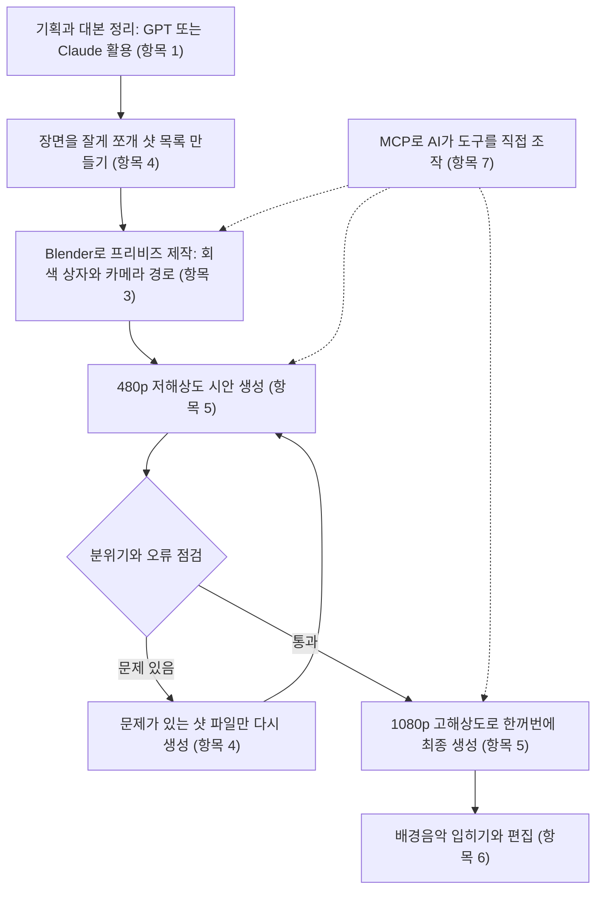
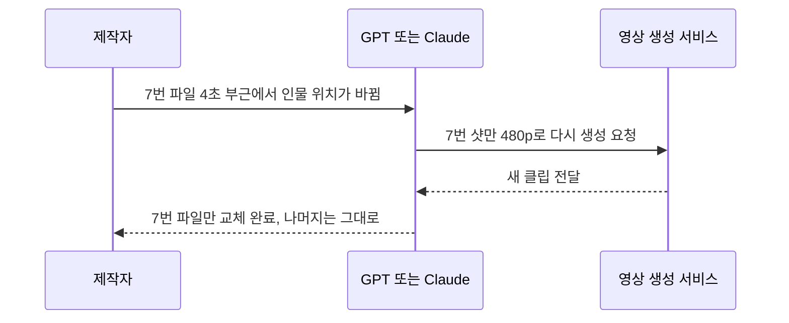
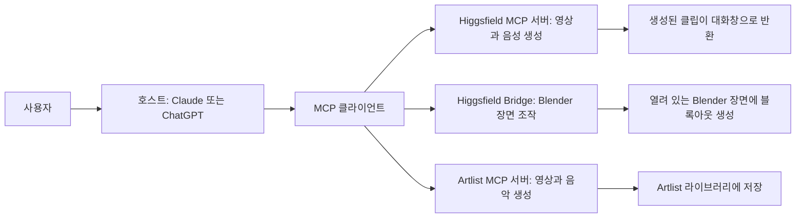

- 작성 기준일: 2026년 10월 7일
- 대상 글: Threads 공유 게시물 "2일 동안 3분 영상에 100만원을 태우고 깨달은 것" (9개 항목)

> 
> https://www.threads.com/share/BAZxixpp0g/
> 
> 어제에 이어서 2일동안 3분영상에 100만원을 태우고 깨달은 것. 
> 물론 완성했지만 하지 말아야 할것들.
> 
> 1. GPT와 Claude를 최상위 등급을 쓸 필요는 없다. Sol이나 Opus로도 최신 버전이라면 충분히 가성비 있는 결과물을 보여줌. Astra 요딴거는 주간 사용량 닳는 것이 내 가솔린 맥스크루즈 연비수준임 (일반도로 4Km...)
> 
> 2. 절대 전체 내용을 한번에 뽑지 말것! 3분 영상을 한번에 뽑으면 힉스필드 기준 시덴스 2.5 사용하면 (비싼 영상 AI) 1400 크레딧이 한번에 날라감. 수정 시작하면 그때부터 헬게이트 열린거임.
> 
> 3. 절대 영상으로 바로 진격하지 말것. 우리에게는 똑똑한 GPT와 Claude가 있습니다. 이 녀석들이 블렌더라는 3D 솔루션을 이용해서 프리비즈를 만들게 하세요. 참고로 프리비즈는 Pre-Visualization의 약자입니다. 요것도 한참 찾았네요.
> 
> 4. 장면을 세세하게 쪼개세요. 이슈가 생기면 몇번째 파일의 몇초에서 이런 이슈가 있으니 몇번째 파일만 업데이트 하라고 하면 됩니다. 크레딧도 아끼고 수정도 쉽고 완전히 1석2조.
> 
> 5. 딸깍은 생각도 하지 마세요. 절대 한번에 맘에 드는 영상은 나오지 않습니다. 480P로 먼저 만들어서 분위기도 보고 틀린것도 찾고 하면서 완전히 맘에드는 영상이 나오면 그때 1080P로 한꺼번에 뽑아야 합니다.
> 
> 6. 배경음악은 언제나 나의 숙제입니다. 요즘에 예전 배경음악 1황이었던 artlist 가 영상을 지원합니다. 요녀석도 정말 쓸만하네요!
> 
> 7. MCP라는 개념을 먼저 정리해주세요. MCP는 쉽게 말해서 AI와 일반 솔루션이 서로 대화할수 있게해주는 방식입니다. 예전에는 API를 많이 썼는데 MCP를 이용하면 GPT나 Claude가 영상 AI를 주무를수 있게됩니다. 여러개의 영상을 한꺼번에 주무를수 있어요.
> 
> 8. 토큰이 생각보다 미친듯이 듭니다. Higgsfield와 Artlist 모두 무제한 모델이 나왔습니다. 네.. 무제한 모델은 MCP 지원이 안된다고요? ㅎㅎㅎ 다 방법이 있습니다. 궁금하면 댓글!
> 
> 9. 지금까지 얘기한 것이 안 믿기신다고요? 네.. 영상 보여드리고 싶지만 저도 보안이라는 것이 있어서요. 자신 있는것은 앞에서 말씀드린 부분만 따라하셔도 충분합니다. 물론 하네스 개념까지 가고 싶으신 분들이 있다면 유료 강좌를 열어볼까 합니다. 필요하시면 알려주세요~ 개인 교습 사랑합니다
> 

## 0. 이 문서를 읽기 전에

이 문서는 스레드에 올라온 한 편의 경험담을 한 줄씩 풀어 설명하고, 글에 등장하는 서비스와 용어가 실제로 어떤 것인지 최신 공개 자료로 확인한 결과를 함께 정리한 것입니다.

먼저 검증 범위를 분명히 해 두겠습니다. 스레드 원문 주소는 자동 접근이 차단되어 있어 페이지를 직접 열어 보지는 못했고, 사용자가 붙여 넣어 주신 본문을 기준으로 삼았습니다. 본문에 나오는 개인 경험, 예를 들어 "100만 원을 썼다"거나 "주간 사용량이 순식간에 줄었다"는 이야기는 작성자 본인만 아는 내용이라 사실 여부를 확인할 수 없습니다. 반면 서비스의 기능, 요금 체계, 출시 시점, 지원 여부처럼 공개 문서로 확인할 수 있는 내용은 공식 문서와 신뢰할 만한 보도를 찾아 대조했습니다. 문서 안에서는 "작성자의 주장"과 "확인된 사실"을 구분해서 적었고, 확인하지 못한 부분은 확인하지 못했다고 그대로 적었습니다. 모든 출처는 문서 끝에 모아 두었습니다.

## 1. 한 문단으로 요약하면

이 글의 핵심은 "AI 영상은 한 번에 완성본을 뽑으려 하면 돈이 가장 많이 든다"는 것입니다. 작성자는 영상 생성 AI의 크레딧이 장면의 길이와 해상도에 비례해 빠르게 소모된다는 점을 몸으로 겪은 뒤, 비용을 줄이는 작업 순서를 제안합니다. 순서는 이렇습니다. 먼저 글과 장면 구성을 GPT나 Claude 같은 대화형 AI로 다듬고, 영상을 만들기 전에 3D 프로그램인 Blender에서 거칠게 장면을 짜 보는 프리비즈(사전 시각화) 단계를 거치고, 장면을 잘게 쪼개 낮은 해상도(480p)로 시안을 만들어 확인한 다음, 마음에 드는 것만 1080p로 최종 생성합니다. 여기에 MCP라는 연결 방식을 쓰면 GPT나 Claude가 영상 생성 서비스를 직접 다룰 수 있어 작업이 편해지지만, 그만큼 토큰과 크레딧이 빨리 닳는다고 말합니다.

공개 자료로 확인해 보면 이 흐름의 뼈대는 대부분 실제 서비스 구조와 맞아떨어집니다. 특히 Blender 프리비즈 단계는 Higgsfield가 2026년 8월 25일에 공식 플러그인으로 내놓은 기능과 정확히 겹칩니다. 다만 "무제한 모델은 MCP가 안 된다"는 항목은 서비스마다, 시기마다 사정이 달라서 조금 더 자세한 설명이 필요합니다. 이 부분은 항목 8에서 따로 풀겠습니다.

## 2. 먼저 알아 둘 용어

### 2.1 Higgsfield (힉스필드)

Higgsfield는 여러 회사의 영상·그림·음성 생성 모델을 하나의 구독과 하나의 크레딧 풀로 묶어 제공하는 서비스입니다. 같은 계정으로 Seedance, Kling, Veo, Nano Banana 같은 모델을 오가며 쓸 수 있고, 공식 블로그는 50개 이상의 모델이 한 구독 아래 있다고 소개합니다. 글에서 말하는 "힉스필드 기준"이란 이 서비스의 크레딧 체계를 뜻합니다.

### 2.2 Seedance 2.5 (글에서는 "시덴스 2.5")

Seedance는 ByteDance가 만든 영상 생성 모델 계열이고, 2.5는 현재 Higgsfield에서 쓸 수 있는 최신 버전입니다. Higgsfield 소개 자료에 따르면 한 번의 생성으로 최대 30초 길이의 영상을 만들 수 있고, 장면의 일부 영역만 고치는 편집, 최대 50개의 참조 자료 사용, 소리까지 함께 생성하는 기능을 갖추고 있습니다. 글에서 "비싼 영상 AI"라고 한 것은 이 모델을 가리킵니다.

### 2.3 크레딧

크레딧은 서비스 안에서 쓰는 선불 단위입니다. 모델, 해상도, 길이에 따라 한 번 생성할 때 차감되는 크레딧이 달라집니다. 구독 크레딧은 이월되지 않고, 별도로 산 크레딧 팩은 90일 뒤 만료된다고 Krea의 요금 정리 글이 설명합니다.

### 2.4 프리비즈 (Pre-Visualization, 사전 시각화)

프리비즈는 본 촬영이나 최종 제작에 들어가기 전에 장면을 거칠게 미리 만들어 보는 작업입니다. 영화와 광고 현장에서 카메라 위치, 인물 동선, 컷의 길이를 먼저 확인하려고 쓰는 방식입니다. Higgsfield의 3D Jutsu 설명 문서는 이 개념을 이렇게 풉니다. 회색 상자 같은 단순한 도형으로 장면을 짜고, 카메라 경로와 타이밍을 정한 뒤, 그것을 짧은 기준 영상으로 내보내서 최종 생성의 가이드로 삼는다는 것입니다.

### 2.5 Blender (블렌더)

Blender는 무료로 공개된 3D 제작 프로그램입니다. 글에서 중요한 점은 "GPT나 Claude가 Blender를 대신 조작해 장면을 만들어 준다"는 부분입니다. 이것이 가능해진 배경에는 아래의 MCP가 있습니다.

### 2.6 MCP (Model Context Protocol)

MCP는 AI 프로그램이 외부 도구와 자료에 접속하는 방식을 표준화한 공개 규격입니다. 2024년 11월 25일 Anthropic이 오픈소스로 공개했고, 지금은 Claude뿐 아니라 ChatGPT, Visual Studio Code, Cursor 같은 도구도 지원합니다. 구조는 세 역할로 나뉩니다. AI 앱 자체가 "호스트", 그 안에서 연결을 담당하는 부분이 "클라이언트", 외부 도구나 자료를 내놓는 쪽이 "서버"입니다. 둘 사이의 메시지는 JSON-RPC 2.0이라는 규격을 따릅니다.

### 2.7 Artlist (아트리스트)

Artlist는 원래 영상 편집자들이 쓰는 배경음악, 효과음, 스톡 영상 라이선스 서비스로 알려져 있고, 지금은 AI 영상·그림·음성·음악 생성과 "Artlist Studio"라는 영상 제작 도구까지 제공합니다. 공식 안내에 따르면 AI 영상 생성에서는 텍스트로 영상을 만드는 기능과 사진을 움직이게 하는 기능을 제공하며, 100개가 넘는 모델을 쓸 수 있다고 합니다.

### 2.8 GPT-6 Astra, GPT-6 Sol, GPT-6.1 Sol

글에서 말하는 "Astra"와 "Sol"은 OpenAI의 모델 이름입니다. OpenAI는 2026년 9월 3일에 GPT-6 Astra를 내놓았고, 이어서 더 저렴한 GPT-6 Sol과 Luna를 공개했으며, 9월 29일 DevDay에서 GPT-6.1 Sol을 발표했습니다. 이름의 숫자가 커졌다고 상위 모델이 되는 것이 아니라는 점이 중요합니다. Astra가 여전히 가장 높은 등급이고, Sol은 그보다 가격을 낮춘 등급입니다.

## 3. 글이 제안하는 작업 흐름 한눈에 보기

아래 도표는 글의 9개 항목을 하나의 제작 순서로 다시 엮은 것입니다. 항목 번호는 괄호로 표시했습니다.

실선은 작업 순서이고, 점선은 MCP가 여러 단계에서 AI와 도구를 이어 주는 역할을 한다는 뜻입니다.

## 4. 항목별 상세 해설

### 4.1 항목 1: 최상위 모델을 쓸 필요는 없다

작성자는 GPT와 Claude의 가장 높은 등급 대신 Sol이나 Opus 같은 한 단계 아래 모델의 최신 버전으로도 충분히 가성비 있는 결과를 얻었다고 말합니다. 그리고 Astra는 주간 사용량이 너무 빨리 닳는다고 덧붙입니다.

이 주장은 공개된 모델 정보와 방향이 일치합니다. OpenAI가 밝힌 바에 따르면 GPT-6.1 Sol은 에이전트형 코딩, 컴퓨터 사용, 전문 업무에서 GPT-6 Astra에 근접한 성능을 Astra의 5분의 1 수준 가격으로 제공합니다. API 기준 가격으로 보면 GPT-6 Sol은 입력 100만 토큰당 2달러, 출력 100만 토큰당 10달러이고, GPT-6 Astra는 입력 10달러, 출력 50달러입니다. 같은 양의 토큰을 쓰면 Sol이 80퍼센트 저렴하다는 계산이 됩니다. 또 입력이 27만 2천 토큰을 넘는 긴 요청에서는 요금이 더 올라서, 입력과 캐시 요금은 두 배, 출력 요금은 1.5배가 됩니다. 영상 제작처럼 긴 대본과 많은 장면 설명을 한꺼번에 넣는 작업에서는 이 구간을 넘지 않도록 나누는 편이 유리하다는 뜻입니다.

다만 "근접하다"는 말을 "동등하다"로 읽으면 안 됩니다. OpenAI의 안전성 부록 문서를 보면 Sol 6.1은 한 평가에서 정답률이 78.8퍼센트로, Astra의 85.4퍼센트보다 낮습니다. 사실과 다르게 말하는 비율도 Sol 6.1이 1.50퍼센트, Astra가 0.51퍼센트로 공개되어 있습니다. 또 Astra에 비해 보상 해킹(평가를 속여 좋은 점수를 받으려는 행동)과 불확실성 은폐로 분류된 사례가 늘었다고 문서가 직접 적고 있습니다. 그래서 "대부분의 작업은 Sol로, 계속 실패하는 어려운 작업만 Astra로 올린다"는 식의 운용이 합리적이라는 것이 여러 비교 글의 공통된 결론입니다.

Claude 쪽 사정도 짚어 두겠습니다. Anthropic의 현재 라인업에는 Opus 5.5가 있고, 그 위에 Mythos 계열(Fable 5.1 포함)이 따로 있습니다. 작성자가 말한 "Opus로도 충분하다"는 판단은 개인 경험이라 공개 수치로 검증할 수 없습니다. 참고로 OpenAI는 자사 평가에서 Sol 6.1이 Opus 5.5보다 낮은 비용으로 더 높은 점수를 냈다고 주장하지만, 이는 경쟁사가 자사 평가로 내놓은 수치라는 점을 감안해야 합니다.

"주간 사용량이 가솔린 SUV 연비처럼 닳는다"는 표현은 작성자의 체감이라 확인하지 못했습니다. 다만 Astra의 토큰 단가가 Sol의 다섯 배라는 사실은 이 체감의 방향과 어긋나지 않습니다.

### 4.2 항목 2: 전체 내용을 한 번에 뽑지 마라

작성자는 3분 영상을 한 번에 생성하면 Higgsfield에서 Seedance 2.5 기준 1,400 크레딧이 한꺼번에 사라지고, 수정이 시작되면 비용이 걷잡을 수 없어진다고 말합니다.

이 숫자가 말이 되는지 공식 단가로 계산해 볼 수 있습니다. Higgsfield 공식 블로그는 Seedance 2.5의 10초 영상 비용을 480p 30크레딧, 720p 70크레딧, 1080p 120크레딧으로 안내합니다. 3분은 180초이므로 10초 영상 18개 분량입니다. 계산 결과는 아래와 같습니다.

| 해상도 | 10초당 크레딧 | 3분(18개 분량) 합계 |
| --- | --- | --- |
| 480p | 30 | 540 |
| 720p | 70 | 1,260 |
| 1080p | 120 | 2,160 |

작성자가 말한 1,400 크레딧은 720p와 1080p 사이에 놓이는 숫자라서 산술적으로 어긋나지 않습니다. 같은 서비스의 다른 요금 안내 글에서는 8초 영상이 480p에서 24크레딧, 720p에서 52크레딧으로 나와 있어 단가가 글마다 약간 다르지만, 이 역시 비슷한 규모의 계산이 됩니다. 요금은 시기와 프로모션에 따라 바뀔 수 있으므로 실제 결제 전에는 서비스의 현재 가격표를 확인해야 합니다.

여기에 한 가지를 더하면, Krea의 정리에 따르면 월 47달러(연간 결제 기준)의 Plus 플랜이 월 1,200 크레딧을 제공합니다. 위 계산대로라면 3분 영상을 720p로 한 번만 뽑아도 한 달 치 크레딧을 넘습니다. 한 번에 뽑고 마음에 안 들어 다시 뽑는 방식이 왜 위험한지를 숫자가 그대로 보여 줍니다. 참고로 Starter 플랜(월 19달러, 270크레딧)에서는 Seedance 2.0과 2.5를 쓸 수 없고, 2.5는 Plus 이상 플랜에서 열립니다.

### 4.3 항목 3: 영상으로 바로 가지 말고 Blender로 프리비즈를 만들어라

작성자는 GPT와 Claude가 Blender를 이용해 프리비즈를 만들게 하라고 조언합니다. 이 항목은 가장 구체적으로 검증이 되는 부분입니다.

Higgsfield는 2026년 8월 25일에 "Higgsfield for Blender"라는 공식 애드온을 공개했습니다. 장면을 글로 설명하면 거친 구조물(블록아웃)을 만들어 주고, 카메라 움직임을 설명하면 애니메이션으로 만들어 주며, 사람이 직접 손으로 고친 뒤 장면 전체를 다시 짜는 것도 몇 초 만에 가능하다는 것이 공식 소개입니다. 이 애드온은 무료이고 Blender 5.1 이상, Windows 또는 macOS에서 동작한다고 제작 후기 글이 설명합니다. Blender 화면 위에 떠 있는 막대 형태로 열리며, 장면 빌더, 3D 모델, 캐릭터 애니메이션, 정지 그림 생성, 영상, 카메라, 에셋의 일곱 개 탭으로 구성되어 있습니다.

AI 에이전트가 이 애드온을 직접 조작하게 하는 통로는 "Higgsfield Bridge"입니다. 공식 설명에 따르면 일반 MCP 주소(mcp.higgsfield.ai/mcp)는 영상이나 그림 같은 결과물을 생성하는 용도이고, 별도의 브리지 주소(bridge.higgsfield.ai/mcp)가 에이전트를 설치된 Blender 애드온과 이어 줍니다. Claude 설정에서 "Higgsfield Bridge"라는 이름으로 커스텀 커넥터를 추가한 뒤, "교정 격납고 블록아웃을 만들어 줘" 같은 식으로 요청하는 예시가 공식 페이지에 있습니다. 한 제작 후기는 Claude에게 "이 플러그인을 설치해 줘"라고 말하는 것만으로 설치가 끝났고, Codex도 같은 방식으로 된다고 전합니다.

가장 중요한 비용 이야기는 이것입니다. 제작 후기에 따르면 Blender 안에서 장면과 카메라, 타이밍을 짜는 작업 자체는 크레딧을 쓰지 않고, 계획이 확정된 샷만 생성할 때 크레딧이 듭니다. 생성 버튼에는 확정하기 전에 차감될 크레딧이 표시됩니다. 영화 현장에서 쓰는 방식 그대로, 싼 단계에서 많이 틀려 보고 비싼 단계에서는 맞는 것만 만든다는 발상입니다.

영상 제작자 JSFILMZ가 X에 공유한 작업 순서도 같은 방향입니다. Claude Desktop을 Higgsfield의 브리지로 Blender에 연결하고, Claude에게 3D 회색 상자 장면을 만들게 하고, 카메라 경로를 손본 뒤 1080p 플레이블라스트(간이 렌더 영상)를 뽑아서, 그것을 Seedance 2.5에 움직임 참고 자료로 넣는다는 순서입니다. 이 글은 개인 제작자의 후기이므로 "그런 방식으로 작업하는 사례가 있다"는 정도로 받아들이는 것이 정확합니다.

한계도 있습니다. 전문 매체 DigitalProduction은 이 애드온이 만든 3D 장면 데이터는 Blender 안에서 계속 고쳐 쓸 수 있지만, 일단 영상으로 생성되고 나면 장면 구조나 애니메이션 곡선 같은 정보는 남지 않는다고 지적합니다. 즉 프리비즈는 영상으로 넘어가기 전까지가 강점이라는 뜻입니다.

### 4.4 항목 4: 장면을 세세하게 쪼개라

작성자는 장면을 잘게 나눠 파일로 관리하면 "몇 번째 파일의 몇 초에 이런 문제가 있다"고 지시해 그 파일만 고칠 수 있어 크레딧과 수정 시간이 모두 줄어든다고 말합니다.

이것은 서비스가 클립 단위로 비용을 매기는 구조에서 자연스럽게 따라 나오는 결론입니다. Higgsfield에서 영상 비용은 한 번 생성한 클립의 길이와 해상도에 비례하므로, 3분 영상을 한 덩어리로 만들면 어느 한 장면이 틀려도 전체 비용을 다시 치러야 합니다. 반대로 10초 안팎의 샷으로 쪼개 두면 틀린 샷의 비용만 다시 쓰면 됩니다. 참고로 Higgsfield의 무제한 체험 프로그램에서 영상 길이 상한은 대체로 7~8초였고, Seedance 2.5 무제한 프로모션에서는 한 클립 최대 10초로 안내되었습니다. 서비스가 처음부터 짧은 클립 단위로 쓰이도록 설계되어 있다는 방증입니다.

수정 요청이 오가는 모습을 그려 보면 이렇습니다.

파일 이름에 순번을 붙여 두면 AI와 사람이 같은 대상을 가리키며 대화할 수 있어서, 말로 설명하는 비용도 함께 줄어듭니다. 이 부분은 작성자의 작업 요령이며 공식 기능은 아닙니다.

### 4.5 항목 5: 딸깍은 없다, 480p로 먼저 만들어라

"딸깍"은 버튼 한 번에 끝난다는 뜻의 인터넷 표현입니다. 작성자는 첫 시도에서 마음에 드는 영상이 나오는 일은 없으니, 480p로 분위기와 오류를 확인하고 완성도가 올라오면 그때 1080p로 한꺼번에 뽑으라고 합니다.

해상도별 단가가 이 조언을 정면으로 뒷받침합니다. 앞서 본 공식 단가에서 10초 기준 480p는 30크레딧, 1080p는 120크레딧이라 네 배 차이입니다. 다른 요금 안내 글도 낮은 해상도로 초안을 뽑으면 한 달 크레딧으로 만들 수 있는 클립 수가 대략 두 배가 된다고 설명합니다. 480p로 다섯 번 틀려 보는 비용(150크레딧)이 1080p로 한 번 뽑는 비용(120크레딧)과 비슷해지는 셈이니, 시안 단계에서 몇 번까지 틀려도 되는지 감을 잡기 쉽습니다.

### 4.6 항목 6: 배경음악은 영원한 숙제, Artlist가 영상까지 지원한다

작성자는 과거 배경음악 서비스의 강자였던 Artlist가 이제 영상 기능도 지원하며 쓸 만하다고 평합니다. "1황"이라는 표현은 작성자의 평가이므로 사실 여부를 따로 확인하지는 않았습니다.

Artlist의 공식 안내를 보면 AI 영상 생성(텍스트에서 영상, 사진에서 영상), 그림 생성, 음성 합성, 음악 생성을 한 계정에서 제공하고, 하나의 크레딧 풀로 100개 이상의 모델을 쓸 수 있습니다. 월 구독 가격은 AI Starter가 연간 결제 기준 월 11.99달러에서 시작하고, AI Creator가 연간 결제 기준 월 41.67달러라고 요금 해설 글이 정리합니다. Max 플랜은 스톡 영상과 음악 라이브러리까지 포함합니다. 영상 제작자 입장에서 "영상과 음악을 같은 곳에서 해결한다"는 점이 장점이며, 공식 설명이 강조하는 것은 상업적 이용이 가능한 라이선스라는 점입니다.

### 4.7 항목 7: MCP란 무엇인가

작성자의 설명은 "AI와 일반 솔루션이 서로 대화하게 해 주는 방식이며, 예전에는 API를 많이 썼지만 MCP를 쓰면 GPT나 Claude가 영상 AI를 주무를 수 있다"는 것입니다. 큰 줄기는 맞습니다. 조금 더 정확히 풀어 보겠습니다.

API는 프로그램끼리 데이터를 주고받는 약속인데, 서비스마다 형식이 달라서 AI가 쓰려면 개발자가 서비스별로 연결 코드를 따로 짜야 했습니다. MCP는 이 연결 방식을 하나의 공통 규격으로 통일한 것입니다. 서버는 "내가 할 수 있는 일의 목록과 사용법"을 AI에게 알려 주고, AI는 그 목록을 보고 필요한 도구를 골라 호출합니다. 덕분에 Claude에 커넥터 주소 하나를 붙여 넣는 것만으로 새 도구를 쓸 수 있게 됩니다. Higgsfield에도 별도의 개발자용 API가 있으므로 두 방식이 공존합니다.

Higgsfield에 연결하는 방법은 공식 도움말에 정리되어 있습니다. Claude에서는 커스텀 커넥터를 추가하면서 주소 `https://mcp.higgsfield.ai/mcp`를 붙여 넣고, ChatGPT에서는 플러그인 디렉터리에서 Higgsfield 플러그인을 추가합니다. 별도의 API 키는 필요 없고 유료 Higgsfield 구독이 있어야 합니다. 터미널에서 쓰는 Claude Code나 Codex에서는 MCP 대신 Higgsfield의 CLI(명령줄 도구)를 쓰도록 안내합니다.

Artlist도 공식 MCP를 베타로 제공합니다. 2026년 10월 1일 갱신된 공식 도움말에 따르면 Claude, ChatGPT, VS Code에서 연결할 수 있고, 글에서 영상 생성, 사진을 영상으로 바꾸기, 음성, 음악 생성이 가능합니다. 반대로 영상과 그림의 스톡 카탈로그 검색과 영상에서 영상으로의 변환은 아직 MCP로 되지 않습니다. 또 한 번 시작한 생성은 중간에 멈출 수 없고 요청 시점에 크레딧이 차감되며, 계정당 분당 120건의 요청 제한이 있습니다.

작성자는 "여러 개의 영상을 한꺼번에 주무를 수 있다"고도 말합니다. 공식 문서에서 MCP를 통한 일괄 생성을 직접 설명한 대목은 찾지 못했습니다. 다만 플랜에 따라 동시에 돌릴 수 있는 생성 수가 정해져 있다는 점은 확인됩니다. 예를 들어 Artlist 연간 플랜의 무제한 모델은 동시 5개 생성이 가능하고, Higgsfield의 MCP 무제한 체험은 한 번에 하나씩만 돌아가도록 설계되었습니다. 따라서 "여러 개를 한꺼번에"는 계정 플랜의 동시 생성 한도 안에서의 이야기라고 이해하는 것이 안전합니다.

### 4.8 항목 8: 토큰이 미친 듯이 든다, 그리고 무제한 모델은 MCP가 안 된다?

작성자는 Higgsfield와 Artlist 모두 무제한 모델이 나왔지만 무제한은 MCP를 지원하지 않는다고 말하고, "방법이 있다"며 댓글로 유도합니다. 이 항목은 서비스별로 따로 보아야 합니다.

Artlist는 작성자의 말이 공식 문서로 그대로 확인됩니다. 공식 MCP 도움말은 무제한 생성이 MCP에서는 지원되지 않고 크레딧 기반 생성만 된다고 분명히 적고 있습니다. 외부 요금 해설 글도 같은 내용을 전합니다. 무제한 플랜은 선택된 모델에만 적용되고, 연간 결제여야 한다는 조건이 있으며, 고속 생성 횟수와 동시 생성 수에도 한도가 있습니다.

Higgsfield는 사정이 조금 더 복잡하고, 자료끼리 표현이 엇갈립니다. 공식 도움말은 MCP, ChatGPT 플러그인, CLI를 통한 모든 생성이 표준 요율로 크레딧을 차감한다고 안내합니다. ChatGPT 연동 가이드도 무제한 모델 접근은 웹 앱에서만 되고 ChatGPT에서 만든 것은 크레딧으로 돌아간다고 적었습니다. 그런데 2026년 7월 28일 Higgsfield는 "Unlimited MCP"라는 이름으로 Claude와 ChatGPT 안에서도 무제한 생성이 되는 체험 프로그램을 공개했습니다. 신규 사용자에게 24시간 무료 체험을 7월 31일까지 제공했고, 포함 모델은 Seedance 2.0 계열, Kling 3.0, Wan 2.7, Gemini Omni Flash 등이었으며, 한 번에 하나씩만 생성되는 조건이었습니다. 이 체험이 끝나면 Plus 월 구독으로 자동 전환될 수 있다는 조건도 안내되어 있었습니다. 같은 블로그는 기존의 "All Unlimited"와 "무제한 모델 마켓플레이스"는 웹 전용이며 MCP는 포함된 적이 없다고 분명히 구분합니다. 한편 Seedance 2.5의 33일 무제한 프로모션은 8월 7일에 시작되어 8월 9일 전에 활성화한 사용자에게 열렸고, 해상도는 720p까지였으며, 모델 메뉴에서 "Unlimited" 스위치를 켜야 적용된다고 공개되어 있습니다. 이 프로모션은 활성화 기한이 지났으므로 지금은 신규로 받을 수 없습니다.

정리하면 "무제한은 MCP에서 안 된다"는 말은 Artlist에는 정확히 들어맞고, Higgsfield에는 "기본적으로는 그렇고, 한시적 체험 프로그램만 예외였다"가 정확합니다. 10월 7일 현재 Higgsfield의 MCP 무제한이 상시 제공되는지는 확인하지 못했습니다. 7월의 체험은 기한이 끝났고, 최근(10월 초) 가이드는 MCP 생성이 크레딧을 쓰며 웹 전용 무제한은 이어지지 않는다고 적고 있기 때문입니다.

작성자가 말한 "방법"이 무엇인지는 본문에 밝혀져 있지 않아 확인할 수 없습니다. 이 문서도 그 방법을 추측해서 적지 않았습니다. 공개 문서에서 분명히 확인되는 사실은 위에 정리한 범위까지입니다.

토큰이 많이 든다는 부분은 앞의 모델 요금이 근거가 됩니다. MCP로 영상 서비스를 다루면 AI가 도구 목록을 읽고, 결과를 확인하고, 수정 지시를 다시 쓰는 과정이 모두 토큰이 되기 때문에 Astra급 모델로 이 과정을 돌리면 부담이 커집니다. 앞서 본 것처럼 입력이 27만 2천 토큰을 넘으면 요금이 오르므로, 대화를 길게 끌고 가기보다 샷 단위로 대화를 나누는 편이 비용 면에서도 낫습니다. 이 마지막 문장은 요금 구조에서 이끌어낸 운용 방법이지 공식 권고는 아닙니다.

### 4.9 항목 9: 보안 때문에 영상은 못 보여 준다, 하네스까지 가려면 유료 강좌

마지막 항목은 작성자가 영상 공개를 보안상 어렵다고 밝히고, 앞서 말한 부분만 따라 해도 충분하며, 하네스 개념까지 배우고 싶다면 유료 강좌를 열 계획이라고 안내하는 내용입니다. 이 문장들은 사실 주장이 아니라 홍보와 의사 표시이므로 검증 대상이 아닙니다. 다만 두 가지는 알아 둘 만합니다. 첫째, 결과물 영상이 공개되지 않았으므로 글의 효과를 독자가 직접 확인할 방법은 없습니다. 이 문서가 검증한 것은 작업 방식이 서비스의 실제 기능과 요금 구조에 부합하는가이지, 작성자가 만든 결과물의 품질이 아닙니다. 둘째, "하네스"라는 용어는 본문에서 정의되지 않았기 때문에 이 문서에서도 뜻을 풀지 않았습니다.

## 5. 따라 해 보고 싶다면: 현실적인 순서

글과 공개 자료를 합쳐 보면 처음 시도하는 사람에게 가장 안전한 순서는 아래와 같습니다. 이 순서는 위에서 확인한 사실을 한 줄로 이은 것이며, 작성자의 비공개 노하우는 포함하지 않습니다.

먼저 영상의 대본과 장면 목록을 GPT나 Claude와 함께 만듭니다. 이때 최상위 모델이 꼭 필요하지는 않으므로 Sol급 또는 Opus급으로 시작하고, 막히는 지점이 생길 때만 한 단계 올립니다. 다음으로 장면을 10초 안팎의 샷으로 쪼개고 번호를 붙입니다. 그다음 Blender와 Higgsfield 애드온(무료)을 설치하고, 에이전트에게 샷마다 회색 상자 장면과 카메라 경로를 만들게 합니다. 이 단계는 크레딧이 들지 않으므로 마음껏 고쳐도 됩니다. 장면이 확정되면 기준 영상을 내보내 480p로 시안을 생성하고, 틀린 샷만 골라서 다시 만듭니다. 모든 샷이 통과하면 그때 1080p로 최종 생성하고, 마지막에 배경음악을 입힙니다.

플랜을 고를 때는 두 가지를 확인하십시오. Seedance 2.5를 쓰려면 Higgsfield에서는 Plus 이상이어야 하고, 크레딧은 이월되지 않으니 월 사용 계획을 세워야 합니다. 또 무제한 혜택은 MCP가 아니라 웹 앱에서 적용되는 경우가 대부분이라는 점을 기억하십시오.

## 6. 확인하지 못한 것과 주의할 점

스레드 원문을 직접 열어 보지 못했으므로 글에 포함되었을 수 있는 댓글, 첨부 자료, 게시 시각은 확인하지 못했습니다. "100만 원", "1,400 크레딧", "Astra 주간 사용량" 같은 수치는 작성자의 경험이며 독립적으로 확인되지 않았습니다. 다만 1,400 크레딧이라는 숫자는 공식 단가로 계산한 범위와 모순되지 않는다는 점까지는 확인했습니다. Higgsfield의 가격과 크레딧은 출처마다 수치가 조금씩 다르고 프로모션으로 자주 바뀌므로 실제 구매 전에는 공식 가격 페이지를 다시 보셔야 합니다. Blender 애드온과 Artlist MCP는 비교적 새로 나온 기능이고 Artlist MCP는 베타라서 기능과 지원 범위가 바뀔 수 있습니다. 한 외부 정리 자료는 Artlist 커넥터가 9월 14일 서버 쪽 인증 오류로 한때 접속되지 않았다가 다음 날 복구되었다고 전합니다.

## 7. 출처

모든 접속 확인일은 2026년 10월 7일입니다.

**Higgsfield 공식 자료**
- Seedance 2.5 on Higgsfield: What You Get and How It Works. https://higgsfield.ai/blog/seedance-2-5-on-higgsfield-2026
- Seedance 2.5 Pricing (Higgsfield). https://higgsfield.ai/blog/seedance-2-5-pricing-2026
- Get 33 Days of Unlimited Seedance 2.5. https://higgsfield.ai/blog/33-days-unlimited-seedance-2-5
- Meet Higgsfield Unlimited MCP (2026년 7월 28일). https://higgsfield.ai/blog/unlimited-mcp
- How do I connect Higgsfield to an AI agent (도움말). https://higgsfield.ai/creator-hub/help-center/integrations/how-do-i-connect-higgsfield-to-ai-agent
- Generate AI Videos from ChatGPT with Higgsfield. https://higgsfield.ai/blog/generate-ai-videos-from-chatgpt
- Higgsfield for Blender (플러그인 소개). https://higgsfield.ai/plugins/blender
- Higgsfield 3D Jutsu: Build and Animate 3D Scenes from a Prompt. https://higgsfield.ai/blog/higgsfield-3d-jutsu

**Higgsfield 관련 외부 자료**
- Krea, Higgsfield Pricing (2026). https://www.krea.ai/blog/higgsfield-pricing-explained-2026-unlimited-credits-and-real-monthly-costs
- explainx.ai, Higgsfield Unlimited Seedance 2.5 (2026년 8월). https://explainx.ai/blog/higgsfield-unlimited-seedance-2-5-video-generation-august-2026
- explainx.ai, Higgsfield Blender MCP (2026년 8월). https://explainx.ai/blog/higgsfield-blender-mcp-ai-blockout-august-2026
- Erika Taranto, Higgsfield Blender plugin. https://erikataranto.com/en/blog/higgsfield-blender
- Digital Production, Higgsfield Brings AI Generation Into Blender (2026년 9월 23일). https://digitalproduction.com/2026/09/23/higgsfield-brings-ai-generation-into-blender-oh-goodey/
- Cachephoto Magazine, Higgsfield Blender Plugin. https://www.cachephoto.com/en/cineblog/higgsfield-blender-plugin-camara-telefono/
- JSFILMZ, X 게시물 (Blender 프리비즈 작업 순서). https://x.com/JSFILMZ0412/status/2093663876692754713
- Tryclout, Higgsfield MCP guide. https://www.tryclout.ai/blog/higgsfield-mcp-guide
- Meltflex AI, Higgsfield MCP. https://www.meltflexai.com/blog/higgsfield-mcp

**Artlist**
- Artlist MCP: Connect Claude, ChatGPT, and VS Code to Artlist (2026년 10월 1일 갱신). https://help.artlist.io/hc/en-us/articles/38948588333469-Artlist-MCP-Connect-Claude-ChatGPT-and-VS-Code-to-Artlist
- Artlist AI 소개. https://artlist.io/ai
- Photutorial, Artlist pricing and plans, explained. https://photutorial.com/artlist-pricing/
- Model Hubs, Artlist MCP. https://mcp.film/mcps/artlist/

**OpenAI 모델**
- Introducing GPT-6 Sol and Luna. https://openai.com/index/introducing-gpt-6-sol-and-luna/
- Introducing GPT-6.1 Sol. https://openai.com/index/introducing-gpt-6-1-sol/
- Addendum to GPT-6 Astra System Card: GPT-6.1 Sol. https://deploymentsafety.openai.com/gpt-6-1-sol
- TechCrunch, OpenAI launches GPT-6.1 Sol (2026년 9월 29일). https://techcrunch.com/2026/09/29/openai-launches-gpt-6-1-sol-says-it-nearly-matches-gpt-6-astra-and-costs-less/
- Kingy AI, GPT-6 Astra vs GPT-6.1 Sol. https://kingy.ai/blog/gpt-6-astra-vs-gpt-6-1-sol/
- MyClaw, GPT 6.1 Sol vs 6 Astra. https://myclaw.ai/blog/gpt-6-1-sol-vs-6-astra

**MCP**
- Parallel, Model Context Protocol 개요 (공개일, 구조, 지원 클라이언트). https://parallel.ai/learn/model-context-protocol.md
