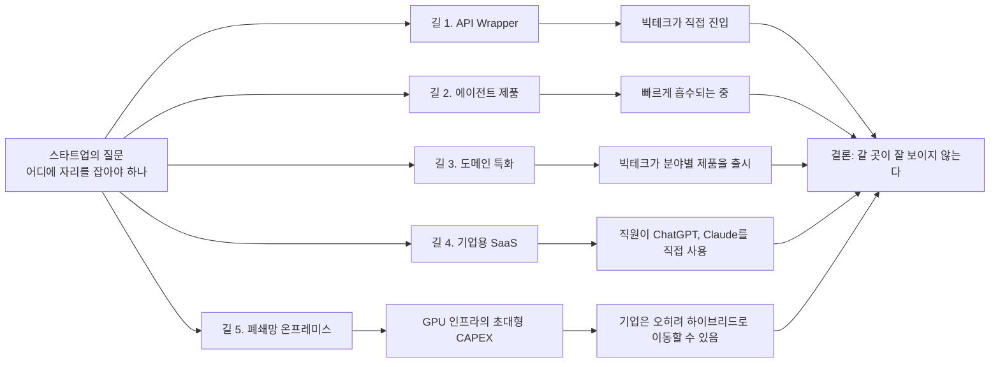
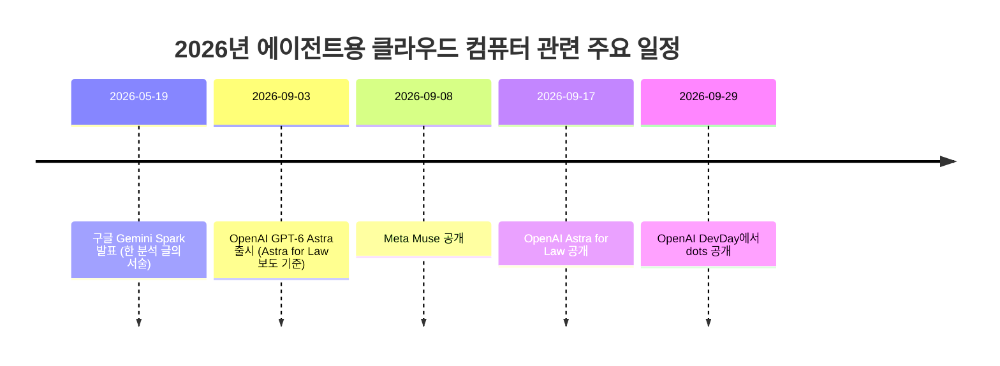
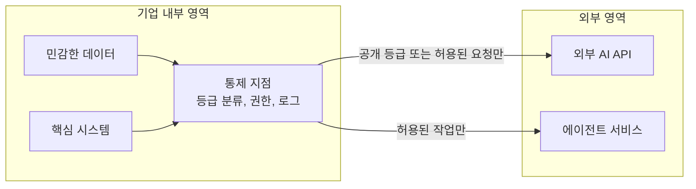

작성 기준일: 2026년 10월 7일


```
스타트업이 제품 전략을 세울 때는 결국 빅테크가 절대로 하지 않을 영역을 찾아 비집고 들어가야 할 텐데,

Muse, Dots 같은 것들을 보고 있으면 API를 가져다 쓰는 수준을 넘어 클라우드 VM 자체를 빌려 자사 제품과 에이전트를 직접 녹여내는 방향이 이미 시작된 것 같다.
생각보다 너무 빨리 왔다.

그렇다고 도메인 데이터 쪽으로 깊게 들어가자니 ChatGPT for Law 같은 것들이 나오는 걸 보면 이쪽도 마냥 안전해 보이지 않는다.

더 무서운 건 따로 있다.
스타트업이 열심히 제품을 만들어 각 기업에 영업하고 전파하는 속도보다, 
각 기업의 직원들이 그냥 ChatGPT나 Claude를 직접 가져다 쓰고 업무 방식을 바꾸는 속도가 더 빠른 것 같다.

그렇다고 아예 폐쇄망 온프레미스 시장으로 들어가자니 B300 같은 GPU 인프라에 들어가는 초대형 CAPEX를 생각하지 않을 수 없다.

기업 입장에서도 이 정도 비용을 감당할 바에는 폐쇄망 정책을 조금씩 완화하고, 
민감한 데이터와 시스템만 내부에 남겨둔 채 외부 API를 섞어 쓰는 Hybrid 구조로 가는 게 훨씬 빠르고 현실적일 수 있다.

그러면 결국 스타트업이 갈 곳은 어디일까?

API Wrapper는 빅테크가 직접 먹기 시작했고,
Agent 영역도 빠르게 흡수되고 있다.
도메인 특화도 빅테크가 내려오고 있고,
기업용 SaaS는 직원들이 ChatGPT와 Claude를 직접 쓰는 속도와 경쟁해야 한다.
온프레미스는 CAPEX라는 거대한 벽이 있다.

AI 업계에서 장기 플랜이라고 해봐야 이제 1년 정도인데ㅋㅋ
그 1년짜리 계획조차 어디에 걸어야 할지 점점 더 어려워지는 것 같다.

요즘 계속 생각해봐도,
AI 시대에 스타트업이 갈 곳은 도대체 어디일까 싶으면 정말 잘 보이지 않는다. 😂

https://www.threads.com/share/_8EXn11id/

```


---

## 0. 이 문서에 대하여

이 문서는 한 개발자가 Threads에 올린 장문의 글을 처음 읽는 사람도 따라갈 수 있도록 풀어서 설명하고, 글에서 언급한 사실들이 실제로 어떤 상황인지 최신 자료로 확인한 결과를 함께 정리한 것입니다.

먼저 밝혀둘 한계가 두 가지 있습니다. 첫째, 글의 원문 링크는 Threads 쪽에서 자동 접근을 막고 있어 직접 열어볼 수 없었습니다. 그래서 글의 내용은 전달받은 본문 텍스트를 기준으로 해설했고, 글쓴이가 누구인지는 확인하지 못했기 때문에 따로 언급하지 않습니다. 둘째, 이 문서는 "글쓴이의 주장(의견)"과 "검색으로 확인한 사실"을 최대한 구분해서 적습니다. 글쓴이가 "~인 것 같다"고 쓴 부분은 의견이므로, 그 의견이 어떤 사실 위에 서 있는지를 확인하는 방식으로 접근했습니다. 검색으로 확인되지 않은 부분은 추측으로 메우지 않고 "확인하지 못했다"고 적었습니다.

글의 핵심 질문은 한 문장으로 요약됩니다. "AI 시대에 스타트업이 들어갈 만한 자리가 도대체 어디에 남아 있는가?"

---

## 1. 한눈에 보는 요약

글쓴이는 스타트업이 선택할 수 있는 길을 다섯 가지로 나누어 하나씩 살펴보고, 어느 길이든 큰 장벽이 있다고 진단합니다.

첫 번째는 API를 가져다 감싸서 제품을 만드는 길(API Wrapper)입니다. 글쓴이는 빅테크가 이 영역을 직접 차지하기 시작했다고 봅니다. 두 번째는 에이전트 제품을 만드는 길인데, 이 역시 빠르게 흡수되고 있다고 말합니다. 세 번째는 법률 같은 특정 분야의 데이터를 깊게 파고드는 도메인 특화의 길이지만, 빅테크가 이 분야용 제품을 내놓기 시작해 안전하지 않다고 봅니다. 네 번째는 기업에 SaaS 형태로 제품을 파는 길인데, 기업 직원들이 스타트업 제품이 퍼지는 속도보다 빠르게 ChatGPT나 Claude를 직접 쓰기 시작한다는 점이 걸림돌이라고 합니다. 다섯 번째는 외부와 차단된 폐쇄망 온프레미스 시장인데, B300 같은 GPU 인프라에 들어가는 막대한 초기 투자비(CAPEX)가 벽이라고 설명합니다.

여기에 한 가지 관찰이 덧붙습니다. 기업 입장에서도 그 정도 비용을 감당하느니 폐쇄망 정책을 조금씩 풀고, 민감한 데이터와 시스템만 내부에 남긴 채 외부 API를 섞어 쓰는 하이브리드 구조로 가는 편이 빠르고 현실적일 수 있다는 것입니다. 결론은 "그럼 스타트업이 갈 곳은 어디인가, 잘 보이지 않는다"이며, AI 업계에서 장기 계획이라고 해봐야 1년 정도인데 그 1년짜리 계획을 어디에 걸어야 할지조차 어렵다는 푸념으로 끝납니다.

이 문서가 확인한 바를 먼저 짧게 말씀드리면, 글에서 언급한 주요 사실들은 모두 최근 몇 주 사이에 실제로 있었던 일들과 맞닿아 있습니다. Meta의 Muse(2026년 9월 8일 공개)와 OpenAI의 dots(2026년 9월 29일 공개)는 둘 다 에이전트가 자기 전용 클라우드 컴퓨터 안에서 일하는 구조입니다. OpenAI는 2026년 9월 17일에 법률 업무용 구성인 Astra for Law를 공개했습니다. 한국에서는 금융권을 중심으로 망분리 규제를 완화하는 흐름이 실제로 진행 중입니다. 다만 "직원들이 스타트업 제품보다 빠르게 직접 쓴다"는 부분은 방향은 맞지만 구체적 수치는 조사마다 다르고, GPU 가격도 출처마다 편차가 큽니다. 이런 세부는 본문에서 따로 다룹니다.

---

## 2. 글의 논리 구조

글은 "탈출구를 찾는 사람이 하나씩 문을 열어보다가 모두 잠겨 있음을 확인하는" 구조로 쓰여 있습니다. 이 흐름을 그림으로 그리면 다음과 같습니다.



글이 설득력을 갖는 이유는 각 길마다 "왜 막히는가"를 구체적인 사례나 수치 감각으로 뒷받침하기 때문입니다. 이어지는 장에서 각 단락을 하나씩 풀어 설명합니다.

---

## 3. 용어 정리

본문을 읽기 전에 몇 가지 용어를 먼저 짚어둡니다.

**해자(Moat)** 는 원래 성을 둘러싼 물길을 뜻하는데, 경영에서는 경쟁자가 쉽게 따라오지 못하게 하는 방어 장벽을 말합니다. 글 아래 달린 댓글에서도 이 단어가 쓰입니다.

**API Wrapper**는 OpenAI나 Anthropic 같은 회사가 제공하는 모델 API를 호출해서 그 위에 화면과 약간의 기능만 얹은 제품을 가리키는 말입니다. 모델 자체를 만들지 않고 "포장"만 한다는 뉘앙스가 있습니다.

**에이전트**는 질문에 답만 하는 챗봇과 달리, 목표를 받으면 스스로 여러 단계를 거쳐 도구를 쓰고 일을 처리하는 AI를 말합니다.

**VM(가상 머신)** 은 한 대의 컴퓨터 안에 만든 가상의 컴퓨터입니다. "에이전트에게 자기 전용 컴퓨터를 준다"는 말은 사실상 에이전트마다 독립된 가상 컴퓨터를 할당해 그 안에서 브라우저를 열고 프로그램을 돌리게 한다는 뜻입니다.

**CAPEX**는 설비 투자비, 즉 서버나 GPU처럼 한 번에 크게 들어가는 초기 비용입니다. 반대로 클라우드를 빌려 쓰는 비용은 시간 단위로 나가는 운영비(OPEX) 성격입니다.

**온프레미스와 폐쇄망**은 기업이 자기 건물 안의 전산실에 서버를 두고, 외부 인터넷과 연결을 끊거나 엄격히 제한한 채 운영하는 방식을 말합니다. 한국 금융권에서는 이를 "망분리"라고 부르는 규제와도 연결됩니다.

**하이브리드**는 민감한 것은 내부에, 나머지는 외부 서비스에 두는 혼합 구조입니다.

---

## 4. 본문 단락별 상세 해설

### 4.1 서두: "빅테크가 절대로 하지 않을 영역"을 찾아야 한다

글은 스타트업의 전통적인 생존 공식에서 출발합니다. 큰 회사가 하지 않을 영역, 하더라도 당장은 관심을 두지 않을 틈새를 찾아 비집고 들어가는 것이 스타트업의 일반적인 전략이라는 전제입니다. 그런데 글쓴이는 이 공식이 지금은 작동하기 어려워 보인다는 문제의식을 던집니다. 이어지는 다섯 가지 길의 점검은 모두 이 전제를 시험하는 과정입니다.

### 4.2 첫 번째 관찰: API를 넘어 "클라우드 VM"까지 들어오는 빅테크

글쓴이는 Muse와 Dots를 보면 "API를 가져다 쓰는 수준을 넘어 클라우드 VM 자체를 빌려 자사 제품과 에이전트를 직접 녹여내는 방향이 이미 시작된 것 같다"고 말합니다. 이 문장은 해석이 필요합니다. 제가 이해한 취지는 이렇습니다. 예전에는 AI 회사가 모델을 API로 팔고, 그 위에서 제품을 만드는 것은 외부 스타트업의 몫이었습니다. 그런데 이제 AI 회사가 모델뿐 아니라 에이전트가 일하는 컴퓨터 환경까지 통째로 제공하는 제품을 직접 내놓고 있으니, 스타트업이 올라탈 "빈 층"이 줄어든다는 것입니다.

이 관찰을 뒷받침하는 사실은 다음과 같습니다.

**Meta의 Muse.** Meta는 2026년 9월 8일 Muse를 공개하면서 이를 "모두를 위한 세계 최초의 개인 AI 에이전트"라고 소개했습니다. Meta의 공식 발표에 따르면 Muse는 "Muse Secure VM"이라는 전용 가상 머신 위에서 돌아가며, 이 VM에는 에이전트와 사용자의 데이터가 함께 들어 있고 에이전트는 자기 전용 브라우저를 갖습니다. 사용자는 Muse 앱이나 WhatsApp에서 사람에게 메시지를 보내듯 말을 걸 수 있고, 어떤 앱을 연결할지와 접근 권한의 범위를 사용자가 정합니다. Meta는 Muse의 대화나 VM 안의 데이터를 Meta의 광고 시스템과 공유하지 않는다고 밝혔고, 올해 안에 사용자만 가진 키로 VM 전체를 암호화하는 "Muse Confidential VM"을 도입하겠다고 예고했습니다. 구동 모델은 Muse Spark로 보도되었습니다.

**OpenAI의 dots.** OpenAI는 2026년 9월 29일 샌프란시스코에서 열린 DevDay에서 dots를 공개했습니다. 각 dot은 GPT-6 Astra 모델을 쓰고, 자기만의 클라우드 컴퓨터와 브라우저를 가지며, 사용자가 준 목표를 향해 24시간 일하도록 설계되었습니다. 4,000개가 넘는 앱과 플러그인으로 연결되고, ChatGPT, Slack, Microsoft Teams로 대화할 수 있으며 문자 메시지 지원은 추후 추가될 예정이라고 보도되었습니다. 사용자는 작업 중인 dot의 클라우드 컴퓨터를 언제든 들여다볼 수 있고, 원하면 자기 컴퓨터를 쓸 권한도 줄 수 있습니다. dot의 컴퓨터는 사용자가 연결하지 않는 한 사용자 본인의 컴퓨터와 분리되어 있고, 저장된 비밀번호로 웹사이트에 로그인하되 그 비밀번호가 모델에 노출되지 않는다고 OpenAI는 설명했습니다. 조직용으로는 각각 별도의 신원과 권한을 가진 "전문가 dot"도 예고했으며, Microsoft의 Agent 365 보안 통제와 연동하는 작업을 진행 중입니다. 제공 범위는 ChatGPT Pro와 Business Premium 사용자 중 지원 지역에 한정되고, 첫 번째 dot은 추가 비용 없이 포함됩니다. 보도에 따르면 유럽경제지역(EEA), 스위스, 영국의 Pro 사용자는 당분간 제외되었습니다.

**개발자용 인프라도 같은 방향.** DevDay에서는 Codex를 클라우드에서 돌릴 수 있게 하는 기능과, Agents API에 GPT-6 Astra 기반의 호스팅형 컴퓨터 사용 기능을 추가한다는 발표도 있었던 것으로 정리됩니다. 즉 일반 사용자용 제품뿐 아니라 개발자에게 "에이전트가 일하는 환경" 자체를 제공하는 방향도 동시에 열렸습니다.

**다른 회사들.** 한 분석 글은 구글의 Gemini Spark(2026년 5월 19일 I/O에서 발표)와 Grok Bot도 같은 유형의 제품으로 묶어서 설명합니다. 이 분석에 따르면 dots, Muse, Gemini Spark, Grok Bot은 모두 벤더가 호스팅하는 가상 머신 안에서 자기 브라우저로 에이전트를 돌리는 구조를 공유합니다. 다만 이 부분은 단일 분석 글에 의존한 정보이므로 세부 사양까지 확정된 사실로 받아들이지는 않는 것이 좋겠습니다.

여기서 한 가지 구분이 필요합니다. 두 제품은 같은 범주이지만 성격이 완전히 같지는 않습니다. 비교 분석에 따르면 OpenAI는 dots를 개인 생활뿐 아니라 업무용으로도 겨냥해 Slack 버그 분류, 풀 리퀘스트 생성, 청구서 후속 처리 같은 사례를 제시한 반면, Muse는 소비자용 심부름 에이전트에 가깝습니다. 글쓴이가 둘을 한데 묶어 "방향이 시작되었다"고 본 것은 타당한 요약이지만, 각각이 겨냥하는 고객은 다릅니다.

다음은 이 사건들의 시간순 정리입니다.



### 4.3 두 번째 관찰: 도메인 데이터도 안전하지 않다 (ChatGPT for Law)

에이전트 영역이 막혀 있다면 특정 분야의 깊은 데이터로 승부하는 길은 어떨까요. 글쓴이는 "ChatGPT for Law 같은 것들이 나오는 걸 보면 이쪽도 마냥 안전해 보이지 않는다"고 말합니다.

"ChatGPT for Law"라는 이름의 제품이 따로 있는지는 이번 조사에서 확인하지 못했습니다. 대신 정확히 이 맥락에 해당하는 최근 발표가 있었습니다. OpenAI는 2026년 9월 17일 **Astra for Law**를 공개했습니다. 여러 보도를 종합하면 내용은 다음과 같습니다.

Astra for Law는 새로운 모델이 아닙니다. 기존 GPT-6 Astra에 세 가지를 얹은 구성입니다. 첫째는 미국 판례법, 법령, 규정을 검색할 수 있는 "Legal Search Index"로, 2억 3천만 개 이상의 URL을 담고 있다고 보도되었습니다. 둘째는 법률 분석과 글쓰기를 위한 지침이고, 셋째는 기밀 업무를 위한 통제 장치입니다. OpenAI가 Vals AI의 Legal Research Bench 비공개 검증 세트에서 뽑은 미국 법률 리서치 질문 200개로 시험한 결과, 전체 정확성 검사 통과율이 Astra for Law는 54.0%, 웹 검색만 쓴 GPT-6 Astra는 38.7%였습니다. OpenAI는 이를 40%의 상대적 개선이라고 설명했고, 판례 중심 질문에서는 참조 판례를 24% 더 많이 찾았다고 했습니다. 다만 이 수치는 OpenAI 자체 보고이며, 한 매체는 재현에 필요한 실행 데이터가 충분히 공개되지 않았다고 지적했습니다.

제공 방식에도 주목할 만한 점이 있습니다. 처음에는 선별된 법률 사무소에 Trusted Access 형태로 ChatGPT와 Codex 안에서 제공되고, API는 `gpt-6-astra-law`라는 이름으로 "곧" 제공될 예정이지만 가격과 출시일은 발표되지 않았습니다. 인덱스는 미국 법만 다루며, 다른 나라의 법률 체계에 대한 로드맵은 발표에 없다고 보도되었습니다. 또한 법률 AI 스타트업인 Harvey와 Legora가 API 고객으로 거론되었습니다.

이 대목은 글쓴이의 주장을 단순 지지하는 것이 아니라 약간 복잡하게 만듭니다. 한쪽으로는 빅테크가 도메인 영역으로 내려온다는 글쓴이의 관찰이 사실로 확인됩니다. 다른 한쪽으로는 OpenAI 스스로 이 인덱스가 톰슨 로이터 같은 업체의 유료 콘텐츠와 전문 제품을 대체하기보다 보완하는 것이라고 설명했고, 법률 사무소가 자기 선례, 방법론, 판단을 중심으로 AI를 구축해야 한다고 강조했으며, 사무소 안에 파견된 OpenAI 엔지니어들이 각 사무소의 고유 데이터와 업무 흐름에 맞게 ChatGPT Enterprise를 맞춤 연동한 사례를 소개했습니다. 또 Harvey와 Legora 같은 법률 AI 회사를 "그 위에서 만드는 고객"으로 명시했습니다. 즉 OpenAI의 공식 서술 안에서도 공개 법률 정보 검색은 빅테크가 가져가되, 개별 조직의 고유 데이터와 업무 맥락은 여전히 별도의 영역으로 남아 있는 것처럼 그려집니다. 이것이 스타트업에게 실제로 안전한 공간이 되는지는 이번 조사로 판단할 수 없으며, 글쓴이도 그렇게 단정하지는 않았습니다.

### 4.4 세 번째 관찰: "더 무서운 것"은 직원들의 직접 사용 속도

글쓴이는 이 대목을 가장 무섭다고 표현합니다. 스타트업이 열심히 제품을 만들어 각 기업에 영업하고 확산시키는 속도보다, 각 기업의 직원들이 그냥 ChatGPT나 Claude를 직접 가져다 쓰고 업무 방식을 바꾸는 속도가 더 빠르다는 것입니다.

이 주장의 방향은 여러 조사에서 확인됩니다. 다만 숫자는 조사마다 다르다는 점을 함께 말씀드립니다.

- 갤럽이 2026년 5월에 미국 직장인 22,573명을 조사한 결과, 52%가 업무에 AI를 쓴다고 답했고(몇 달에 한 번 이상 기준), 30%는 주 몇 회 이상, 15%는 매일 쓴다고 답했습니다. 같은 조사에서 자기 회사가 AI 도구를 업무에 통합했다고 답한 비율은 47%였습니다. 직원 쪽 사용이 회사의 공식 도입보다 앞서 있다는 신호로 해석되는 수치입니다. 이 수치는 갤럽 조사를 인용한 2차 정리 글에서 확인한 것입니다.
- 인시던트 대응 업체 PagerDuty가 2026년 6월에 4개 지역 사무직을 조사한 결과, 응답자의 66%가 회사가 허용하지 않은 AI 도구를 써본 적이 있고, 88%가 업무 관련 정보를 ChatGPT, Claude, Gemini 같은 공개 AI 도구에 공유한 적이 있다고 답했습니다.

그러나 이 흐름을 "회사 몰래 쓴다"로만 읽으면 절반만 보는 것입니다. 보안 업체 Netskope의 2026년 보고서를 인용한 2차 자료에 따르면, 업무용 AI 사용자 중 개인 계정으로 접속하는 비율은 1년 전 78%에서 47%로 줄었고 회사 관리 계정으로 쓰는 비율이 늘었습니다. 이것은 기업이 공식 계약으로 ChatGPT Enterprise나 Claude 같은 도구를 직접 도입하는 쪽으로 이동하고 있다는 뜻으로 읽힙니다. 글쓴이의 논점인 "직원과 기업이 프런티어 AI를 직접 쓰는 속도가 스타트업의 영업 속도보다 빠르다"와는 방향이 같습니다. 다만 위 조사들이 "스타트업 제품이 퍼지는 속도"와 직접 비교한 것은 아니기 때문에, 그 비교 자체는 글쓴이의 체감이며 이번 조사에서 수치로 검증되지는 않았습니다.

### 4.5 네 번째 관찰: 폐쇄망 온프레미스와 B300의 벽

그러면 외부와 단절된 폐쇄망 시장은 어떨까요. 외부 AI 서비스를 쓸 수 없는 기업이 많으니 자체 서버에 AI를 설치해 주는 사업이 틈새가 될 수 있다는 발상입니다. 글쓴이는 여기서 GPU 인프라, 구체적으로 B300을 거론하며 초대형 CAPEX가 문제라고 말합니다.

B300은 NVIDIA의 Blackwell Ultra 세대 GPU로, GPU 한 장당 메모리가 288GB입니다. 가격은 출처마다 편차가 상당히 커서 범위로 제시하는 것이 정직합니다.

- GPU 한 장의 구매가는 2026년 7월 유통 목록 기준 약 53,000달러로 보고되었습니다.
- 8개 GPU가 들어간 DGX B300 시스템은 2026년 초부터 9월까지 30만~35만 달러 선으로 정리한 자료가 있고, 다른 자료는 2026년 9월 기준 8-GPU HGX B300 서버가 55만~75만 달러라고 봅니다. 한 서버 제조사는 HGX B300의 시작가를 약 43만 달러로 안내합니다.
- 같은 자료는 HGX B300 서버 한 대의 전력 소비를 약 14.5kW로 보고, 전기와 운영에 들어가는 연간 비용을 서버 한 대당 약 5만~14.5만 달러로 추산합니다(인건비와 소프트웨어 라이선스 제외).
- 반면 빌려 쓰는 경우, 2026년 10월 6일 기준 14개 업체의 시간당 온디맨드 가격 중앙값이 GPU 한 장당 약 9.32달러이며 최근 90일간 변동이 거의 없었다고 합니다.

여기서 단순 산술을 하나 더해보겠습니다. 중앙값 9.32달러로 GPU 8장을 1년 내내 쉬지 않고 빌린다고 가정하면 8 × 9.32 × 24 × 365로 약 65만 달러가 됩니다. 이것은 제가 위 수치로 계산한 개략값일 뿐, 실제 장기 계약 가격이나 사용률에 따라 크게 달라집니다. 이 계산이 보여주는 것은 "서버 한 대를 사는 비용과 1년 임대 비용이 같은 자릿수"라는 정도의 감각이고, 어느 쪽이 유리한지는 사용률과 계약 조건에 달린 문제입니다.

중요한 것은 서버 한 대만으로는 사업이 되지 않는다는 점입니다. 대형 모델을 여러 사용자에게 서비스하려면 여러 대를 묶은 클러스터, 네트워크, 전력과 냉각 설비, 운영 인력이 필요합니다. 이번 조사에서 클러스터 전체의 총비용을 단일 신뢰 출처로 확인하지는 못했습니다. 그래서 글쓴이가 말한 "초대형 CAPEX"가 서버 한 대의 가격만을 가리키는지, 클러스터 규모를 가리키는지는 글에 명시되어 있지 않으며, 방향성만큼은 위 수치들로 충분히 지지된다고 말할 수 있습니다.

### 4.6 다섯 번째 관찰: 기업은 하이브리드로 갈 수 있다

글쓴이는 여기서 한 걸음 더 나갑니다. 기업 입장에서도 이 정도 비용을 감당할 바에는 폐쇄망 정책을 조금씩 풀고, 민감한 데이터와 시스템만 내부에 남겨둔 채 외부 API를 섞어 쓰는 하이브리드 구조가 훨씬 빠르고 현실적일 수 있다고 말합니다. 글쓴이는 "~일 수 있다"고 조심스럽게 표현했으므로 이것은 예측이지 확정된 사실이 아닙니다.

그러나 이 방향을 지지하는 실제 움직임이 한국에서 확인됩니다. 글쓴이가 한국어 사용자라는 점을 감안해 국내 사례를 보충합니다. 글 자체에 이 사례가 나오지는 않았으므로, 아래 내용은 제가 추가로 찾아 덧붙인 근거입니다.

**한국은행의 논리적 망분리.** 2026년 2월 보도에 따르면 금융당국은 13년간 유지해온 물리적 망분리 원칙을 완화하고 데이터 중요도에 따라 구분하는 논리적 망분리를 민간 금융권에 적용하는 방안을 검토 중이었습니다. 같은 기사는 한국은행이 국가정보원의 다층보안체계(MLS)를 적용해 데이터를 기밀, 민감, 공개 등급으로 나누고 공개 등급 데이터에 한해 내부망에서 AI 활용을 허용하는 논리적 망분리를 도입했다고 전합니다. 데이터 등급 태깅, 접근 권한 분리, 외부 AI 호출 통제, 행위 로그 기록을 조합한 체계입니다. "민감한 것은 내부에, 나머지는 외부와 연결"이라는 글쓴이의 하이브리드 구상과 구조가 닮았습니다.

**대형 금융사 49곳의 한시 완화.** 서울신문 보도(2026년 5월 25일)에 따르면 금융위원회는 총자산 10조 원 이상, 상시 종업원 1,000명 이상, 전담 CISO를 둔 금융회사 등 49곳에 대해 망분리 규제를 1년간 한시적으로 완화하기로 했습니다. 생성형 AI와 자율형 AI의 확산으로 기존의 폐쇄형 보안 체계만으로는 대응이 어렵다는 판단이 배경이며, 역량이 검증된 금융사에는 전면 해제도 검토한다고 했습니다.

**최근 진행 상황.** 서울신문의 10월 5일 보도에 따르면 금융당국은 지난 4월의 이른바 "미토스 쇼크"(앤트로픽의 최신 AI 모델이 보안 취약점을 찾고 침투 경로까지 설계하면서 불거진 보안 위기로 보도됨) 이후 AI 방어 기술을 쓰기 위한 망분리 완화를 검토해 왔고, 6월의 1차 테스트에서는 보안 목적 SaaS와 보안 목적 AI로 용도를 제한했습니다. 한편 비즈워치의 10월 5일 보도는 잇따른 침해사고에도 이억원 금융위원장이 10월 4일 긴급회의에서 망분리 완화 기조를 유지하겠다고 밝혔다고 전합니다. 이 기사에서 정보보호·법학 전문가들은 사고 원인을 망분리 완화 자체보다 주변 시스템의 관리 공백에서 찾아야 한다는 진단을 많이 내놓았고, 당국 내부에서는 속도조절론도 나온다고 합니다.

정리하면, 규제 환경이 하이브리드 쪽으로 움직이고 있다는 것은 사실이지만 그 속도와 범위는 아직 논쟁 중입니다. 또 이 사례는 한국 금융권에 한정된 것이어서, 모든 산업의 폐쇄망 기업이 같은 방향으로 움직인다는 근거는 아닙니다. 기업 구조를 도식으로 옮기면 글쓴이가 그리는 하이브리드의 모습은 대략 다음과 같습니다. 이 그림은 글의 설명을 개념적으로 옮긴 것이며 특정 기업의 실제 구조가 아닙니다.



---

## 5. 글쓴이가 정리한 다섯 문장의 의미

글 후반부에서 글쓴이는 지금까지의 점검을 다섯 문장으로 압축합니다. 이것을 현재 확인된 사실과 나란히 놓으면 다음과 같습니다.

| 글쓴이의 문장 | 확인된 관련 사실 | 성격 |
|---|---|---|
| API Wrapper는 빅테크가 직접 먹기 시작했다 | Muse, dots처럼 모델 제공자가 에이전트 제품과 실행 환경을 직접 내놓음 | 사실에 근거한 해석 |
| Agent 영역도 빠르게 흡수되고 있다 | Meta, OpenAI, 구글, xAI 계열이 모두 상시 구동형 에이전트를 출시하거나 발표 | 사실에 근거한 해석 |
| 도메인 특화도 빅테크가 내려오고 있다 | OpenAI의 Astra for Law(2026-09-17). 단 선별된 미국 법률 사무소 대상, 미국 법만 포함 | 사실 확인됨, 범위는 제한적 |
| 기업용 SaaS는 직원의 직접 사용 속도와 경쟁해야 한다 | 직원 AI 사용이 회사 공식 도입보다 앞선다는 조사 다수 | 방향은 확인됨, 스타트업과의 속도 비교는 미확인 |
| 온프레미스는 CAPEX라는 벽이 있다 | B300 서버 한 대가 수십만 달러 규모 | 방향은 확인됨, 가격은 출처별 편차 큼 |

이 표에서 눈여겨볼 점은 "사실이 확인되는 부분"과 "글쓴이의 판단이 들어가는 부분"이 겹쳐 있다는 것입니다. 빅테크가 이 영역들에 진입했다는 점은 사실이지만, 그 진입이 스타트업에게 "갈 곳이 없다"는 결론으로 이어지는지는 별개의 판단입니다. 글쓴이 역시 결론을 "잘 보이지 않는다"는 감각으로 표현했지 증명한 것은 아닙니다.

---

## 6. 함께 공유된 댓글 세 개 읽기

글에는 댓글 세 개가 함께 공유되어 있었습니다. 댓글에서 읽을 수 있는 내용만 정리합니다.

첫 번째 댓글(seung_ju1)은 "Moat는 데이터밖에 없습니다"라는 한 문장입니다. 해자가 될 수 있는 것은 데이터뿐이라는 주장인데, 위에서 본 Astra for Law의 사례는 이 주장과 부분적으로 겹칩니다. OpenAI는 공개된 법률 정보의 검색 인덱스를 직접 만들어 제공하면서도, 법률 사무소 고유의 선례와 업무 방식, 유료 콘텐츠는 별도의 영역으로 다루고 있습니다. 다만 "데이터만이 해자"라는 일반 명제가 맞는지는 이번 조사 범위를 넘어서므로 판단하지 않습니다.

두 번째 댓글(wakemeup_eden)은 글에 깊이 공감하며, 이제 무엇을 해야 할지 모르겠다는 생각이 가끔 든다고 말합니다. 그리고 빅테크가 진입을 꺼리게 만드는 압도적인 해자를 스타트업이 갖추기는 더욱 어렵다고 덧붙입니다. 이는 글의 서두에서 제시한 "빅테크가 하지 않을 영역"이라는 전제를 해자의 언어로 다시 말한 것입니다.

세 번째 댓글(codegap.dev)은 "진퇴양난.."이라는 짧은 한마디입니다. 나아가도 막히고 물러나도 막힌 상황이라는 뜻으로, 글 전체의 정서를 가장 짧게 요약한 반응입니다.

세 댓글 모두 글의 진단에 동의하거나 공감하는 방향이며, 반박이나 대안을 제시한 댓글은 없었습니다. 이것은 공유된 세 개의 댓글에 한정된 관찰이고, 전체 반응을 대표한다고 말할 수는 없습니다.

---

## 7. 이 글을 읽을 때 유의할 점

첫째, 이 글은 분석 보고서가 아니라 업계 종사자의 개인적 고민을 담은 글입니다. 글쓴이도 마지막에 웃음 표시와 함께 "장기 플랜이라고 해봐야 이제 1년"이라고 쓰며 푸념의 톤을 유지합니다. 주장의 각 항목은 체감에 근거한 진단으로 읽는 것이 적절합니다.

둘째, 출시된 제품의 성능이나 시장 점유율은 아직 검증 단계입니다. 한 분석 글은 Muse와 dots의 실제 유지율(다운로드 수가 아니라 계속 쓰는 사용자 비율)과 독립적인 보안 감사 결과가 앞으로 지켜볼 지표라고 정리했습니다. 즉 "빅테크가 흡수한다"는 흐름이 실제 사용으로 얼마나 이어질지는 아직 열려 있습니다.

셋째, 빅테크의 발표 중 상당수가 제한적 공개 상태입니다. dots는 특정 요금제와 지역에 한정되고, Astra for Law는 선별된 미국 법률 사무소에게만 열려 있으며 API는 아직 출시 전입니다. "진입했다"와 "시장을 장악했다" 사이에는 거리가 있습니다.

넷째, 글에서 다루지 않은 선택지도 있습니다. 글쓴이가 꼽은 다섯 길은 대표적인 경로이지만 전부는 아닙니다. 이 문서는 글에 없는 새로운 전략을 제안하는 것이 목적이 아니므로, 글쓴이가 던진 질문에 대한 답은 일부러 제시하지 않았습니다. 다만 위에서 확인한 사실 중에서 글쓴이의 결론과 긴장 관계에 있는 것들은 짚어두었습니다. OpenAI가 법률 분야에서 스타트업(Harvey, Legora)을 API 고객으로 명시한 점, 기업이 개인 계정에서 회사 관리 계정으로 옮겨가는 흐름, 규제가 완화되더라도 데이터 등급과 통제 지점이 필요하다는 점 등입니다. 이것들이 스타트업의 기회가 되는지는 별도의 분석이 필요한 문제입니다.

---

## 8. 결론

이 글이 던지는 질문은 "AI 시대에 스타트업이 갈 곳은 어디인가"이며, 글쓴이는 답을 찾지 못했다고 고백합니다. 이 문서가 확인한 것은 그 고백을 만든 배경 사실들입니다. 불과 몇 주 사이에 Meta는 Muse를, OpenAI는 Astra for Law와 dots를 연달아 내놓았고, 에이전트가 전용 클라우드 컴퓨터에서 일하는 구조가 대형 AI 기업들의 공통된 제품 방향이 되었습니다. 직원들의 AI 사용은 회사의 공식 도입보다 앞서가고 있으며, 폐쇄망을 유지하려면 GPU 서버에 수십만 달러 단위의 비용이 들고, 규제 환경은 하이브리드 쪽으로 움직이고 있습니다.

다만 각 사실이 곧바로 "스타트업이 갈 곳이 없다"로 이어지는지는 이 문서가 판단할 수 있는 범위를 벗어납니다. 이 글은 하나의 진단으로서 읽을 가치가 크고, 그 진단이 기대는 사실들은 위와 같이 대체로 확인됩니다.

---

## 부록: 출처

아래는 이 문서에서 확인에 사용한 자료입니다. 일부는 2차 정리 글이므로, 각 항목의 성격을 함께 표시했습니다.

**Muse, dots 및 에이전트 제품**
- Meta 공식 발표, "Introducing Muse": https://about.fb.com/news/2026/09/introducing-muse-personal-ai-agent/ (1차 자료)
- TechCrunch, "OpenAI launches Dots": https://techcrunch.com/2026/09/29/openai-launches-dots-its-bubbly-agentic-avatar/
- The Next Web, "OpenAI launches dots": https://thenextweb.com/news/openai-dots-always-on-ai-agents-cloud-computers-devday
- 9to5Google, "OpenAI launches Dots": https://9to5google.com/2026/09/29/openai-dots-agent/
- BGR, DevDay 2026 정리: https://www.bgr.com/2272332/openai-devday-2026-announcements/
- Superpower Daily, DevDay 2026 정리: https://superpowerdaily.com/posts/everything-openai-announced-devday-2026-keynote (2차 정리)
- 개인 블로그 분석, "Always-On Personal AI Agents With Their Own Cloud Computers": https://chierhu.medium.com/always-on-personal-ai-agents-with-their-own-cloud-computers-aef5f25f23c1 (Gemini Spark, Grok Bot 관련 서술의 근거이며 단일 분석 글)

**Astra for Law**
- LawNext: https://www.lawnext.com/2026/09/openai-releases-astra-for-law-a-gpt-6-model-configured-for-legal-work.html
- Artificial Lawyer: https://www.artificiallawyer.com/2026/09/18/openai-launches-astra-for-law/
- mixed-news.com 보도: https://mixed-news.com/en/openai-astra-for-law-230-million-legal-urls-trusted-access/
- Technology.org: https://www.technology.org/2026/09/18/openai-astra-for-law-legal-ai-harvey/
- Data Phoenix: https://dataphoenix.info/news/openai-astra-for-law-launch
- DataNorth: https://datanorth.ai/news/openai-announces-astra-for-law (GPT-6 Astra 출시일 서술 근거)

**직원의 AI 사용 조사**
- PagerDuty Shadow AI Survey 보도자료: https://www.pagerduty.com/newsroom/shadow-ai-workplace-survey-2026/
- 갤럽 조사를 인용한 2차 통계 정리: https://www.articsledge.com/post/generative-ai-genai-statistics
- Netskope 보고서를 인용한 2차 정리: https://www.unseensecurity.ai/shadow-ai-report

**B300 가격**
- 클라우드 임대 가격 비교(2026-10-06 확인 기준): https://getdeploying.com/gpus/nvidia-b300
- 데이터센터 GPU 가격 정리: https://intuitionlabs.ai/articles/data-center-gpu-prices
- AI 서버 비용 가이드: https://haink.org/knowledge/technology/ai-infrastructure-cost-guide
- 서버 제조사 시작가 안내(Aivres, 유통사 게시): https://www.arccompute.io/resources/arc-blog/aivres-nvidia-hgx-b200-b300-gpu-servers-air-and-liquid-cooled-performance-at-scale

**국내 망분리 완화**
- 서울신문(2026-05-25), 대형 금융사 49곳 망분리 한시 완화: https://www.seoul.co.kr/news/economy/2026/05/25/20260525031003
- 서울신문(2026-10-05), 망분리 빗장 푼다: https://www.seoul.co.kr/news/economy/2026/10/05/20261005500119
- 비즈워치(2026-10-05), 금융 AI 해킹 위협과 망분리 속도조절: https://news.bizwatch.co.kr/article/finance/2026/10/05/0004
- 시대(sidae.com, 2026-02-12), 은행 망분리 완화 검토와 한국은행 논리적 망분리: https://www.sidae.com/article/2026021215241693513
