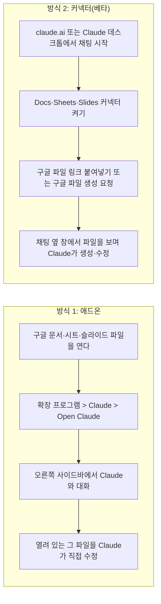
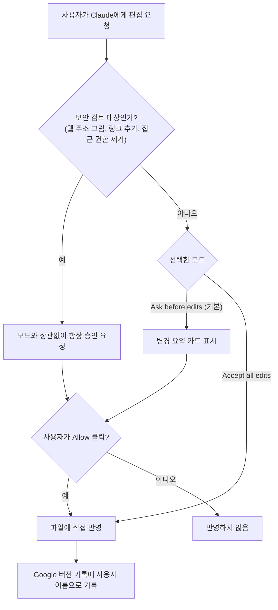
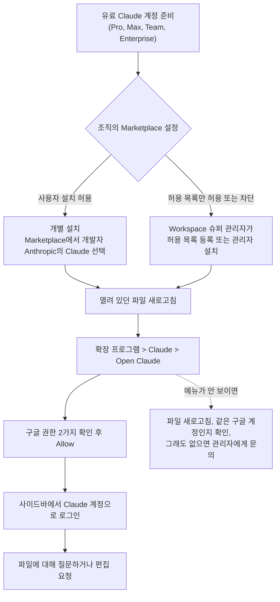

**게시글 내용 풀이 + 공식 자료 기반 사실 확인**

작성 기준일: 2026년 10월 7일

이 문서는 ["MS Office에 이어 Google Workspace도 Claude가 점령하게 됐다"](https://www.facebook.com/share/p/1BBEn883fa/)는 취지의 게시글을 읽고, 그 안에 담긴 소식이 정확히 무엇인지, 설치는 어떻게 하는지, 어디까지 확인된 사실이고 어디부터가 작성자 개인의 경험과 견해인지를 구분해서 설명합니다. 사실 관계는 Anthropic의 공식 발표문과 Claude 도움말 센터 문서를 직접 읽고 확인했으며, 확인하지 못한 부분은 추측으로 메우지 않고 "확인하지 못했다"고 적었습니다.

---

## 1. 먼저 결론부터: 무슨 일이 있었나

Anthropic은 2026년 10월 6일(미국 화요일) 공식 발표를 통해 **Claude for Google Workspace**를 공개 베타로 내놓았습니다. 쉽게 말해, 구글 문서(Docs), 구글 스프레드시트(Sheets), 구글 프레젠테이션(Slides)을 열었을 때 화면 오른쪽에 Claude 전용 사이드바를 띄워 놓고, 지금 열려 있는 파일을 Claude가 읽고 직접 고치게 할 수 있게 되었다는 뜻입니다. 이 기능은 Pro, Max, Team, Enterprise 등 모든 유료 Claude 요금제에서 쓸 수 있습니다.

게시글 작성자는 이 소식을 매우 빨리 접하고, 직접 설치해서 기본 동작까지 확인한 뒤, 공식 문서만 봐서는 설치 방법이 잘 이해되지 않았다는 이유로 자신이 거친 절차를 정리해 올린 것입니다. 글의 앞부분은 "소식 + 설치 안내", 뒷부분은 "AI 에이전트 시대에 도구를 익히는 일의 의미가 줄어든다"는 작성자의 개인적인 생각으로 이루어져 있습니다.

---

## 2. 게시글은 어떤 구조로 되어 있나

게시글은 크게 네 덩어리로 읽힙니다.

첫째는 소식과 평가입니다. MS Office의 엑셀, 파워포인트, 워드에서는 Microsoft의 Copilot에게 문서 작업을 시키는 것보다 Office 확장 프로그램으로 Claude for Excel 등을 설치해 오른쪽 사이드 패널에 띄워 놓고 시키는 편이 훨씬 낫다는 작성자의 경험을 먼저 말하고, 구글 쪽에서도 같은 일이 가능해졌다고 알립니다. 작성자는 최근 AI 에이전트 팀을 꾸린 뒤로 Google Workspace는 설문 양식(Form) 말고는 거의 쓰지 않아서 아직 제대로 테스트하지는 못했고, "잘 설치되어 기본 작동하는 것"까지만 확인했다고 스스로 밝혔습니다.

둘째는 설치 절차 네 단계입니다. 작성자는 공식 문서들을 다 훑어봐도 설치 방법이 직관적으로 나와 있지 않아서 헤맸다고 하면서, 그 과정을 순서대로 정리했습니다. 이 부분이 게시글의 실용적인 핵심이며, 아래 4장에서 공식 문서와 대조하며 자세히 설명합니다.

셋째는 Claude의 완성도에 대한 전망입니다. MS Office 쪽에서 엑셀용 Claude는 처음부터 상당했고 파워포인트용 Claude는 초기에 부족했다가 점점 좋아졌다는 작성자의 경험을 바탕으로, 구글 쪽도 비슷한 전개가 될지 아니면 처음부터 완성도가 높을지 알 수 없다고 말합니다.

넷째는 작성자의 철학적인 이야기입니다. 에이전트의 실력이 올라가면서 사람이 엑셀, 파워포인트, 폼 같은 도구의 세부 기능을 일일이 알 필요가 없어지고, 오히려 사용자가 따로 붙여 놓은 프롬프트나 하네스가 모델의 기본 상태를 방해해 성능을 떨어뜨리는 상황으로 가고 있으며, 결과적으로 "그냥 쓰는 사람"과 "뜯어 고쳐서 새로 만드는 사람"의 비율이 8:2에서 99:1로 벌어질 수도 있다는 내용입니다. 이 부분은 작성자의 견해이며, 검증 가능한 사실 주장이라기보다 관점에 가깝습니다.

---

## 3. 공식 발표로 확인한 사실: 정확히 무엇이 출시되었나

### 3.1 두 개의 서로 다른 통로

이번 발표에서 가장 먼저 구분해야 할 점은, 같은 날 **서로 다른 두 가지**가 함께 공개되었다는 것입니다. 하나는 "애드온(add-on)"이고 다른 하나는 "커넥터(connector)"입니다. 게시글이 다루는 것은 이 중 애드온입니다.

애드온은 구글 파일 안으로 Claude가 들어오는 방식입니다. 구글 문서나 시트, 슬라이드 파일을 열어 둔 상태에서 오른쪽 사이드바로 Claude를 불러내면, Claude가 그 파일의 내용과 사용자가 선택한 부분을 보고 바로 수정합니다. 반대로 커넥터는 Claude 채팅 쪽에서 출발하는 방식입니다. claude.ai 채팅에서 구글 파일 링크를 붙여 넣거나 "구글 슬라이드로 덱을 만들어 줘"라고 요청하면, 채팅 옆에 파일이 열리는 창이 나란히 뜨고 Claude가 구글 파일을 만들거나 수정합니다. Claude 도움말은 이 둘의 차이를 "애드온은 Claude가 이미 작업 중인 파일로 찾아오는 것이고, 커넥터는 채팅하면서 Drive, Gmail, Calendar를 검색·참조하는 것"이라는 취지로 설명합니다.

두 방식 모두 Claude가 접근할 수 있는 범위는 사용자가 이미 가진 구글 공유 권한과 같습니다. 즉 사용자가 볼 수 없는 파일을 Claude가 몰래 볼 수는 없습니다.

### 3.2 앱별로 할 수 있는 일

공식 발표문과 도움말 문서에 따르면 애드온은 앱마다 다음과 같은 일을 합니다.

**구글 문서(Docs)** 에서 Claude는 문장 하나를 고치거나 제목의 서식을 바꾸는 작업을 주변 서식을 건드리지 않고 그 자리에서 수행합니다. 더 큰 재작성은 사이드바에 "제안 카드" 형태로 올릴 수 있는데, 각 카드는 바꾸려는 구절을 강조해서 보여 주고 사용자가 적용하거나 버릴 수 있습니다. 공식 발표문의 예시로는 제품 요구사항 문서의 요약을 간결하게 줄이고 "다음 단계" 항목을 표로 바꿔 달라는 요청이 있습니다. 도움말은 수십 쪽짜리 문서를 절반 이하로 줄이기, 정의되지 않은 용어 찾기, 제목 표기 통일 같은 요청 예시도 소개합니다.

**구글 스프레드시트(Sheets)** 에서 Claude는 수식을 쓰고, 피벗 테이블과 구글 시트 고유의 차트를 만들고, 새 탭을 추가할 수 있습니다. 조인이나 데이터 정리처럼 수식만으로 번거로운 작업은 범위를 Python으로 가져가 처리한 뒤 결과를 시트에 다시 써 넣을 수 있다고 발표문에 적혀 있습니다. 예시로는 원본 파일을 첨부하고 "3분기 예산 대비 실적 보고서를 팀별 탭과 요약 차트와 함께 만들어 달라"고 요청하는 시나리오가 소개되었는데, 이때 예산을 초과한 항목을 Claude가 표시해 줄 수 있다고 합니다.

**구글 프레젠테이션(Slides)** 에서 Claude는 기존 덱의 레이아웃과 테마를 활용해 새 슬라이드를 만들어서 나머지 슬라이드와 어울리게 합니다. 이후 스스로 결과를 점검해 요소가 겹치거나 슬라이드 밖으로 넘치거나 글자가 읽기 어려운 곳을 알려 줄 수 있다고 합니다.

### 3.3 Claude가 얼마나 알아서 하게 둘지: 두 가지 모드

사이드바 하단에는 모드 선택기가 있고, 두 가지 설정이 있습니다. 기본값은 **"Ask before edits(편집 전 확인)"** 로, Claude가 하려는 일을 평이한 말로 보여 주는 승인 카드를 띄우고 사용자가 "Allow"를 눌러야 실제로 수정합니다. 다른 하나는 **"Accept all edits(모든 편집 수락)"** 로, 일반적인 내용 편집은 멈추지 않고 끝까지 진행합니다.

다만 "모든 편집 수락" 모드에서도 멈추는 지점이 있습니다. 링크, 외부 그림, 웹 주소, 누군가의 파일 접근 권한과 관련된 작업은 승인을 다시 요구합니다. 도움말은 웹 주소에서 그림을 넣거나, 링크를 추가하거나, 누군가의 접근 권한을 제거하는 작업에는 "보안 검토" 표시가 붙으며 "항상 허용" 선택지가 아예 없다고 설명합니다. 또한 Claude는 파일을 공유하거나, 다른 사람에게 접근 권한을 주거나, 소유자를 바꾸거나, 메뉴와 예약 자동화를 만들거나, 임의의 웹 페이지를 파일 안으로 불러오는 일은 요청해도 거절하도록 되어 있습니다.

수정 내용은 구글 파일의 정상적인 편집으로 처리되어 사용자 이름으로 버전 기록에 남습니다. 따라서 되돌리고 싶으면 "실행 취소"를 쓰거나 버전 기록에서 이전 버전을 복원하면 됩니다.

### 3.4 사이드바에 함께 따라오는 것들

Claude 계정으로 로그인하면 사이드바에서도 평소 Claude에서 쓰던 **같은 모델, 커넥터, 스킬**을 쓸 수 있다고 공식 발표문은 설명합니다. 예컨대 고객사 분기 업무 검토(QBR) 덱을 요청하면 Salesforce의 계정 이력과 Google Drive 커넥터의 통화 메모를 끌어와 쓸 수 있고, 그 QBR 형식을 스킬로 저장해 두면 팀이 다음 덱을 같은 형식과 절차로 만들 수 있다는 예시가 나옵니다. 모델 선택기에서 요금제에서 쓸 수 있는 Claude 모델을 고를 수 있고, 최대 20개의 참고 파일(문서 30MB, 그림 10MB 한도)을 첨부할 수 있으며, "웹 검색" 스위치는 기본적으로 꺼져 있습니다.

Enterprise 요금제에서는 Compliance API, 고객 관리형 암호화 키(CMEK), OpenTelemetry 감사 내보내기 같은 통제 기능이 이 애드온에도 적용된다고 발표문에 적혀 있습니다.

---

## 4. 설치 방법 상세 해설: 게시글 4단계와 공식 문서 대조

### 4.1 게시글이 설명한 4단계

작성자는 다음 순서를 제시합니다. 먼저 구글 문서·시트·슬라이드 중 아무거나 열고 상단 메뉴에서 "확장 프로그램 > 부가기능 > 부가기능 설치하기"를 고릅니다. 그러면 Google Workspace Marketplace 팝업이 뜨는데, 검색창에 claude를 입력하고 결과에서 Claude를 선택합니다. 다음으로 조직·개인 상황에 따라 "개별 설치" 또는 "관리자 설치"를 실행합니다. 관리자 설치는 설치 직후 바로 메뉴에 나타나지 않고 1~2분 기다려야 하며, 조직이 크면 더 걸릴 수 있다고 합니다. 마지막으로 메뉴 "확장 프로그램 > Claude"가 보이면 그 아래 "Open Claude"를 실행해 오른쪽 패널에서 Claude를 띄웁니다. 그리고 한 앱에서 설치하면 다른 앱에도 자동으로 설치되므로 앱마다 따로 설치할 필요가 없다고 덧붙입니다.

### 4.2 공식 문서로 확인되는 부분

공식 도움말의 "빠른 시작"은 조직이 Marketplace 앱을 허용하는 경우 약 2분이 걸린다고 하며, 순서는 게시글과 본질적으로 같습니다. Marketplace의 Claude 목록 페이지에서 설치하고, 파일을 열어 "확장 프로그램 > Claude > Open Claude"를 선택하고, 처음에는 구글이 두 가지 권한을 허용하라고 요구하며, 사이드바에서 Claude 계정으로 로그인합니다. 도움말은 이어서 "이 문서를 다섯 줄로 요약해 줘", "F열은 무엇을 계산해?" 같은 첫 질문을 시도해 보라고 권합니다.

게시글의 핵심 주장인 "한 번 설치하면 세 앱 모두에 깔린다"는 점은 공식 문서가 정확히 같은 내용으로 확인합니다. 도움말은 "한 번의 설치로 Docs, Sheets, Slides를 모두 커버하며 세 개의 확장 프로그램을 따로 설치하지 않는다"고 적고, FAQ에서도 같은 질문에 "아니요, Marketplace에서 한 번 설치하면 세 앱 모두에 추가된다"고 답합니다.

개별 설치와 관리자 설치의 차이도 문서에 구체적으로 나옵니다. 개별 설치는 Marketplace 목록에서 설치를 누르고 사용하는 구글 계정을 고른 뒤 권한을 허용하고, 이미 열려 있던 파일을 새로고침하는 순서입니다. 관리자 설치는 **Google Workspace 슈퍼 관리자**가 목록 페이지에서 관리자 설치를 눌러 "조직 전체" 또는 "특정 그룹·조직 단위"를 선택하고 데이터 접근과 약관에 동의한 뒤 마침을 누르는 방식입니다. 이후 사용자는 열려 있던 파일을 새로고침하기만 하면 확장 프로그램 메뉴에 Claude가 나타납니다. 이 선택은 Claude 요금제가 아니라 **구글 Workspace 관리자의 Marketplace 설정**에 따라 결정된다고 문서는 분명히 말합니다.

### 4.3 게시글과 공식 문서가 다르거나 확인되지 않는 부분

게시글이 말한 "관리자 설치 후 1~2분 정도 기다려야 메뉴에 보인다"는 시간 수치는 공식 문서에서 찾지 못했습니다. 공식 문서는 관리자 설치 후 "사용자에게 열려 있는 파일을 새로고침하라고 안내"하고, 문제 해결 항목에서 "확장 프로그램 메뉴는 설치 이후에 연 파일에만 나타나므로 메뉴에 없으면 파일을 새로고침하라"고 설명할 뿐입니다. 따라서 "1~2분", "조직이 크면 더 오래"는 작성자가 직접 겪은 경험으로 받아들이는 것이 정확합니다. 파일을 새로고침해 보는 것이 공식적으로 권장되는 첫 조치입니다.

또 한 가지, 작성자가 말한 "공식 문서들이 설치 방법을 직관적으로 안내하지 않았다"는 불만과 관련해서, 지금 시점의 도움말 문서에는 "빠른 시작", "자신을 위해 설치", "조직을 위해 설치", "Marketplace가 막혀 있는 조직의 경우"로 나뉜 설치 절차가 이미 정리되어 있습니다. 해당 문서는 "어제 업데이트됨"으로 표시되어 있어서, 작성자가 문서를 본 시점과 지금의 내용이 같은지는 제가 확인할 수 없습니다. 이 불만의 옳고 그름을 판단하지는 않겠습니다.

### 4.4 설치할 때 실제로 알아두면 좋은 실전 포인트

첫째, Marketplace에서 "claude"로 검색하면 Claude를 이름에 붙이거나 설명에 언급한 **제3자 앱이 여럿** 나옵니다. 게시글에 첨부된 검색 결과 화면에도 "WorkGPT", "Translator AI GPT", "AI for Work" 등 Claude를 언급하는 다른 개발사의 앱이 함께 나열되어 있었습니다. 공식 애드온은 개발자가 **Anthropic**으로 표시된 "Claude"입니다. 게시글의 상세 페이지 정보에는 "정보 업데이트 2026년 10월 6일", 설치 8천+, 별점 5.0(평가 2건)이 표시되어 있었는데, 평가가 2건뿐이라는 점에서 별점은 참고 지표로서 의미가 거의 없습니다.

둘째, 상세 페이지에는 "관리자 설치"와 "개별 설치" 두 버튼이 나란히 있으며, 호환 기기 아이콘으로 구글 문서·시트·슬라이드 세 앱이 표시됩니다. 일반 개인 구글 계정이라면 "개별 설치"가 해당됩니다.

셋째, 설치가 막히면 "This application is not allowed by your administrator(이 애플리케이션은 관리자에 의해 허용되지 않습니다)"라는 문구가 나올 수 있습니다. 이 메시지는 Claude가 아니라 구글이 보여 주는 것이고, 구글 Workspace 관리자가 해결해야 합니다. 관리자는 Admin 콘솔의 "앱 > Google Workspace Marketplace 앱 > 설정"에서 Claude를 허용 목록에 추가하거나, 관리자 설치를 하면 되며, 관리자 설치는 사용자 설치가 막혀 있어도 작동합니다.

넷째, 메뉴를 빨리 찾는 단축키로 Alt+/ (Mac은 Option+/)를 누르고 "Claude"를 입력하는 방법이 도움말에 소개되어 있습니다.

### 4.5 구글이 요구하는 두 가지 권한이 뜻하는 것

공식 문서에 따르면 Claude 애드온이 구글에 요청하는 권한은 두 가지뿐입니다. 하나는 "구글 애플리케이션 안의 프롬프트와 사이드바에서 서드파티 웹 콘텐츠를 표시하고 실행"하는 권한으로, Claude 사이드바를 보여 주기 위한 것입니다. 다른 하나는 "이 애플리케이션이 설치된 문서, 스프레드시트, 프레젠테이션을 보고 관리"하는 권한으로, 사용자가 연 그 파일 하나를 읽고 고치기 위한 것입니다. 문서는 이 두 번째 권한을 구글이 강제하므로 확장 프로그램이 다른 파일을 열 수 없다고 설명하고, Drive, Gmail, Calendar, 연락처에 대한 접근이나 파일에서 외부 네트워크 요청을 보내는 권한은 요청하지 않는다고 밝힙니다.

---

## 5. 알아둬야 할 한계와 주의점 (베타 기준)

공식 도움말은 "현재 한계" 항목을 따로 두고 있으며, 그중 중요한 것은 다음과 같습니다.

세 앱에 공통되는 한계로, 애드온은 **열어 둔 그 파일에서만** 일합니다. Drive의 다른 파일을 열거나 만들거나 복사할 수 없고, 파일을 PDF로 내보내거나 내려받게 할 수도 없습니다. 작업 중에는 사이드바를 열어 둬야 하며 닫으면 진행 중이던 작업이 중단됩니다. 브라우저는 Chrome, Edge, Safari를 써야 하고 Firefox는 이번 베타에서 지원되지 않습니다(사이드바는 열려도 동작이 완료되지 않음). 음성 받아쓰기는 사이드바에서 쓸 수 없습니다. 하나의 긴 작업은 구글이 최대 약 6분에서 멈추므로, 큰 작업은 "탭 하나씩", "슬라이드 열 장씩"처럼 단계로 나눠 시키라고 권고합니다. Microsoft 365에는 있는 "앱 간 작업 전달(Work across apps)"은 Google Workspace에서는 쓸 수 없습니다.

구글 문서에서는 Claude가 **댓글을 읽거나 답하거나 해결 처리할 수 없습니다.** 기존 제안(suggestion)을 수락·거절할 수도 없고, Claude의 편집은 구글의 제안 모드가 아니라 직접 편집으로 반영됩니다. 그래서 변경을 하나씩 검토하고 싶다면 "Ask before edits" 모드를 쓰라고 안내합니다. 문서 탭을 만들거나 이름을 바꾸거나 순서를 바꾸는 것도 못하지만, 모든 탭의 내용을 읽고 고치는 것은 가능합니다. 참고로 앞서 본 **커넥터 쪽은 구글 문서의 댓글과 제안을 읽고 다룰 수 있다**고 도움말에 적혀 있어서, 두 통로의 기능 범위가 서로 다릅니다.

스프레드시트에서는 BigQuery와 연결된 "Connected Sheets" 탭을 읽거나 고칠 수 없고(데이터 > 데이터 커넥터 > 추출로 일반 탭에 복사한 뒤 사용), 트리거, 맞춤 메뉴, 예약 새로고침은 만들 수 없습니다.

슬라이드에서는 Claude가 만든 차트가 **구글 시트와 연결된 차트가 아니라 정적인 그림 형태로 삽입**되므로, 숫자가 바뀌어도 자동으로 갱신되지 않습니다. 갱신이 필요하면 Claude에게 차트를 다시 만들라고 해야 합니다. 이미 연결되어 있던 차트를 Claude가 새로고침할 수도 없어서 사용자가 직접 "업데이트"를 눌러야 합니다.

대화 기록은 **브라우저에 파일별로 저장**됩니다. 다른 기기나 다른 브라우저, 시크릿 창, 사이트 데이터 삭제 후, 그리고 "사본 만들기"로 복제한 파일에서는 이전 대화가 보이지 않습니다. 같은 파일을 보고 있는 다른 사람은 Claude가 한 편집을 파일과 버전 기록에서 볼 수 있지만(사용자 이름으로 기록됨) 대화 내용 자체는 볼 수 없습니다.

---

## 6. 보안·개인정보·기업 사용 시 점검할 것

문서에 따르면 열려 있는 파일의 내용, 사용자의 메시지, 첨부한 파일은 응답 생성을 위해 Claude로 전송됩니다. Team·Enterprise 요금제에서는 조직의 상업 약관과 데이터 처리 부속서가, Pro·Max에서는 소비자 약관과 개인정보 처리방침이 적용됩니다. Anthropic은 이 내용을 모델 학습에 쓰지 않으며, 입출력은 일부 예외를 제외하고 30일 이내에 삭제된다고 설명합니다. 다만 조직이 따로 설정한 데이터 보관 설정은 이 확장 프로그램에 상속되지 않는다고 명시되어 있습니다.

기업 사용자가 특히 확인해야 할 점은 세 가지입니다. 아마존 베드록, 구글 클라우드 버텍스 AI, 애저 AI 파운드리 같은 서드파티 추론 경로나 LLM 게이트웨이는 이번 베타에서 **지원되지 않으며**(Claude 계정 로그인이 필수, API 키 로그인도 불가), 제로 데이터 보존(ZDR)은 **제공되지 않고**, HIPAA 대응 조직으로 **인정되지 않으므로** 보호 대상 건강 정보에는 쓰지 말라고 문서가 안내합니다. 참고로 Claude for Microsoft 365는 서드파티 추론 플랫폼을 지원한다고 같은 문서에 나와 있어서, 이 부분은 MS Office 쪽과 현재 차이가 있습니다.

프롬프트 인젝션에 대해서도 문서는 언급합니다. 파일 안에는 다른 사람이 심어 둔 지시문(흰 글씨나 아주 작은 글씨로 숨긴 것 포함)이 있을 수 있는데, Claude는 문서 내용을 명령이 아닌 데이터로 취급하고, 숨겨진 텍스트를 발견하면 표시하며, 파일 공유나 링크 열기, 누군가에게 연락하라는 문서 속 지시는 따르지 않도록 설계되었다고 합니다. 그래도 외부에서 받은 파일에서는 Claude가 제안하는 동작을 승인하기 전에 직접 검토하라고 당부합니다.

---

## 7. 게시글 주장별 검증 정리

| 게시글의 주장 | 확인 결과 |
|---|---|
| Google Workspace에서도 Claude가 사이드 패널로 작동하게 되었다 | **확인됨.** Anthropic 공식 발표(2026-10-06)와 도움말이 동일하게 설명 |
| 한 번 설치하면 다른 앱에도 자동 설치되어 앱마다 설치할 필요가 없다 | **확인됨.** 도움말이 "한 번의 설치로 Docs, Sheets, Slides 모두 적용"이라고 명시 |
| 메뉴 경로는 확장 프로그램 > Claude > Open Claude | **확인됨.** 공식 발표문과 도움말 모두 같은 경로 |
| 개별 설치와 관리자 설치로 나뉜다 | **확인됨.** 도움말의 "자신을 위해 설치/조직을 위해 설치"와 일치 |
| 관리자 설치 후 1~2분(큰 조직은 더) 기다려야 보인다 | **공식 문서에서 시간 수치는 확인하지 못함.** 작성자의 체험담. 공식 안내는 "파일 새로고침" |
| UI가 Claude for Microsoft Office와 동일하다 | **확인하지 못함.** 작성자의 관찰. 공식 문서에는 비교 설명 없음 |
| Claude가 Google Workspace 각 앱에 특화된 지식을 학습했을 것이다 | **확인하지 못함.** 작성자의 짐작. 공식 문서는 사이드바가 "Claude에서 쓰는 것과 같은 모델, 커넥터, 스킬"을 쓴다고만 설명 |
| 구글의 Gemini보다 훨씬 일을 잘할 것이다 | **검증 불가.** 작성자 본인이 비교는 해 보지 않았다고 밝힌 개인 견해(내기 표현 포함). 비교 근거는 찾지 못함 |
| MS Office에서는 Copilot보다 Claude 확장이 훨씬 낫다 | **작성자의 사용 경험.** 객관적 비교 자료는 확인하지 못함 |
| 엑셀은 처음부터 좋았고 파워포인트는 점점 좋아졌다 | **작성자의 경험.** 확인하지 못함 |
| 공식 문서의 설치 안내가 애매하다 | **의견.** 현재 도움말에는 단계별 설치 절차가 정리되어 있음(작성자가 본 시점의 문서와 같은지는 확인 불가) |
| 에이전트에 붙인 프롬프트·하네스가 오히려 성능을 떨어뜨리는 방향으로 간다 | **작성자의 견해.** 이번 발표와 무관한 일반 주장으로, 이 문서에서는 사실 여부를 판정하지 않음 |
| 소비자와 제작자의 비율이 8:2에서 99:1로 바뀔 수도 있다 | **전망.** 작성자도 "~할 수도 있겠다"로 쓴 가정이며 수치 근거는 제시되지 않음 |

---

## 8. 게시글 후반부 "다른 이야기"를 어떻게 읽을까

작성자는 마지막에 "다른 이야기이긴 한데"라고 전제하며 화제를 바꿉니다. 이 부분을 풀어 쓰면 이렇습니다. 예전에는 엑셀 함수, 파워포인트 레이아웃, 폼 설정 같은 도구 사용법을 익히는 것이 일을 하기 위한 필수 과정이자 하나의 즐거움이기도 했습니다. 그런데 에이전트가 도구에 대한 이해와 숙련을 스스로 익혀 두기 시작하면서, 사람이 할 일은 도구 하나하나를 배우는 것에서 "에이전트를 잘 부리는 것"으로 옮겨 가고 있다는 것이 작성자의 관찰입니다. 동시에 에이전트 자체가 가장 상위의 도구인데 이것은 계속 바뀌어서 따라잡기가 쉽지 않고, 머지않아 대부분의 사람에게는 따라잡기보다 "그냥 쓰면 되는" 상황이 올 것이라고 봅니다.

이어서 작성자는 이미 많은 사람이 자기 지식과 노하우로 붙인 프롬프트나 하네스가 모델의 기본 설정 상태를 방해해서 오히려 성능을 떨어뜨리는 쪽으로 가고 있다고 주장하고, 그 결과로 "그냥 쓰는 소비자"와 "뜯어 고쳐서 개선하거나 새로운 것을 만드는 사람"의 비율이 기존 8:2에서 99:1로 벌어질 수도 있다고 말하며 글을 맺습니다.

이 내용은 이번 Claude for Google Workspace 출시의 사실과는 별개의 **작성자 개인의 관점**입니다. 이 문서는 해당 주장이 맞는지 틀린지 판정하지 않고, 이 관점이 게시글의 앞부분(설치 안내)과 어떻게 연결되는지만 짚어 둡니다. 연결 고리는 이렇습니다. 사용자가 구글 시트의 세부 기능을 몰라도, Claude에게 "예산 대비 실적 보고서를 팀별 탭과 요약 차트로 만들어 줘"라고 결과물을 말하기만 하면 되는 것이 이번 애드온이 보여 주는 사용 방식입니다. 공식 도움말도 "Claude는 원하는 결과를 말해 주면 단계는 알아서 정할 때 가장 잘 작동한다"고 설명합니다. 즉 작성자의 "도구보다 에이전트를 잘 부리는 것이 중요해진다"는 인식은 이 제품이 권장하는 사용 방식과 방향이 같습니다.

---

## 9. 용어 풀이

**애드온(부가기능):** 구글 Workspace 안에 끼워서 쓰는 확장 프로그램입니다. 이번에는 Marketplace에서 설치하고, 문서·시트·슬라이드 오른쪽에 Claude 사이드바를 띄우는 역할을 합니다.

**Google Workspace Marketplace:** 구글 Workspace용 앱과 확장 기능을 모아 둔 앱 장터입니다. 조직의 관리자가 설치를 허용할지 막을지 정할 수 있습니다.

**커넥터(connector):** Claude가 외부 서비스(Gmail, Calendar, Drive, 그리고 이번에 추가된 Docs·Sheets·Slides 등)에 접근하도록 연결해 주는 기능입니다. 애드온과 달리 Claude 쪽에서 출발합니다.

**스킬(skill):** 특정 작업의 절차와 형식을 Claude에게 저장해 두는 기능입니다. 공식 발표문은 QBR 덱 형식을 스킬로 저장해 팀이 반복해서 쓰는 예를 듭니다.

**공개 베타(public beta):** 누구나 쓸 수 있지만 아직 완성된 정식 버전이 아니라 한계와 변경 가능성이 있다는 뜻입니다. 위 5장의 한계들이 이 때문에 존재합니다.

**하네스(harness):** 게시글에서 작성자가 사용한 표현으로, 에이전트를 감싸서 동작을 제어하는 프롬프트·도구·규칙의 묶음을 가리키는 말로 쓰였습니다. 이번 출시의 공식 용어는 아닙니다.

---

## 10. 이 글을 읽은 뒤 해볼 수 있는 일

개인 구글 계정을 쓴다면 Marketplace에서 개발자가 Anthropic인 Claude를 찾아 개별 설치하고, 연습용 문서 하나를 열어 "Ask before edits" 모드에서 간단한 요약이나 문장 다듬기를 시켜 보는 것이 가장 안전한 시작입니다. 조직 계정이라면 "이 애플리케이션은 관리자에 의해 허용되지 않습니다" 문구가 나올 수 있으므로 Workspace 관리자에게 허용 목록 등록 또는 관리자 설치를 요청하면 됩니다. 업무 문서에 쓰기 전에는 6장의 보안 항목, 특히 서드파티 추론 미지원, ZDR 미제공, HIPAA 비대응을 반드시 확인하는 것이 좋습니다. 큰 작업은 6분 제한을 고려해 나눠서 시키고, 차트가 필요한 슬라이드에서는 정적인 그림으로 들어간다는 점을 알고 쓰는 것이 좋습니다.

---

## 출처

공식 자료 (직접 열람)

- Anthropic, "Claude now works with Google Docs, Sheets, and Slides" (2026-10-06): https://claude.com/resources/articles/claude-now-works-in-google-docs-sheets-and-slides
- Claude Help Center, "Use Claude in Google Docs, Sheets, and Slides": https://support.claude.com/en/articles/16951679-use-claude-in-google-docs-sheets-and-slides
- Claude Help Center, "Use Google Workspace connectors": https://support.claude.com/en/articles/10166901-use-google-workspace-connectors
- Google Workspace Marketplace, Claude 목록 (발표문과 도움말이 안내하는 설치 위치): https://workspace.google.com/marketplace/app/claude/12459801340

보도·해설 자료 (검색으로 확인, 공식 자료와 일치하는 범위에서만 참고)

- Investing.com, "Anthropic adds Claude integration to Google Workspace apps": https://www.investing.com/news/stock-market-news/anthropic-adds-claude-integration-to-google-workspace-apps-93CH-4935063
- Benzinga, "Anthropic Expands Claude Into Google Workspace With New AI Tools": https://www.benzinga.com/markets/private-markets/26/10/62206857/anthropic-expands-claude-into-google-workspace-with-new-ai-tools
- PANews, "Anthropic launches Claude for Google Workspace": https://panews.io/articles/01a11250-888c-71d2-a929-660e32304e36
- FourWeekMBA, "Claude Enters Google Docs, Sheets and Slides in Public Beta": https://fourweekmba.com/ai-claude-enters-google-docs-sheets-slides-public-beta/

원문 게시글

- 사용자가 제공한 게시글 본문 및 링크(https://www.facebook.com/share/p/1BBEn883fa/). 이 문서는 사용자가 제공한 본문 텍스트와 첨부 자료를 기준으로 작성했으며, 링크 페이지 자체는 열람하지 않았습니다.

확인 범위에 대한 참고: 공식 문서는 베타 기간 중 수시로 바뀔 수 있습니다. 위 내용은 2026년 10월 7일 시점에 열람한 내용이며, 지원 요금제·한계·정책은 이후 달라질 수 있으므로 실제 도입 전에는 도움말 문서의 최신 내용을 다시 확인하시기 바랍니다.
