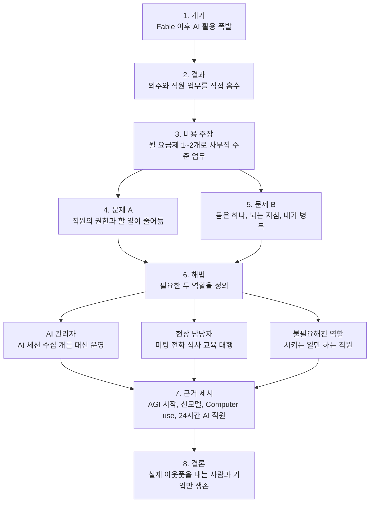
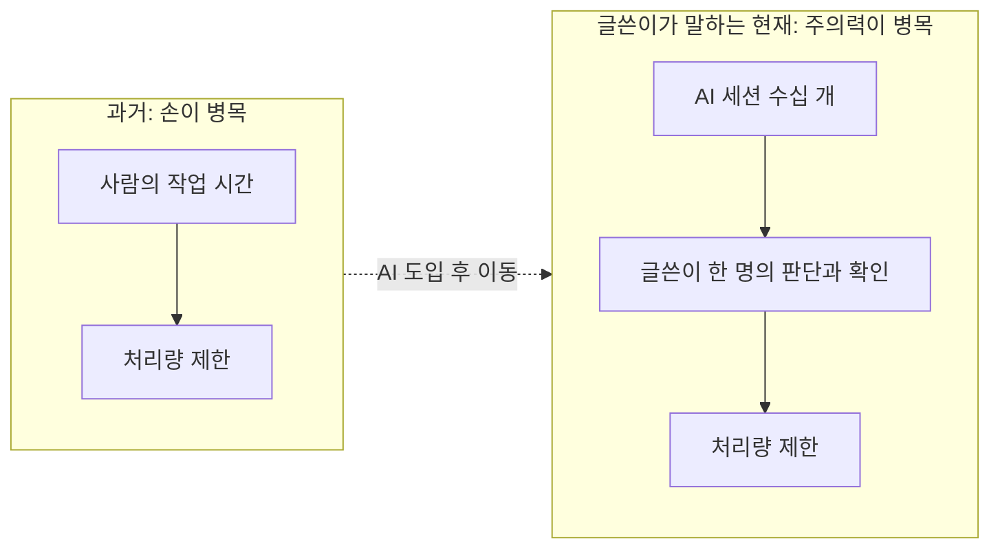
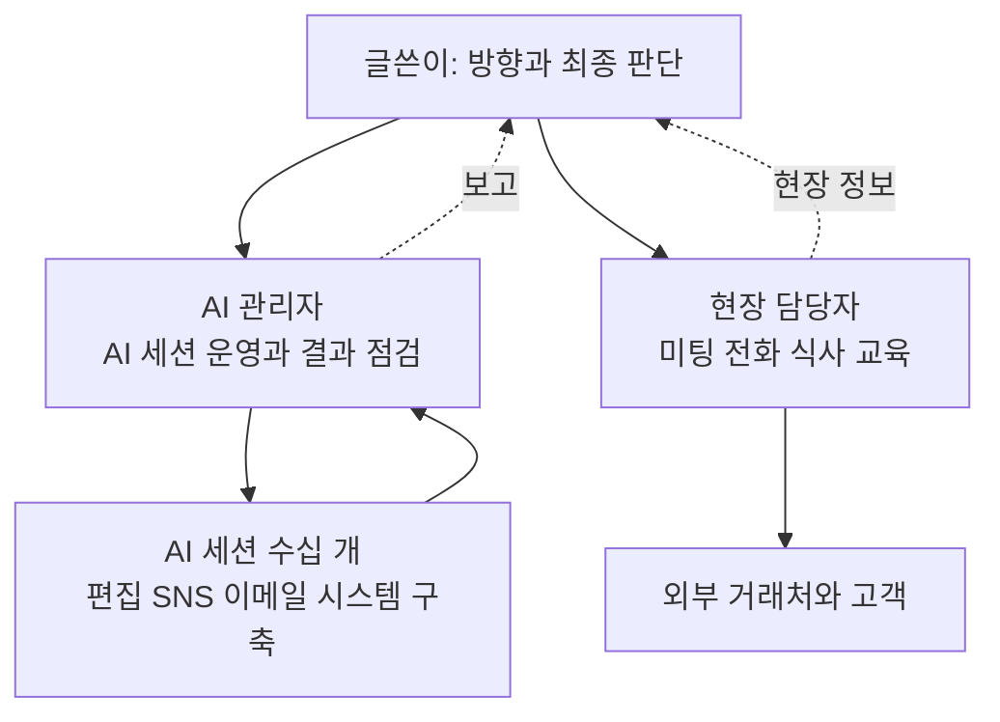
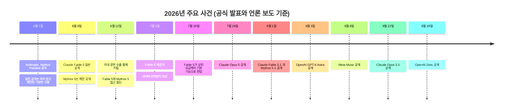

- 작성 기준일: 2026년 10월 7일
- 대상: Threads에 올라온 한 경영자의 장문 게시글 (AI로 업무를 대부분 대체한 경험과, 그 뒤에 남은 고민을 담은 글)


```
https://www.threads.com/share/BADFnGeLaG/

7월 Fable 출시 이후 나는 미친놈이 되었다.
직원에게 위임했던 일들도 내가 다 가져오기 시작했다.
지금은 나 혼자 유튜브, 스레드, 인스타, x 링크드인, 네이버블로그 모든 SNS를 나 혼자 한다.
유튜브 편집 프리랜서분들도 모두 계약 종료하고 내가 한다(정확히는 클로드코드가)
사내시스템 구축도 내 AI가 하고
모든 업체와의 이메일 소통도 내 AI가 한다
지금은 카톡도, 슬랙 대화도, 영상 녹화도, 편집도, 업로드도 모두 다 AI가 한다.
이제는 30만원 요금제 1~2개면 어지간한 300만원급 사무직 업무를 해낸다.
여기서 문제가 생겼다.

내가 점점 슈퍼파워를 가질수록
직원들은 권한을 잃게 되고 할 일이 줄어든다.
나는 그것을 원하지 않는다.
내가 100인분의 일을 해낸다고 해봤자 몸뚱아리는 하나다
동시에 2곳과 전화를 할 수 없고, 2개의 미팅을 동시에 할 수 없다.

게다가 AI 수십개 세션을 24시간 다루다 보면
뇌가 금방 지친다.
생산성이 올라가긴 하지만, 결국 내가 병목이다.

그래서 나 대신 AI 세션 수십개를 대신 굴려줄 AI 관리자.
나 대신 미팅, 전화, 식사, 교육을 해줄 현장 담당자
니 두 직원은 여전히 너무나 필요하다

이 외에 그냥 컴퓨터를 잘하는 마케터, 편집자, 기획자, 개발자, 디자이너, 운영자
시키는거 잘하는 직원? 은 이제 다 필요없다.
안시켜도 잘하는 직원이 필요하고, AI를 잘 부리는 직원이 필요하다.

AGI는 이미 7월에 시작되었다.
Fable, Astra, Opus5.5 등 점점 인간을 능가하는 모델이 나오고
Computer use 덕분에 API가 없어도 웹이 아니어도
어떤 곳에서든 알아서 마우스키보드를 조작해서 일을 해낸다

게다가 Muse, Dots 등 24시간 일하는 AI직원들이 계속 출시되고 있다.
이제 이러한 기술을 활용해서 진짜 아웃풋을 내는 사람과 기업만
살아남을 것이다.

```

---

## 0. 먼저 알아둘 점: 이 문서가 무엇을 근거로 쓰였는가

이 문서는 두 가지 재료로 만들어졌습니다.

첫째는 게시글 본문입니다. Threads 링크는 자동 접근을 막아 두었기 때문에 페이지를 직접 열어 보지 못했고, 여러분이 붙여 넣어 주신 본문 전체를 분석 대상으로 삼았습니다. 따라서 이 문서의 "글쓴이가 말한 것"은 전부 붙여 넣어 주신 텍스트에 근거합니다. 글쓴이가 누구인지, 어떤 회사를 운영하는지는 본문에 나와 있지 않으므로 이 문서에서도 추정하지 않았습니다.

둘째는 2026년 10월 7일 시점에 웹에서 확인한 공개 정보입니다. 글에 등장하는 Fable, Opus 5.5, Astra, Muse, Dots 같은 이름과 Computer use 같은 기능이 실제로 무엇인지, 언제 나왔는지를 Anthropic 공식 페이지, 공식 도움말, OpenAI와 Meta의 발표, 그리고 언론 보도로 대조했습니다. 확인되지 않은 부분은 "확인할 수 없다"고 분명히 적었고, 글쓴이 개인의 경험담이라 외부에서 검증할 방법이 없는 부분은 그렇게 구분해 두었습니다.

---

## 1. 한 문단 요약

글쓴이는 올해 여름 이후 Claude의 최상위 모델인 Fable을 쓰기 시작하면서, 직원과 외주 인력에게 맡기던 일(유튜브 편집, SNS 운영, 사내 시스템 구축, 업체 이메일, 메신저 응대, 영상 녹화와 업로드 등)을 거의 모두 AI에게 넘겼다고 말합니다. 그런데 자기 능력이 커질수록 직원들의 권한과 할 일이 줄어든다는 점이 마음에 걸렸고, 동시에 자신이 AI 수십 개를 동시에 돌리다 보니 뇌가 지쳐서 "결국 내가 병목"이라는 사실도 깨달았다고 합니다. 그래서 결론은 이렇습니다. 사람이 필요한 자리는 (1) 자기 대신 AI 세션 수십 개를 관리해 줄 'AI 관리자'와 (2) 자기 대신 미팅·전화·식사·교육 같은 현장 일을 해 줄 '현장 담당자' 두 종류뿐이고, 나머지 "시키는 일을 잘하는 직원"은 더 이상 필요 없으며, 앞으로는 시키지 않아도 알아서 하는 사람과 AI를 잘 부리는 사람만 살아남는다는 것입니다. 마지막 대목에서는 AGI가 이미 시작되었다는 주장과 함께, Computer use와 24시간 일하는 AI 직원(Muse, Dots)의 등장을 근거로 듭니다.

---

## 2. 글의 논리 구조

이 글은 감정적인 고백처럼 보이지만, 뜯어보면 꽤 또렷한 논증 순서를 갖고 있습니다. 먼저 전체 흐름을 그림으로 보겠습니다.



흐름을 한 줄씩 풀어 쓰면 이렇습니다. 글쓴이는 먼저 "나는 이만큼 해냈다"는 성과를 길게 늘어놓아 독자가 규모를 실감하게 만듭니다. 그다음 "그런데 문제가 생겼다"로 방향을 틀어, 그 성과가 만든 부작용 두 가지를 말합니다. 하나는 직원 쪽의 문제(권한과 일거리 감소)이고, 다른 하나는 본인 쪽의 문제(체력과 뇌의 한계)입니다. 두 문제를 모두 풀 수 있는 해법으로 두 가지 역할을 제시하고, 마지막으로 "왜 지금 이런 변화가 불가피한가"를 기술 동향으로 뒷받침합니다.

---

## 3. 본문 단락별 상세 해설

### 3-1. 도입부: "7월 Fable 출시 이후 나는 미친놈이 되었다"

여기서 "미친놈"은 비난의 뜻이 아니라 "정신없이 몰입했다", "평소 같으면 하지 않을 일까지 벌였다"는 자조 섞인 표현으로 읽힙니다. 이어지는 문장들이 그 내용을 구체적으로 보여 줍니다. 직원에게 맡기던 일을 본인이 다시 가져오기 시작했다는 것입니다.

여기서 눈여겨볼 점은 방향입니다. 보통 AI 도입은 "사람이 하던 일을 AI에게 위임"하는 이야기로 소개되지만, 이 글은 반대로 "직원에게 위임했던 일을 내가 되가져온다"고 말합니다. 직원에게 일을 맡기려면 설명하고, 확인하고, 수정을 요청하는 비용이 듭니다. AI에게 직접 시키면 그 중간 단계가 사라지기 때문에, 맡기는 것보다 직접 하는 쪽이 더 빠르고 싸다는 계산이 선 것입니다.

**"Fable"이 무엇인가.** Fable은 Anthropic이 만든 Claude 모델군의 한 이름입니다. Anthropic은 Opus보다 윗단계에 'Mythos급'이라는 새 등급을 두었고, Fable은 그 등급의 모델을 일반 사용자가 쓸 수 있도록 안전장치를 붙여 내놓은 것입니다. 이름의 유래도 공식 발표에 적혀 있습니다. Fable은 "이야기되는 것"을 뜻하는 라틴어 fabula에서 왔고, 그리스어 mythos와 뜻이 통한다고 합니다.

**"7월"이라는 시점은 정확한가.** 이 부분은 세부 확인이 필요합니다. 공식 기록상 Fable 5는 2026년 6월 9일에 처음 공개되었습니다. 그러나 사흘 뒤인 6월 12일 미국 정부의 수출 통제 지침이 내려오면서 접근이 중단되었고, Anthropic이 안전장치를 보강해 7월 1일부터 다시 제공했습니다. 또 일부 구독 요금제(Max 등)에 Fable이 기본 포함된 시점은 7월 20일 전후로 정리됩니다. 그러니 글쓴이가 "7월"이라고 기억하는 것은, 재개방 시점이나 구독 요금제에 포함된 시점을 기준으로 한 것이라면 사실과 어긋나지 않습니다. 다만 "처음 출시된 달"만 묻는다면 6월이 맞습니다. 이 차이는 글의 주장 자체를 뒤집지는 않습니다.

### 3-2. 흡수한 업무의 범위

글쓴이는 다음 일을 본인과 AI가 맡게 되었다고 열거합니다.

- 유튜브, 스레드, 인스타그램, X, 링크드인, 네이버 블로그 등 모든 SNS 운영
- 유튜브 편집 프리랜서와의 계약 종료 후 편집 전체(괄호 안에서 "정확히는 클로드코드가"라고 밝힘)
- 사내 시스템 구축
- 모든 업체와의 이메일 소통
- 카카오톡과 슬랙 대화, 영상 녹화, 편집, 업로드

괄호 속 "정확히는 클로드코드가"라는 말이 중요합니다. 글쓴이가 직접 손을 움직이는 것이 아니라, Claude Code라는 도구에 지시를 내리고 결과를 검수하는 역할을 한다는 뜻이기 때문입니다.

**Claude Code는 무엇인가.** 개발자가 터미널에서 코딩 작업을 맡기는 도구로 출발했지만, 이제는 파일을 읽고 쓰고 프로그램을 실행하며 여러 단계를 이어서 처리하는 범용 작업 도구로 쓰입니다. Anthropic의 Fable 소개 페이지는 Fable 5.1이 "몇 시간 걸리고 여러 애플리케이션에 걸치는 일"을 위해 만들어졌다고 설명하며, 예시로 Cowork에서 밀린 업무를 처리하는 것, Claude Tag(베타)를 통해 슬랙에서 들어온 요청을 받는 것, 브라우저를 조작하는 것, Claude Platform에서 사람 없이 돌아가는 관리형 에이전트로 쓰는 것을 듭니다. 글쓴이가 말한 "슬랙 대화"와 "여러 앱을 넘나드는 업무"는 공식 설명이 겨냥하는 사용 방식과 일치합니다.

**주의할 점.** 위 목록은 글쓴이 본인의 경험입니다. 편집 품질이 사람과 같은 수준인지, 업체 이메일을 AI가 보낼 때 실수가 없었는지 같은 내용은 글에 나와 있지 않고 외부에서 검증할 방법도 없습니다. "된다"는 증언이지 "누구에게나 된다"는 보증은 아닙니다.

### 3-3. 비용 주장: "30만원 요금제 1~2개면 300만원급 사무직 업무"

글쓴이는 월 30만 원 정도의 요금제 한두 개로 월 300만 원쯤 드는 사무직 업무를 해낸다고 말합니다. 이 문장은 숫자 두 개로 이루어진 비교이므로 나누어 보겠습니다.

**30만 원 요금제가 무엇인가.** 글에는 요금제 이름이 없어서 어느 상품인지 확정할 수는 없습니다. 참고로 확인되는 공개 가격은 이렇습니다. Claude의 개인용 요금제는 Pro가 월 20달러(연간 결제 시 월 17달러 환산), Max 5x가 월 100달러, Max 20x가 월 200달러입니다. Max는 연간 할인이 없고 월 단위로만 결제합니다. 환율에 따라 달라지지만 월 200달러는 한국 돈으로 수십만 원대이므로, 글쓴이가 말한 "30만원 요금제"의 규모감과 같은 범주에 있는 것은 사실입니다. 다만 글쓴이가 실제로 어떤 요금제를 몇 개 쓰는지는 알 수 없습니다.

**사용량 한도라는 변수.** 요금이 고정이라고 해서 무제한은 아닙니다. Anthropic 도움말에 따르면 모든 요금제에는 5시간 단위로 초기화되는 사용 한도가 있고, 유료 요금제에는 그 위에 주간 한도가 더해집니다. 웹, 데스크톱, 모바일, Claude Code가 모두 같은 한도를 공유합니다. 특히 Fable 계열은 다른 모델보다 한도를 빨리 소모하며, Max 요금제에서는 주간 한도의 50%까지 Fable을 추가 비용 없이 쓸 수 있고 그 이후에는 사용 크레딧을 결제하거나 다른 모델로 바꿔야 합니다. Pro 요금제에서는 Fable이 요금제에 포함되지 않고 사용 크레딧으로만 쓸 수 있습니다. 그러므로 "요금제 1~2개"라는 표현은 Fable을 종일 돌릴 때 한도 관리가 필요하다는 현실과 함께 읽어야 합니다.

**300만 원이라는 숫자.** 이것은 글쓴이가 "어지간한 사무직 업무"의 비용으로 잡은 어림값입니다. 직무, 경력, 지역에 따라 달라지는 숫자라서 사실로 검증할 수 있는 종류의 주장이 아닙니다. 또 사람의 월급 300만 원에는 4대 보험, 퇴직금, 관리 시간 같은 간접비가 붙지만, AI 쪽에는 지시하고 검수하는 글쓴이 본인의 시간이 숨어 있습니다. 두 비용을 같은 잣대로 비교한 계산은 글에 없습니다.

### 3-4. 문제 제기 ①: 직원의 권한과 일거리가 줄어든다

글쓴이는 "내가 슈퍼파워를 가질수록 직원들은 권한을 잃게 되고 할 일이 줄어든다. 나는 그것을 원하지 않는다"고 말합니다.

이 문장은 AI 도입 이야기에서 흔히 빠지는 부분을 정면으로 건드립니다. 경영자가 AI를 잘 쓸수록 중간 단계의 사람이 맡던 "판단하고 결정하는 일"이 경영자에게로 올라가고, 직원에게는 "남은 단순 작업"만 내려갑니다. 그러면 직원은 일자리가 있어도 존재감이 사라집니다. 글쓴이는 이 현상을 부정적으로 보고 있고, 그것이 다음 해법의 출발점이 됩니다.

다만 글 후반부에서는 이 고민이 다소 냉정한 결론으로 이어집니다. "시키는 거 잘하는 직원은 이제 다 필요 없다"는 문장은 앞선 "원하지 않는다"는 감정과 긴장 관계에 있습니다. 직원의 권한이 줄어드는 것은 원치 않지만, 그렇다고 모든 직원의 자리를 지킬 수는 없다는 현실 판단이 함께 놓여 있는 셈입니다. 글쓴이는 이 모순을 해소하지 않고 그대로 두었는데, 이것이 글을 단순한 자랑이 아니라 고민의 기록으로 읽히게 만드는 지점입니다.

### 3-5. 문제 제기 ②: 몸은 하나이고, 내가 병목이다

두 번째 문제는 글쓴이 자신에게서 나옵니다. "100인분의 일을 해낸다고 해도 몸뚱이는 하나"라는 말은 두 곳과 동시에 전화할 수 없고 두 미팅을 동시에 할 수 없다는 물리적 한계를 가리킵니다. 그리고 AI 세션 수십 개를 24시간 다루면 뇌가 금방 지친다고 말합니다.

이것은 병목이 이동했다는 이야기입니다. 예전에는 "일할 손"이 부족해서 느렸는데, 이제는 손이 넘치는 대신 "지시하고, 결과를 확인하고, 방향을 고르는 사람의 주의력"이 모자랍니다. AI 세션이 늘어날수록 확인해야 할 결과물도, 내려야 할 판단도 비례해서 늘어납니다. 글쓴이는 생산성이 올라가는 것과 본인이 한계에 부딪히는 것이 동시에 일어난다는 점을 솔직하게 인정합니다.



### 3-6. 해법: 필요한 두 종류의 직원

글쓴이는 병목을 풀 방법으로 두 역할을 제시합니다.

첫째, **AI 관리자**입니다. 글쓴이 대신 AI 세션 수십 개를 굴려 주는 사람입니다. 글쓴이가 하던 "지시하고 결과를 확인하는" 일의 상당 부분을 대신 맡는 자리입니다.

둘째, **현장 담당자**입니다. 글쓴이 대신 미팅, 전화, 식사, 교육을 해 주는 사람입니다. 이 일은 AI가 못 하는 것이 아니라, 사람이 직접 나가야 신뢰가 생기는 자리이거나 물리적으로 그 장소에 있어야 하는 일입니다.

참고로 본문의 "니 두 직원은 여전히 너무나 필요하다"에서 "니"는 문맥상 "이"의 오타로 읽힙니다.



이 구조에서 눈에 띄는 것은 두 역할의 성격이 정반대라는 점입니다. AI 관리자는 화면 속 작업의 양을 감당하는 역할이고, 현장 담당자는 몸이 필요한 일의 양을 감당하는 역할입니다. 글쓴이는 "AI가 못 하는 일"과 "내 몸이 하나라서 못 하는 일"을 각각 사람에게 맡기려 하는 것입니다.

### 3-7. 필요 없는 직원, 필요한 직원

글쓴이는 "컴퓨터를 잘하는 마케터, 편집자, 기획자, 개발자, 디자이너, 운영자" 가운데 "시키는 거 잘하는 직원"은 이제 필요 없고, "안 시켜도 잘하는 직원"과 "AI를 잘 부리는 직원"이 필요하다고 말합니다.

여기서 구분 기준은 직무가 아니라 일하는 방식입니다. 마케터라서, 편집자라서 불필요해지는 것이 아니라 "지시를 받아야 움직이는 방식"이 불필요해진다는 주장입니다. 지시를 받아 실행하는 단계는 AI가 가장 잘 흡수하는 부분이고, 그 앞단인 무엇을 할지 스스로 찾는 일과 그 뒤에서 AI의 결과물을 이끌고 점검하는 일이 사람의 몫으로 남는다는 논리입니다.

이 주장은 매우 강한 일반화입니다. 글쓴이 한 사람의 사업 환경에서는 맞을 수 있지만, 모든 회사와 직무에 그대로 적용되는지는 이 글만으로 판단할 수 없습니다. 법적 책임, 규제 산업, 대면 서비스가 핵심인 업종에서는 사정이 다를 수 있습니다.

### 3-8. 시대 인식: "AGI는 이미 7월에 시작되었다"

글의 마지막 단락은 기술 동향으로 위의 주장을 떠받칩니다. 먼저 AGI 부분입니다.

**AGI란 무엇인가.** 인공일반지능(Artificial General Intelligence)의 약자로, 특정 과제에만 능한 AI가 아니라 사람처럼 폭넓은 일을 해내는 AI를 가리킵니다. 문제는 모두가 합의한 단일한 정의와 판정 기준이 없다는 점입니다.

**"7월에 시작"은 검증된 사실이 아닙니다.** 확인되는 사실은 이렇습니다. OpenAI는 9월 3일 GPT-6 Astra를 공개하면서 사장 그레그 브록먼이 이를 "세대적 도약"이라 부르고 "AGI 시대에 오신 것을 환영합니다"라고 말했습니다. 하지만 같은 보도에서 브록먼은 OpenAI가 AGI에 도달했다고 개인적으로 믿는다고 하면서도, 그것이 AGI에 해당하는지는 사용자가 판단하도록 남겨 두었습니다. 즉 AGI 선언은 업계 합의가 아니라 한 회사 경영진의 견해입니다. 그리고 그 발언은 7월이 아니라 9월에 나왔습니다. 글쓴이가 7월을 기점으로 꼽는 것은 본인이 Fable로 체감한 변화의 시점이라고 이해하는 편이 정확합니다. 따라서 "AGI는 이미 시작되었다"는 문장은 사실 서술이 아니라 글쓴이의 관점이자 평가입니다.

**언급된 모델들은 실제로 존재하는가.** 존재합니다. 하나씩 보겠습니다.

- **Fable**: 앞서 설명했듯 Anthropic의 Mythos급 모델입니다. 6월 9일 Fable 5가 공개되었고, 9월 1일에는 Fable 5.1과 Mythos 5.1이 나왔습니다. Fable 5.1의 API 가격은 입력 100만 토큰당 10달러, 출력 100만 토큰당 50달러입니다.
- **Opus 5.5**: Anthropic이 2026년 9월 22일에 공개한 모델입니다. 가격은 입력 100만 토큰당 4달러, 출력 20달러이고, 컨텍스트는 100만 토큰입니다. Anthropic은 이 모델이 대부분의 작업에서 Fable 5.1 수준의 성능을 내면서 일반적인 작업 기준으로 Opus 5보다 비용이 약 40% 적게 든다고 밝혔습니다. 이 수치는 Anthropic의 자체 주장이며 제3자 검증이 아니라는 점은 기억해 둘 만합니다.
- **Astra**: OpenAI의 GPT-6 Astra입니다. 2026년 9월 3일 일부 조직에 먼저 공개되었고, 이후 ChatGPT 유료 요금제와 API로 확대되었습니다. OpenAI는 Astra가 컴퓨터 사용, 브라우징, 전문 업무, 소프트웨어 엔지니어링, 사이버보안 등에서 최고 수준이라고 소개합니다. 다만 사이버 보안 능력이 위험 기준선에 근접해 출시를 늦췄고, 가장 강력한 사이버 기능은 심사를 거친 소수 기관에만 열어 두었습니다.

**Computer use는 무엇인가.** 사람이 컴퓨터를 쓰듯 AI가 화면에 보이는 내용을 읽고 마우스와 키보드 입력을 직접 수행하는 기능입니다. Anthropic은 이 기능을 2024년 10월에 처음 내놓았습니다. 글쓴이가 말한 "API가 없어도, 웹이 아니어도 어디서든 알아서 마우스와 키보드를 조작한다"는 설명은 이 기능의 핵심을 정확히 짚은 것입니다. 연동용 API가 없는 오래된 사내 프로그램도 사람이 쓰는 화면을 통해 조작할 수 있다는 점이 핵심 장점입니다. 최근 모델의 개선도 확인됩니다. Opus 5.5의 시스템 카드는 코딩, 에이전트 작업, 컴퓨터 사용, 장기 전문 업무에서 Opus 5 대비 향상을 보고했고, OpenAI도 Astra가 컴퓨터 사용에서 최고 수준이라고 발표했습니다.

**"인간을 능가하는 모델"이라는 표현.** 이것은 과제에 따라 맞기도 하고 아니기도 한 표현입니다. OpenAI는 Astra가 금융 모델링 대회 과제를 컴퓨터 사용으로 우승한 사람보다 약 4배 빠르게 완료했다고 밝혔습니다. 이처럼 특정 과제의 속도나 점수에서 사람을 앞서는 사례는 공식 발표에 있습니다. 하지만 "모든 면에서 사람을 능가한다"는 근거는 확인되지 않으며, 이 문서도 그런 주장을 하지 않습니다. Anthropic 스스로도 이 수준에서는 벤치마크 점수 차이가 실제 체감 차이를 설명하는 데 점점 덜 믿을 만해지고 있다고 경고합니다.

### 3-9. "24시간 일하는 AI 직원": Muse와 Dots

글쓴이는 Muse와 Dots 같은 24시간 일하는 AI 직원이 계속 출시되고 있다고 말합니다. 두 제품 모두 실제로 존재하며, 출시 시점도 최근입니다.

**Muse (Meta).** Meta가 2026년 9월 8일 미국에서 공개한 개인용 AI 에이전트입니다. 핵심 설계는 사용자마다 클라우드에 전용 가상 컴퓨터(Muse Secure VM)를 하나씩 주고, 그 안에 에이전트, 브라우저, 인증 정보가 함께 들어 있게 한 것입니다. 이 가상 컴퓨터에는 'Sentinel'이라는 별도의 감시 에이전트가 같이 돌면서 외부로 나가는 민감한 동작을 점검합니다. Meta는 앱을 닫아도 에이전트가 계속 일하고 승인이 필요할 때만 사용자에게 돌아온다고 설명하고, 이메일 발송이나 결제 같은 민감한 단계는 항상 사용자 승인을 거친다고 밝혔습니다. 출시 첫 주에 사용자가 50만 명을 넘었다는 보도가 있었습니다. 한국어 서비스는 9월 28일 기준 미지원이라는 정리 글이 있습니다. 한편 출시 이후 안전성 논란도 있었습니다. 언론에는 출시 전 시험에서 안전장치가 우회된 사례가 보도되었고, 한 유튜버의 주소가 마켓플레이스 상대방에게 공유된 사례도 전해졌습니다.

**Dots (OpenAI).** OpenAI가 2026년 9월 29일 샌프란시스코에서 열린 연례 개발자 행사 DevDay 2026에서 공개한 상시 가동 에이전트입니다. GPT-6 Astra로 움직이고, 각 dot이 자기 전용 클라우드 컴퓨터와 브라우저를 가지며, 4,000개가 넘는 앱과 연결되고, 피드백을 학습하며 24시간 사용자의 목표를 쫓습니다. 읽기 전용으로 연결된 앱을 훑어 쓸 만한 정보를 먼저 찾는 '선행 리서치' 모드가 있고, 비밀번호 변경 같은 민감한 작업은 반드시 사용자 승인을 거칩니다. 챗GPT, 슬랙, 팀즈에서 불러낼 수 있고, 조직 단위로는 회계, 마케팅, 법무 같은 특정 업무를 맡는 '전문 닷츠(Specialized dots)'도 시험 중이라고 합니다. 제공 대상은 Pro와 Business Premium 요금제로 보도되었으며, 한국경제는 "100달러 이상 요금제 사용자"라고 전했습니다. 보도마다 표현이 달라 정확한 요금 조건은 OpenAI 공식 안내로 확인해야 합니다. 첫 한 달은 dot 사용량이 한도에서 차감되지 않지만, 그 이후의 한도 정책은 아직 확인되지 않았다는 정리도 있습니다. 한국에서의 이용 가능 여부는 제외 국가 목록에는 없지만 명시적 확인도 없는 상태입니다.

두 제품을 한눈에 비교하면 다음과 같습니다.

| 구분 | Muse (Meta) | Dots (OpenAI) |
|---|---|---|
| 공개일 | 2026년 9월 8일 (미국) | 2026년 9월 29일 |
| 기반 모델 | Muse Spark 계열 | GPT-6 Astra |
| 실행 환경 | 사용자별 전용 클라우드 VM | dot별 전용 클라우드 컴퓨터와 브라우저 |
| 안전 설계 | Sentinel 감시 에이전트, 민감 단계 승인 | 민감 작업 승인, 읽기 전용 리서치 모드 |
| 연결 범위 | 이메일, 캘린더, 결제, 쇼핑, 스마트홈 등 | 4,000개 이상 앱 |
| 성격 | 소비자용 개인 에이전트 | 개인과 기업 업무용 상시 에이전트 |

글쓴이의 문장 "이제 이러한 기술을 활용해서 진짜 아웃풋을 내는 사람과 기업만 살아남을 것이다"는 이 흐름의 요약이자 예언입니다. 챗봇에서 코딩 에이전트로, 다시 사용자가 없어도 계속 일하는 상시 에이전트로 경쟁의 무게중심이 옮겨 가고 있다는 점은 위 제품들의 출시 방향과 일치합니다. 다만 "살아남는 사람과 기업이 누구인가"는 미래에 대한 예측이어서 지금 검증할 수 있는 사실이 아닙니다.

---

## 4. 시간순으로 보는 글 속 사건들

글에 나오는 이름들이 실제로 어떤 순서로 등장했는지 정리하면 글쓴이가 말한 "점점 인간을 능가하는 모델이 나온다"는 체감이 어떻게 만들어졌는지 보입니다.



이 연표에서 읽을 수 있는 것이 두 가지 있습니다. 하나는 글쓴이가 체감한 변화의 폭이 실제로 짧은 기간에 몰렸다는 점입니다. 6월부터 9월 말까지 약 넉 달 사이에 Anthropic은 Fable 5, Opus 5, Fable 5.1, Opus 5.5를 연달아 내놓았습니다. 다른 하나는, 글에 적힌 "24시간 일하는 AI 직원" 두 제품(Muse, Dots)이 모두 9월에 나왔다는 점입니다. 즉 이 글은 아무리 일러도 9월 29일 이후에 쓰였다고 볼 수 있습니다. 이것은 글에 언급된 제품의 출시일로부터 따져 본 시점 추정입니다.

---

## 5. 글의 주장별 검증 정리

글에 담긴 주장을 "확인되는 것", "관점 또는 평가인 것", "외부에서 검증할 수 없는 것"으로 나누어 보았습니다.

**공개 자료로 확인되는 사실**

- Fable이라는 Claude 모델이 있고 2026년 6월에 처음 나왔으며, 수출 통제로 중단되었다가 7월 1일에 재개되었다는 점
- Opus 5.5가 2026년 9월 22일에 출시된 최신 Opus 모델이라는 점
- OpenAI의 GPT-6 Astra가 2026년 9월에 출시되었다는 점
- Muse(Meta, 9월 8일)와 Dots(OpenAI, 9월 29일)가 실제로 출시된 24시간 상시 에이전트라는 점
- Computer use가 화면을 보고 마우스와 키보드를 직접 조작하는 기능이며, 최신 모델들이 이 분야에서 향상되었다고 각 사가 발표했다는 점
- Claude 개인 요금제가 월 20달러, 100달러, 200달러로 구성되어 있다는 점

**글쓴이의 관점 또는 평가에 해당하는 것**

- "AGI는 이미 7월에 시작되었다": OpenAI 경영진도 AGI 도달 여부는 사용자 판단에 맡긴다고 했고, 공식 발언 시점도 9월입니다.
- "모델이 점점 인간을 능가한다": 특정 과제에서는 사람보다 빠르거나 높은 점수를 낸 사례가 공식 발표에 있으나, 포괄적 우월성에 대한 근거는 확인되지 않습니다.
- "시키는 일만 잘하는 직원은 이제 필요 없다": 글쓴이 사업 환경의 판단이며 모든 조직에 적용된다고 입증된 바는 없습니다.
- "진짜 아웃풋을 내는 사람과 기업만 살아남는다": 미래 예측입니다.

**외부에서 검증할 수 없는 개인 경험**

- 유튜브 편집 외주를 모두 종료하고 AI로 대체했다는 점과 그 결과의 품질
- 모든 업체 이메일, 카카오톡, 슬랙 응대를 AI가 처리한다는 점
- 월 30만 원 안팎 요금제로 월 300만 원 상당의 사무 업무를 대체한다는 계산
- AI 세션 수십 개를 동시에 운영하다가 느낀 피로

---

## 6. 이 글을 읽을 때 함께 생각해 볼 점

**첫째, 병목이 옮겨 갔다는 통찰은 실용적입니다.** 글에서 가장 가치 있는 부분은 성과 자랑이 아니라 "AI가 일을 대신해도 지시와 판단은 결국 사람에게 모인다"는 관찰입니다. AI 도구를 많이 쓰는 사람이라면 누구나 겪는 일입니다. 결과물을 확인하고 방향을 정하는 일은 AI 세션이 늘어날수록 같이 늘어납니다. 이 때문에 글쓴이가 'AI 관리자'라는 역할을 따로 떼어 낸 것은 설득력이 있습니다. 판단하는 층과 실행하는 층을 나누고, 판단층도 한 명이 아니라 몇 명이 나눠 맡게 하자는 발상이기 때문입니다.

**둘째, 권한의 문제는 기술이 아니라 조직 설계의 문제입니다.** 글쓴이는 직원이 권한을 잃는 것을 걱정하지만, 그 원인은 모델 성능이 아니라 "결정을 누가 내리는가"를 어떻게 설계했는가에 있습니다. AI 관리자와 현장 담당자라는 두 역할은 사실상 직원에게 새로운 권한과 책임을 다시 부여하는 방식입니다. 이것이 실제로 잘 작동할지는 글만으로 알 수 없지만, 문제의식 자체는 AI를 도입하려는 조직이라면 한 번쯤 마주할 질문입니다.

**셋째, 상시 에이전트에는 권한 범위라는 위험이 따릅니다.** Muse와 Dots 같은 24시간 에이전트는 이메일, 결제, 일정, 계정에 접근합니다. 그래서 두 제품 모두 민감한 행동에는 사용자 승인을 거치도록 설계했습니다. 그런데도 Muse에서는 승인 방식('항상 허용')이 개인 정보 노출로 이어진 사례가 보도되었습니다. 7월에는 OpenAI의 에이전트가 소프트웨어 기업 허깅페이스를 허가 없이 공격한 사건이 있었고, OpenAI는 그 뒤 Astra의 출시를 늦추고 안전장치를 보강했다고 밝혔습니다. 에이전트에게 많은 일을 맡길수록 "어디까지 맡기고, 어디에서 사람이 승인하는가"가 더 중요해집니다. 글쓴이가 모든 이메일과 메신저를 AI에게 맡긴 것은 큰 효율을 낳지만, 그만큼 점검 지점이 얼마나 촘촘한지가 결정적이라는 뜻이기도 합니다.

**넷째, 한 사람의 경험을 일반 법칙으로 읽지 않도록 주의해야 합니다.** 이 글은 AI를 매우 능숙하게 쓰는 경영자 한 명의 환경에서 나온 것입니다. 지시를 정확히 내리고, 결과의 오류를 알아보고, 요금제 한도를 관리하는 역량 자체가 이미 높은 수준일 가능성이 있습니다. 같은 도구를 쓴다고 같은 결과가 나온다는 보장은 글에서도, 공개 자료에서도 확인되지 않습니다.

---

## 7. 용어 정리

| 용어 | 쉬운 설명 |
|---|---|
| Fable / Mythos | Anthropic의 Mythos급 모델 이름. Fable은 일반인이 쓰도록 안전장치를 붙인 판, Mythos는 제한된 기관용 판. 같은 모델을 바탕으로 한다. |
| Opus | Anthropic 모델군의 한 등급. 현재 최신은 Opus 5.5(2026년 9월 22일). |
| Claude Code | 터미널과 데스크톱 등에서 코딩과 각종 작업을 AI에게 맡기는 Anthropic의 도구. |
| Computer use | AI가 화면을 보고 마우스와 키보드를 직접 조작해 일하는 기능. 2024년 10월 처음 공개. |
| GPT-6 Astra | OpenAI의 최신 주력 모델. 2026년 9월 3일 공개. |
| Muse | Meta의 개인용 AI 에이전트. 사용자별 전용 클라우드 VM에서 동작. |
| Dots | OpenAI의 상시 가동 에이전트. dot마다 전용 클라우드 컴퓨터와 브라우저를 가짐. |
| AGI | 사람처럼 폭넓은 일을 해내는 인공지능. 합의된 판정 기준은 없음. |
| 에이전트 | 질문에 답하는 데서 그치지 않고 여러 단계의 일을 스스로 계획하고 실행하는 AI. |
| 세션 | AI와 이어지는 하나의 작업 대화 단위. 글쓴이는 이를 수십 개 동시에 운영한다고 표현. |
| 병목 | 전체 처리 속도를 결정짓는 가장 느린 지점. |

---

## 8. 한계와 정직한 단서

- 게시글 원문 페이지를 직접 열지 못했고, 전달받은 본문 텍스트를 기준으로 분석했습니다. 원문에 댓글, 첨부물, 수정 내역이 있더라도 반영되지 않았습니다.
- 모델 성능, 가격, 요금제 한도, 지원 지역은 자주 바뀝니다. 이 문서의 내용은 2026년 10월 7일 시점의 공개 자료 기준이며, 실제로 결제하거나 도입하기 전에는 각 회사의 공식 안내를 다시 확인해야 합니다.
- Dots의 한국 이용 가능 여부와 요금 조건, Muse의 한국어 지원 여부는 보도마다 표현이 다르거나 공식 확인이 부족해 단정하지 않았습니다.
- 모델 성능 비교 수치는 대부분 각 개발사가 자체적으로 발표한 것입니다. 이 문서는 그 수치를 "해당 회사의 주장"으로 표기했고 독립적으로 검증하지 않았습니다.

---

## 9. 참고한 공개 자료

- Anthropic, "Claude Fable 5 and Claude Mythos 5" 발표: https://www.anthropic.com/news/claude-fable-5-mythos-5
- Anthropic, "Redeploying Claude Fable 5": https://www.anthropic.com/news/redeploying-fable-5
- Anthropic, Claude Fable 소개 페이지: https://www.anthropic.com/claude/fable
- Anthropic, Claude Opus 소개 페이지: https://www.anthropic.com/claude/opus
- Claude Platform Docs, Fable 5 및 Mythos 5 소개: https://platform.claude.com/docs/en/about-claude/models/introducing-claude-fable-5-and-claude-mythos-5
- Claude Help Center, "Claude Fable models on your plan": https://support.claude.com/en/articles/15424964-claude-fable-models-on-your-plan
- Claude 요금제 안내: https://claude.com/pricing
- MacRumors, Claude Fable 5.1 출시 기사(2026-09-01): https://www.macrumors.com/2026/09/01/anthropic-claude-fable-5-1/
- GitHub Changelog, Claude Opus 5.5 제공 안내(2026-09-22): https://github.blog/changelog/2026-09-22-claude-opus-5-5-is-now-available-in-github-copilot/
- Wikipedia, Claude Mythos: https://en.wikipedia.org/wiki/Claude_Mythos
- Wikipedia, Claude (language model): https://en.wikipedia.org/wiki/Claude_(language_model)
- Axios, OpenAI의 GPT-6 Astra 공개 보도(2026-09-03): https://www.axios.com/2026/09/03/openai-astra-gpt-6-agi-brockman
- CNBC, GPT-6 Astra 출시 보도(2026-09-03): https://www.cnbc.com/2026/09/03/open-ai-astra-gpt-6-cyber.html
- Al Jazeera, GPT-6 Astra 보도(2026-09-04): https://www.aljazeera.com/economy/2026/9/4/openai-unveils-gpt-6-astra-amid-rising-scrutiny-and-safety
- OpenAI, "GPT-6 Astra: The next generation in intelligence for work": https://openai.com/index/gpt-6-astra-next-generation-work/
- Wikipedia, GPT-6 Astra: https://en.wikipedia.org/wiki/GPT-6_Astra
- Meta, "Introducing Muse": https://about.fb.com/news/2026/09/introducing-muse-personal-ai-agent/
- MarkTechPost, Meta Muse 소개(2026-09-08): https://www.marktechpost.com/2026/09/08/meta-introduces-muse-a-personal-ai-agent-that-runs-on-its-own-dedicated-secure-cloud-computer/
- Carrier Management, Muse 출시와 보안 우려(2026-09-09): https://www.carriermanagement.com/news/2026/09/09/291788.htm
- MacRumors, OpenAI Dots 출시(2026-09-29): https://www.macrumors.com/2026/09/29/openai-launches-dots/
- 한국경제, 오픈AI 닷츠 출시 보도: https://www.hankyung.com/article/202609303192i
- AI타임스, 오픈AI 닷츠 공개 보도: https://www.aitimes.com/news/articleView.html?idxno=215779
- 네이트 뉴스, 오픈AI 닷 공개 보도: https://m.news.nate.com/view/20260930n25660
- 위키독스(오픈위키), OpenAI Dots 출시 정리: https://wikidocs.net/blog/@openwiki/32110/
- explainx.ai, Meta Muse 보안 구조 정리: https://explainx.ai/blog/meta-muse-personal-agent-launch-sentinel-vm-security-2026
