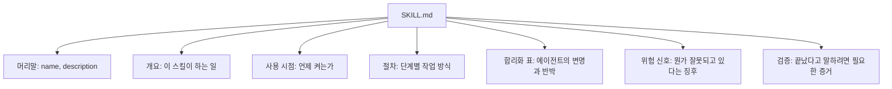
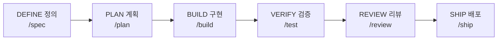
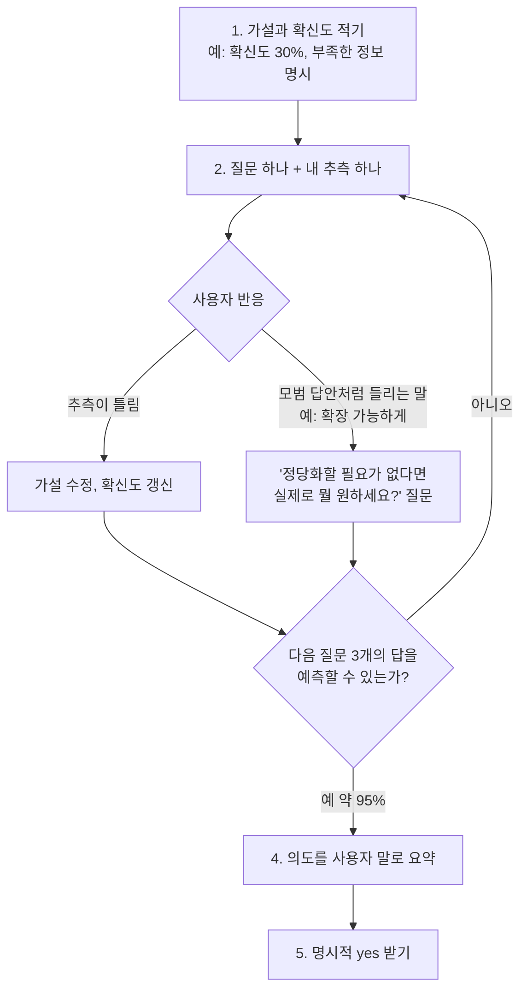
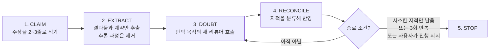
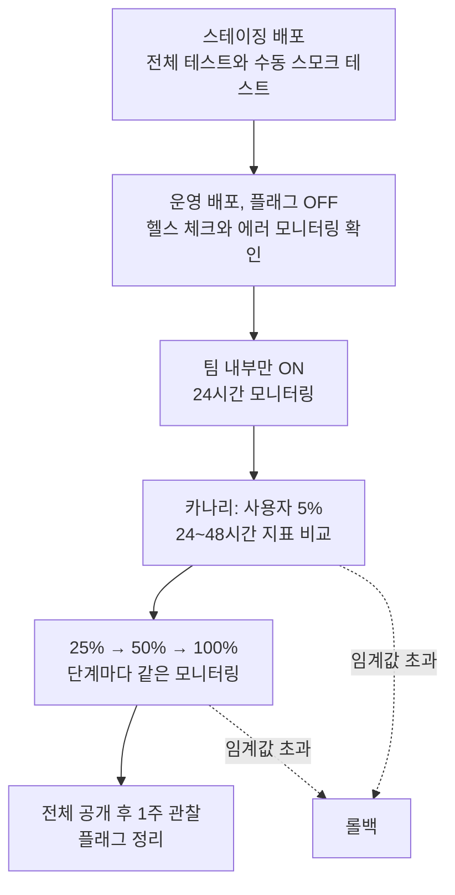

> 한 줄 요약: `addyosmani/agent-skills`는 AI 코딩 에이전트가 아이디어 정리부터 명세, 구현, 검증, 리뷰, 배포까지 개발의 전 과정에서 **시니어 엔지니어가 지키는 절차와 품질 기준을 빠뜨리지 않도록** 만든 25개의 스킬 묶음입니다. 단순한 프롬프트 모음이 아니라, 단계와 체크포인트, 종료 조건이 정해진 "작업 절차서"에 가깝습니다.


```
구글 엔지니어가 자기 워크플로 전체를 깃허브에 풀었음.

Addy Osmani라는 이름, 크롬 개발자 경험 총괄임.

이 사람이 에이전트 스킬 25개를 공개했는데
범위가 진짜 현실적임.

'내가 진짜 원하는 게 뭔지 파악'하는 것부터
배포, 그리고 롤백까지.

즉 아이디어 → 코드 → 출시 → 복구 전부를
에이전트한테 위임하는 방식을 정리한 세트임.

실무 깊은 사람이 쓴 거라
구루들이 파는 뻔한 팁들과 결이 다름.

AI로 코딩하는 사람이면 한번 훑어볼 가치 있음. 🔥

https://github.com/addyosmani/agent-skills

```

---

## 1. 먼저 바로잡을 점: 저자의 현재 소속

소셜 미디어에서 이 저장소를 소개하는 글들은 저자를 "구글 엔지니어" 또는 "크롬 개발자 경험 총괄"이라고 부르는 경우가 많습니다. 과거의 경력으로는 맞지만 **지금의 소속은 아닙니다.** 검색으로 확인한 내용은 다음과 같습니다.

- Addy Osmani는 2012년경 구글에 합류해 약 14년간 일했고, 오랫동안 Chrome의 개발자 경험(Developer Experience) 조직을 이끌었습니다. Chrome DevTools, Lighthouse, Core Web Vitals 같은 도구와 지표가 그의 조직과 연결되어 있습니다.
- 2024년 12월에는 Google Cloud AI의 디렉터로 옮겨 Gemini 개발자 경험과 기술 에반젤리즘을 맡았습니다.
- 2026년에 구글을 떠났고, 그의 공식 소개 페이지(addyosmani.com/bio)는 현재 **Anthropic의 Member of Technical Staff로서 Claude Code 작업을 하고 있다**고 적고 있습니다.
- 합류 발표 시점은 보도마다 조금 달라 보이지만, 2026년 9월 초(9월 8일로 보도됨)에 본인이 직접 합류 소식을 알린 것으로 전해집니다. 구글 퇴사 소식 자체는 6월 중순 무렵부터 업계에 퍼졌습니다.

따라서 이 저장소를 설명할 때는 "구글 엔지니어가 풀었다"보다 "**구글과 크롬에서 14년간 개발자 도구를 만든 엔지니어가 만든 공개 저장소**"라고 쓰는 편이 정확합니다. 참고로 저장소는 구글이나 Anthropic 조직이 아니라 그의 개인 GitHub 계정(`addyosmani`) 아래에 있고, MIT 라이선스로 공개되어 있습니다.

---

## 2. 저장소 한눈에 보기

| 항목 | 내용 |
| --- | --- |
| 저장소 | `github.com/addyosmani/agent-skills` |
| 설명 | Production-grade engineering skills for AI coding agents |
| 웹사이트 | skills.addy.ie |
| 라이선스 | MIT |
| 규모 | 별 약 10만 개 이상, 포크 약 1만 1천 개, 커밋 600여 개 (수치는 매일 변동) |
| 구성 | 스킬 25개, 슬래시 명령 9개, 전문가 페르소나 4개, 참고 체크리스트 7개 |
| 공동 관리자 | Addy Osmani(제작자), Federico Bartoli, Joan León |

별과 포크 수는 조회하는 시점마다 달라집니다. 이 글을 쓰는 시점에 직접 확인한 값과, 공유해 주신 정보(별 103k, 포크 10.8k, 최신 릴리스 0.6.12)가 약간 다른 것도 그 때문입니다. 정확한 현재 수치는 저장소에서 직접 확인하시는 것이 좋습니다.

---

## 3. 핵심 개념: "스킬"이란 무엇인가

### 3.1 스킬은 프롬프트가 아니라 절차서입니다

AI 코딩 에이전트는 별다른 지시가 없으면 **가장 짧은 길**로 가려는 경향이 있습니다. 명세를 쓰지 않고, 테스트를 미루고, 보안 점검을 건너뛰고, "일단 동작하니 끝"이라고 말하는 식입니다. 저장소의 README는 바로 이 점을 출발점으로 삼습니다. 시니어 엔지니어가 몸에 익힌 규율을 에이전트도 매번 똑같이 따르게 만들자는 것입니다.

그래서 각 스킬은 `SKILL.md`라는 마크다운 파일 하나로 되어 있고, 모두 같은 틀을 따릅니다.



이 틀에서 눈여겨볼 부분은 두 가지입니다.

**첫째, "합리화 표(Common Rationalizations)"입니다.** 에이전트가 단계를 건너뛸 때 내놓는 전형적인 핑계와, 그에 대한 반박을 짝지어 적어 둔 표입니다. 예를 들어 "테스트는 나중에 추가하겠다"는 변명에는 "나중은 오지 않는다"는 식의 반론이 미리 적혀 있습니다. 사람에게 "원칙을 지키세요"라고 말하는 것보다, 사람이 흔히 대는 핑계를 미리 막아 두는 쪽이 효과적이라는 발상입니다.

**둘째, "검증(Verification)"입니다.** 모든 스킬은 "그럴듯해 보인다"가 아니라 **테스트 통과, 빌드 결과, 실행 중 측정 데이터 같은 증거**를 요구하며 끝납니다.

### 3.2 점진적 공개로 토큰을 아낍니다

스킬의 진입점은 `SKILL.md` 하나이고, 더 자세한 체크리스트는 필요할 때만 `references/` 폴더에서 불러옵니다. 에이전트의 작업 메모리(컨텍스트)를 불필요하게 채우지 않기 위한 설계입니다.

---

## 4. 전체 흐름: 정의 → 계획 → 구현 → 검증 → 리뷰 → 배포

저장소는 개발 생애주기를 여섯 단계로 나누고, 단계마다 슬래시 명령을 붙였습니다.



슬래시 명령은 모두 9개입니다.

| 하려는 일 | 명령 | 핵심 원칙 |
| --- | --- | --- |
| 무엇을 만들지 정의 | `/spec` | 코드 전에 명세 |
| 어떻게 만들지 계획 | `/plan` | 작고 쪼개진 작업 |
| 조금씩 구현 | `/build` | 한 번에 한 조각 |
| 동작을 증명 | `/test` | 테스트가 곧 증거 |
| 품질 기준 설정 | `/constraints` | 한 번 정하고 어디서나 강제 |
| 병합 전 검토 | `/review` | 코드 건강도 개선 |
| 웹 성능 점검 | `/webperf` | 최적화 전에 측정 |
| 코드 단순화 | `/code-simplify` | 영리함보다 명료함 |
| 운영 배포 | `/ship` | 빠른 것이 안전한 것 |

여기에 한 가지 옵션이 있습니다. **`/build auto`** 는 계획을 만들고 모든 작업을 한 번의 승인으로 이어서 구현합니다. 다만 README는 이것이 "작업 사이에 사람이 끼어드는 단계"를 없애는 것이지 **검증을 없애는 것이 아니라고** 분명히 적고 있습니다. 각 작업은 여전히 테스트 주도로 진행되고 개별 커밋으로 남으며, 실패하거나 위험한 단계에서는 멈춥니다.

또한 명령을 직접 입력하지 않아도, API를 설계하면 `api-and-interface-design`이, UI를 만들면 `frontend-ui-engineering`이 자동으로 켜지는 식으로 작업 성격에 따라 스킬이 활성화됩니다.

---

## 5. 25개 스킬 전체 지도

README는 25개를 "메타 1개 + 생애주기 24개"로 설명합니다. 단계별로 정리하면 다음과 같습니다.

### 5.1 메타: 어떤 스킬을 쓸지 고르는 스킬

- **using-agent-skills**: 들어온 작업을 알맞은 스킬 흐름으로 연결하고, 공통 운영 규칙을 정합니다. 세션을 시작하거나 어떤 스킬이 맞는지 모를 때 씁니다.

### 5.2 정의(Define): 무엇을 만들지 분명히 하기

- **interview-me**: 한 번에 질문 하나씩 던지며 사용자가 *진짜로 원하는 것*을 끌어냅니다. (6장에서 자세히 설명합니다.)
- **idea-refine**: 막연한 아이디어를 발산과 수렴의 사고 과정을 거쳐 구체적인 제안으로 다듬습니다.
- **spec-driven-development**: 코드를 쓰기 전에 목표, 명령어, 구조, 코드 스타일, 테스트, 경계를 담은 PRD를 씁니다.
- **constraint-driven-development**: 품질 기준을 인터뷰로 정하고 `CONSTRAINTS.md`로 남깁니다. 각 검사를 비용에 맞는 위치에 배치하고, 에이전트가 검사를 꺼 버리거나 테스트를 건너뛰어 "초록불"만 만드는 행동을 잡아냅니다.

### 5.3 계획(Plan)

- **planning-and-task-breakdown**: 명세를 인수 조건과 의존 순서가 있는 작은 작업 단위로 분해합니다.

### 5.4 구현(Build)

- **incremental-implementation**: 얇은 수직 조각 단위로 구현, 테스트, 검증, 커밋을 반복합니다. 기능 플래그와 안전한 기본값, 되돌리기 쉬운 변경을 강조합니다.
- **test-driven-development**: Red-Green-Refactor를 따르고, 테스트 피라미드(80/15/5 비율), 테스트 크기 구분 등을 다룹니다.
- **context-engineering**: 에이전트에게 적절한 정보를 적절한 때에 주는 방법(규칙 파일, 컨텍스트 정리, MCP 연동)을 다룹니다. 출력 품질이 떨어질 때 씁니다.
- **source-driven-development**: 프레임워크 관련 결정을 공식 문서에 근거해 내리고, 출처를 달고, 확인하지 못한 부분은 표시합니다.
- **doubt-driven-development**: 중요한 결정마다 "반박하는 것이 목적인" 새 리뷰어를 세워 검증합니다. (7장에서 설명합니다.)
- **frontend-ui-engineering**: 컴포넌트 구조, 디자인 시스템, 상태 관리, 반응형, WCAG 2.1 AA 접근성을 다룹니다.
- **api-and-interface-design**: 계약 우선 설계, Hyrum의 법칙, 오류 의미 체계, 경계 검증 등을 다룹니다.

### 5.5 검증(Verify)

- **browser-testing-with-devtools**: Chrome DevTools MCP로 DOM, 콘솔 로그, 네트워크 추적, 성능 프로파일 같은 *실제 실행 데이터*를 확인합니다.
- **debugging-and-error-recovery**: 재현, 위치 특정, 축소, 수정, 재발 방지의 5단계 분류 절차와 "멈춤 규칙"을 따릅니다.

### 5.6 리뷰(Review)

- **code-review-and-quality**: 다섯 가지 축으로 검토하고, 변경 크기(약 100줄)와 심각도 라벨(Nit/Optional/FYI)을 정합니다.
- **code-simplification**: Chesterton의 울타리, 500의 규칙 등을 활용해 동작은 보존하면서 복잡도를 줄입니다.
- **security-and-hardening**: OWASP Top 10 대응, 인증 패턴, 비밀 관리, 의존성 점검을 다룹니다.
- **performance-optimization**: 측정 우선 접근, Core Web Vitals 목표, 프로파일링과 번들 분석을 다룹니다.

### 5.7 배포(Ship)

- **git-workflow-and-versioning**: 트렁크 기반 개발, 원자적 커밋, "커밋을 저장 지점으로 쓰는" 패턴을 다룹니다.
- **ci-cd-and-automation**: 문제를 앞단에서 잡는 Shift Left, 기능 플래그, 품질 게이트 파이프라인을 다룹니다.
- **deprecation-and-migration**: "코드는 자산이 아니라 부채"라는 관점에서 오래된 시스템을 제거하고 이전하는 방법을 다룹니다.
- **documentation-and-adrs**: 아키텍처 결정 기록(ADR)처럼 *왜* 그렇게 했는지를 남깁니다.
- **observability-and-instrumentation**: 구조화된 로그, RED 지표, OpenTelemetry 추적, 증상 기반 경보를 만들면서 계측합니다.
- **shipping-and-launch**: 출시 전 체크리스트, 단계적 롤아웃, 롤백 절차, 모니터링 설정을 다룹니다. (8장에서 설명합니다.)

---

## 6. 대표 사례 ①: interview-me — "원한다고 말하는 것"과 "정말 원하는 것"의 차이

소개 글에서 "내가 진짜 원하는 게 뭔지 파악하는 것부터"라고 표현한 부분이 바로 이 스킬입니다.

### 6.1 문제의식

스킬 본문은 이렇게 시작합니다. 사람들은 "대시보드를 만들어 줘"라고 말하지만, 그것은 대시보드가 문제를 풀어 줘서가 아니라 **그렇게 말하는 것이 관례이기 때문**인 경우가 많다는 것입니다. 코드가 생기기 전에 이 간극을 찾는 것이 가장 쌉니다. 구현이 시작되면 방향을 바꾸는 비용이 커지고, 사용자도 "이 정도면 괜찮다"며 어긋난 결과를 합리화하기 쉽기 때문입니다.

### 6.2 진행 방식



핵심 규칙은 다음과 같습니다.

- **질문은 한 번에 하나**입니다. 여러 개를 한꺼번에 던지면 사용자가 훑어 읽고 건성으로 답하게 되고, 두 번째 질문이 첫 번째 답에 달려 있는 경우도 많기 때문입니다.
- **질문마다 내 추측을 붙입니다.** 사용자는 백지에서 답을 만드는 것보다 틀린 추측에 반응하는 것이 빠릅니다. 또 에이전트가 자기 가정을 겉으로 드러내게 됩니다.
- **"원해야 할 것 같은 것"을 경계합니다.** "확장 가능해야 해요", "요즘 방식대로요" 같은 말은 구체적인 목표가 아니라 그럴듯한 대답일 수 있습니다. 이럴 때 던지는 질문이 "누구에게도 설명할 필요가 없다면 실제로 무엇을 원하세요?"입니다.
- **종료 기준이 점검 가능합니다.** "느낌상 충분하다"가 아니라 "다음에 물을 질문 세 개에 대한 사용자의 반응을 예측할 수 있는가"입니다.
- **마지막 요약에는 반드시 '범위 밖(Out of scope)'을 넣습니다.** 결과, 사용자, 왜 지금인지, 성공 기준, 제약 조건과 함께 *만들지 않을 것*을 적습니다. 오해의 절반은 "무엇을 만들지 않는지"에 대한 조용한 불일치에서 나오기 때문입니다.
- **"알아서 해 주세요", "좋아요", 침묵은 yes가 아닙니다.** 이럴 때는 구체적인 선택지 두 개를 제시해 다시 묻도록 되어 있습니다.

본문의 예시가 이해하기 좋습니다. "우리 지표 대시보드를 만들어 줘"라는 요청에서 시작해 질문 두어 개만 거치자, 실제로 필요한 것은 팀용 대시보드가 아니라 **흩어진 실험 목록을 한곳에 모으는 개인용 목록**이었다는 사실이 드러납니다. 대시보드를 바로 만들었다면 엉뚱한 결과물이 나왔을 것입니다.

### 6.3 한계도 명시되어 있습니다

이 스킬은 **실시간으로 응답하는 사용자가 있어야** 작동합니다. CI, 예약 실행, 자율 루프 같은 비대화형 환경에서는 호출하지 말고, 요구사항이 모호하면 추측하지 말고 사용자에게 막힘 사항으로 알리라고 적혀 있습니다.

---

## 7. 대표 사례 ②: doubt-driven-development — 확신에 찬 답이 맞는 답은 아니다

긴 작업 세션에서는 처음에 가정이던 것이 어느새 사실처럼 굳어 버립니다. 이 스킬은 **중요한 결정마다 새로운 문맥의 리뷰어를 세워, 승인이 아니라 반박을 목표로 검토**하게 합니다.



설계 의도가 돋보이는 대목은 다음과 같습니다.

- 리뷰어에게는 **결과물과 계약(만족해야 할 조건)만** 넘기고, 에이전트의 **결론(CLAIM)은 넘기지 않습니다.** 결론을 알려 주면 리뷰어가 동의하는 쪽으로 기울기 때문입니다.
- 리뷰어에게 주는 지시는 "이거 괜찮아?"가 아니라 "문제를 찾아라"여야 합니다.
- 리뷰어의 지적은 판결이 아니라 **데이터**입니다. 지적을 "계약 오해 / 유효하고 실행 가능 / 유효하지만 감수할 트레이드오프 / 잡음" 순서로 분류하며, 그대로 받아들이는 것도 무시하는 것도 같은 실패로 봅니다.
- **반복은 최대 3회**입니다. 세 번을 돌고도 본질적인 문제가 남으면, 계속 돌리지 말고 사용자에게 알리라고 합니다. 그 상태 자체가 "산출물이 아직 준비되지 않았다"는 정보라는 논리입니다.
- 다른 모델의 의견을 받는 **교차 모델 검토**도 있는데, 대화형 세션에서는 항상 제안은 하되 **외부 CLI(Gemini CLI, Codex CLI 등)는 사용자가 명시적으로 허락해야만** 실행합니다. 읽기 전용 샌드박스에서 돌리라는 안전 지침도 들어 있습니다.
- 모든 키 입력을 의심하면 아무것도 출시하지 못하므로, **분기 로직, 모듈 경계 변경, 되돌릴 수 없는 작업** 같은 "중요한 결정"에만 적용하도록 범위를 좁혀 두었습니다.

---

## 8. 대표 사례 ③: shipping-and-launch — 배포와 롤백까지

"아이디어 → 코드 → 출시 → 복구"라는 소개의 마지막 두 단계가 이 스킬에 담겨 있습니다. 목표는 단순한 배포가 아니라 **되돌릴 수 있고(reversible), 관찰할 수 있고(observable), 점진적인(incremental) 출시**입니다.

### 8.1 출시 전 체크리스트

코드 품질, 보안, 성능, 접근성, 인프라, 문서의 여섯 영역으로 나뉩니다. 예를 들어 코드에는 "테스트 통과, 빌드 경고 없음, 리뷰 승인", 보안에는 "코드나 버전 관리에 비밀 정보 없음, 인증·인가 확인, 속도 제한", 접근성에는 "키보드 탐색, 스크린 리더, 대비 4.5:1" 같은 항목이 있습니다.

### 8.2 기능 플래그와 단계적 롤아웃

핵심은 **배포와 공개를 분리**하는 것입니다. 코드는 기능 플래그를 꺼 둔 채 운영에 올리고, 그다음에 공개 범위를 넓혀 갑니다.



### 8.3 "전진 / 보류 / 롤백"을 숫자로 정해 둡니다

스킬은 감이 아니라 임계값 표로 판단하게 합니다.

| 지표 | 전진(초록) | 보류하고 조사(노랑) | 롤백(빨강) |
| --- | --- | --- | --- |
| 오류율 | 기준선 대비 10% 이내 | 기준선보다 10~100% 높음 | 기준선의 2배 초과 |
| P95 지연시간 | 기준선 대비 20% 이내 | 20~50% 높음 | 50% 초과 |
| 클라이언트 JS 오류 | 새로운 오류 유형 없음 | 세션의 0.1% 미만에서 새 오류 | 0.1% 초과 |
| 비즈니스 지표 | 중립 또는 개선 | 5% 미만 하락 | 5% 초과 하락 |

이 수치들은 스킬이 제시하는 **기본 가이드**입니다. 서비스 특성에 따라 팀이 조정해야 하는 값이지, 모든 환경에 맞는 정답은 아닙니다.

### 8.4 롤백 계획은 배포 전에 씁니다

스킬은 "모든 배포에는 일어나기 전에 롤백 계획이 있어야 한다"고 못 박습니다. 계획서에는 발동 조건, 롤백 절차(플래그 끄기 또는 이전 버전 재배포), 데이터베이스 고려 사항, 예상 소요 시간(플래그는 1분 미만, 이전 버전 재배포는 5분 미만, DB 롤백은 15분 미만이라는 예시)이 들어갑니다. "롤백은 실패를 인정하는 것"이라는 생각에는 "롤백은 책임 있는 엔지니어링이며, 망가진 기능을 계속 내보내는 것이 실패"라고 반박하는 합리화 표도 포함되어 있습니다.

---

## 9. 에이전트 페르소나와 참고 체크리스트

### 9.1 페르소나 4종

특정 관점의 점검이 필요할 때 부르는 전문가 역할입니다.

| 페르소나 | 역할 | 관점 |
| --- | --- | --- |
| code-reviewer | 시니어 스태프 엔지니어 | 다섯 축 리뷰, "스태프 엔지니어가 승인할까?" 기준 |
| test-engineer | QA 전문가 | 테스트 전략, 커버리지 분석, 증명 패턴 |
| security-auditor | 보안 엔지니어 | 취약점 탐지, 위협 모델링, OWASP 평가 |
| web-performance-auditor | 웹 성능 엔지니어 | Core Web Vitals 점검(빠른/심층 모드), 지표 정직성 규칙 |

참고로 저장소에는 **"페르소나는 다른 페르소나를 호출하지 않는다"** 는 조율 규칙이 있습니다. 여러 역할이 서로를 연쇄 호출하며 통제 불능이 되는 것을 막기 위한 장치로 읽힙니다.

### 9.2 참고 체크리스트 7종

definition-of-done(모든 변경이 넘어야 하는 상시 기준), testing-patterns, security-checklist, performance-checklist, accessibility-checklist, observability-checklist, orchestration-patterns입니다. 스킬이 필요할 때만 꺼내 쓰는 자료입니다.

---

## 10. 어떻게 설치하고 쓰나

README가 안내하는 가장 빠른 방법은 여러 에이전트를 한 번에 지원하는 스킬 CLI입니다.

```bash
npx skills add addyosmani/agent-skills            # 25개 전체 설치
npx skills add addyosmani/agent-skills --list     # 설치 전에 목록 보기
npx skills add addyosmani/agent-skills --skill interview-me   # 하나만 설치
```

도구별 네이티브 설치도 안내되어 있습니다.

| 도구 | 방법 요약 |
| --- | --- |
| Claude Code (권장) | `/plugin marketplace add addyosmani/agent-skills` 후 `/plugin install agent-skills@addy-agent-skills` |
| Codex (CLI v0.122 이상) | `codex plugin marketplace add addyosmani/agent-skills` 후 `codex plugin add agent-skills@agent-skills` |
| Gemini CLI | `gemini skills install` 명령으로 저장소의 `skills` 경로 설치 |
| Cursor, Windsurf, OpenCode, GitHub Copilot, Kiro 등 | 각 도구용 설정 문서 제공 |
| 그 외 | 스킬이 순수 마크다운이므로 시스템 프롬프트나 지침 파일을 받는 에이전트면 사용 가능 |

### 알아 둘 점

- **스킬 하나만 설치하면 `references/` 폴더가 빠집니다.** 스킬은 동작하지만 공유 체크리스트 경로가 끊긴다는 한계가 README에 명시되어 있고, 이슈 #361로 추적 중입니다. 전체 저장소 방식으로 설치하거나, 필요한 체크리스트를 스킬 폴더 안으로 복사하면 됩니다.
- Claude Code 마켓플레이스 설치는 SSH로 저장소를 복제하므로, SSH 키가 없다면 HTTPS 주소로 추가하라는 안내가 있습니다.
- 기존 코드베이스에 도입한다면 README가 가리키는 **도입 가이드(docs/adoption-guide.md)** 에 두 갈래가 있습니다. 새 프로젝트는 처음부터 전체 생애주기를 쓰고, 오래된 코드베이스는 검증 위주로 점진적으로 들여오는 방식입니다.

---

## 11. 소개 글의 주장을 점검해 보면

공유해 주신 소개 글의 문장들을 저장소 내용과 대조해 보았습니다.

| 소개 글의 주장 | 확인 결과 |
| --- | --- |
| 에이전트 스킬 25개를 공개했다 | **사실.** 25개(메타 1 + 생애주기 24)입니다. |
| 구글 엔지니어가 자기 워크플로 전체를 풀었다 | **부분적으로 부정확.** 저자는 구글에서 14년 일했지만 현재는 Anthropic 소속입니다. 또 "자기 워크플로 전체"라기보다는 저자가 시니어 엔지니어링 관행을 스킬 형태로 정리해 공개한 것이라고 보는 편이 README 설명과 맞습니다. |
| 크롬 개발자 경험 총괄이다 | **과거 직함.** 오랫동안 그 조직을 이끌었으나 2024년 12월에 Google Cloud AI로 옮겼고, 이후 구글을 떠났습니다. |
| 정의부터 배포, 롤백까지 다룬다 | **사실.** 정의 단계 스킬에서 출시와 롤백 절차 스킬까지 이어집니다. |
| 아이디어부터 복구까지 전부를 에이전트에게 위임하는 방식이다 | **과장에 가깝습니다.** 아래에서 설명합니다. |
| 구루들의 뻔한 팁과 결이 다르다 | **평가의 영역입니다.** 근거가 될 만한 설계 특징은 아래에 정리했습니다. |

### "전부 위임"이라는 표현에 대하여

저장소를 읽어 보면 사람을 빼는 구조가 아닙니다. 오히려 **사람이 개입해야 할 지점을 명시적으로 설계**해 두었습니다.

- `interview-me`는 응답하는 사용자가 없으면 쓰지 말라고 합니다.
- `/build auto`는 계획을 사람이 한 번 승인해야 하고, 실패나 위험한 단계에서는 멈춥니다.
- `doubt-driven-development`는 외부 모델 호출을 사용자 허락 없이는 하지 않습니다.
- 비대화형 환경에서는 건너뛴 사실을 *반드시 알리도록* 되어 있습니다.

즉 "에이전트가 알아서 다 한다"가 아니라 "**에이전트가 빠르게 하되, 시니어가 지키던 점검 지점을 건너뛰지 못하게 한다**"에 가깝습니다. 이 구분이 이 저장소를 이해하는 핵심입니다.

### "결이 다르다"고 볼 만한 설계 특징

- 조언이 아니라 **종료 조건과 증거 요구가 붙은 절차**입니다.
- 에이전트의 **회피 패턴(합리화)을 미리 적어 두고 반박**합니다.
- 구글의 엔지니어링 문화(Software Engineering at Google 책, 구글 엔지니어링 관행 가이드)에서 온 개념이 절차 안에 박혀 있다고 README가 설명합니다. Hyrum의 법칙, 테스트 피라미드, Beyonce 규칙, Chesterton의 울타리, 트렁크 기반 개발 등입니다.
- "확신이 있어도 반박해 본다", "정말 원하는 것을 묻는다"처럼 **에이전트의 자기 과신을 견제하는 장치**가 많습니다.

다만 README가 스스로 "battle-tested(실전 검증됨)"를 기준으로 내세운다고 해서, 모든 스킬의 효과가 독립적으로 입증되었다는 뜻은 아닙니다. README는 유사 프로젝트인 Superpowers, Matt Pocock의 스킬과의 비교 문서(docs/comparison.md)와 외부인이 쓴 비교 실험 글을 링크하고 있으니, 도입을 고민하신다면 그 자료와 함께 **본인 프로젝트에서 작은 범위로 시험**해 보시기를 권합니다.

---

## 12. 어떤 사람에게 맞고, 무엇을 조심할까

### 도움이 될 만한 경우

- AI 에이전트에 코드를 맡기는데 **테스트 누락, 보안 소홀, 검증 없는 "완료" 보고**가 자주 마음에 걸리는 경우
- 요구사항이 모호한 채로 구현이 시작되어 **재작업**이 잦은 경우
- 팀에서 에이전트 사용 규칙을 정하고 싶은데 **무엇부터 문서화할지** 막막한 경우
- 배포와 롤백 같은 운영 절차를 에이전트와 함께 점검하고 싶은 경우

### 조심할 점

- **스킬이 많을수록 컨텍스트 부담과 절차 비용이 늘 수 있습니다.** README도 `doubt-driven-development`에 대해 "모든 입력을 의심하면 아무것도 출시하지 못한다"며 적용 범위를 좁혀 두었습니다. 작은 수정에까지 전 과정을 돌릴 필요는 없습니다.
- 일부 예시와 수치(테스트 비율 80/15/5, 임계값 표 등)는 **기본값**입니다. 팀과 서비스에 맞게 조정하는 것이 전제입니다.
- 예시 코드에는 JavaScript/TypeScript, React, npm 중심의 내용이 많습니다. 다른 스택이라면 원칙은 쓸 수 있어도 **예시는 번안**해야 할 수 있습니다.
- 도구별 호환성에는 알려진 제약이 있습니다. 예를 들어 README는 Antigravity CLI의 일부 릴리스에서 레거시 명령 래퍼가 검색되지 않는 문제를 밝히고 있습니다.
- 프로젝트가 빠르게 바뀌고 있습니다(최신 릴리스 번호가 0.6.x대이고, 이슈와 풀 리퀘스트도 활발합니다). **설치 시점의 README를 다시 확인**하세요.

### 추천하는 시작 방법

1. 전체를 한꺼번에 들이기보다 `interview-me`, `test-driven-development`, `code-review-and-quality` 같은 **한두 개만** 먼저 설치합니다.
2. 실제 작은 작업 하나에 적용해 보고, 에이전트의 행동이 어떻게 달라지는지 확인합니다.
3. 효과가 있으면 `spec-driven-development`와 `shipping-and-launch`처럼 앞뒤 단계로 넓혀 갑니다.
4. 팀에서 쓴다면 `constraint-driven-development`로 품질 기준을 한 번 문서로 못 박습니다.

---

## 13. 정리

`addyosmani/agent-skills`의 가치는 "새로운 마법 프롬프트"가 아니라, **좋은 엔지니어가 원래 하던 일을 에이전트가 건너뛰지 못하도록 구조화했다**는 데 있습니다. 무엇을 만들지 끝까지 캐묻고(interview-me), 명세와 작은 작업으로 쪼개고, 테스트로 증명하고, 중요한 결정은 반박해 보고(doubt-driven), 배포는 되돌릴 수 있게 단계적으로 하는(shipping-and-launch) 일관된 흐름이 25개 스킬에 담겨 있습니다.

다만 저자의 현재 소속이 구글이 아니라 Anthropic이라는 점, 그리고 "전부 위임"이 아니라 "사람의 점검 지점을 유지한 채 속도를 내는" 구조라는 점은 정확히 짚어 두는 것이 좋겠습니다.

---

## 참고한 자료

- GitHub 저장소 README 및 `interview-me`, `doubt-driven-development`, `shipping-and-launch` 스킬 문서: https://github.com/addyosmani/agent-skills
- 저자 공식 소개 페이지: https://addyosmani.com/bio/
- 저자 경력 및 이직 관련 보도와 게시물(2026년 6월~9월): 업계 매체와 소셜 미디어 게시물에서 확인. 이직 시점과 세부 일정은 매체마다 표현이 달라, 공식 소개 페이지의 내용을 기준으로 삼았습니다.

---

작성일자: 2026년 10월 8일
