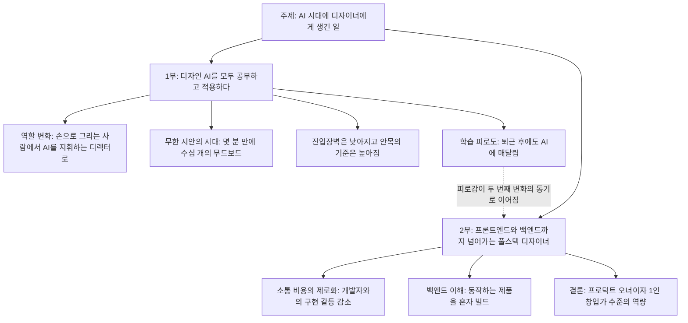
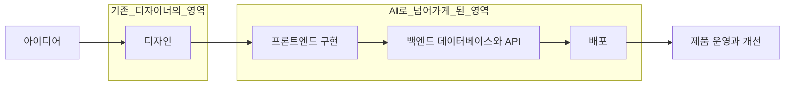
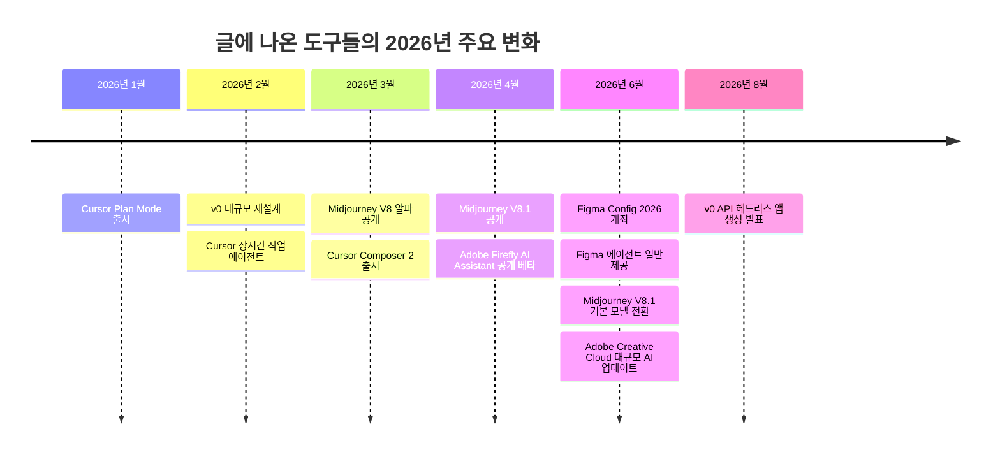

- 작성 기준일: 2026년 10월 8일
- 검증 방식: 글에 등장하는 도구(Figma, Framer, Midjourney, Firefly, Cursor, v0)의 현황을 웹 검색으로 확인했습니다.
- 중요한 한계: 함께 주신 Threads 링크는 해당 사이트가 자동 접근을 막고 있어 열람하지 못했습니다. 이 문서는 직접 붙여 주신 본문 텍스트만을 분석 대상으로 삼았고, 링크 속 댓글이나 작성자 정보는 확인하지 않았습니다.

---

## 1. 이 글은 무엇인가

이 글은 디자이너 한 사람이 생성형 AI가 일상이 된 뒤 자신의 일과 정체성에 어떤 변화가 생겼는지를 두 갈래로 정리한 1인칭 경험담입니다. 학술 논문이나 시장 보고서가 아니라 현업 디자이너의 소회에 가깝고, 그래서 숫자나 통계로 증명하려는 글이 아니라 "내가 겪은 변화"를 압축한 글입니다. 이 점을 먼저 짚어 두는 이유는, 뒤에서 하나하나 사실 여부를 따져 보겠지만 글의 성격상 상당 부분이 작성자의 체감과 해석이라는 점을 독자가 구분해서 읽어야 하기 때문입니다.

글의 뼈대는 아주 단순합니다. 첫 번째 변화는 디자이너 본연의 업무 안에서 일어났습니다. 모든 디자인 AI를 공부하고 적용하다 보니 생산성은 크게 올랐지만, 오히려 생각의 깊이는 훨씬 더 요구되는 방향으로 일이 바뀌었다는 이야기입니다. 두 번째 변화는 업무의 경계 밖에서 일어났습니다. 코드 작성이 쉬워지자 디자이너가 프론트엔드와 백엔드 영역까지 넘어가 아이디어부터 배포까지 혼자 해내는 "생존형 풀스택 디자이너"가 되었다는 이야기입니다. 글은 이 두 변화를 "나는 오늘도 진정한 프로덕트 오너(PO)가 되기 위해 1인 창업가 수준의 역량을 강제로 장착하게 된 셈"이라는 문장으로 묶으며 끝납니다.

### 글의 구조

---

## 2. 1부 상세 해설 — 생산성 10배, 생각의 깊이는 100배

### 2-1. "손으로 그리는 사람"에서 "지휘하는 디렉터"로

첫 문장은 글 전체의 주제문입니다. 작성자는 "생산성은 10배가 되었지만, 생각의 깊이는 100배가 필요해졌다"고 말합니다. 여기서 10배와 100배는 측정된 수치가 아니라 대비를 강조하기 위한 수사적 표현으로 읽는 것이 맞습니다. 핵심은 숫자가 아니라 구조입니다. 결과물을 만드는 데 드는 시간은 줄었는데, 그 결과물이 맞는 방향인지를 판단하고 결정하는 부담은 오히려 커졌다는 것입니다.

이 변화를 작성자는 "디렉터"라는 단어로 요약합니다. 직접 그리던 사람이 AI라는 조수들에게 지시를 내리고 결과를 감독하는 사람이 되었다는 뜻입니다. 영화 현장에 비유하면 촬영 기사가 카메라를 직접 잡던 시대에서, 여러 카메라를 한꺼번에 운용하며 어떤 컷을 쓸지 정하는 감독의 자리로 이동한 것과 비슷합니다. 감독에게 필요한 것은 장비 조작 능력이 아니라 "무엇을 담을 것인가"에 대한 판단입니다.

### 2-2. 무한 시안의 시대

작성자는 예전에는 밤새워 시안 3개를 짜내던 일을 이제는 Midjourney나 Firefly 같은 도구로 몇 분 만에 수십 개의 무드보드로 뽑아낼 수 있다고 적었습니다. 시안 단계에서 "만들 수 있는 양"의 제약이 사실상 사라졌다는 이야기입니다. 이것은 곧 병목이 이동했다는 뜻이기도 합니다. 예전의 병목은 만드는 속도였고, 지금의 병목은 수십 개 중에서 무엇이 좋은지를 가려내는 눈입니다.

### 2-3. 낮아진 진입장벽, 높아진 안목의 기준

글은 도구를 다루는 숙련도는 AI가 메워주기 때문에 이제 디자이너에게 요구되는 것은 "무엇이 좋은 디자인인지 구별해내는 기획력과 비판적 안목(Curating)"이라고 말합니다. 여기서 Curating이라는 단어를 쓴 점이 중요합니다. 큐레이션은 미술관에서 작품을 직접 그리지 않고 어떤 작품을 어떤 맥락으로 보여줄지 선별하는 일을 가리킵니다. 즉 "생성"의 가치는 하락하고 "선별과 맥락 부여"의 가치가 상승한다는 주장입니다.

여기에는 역설이 숨어 있습니다. 누구나 그럴듯한 결과물을 만들 수 있게 되었으니 진입장벽은 낮아졌지만, 바로 그 이유로 "그럴듯함"만으로는 차별화가 되지 않아 안목의 기준은 오히려 높아집니다. 작성자가 "낮아진 진입장벽, 높아진 안목의 기준"이라는 제목을 붙인 이유가 여기에 있습니다.

### 2-4. 학습 피로도

1부의 마지막은 가장 인간적인 대목입니다. 매주 쏟아지는 새로운 AI 기능과 플러그인(Figma AI, Framer 등)을 쫓아가느라 퇴근 후에도 뇌가 쉬지 못한다는 고백입니다. 앞에서 본 낙관적인 서술과 달리 이 대목은 이 글에서 유일하게 부담과 소진을 직접 드러냅니다. 그리고 뒤의 최신 정보 검증에서 보겠지만, 이 피로감은 작성자만의 착각이 아니라 실제 도구 시장의 업데이트 속도에 근거가 있습니다.

---

## 3. 2부 상세 해설 — 생존형 풀스택 디자이너

### 3-1. "내 디자인을 온전히 세상에 내놓기 위해"

2부의 출발점은 동기입니다. 작성자는 디자인이 화면 안에서 끝나지 않고 실제로 동작하는 제품으로 세상에 나가야 한다고 보고, 그래서 코딩까지 손을 댔다고 말합니다. AI 덕분에 코드 작성이 쉬워졌고(Cursor, v0, ChatGPT 등), 그것이 디자이너가 개발 영역으로 들어가는 "가장 강력한 생존 전략"이 되었다는 주장입니다. "생존"이라는 단어에서 알 수 있듯, 이 글은 이 변화를 즐거운 확장만이 아니라 압박에 대한 대응으로도 서술합니다.

### 3-2. 소통 비용의 제로화

작성자는 디자이너가 프론트엔드(HTML, CSS, JS, React)를 이해하면 개발자와 "이거 구현 안 되는데요" 하는 다툼이 사라진다고 말합니다. 직접 구현하거나, 최소한 구현 가능한 수준으로 정확하게 가이드할 수 있기 때문입니다. 다만 "제로"라는 표현은 과장입니다. 소통 비용이 줄어드는 것은 사실일 수 있어도 완전히 사라지지는 않으며, 이 역시 체감을 강조한 표현으로 읽는 것이 적절합니다.

### 3-3. 백엔드까지의 확장

글은 데이터베이스와 API 구조를 이해하는 디자이너는 "예쁜 화면"을 넘어 "동작하는 비즈니스 제품"을 혼자 빌드할 수 있게 된다고 말합니다. 화면(프론트엔드)만으로는 제품이 아니라 시안일 뿐이고, 데이터가 저장되고 불러와지는 구조(백엔드)까지 있어야 비로소 제품이 된다는 논리입니다.

### 3-4. 프로덕트 오너이자 1인 창업가

결론부에서 작성자는 아이디어 촉발, 디자인, 배포까지를 혼자 하는 1인 창업가(Solopreneur) 수준의 역량을 "강제로 장착"하게 되었다고 말합니다. "강제로"라는 부사가 2부 전체의 정서를 대변합니다. 능동적 선택과 환경의 압박이 뒤섞여 있다는 뜻입니다.

### 확장되는 역할의 흐름

---

## 4. 최신 정보 검증 — 글에 나온 도구들의 2026년 현황

글이 말하는 "매주 쏟아지는 새 기능"이 실제로 어느 정도인지, 그리고 글이 이름을 든 도구들이 지금 어디까지 왔는지를 확인했습니다. 아래 내용은 검색으로 확인한 것만 적었고, 확인하지 못한 부분은 그렇다고 표시했습니다. 확인된 가장 최근 자료는 2026년 8월 초 시점까지이며, 그 이후의 변화는 이 문서에 반영되지 않았습니다.

### 4-1. Figma — 디자인 도구가 코드와 에이전트를 품다

Figma는 2026년 6월 23일부터 25일까지 샌프란시스코에서 연례 행사 Config 2026을 열었습니다. 이 행사에서 코드 레이어(Code layers), Figma Motion, 셰이더 채우기와 효과, 생성형 플러그인, Weave 도구, 그리고 업데이트된 Figma 에이전트가 발표되었습니다.

가장 눈에 띄는 것은 코드 레이어입니다. Figma는 코드를 이미지나 벡터, 디자인 레이어와 같은 "재료"로 다루겠다는 입장이며, 어떤 디자인 레이어든 클릭 한 번이나 프롬프트로 인터랙티브한 코드 레이어로 바꿀 수 있고 필요하면 다시 편집 가능한 디자인 레이어로 되돌릴 수 있다고 설명했습니다. 이는 글의 2부가 말하는 "디자이너가 코드 영역으로 들어간다"는 흐름을 도구 쪽에서 정면으로 뒷받침하는 사례입니다. 다만 코드 레이어는 발표 시점에 대기자 명단 방식의 베타였고 7월부터 순차적으로 열린다고 안내되었기 때문에, 10월 현재 누구나 쓸 수 있는 상태인지는 확인하지 못했습니다.

Figma Motion은 캔버스 안에서 키프레임, 프리셋, 타임라인으로 애니메이션을 만드는 기능으로, 외부 모션 도구로 내보내지 않고도 작업할 수 있게 해 줍니다. Figma 에이전트는 Config 기간에 모두에게 공개(일반 제공)되었으며, 재사용 가능한 스킬, 첨부 파일, 팀과 공유되는 대화, 그리고 Notion, Slack, Granola, Hex, GitHub, Atlassian 같은 도구와의 커넥터를 지원한다고 보도되었습니다. FigJam과 Slides로의 확장은 예정 단계였습니다. 또 생성형 플러그인은 동작과 매개변수를 설명하기만 하면 로컬 개발 환경이나 플러그인 API 지식 없이도 맞춤 도구를 만들 수 있게 하는 기능입니다.

회사 실적 관련 자료도 흥미롭습니다. 2026년 3월 투자 분석 매체의 기사는 Figma Make의 주간 활성 사용자가 직전 분기 대비 70% 늘었고, 파일의 약 60%가 비디자이너에 의해 만들어진다고 전했습니다. 이 수치는 회사가 공개한 지표를 인용한 2차 보도라는 점을 감안해야 하지만, 디자인 도구의 사용자층이 디자이너 바깥으로 넓어지고 있음을 시사합니다. 같은 맥락에서 Figma 에이전트와 Make에서는 Claude, Gemini, GPT 계열의 최신 모델을 고를 수 있다고 한 리뷰는 전했고, 같은 리뷰는 기능이 4개 이상의 진입점에 흩어져 있고 좋은 기능은 아직 베타이며 크레딧이 빨리 소모된다는 단점도 지적했습니다. 이 "흩어짐"은 글의 "학습 피로도"와 직접 맞닿는 대목입니다.

### 4-2. Framer — 웹사이트 빌더의 AI 스위트와 대규모 개편 예고

Framer의 AI 기능은 2026년 6월 14일 기준 공식 소개 페이지에서 다섯 가지로 정리되어 있다고 한 리뷰가 확인했습니다. 대화로 초안을 잡는 Wireframer, 고급 컴포넌트를 만드는 Workshop, 사이트 전체를 번역하는 AI Translate, 외부 모델과 연결해 직접 만드는 AI Plugins, 그리고 시각 결과물 생성 기능입니다. 같은 자료는 사용자가 자신의 LLM을 연결해 Framer 사이트를 설계하고 관리해 보는 "Claude & Codex for Framer" 베타가 열려 있다는 점, 그리고 6월 12일에 Framer가 전면 개편인 Framer 3.0을 예고했다는 점도 전했습니다. 이 개편이 실제로 어떤 모습으로 출시되었는지는 이번 검색에서 확인하지 못했습니다.

한 가지 더, Framer가 AI 모델 선택을 "작업 성격에 따른 결정"으로 다루기 시작했다는 보도가 있었습니다. GPT 5.6을 Sol, Terra, Luna 세 가지 구성으로 도입하면서 대규모 점검과 리디자인용, 실무 기본용, 반복적이고 구조화된 작업용으로 용도를 나눠 안내했다는 내용입니다. 정확한 도입 날짜는 확인하지 못했습니다. 다만 이 흐름은 디자이너가 도구 사용법뿐 아니라 "어떤 모델을 언제 쓸지"까지 판단해야 하는 시대가 되었음을 보여 줍니다.

### 4-3. Midjourney — 무드보드 생성의 속도와 해상도

Midjourney는 2026년 3월 17일 V8 알파를 공개했고, 4월 30일 midjourney.com에서 V8.1이 이어졌으며, 한 가이드는 6월 10일부터 V8.1이 기본 모델이 되었다고 적었습니다. 4월 중순 알파 단계의 V8.1에 대해서는 기본 HD(2K) 출력과 V8 대비 약 3배 빠른 속도, 향상된 프롬프트 충실도가 보도되었습니다. 또 같은 가이드는 V8이 이전 세대보다 지시를 더 문자 그대로 따르는 모델이라고 설명합니다. 5월 시점의 한 글은 기본 버전이 아직 V7이라고 적었는데, 6월 10일 기본 전환 이전의 정보이므로 서로 모순되지 않습니다. 현재 기본 버전은 공식 문서에서 다시 확인하시기를 권합니다.

이 속도 향상은 글이 말한 "몇 분 만에 수십 개의 무드보드"를 더 쉽게 만드는 방향의 변화입니다. 같은 가이드는 화면 안 글자 표현이나 사실 정확성이 중요한 작업에서는 다른 모델이 더 강하다고 평가했습니다. 도구마다 잘하는 영역이 갈린다는 이야기이고, 이것이 곧 "어떤 도구를 쓸지 고르는 안목"이 필요한 이유입니다.

### 4-4. Adobe Firefly — 생성 도구에서 작업 체계로

Adobe는 2026년 4월 27일 Firefly AI Assistant의 공개 베타를 시작했고, Creative Cloud Pro 및 Firefly 유료 구독자에게 전 세계에 제공한다고 밝혔습니다. 한 정리 자료에 따르면 Firefly는 이제 자체 모델만이 아니라 여러 외부 모델도 Adobe 앱 안에서 고를 수 있는 "메타 도구"로 변하고 있습니다. 또 다른 보도는 Firefly AI Studio가 세션 간 맥락을 유지하고 Photoshop, Premiere, Illustrator 등 60개 이상의 도구를 앱 전환 없이 엮는 방향이라고 전했는데, 이 쪽은 비공개 베타 단계로 소개되었습니다. 6월 15일에는 Lightroom, Photoshop, Premiere, After Effects, Illustrator에 걸친 올해 최대 규모의 Creative Cloud AI 업데이트가 있었다고 합니다. 베타 종료 후의 정식 가격은 확인되지 않았습니다.

### 4-5. Cursor와 v0 — 디자이너가 코드로 넘어가는 두 갈래 길

Cursor는 2026년 1월에 Plan Mode를 내놓았고, 2월에는 장시간 작업하는 에이전트(Long-running Agents)를, 3월 18일에는 Composer 2를 선보였다고 정리됩니다. 한 비교 글은 Cursor가 기존 VS Code와 호환되고 여러 파일을 다루는 에이전트가 강하지만 어느 정도의 코딩 이해를 전제한다고 설명했고, 요금은 여러 자료가 월 20달러대의 Pro 플랜을 언급합니다. 디자이너 대상 정리 글에서는 Cursor와 Windsurf가 올해 1분기에 비엔지니어에게 더 접근하기 쉬워졌고, 디자이너들이 정적 목업을 검토하는 데서 나아가 실제 인터페이스를 브라우저에서 눈으로 확인하며 프로토타이핑하기 시작했다는 관찰이 소개되었습니다.

Vercel의 v0는 2026년 초 대대적으로 재설계되었고 당시 400만 명이 넘는 사용자가 있다고 소개되었습니다. 이어서 Stripe 연동이 v0와 Vercel 마켓플레이스에서 정식 제공(GA)되었고, 같은 시기에 사용자 지정 MCP 서버를 다루는 v0 API 지원도 추가되었습니다. 8월 초에는 프롬프트를 프로그램적으로 보내면 v0 에이전트가 완성된 앱을 만들고 Vercel Sandbox에서 개발 서버를 띄운 뒤 미리보기 주소를 돌려주는 새 v0 API가 발표되었습니다. 또 Upstash, Neon, Supabase 같은 데이터베이스 서비스를 v0 안에서 마켓플레이스 통합으로 붙일 수 있게 되었습니다(이 통합의 정확한 시점은 확인하지 못했습니다). 이는 글이 말한 "백엔드까지의 확장", 즉 데이터베이스와 연결된 동작하는 제품을 혼자 만드는 일이 도구 차원에서 쉬워지고 있음을 보여 줍니다. 한편 한 리뷰는 v0가 Next.js와 Vercel 중심으로 최적화되어 있어 다른 환경에서는 추가 작업이 필요하다는 한계도 짚었습니다.

### 4-6. 업계 흐름 — "바이브 코딩"을 디자이너가 하는 시대

여러 자료가 공통으로 전하는 사실이 있습니다. "바이브 코딩"이라는 말은 2025년 초 안드레이 카파시가 쓴 표현으로 알려져 있고, 영국 콜린스 사전이 이를 올해의 단어로 선정했다고 합니다. 그리고 2026년 1분기 정리 글은 바이브 코딩이 원래 엔지니어 중심의 유행이었지만 2026년에는 디자이너들도 호기심이나 뒤처질 것 같은 불안에서 시작하고 있다고 관찰했습니다. 같은 글은 바이브 코딩이 디자인 과정을 대체하는 것이 아니라 더하는 것이며, AI를 가장 많이 쓰는 디자이너가 아니라 판단을 잘하는 디자이너가 살아남을 것이라는 견해를 밝혔습니다. 이것은 개인 필자의 의견이지만, 이 글의 1부 주장(안목과 판단의 중요성)과 같은 방향입니다.

### 2026년 주요 사건 타임라인

### 도구별 요약표

| 도구 | 글에서의 역할 | 2026년 확인된 핵심 변화 |
|---|---|---|
| Midjourney | 무드보드와 시안 대량 생성 | V8 알파(3월), V8.1(4월 30일), 더 빠른 속도와 2K 출력 |
| Adobe Firefly | 시안 생성과 편집 | AI Assistant 공개 베타(4월 27일), 여러 모델을 한곳에서 선택 |
| Figma | 디자인 작업의 중심 | Config 2026에서 코드 레이어, Motion, 에이전트 일반 제공 |
| Framer | 웹사이트 제작 | AI 스위트, 자체 LLM 연결 베타, Framer 3.0 예고 |
| Cursor | 코드 작성과 수정 | Plan Mode, 장시간 에이전트, Composer 2 |
| v0 | UI와 앱 생성 | 재설계, Stripe 정식 제공, 8월 헤드리스 v0 API |

---

## 5. 글의 주장과 확인된 사실 대조

글이 말한 내용을 사실, 근거 있는 추세, 작성자의 체감으로 나누어 보면 다음과 같습니다.

**검색으로 뒷받침되는 부분.** 디자인 도구와 코딩 도구가 서로의 영역으로 들어오고 있다는 큰 흐름은 확인됩니다. Figma가 코드를 캔버스의 재료로 들이고, v0와 Cursor가 디자이너를 포함한 비개발자에게 접근성을 높이고 있으며, Figma Make 사용 파일의 상당수가 비디자이너의 것이라는 보도도 있습니다. 또 도구 업데이트가 매우 잦다는 점도 사실입니다. Figma 한 곳만 해도 Config 직전과 직후에 걸쳐 모션, 셰이더, 3D 변환, 코드 레이어, 에이전트, 커넥터, 웹 검색 기능, 크롬 확장 등이 연달아 발표되었고, 여러 기능이 아직 베타이거나 대기자 명단 방식이라 어느 것을 지금 써야 할지부터 판단해야 하는 상황입니다. "쫓아가느라 뇌가 쉴 틈이 없다"는 고백이 과장만은 아닌 이유입니다.

**수사적 표현으로 읽어야 하는 부분.** "생산성 10배", "생각의 깊이 100배", "소통 비용 제로"는 측정값이 아닙니다. 이 수치들은 공식 연구로 확인된 바 없으며, 작성자의 체감을 강조한 표현입니다. 이 문서에서도 이 수치를 사실로 취급하지 않았습니다.

**이 검색으로는 확인할 수 없는 부분.** "디자이너가 개발을 아는 것이 가장 강력한 생존 전략"이라는 평가나, 풀스택 디자이너가 실제로 시장에서 더 높은 보상을 받는다는 주장은 이번 검색에서 근거 자료를 찾지 못했습니다. 이것은 작성자의 판단으로 남겨 두어야 합니다. 도구가 쉬워졌다는 사실과, 그 전략이 모두에게 최선이라는 주장은 별개의 문제입니다.

---

## 6. 글을 더 깊이 읽는 법 — 두 갈래 변화 사이의 긴장

이 글에서 가장 흥미로운 지점은 1부와 2부가 서로 다른 감정을 품고 있다는 것입니다. 1부의 첫머리는 "10배 생산성"이라는 긍정으로 시작하지만 끝은 "퇴근 후에도 AI에 매달려 있다"는 소진으로 닫힙니다. 2부는 "무시무시한 파괴력"이라는 고양감으로 가득 차 있다가 "강제로 장착하게 된 셈"이라는 체념 섞인 표현으로 끝납니다. 즉 두 부분 모두 기회와 압박이 한 문장 안에 공존합니다.

이 긴장은 구조적인 이유가 있습니다. 도구가 쉬워지면 할 수 있는 일의 범위는 넓어지지만, 같은 이유로 "그 정도는 할 수 있어야 한다"는 기대치도 함께 올라갑니다. 앞서 확인했듯 도구 자체가 한 곳에 모이지 않고 여러 진입점으로 흩어져 있고 업데이트 속도가 빠르다 보니, 넓어진 범위만큼 학습해야 할 표면적도 같이 커집니다. 작성자가 "생존형"이라는 말을 쓴 것은 이 압박을 정확히 읽은 표현입니다.

그렇다면 글이 말하는 "안목"은 어떻게 쌓을 수 있을까요? 이 부분은 검색으로 확인된 사실이 아니라 이 문서의 해석임을 밝혀 둡니다. 글의 논리를 따라가면 모든 신규 도구를 따라가는 방식은 지속 가능하지 않습니다. 도구는 계속 바뀌지만 "좋은 결과물을 구별하는 기준"과 "문제를 정의하는 능력"은 도구가 바뀌어도 남는 자산이기 때문입니다. 앞서 소개한 업계 관찰, 즉 AI를 가장 많이 쓰는 사람이 아니라 판단을 잘하는 사람이 살아남는다는 견해도 같은 방향을 가리킵니다. 따라서 이 글을 읽는 실용적인 방법은 "무엇을 더 배울까"보다 "무엇을 배우지 않을지 정할까"를 함께 묻는 것입니다.

---

## 7. 쉽게 정리하면

한 문장으로 줄이면 이렇습니다. 이 글은 "AI 덕분에 만드는 일은 쉬워졌지만, 그만큼 무엇을 만들지 고르는 일과 만든 것을 끝까지 책임지는 일이 디자이너의 몫으로 넘어왔고, 그 결과 나는 디자인에서 코드와 배포까지 혼자 감당하는 사람이 되어 가고 있으며, 그 과정이 설레면서도 지친다"는 이야기입니다.

최신 정보를 확인해 보니 이 흐름은 개인의 착각이 아니라 도구 시장 전체가 같은 방향으로 움직이고 있는 결과입니다. Figma는 코드를 디자인 재료로 만들고 있고, v0와 Cursor는 디자이너가 쓸 수 있는 개발 도구가 되고 있으며, Midjourney와 Firefly는 시안 생성을 더 빠르고 한곳에서 선택 가능한 방향으로 발전시키고 있습니다. 다만 "10배", "100배", "제로" 같은 수치는 체감 표현이며, 풀스택 디자이너가 최선의 전략이라는 평가도 작성자의 견해로 남아 있습니다.

---

## 8. 출처와 검증 한계

이 문서에 쓰인 주요 자료는 다음과 같습니다. 각 항목은 검색으로 열람한 것이며, 일부는 2차 보도나 개인 블로그이므로 공식 발표와 차이가 있을 수 있습니다.

- Figma 공식 블로그, Config 2026 요약 (figma.com/blog/config-2026-recap)
- Figma 릴리스 노트 (figma.com/whats-new, 릴리스 노트 페이지)
- diginomica, Config 2026 분석 기사
- AlternativeTo, Figma Motion과 코드 레이어 보도 (2026년 6월)
- Classmethod, Config 2026 기능 요약
- Zacks Equity Research, Figma AI 전략 기사 (2026년 3월 6일)
- Banani, 2026 Figma AI 리뷰
- SuperDesign, Framer AI 리뷰 (2026년 6월 14일 기준)
- CreateWith, Framer GPT 5.6 모델 도입 보도
- FluxNote, Midjourney V8 가이드 (2026년 7월 24일 갱신)
- PixVerse, Midjourney 2026년 5월 업데이트 정리
- Adobe Firefly 관련 정리 자료 (aitooltier.com, ecosistemastartup.com)
- Creative AI News, Adobe Creative Cloud 2026년 6월 업데이트 요약
- Vercel 커뮤니티 주간 소식 (2026년 2월, 3월, 8월)
- Vercel 변경 기록, v0 마켓플레이스 통합
- Emelia, Sorceress, Flowstep, RapidDev 등의 바이브 코딩 도구 비교 글
- trillionscafe 서브스택, 2026년 1분기 디자인 분야 변화 정리

**한계를 정리합니다.** 첫째, Threads 원문 링크는 접근이 차단되어 열지 못했고 붙여 주신 본문만 분석했습니다. 둘째, 확인된 가장 최근 자료는 2026년 8월 초이며, 그 이후 변화는 반영하지 못했습니다. 셋째, Figma 코드 레이어의 현재 공개 범위, Framer 3.0의 실제 출시 내용, Adobe Firefly AI Assistant의 정식 가격은 확인하지 못했습니다. 넷째, 일부 수치(Figma Make 비디자이너 파일 비율 등)는 투자 분석 매체가 회사 발표를 인용한 2차 자료입니다. 이 네 가지는 실제로 도입을 결정하거나 인용하기 전에 각 도구의 공식 페이지에서 다시 확인하시기를 권합니다.
