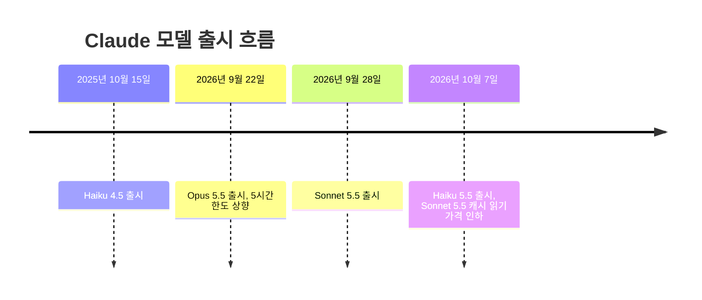
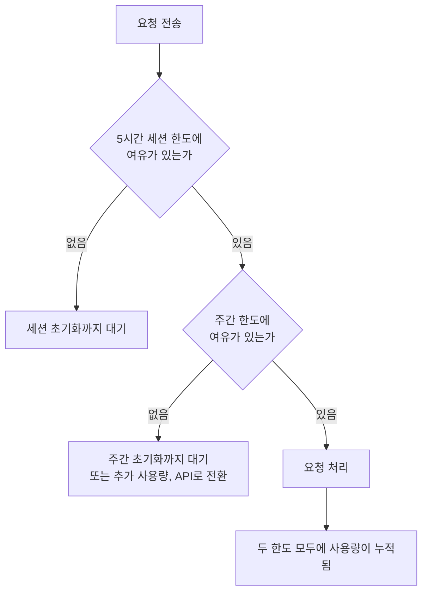
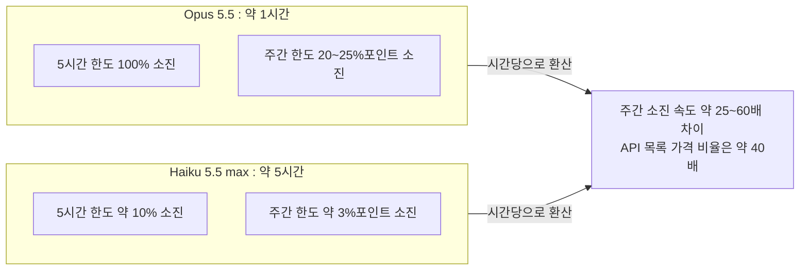

> 이 문서는 공유해 주신 Claude Code 상태 표시줄 내용과 "Haiku 5.5 Max 사용 후기" 게시글을 바탕으로, 2026년 10월 9일 시점에 확인 가능한 최신 자료를 검색해 정리한 것입니다. 확인된 사실과 추정을 구분해서 적었고, 근거를 찾지 못한 부분은 "확인하지 못했다"고 명시했습니다.

```
Haiku 5.5 Max 사용 후기. 
5시간 사용시 10% 정도 나옮.
그리고 주간 리밋은 95%에서 시작했는데 3%정도..

따라서, 세션 1개에서 10개로 늘려서 동시에 돌리면 
5시간 풀로 개발 가동 가능하고 
주간 리밋은 3% -> 30% 정도 나온다는 것인데...

이게 또 웃긴게...
opus 5.5 5시간 리밋 1시간 만에 
다 써도 20~25% 주간 리밋 소진 되었음. 

따라서, 주간 리밋은 아무리 생각해봐도 
x20가 아니다 라는걸 알 수가 있다.

하지만 대안이 없기에 
우리는 Opus 5.5를 그냥 그러러니 하고 
묵묵히 사용 할 수 밖에 없다.

아무리 머릴 굴러봐도 
Opus, Sonnet, Haiku 토큰 가격 계산이 안맞다.

몇달 째 계산을 하고 
실측 해보지만...

대국민 사기극이 맞다. 
차라리 $500 요금제를 내던가...

어렵다 어려워...

https://www.facebook.com/share/1FjUHiadQ7/
```


---

## 1. 먼저 결론부터

공유해 주신 내용은 크게 두 덩어리입니다.

첫째는 **Claude Code 터미널 하단의 사용자 정의 상태 표시줄**입니다. 모델이 Haiku 5.5이고, 추론 강도(effort)가 최대(max)로 설정되어 있으며, 5시간 한도는 12%, 주간 한도는 98%를 사용한 상태라는 것을 한눈에 보여 줍니다. 그 아래에는 "leader"라는 이름의 메인 세션 아래에서 하위 작업자(에이전트) 하나가 23분째 돌면서 토큰 387.7k를 쓰고 있다는 목록이 있습니다.

둘째는 그 수치를 근거로 한 **게시글의 주장**입니다. 요지는 다음과 같습니다.

- Haiku 5.5를 max 설정으로 5시간 쓰면 5시간 한도는 약 10%, 주간 한도는 약 3%포인트가 소진된다.
- 그러니 세션을 10개로 늘려 동시에 돌리면 5시간 한도는 가득 차지만 주간 한도는 약 30%만 쓴다.
- 반면 Opus 5.5는 5시간 한도를 1시간 만에 다 쓰면 주간 한도가 20~25% 소진된다.
- 따라서 Max 20x의 "20배"는 주간 한도 기준으로는 맞지 않는 것 같고, 모델별 토큰 가격과 한도 소진 속도의 계산도 맞지 않는다.

조사 결과를 한 문단으로 요약하면 이렇습니다. **Haiku 5.5는 2026년 10월 7일에 실제로 출시된 모델이고, 상태 표시줄의 각 항목은 Claude Code가 공식 제공하는 데이터 필드로 대부분 설명됩니다.** Anthropic은 "20배"를 **5시간 세션당 사용량**에 대한 배수로 설명하고 있으며, 주간 한도가 20배라고 공식적으로 말한 근거는 찾지 못했습니다. 또한 게시글의 측정값을 그대로 환산해 보면, Opus 5.5와 Haiku 5.5의 시간당 주간 소진 속도 비율이 약 25~60배 범위에 놓이는데, 이는 두 모델의 API 목록 가격 비율(약 40배)과 같은 자릿수입니다. 다만 Anthropic은 구독 한도의 계산식을 공개하지 않으므로, 이것은 "가격 비율과 모순되지 않는다"는 정도의 관찰이지 증명은 아닙니다.

---

## 2. 공유해 주신 상태 표시줄을 읽는 법

### 2.1 상태 표시줄이란 무엇인가

Claude Code에는 터미널 하단에 한 줄(또는 여러 줄)짜리 정보 막대를 띄우는 기능이 있습니다. 공식 문서에 따르면 이 막대는 사용자가 설정한 셸 스크립트를 실행해서 그 출력 결과를 보여 주는 방식으로 동작합니다. Claude Code가 세션 정보를 JSON 형태로 스크립트에 넘겨 주고, 스크립트가 그중 원하는 필드를 골라 예쁘게 조합해서 출력하는 구조입니다. 이 과정은 로컬에서만 일어나며 API 토큰을 소비하지 않는다고 문서에 명시되어 있습니다.

즉, 공유해 주신 표시줄은 Claude Code의 기본 화면이 아니라 **사용자가 직접 만들었거나 커뮤니티 도구로 구성한 맞춤형 표시줄**입니다. 그래서 "CW", "5H", "7D" 같은 약어는 만든 사람이 붙인 라벨이고, 공식 용어가 아닙니다.


### 2.2 각 항목이 무엇을 뜻하는가


아래 표는 표시줄에서 읽히는 항목과 그 의미를 정리한 것입니다. "근거" 열에서 **공식 필드**라고 표시한 것은 Claude Code 공식 문서에 대응하는 데이터 필드가 있는 경우이고, **추정**은 라벨과 맥락으로 미루어 짐작한 것입니다.

| 표시 | 의미 | 근거 |
|---|---|---|
| Haiku 5.5 | 현재 세션이 사용 중인 모델 | 공식 필드(`model.display_name`) |
| max | 추론 강도(effort) 수준이 최대 | 공식 필드(`effort.level`: low, medium, high, xhigh, max 중 하나) |
| t (max 옆) | 확장 사고(thinking)가 켜져 있다는 표시로 보임 | 추정. 공식 필드 `thinking.enabled`가 있음 |
| CW 98% (/clear 경고) | 컨텍스트 윈도 사용률로 보이며, 가득 차 가니 `/clear`를 고려하라는 경고 | 추정. 공식 필드 `context_window.used_percentage`가 있음 |
| 5H 12% (7m) | 5시간 한도의 사용률 12%와, 괄호 안은 초기화까지 남은 시간으로 보임 | 사용률은 공식 필드(`rate_limits.five_hour.used_percentage`), 괄호는 추정 |
| 7D 98% (Oct 9) | 주간(7일) 한도의 사용률 98%와, 괄호 안은 초기화 날짜(오늘)로 보임 | 사용률은 공식 필드(`rate_limits.seven_day.used_percentage`), 괄호는 추정 |
| 99% (재활용 기호 옆) | 프롬프트 캐시 적중률로 보임 | 추정. 공식 필드 `prompt_cache.hit_ratio`가 있음 |
| 2h 18m | 세션이 진행된 누적 시간으로 보임 | 추정. 공식 필드 `cost.total_duration_ms`가 있음 |
| bypass permissions on | 권한 확인을 건너뛰는 모드가 켜져 있음 | 표시된 문구 그대로 |
| PR #1812 · 1 shell | 현재 브랜치에 열린 풀 리퀘스트 번호와 백그라운드 셸 1개 | PR은 공식 필드(`pr.number`)로 설명 가능, 셸 개수는 문구 그대로 |
| leader | 이 세션의 역할 이름(팀 구성에서의 리더로 보임) | 문구 그대로, 의미는 추정 |
| TODO: 12/38 | 할 일 38개 중 12개 진행(완료)으로 보임 | 추정 |
| main 아래의 한 줄 | 하위 작업자가 "t1538 재설계를 단독 작성자로 이어서 진행"이라는 설명으로 23분 1초째 동작, 387.7k 토큰 사용 | 공식 문서의 하위 에이전트 행 구성(이름, 설명, 토큰 수)과 일치 |

여기서 핵심은 **12%와 98%의 정체**입니다. 공식 문서는 `rate_limits` 객체가 claude.ai Pro·Max 구독자에게만 제공되며 5시간 창(`five_hour`)과 7일 창(`seven_day`)을 가지고, 각 창은 0~100 사이의 **사용한(used) 비율**과 초기화 시각(`resets_at`)을 담는다고 설명합니다. 그러니 "98%"는 "98% 남았다"가 아니라 **"98%를 이미 썼다"** 로 읽는 것이 맞습니다. 게시글에서 "주간 리밋은 95%에서 시작했는데 3%정도"라고 한 것도 이 해석과 맞아떨어집니다. 이미 95%를 쓴 상태에서 Haiku 작업으로 3%포인트가 더해져 98%가 되었다는 뜻입니다.

한 가지 주의할 점이 있습니다. 문서에 따르면 이 값들은 정수로 반올림되어 표시될 수 있습니다. 그래서 "3%포인트"는 실제로는 2~4%포인트 사이의 값일 수 있습니다. 뒤에서 계산할 때 이 오차를 반영하겠습니다.

### 2.3 "컨텍스트 98%"가 의미하는 것

공식 문서에 따르면 컨텍스트 윈도 크기는 기본 200,000토큰이고, 확장 컨텍스트를 지원하는 모델은 1,000,000토큰입니다. 사용률은 입력 토큰(캐시 읽기·쓰기 포함)만으로 계산하며 출력 토큰은 포함하지 않습니다. 컨텍스트가 98%까지 찼다는 것은 대화 기록이 거의 한도에 닿았다는 뜻이므로, `/clear`나 `/compact`로 정리하라는 경고가 뜨는 것이 자연스럽습니다. 컨텍스트가 길수록 매 요청마다 처리해야 하는 입력이 커지기 때문에, 이 값은 한도 소진 속도와도 관련이 있습니다. 이 부분은 뒤의 "체감이 달라지는 이유"에서 다시 다루겠습니다.

---

## 3. 배경: Haiku 5.5는 어떤 모델인가

### 3.1 출시 시점과 위치

Haiku 5.5는 **2026년 10월 7일**에 공개되었습니다. 9월 22일의 Opus 5.5, 9월 28일의 Sonnet 5.5에 이어 5.5 세대의 세 번째 모델입니다. 불과 며칠 전인 10월 초까지도 "발표만 되었고 출시일은 미정"이라는 정리 글이 돌았기 때문에, 상태 표시줄에 Haiku 5.5가 찍혀 있다는 것은 출시 직후부터 바로 사용해 보신 것입니다.



### 3.2 가격

Haiku 5.5의 API 가격은 100만 토큰당 다음과 같습니다.

| 구분 | 프롬프트 10만 토큰 이하 | 프롬프트 10만 토큰 초과 |
|---|---|---|
| 입력 | $0.10 | $0.50 |
| 출력 | $0.50 | $2.50 |
| 캐시 읽기 | $0.01 | $0.05 |
| 캐시 쓰기 | $0.125 | $0.625 |

이전 세대인 Haiku 4.5는 입력 $1, 출력 $5였으므로, 10만 토큰 이하 프롬프트에서는 입력과 출력 모두 90% 저렴해졌고 더 긴 프롬프트는 50% 저렴해졌습니다. Anthropic은 Haiku 4.5 요청의 약 90%가 10만 토큰 이하였다고 밝혔고, 새 토크나이저가 같은 작업에 토큰을 조금 더 쓰는 점을 감안해 평균적으로 약 75% 저렴하다고 추산합니다. 즉 "가격은 90% 내렸지만 작업당 토큰이 늘어서 실제 절감은 평균 75%"라는 설명입니다.

비교를 위해 Opus 5.5의 가격도 확인했습니다. Opus 5.5는 입력 $4, 출력 $20(Opus 5 대비 각각 20% 인하)이고, 캐시 읽기는 $0.20, 캐시 쓰기는 $5입니다. 이를 Haiku 5.5(10만 토큰 이하)와 비교하면 다음과 같습니다.

| 항목 | Opus 5.5 | Haiku 5.5 | 비율 |
|---|---|---|---|
| 입력 | $4 | $0.10 | 40배 |
| 출력 | $20 | $0.50 | 40배 |
| 캐시 읽기 | $0.20 | $0.01 | 20배 |
| 캐시 쓰기 | $5 | $0.125 | 40배 |

이 비율은 위 표의 가격을 나눈 단순 계산입니다. 이 40배라는 숫자를 기억해 두시기 바랍니다. 5장에서 게시글의 측정값과 비교합니다.

### 3.3 성능과 특징

Anthropic과 언론 보도를 종합하면 Haiku 5.5의 특징은 다음과 같습니다.

- 컨텍스트 윈도가 100만 토큰입니다.
- Haiku 계열 최초로 **effort(추론 강도) 조절**을 지원합니다. 비용과 추론 품질 사이를 조절할 수 있다는 뜻이며, 공유해 주신 표시줄의 "max"가 바로 이 설정입니다.
- 컴퓨터 사용 벤치마크인 OSWorld 2.1(오프라인 부분집합)에서 Haiku 4.5의 15.7%에서 72.4%로 올랐습니다. 같은 급의 경쟁 모델인 OpenAI의 GPT-6 Luna는 48.9%로 보도되었습니다.
- 에이전트형 코딩 벤치마크인 Terminal-Bench 4.0에서 Haiku 5.5는 39.2%, GPT-6 Luna는 16.4%로 보도되었습니다.
- 지식 노동 평가인 GDPval-AA v2.1은 735에서 1620으로 올랐습니다.
- 다만 복잡한 코딩에는 여전히 Sonnet 5.5와 Opus 5.5를 권장한다고 Anthropic이 밝혔습니다. Haiku는 요약, 분류, 데이터베이스 질의, 고객 지원, 브라우저 자동화, 그리고 큰 모델이 맡기는 하위 작업(서브에이전트) 용도로 제시되었습니다.
- GitHub 쪽 공지는 초기 테스트에서 Haiku 5.5가 여러 코딩 작업에서 Sonnet 5와 비슷한 결과를 내면서 토큰과 단계는 훨씬 적게 썼다고 전합니다.

여기서 눈여겨볼 점이 하나 더 있습니다. 독립 평가 기관인 Artificial Analysis의 측정을 인용한 보도에 따르면 **Haiku 5.5는 GPT-6 Luna보다 벤치마크 과제를 풀 때 토큰을 훨씬 많이 소비**합니다. 단가가 싸다고 해서 총비용이 항상 비례해서 싸지는 것은 아니라는 뜻입니다. 이 점은 사용량 한도가 토큰 기준으로 소진된다는 사실과 이어집니다.

### 3.4 제공 범위

Haiku 5.5는 Claude Platform(API), Amazon Web Services, Google Cloud, Microsoft Azure에서 제공됩니다. 보도에 따르면 claude.ai 웹과 모바일 앱에서도 Free, Pro, Max, Team, Enterprise 플랜 사용자 모두 쓸 수 있고, Claude Code에서도 사용할 수 있습니다. GitHub Copilot에도 10월 7일부터 정식 제공되었습니다.

### 3.5 같은 날 함께 발표된 구독자 혜택

Haiku 5.5 출시와 함께 구독자 대상 변화가 두 가지 발표되었습니다.

- **Sonnet 5.5 캐시 읽기 가격 인하**: 100만 토큰당 $0.20에서 $0.10으로 절반이 되었고, Anthropic은 일반적인 에이전트 작업 비용이 약 20% 줄어든다고 추산합니다.
- **Max와 Team 구독자에게 월간 API 크레딧 제공**: Max 5x는 월 $100, Max 20x는 월 $200이며, Team은 Standard 좌석당 $20, Premium 좌석당 $100을 조직 전체에서 합산해 월 최대 $500까지입니다. 이 크레딧은 Claude Platform API에서 모든 모델에 쓸 수 있습니다. **구독의 앱 사용량 한도를 늘려 주지 않으며, 대화형 Claude Code 세션에는 적용되지 않고, 쓰지 않은 크레딧은 이월되지 않습니다.** 플랜이 최소 7일 이상 활성 상태여야 하고 Claude 웹사이트에서 직접 신청해야 합니다.

이 크레딧은 "한도가 부족하니 다른 경로로 쓰라"는 용도로는 쓸 수 있지만, 지금 겪고 계신 Claude Code 한도 문제를 직접 해결해 주지는 않는다는 점을 분명히 해 둡니다.

---

## 4. Claude 사용량 한도는 어떻게 작동하나

### 4.1 두 겹의 한도

Claude의 구독 한도는 **두 개의 서로 독립적인 한도**가 겹쳐 있는 구조입니다.

첫째는 **5시간 세션 한도**입니다. 첫 요청을 보낸 시점부터 5시간짜리 창이 시작되고, 창 안에서 쓴 양이 상한에 닿으면 막히며, 창이 끝나면 다시 채워집니다. 모든 플랜에 있습니다.

둘째는 **주간 한도**입니다. Pro, Max, Team 좌석에 적용되며 모든 모델을 합산한 하나의 풀입니다. 일주일 단위의 자체 일정으로 초기화됩니다. 5시간 한도에 여유가 있어도 주간 한도가 차면 막히고, 그 반대도 마찬가지입니다. 최근 정리 자료는 "무거운 사용자의 한 주를 끝내는 것은 보통 주간 한도"라고 설명합니다.



두 한도는 같은 풀을 공유합니다. 공식 도움말에 따르면 claude.ai, Claude Code, Claude Desktop의 사용량은 모두 같은 한도에 합산됩니다. 상태 표시줄의 5H와 7D가 바로 이 두 한도를 각각 보여 주는 것입니다.

### 4.2 한도는 무엇으로 계산되는가

Anthropic 도움말은 사용량이 **대화의 길이와 복잡도, 사용하는 기능, 어떤 Claude 모델을 쓰는지, 선택한 effort 수준**에 따라 달라진다고 설명합니다. 즉 메시지 개수가 아니라 토큰 소비량에 기반하고, 모델과 effort가 변수로 들어갑니다. 반면 **모델별로 구체적으로 몇 배씩 가중되는지, 입력·출력·캐시 토큰을 어떤 비율로 합산하는지는 공개되어 있지 않습니다.** 제가 확인한 어떤 공식 자료에도 그 계산식은 없었습니다. 그래서 "토큰 가격표와 한도 소진 속도가 정확히 같은 비율인가"는 외부에서 확정할 수 없습니다.

### 4.3 Max 5x와 20x의 "배수"는 무엇에 대한 배수인가

플랜 가격과 배수는 공식 가격 페이지 기준으로 다음과 같습니다.

| 플랜 | 월 요금 | 사용량 배수의 정의 |
|---|---|---|
| Pro | $20 | 기준(1배) |
| Max 5x | $100 | Pro의 5배, **5시간 세션당** |
| Max 20x | $200 | Pro의 20배, **5시간 세션당** |

도움말과 가격 페이지의 표현은 "5시간 세션당 사용량"의 배수입니다. 그리고 그 위에 별도의 주간 한도가 있다고 되어 있습니다. 제가 찾은 범위에서는 **주간 한도까지 20배라고 Anthropic이 공식적으로 말한 문장은 없었습니다.** 한 제3자 정리 글은 "20x는 세션 배수"이며 사용자들이 체감하는 Max 5x와 Max 20x의 실제 주간 차이는 대략 1.5~2배라고 전하지만, 이는 사용자 보고를 인용한 것이어서 공식 확인된 수치가 아닙니다. 그러므로 게시글의 "주간 리밋은 x20가 아니다"라는 문제의식은 **공식 문구가 정의한 범위와는 부딪히지 않지만**, 반대로 "공식이 20배를 약속했는데 어겼다"고 단정할 근거도 이번 조사에서는 찾지 못했습니다.

### 4.4 올해 한도가 어떻게 바뀌어 왔나

- 2026년 5월 6일: Claude Code의 5시간 한도가 Pro, Max, Team, Enterprise에서 두 배로 늘었습니다.
- 3월 26일에는 피크 시간대에 세션 한도가 더 빨리 소진되는 변화가 있었고, 5월에 피크 시간 조절이 없어졌다는 정리도 있습니다.
- 5월 중순쯤 주간 한도를 약 50% 올렸고 7월 중순까지 한시적이라는 이야기가 있었으나, 이는 "제3자 보도이며 공식 확인되지 않음"으로 표시된 정보입니다.
- 9월 22일: Opus 5.5 출시와 함께 Anthropic이 Pro, Max, Team에서 5시간 한도를 올린다고 발표했습니다. **상향 폭은 공식 발표에 수치로 나와 있지 않습니다.** 한 매체는 약 20%라고 보도했고, 모델의 토큰 사용량이 줄어 5시간·주간 한도가 25% 더 간다고 Anthropic이 말했다고 전했습니다. 주간 한도에 대한 별도 상향 언급은 공식 발표에서 찾지 못했습니다.
- 같은 날 구독자가 **저장해 두었다가 원할 때 쓸 수 있는 한도 초기화(reset)** 가 제공되었습니다. 설정의 사용량(Usage) 화면에서 "Weekly limits" 아래 "Resets" 항목의 "Reset for free" 버튼으로 쓰며, 만료일은 **10월 22일**로 표시된다고 보도되었습니다. 도움말에 따르면 카드에 따라 5시간 한도를 채워 주거나 주간 한도를 채워 주므로, 사용 전에 어느 쪽 카드인지 확인해야 합니다.

한 분석 글은 이 구조를 이렇게 설명합니다. 5시간 한도가 커지면 같은 창 안에서 더 많은 일을 할 수 있으니, 주간 한도에 더 빨리 도달할 수 있다는 것입니다. 이는 분석자의 해석이지만 구조상 자연스러운 설명입니다.

---

## 5. 게시글의 주장을 하나씩 따져 보기

### 5.1 먼저 측정값을 정리하면

게시글과 상태 표시줄이 제공하는 측정값은 다음과 같습니다.

| 조건 | 5시간 한도 소진 | 주간 한도 소진 | 소요 시간 |
|---|---|---|---|
| Haiku 5.5, effort max | 약 10% | 약 3%포인트(95%에서 98%로) | 5시간 |
| Opus 5.5 | 100%(한도를 다 씀) | 20~25% | 약 1시간 |

이것을 "시간당 소진 속도"로 환산하면 비교가 쉬워집니다.

| 지표 | Opus 5.5 | Haiku 5.5 | 비율 |
|---|---|---|---|
| 5시간 한도 소진 속도 | 시간당 약 100% | 시간당 약 2% | 약 50배 |
| 주간 한도 소진 속도 | 시간당 약 20~25%포인트 | 시간당 약 0.6%포인트 | 약 33~42배 |

주간 소진량 3%포인트가 반올림 때문에 실제로는 2~4%포인트일 수 있다는 점을 반영하면, 주간 기준 비율은 대략 **25배에서 60배 사이**로 넓어집니다. 어느 쪽이든 앞서 계산한 API 목록 가격 비율 약 40배와 **같은 자릿수**입니다.



이 결과를 어떻게 읽어야 할까요? 게시글은 "토큰 가격 계산이 안 맞는다"고 했는데, 적어도 제가 확인한 공개 가격표의 입력·출력 비율(40배)과 게시글 측정값을 환산한 비율은 크게 어긋나지 않았습니다. 이것은 사용량 계산식이 대략 모델 가격에 비례한다는 가설과 모순되지 않는 관찰입니다. 그러나 다음 한계가 있어서 결론으로 삼기는 어렵습니다.

- 측정이 반올림된 정수 퍼센트 두 점에서 나온 개략치입니다.
- Haiku 쪽은 max effort와 새 토크나이저 때문에 같은 일에 토큰을 더 쓰고, Opus 5.5는 반대로 기본 effort가 medium이고 토큰을 덜 쓰도록 설계되었다고 소개됩니다. 작업 내용도 서로 같지 않았을 것입니다.
- 입력, 출력, 캐시 읽기·쓰기가 한도에서 각각 얼마로 환산되는지 공개되어 있지 않아, 가격표가 그대로 적용되는지 확인할 수 없습니다.

정리하면 **"계산이 안 맞는다"는 체감과 달리, 대략적인 자릿수는 맞는 것으로 보이지만, 정확히 맞는지는 Anthropic이 계산식을 공개하기 전에는 아무도 확정할 수 없다**가 정직한 결론입니다.

### 5.2 "5시간 한도 100%가 주간 20~25%"가 말해 주는 것

Opus에서 5시간 한도를 가득 채웠을 때 주간 한도가 20~25% 줄었다면, 이론상 한 주에 5시간 한도를 가득 채울 수 있는 횟수가 **약 4 ~ 5번** 이라는 뜻입니다. Haiku 쪽 측정(5시간 한도 10%가 주간 3%포인트)으로 환산하면 가득 채우는 횟수가 약 3.3번입니다. 두 값이 같은 범위에 있다는 점은 흥미롭습니다. 모델이 달라도 "5시간 한도 1%가 주간 한도의 몇 %에 해당하는지"는 비슷하다는 뜻이기 때문입니다. 이것도 반올림 오차 안에서 나온 숫자이므로 참고만 하시기 바랍니다.

이 관찰은 Max 20x 플랜에서의 측정이므로, Pro 대비 주간 배수를 계산하려면 같은 작업을 Pro에서 측정한 값이 있어야 합니다. 그 데이터가 없으면 "주간 기준으로 20배가 아니다"라고 단정할 수 없습니다.

### 5.3 "세션 10개를 동시에 돌리면"이라는 계산

게시글의 논리는 선형 외삽입니다. 세션 1개가 5시간에 5시간 한도 10%, 주간 3%포인트를 쓰니 10개면 각각 100%와 30%포인트라는 계산입니다. 이 산술 자체는 맞습니다. 다만 다음 전제가 필요합니다.

- 소진량이 세션 수에 정확히 비례해야 합니다. 세션마다 컨텍스트가 따로 쌓이고 캐시도 세션별이므로 대체로 비례하겠지만, 보장된 것은 아닙니다.
- 동시 요청이 많을 때 계정에 별도의 요청 속도 제한이 걸리는지는 이번 조사에서 확인하지 못했습니다.
- Haiku의 작업 품질이 그 일에 충분해야 합니다. Anthropic은 복잡한 코딩에는 Sonnet 5.5나 Opus 5.5를 권장한다고 밝혔고, 한편 Haiku는 큰 모델이 나눠 주는 하위 작업에 적합하다고 소개합니다.

그리고 한 가지 현실적인 점이 있습니다. 주간 한도가 이미 98%라면 3%포인트 증가로도 거의 바닥입니다. 이 시점에서의 계산은 "다음 주기에서 어떻게 쓸까"의 참고용으로 보는 편이 맞습니다. 표시줄상 주간 한도는 오늘(10월 9일) 초기화되는 것으로 보입니다.

---

## 6. 체감과 계산이 어긋날 수 있는 이유

공식 자료로 뒷받침되는 요인만 정리합니다.

1. **모델 선택.** Anthropic 도움말이 사용량 결정 요인으로 모델을 명시합니다. 같은 대화라도 모델에 따라 소진 속도가 다릅니다.
2. **effort 수준.** 같은 도움말이 effort도 요인으로 듭니다. Haiku 5.5를 max로 쓰면 낮은 설정보다 훨씬 많은 사고 토큰을 쓰므로, 작은 모델이라고 해서 항상 적게 쓰는 것은 아닙니다. 게시글의 Haiku 측정값은 이미 max 기준입니다.
3. **새 토크나이저.** Haiku 5.5는 같은 작업에 토큰을 조금 더 씁니다. 가격이 90% 내려도 평균 절감이 75%에 그치는 이유입니다.
4. **컨텍스트 길이.** 공식 문서가 설명하듯 컨텍스트 사용률은 입력 토큰으로 계산됩니다. 컨텍스트가 98%까지 찼다면 매 요청이 그만큼 큰 입력을 다룹니다. 캐시 적중률이 높으면(표시줄에는 99%로 보이는 값) 비용은 크게 줄지만, 캐시가 깨지거나 만료되면 다시 쓰는 비용이 듭니다.
5. **Claude Code는 한도를 공유합니다.** 앱과 코드, 데스크톱이 같은 풀을 씁니다. 에이전트가 여러 개 도는 환경에서는 사람이 인지하지 못한 소비가 합산될 수 있습니다.
6. **세션 시작 시점.** 5시간 창은 첫 요청 시점부터 흐르므로, 창이 끝나기 직전에 쓰는 양과 막 시작한 직후의 양은 같은 비율로 보이더라도 체감이 다릅니다. 표시줄의 "5H 12% (7m)"는 이 창이 곧 끝난다는 뜻으로 읽힙니다.

---

## 7. 실무적으로 할 수 있는 것

- **정확한 수치는 직접 확인하세요.** Claude Code에서 `/usage`를 실행하면 세션·주간 사용률이 실시간으로 나오고, 설정의 사용량 화면에서도 진행 막대를 볼 수 있습니다. 공식 상태줄 필드로 `rate_limits.five_hour`, `rate_limits.seven_day`가 제공되므로 지금 표시줄을 그대로 활용하시면 됩니다.
- **저장된 한도 초기화 카드를 확인하세요.** Opus 5.5 출시 때 제공된 초기화는 10월 22일에 만료된다고 보도되었습니다. 설정의 사용량 화면에서 어느 한도용 카드인지 확인한 뒤 쓰시기 바랍니다.
- **모델을 역할별로 나누는 것은 공식 권고와 맞습니다.** Anthropic은 Haiku 5.5를 서브에이전트 용도로 제시했고, 복잡한 코딩은 Sonnet 5.5와 Opus 5.5를 권장합니다. 계획과 어려운 판단은 큰 모델이, 반복적이고 범위가 좁은 작업은 Haiku가 맡는 구성이 한도를 아끼는 방향입니다. 다만 Haiku를 max로 돌릴 필요가 있는지는 작업별로 실험해 볼 만합니다.
- **컨텍스트를 정리하세요.** 표시줄이 경고하는 대로 98%까지 찬 컨텍스트는 `/clear`나 `/compact`로 정리하는 편이 좋습니다.
- **월간 API 크레딧은 앱 한도와 별개입니다.** Max 20x는 월 $200 상당이 주어지지만 대화형 Claude Code에는 쓸 수 없으므로, 자동화 스크립트나 API 기반 작업에만 돌릴 수 있습니다.

---

## 8. 이번 조사의 한계

- 게시글 원문이 있는 페이스북 링크는 자동 접근이 차단되어 열지 못했습니다. 그래서 본문은 대화에 붙여 주신 내용을 기준으로 했습니다.
- Anthropic의 Haiku 5.5 공식 발표 페이지는 직접 열리지 않아, 가격과 성능은 SiliconANGLE, iClarified, Neowin, The Decoder, MarkTechPost, GitHub 공지 등 여러 매체의 보도를 교차 확인했습니다. 가격은 서로 일치했습니다.
- Claude Code 상태줄 필드는 공식 문서(code.claude.com)를 직접 읽었습니다.
- 구독 한도의 내부 계산식, 모델별 가중치, 주간 한도의 정확한 크기는 공개된 공식 자료에서 찾지 못했습니다. 이 문서에서 가격 비율과 비교한 부분은 산술적 관찰이며 인과 관계를 증명하는 것이 아닙니다.
- 주간 한도에 모델별 상한이 따로 있는지는 자료마다 설명이 달랐습니다(Opus 전용, Sonnet 전용, 해당 모델에 한해서만 적용 등). 본인 계정의 사용량 화면에서 확인하시기 바랍니다.
- 표시줄의 "CW", "t", 재활용 기호 옆 99% 등 사용자 정의 라벨은 공식 필드와 맥락으로 추정한 해석입니다.

---

## 출처

- Claude Code 공식 문서, 상태줄 설정: https://code.claude.com/docs/en/statusline
- SiliconANGLE, Haiku 5.5 출시와 Sonnet 5.5 캐시 가격 인하(2026-10-07): https://siliconangle.com/2026/10/07/anthropic-releases-claude-haiku-5-5-small-model-and-halves-sonnet-5-5-cache-read-prices/
- iClarified, Haiku 5.5 가격표와 월간 API 크레딧: https://www.iclarified.com/102645/anthropic-launches-claude-haiku-55-adds-monthly-api-credits-for-max-and-team-users
- Neowin, Haiku 5.5 가격과 토큰 소비: https://www.neowin.net/news/anthropic-launches-claude-haiku-55-with-aggressive-pricing-but-it-consumes-far-more-tokens/
- The Decoder, Haiku 5.5 벤치마크: https://the-decoder.com/claude-haiku-5-5-arrives-with-massive-price-cuts-proving-the-ai-pricing-arms-race-is-far-from-over/
- MarkTechPost, Haiku 5.5 사양: https://www.marktechpost.com/2026/10/07/anthropic-releases-claude-haiku-5-5-a-small-model-with-1m-context-priced-at-0-10-per-million-input-tokens/
- Mezha, 플랜별 제공 범위: https://mezha.ua/en/news/claude-haiku-5-5-reveal-315947/
- GitHub Changelog, Haiku 5.5(2026-10-07): https://github.blog/changelog/2026-10-07-claude-haiku-5-5-in-github-copilot/
- Opus 5.5 가격과 한도 정리: https://techsy.io/en/blog/claude-opus-5-5 , https://sessionwatcher.com/news/claude-opus-5-5-pricing-and-usage-limits , https://www.modemguides.com/blogs/ai-news/is-claude-opus-5-5-cheaper
- Opus 5.5 한도 초기화 기능: https://pasqualepillitteri.it/de/news/17908/claude-gratis-reset-nutzungslimits-opus-5-5 , https://blog.laozhang.ai/en/posts/claude-opus-5-5-pricing-limit-reset
- Claude 사용량 한도 구조: https://chudi.dev/blog/claude-usage-limits , https://claude-monitor.com/claude-usage-limits , https://sandlabs.com.au/blog/claude-usage-limits-explained , https://www.ai-toolbox.co/claude-management-and-productivity/claude-usage-limits-2026
- Max 플랜 배수와 주간 한도 관련 제3자 정리: https://suprmind.ai/hub/claude/pricing/claude-max-pricing/ , https://inventivehq.com/blog/claude-code-rate-limits-explained
- 한도 변화 이력: https://fast.io/resources/claude-max-plan-features/ , https://smartscope.blog/en/blog/claude-opus-5-5-weekly-limit-max-plan-2026/

---

작성일: 2026년 10월 9일 (금)
