### 2026 당근 빌더 밋업(Platform Day) 발표 상세 정리

- **발표**: [당근은 왜 LLM Router 를 직접 만들었을까?](https://www.youtube.com/watch?v=anmRVnqdyco) (2026 당근 빌더 밋업 · Platform Day)
- **원문 게시**: 당근 팀, 2026년 10월 7일
- **정리일**: 2026년 10월 9일
- **근거 자료**: 발표 영상 자막 전문, 발표 자료 전체, 그리고 공식 문서·보도 등에서 별도로 확인한 최신 정보
- **읽는 법**: 본문에서 *"발표자는 ~라고 설명했습니다"* 로 시작하는 부분은 발표에서 나온 말이고, *"확인한 사실"* 로 표시한 부분은 제가 공식 문서 등으로 따로 확인한 내용입니다. *"해설"* 은 발표 내용을 이해하기 쉽게 풀어 쓴 설명입니다. 발표에서 언급되지 않은 내용은 추측하지 않고 "발표에서는 다루지 않았다"고 적었습니다.

---

## 0. 먼저 한눈에 보기

이 발표는 한 문장으로 줄이면 이렇습니다.

> 당근은 사내 곳곳에 흩어져 있던 수백 개의 LLM API 키를 회수하고, **OpenAI 방식과 Anthropic 방식 두 가지 "말투(프로토콜)"로 모두 말을 걸 수 있는 사내 전용 중앙 창구(LLM 라우터)** 를 직접 만들었다. 그 결과 새 모델을 출시 당일 10분 안에 붙일 수 있게 되었고, 어느 서비스가 어떤 모델을 얼마나 쓰는지 한눈에 보이게 되었으며, 비용도 서비스·프로젝트별로 추적할 수 있게 되었다. 앞으로는 "토큰당 비용"이 부담으로 커지는 상황에 대비해 자체 GPU 서빙과 여러 제공사 사이의 똑똑한 라우팅을 고도화할 계획이다.

발표 제목은 "왜 직접 만들었을까?"이고, 발표자의 부제는 "바퀴를 다시 발명하는 이야기"였습니다. 소프트웨어 엔지니어링에서는 이미 있는 도구를 쓰지 왜 새로 만드느냐는 질문을 자주 받는데, 당근이 그 질문에 어떻게 답했는지를 설명하는 발표입니다. 발표자가 가장 강조한 문장은 발표 자료에 그대로 적혀 있습니다. **"모든 기술적 결정은 시점과 요구사항의 맥락이 있어요."** 즉, "오픈소스는 쓸모없다"는 이야기가 아니라 "2025년 7월 당근의 요구사항에서는 직접 만드는 쪽이 맞았다"는 이야기입니다.

발표의 큰 흐름은 아래와 같습니다.

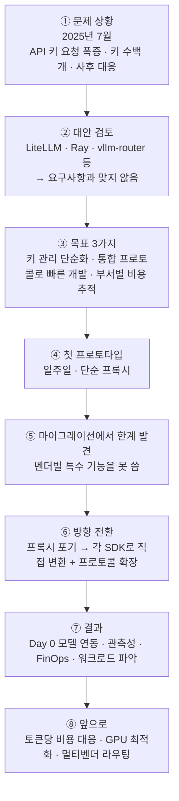

---

## 1. 발표자와 발표의 배경

발표자는 당근 ML 인프라 조직에서 리드를 맡고 있으며, 파이썬 오픈소스 활동도 하고 있다고 자신을 소개했습니다. 회사에서는 파이썬을 많이 쓴다는 말도 덧붙였습니다.

행사 소개 페이지에 따르면 이 행사는 4,300만 명이 가입한 서비스를 만드는 당근 빌더들이 어떤 문제를 풀고 있는지를 나누는 자리이고, Platform Day는 여러 서비스가 함께 쓰는 기술·아키텍처를 플랫폼으로 만드는 과정과 AI와 함께 일하는 방식을 다룹니다.

발표자는 본론에 들어가기 전에 오늘 이야기가 다섯 가지로 이어진다고 안내했습니다.

1. LLM 라우터가 무엇인지
2. 왜 만들게 되었는지
3. 전사 마이그레이션을 어떻게 진행했는지
4. 그 결과가 어떤지
5. 앞으로 어떤 계획을 가지고 있는지

이 문서도 같은 순서로 따라갑니다.

---

## 2. LLM 라우터란 무엇인가

### 2.1 라우터가 없을 때 생기는 일

발표자는 먼저, AI 서비스를 만드는 팀이 많아질수록 어떤 일이 벌어지는지 보여 주었습니다. 중앙 플랫폼 팀이 없으면 각 응용 팀이 필요한 모델 제공사의 SDK를 직접 가져다 씁니다. 발표 자료의 예시에는 Amazon Bedrock, Google Cloud(Gemini), OpenAI, Anthropic 네 곳이 등장하고, 팀 A·B·C가 각각 네 가지 SDK를 모두 들고 있으며 팀마다 API 키도 따로 관리합니다.

발표 자료는 이 상태를 두 가지 표현으로 요약했습니다. 하나는 **Credential Sprawl(자격 증명 난립)**, 다른 하나는 **Duplicated SDK Logic(중복된 SDK 로직)** 입니다. 쉽게 말해, "열쇠가 여기저기 흩어져 있고, 같은 연동 코드를 팀마다 따로 만들고 있는 상태"입니다.

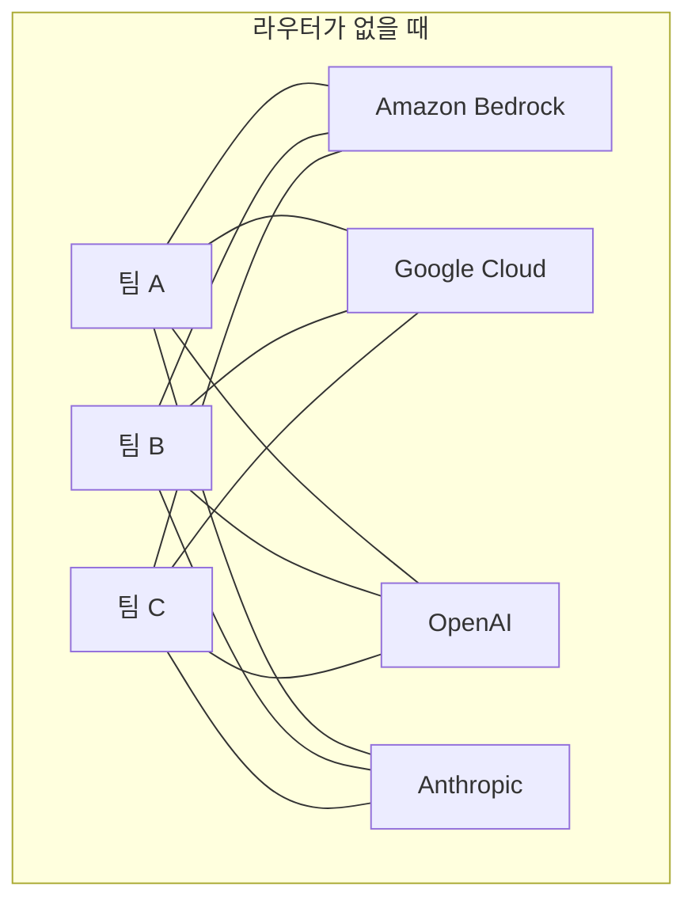

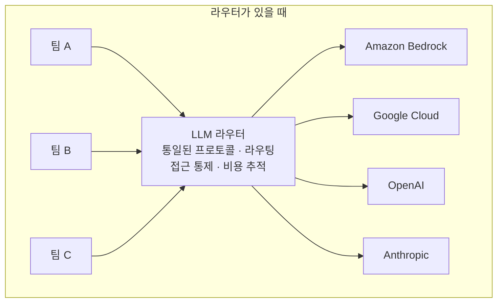

연결선이 12개에서 7개로 줄어드는 것은 단순한 그림 이상의 의미가 있습니다. 팀이 늘어나고 제공사가 늘어날수록 앞쪽 구조는 곱셈으로 복잡해지는 반면, 뒤쪽 구조는 덧셈으로만 늘어납니다.

### 2.2 당근이 정의한 LLM 라우터의 네 가지 역할

발표자는 "저희가 생각하는 LLM 라우터의 정의"를 네 가지로 제시했습니다.

**첫째, 통일된 프로토콜(인터페이스)을 제공합니다.** 사내 사용자는 OpenAI 프로토콜이든 Anthropic 프로토콜이든 자신이 익숙한 방식으로 요청을 보내면 됩니다.

**둘째, 모델 라우팅을 합니다.** 사용자가 요청에 어떤 모델을 지정하면, 라우터가 그 모델을 실제로 제공하는 곳으로 알아서 보내 줍니다.

**셋째, 접근 통제를 합니다.** 모든 사용자에게 API 키를 발급하는 대신, 자체적인 접근 통제 시스템으로 보안을 강화합니다. 발표자는 보안이 굉장히 중요하다고 강조했습니다.

**넷째, 비용 추적과 비용 최적화를 합니다.** 요즘 AI 비용이 많이 올라가고 있어서, 플랫폼 팀 입장에서는 그 비용이 어떻게 쓰이고 있는지를 투명하게 보는 일이 중요하다는 설명이었습니다.

> **해설**: 라우터를 "회사 전체가 쓰는 하나의 접수 창구"라고 생각하면 쉽습니다. 직원(서비스)은 어느 부서(모델 제공사)가 일을 처리하는지 몰라도 창구에 요청서를 내면 되고, 창구는 신분을 확인하고(접근 통제), 알맞은 부서로 전달하고(라우팅), 누가 어떤 일을 얼마나 맡겼는지 장부에 적습니다(비용 추적).

---

## 3. 두 가지 "말투": OpenAI 프로토콜과 Anthropic 프로토콜

이 발표에서 **프로토콜**은 "LLM에게 요청을 보내고 응답을 받는 형식의 약속"이라는 뜻으로 쓰입니다. 발표자는 회사마다 사정이 다를 수 있다고 전제한 뒤, 당근에서 가장 많이 쓰는 두 가지를 소개했습니다.

### 3.1 OpenAI 프로토콜

당근에서는 서비스, 혹은 서비스를 향한 에이전트에서 OpenAI 프로토콜을 많이 씁니다. 발표자는 Chat Completions API가 "이제는 약간 레거시 API가 됐지만" 여전히 쓰이고, 주력은 Responses API라고 말했습니다.

> **확인한 사실**: OpenAI 공식 문서는 Responses API를 Chat Completions의 진화형으로 소개하면서, "Chat Completions는 계속 지원되지만 모든 신규 프로젝트에는 Responses를 권장한다"고 밝히고 있습니다. 즉 Chat Completions가 중단된 것은 아니고, 신규 개발에는 Responses가 권장되는 상태입니다. 발표자의 "레거시"는 "권장 순위가 밀렸다"는 뜻으로 이해하면 정확합니다.

OpenAI 프로토콜의 장점으로 발표자는 세 가지를 꼽았습니다.

- OpenAI API의 형식이라 **많은 프로젝트가 차용**하고 있습니다. 사내 고객이 이미 이 형식을 쓰는 경우가 많습니다.
- 이 형식에 맞추면 **별도의 클라이언트 구현 없이 쉬운 마이그레이션**이 가능합니다. 사용자는 접속 주소(호스트)만 라우터로 바꾸면 됩니다.
- **타깃 서버 호스트를 바꾸기가** 다른 프로토콜의 클라이언트보다 **쉬운 편**입니다. 라우터는 결국 프록시 성격이 있어서 클라이언트가 바라보는 서버를 바꿔야 하는데, Gemini나 Anthropic 클라이언트보다 OpenAI 클라이언트가 변경하기 쉽다는 설명이었습니다.

단점도 분명합니다.

- OpenAI 프로토콜의 표현식이 **모든 모델의 모든 기능을 담지는 못합니다**.
- Anthropic이나 Google이 제공하는 "OpenAI 호환 주소"를 그대로 쓰면, 그 제공사만의 특수한 기능은 쓸 수 없습니다.

발표 자료의 예시 요청은 아주 단순합니다. `/v1/responses` 주소에 `Authorization: Bearer` 헤더로 키를 실어 보내고, 본문에는 모델 이름과 입력 문장만 담습니다. 발표자는 이런 요청을 직접 `curl`로 보내는 일은 드물고, 대부분 OpenAI가 제공하는 SDK(파이썬, 루비, 자바 등)를 쓴다고 덧붙였습니다.

### 3.2 Anthropic 프로토콜

발표자는 코딩 도구(대표적으로 Claude Code), 코딩 에이전트, 코드 리뷰 시스템이라면 높은 확률로 Anthropic 프로토콜의 **Messages API**를 쓴다고 말했습니다. 발표 자료의 표현으로는 "코딩 에이전트와 코드리뷰 관련 시스템들은 Anthropic 프로토콜이 표준"이며, "Claude 관련 에코시스템을 지원해야 한다면 피할 수 없다"는 것입니다.

모양은 OpenAI와 비슷하지만 다른 점이 있습니다. 발표 자료의 예시를 보면 다음과 같습니다.

- 주소가 `/v1/messages` 입니다.
- 인증 헤더가 `x-api-key` 입니다.
- `anthropic-version` 헤더로 버전을 지정합니다(예시 값은 `2023-06-01`).
- 본문에 `max_tokens`(생성할 최대 토큰 수)를 반드시 적습니다.

발표자는 "토큰 수를 지정한다든지, 특정 버전을 지원해야 한다면 버전 시멘틱스를 적어야 한다는 식의 사소한 차이"가 있지만 전체적으로 큰 차이는 없고, 이 역시 언어별 SDK로 쓸 수 있다고 정리했습니다.

> **확인한 사실**: 발표 자료의 Anthropic 예시에 쓰인 모델명은 `claude-sonnet-4-5`인데, Anthropic 공식 문서는 현재 Claude Sonnet 4.5를 "deprecated(지원 중단 예정)"로 표기하고 있고, 최신 세대로 Claude Opus 5.5, Claude Sonnet 5.5, Claude Fable 5.1, Claude Haiku 5.5 등을 언급합니다. 발표 자료의 모델명은 요청 형식을 보여 주기 위한 예시일 뿐입니다.

### 3.3 두 프로토콜 한눈에 비교

| 구분 | OpenAI 프로토콜 | Anthropic 프로토콜 |
|---|---|---|
| 당근에서 주로 쓰이는 곳 | 서비스, 서비스 향 에이전트 | 코딩 도구·코딩 에이전트·코드 리뷰 |
| 대표 API | Chat Completions, Responses | Messages |
| 요청 주소(발표 자료 예시) | `/v1/responses` | `/v1/messages` |
| 인증 헤더 | `Authorization: Bearer ...` | `x-api-key: ...` |
| 추가로 신경 쓸 것 | — | `anthropic-version` 헤더, `max_tokens` 지정 |
| 라우터 관점의 장점 | 채택한 프로젝트가 많고 호스트 변경이 쉬움 | Claude 생태계 지원에 필수 |

---

## 4. 시간을 돌려 2025년 7월: 왜 라우터가 필요해졌나

발표자는 "이 결정을 이해하려면 2025년 7월로 돌아가야 한다"고 말하며 당시 상황을 세 가지로 설명했습니다.

### 4.1 전사적으로 AI를 적극 활용하기로 한 시기

당근은 당시 LLM을 전사적으로 적극 활용하는 방향으로 의사결정을 했고, 그 덕분에 많은 프로덕트가 LLM 관련 기능을 전면에 붙이기 시작했습니다. 발표자가 든 대표 사례는 세 가지입니다.

- **채팅 메시지 추천**: 상대방이 "안녕하세요", "다음에 시간 어떠세요?" 같은 메시지를 보내면 답장 후보가 자동으로 추천되는 기능이 LLM 기반으로 제공됩니다.
- **채팅 메시지 번역**: 한국어로 "안녕하세요"라고 보내면 외국인 상대에게는 영어로 번역되어 보이는 기능도 LLM 기반입니다.
- **중고거래 게시글 작성 보조**: 사진을 올리면 물건의 제목과 내용을 LLM이 분석해서 제안합니다.

### 4.2 API 키 요청의 폭증

LLM 기능이 늘면서 ML 인프라팀에는 "OpenAI 프로토콜 쓰고 싶어요, Anthropic 프로토콜 쓰고 싶어요" 하는 API 키 발급 요청이 쏟아졌습니다. 당시에는 사내 슬랙에서 API 키를 자동으로 발급해 주는 시스템이 있었는데, 그 신청 알림 메시지가 **200개가 넘었습니다.** 발표 자료는 이를 "관리해야 하는 수백 개의 API Key"라고 표현했습니다.

발표자는 이 상황의 문제를 두 가지로 짚었습니다.

- **누가 어떻게 쓰는지 알기 어렵다.** 신청자들이 API를 어떤 용도로 쓰고 어떤 모델을 쓰는지 파악하기가 어렵습니다.
- **보안 사고가 나면 회수가 어렵다.** 키가 수백 개로 흩어져 있으면 보안 이슈가 났을 때 해당 키를 회수하는 일이 매우 어렵습니다.

### 4.3 능동적 대응이 불가능했던 구조

키를 발급해 주기만 하면, ML 인프라팀은 서비스 내부에서 장애가 발생해도 먼저 알 수 없습니다. 서비스 팀이 "장애가 났어요" 하고 알려 와야 비로소 대응하는 **사후 대응** 구조였습니다. 발표자는 이것도 라우터가 필요했던 중요한 이유라고 말했습니다.

### 4.4 오픈웨이트 모델에 대한 사내 관심 상승

토큰당 비용을 내는 외부 모델만이 아니라 **오픈웨이트 모델**(가중치가 공개되어 직접 서빙할 수 있는 모델)을 쓸 수 있느냐는 문의도 늘었습니다. 그러면 ML 인프라팀은 API 키도 제공하고 자체 서빙 모델도 제공해야 하는데, 이 둘을 함께 정리해 줄 일종의 라우터가 필요했습니다. 발표 자료는 "vllm은 아쉽게도 모델 라우팅에 대한 기능은 제공하지 않았어요"라고 적었습니다.

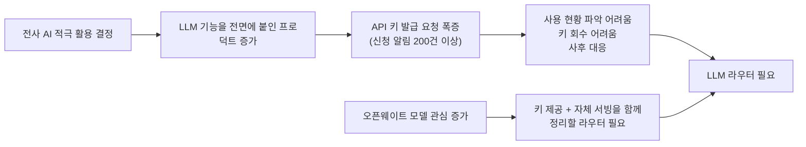

---

## 5. 시중의 비슷한 물건들은 왜 쓰지 않았나

발표자는 "자체 개발하지 않고 **운영만 하는 방안**도 검토했다"고 분명히 말했습니다. 발표 자료에 나온 후보는 LiteLLM, Ray 라우터, vllm-router, 그리고 "미성숙했던 CNCF 관련 프로젝트"입니다.

> **확인한 사실 (각 도구가 무엇인지)**
> - **LiteLLM**: 공식 문서는 LiteLLM을 "100개 이상의 LLM 제공사를 하나의 OpenAI 호환 API로 묶어 주는 오픈소스 SDK이자 셀프 호스팅 AI 게이트웨이"로 소개하며, 가상 키(virtual key), 지출 추적, 예산, 라우팅과 폴백 기능을 제공한다고 설명합니다. MIT 라이선스의 오픈소스이고, SSO·감사 로그 같은 일부 엔터프라이즈 기능은 별도 라이선스 키가 필요하다고 밝힙니다.
> - **Ray**: Ray Serve LLM 문서에는 vLLM 같은 엔진 앞에서 "접두사(prefix) 캐시를 고려해 같은 앞부분을 가진 요청을 같은 복제본으로 보내는" 요청 라우터가 소개되어 있습니다. 다만 발표 자료는 "ray 라우터"라고만 적었기 때문에 당근이 정확히 어떤 구성 요소를 검토했는지는 발표에서 밝히지 않았습니다.
> - **vLLM 계열 라우터**: vLLM Production Stack 문서에는 같은 접두사를 가진 요청을 같은 vLLM 인스턴스로 보내 KV 캐시 활용도를 높이는 라우팅이 설명되어 있습니다. 제가 찾아본 공개 문서에서는 이 라우터들이 **외부 상용 모델 제공사를 오가는 라우팅이나 부서별 비용 귀속**까지 다룬다는 설명은 확인하지 못했습니다. 이는 "vllm은 모델 라우팅 기능을 제공하지 않았다"는 발표 자료의 취지와 방향이 맞지만, 2025년 7월 당시의 모든 버전을 일일이 대조해 본 것은 아닙니다.

발표자가 직접 만들기로 한 이유는 **세 가지 내부 요구사항**으로 정리됩니다. 발표 자료의 제목은 "내부적인 요구사항"이고, 항목은 사용성·비용추적·프로토콜입니다.

### 5.1 사용성: 벤더별 특수 기능을 쓸 수 있어야 한다

각 모델 제공사가 내놓는 특수한 기능을 쓸 수 있어야 하는데, 2025년 7월에는 이런 기능이 "매일같이 다르게" 나오던 시기였습니다. 오픈소스 프로젝트가 그 기능을 지원하는 범위가 중요했고, 설사 지원한다 해도 새 모델이 오늘 나왔는데 당근이 "오늘 당장 이 기능을 쓰고 싶어요" 하는 속도로 움직이는 회사라, 오픈소스의 릴리스를 기다릴 수 있느냐는 관점에서 어렵다고 판단했습니다.

### 5.2 비용추적: 사내 FinOps 시스템에 맞춰 커스터마이징

LLM이 어떻게 쓰이는지 비용을 추적해야 하는데, 당시 검토했을 때는 이런 비용·지출 추적 기능을 **당근 내부 시스템에 맞춰 커스터마이징하기가 굉장히 어려웠습니다.** 또 비용 추적 기능이 있더라도 엔터프라이즈 구매를 요구하는 경우가 많아서 자체적으로 만드는 편이 낫다고 판단했습니다.

> **해설**: 이는 어디까지나 "2025년 7월 시점에 당근이 검토한 결과"입니다. 위에서 확인했듯 LiteLLM은 지금 공식 문서상 지출 추적·예산 기능을 내세우고 있습니다. 당시 버전과 지금 문서의 기능 구성을 제가 비교해 본 것은 아니므로, "지금도 쓸 수 없다"는 뜻으로 읽으면 안 됩니다. 발표의 핵심은 도구의 우열이 아니라 **'사내 FinOps 시스템과 얼마나 맞물리느냐'** 라는 요구사항이었습니다.

### 5.3 프로토콜: 지원의 완결성

앞서 본 Chat Completions API, Responses API, 그리고 사내에서 쓰는 임베딩 API까지, OpenAI의 프로토콜 전부를 당시에 제대로 제공하는 프로젝트가 거의 없었습니다. "우리 유스케이스에 맞춰 빨리 만드는 게 낫지 않을까" 하는 판단이 여기서 나왔습니다.

---

## 6. 달성하고자 한 목표 세 가지

발표 자료의 "달성하고자 하는 목표" 슬라이드는 다음 세 줄입니다.

1. **LLM 관련 API 키 관리 단순화**: 수백 개 발급된 API 키를 모두 회수하고 관리를 단순화합니다.
2. **전사가 통합된 프로토콜로 빠르게 LLM 관련 기능 개발**: OpenAI 프로토콜이든 Anthropic 프로토콜이든, 각 응용 팀이 제공사 SDK를 따로 공부하지 않고 빠르게 개발하게 합니다.
3. **부서별·프로젝트별 AI 비용 추적**: 플랫폼 팀 입장에서 매우 중요한 AI 비용이 어떻게 쓰이는지 분석합니다.

---

## 7. 첫 프로토타입: 일주일 만에 "후딱"

발표자는 "금방 되지 않을까 싶어서 일주일 후딱 만들었다"고 말했습니다. 이 첫 번째 구조에는 네 가지 선택이 들어 있었습니다.

1. **동적 설정(Central Dogma)**: 신규 모델 배포를 설정 변경으로 처리하기 위해, 동적 설정을 제공하는 오픈소스 프로젝트인 Central Dogma를 사용했습니다.
2. **단순 프록시**: 처음에는 "굉장히 나이브하게" 생각해서, 각 제공사가 제공하는 OpenAI 호환 프로토콜을 이용해 요청을 그대로 넘기는 단순한 프록시 구조로 만들었습니다. 이 구조로 OpenAI뿐 아니라 Gemini, Anthropic까지 모두 OpenAI 프로토콜 기반으로 제공했습니다.
3. **Keyless 인증**: API 키 회수가 가장 큰 목표였으므로, 당근 SRE 팀이 이미 훌륭하게 구축해 둔 **사내 서비스 식별자 시스템**을 이용해 별도 API 키 발급 없이 내부 인증으로 접근하게 했습니다.
4. **FinOps 연동 비용 분배**: 사내 FinOps 시스템과 연동해 비용을 서비스별로 나누는 것까지 완성했습니다. 발표 자료의 구조도에는 이 시스템이 "Internal Cost Track System (KOST)"로 표기되어 있습니다.

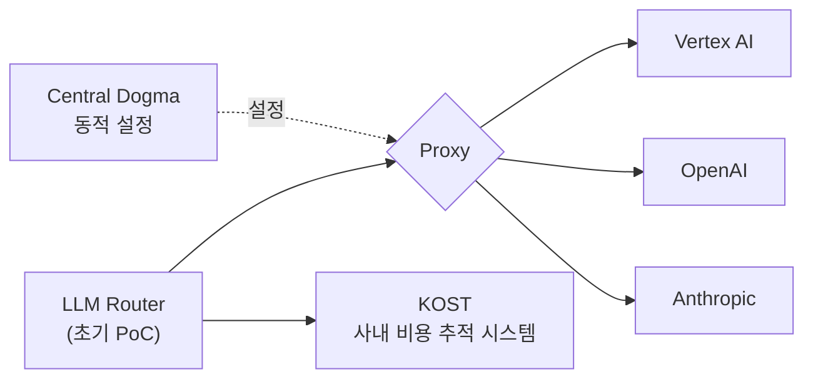

> **확인한 사실 (Central Dogma)**: Central Dogma는 LINE이 Apache 2.0 라이선스로 공개한, Git·ZooKeeper·HTTP/2 기반의 고가용성·버전 관리형 서비스 설정 저장소입니다. 설정 파일(JSON, YAML 등)을 중앙에 저장하고, 서버를 재시작하지 않고도 변경된 설정을 즉시 통지받아 반영할 수 있으며, 설정 변경을 풀 리퀘스트처럼 리뷰해서 병합하는 흐름을 지원합니다. 뒤에서 나오는 "설정 PR을 올리면 약 1분 안에 라우터에 반영된다"는 결과가 바로 이 특성에 기댄 것입니다.

---

## 8. 마이그레이션: "달리는 기차의 바퀴를 교체하는 일"

발표자는 마이그레이션을 이렇게 비유했습니다. **"달리는 기차의 바퀴를 교체하는 건데,"** 실제로는 생각보다 복잡했다는 것입니다.

### 8.1 부딪힌 벽: 단순 프록시로는 특수 기능을 쓸 수 없다

당근 내부에는 큰 플랫폼이 서너 개 있는데, 이 플랫폼들이 새 라우터로 넘어오려면 **그 플랫폼의 고객(팀)들을 모두 만족**시켜야 합니다. 그런데 앞서 말한 것처럼 각 모델의 특수한 기능이 필요한 곳이 있었고, 초기 프로토타입은 단순한 OpenAI 프로토콜 프록시라 그 기능을 쓸 수 없었습니다.

발표자의 설명은 이렇습니다. 고객이 열 곳인데 그중 단 두 곳만 넘어올 수 없다고 해도, 전사 이전이라는 목표 자체가 성립하지 않습니다. 그래서 **"프록시로 쉽게 푸는 건 그만두자"** 고 결정했습니다.

### 8.2 선택: 각 제공사 SDK로 직접 변환하는 로직을 구현

방향은 이렇게 바뀌었습니다. 당근 사내에서 가장 많이 쓰는 **Google GenAI SDK, Amazon Bedrock SDK, Anthropic SDK** 세 가지를 라우터 내부에서 직접 사용합니다. 요청이 OpenAI 프로토콜로 들어오면 그것을 각 SDK에 맞는 호출로 바꿔 제공사에 보내고, 돌아온 응답은 다시 OpenAI 프로토콜로 바꿔서 돌려줍니다.

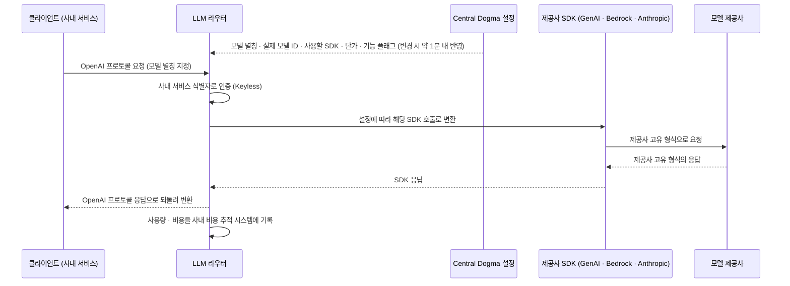

위 도식에서 설정 반영·인증·비용 기록은 발표에서 각각 따로 설명된 내용을 한 흐름으로 합쳐 그린 것입니다. Anthropic 프로토콜로 들어오는 요청이 라우터 내부에서 구체적으로 어떤 경로로 처리되는지는 발표에서 상세히 다루지 않았습니다.

---

## 9. "프로토콜 확장": OpenAI 형식에 담기지 않는 기능을 다루는 법

OpenAI 프로토콜은 표현력이 제한되어 있습니다. 그렇다고 제공사별 기능을 위해 "커스터마이징되는 API"를 따로 열면, 그 API를 쓰기 위해 모든 클라이언트를 다시 구현해야 합니다. 그래서 당근은 **OpenAI 프로토콜 자체를 확장하는 길**을 택했습니다. 이렇게 하면 클라이언트 로직 변경 없이 라우터 쪽에서 진행할 수 있습니다.

발표 자료는 "확장 프로토콜이 필요한 예"로 다음을 들었습니다.

- Gemini의 각종 Grounding 기능: Google Map Grounding, Google Search Grounding
- Anthropic Extended Thinking + Thinking Budget

그리고 발표에서는 확장의 실제 사례가 세 가지 더 설명되었습니다.

### 9.1 Gemini의 Grounding(근거 연결) 기능

**Grounding**이란 LLM이 자기 기억만으로 답하지 않고 외부 정보원을 찾아서 그 결과를 근거로 답하게 하는 기능입니다. 발표자는 두 가지를 쉽게 풀어 설명했습니다.

- **Map Grounding**: LLM이 구글 맵을 검색해 그 결과를 종합해서 답할 수 있게 하는 기능
- **Search Grounding**: 구글 검색 엔진으로 정보를 찾아, 그 정보를 근거로 판단하게 하는 기능

당근은 이를 OpenAI 프로토콜의 **`extra_body`(추가 본문)** 기능을 통해 처리합니다. 요청에 위젯 정보, 언어(랭귀지) 정보, 위도·경도 정보를 실어 보내면 라우터가 그것을 받아 실제 처리에 사용하는 방식입니다.

> **확인한 사실**: Gemini API 공식 문서에서 Google Maps 그라운딩은 `generateContent` 메서드의 도구(`tools` 아래 `googleMaps`)로 제공되며, 사용자 질의에 지리적 맥락이 있을 때 모델이 이 도구를 호출합니다. 사용자의 위치 정보는 선택 사항입니다. 발표 자료에 나온 Gemini 3.8 Flash 설정 변경 사례에는 웹·지도 검색 단가가 쿼리당 0.014달러(1,000쿼리당 14달러)로 적혀 있습니다.

### 9.2 Anthropic의 Extended Thinking과 Thinking Budget

발표자는 Anthropic에는 자체적인 사고(thinking) 관련 정책이 있고 이것도 OpenAI 프로토콜에 녹여낼 수 있어야 했다고 설명했습니다. 이것이 발표 자료의 "Anthropic Extended Thinking + Thinking Budget" 항목입니다.

> **확인한 사실 (최신 상태 점검)**: Anthropic 공식 문서의 현재 설명은 다음과 같습니다.
> - 확장 사고(Extended thinking)는 `thinking: {type: "enabled", budget_tokens: N}` 형식으로 켜며, `budget_tokens`는 최소 1,024이고 `max_tokens`보다 작아야 합니다. 이 값은 엄격한 상한이 아니라 목표치입니다.
> - 이 방식은 Claude 4.6 모델에서 **deprecated** 되었습니다(요청은 아직 성공).
> - **Claude 4.7 이상 모델(Claude Opus 5.5, Sonnet 5.5, Fable 5.1, Haiku 5.5 등)은 이 방식을 지원하지 않고 400 오류로 거부**합니다.
> - 이들 모델에서는 `thinking: {type: "adaptive"}`로 설정하고 사고의 깊이는 `output_config: {effort: ...}`로 조절합니다.
>
> **해설**: 따라서 "사고 예산(token budget)을 요청에 담아 보내면 제공사에 그대로 전달한다"는 단순한 방식은 모델 세대에 따라 통하지 않을 수 있고, 라우터처럼 여러 세대의 모델을 한 입구로 받는 계층은 이 차이를 알고 있어야 합니다. 당근이 이 차이를 어떻게 다루는지는 이번 발표에서는 언급되지 않았습니다.

### 9.3 임베딩: 멀티모달을 위한 확장

**임베딩**은 문장이나 사진 등을 컴퓨터가 비교할 수 있는 숫자 벡터로 바꾸는 작업입니다. 발표자는 OpenAI는 (발표 시점 기준) 멀티모달 임베딩을 지원하지 않고 텍스트 임베딩만 지원하는데, 당근은 Gemini를 통한 멀티모달 임베딩도 써야 해서 임베딩 요청에 **사진 등 시각 자료의 주소(URL)를 담는 별도 필드를 확장**했다고 설명했습니다.

> **확인한 사실**: Google은 2026년 3월 Gemini Embedding 2를 미리보기로 공개했고, 이를 "첫 번째 멀티모달 임베딩 모델"로 소개합니다. 텍스트·사진·영상·오디오·PDF를 하나의 통합된 임베딩 공간으로 매핑하며, 현재 문서에는 `gemini-embedding-2`가 안정(Stable) 버전으로 올라 있습니다. 한편 OpenAI 쪽은 `text-embedding-3` 계열이 텍스트 입력을 받는 모델로 목록에 올라 있습니다. 다만 "OpenAI가 앞으로도 멀티모달 임베딩을 내놓지 않는다"는 의미는 아니므로, 이 부분은 발표 시점 기준의 설명으로 이해하면 됩니다.

### 9.4 Gemini의 thought signature(사고 서명)

여기까지 두 가지(Grounding, 임베딩)는 **클라이언트가 보내는 요청 쪽**의 확장이고, 이번 것은 **응답 쪽**의 확장입니다. 발표자는 구글 쪽에서는 응답으로 "thought signature"가 내려오고, 클라이언트가 이 값을 다음 요청에 다시 실어 보내야 그 서명을 이용해 다음 응답을 내려 주는데, OpenAI 프로토콜의 응답에는 그런 항목이 원래 없어서 **응답을 확장했다**고 설명했습니다. (자막에는 "더트 시그너처"로 잘못 옮겨져 있지만, 발표 자료의 `thinking_signature` 예시와 문맥을 보면 이 기능을 말합니다.)

> **확인한 사실**: Gemini 공식 문서에 따르면 thought signature는 모델의 내부 사고 과정을 암호화해 표현한 값으로, 여러 단계에 걸친 상호작용에서 추론 맥락을 유지하는 데 쓰입니다. 응답에서 받은 서명은 **받은 그대로** 다음 요청의 대화 기록에 포함해 돌려보내야 하고, **Gemini 3 모델에서 함수 호출(function calling) 시 필요한 서명을 돌려주지 않으면 400 오류**가 납니다. 공식 SDK의 채팅 기록 기능을 쓰면 서명은 자동으로 처리되지만, SDK를 쓰지 않거나 기록을 잘라서 보낼 때는 직접 보존해야 합니다. 이 때문에 OpenAI 형식으로 말하는 클라이언트와 Gemini 사이에 있는 라우터는 서명을 응답에 실어 보내고 다음 요청에서 받아 줄 통로가 필요합니다.

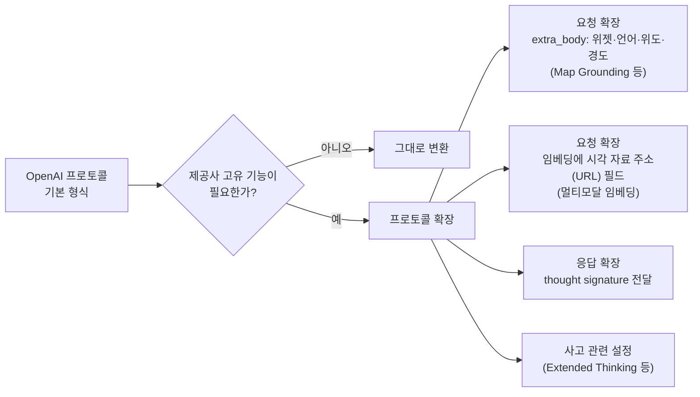

### 9.5 코드 리뷰: Claude Code Action 래퍼

프로토콜 외에 **코드 리뷰**도 잡아야 했습니다. 당근에서는 **Claude Code Action**을 많이 쓰는데, 당근은 이것을 자체 **래퍼(wrapper)** 로 감싸서, 각 응용 팀이 설정에서 액션 참조만 교체(replacement)하면 당근의 코드 리뷰 시스템을 그대로 쓸 수 있게 했습니다. 발표 자료에는 워크플로 설정 파일에서 저장소를 체크아웃한 뒤 `${org}/claude-code-action@v1.4`를 실행하고, 시간 제한(`timeout-minutes`)을 60분으로 두며, `claude_args`로 인자를 넘기는 예시가 있습니다.

> **확인한 사실**: Anthropic이 공개한 `anthropics/claude-code-action`은 GitHub의 PR과 이슈에서 코드 리뷰, 질의응답, 코드 구현을 해 주는 범용 GitHub Action입니다. 사용자의 GitHub 러너(실행 환경)에서 동작하며, Anthropic API 호출은 사용자가 선택한 제공사로 갑니다. 공식 저장소는 현재 `@v1`을 사용하는 예시를 안내합니다. 발표 자료의 `v1.4`는 당근 사내 래퍼의 버전 표기입니다.

여기서 래퍼가 라우터와 어떻게 연결되는지(예: 호출 대상 주소를 어떻게 바꾸는지)는 발표에서 구체적으로 설명되지 않았습니다. 발표에서 확인되는 사실은, 코드 리뷰가 라우터를 통하는 Anthropic 프로토콜 사용처이며, 라우터 장애 시 코드 리뷰 상태도 전사에 공지된다는 점입니다.

---

## 10. 결과: 무엇이 달라졌나

발표자는 "그래서 결과가 잘 돌고 있을까요?" 하고 묻고, 네 가지 결과를 제시했습니다.

### 10.1 결과 1 — Day 0 모델 쉬핑: 신규 모델 출시 10분 내로 연동

**"Day 0 shipping"** 이란 새 모델이 공개된 바로 그날 서비스에서 쓸 수 있게 만드는 것입니다. 발표자는 거의 첫날, 10분대로 모델 연동이 가능해졌다고 말했습니다.

과정은 이렇습니다. 사람이 **모델 설정 PR**을 올립니다. 이 PR에는 Central Dogma 기반 설정이 담기고, 설정 정보에는 다음이 들어갑니다.

- **모델 별칭(alias)**: 사용자가 요청할 때 쓰는 모델 이름
- **실제 모델 ID**: 제공사에서 쓰는 진짜 모델 식별자
- **라우팅에 쓸 SDK**: 어느 SDK를 통해 보낼지
- **비용 정보**: 토큰당 단가
- **특수 기능 플래그**: 예를 들어 "이 모델은 Grounding 기능을 써야 한다" 같은 정보

이 설정이 반영되면 **거의 1분 안에** 라우터가 그 기능을 제공하기 시작합니다. 고급 기능이 새로 나오는 경우에도 당일 바로 새로 개발해서 배포할 수 있으므로, 오픈소스 프로젝트를 쓰는 것보다 훨씬 빠르게 당근의 속도에 맞출 수 있었다는 것이 발표자의 설명입니다.

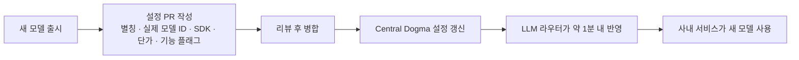

발표 자료에는 실제 사례가 실려 있습니다. "config: add gemini-3.8-flash model to router configs #1934"라는 제목의 병합된 PR인데, 설명문에는 다음 내용이 정리되어 있습니다.

- 동기: Google이 `gemini-3.8-flash`를 GA(정식 출시)로 공개했으므로 라우터에서 바로 쓸 수 있게 모델을 추가한다.
- 변경 내용: alpha·production 라우터 설정에 `google/gemini-3.8-flash`를 추가하되, 기존 `gemini-3.7-flash` 항목과 같은 구조로 넣는다.
- 단가: 텍스트·사진·영상·오디오 모두 입력 0.75달러, 캐시된 입력 0.075달러, 출력 3.75달러이며, 웹·지도 검색은 쿼리당 0.014달러로 3.7-flash와 같다.
- 주의 사항: 이 할인 가격은 2026년 12월 31일에 끝나고 2027년 1월 1일부터 입력 1.50달러, 출력 7.50달러, 캐시 입력 0.15달러로 오르므로 그때 가격을 갱신해야 한다.

또 하나 눈에 띄는 점은, 이 PR의 설명문이 "denny.na의 에이전트 Claude Code(Fable 5.1) 개발자"라는 자기소개로 시작한다는 것입니다. 즉 이 설정 변경 PR은 사람 엔지니어를 대신해 AI 코딩 에이전트가 작성한 것으로 보입니다. 발표자는 이 부분을 별도로 설명하지는 않았고, 발표 자료의 PR 설명문에서 확인되는 내용입니다.

> **확인한 사실**: Google의 Gemini API 문서에는 `gemini-3.8-flash`가 Google Maps 그라운딩 예제의 모델명으로 등장합니다. 즉 이 모델이 문서에 실재함을 확인했습니다. 다만 위 단가는 발표 자료의 PR 설명문에 적힌 값이며, 제가 Google 가격 페이지에서 직접 대조한 것은 아닙니다.

### 10.2 결과 2 — 옵저버빌리티(관측 가능성) 개선

> 발표 자료의 설명: "전사적인 상황을 한번에 파악할 수 있게 되었어요."

예전에는 각 팀이 API를 직접 쓰고 있었기 때문에 **장애가 나기 전까지는 알 수 없었습니다.** 이제는 라우터에서 다음 정보를 볼 수 있습니다.

- 어느 서비스가 어느 모델을 쓰고 있는지
- 요청량이 어느 정도인지
- 응답 시간이 어떤지
- 에러율이 어느 정도인지

발표 자료의 대시보드(`karrot-llm-router-app`)는 환경(prod 등), 국가 코드, 카탈로그 이름, 모델별로 필터링할 수 있고, 모델별로 에러 수·요청 수·P50 지연 시간·에러율이 표로 정리됩니다. 목록에는 `google/gemini-2.5-flash-lite`, `openai/text-embedding-3-small`, `google/text-multilingual-embedding-002`, `google/gemini-embedding-001`, 그리고 자체 서빙하는 `gemma4-31b`, `gemma4-26b-a4b` 등이 보입니다. 카탈로그 이름 열은 가려져 있어 구체적인 서비스명은 확인되지 않습니다.

이 정보 덕분에 **플랫폼 팀이 먼저 선제적으로 움직일 수 있게 되었습니다.** 예를 들어 특정 모델에 장애가 나면 해당 모델을 쓰는 팀에게 먼저 알려서 "폴백(fallback) 모델을 고려해 주세요"라고 제안할 수 있습니다. 코드 리뷰도 마찬가지로, 장애가 나면 "지금 전사적으로 코드 리뷰가 잘 되지 않고 있다"는 공지를 할 수 있습니다.

### 10.3 결과 3 — FinOps 개선

> 발표 자료의 설명: "LLM 관련 비용을 쉽게 분석할 수 있게 되었어요."

전사적으로 **매일 어떤 서비스가 LLM 비용을 얼마나 쓰고 있는지** 확인할 수 있고, 필요하면 어떤 제공사를 쓰는지, 더 필요하면 어떤 모델이 얼마를 쓰는지까지 쪼개서(break down) 볼 수 있습니다. 발표 자료의 비용 대시보드는 2026년 9월 4일부터 10일까지 일 단위로 프로젝트별 비용을 쌓은 막대그래프를 보여 주며, 프로젝트 수는 70개로 표시되어 있습니다. 금액은 가려져 있어 실제 규모는 알 수 없습니다.

### 10.4 결과 4 — 사내 워크로드 파악

이 부분은 발표자가 "LLM 시대의 굉장히 재밌는 점"이라고 짚었습니다. **요청 수와 워크로드가 일치하지 않는다**는 것입니다.

> **해설**: 예를 들어 같은 "요청 1건"이라도 짧은 문장을 번역하는 요청과 방대한 코드를 읽어야 하는 코드 리뷰 요청은 모델이 처리해야 하는 일의 양이 전혀 다릅니다. 이 문단은 이해를 돕기 위한 일반적인 예시이며 당근의 실제 수치가 아닙니다.

그래서 당근은 **프롬프트 토큰(입력)**, **컴플리션 토큰(출력)**, **캐시 토큰**이 각각 얼마나 쓰이는지를 모두 파악할 수 있게 되었습니다. 발표 자료의 두 그래프는 컴플리션 토큰과 프롬프트 토큰의 시간대별 사용량을 모델별로 쌓아 보여 주는데, 새벽(03시 전후)에 사용량이 낮고 낮 시간대에 높은 일간 흐름이 보이며, 축 눈금 기준으로 프롬프트 토큰의 규모(최대 약 1.2G)가 컴플리션 토큰(최대 약 70M)보다 훨씬 큽니다.

이 자료는 **자체 서빙 용량 산정의 근거**가 됩니다. 현재 자체 서빙을 하고 있는데, "GPU가 어느 정도 필요한지" 같은 근거를 이 토큰 통계에서 모두 뽑아낼 수 있었다는 설명입니다.

---

## 11. 현재의 구조: 네 개의 플랫폼과 하나의 라우터

발표자는 현재 구조를 이렇게 소개했습니다. 당근에는 LLM을 쓰는 응용 플랫폼이 크게 네 가지가 있습니다.

| 플랫폼 | 하는 일 | 라우터에 쓰는 프로토콜(발표 자료 표기) |
|---|---|---|
| **Prompt Studio** | 서비스 향 LLM 플랫폼 (Service Driven LLM Platform) | OpenAI |
| **KAMP** | 고객(CS)을 담당하는 에이전트 시스템 (Customer Agent System) | OpenAI |
| **Karby** | 당근에서 가장 많이 쓰는 코딩 에이전트 시스템 | OpenAI / Anthropic |
| **Code Review System** | 자체 AI 코드 리뷰 시스템 | Anthropic |

이 플랫폼들은 필요에 따라 OpenAI 프로토콜 또는 Anthropic 프로토콜로 라우터에 요청을 보냅니다. 라우터는 앞서 본 설정(Central Dogma)을 기반으로 어떻게 라우팅할지 정하고, 뒤에 있는 제공사의 정책에 맞춰 요청을 전달합니다. 비용 정보는 사내 비용 추적 시스템(KOST)에 쌓입니다. 라우터와 KOST 사이에는 "사용량·비용 데이터"가 올라가고 "예산·정책"이 내려오는 양방향 연결이 그려져 있습니다.

또 하나의 중요한 점은, 외부 제공사만 쓰는 것이 아니라 **당근이 자체적으로 구축한 vLLM 클러스터**도 같은 라우터 뒤에 있다는 것입니다. 자체 서빙도 라우터를 통해 현재 진행하고 있습니다.

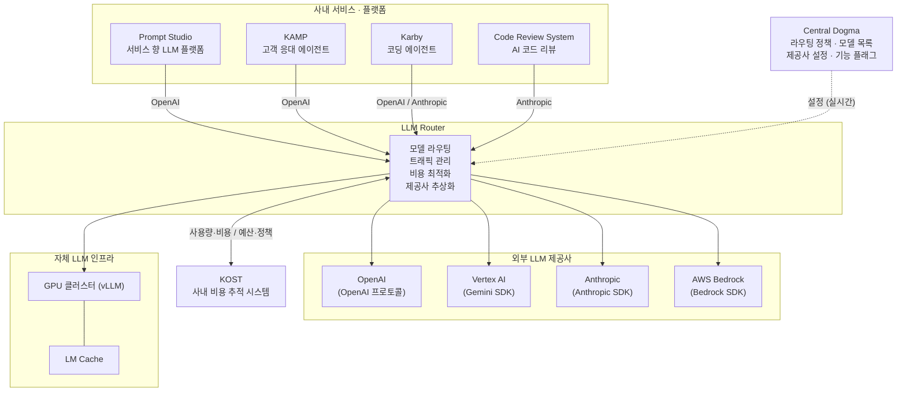

---

## 12. 앞으로의 계획: "토성비"를 따져볼 시간

### 12.1 토큰당 비용(토성비) 이야기

발표자는 오늘 **토큰당 비용**, 줄여서 "토성비"를 이야기하고 싶다고 했습니다. 발표 자료의 요지는 세 줄입니다.

- 추론에 들어가는 비용이 줄어들고 있다고는 하지만,
- 실제 기업에 청구되는 비용은 **상승 추세**이고,
- LLM을 서비스 전면에 붙이는 회사들의 부담은 **급증하는 추세**다.

발표자는 이를 수치 예로 풀었습니다. LLM 자체의 토큰 비용은 절감되고 있다고 하지만 OpenAI나 Anthropic 같은 프런티어 랩이 기업에 청구하는 비용은 계속 상승하고 있고, 두세 배면 다행이지만 **10배, 20배인 경우도 있다**는 것입니다. 예를 들어 한 달에 1억 원을 쓰는 서비스가 있을 때 비용이 10배가 되면 월 10억 원이 되는데, 그러면 이것이 지속 가능한지 생각해 보게 된다는 가정 예시였습니다.

> **확인 범위에 대한 메모**: "프런티어 랩의 청구 비용이 10~20배가 되는 경우가 있다"는 부분은 발표자 본인의 관찰과 가정 예시이며, 저는 이를 독립된 자료로 검증하지 못했습니다. 이 문서에서는 발표자의 주장으로만 전달합니다.

### 12.2 대안: 성능이 좋아지는 저용량 모델과 자체 서빙

다행히 최근 **저용량(작은) 모델의 성능이 굉장히 좋아지고 있다**는 것이 발표자의 판단입니다. 당근이 특히 주목하는 모델로 발표자는 구글 Gemma 시리즈와 메타의 Muse Glimmer 같은 미국 모델, 그리고 성능이 좋은 중국 모델(Qwen)을 언급했습니다. 그리고 당근은 이미 이런 **오픈웨이트 모델이 실제 서비스 전면에서 서빙되고 있다**고 밝혔습니다.

발표 자료에는 Artificial Analysis의 Agentic Index 차트가 인용되어 있고, Qwen3.6 27B, Muse Glimmer 30B, Gemma 4 31B가 강조 표시되어 있습니다. 차트에 적힌 값은 대략 Qwen3.6 27B가 28, Muse Glimmer 30B가 23, Gemma 4 31B가 14로 읽힙니다.

> **확인한 사실 (모델들의 현황)**
> - **Gemma 4**: Google이 2026년 4월 2일에 공개한 오픈웨이트 모델군으로, Apache 2.0 라이선스이며 E2B·E4B(엣지용), 26B MoE(전문가 혼합), 31B Dense의 네 가지 크기입니다. 공개 당시 31B Dense 모델은 Arena AI 텍스트 리더보드에서 오픈 모델 3위로 보도되었습니다. 발표 자료의 `gemma-4-26b-a4b`, `gemma-4-31b` 표기와 일치합니다.
> - **Muse Glimmer**: Meta Superintelligence Labs가 2026년 8월 10일 공개한 약 30B 규모의 오픈웨이트 멀티모달 모델로, Apache 2.0 라이선스입니다. 더 큰 Muse Spark 계열에서 증류(distillation)한 모델이며 로컬 환경에서 에이전트를 돌리는 용도를 내세웠습니다. 독립 평가 기관인 Artificial Analysis는 이 모델이 Meta의 Llama 4 이후 첫 오픈웨이트 공개라고 소개하면서, 에이전트 관련 평가에서는 Qwen3.6 27B에 뒤처지는 항목이 몰려 있고 크기가 비슷한 Gemma 4 31B보다는 해당 평가 항목들에서 더 낫다고 분석했습니다. 발표 자료 차트의 순서(Qwen → Muse Glimmer → Gemma 4)와 방향이 같습니다.
> - 모델 성능 비교는 평가 지표와 버전에 따라 순위가 달라질 수 있으므로, 이 문서는 숫자 대신 방향성만 옮깁니다.

### 12.3 발표자가 정리한 다섯 가지 방향

발표 자료의 "자체 서빙 그리고 토성비를 잡는 라우터" 항목은 앞으로 가고 싶은 방향을 다섯 가지로 제시했습니다.

1. **GPU 리소스 최적화**: GPU 비용 대 토큰당 비용 (발표 자료에 "HAMi??"라는 키워드가 함께 표기됨)
2. **멀티 벤더 스마트 라우팅**
3. **Semantic(시맨틱) 라우팅**
4. **GPU 대체 서빙**: NPU, LPU, XPU 등
5. **그 밖에 아직 라우터를 통하지 않는 케이스들**

발표자는 이 자리에서 이 중 **한두 가지(GPU 리소스 최적화, 멀티 벤더 스마트 라우팅)** 만 공유하겠다고 했습니다. 시맨틱 라우팅, GPU 대체 서빙, 라우터를 통하지 않는 케이스는 구체적으로 설명되지 않았습니다.

### 12.4 GPU 리소스 최적화: "정말 최대한으로 끌어쓰고 있는가?"

GPU는 한번 서빙을 시작하면 **고정 비용**으로 나가기 시작합니다. 그래서 "이 GPU를 과연 효율적으로 쓰고 있는가"의 **기준점**이 필요한데, 발표자의 생각은 이렇습니다.

> 같은 모델을 외부 제공사에서 쓴다고 가정하고 **토큰당 비용으로 환산**할 수 있다. 이 값과 우리 GPU 비용을 비교해서 **비슷하거나 더 효율적이면** 효율적으로 쓰고 있다고 볼 수 있다.

현재 당근은 각 모델에 대한 GPU 자원 분배를 **수동**으로 하고 있습니다. 발표자는 "예를 들어 Gemma 31B는 다섯 대, Gemma 4 26B는 세 대" 같은 식이라고 가정 예시를 들었습니다. 이런 고정 분배에서는 특정 모델에 장애가 생기거나 수요가 변할 때 사람이 손으로 GPU를 재배치해야 합니다. 그래서 **자동으로 동적 할당**하는 방법을 고민하고 있다고 합니다.

발표 자료의 도식은 이 아이디어를 비교해 보여 줍니다.

- **정적 할당(Static Allocation)**: 모델별로 GPU 수가 고정되어 있어 복제본(replica) 수가 고정되고, 쓰이지 않는 용량이 묶여 있게(stranded) 됩니다.
- **동적 할당(Dynamic Allocation)**: 하나의 공유 GPU 풀 앞에 **GPU-aware 스케줄러**가 있고, 수요·큐 깊이·우선순위·사용률을 보고 수요가 있는 곳에 용량을 배분합니다.

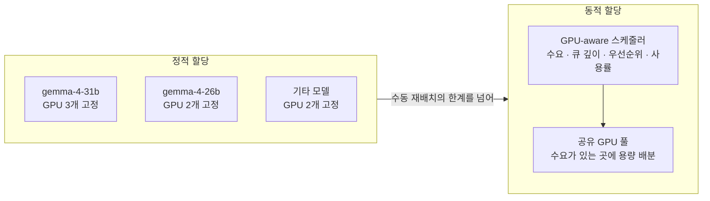

여기서 도식에 적힌 GPU 개수(3·2·2)는 개념을 보여 주기 위한 그림의 값입니다. 앞의 "다섯 대, 세 대"도 발표자가 든 가정 예시이며, 당근의 실제 보유 대수가 아닙니다.

> **확인한 사실 (HAMi)**: 발표 자료의 "HAMi??"는 발표에서 별도로 설명되지 않았습니다. 참고로 HAMi(Heterogeneous AI Computing Virtualization Middleware)는 쿠버네티스에서 GPU를 **컨테이너 단위로 쪼개 공유**(GPU 메모리와 연산 코어를 지정해 요청)하게 해 주고, 여러 종류의 가속기를 함께 관리하는 오픈소스 미들웨어로, CNCF 프로젝트입니다(자료에 따라 Sandbox 또는 Incubating 단계로 표기가 다릅니다). 당근이 이것을 어떤 용도로 검토하는지는 발표에서 언급되지 않았습니다.

### 12.5 멀티 벤더 스마트 라우팅: "알잘딱 라우팅"

두 번째로 공유한 주제입니다. 자체 서빙이 아니더라도, 예를 들어 **Anthropic 모델은 Anthropic 직접 호출뿐 아니라 Amazon Bedrock이나 Google Cloud(GCP)를 통해서도 서빙**할 수 있습니다. 그런데 발표자는 "놀랍게도 실제로 서빙해 보면 특정 벤더사에서 장애가 나는 경우가 있다"고 말했습니다. 이때 가만히 보고 있을 것이 아니라 다른 벤더로 트래픽을 넘기면 **높은 확률로 서비스를 살릴 수 있습니다.**

문제는 **각 벤더가 제공하는 LLM의 기능이 모두 동일하지 않다**는 점입니다. 예를 들어 Anthropic에서 제공하는 특정 기능이 Bedrock에서는 지원되지 않을 수 있습니다. 그러나 **특정 서비스가 그 기능을 쓰고 있지 않다면** 안전하게 다른 벤더로 넘길 수 있으므로, 이를 "스마트하게" 라우팅하는 방법을 고민하고 있습니다. 발표 자료도 "특정 모델에서 특정 벤더에서 장애가 발생? / 동일한 동작 보장?"이라는 물음표를 달았습니다.

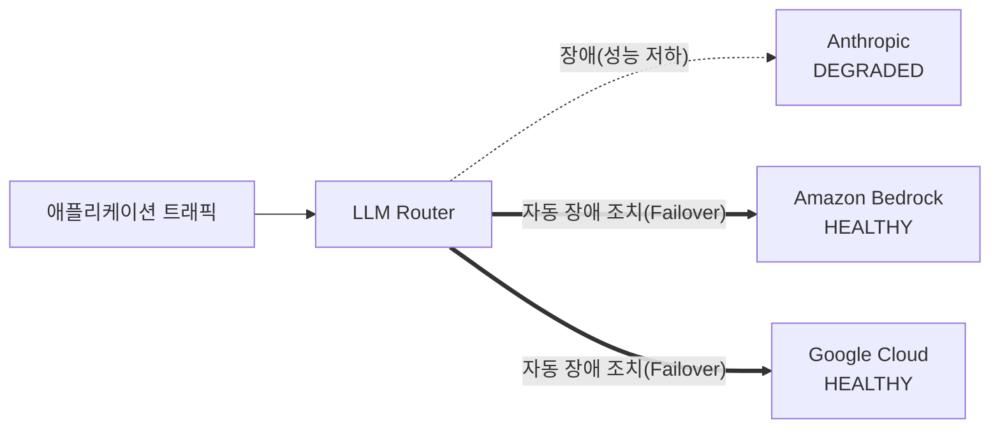

> **확인한 사실**: Anthropic 공식 문서는 Claude를 Anthropic 자체 API 외에 Amazon Bedrock과 Google Cloud(Vertex AI) 같은 파트너 플랫폼에서도 쓸 수 있다고 안내합니다. 같은 문서에는 "플랫폼마다 베타 헤더를 처리하는 방식이 다르다"는 설명도 있습니다. 예를 들어 인터리브드 씽킹(도구 호출 사이의 사고) 베타 헤더는 Claude API와 일부 플랫폼에서는 받아들이되 지원하지 않는 모델에서는 무시된다고 적혀 있습니다. 이는 "같은 모델이라도 어느 경로로 호출하느냐에 따라 기능과 동작이 완전히 같지 않을 수 있다"는 발표자의 문제의식을 뒷받침합니다.

---

## 13. 이 발표에서 얻을 수 있는 교훈 (해설)

여기부터는 발표 내용을 바탕으로 한 정리이며, 발표자가 직접 말한 결론이 아니라 위 내용에서 읽히는 시사점입니다.

**첫째, 라우터의 가치는 "통합"보다 "통제 지점"에 있었습니다.** 키 회수, 접근 통제, 비용 귀속, 장애 가시성은 모두 요청이 한곳을 지난다는 사실에서 나왔습니다. 모델 연동 속도(Day 0)도 같은 지점에서 설정만 바꾸면 되는 구조 덕분입니다.

**둘째, 단순 프록시의 한계는 "호환"과 "동일"이 다르다는 데서 왔습니다.** OpenAI 호환 주소로 호출이 된다는 것과 제공사의 고유 기능을 쓸 수 있다는 것은 별개입니다. 당근은 이 간극을 SDK 직접 변환과 프로토콜 확장으로 메웠습니다.

**셋째, 프로토콜을 확장할 때는 클라이언트를 건드리지 않는 쪽이 이전 비용이 낮았습니다.** 별도의 전용 API를 여는 대신 `extra_body` 같은 기존 확장 지점과 응답 필드 추가를 택해서, 전사 마이그레이션의 걸림돌(열 곳 중 두 곳이 못 옮기는 상황)을 해결했습니다.

**넷째, 설정을 코드와 분리해 PR로 다루는 것이 속도의 비결이었습니다.** 새 모델 추가가 코드 배포가 아니라 리뷰된 설정 변경이므로 10분대의 연동이 가능했습니다. 실제 사례의 PR이 AI 코딩 에이전트로 작성되었다는 점도 흥미롭습니다.

**다섯째, "요청 수"가 아니라 "토큰"으로 봐야 워크로드가 보입니다.** 자체 서빙을 하려면 GPU 용량 산정의 근거가 필요한데, 라우터가 쌓은 토큰 통계가 그 근거가 되었습니다.

**여섯째, 다음 과제는 "기능이 같지 않은 선택지들 사이에서 안전하게 갈아타는 법"입니다.** 비용은 자체 서빙과 외부 제공사 사이의 균형으로, 가용성은 멀티 벤더 장애 조치로 풀려 하지만, 두 경우 모두 "기능 동등성"이라는 같은 난제가 있습니다.

---

## 14. 사실 확인 메모

이 문서를 만들면서 확인한 것과 확인하지 못한 것을 구분해 둡니다.

| 항목 | 상태 | 비고 |
|---|---|---|
| Chat Completions는 계속 지원, 신규에는 Responses 권장 | 공식 문서로 확인 | 발표자의 "레거시" 표현과 뉘앙스 차이 |
| Central Dogma의 성격(LINE 오픈소스, Git 기반, 변경 즉시 반영) | 공식 문서로 확인 | |
| LiteLLM의 기능 범위(가상 키, 지출 추적, 폴백, 엔터프라이즈 라이선스) | 공식 문서로 확인 | 2025년 7월 당시 버전과의 대조는 하지 못함 |
| Ray·vLLM 계열 라우터가 접두사 캐시 인지 라우팅을 제공 | 공식 문서로 확인 | 당근이 검토한 정확한 구성 요소는 발표에서 미공개 |
| Gemini Maps 그라운딩이 `googleMaps` 도구로 제공 | 공식 문서로 확인 | |
| Gemini thought signature 반환 규칙(Gemini 3 함수 호출 시 미반환이면 400 오류) | 공식 문서로 확인 | |
| Gemini Embedding 2가 멀티모달 임베딩 | 공식 문서로 확인 | |
| OpenAI가 멀티모달 임베딩을 지원하지 않는다 | 발표자 설명 + 모델 목록(텍스트 입력)으로 부분 확인 | 발표 시점 기준으로만 해석 |
| Anthropic 확장 사고 `budget_tokens`의 최신 상태(4.6 deprecated, 4.7+ 거부) | 공식 문서로 확인 | |
| Claude Code Action의 성격과 최신 사용법(`@v1`) | 공식 저장소 설명으로 확인 | |
| Gemma 4 공개일(2026-04-02)·라이선스·크기 구성 | 복수 보도로 확인 | |
| Muse Glimmer 공개일(2026-08-10)·라이선스·성격 | 복수 보도와 독립 평가 기관 분석으로 확인 | 성능 수치는 자체 보고와 독립 평가가 섞여 있어 숫자는 옮기지 않음 |
| HAMi의 성격 | 프로젝트 문서로 확인 | CNCF 단계(Sandbox/Incubating) 표기가 자료마다 다름 |
| 프런티어 랩의 청구 비용이 10~20배 상승 | **검증하지 못함** | 발표자의 관찰·가정 예시로만 전달 |
| `gemini-3.8-flash` 단가와 할인 종료일 | **발표 자료의 PR 설명문 기준** | 가격 페이지와 직접 대조하지 못함 |
| 당근의 내부 수치(키 개수, 비용, GPU 대수, 요청량) | **검증 불가** | 발표 자료에 가려지거나 가정 예시로만 제시됨 |

발표 영상 자막은 자동 변환이라 일부 용어가 잘못 옮겨져 있었습니다(예: 센트럴 "도구마"는 Central Dogma, "더트 시그너처"는 thought signature, "L 라우터"는 LLM 라우터, "카비"는 발표 자료상 Karby). 이 문서에서는 발표 자료의 표기와 문맥을 기준으로 바로잡았습니다.

---

## 15. 용어 풀이

| 용어 | 쉬운 설명 |
|---|---|
| **LLM 라우터** | 사내 서비스와 여러 LLM 제공사 사이에 놓인 중앙 창구. 요청을 알맞은 곳으로 보내고, 인증·비용 기록을 담당 |
| **프로토콜** | 요청과 응답을 주고받는 형식의 약속 (예: OpenAI 방식, Anthropic 방식) |
| **프록시** | 요청을 대신 받아 그대로 다른 곳에 전달하는 중간 서버 |
| **SDK** | 특정 서비스를 쉽게 호출하도록 제공사가 만든 개발용 도구 모음 |
| **Keyless 인증** | 사용자에게 API 키를 나눠 주지 않고, 사내 시스템이 서비스의 신원을 확인해 접근을 허용하는 방식 |
| **FinOps** | 클라우드·AI 비용을 팀과 프로젝트별로 투명하게 보고 관리하는 활동 |
| **오픈웨이트 모델** | 가중치가 공개되어 직접 내려받아 자체 서버에서 돌릴 수 있는 모델 |
| **vLLM** | LLM을 자체 서버에서 효율적으로 서빙하기 위한 오픈소스 엔진 |
| **Grounding** | LLM이 외부 정보원(검색, 지도 등)을 찾아 그 결과를 근거로 답하게 하는 기능 |
| **Extended Thinking** | 모델이 답하기 전에 길게 사고하도록 하는 Anthropic의 기능 |
| **thought signature** | Gemini가 내부 사고의 맥락을 이어 가기 위해 응답에 담아 주는 암호화된 값 |
| **임베딩** | 문장·사진 등을 의미 비교가 가능한 숫자 벡터로 바꾼 것 |
| **Day 0 shipping** | 새 모델이 공개되는 당일 바로 서비스에서 쓸 수 있게 하는 것 |
| **토성비** | 발표자가 "토큰 당 비용"을 줄여 부른 말입니다. 발표 자료 제목은 "토큰 당 비용"이고 부제가 "토성비를 따져볼 시간"입니다. 어원은 발표에서 따로 설명되지 않았습니다 |
| **Failover(장애 조치)** | 한 곳에 장애가 나면 자동으로 다른 곳으로 트래픽을 넘기는 것 |
| **Semantic 라우팅** | 요청의 의미를 보고 알맞은 모델로 보내는 방식 (발표에서는 방향으로만 언급) |

---

## 16. 참고 자료

**발표 원문**
- 당근 팀, "당근은 왜 LLM Router 를 직접 만들었을까? | 2026 당근 빌더 밋업", 2026-10-07

**프로토콜·API**
- OpenAI, Migrate to the Responses API — https://developers.openai.com/api/docs/guides/migrate-to-responses
- Anthropic, Extended thinking — https://platform.claude.com/docs/en/build-with-claude/extended-thinking
- Google, Thought signatures — https://ai.google.dev/gemini-api/docs/generate-content/thought-signatures
- Google, Grounding with Google Maps — https://ai.google.dev/gemini-api/docs/generate-content/maps-grounding
- Google, Gemini Embedding 2 — https://ai.google.dev/gemini-api/docs/models/gemini-embedding-2

**인프라·도구**
- LINE, Central Dogma — https://line.github.io/centraldogma/ , https://github.com/line/centraldogma
- LiteLLM 공식 문서 — https://docs.litellm.ai/
- Ray Serve LLM, Prefix-aware routing — https://docs.ray.io/en/master/serve/llm/prefix-aware-request-router.html
- vLLM Production Stack, Prefix aware routing — https://docs.vllm.ai/projects/production-stack/en/latest/use_cases/prefix-aware-routing.html
- HAMi — https://github.com/Project-HAMi/HAMi
- Anthropic, Claude Code Action — https://github.com/anthropics/claude-code-action

**모델**
- Google Gemma 4 공개 소식 — https://letsdatascience.com/news/google-releases-gemma-4-open-models-05c4c02a
- Meta Muse Glimmer 공개 소식 — https://siliconangle.com/?p=812394 , https://www.vktr.com/ai-platforms/meta-releases-muse-glimmer/
- Artificial Analysis, Muse Glimmer 분석 — https://artificialanalysis.ai/articles/muse-glimmer

---

---

# 별첨. LLM 라우터·게이트웨이 도구 지형도

### 대표 플랫폼과 오픈소스 도구를 당근 발표의 관점으로 읽기

> **이 별첨의 출처와 한계**
> 요청해 주신 분석 목록(OpenRouter, LiteLLM, LLMRouter, Portkey·Braintrust·Vercel AI Gateway)을 출발점으로 삼았습니다. 함께 주신 공유 링크는 사이트가 자동 접근을 막고 있어 열람하지 못했습니다. 그래서 목록에 적힌 문장을 그대로 믿지 않고, 도구마다 공식 문서·저장소·보도를 따로 찾아 확인했습니다. 본문과 같은 방식으로 **확인한 사실**, **해설**, **확인하지 못한 부분**을 구분해 적었습니다.

---

## A-1. 먼저 알아둘 것: "라우터"라는 말은 두 가지를 가리킵니다

이 분야의 글을 읽을 때 가장 혼란스러운 점은 같은 "LLM 라우터"라는 이름이 서로 다른 두 가지 일을 가리킨다는 것입니다.

**첫째는 게이트웨이형입니다.** 요청이 지나가는 통로를 하나로 모으고, 그 통로에서 프로토콜 통일, 인증(가상 키), 예산, 폴백(장애 시 대체 경로), 로깅과 관측을 처리합니다. 본문에서 본 당근의 LLM 라우터가 여기에 속합니다.

**둘째는 선택형(학습형) 라우터입니다.** 요청 하나하나의 내용을 보고 "이 질문에는 어떤 모델이 가장 알맞은가"를 판단합니다. 쉬운 질문은 저렴한 모델로, 어려운 질문은 강력한 모델로 보내서 비용과 품질의 균형을 맞추려는 접근입니다.

> **확인한 사실**: 당근 발표에서 라우터의 두 번째 역할은 "사용자가 어떤 모델을 지정해서 보냈을 때 그 모델을 제공하는 곳으로 알맞게 보내 주는 것"이었습니다. 즉 **사용자가 모델 이름을 정해서 보내는 방식**이고, 내용을 보고 모델을 골라 주는 방식은 아닙니다. 요청의 의미를 보고 라우팅하는 시맨틱 라우팅은 발표에서 "앞으로의 방향" 목록에 이름만 올라 있었습니다.

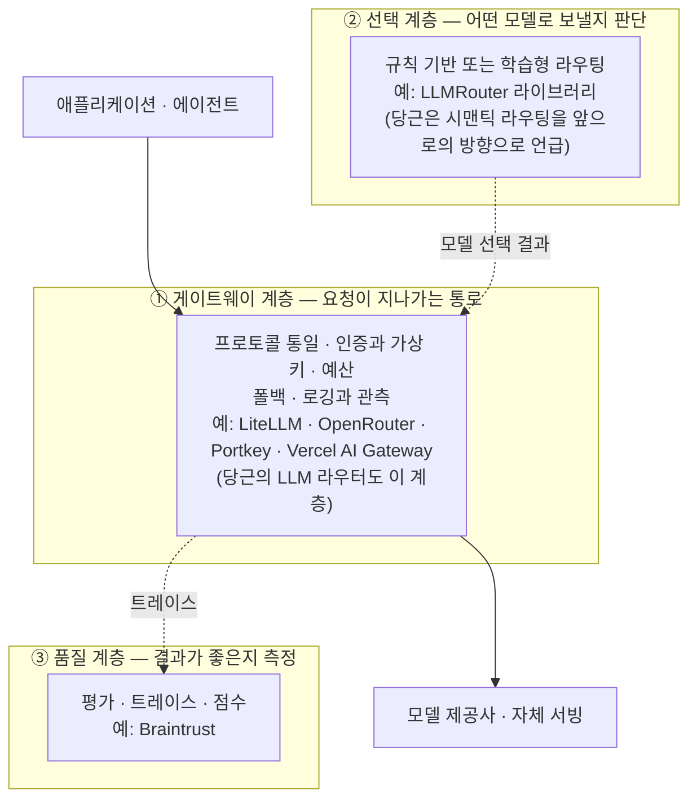

> **해설**: 세 계층은 서로 겹칠 수 있습니다. 예를 들어 뒤에서 볼 LLMRouter 프로젝트는 선택 알고리즘을 모아 둔 라이브러리이면서, 동시에 OpenAI 호환 서버 형태(OpenClaw Router)로 배포하는 방법도 제공합니다. 위 도식은 "무엇이 주된 일인가"를 구분하기 위한 단순화입니다.

---

## A-2. 도구별 상세 설명

### A-2-1. OpenRouter — 관리형 게이트웨이

**한 줄 요약**: 하나의 OpenAI 호환 주소와 하나의 API 키로 수백 개 모델에 접근하게 해 주는 **외부 관리형(호스팅) 서비스**입니다.

**확인한 사실**
- OpenRouter 공식 글은 모델 라우팅과 제공자(provider) 라우팅이라는 **두 겹의 선택**이 있다고 설명합니다. 어떤 모델이 답할지 정하는 일과, 그 모델을 어느 제공자가 서빙할지 정하는 일이 별개라는 뜻입니다.
- 장애 대응은 `models` 배열(대체 모델 목록)과 제공자 폴백으로 구성하고, 제공자 정렬·순서 지정으로 가격·속도 우선 같은 정책을 정할 수 있습니다.
- 접근 가능한 모델 수는 자료마다 "400개 이상", "500개 이상"으로 표기가 다르고, 제공자 수도 60~80개 이상으로 엇갈립니다. 모델 목록은 계속 바뀌므로 **정확한 숫자는 확정하지 않고 '수백 개'로 적습니다.**
- **소유 구조의 변화**: 2026년 8월에 Stripe가 OpenRouter를 인수하기로 했다는 보도와 발표가 있었습니다. 금액은 보도에 따라 "70억 달러 이상"으로 전해졌지만 자료마다 표기가 엇갈리고, 거래 종결 여부도 자료에 따라 표현이 달라 **확정하지 않습니다.** 한 리뷰 글은 기존 사용자에게 기능·요금·결제·SLA 변경 공지를 지켜보라고 권합니다.
- 수익 구조는 모델 원가 위에 일정 비율의 수수료를 얹는 방식이라고 보도되었습니다.

**당근 발표와의 접점**
당근이 풀려던 문제(키 난립, 모델 접근 단순화)와 방향이 같지만, 외부 서비스라는 점이 다릅니다. 발표에서 당근은 사내 서비스 식별자 기반 Keyless 인증과 사내 FinOps 시스템 연동을 직접 구현했는데, 이 두 가지는 사내 시스템과 맞물려야 해서 외부 관리형 서비스가 그대로 대신하기 어려운 성격입니다. 다만 OpenRouter가 이를 지원하는지 여부는 제가 확인한 자료 범위에서는 다루어지지 않았습니다.

---

### A-2-2. LiteLLM — 셀프호스팅 오픈소스 프록시

**한 줄 요약**: 100개 이상의 제공자를 하나의 OpenAI 호환 API로 묶어 주는 오픈소스 SDK이자, 직접 운영하는 AI 게이트웨이입니다.

**확인한 사실**
- 공식 문서는 가상 키(virtual key), 지출 추적, 예산, 라우팅과 폴백, 가드레일, MCP 게이트웨이를 기능으로 소개합니다. 팀·키 단위로 예산과 호출 제한을 둘 수 있습니다.
- 라이선스는 MIT 오픈소스이고, SSO·감사 로그 같은 조직 운영 기능은 **엔터프라이즈 라이선스 키**가 필요합니다.
- 키 관리, 관리자 화면, 지출 추적을 쓰려면 **PostgreSQL**과 마스터 키가 필요하다고 안내합니다. 즉 "프록시 하나 띄우면 끝"이 아니라 데이터베이스까지 운영해야 합니다.

**당근 발표와의 접점**
본문 5장에서 당근이 검토 대상으로 꼽았던 도구입니다. 발표자가 든 이유 중 "비용 추적 기능을 사내 시스템에 맞춰 커스터마이징하기 어렵다", "엔터프라이즈 구매를 요구하는 경우가 많다"는 것은 **2025년 7월 시점**의 판단입니다. 위 사실은 **현재 문서** 기준이라, 당시와 지금의 기능 차이를 비교한 것은 아닙니다.

---

### A-2-3. LLMRouter (ulab-uiuc) — 선택형 라우팅 연구·실험 프레임워크

**한 줄 요약**: 쿼리마다 가장 알맞은 모델을 고르는 **라우팅 알고리즘을 모아 놓고 학습·평가·배포까지 하게 해 주는 오픈소스 라이브러리**입니다. 위 분류로는 ②(선택 계층)에 해당합니다.

**확인한 사실** (프로젝트 저장소 설명 기준)
- MIT 라이선스이며, 저장소 별 표시는 약 3천 개입니다. 논문은 arXiv 2608.06867로 소개되어 있습니다.
- 16개 이상의 라우터를 **단일 라운드, 다중 라운드, 멀티모달, 에이전트형, 개인화** 다섯 범주로 제공합니다. 방식도 KNN, SVM, MLP, 행렬 분해, Elo 평점, 그래프, BERT 기반 등으로 다양합니다.
- 통합 명령줄 도구(`llmrouter`)로 학습·추론·대화형 화면을 쓰고, 11개 벤치마크로 학습 데이터를 만드는 파이프라인을 제공합니다. 직접 만든 라우터를 플러그인으로 붙일 수 있습니다.
- 평가용 벤치마크 `xRouteBench`와 재현 파이프라인을 함께 공개합니다. 프로젝트 소개문은 학습된 라우터가 가장 강한 단일 모델 기준선보다 **상대적으로 14.6% 낫다**고 주장하는데, 이는 **프로젝트 측이 밝힌 수치**이며 제가 독립적으로 재현하지 않았습니다.
- 배포용으로는 OpenAI 호환 서버 형태인 **OpenClaw Router**를 제공하고, 슬랙·디스코드 연동, 스트리밍, 여러 제공자(Together AI, NVIDIA, OpenAI, Anthropic, 로컬 모델)로의 라우팅을 지원한다고 설명합니다.

**읽을 때의 주의 (해설)**
- 저장소 설명에서 키 발급·접근 통제·부서별 비용 귀속 같은 **사내 플랫폼 운영 기능**은 확인되지 않았습니다. 이는 "없다"는 단정이 아니라 "제가 본 설명에는 없었다"는 뜻입니다. 성격상 게이트웨이를 대체한다기보다, **게이트웨이 위에서 모델 선택 전략을 실험하는 도구**에 가깝습니다.
- 학습형 라우팅의 효과는 아직 논쟁 중입니다. 별도의 연구인 `LLMRouterBench`(ACL 2026 Findings)는 33개 모델·21개 데이터셋 규모로 라우팅 방법을 다시 평가했는데, **많은 방법이 통일된 평가에서 비슷한 성능을 보였고 일부 상용 라우터를 포함한 최근 방식이 단순한 기준선을 안정적으로 이기지 못했다**고 보고합니다. 그래서 선택형 라우팅은 "도입하면 자동으로 이득"이 아니라 **자기 트래픽에서 직접 검증해야 하는 영역**입니다.

---

### A-2-4. Portkey — 가드레일·캐싱·관측까지 묶은 게이트웨이

**한 줄 요약**: 라우팅, 재시도, 폴백, 로드 밸런싱에 더해 **가드레일과 캐싱, 관측**을 한 통로에서 제공하는 AI 게이트웨이이며, 핵심은 오픈소스이고 부가 기능은 관리형 플랫폼에 있습니다.

**확인한 사실**
- 공식 저장소는 200개 이상의 LLM과 50개 이상의 가드레일을 하나의 API로 다룬다고 소개하고, **단순 캐싱과 시맨틱 캐싱**(의미가 비슷한 질의의 응답 재사용)을 지원한다고 설명합니다. 지원 모델 수는 자료에 따라 200개 이상 또는 250개 이상으로 다르게 적혀 있습니다.
- 오픈소스 게이트웨이와 **독점 관리형 플랫폼이 나뉘어 있습니다.** 한 비교 글은 오픈소스 코어가 라우팅·재시도·폴백을 담당하고, 관측과 가드레일의 전체 기능, 시맨틱 캐싱 일부는 관리형 쪽에서 돌아간다고 평가했습니다. 공식 저장소는 게이트웨이 2.0으로 핵심 엔터프라이즈 기능을 오픈소스로 합치는 중이라고 밝혀 이 경계가 움직이고 있습니다.
- 오픈소스 라이선스 표기는 자료마다 Apache 2.0, MIT로 엇갈립니다. **라이선스는 도입 전 저장소의 LICENSE 파일로 직접 확인해야 합니다.**
- 가상 키, 예산, 프롬프트 관리, MCP 게이트웨이도 소개되어 있습니다.

**당근 발표와의 접점**
당근이 발표에서 강조한 "관측"과 "비용 추적"을 한 제품으로 묶는 계열입니다. 다만 사내 FinOps 시스템과의 연동이 필요한 경우 어느 쪽 기능(오픈소스 코어, 관리형)이 그 역할을 하는지 따로 확인해야 합니다.

---

### A-2-5. Braintrust — 평가와 관측 중심 플랫폼

**한 줄 요약**: 라우터라기보다 **LLM 애플리케이션의 품질을 평가하고 운영 중 동작을 추적하는 플랫폼**입니다. 필요하면 쓸 수 있는 AI 게이트웨이(캐싱, 여러 제공자 통합 접근)를 곁들이는 구조입니다.

**확인한 사실**
- 평가용 데이터셋과 점수 함수(코드, LLM 심사, 사람 검토)를 기반으로 프롬프트·모델 변형을 비교하고, 운영 트레이스를 평가로 되돌리는 흐름이 핵심입니다. 풀 리퀘스트마다 평가를 돌리는 GitHub Action도 안내합니다.
- 관측은 SDK 기반으로 동작하며 게이트웨이 사용과 독립적입니다. 게이트웨이는 선택 기능입니다.
- 독점 호스팅 제품이고, 자체 호스팅·SSO는 엔터프라이즈 요금제에 있다고 전해집니다. 한 제3자 정리는 이를 "전용 라우팅 게이트웨이가 아니라 평가·관측 우선 플랫폼"으로 분류합니다.

**해설 (목록 표현의 보정)**
처음 주신 목록은 Portkey, Braintrust, Vercel AI Gateway를 "품질 점수, 캐싱, 관측을 제공하는 운영급 인프라 계층"으로 한 묶음에 넣었습니다. 확인해 보니 **세 도구의 강점은 서로 다릅니다.** 품질 점수(평가)는 Braintrust가 중심이고, 캐싱과 가드레일은 Portkey가 두드러지며, Vercel AI Gateway는 예산과 사용량 관측, 폴백이 중심입니다. 한 묶음으로 읽으면 각 도구가 모든 것을 한다고 오해하기 쉽습니다.

---

### A-2-6. Vercel AI Gateway — 세 가지 프로토콜을 받는 관리형 게이트웨이

**한 줄 요약**: 하나의 엔드포인트로 수백 개 모델에 접근하게 해 주는 Vercel의 관리형 게이트웨이이며, **OpenAI Chat Completions, OpenAI Responses, Anthropic Messages** 세 가지 방식을 모두 받습니다.

**확인한 사실**
- 공식 문서는 예산 설정, 사용량 모니터링, 로드 밸런싱, 폴백 관리를 기능으로 소개하고, 임베딩도 지원한다고 적었습니다. API 키별 지출 예산을 걸 수 있습니다.
- 토큰에 **추가 요금(마크업)을 붙이지 않고** 제공자 직접 호출과 같은 단가를 받는다고 밝히며, 자체 제공자 키를 가져오는 BYOK에서도 마찬가지라고 설명합니다.
- Vercel에서 호스팅하는 앱에만 쓸 수 있는 것은 아니라고 안내합니다.
- Anthropic Messages 방식을 받는다는 점은 Claude Code 같은 도구와의 연결을 염두에 둔 것으로 문서에 소개되어 있습니다.

**당근 발표와의 접점**
이 도구는 본문 3장의 핵심 논지와 맞닿아 있습니다. 당근이 "OpenAI 프로토콜과 Anthropic 프로토콜 둘 다 필요하다"고 판단했던 것처럼, 시장의 관리형 게이트웨이도 두 계열을 모두 받는 방향으로 가고 있음을 보여 주는 사례입니다. 반면 당근이 어려움을 겪었던 "벤더 고유 기능을 프로토콜에 어떻게 실을 것인가"는 문서만으로는 알 수 없어서, 이 부분은 도입 전 직접 검증해야 합니다.

---

## A-3. 한눈에 비교

아래 표는 위에서 확인한 내용을 요약한 것입니다. "확인 못함"은 제가 본 자료 범위에서 언급이 없었다는 뜻이며, 지원하지 않는다는 뜻이 아닙니다.

| 도구 | 주된 성격 | 운영 방식 | 공개 여부·라이선스 | 핵심으로 확인된 기능 | 프로토콜 (확인된 범위) |
|---|---|---|---|---|---|
| **OpenRouter** | 관리형 게이트웨이 | 외부 호스팅 서비스 | 서비스(비공개 운영). 2026년 8월 Stripe 인수 발표 | 수백 개 모델, 모델·제공자 라우팅, 폴백, 정렬 | OpenAI 호환 주소 확인 |
| **LiteLLM** | 게이트웨이 + SDK | 셀프호스팅 (DB 필요) | MIT, 일부 기능은 엔터프라이즈 라이선스 | 가상 키, 지출 추적, 예산, 폴백, MCP 게이트웨이 | OpenAI 호환 확인 |
| **LLMRouter** | 선택형 라우팅 라이브러리 | 직접 설치·학습·배포 | MIT | 16개 이상 라우터, 학습·평가 파이프라인, OpenAI 호환 서버(OpenClaw Router) | OpenAI 호환 서버 확인 |
| **Portkey** | 게이트웨이 + 가드레일 + 관측 | 셀프호스팅 또는 관리형 | 오픈소스 코어(표기 Apache 2.0/MIT 혼재) + 독점 관리형 | 라우팅, 폴백, 단순·시맨틱 캐싱, 가드레일, 관측 | 확인 못함 |
| **Braintrust** | 평가·관측 플랫폼 | 호스팅(엔터프라이즈는 자체 호스팅) | 독점 | 평가, 트레이스, 프롬프트 관리, 선택형 게이트웨이 | 확인 못함 |
| **Vercel AI Gateway** | 관리형 게이트웨이 | 외부 호스팅 서비스 | 독점 관리형 | 예산, 사용량 관측, 폴백, 임베딩, 마크업 없음 | OpenAI Chat Completions·Responses, Anthropic Messages |

---

## A-4. 당근의 세 가지 요구사항으로 도구를 읽는 법 (해설)

본문 5장에서 당근이 직접 만들기로 한 이유는 **사용성, 비용추적, 프로토콜** 세 가지였습니다. 어떤 도구를 검토하든 같은 질문을 던져 볼 수 있습니다. 이것은 당근의 결론을 평가하려는 것이 아니라, 발표에서 읽히는 판단 기준을 체크리스트로 바꾼 것입니다.

1. **새 모델과 벤더 고유 기능을 얼마나 빨리 쓸 수 있는가.** 당근은 출시 당일 10분대 연동을 목표로 했습니다. 오픈소스나 관리형 서비스가 새 기능을 반영하는 속도와, 직접 반영할 수 있는 확장 지점이 있는지를 봅니다.
2. **비용을 사내 방식으로 나눌 수 있는가.** 사내 FinOps 시스템과 연동해 서비스·프로젝트별로 귀속해야 한다면, 비용 기록을 내보내거나 연동하는 방법이 있는지 확인합니다.
3. **프로토콜 지원이 완결적인가.** Chat Completions, Responses, Messages, 임베딩까지 실제로 쓰는 것이 전부 다뤄지는지 확인합니다. 위 표에서 보듯 Vercel AI Gateway처럼 세 방식을 문서에 명시한 곳도 있고, 나머지는 제가 본 자료에서 범위가 분명하지 않았습니다.
4. **인증을 어떻게 할 것인가.** 당근은 API 키를 없애는 Keyless 방식을 택했습니다. 가상 키 중심 도구는 키를 줄이는 방식이고, 키 자체를 없애려면 사내 신원 시스템과의 연동이 필요합니다.
5. **데이터가 어디를 지나가는가.** 관리형 서비스는 요청 내용이 제3자 인프라를 지나갑니다. 셀프호스팅은 운영 부담(데이터베이스 포함)을 지는 대신 경로를 통제할 수 있습니다. 이 항목은 도구의 일반적 성격에 대한 설명이며 개별 계약 조건은 확인하지 않았습니다.

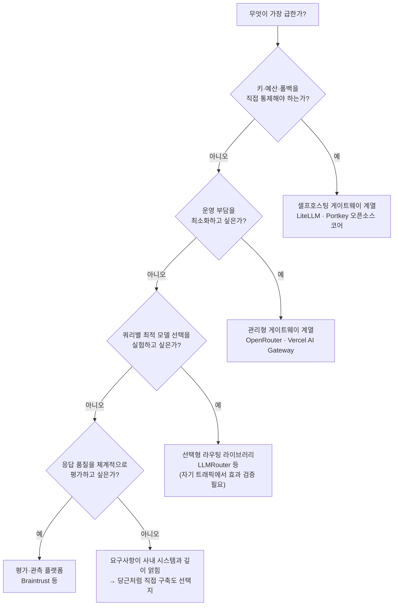

> **해설**: 이 의사결정 흐름은 위 도구들의 성격 차이를 이해하기 쉽게 정리한 **저의 해설**이지, 어떤 기관의 공식 선택 가이드가 아닙니다. 현실에서는 도구를 하나만 고르지 않고 게이트웨이와 평가 플랫폼을 함께 쓰는 경우가 많고, 마지막 항목처럼 "직접 만든다"는 선택은 당근이 2025년 7월의 요구사항에서 내린 결론이었다는 점을 기억해 주세요.

---

## A-5. 이 별첨의 사실 확인 메모

| 항목 | 상태 | 비고 |
|---|---|---|
| OpenRouter가 OpenAI 호환 주소·모델/제공자 폴백·정렬을 제공 | 공식 글과 문서 인용으로 확인 | 모델 수·제공자 수는 자료마다 달라 '수백 개'로 표기 |
| Stripe의 OpenRouter 인수 | 복수 보도로 2026년 8월 발표 확인 | 금액(70억 달러 이상 보도)과 종결 여부는 자료마다 표현이 달라 확정하지 않음 |
| LiteLLM의 가상 키·지출 추적·예산·엔터프라이즈 구분·DB 필요 | 공식 문서로 확인 | |
| LLMRouter의 구성·라이선스·라우터 범주 | 공식 저장소 설명으로 확인 | 성능 수치(14.6%)는 프로젝트 측 주장, 독립 재현 못함 |
| 학습형 라우터의 한계 지적 | LLMRouterBench 초록으로 확인 | 서로 다른 프로젝트의 연구임 |
| Portkey의 캐싱·가드레일·오픈소스/관리형 구분 | 공식 저장소와 비교 글로 확인 | 라이선스(Apache 2.0/MIT)·지원 모델 수 표기가 엇갈림 |
| Braintrust의 평가·관측 중심 성격과 선택형 게이트웨이 | 복수 자료로 확인 | 제3자 분류는 참고용 |
| Vercel AI Gateway의 세 가지 프로토콜 지원·예산·마크업 없음 | 공식 문서로 확인 | |
| 공유 링크의 원문 | **열람하지 못함** | 사이트가 자동 접근을 차단 |
| 각 도구의 현재 요금·한도·SLA | **확인하지 않음** | 도입 전 공식 가격 페이지 확인 필요 |
| 각 도구가 당근의 Keyless·FinOps 연동을 지원하는지 | **확인하지 못함** | 자료 범위에서 언급 없음 |

---

## A-6. 별첨 참고 자료

- OpenRouter, How OpenRouter Model Routing Works — https://openrouter.ai/blog/insights/model-routing/
- OpenRouter 공식 문서(제공자 선택·폴백) — https://openrouter.ai/docs
- TechCrunch, Stripe will reportedly acquire AI gateway startup OpenRouter — https://techcrunch.com/2026/08/16/stripe-will-reportedly-acquire-ai-gateway-startup-openrouter-for-7b/
- Menlo Ventures, Stripe to Acquire OpenRouter — https://menlovc.com/perspective/stripe-to-acquire-openrouter-why-everyone-is-obsessed-with-model-routing/
- LiteLLM 공식 문서 — https://docs.litellm.ai/
- LLMRouter 저장소 — https://github.com/ulab-uiuc/LLMRouter , 문서 https://ulab-uiuc.github.io/LLMRouter/
- LLMRouterBench (ACL 2026 Findings) — https://preview.aclanthology.org/ingest-acl/2026.findings-acl.1881/
- Portkey Gateway 저장소 — https://github.com/Portkey-AI/gateway
- Northflank, Best open-source AI gateways in 2026 — https://northflank.com/blog/best-open-source-ai-gateways
- Braintrust 비교 글(관측과 게이트웨이의 분리) — https://ai-proxy-8ezmimn09.preview.braintrust.dev/articles/helicone-vs-braintrust
- Vercel AI Gateway 공식 문서 — https://vercel.com/docs/ai-gateway
