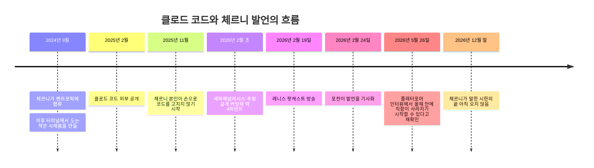
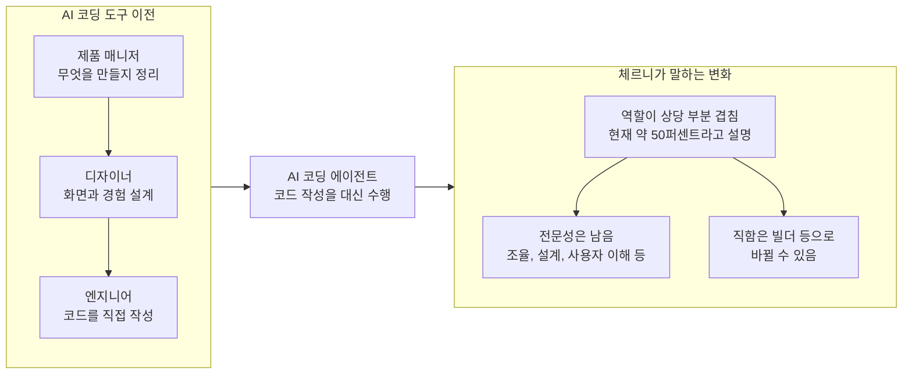

- 작성 기준일: 2026년 10월 9일
- 대상 글: 네이버 카페(bumpyland)와 페이스북에 올라온, 앤트로픽 클로드 코드 개발자 보리스 체르니의 발언을 소개하는 요약글

> 
> 보리스 체르니는 앤트로픽에서 클로드 코드를 만든 엔지니어입니다. 지난 2월 레니스 팟캐스트에 나와 이런 말을 던졌어요. "소프트웨어 엔지니어라는 직함이 조금씩 사라지기 시작할 것 같다." 
> 
> 클로드 코드는 2024년 9월 사이드 프로젝트로 시작됐습니다. 사내 공지엔 '좋아요' 두 개뿐이었다는데요. 
> 
> 정식 출시 1년 만에 깃허브 커밋의 4%를 클로드 코드가 작성하고 있다고 합니다. 체르니 본인도 작년 11월부터 손으로 코드를 고친 적이 없다고 하네요. 
> 
> 직함이 사라진다는 말의 의미는 이렇습니다. 지금까지는 기획은 제품 매니저, 디자인은 디자이너, 코드는 엔지니어... 이렇게 역할이 딱 나뉘어 있었죠. 
> 
> 그런데 AI가 코드를 대신 짜주면서 코딩이 특정 직군만의 전문성이 아니게 됐습니다. 그러면서 일하는 모습이 섞이기 시작하는 거죠. 
> 
> 체르니는 변화를 인쇄술에 빗댔습니다. 필경사가 사라진 건 글쓰기가 없어져서가 아니라 손으로 베껴야 한다는 전제가 사라져서였다는 거죠. 코딩도 마찬가지라는 뜻입니다. 
> 
> 여기에 대해 한 제품 매니저는 3년 전 업무와 지금 업무가 완전히 바뀌었다면서 공감을 표했습니다. 
> 
> 누군가 체르니에게 "혼자서 여러 역할 다 할 수 있지 않냐"고 묻기도 했습니다. 체르니는 신중하게 답했습니다. AI가 여러 역할을 어느 정도씩은 커버하지만 전문가의 안목까지 대신하진 못한다고요.
> 
> 사실 경영학에서는 그의 의견과 반대로 전문화가 진행돼 왔습니다. 한 사람이 모든 걸 잘할 수 없의니 분업이 이득이었던 거죠. 체르니의 논리는 이와 대치됩니다. 
> 
> 그의 전망이 긍정적이기만 한 건 아닙니다. 체르니도 "많은 사람들에게 고통스러운 시간이 될 것"이라 했습니다. 특히 주니어들 타격이 클 수 있습니다. 
> 
> AI가 과거 신입 개발자가 했던 허드렛일을 가져가면 다음 세대 시니어는 어디서 나올까요. 해당 질문엔 체르니도 명쾌한 답을 내놓지 못했습니다.
> 
> 제 생각엔 당장 변화가 나타나기보단 앞으로 채용 공고 문구부터 바뀔 가능성이 높습니다. 풀스택 개발자 대신 빌더나 프로덕트 엔지니어 같은 말이 늘어날 수 있죠. 
> 
> 아마도 위 흐름은 누군가에겐 기회로 작용할 것이고 누군가에겐 혼란으로 다가올 겁니다. 우리는 천천히 지켜보되 너무 늦게 반응하진 말아야겠습니다.
> 
> 원문 - https://cafe.naver.com/bumpyland/135
> 
> https://www.facebook.com/share/p/19vjmUs63g/
> 

---

## 0. 먼저 읽어 주세요: 이 문서가 확인한 것과 확인하지 못한 것

이 문서는 소개글에 담긴 주장 하나하나를 원출처와 대조해 풀어 쓴 해설입니다. 다만 두 가지를 먼저 밝혀 둡니다.

첫째, 소개글의 원문 링크 두 개(네이버 카페 글, 페이스북 글)는 자동 접근이 막혀 있어 열어 보지 못했습니다. 그래서 이 문서는 소개글을 직접 인용하지 않고, 글에 적힌 주장들을 체르니가 실제로 말한 1차 자료와 이를 보도한 매체에서 확인하는 방식으로 작성했습니다.

둘째, 소개글에는 1차 자료에서 찾지 못한 대목이 몇 군데 있습니다. 그런 대목은 본문에서 해당 위치마다 "확인하지 못했다"고 분명히 적었고, 마지막의 점검표에 한 번 더 모았습니다. 확인되지 않은 내용을 그럴듯하게 메워 넣지 않는 것이 이 문서의 원칙입니다.

사용한 핵심 자료는 다음과 같습니다. 자세한 주소는 문서 끝의 참고 자료에 있습니다.

- 레니스 팟캐스트(Lenny's Podcast) 2026년 2월 19일 방송의 전사본
- 포천(Fortune) 2026년 2월 24일 기사
- 와이콤비네이터(Y Combinator) 라이트콘(Lightcone) 팟캐스트 방송을 다룬 기사
- 플래터포머(Platformer)의 캐시 뉴턴(Casey Newton)과의 인터뷰, 2026년 5월 26일자
- 세미애널리시스(SemiAnalysis)의 2026년 2월 보고서와 이를 다룬 보도

---

## 1. 한 장으로 보는 전체 흐름

소개글의 뼈대는 이렇습니다. 클로드 코드를 만든 엔지니어 보리스 체르니가 올해 2월 한 팟캐스트에서 "소프트웨어 엔지니어라는 직함이 사라지기 시작할 것"이라고 말했고, 그 근거로 AI가 코딩을 대신하면서 기획, 디자인, 개발이라는 직군의 경계가 섞이고 있다는 점을 들었다는 이야기입니다. 글쓴이는 여기에 인쇄술 비유, 경영학의 분업 이론과의 충돌, 주니어 개발자 문제, 채용 공고 문구의 변화 가능성이라는 자신의 생각을 덧붙였습니다.

아래 도표는 체르니와 클로드 코드를 둘러싼 주요 사건을 시간 순서로 정리한 것입니다. 각 항목의 근거는 뒤의 장에서 설명합니다.

중요한 점이 하나 있습니다. 체르니가 말한 시한은 "올해 말"인데, 오늘은 2026년 10월 9일입니다. 즉 이 예측이 맞았는지 틀렸는지는 아직 판정할 수 없습니다. 이번 조사에서 "소프트웨어 엔지니어"라는 직함이 실제로 줄고 있음을 보여 주는 공식 통계는 찾지 못했습니다. 그러니 지금 시점에서 이 이야기는 "검증된 사실"이 아니라 "당사자가 내놓은 전망"으로 읽는 것이 정확합니다.

---

## 2. 보리스 체르니는 누구이고, 왜 이 말이 주목받았나

체르니는 앤트로픽에서 클로드 코드를 만들고 이끄는 사람입니다. 플래터포머의 소개에 따르면 그는 경제학을 공부했고, 18세에 대학을 그만두고 창업을 했으며, 헤지펀드를 거쳐 메타에서 5년간 프린시펄 엔지니어로 일한 뒤 2024년 9월 앤트로픽에 들어왔습니다.

이 발언이 주목받은 이유는 말하는 사람의 위치 때문입니다. 코딩 AI를 만든 당사자가 "코딩이 사실상 해결됐다"고 말하는 것이어서, 업계에서는 큰 반향이 있었습니다. 동시에 같은 이유로 신중하게 볼 필요도 있습니다. 자기 제품이 바꾸는 세상을 이야기하는 사람이라는 점은 한 번쯤 의식하고 읽어야 합니다. 실제로 이 발언을 다룬 매체 가운데에는 앤트로픽 내부 지표가 업계 전체를 대표하는지는 따져봐야 한다고 지적한 곳도 있습니다.

---

## 3. 소개글의 주장을 하나씩 따져 보기

### 3-1. "클로드 코드는 2024년 9월 사이드 프로젝트로 시작됐다"

대체로 맞지만, 날짜를 조금 풀어서 이해해야 합니다.

체르니가 앤트로픽에 합류한 시점이 2024년 9월이라는 것은 플래터포머가 밝히고 있습니다. 와이콤비네이터 라이트콘 방송의 자막에는 체르니가 클로드 코드를 처음 만들었을 때를 2024년 9월이라고 말하는 대목이 나옵니다. 한편 레니스 팟캐스트에서 체르니는 조금 더 자세히 설명합니다. 합류 후 한 달 정도는 여러 시제품을 만들며 모델이 할 수 있는 일의 경계를 살폈고, 그다음 한 달은 모델 사후 학습(post-training) 작업을 하며 연구 쪽을 이해했으며, 그 뒤에 지금의 클로드 코드가 된 시제품을 만들기 시작했다는 것입니다. 플래터포머 인터뷰에서도 그는 이것이 앤트로픽 API 사용법을 익히려고 만든 가장 값싼 도구, 즉 사용자 화면 없이 터미널에서 도는 작은 프로그램이었다고 말합니다.

정리하면 "2024년 9월"은 체르니가 앤트로픽에서 이 일을 시작한 시기로 보면 안전하고, 클로드 코드 시제품이 형태를 갖춘 것은 그 뒤 몇 달에 걸친 일이라고 이해하는 편이 정확합니다. 자료마다 표현이 조금씩 달라서 "정확히 몇 월 며칠에 시작"이라고 못 박기는 어렵습니다.

"사이드 프로젝트"라는 표현은 포천 기사에 근거가 있습니다. 포천은 클로드 코드가 원래 사이드 프로젝트로 구상됐고, 앤트로픽의 "벨 연구소식" 실험 조직에서 개발됐다고 썼습니다.

### 3-2. "사내 공지엔 '좋아요'가 두 개뿐이었다"

맞습니다. 체르니는 레니스 팟캐스트에서 시제품을 만들어 사내에 알렸더니 반응이 두 개였다고 말했습니다. 이유도 설명했는데, 사람들이 코딩 도구라고 하면 통합 개발 환경(IDE) 같은 정교한 화면을 떠올리는 데다, 터미널에서 동작하는 도구는 아무도 기대하지 않았기 때문이라는 것입니다. 플래터포머 인터뷰에서도 같은 일화를 이야기하며, 내부 메신저에 올렸더니 반응이 두 개였다고 합니다.

흥미로운 것은 그 뒤입니다. 체르니의 설명에 따르면 얼마 지나지 않아 앤트로픽 내부에서 하루 사용자 수가 가파르게 올라갔습니다. 그는 터미널을 택한 이유도 거창한 전략이 아니었다고 합니다. 처음 몇 달은 혼자 만들었기 때문에 가장 만들기 쉬운 형태가 터미널이었고, 모델이 워낙 빨리 좋아져서 다른 형태로는 그 속도를 따라가기 어렵겠다고 판단해 터미널을 유지했다고 합니다.

### 3-3. "정식 출시 1년 만에 깃허브 커밋의 4%를 클로드 코드가 쓰고 있다"

수치는 실제로 존재하지만, 누가 어떤 범위에서 추정한 것인지를 함께 알아야 오해가 없습니다.

이 4%는 반도체와 AI 분야를 분석하는 세미애널리시스가 2026년 2월에 낸 보고서의 추정치입니다. 이 보고서를 다룬 보도에 따르면 2026년 2월 2일까지의 자료를 바탕으로 하루 약 13만 5천 건의 커밋이 클로드 코드에서 나오고 있었고, 이것이 공개된 깃허브 커밋의 약 4%에 해당한다고 했습니다. 세미애널리시스는 이 추세가 이어지면 2026년 말에는 하루 커밋의 20% 이상이 될 수 있다는 전망도 냈습니다.

여기서 세 가지를 구분해야 합니다.

첫째, 이 수치는 공개 저장소의 커밋만 센 것입니다. 체르니 본인도 레니스 팟캐스트에서 비공개 저장소까지 포함하면 비율이 훨씬 높을 것으로 본다고 말했는데, 이는 그의 추정이며 별도의 통계로 확인된 것은 아닙니다.

둘째, 이것은 앤트로픽이 공식 집계한 숫자가 아니라 외부 분석 기관의 추정입니다. 레니스 팟캐스트의 진행자가 이 보고서를 인용했고, 체르니는 숫자 자체보다 증가 속도가 더 놀랍다고 답했습니다.

셋째, 4%는 2026년 2월 초 시점의 값입니다. 그 뒤 수치를 보여 준다는 제3자 추적 사이트가 있습니다. 이 사이트는 2026년 3월 15일 하루에 약 32만 6천 건이 있었고 점유율이 약 9.7%에 이른다고 주장합니다. 다만 이는 개인 운영 사이트의 주장이고 측정 방식도 제가 검증하지 못했으므로, 참고 정도로만 보시기 바랍니다. 아울러 같은 사이트는 다른 AI 도구의 커밋은 이 숫자에 포함되지 않는다고 설명하고 있습니다.

참고로 소개글의 "정식 출시 1년"은 클로드 코드가 2025년 2월에 외부 공개되었다는 체르니의 설명과 맞습니다. 체르니는 처음 공개했을 때 바로 히트한 것은 아니고, 사람들이 이 도구가 무엇인지 이해하는 데 수개월이 걸렸다고 말했습니다.

### 3-4. "체르니 본인도 작년 11월부터 손으로 코드를 고친 적이 없다"

체르니의 발언과 일치합니다. 그는 레니스 팟캐스트에서 자신의 코드는 100% 클로드 코드가 쓴다고 하면서 지난해 11월 이후 한 줄도 손으로 고치지 않았다고 말했습니다. 플래터포머 인터뷰(2026년 5월)에서도 6개월 넘게 코드를 직접 쓰지 않았다고 해서, 시간 순서가 맞습니다.

다만 이 말에는 체르니 스스로 붙인 단서가 있습니다. 플래터포머 인터뷰에서 그는 "코딩이 해결됐다"는 말이 맥락에서 떨어져 나와 퍼졌다고 하면서, 원래 의미는 "내가 하는 종류의 코딩에 한해서"라고 정정했습니다. 그가 맡은 클로드 명령줄 도구나 데스크톱·모바일 앱은 비교적 단순하고 작은 코드베이스인 반면, 항공우주국(NASA) 같은 대형 고객이 다루는 크고 복잡한 코드베이스에서는 아직 모델이 실수를 하고 코드가 늘 완벽하지는 않다고 인정했습니다.

또 하나, 코드를 직접 안 고친다는 것이 코드를 안 본다는 뜻은 아닙니다. 체르니는 코드를 여전히 살펴본다고 했고, 앤트로픽에서는 모든 풀 리퀘스트(변경 제안)를 클로드가 먼저 검토한 뒤 사람이 한 번 더 확인하는 구조라고 설명했습니다. 완전히 손을 뗄 수 있는 단계는 아니라는 것이 그의 입장입니다.

### 3-5. "직함이 사라진다는 말의 의미: 역할이 섞인다"

이 대목이 소개글의 핵심입니다. 체르니가 실제로 한 말을 먼저 정확히 옮기면 이렇습니다. 레니스 팟캐스트에서 그는 올해 말쯤이면 모두가 제품 매니저가 되고 모두가 코딩을 하게 될 것이며, 소프트웨어 엔지니어라는 직함은 사라지기 시작해 "빌더(builder)"로 대체되고, 그 과정이 많은 사람에게 고통스러울 것이라고 했습니다. 포천은 이 발언을 기사 제목에까지 올렸습니다. 방송의 원문 표현 중 핵심 문장은 "The title software engineer is going to start to go away"입니다.

"사라진다"의 정확한 뉘앙스도 중요합니다. 체르니는 "시작될 것"이라고 말했을 뿐 "올해 안에 완전히 없어진다"고 한 것이 아닙니다. 와이콤비네이터 라이트콘 방송을 다룬 기사에 따르면 그는 이 직함이 빌더나 제품 매니저로 바뀔 수도 있고, 어쩌면 흔적만 남은 형태로 유지될 수도 있다고 말했습니다. 포천의 헤드라인이 "소프트웨어 엔지니어가 올해 멸종할 수 있다"로 읽혀 과격하게 들리지만, 본인 발언은 그보다 훨씬 조심스럽습니다.

그가 "섞인다"고 보는 근거는 클로드 코드 팀 자신입니다. 체르니는 자기 팀에서 제품 매니저, 엔지니어링 매니저, 디자이너, 재무 담당자, 데이터 과학자까지 모두 코딩을 한다고 말했습니다. 플래터포머 인터뷰에서는 15년 동안 코딩을 하지 않던 매니저가 팀에 합류해 다시 코딩을 하고 있다는 사례도 들었습니다. 그리고 지금도 직군 간에 업무가 대략 50% 겹친다고 하면서, 다만 전문 영역은 남아 있어서 자신은 코딩을 조금 더 하고 제품 매니저는 조율, 일정 예측, 이해관계자 정렬을 더 한다고 설명했습니다. 단기적으로는 기획, 디자인, 개발이라는 세 직군이 계속 존재할 것이라고도 했습니다.

이 구조를 그림으로 나타내면 다음과 같습니다.

여기서 한 가지 구분이 필요합니다. 소개글은 "기획은 제품 매니저, 디자인은 디자이너, 코드는 엔지니어로 역할이 딱 나뉘어 있었다"고 요약했는데, 이는 일반적인 이해를 정리한 글쓴이의 설명이고 체르니의 발언 자체는 아닙니다. 방향은 체르니의 말과 일치합니다.

### 3-6. "인쇄술에 빗댔다: 필경사가 사라진 건 필사 전제가 사라져서"

체르니가 인쇄술을 비유로 든 것은 사실입니다. 다만 그가 강조한 초점은 소개글의 요약과 조금 다릅니다.

레니스 팟캐스트에서 체르니가 한 이야기를 풀어 쓰면 이렇습니다. 15세기 중반 유럽에서 글을 읽고 쓰는 사람은 전체 인구의 1%도 되지 않았고, 필경사들이 영주와 왕을 위해 쓰고 읽는 일을 전담했습니다. 그런데 인쇄기가 나오고 50년 사이에 인쇄물의 양이 그 이전 천 년 동안 만들어진 양보다 많아졌고, 비용은 대략 100분의 1로 떨어졌습니다. 읽고 쓰는 능력은 교육과 시간이 필요해서 시간이 걸렸지만, 이후 200년 동안 전 세계적으로 약 70%까지 올라갔다는 것입니다. 체르니는 이 흐름을 코딩에 대입해, 지금까지 소수의 기술이던 프로그래밍이 누구나 쓰는 것으로 넓어질 수 있다고 보았습니다.

필경사의 심정에 대한 대목도 있습니다. 체르니는 당시 어느 필경사의 인터뷰가 있었다고 소개하면서, 그 필경사는 책을 베끼는 일은 싫어했고 그림을 그리고 제본하는 일을 좋아했기에 인쇄기를 반겼다고 전했습니다. 체르니는 자기도 비슷한 심정이라고 했습니다. 지루한 코딩 작업을 덜고, 무엇을 만들지 고민하고 사용자와 이야기하는 일에 더 시간을 쓰게 되었다는 것입니다. 이 역사적 사례는 체르니가 소개한 이야기이며, 제가 별도의 사료로 확인한 것은 아닙니다.

그러니 소개글의 해석, 즉 필경사가 사라진 이유는 글쓰기가 없어져서가 아니라 "손으로 베껴야 한다"는 전제가 사라져서라는 설명은 체르니의 취지와 같은 방향의 요약으로 읽을 수 있습니다. 다만 체르니 본인이 이 문장으로 말한 것은 아니며, 그의 비유의 중심은 "기술의 대중화가 훨씬 큰 변화를 낳았다"는 데 있습니다.

### 3-7. "한 제품 매니저가 3년 전과 지금 업무가 완전히 달라졌다며 공감했다"

이 대목은 1차 자료에서 확인하지 못했습니다. 레니스 팟캐스트 전사본, 포천 기사, 플래터포머 인터뷰 어디에서도 해당 반응을 찾지 못했습니다. 소셜 미디어에 올라온 개별 반응일 가능성은 있지만, 확인되지 않은 만큼 이 문서에서는 사실로 다루지 않습니다.

참고로 레니스 팟캐스트 진행자는 방송에서 자신이 X에서 한 설문을 소개했습니다. 그에 따르면 AI 도구를 도입한 뒤 일이 더 즐거워졌다는 응답이 엔지니어와 제품 매니저는 약 70%였고 디자이너는 약 55%였으며, 덜 즐겁다는 응답은 엔지니어와 제품 매니저 약 10%, 디자이너 약 20%였습니다. 비공식 설문이라는 한계는 있지만, 직군별 체감 차이를 보여 주는 자료입니다.

### 3-8. "혼자서 여러 역할을 다 할 수 있지 않냐는 질문에 체르니는 신중하게 답했다. 전문가의 안목까지 대신하진 못한다"

이 문장 그대로의 질의응답은 확인하지 못했습니다. 가장 가까운 내용을 정리하면 다음과 같습니다.

플래터포머 인터뷰에서 뉴턴은 엔지니어들이 "코딩은 타이핑이 아니라 판단과 안목과 비판적 사고"라고 반박한다는 점을 들어 체르니의 생각을 물었습니다. 체르니는 그 비판이 "전적으로 옳다"고 답했습니다. 그러면서 엔지니어가 하는 일에서 코딩은 일부일 뿐이고, 자신도 예전에는 하루의 절반쯤만 코드를 쳤으며 나머지는 사용자와의 대화, 아이디어 구상, 디버깅, 설계, 계획에 썼다고 설명했습니다. "코딩이 해결됐다"는 말도 그가 하는 종류의 코딩에 한정된 이야기라는 것은 앞서 본 대로입니다.

레니스 팟캐스트에서는 가장 효과적인 사람은 AI 도구를 잘 쓸 뿐 아니라 호기심이 많고 여러 분야를 넘나드는 사람이라는 취지로 말했습니다. 예로 든 것이 제품 감각이 좋은 인프라 엔지니어, 디자인 감각이 있는 제품 엔지니어, 사업을 이해하는 엔지니어, 사용자와 대화하기를 즐기는 엔지니어였습니다. 또 라이트콘 방송을 다룬 기사는 앤트로픽이 이제 "대부분 제너럴리스트"를 채용한다고 체르니가 말했다고 전합니다.

종합하면 체르니의 입장은 두 갈래입니다. 한쪽에서는 직군의 경계가 흐려지고 한 사람이 다룰 수 있는 범위가 넓어진다고 말하고, 다른 쪽에서는 판단과 사용자 이해 같은 일이 여전히 중요하다고 말합니다. 소개글의 "전문가의 안목까지는 대신하지 못한다"는 요약은 이 두 번째 갈래와 방향이 같지만, 그가 정확히 그렇게 말했는지는 확인하지 못했습니다.

참고로 체르니가 개발 팀에 필요한 사람 유형 다섯 가지를 구분해 "AI 만능 인재론"에 반대하는 취지로 말했다는 글이 소셜 미디어에서 퍼지고 있다는 요약 페이지를 하나 찾았습니다. 그러나 출처가 마케팅 성격의 재가공 페이지여서 원문을 확인하지 못했고, 이 문서의 근거로는 쓰지 않았습니다.

### 3-9. "경영학에서는 전문화가 진행돼 왔다. 체르니의 논리는 이와 대치된다"

이 대목은 글쓴이 본인의 해석이며, 체르니의 발언이 아닙니다. 그래서 사실 확인의 대상이라기보다 관점의 문제입니다.

분업과 전문화의 이점은 경제학에서 아주 오래된 주제입니다. 한 사람이 모든 일을 하기보다 각자 잘하는 일에 집중하면 총생산이 늘어난다는 논리이며, 애덤 스미스가 『국부론』(1776)에서 핀 공장 사례로 설명한 것이 대표적입니다. 소개글은 이 흐름과 "AI 덕에 한 사람이 여러 일을 한다"는 체르니의 전망이 겉으로는 반대 방향으로 보인다고 짚었습니다.

그런데 체르니의 말을 자세히 보면 정면 충돌이라고만 단정하기는 어렵습니다. 그는 직군이 완전히 하나로 합쳐진다고 하지 않고 지금은 겹침이 50% 정도라고 했으며, 단기적으로는 세 직군이 유지된다고 했습니다. 또 한 사람이 모든 일을 잘하게 된다기보다 "코드를 쓰는 데 드는 비용"이 낮아져서 기존 직군 간 장벽이 낮아진다는 것이 그의 설명에 가깝습니다. 분업은 보통 "각자가 숙련을 쌓는 비용"과 "서로 협업하는 비용"의 균형에서 나오는데, 그 균형점이 AI 때문에 움직일 수 있다는 해석이 가능합니다. 다만 이것은 이 문서의 해석이지 체르니나 어떤 연구자의 확정된 결론이 아닙니다.

### 3-10. "많은 사람들에게 고통스러운 시간이 될 것이다"

체르니의 발언입니다. 레니스 팟캐스트에서 그는 그 사이의 시기는 매우 혼란스럽고 많은 사람에게 고통스러울 것이며, 이는 사회가 함께 논의해야 할 문제라고 말했습니다. 포천은 이를 제목에 인용했습니다.

플래터포머 인터뷰에서 뉴턴이 앤트로픽에 책임이 있는지, 정부가 개입해야 하는지를 묻자 체르니는 한 회사가 해결할 수 있는 문제가 아니고, 한 회사가 해결하려 해서도 안 된다고 답했습니다. 앤트로픽이 할 수 있는 일로는 경제 보고서와 정책 연구를 통해 무슨 일이 벌어지는지를 투명하게 보여 주는 것을 꼽았습니다.

체르니의 일자리 전망이 단순한 비관론이 아니라는 점도 짚어 둘 필요가 있습니다. 같은 인터뷰에서 그는 생산성이 높아지면 어떤 회사는 엔지니어를 덜 필요로 하겠지만 어떤 회사는 할 수 있는 일이 늘어나 더 많이 필요로 할 것이라고 했고, 자기 팀도 좋은 엔지니어가 부족해 최대한 빨리 채용 중이라고 했습니다. 3년 뒤에는 "엔지니어"라고 부르지는 않겠지만, 코드를 쓰거나 에이전트로 코드를 쓰게 하는 사람은 지금의 100배가 될 것이라는 예측도 내놓았습니다. 이는 어디까지나 그의 예측이며 확정된 사실이 아닙니다. 플래터포머는 이 점이 "코딩은 해결됐다"는 헤드라인이 주는 인상보다 낙관적이라고 평했습니다.

### 3-11. "주니어 타격이 클 수 있다. 다음 세대 시니어는 어디서 나오나. 체르니도 명쾌한 답을 못 내놓았다"

이 문제의식 자체는 업계에서 널리 논의되는 주제입니다. 하지만 체르니가 이 질문을 받고 답하지 못했다는 부분은 제가 찾은 자료에서 확인하지 못했습니다.

가장 가까운 것은 플래터포머 인터뷰에서 뉴턴이 이번 달에 CS 학위를 마친 22세 졸업생이 찾아오면 뭐라고 하겠느냐고 물은 대목입니다. 체르니는 회사에 들어가고 싶다면 신입 일자리는 여전히 있다고 답하면서, 창업 의향이 조금이라도 있다면 지금이 역사상 가장 좋은 시기라고 권했습니다. 몇 사람과 에이전트로도 큰 회사를 만들 수 있다는 이유였습니다. 이 답은 "주니어의 허드렛일을 AI가 가져가면 시니어 파이프라인이 어떻게 되느냐"는 구조적 질문에 정면으로 답한 것은 아닙니다. 그러니 소개글의 평가는 "체르니의 답이 그 질문에는 직접 닿지 않았다" 정도로 이해하는 것이 안전합니다.

### 3-12. "채용 공고 문구부터 바뀔 가능성이 높다. 풀스택 개발자 대신 빌더나 프로덕트 엔지니어가 늘 수 있다"

이는 글쓴이의 전망입니다. 이번 조사에서 직함 변화를 보여 주는 채용 공고 통계는 찾지 못했기 때문에 맞는지 틀린지는 지금 판단할 수 없습니다. 다만 체르니 본인이 직함이 빌더로 바뀔 수 있다고 말했다는 점, 그리고 그의 팀이 직군 경계를 넘나드는 사람을 선호한다고 말했다는 점은 이 전망의 방향과 맞닿아 있습니다. 반대로 반론도 가능합니다. 직함은 회사의 보상 체계, 직무 등급, 법적·행정적 분류와 얽혀 있어 기술 변화를 그대로 따라 바뀌지 않을 수 있습니다. 이것 역시 해석일 뿐이므로, 실제 변화는 채용 시장 자료로 확인해 봐야 합니다.

---

## 4. 숫자가 자료마다 다른 부분

체르니는 클로드 도입 이후 엔지니어 1인당 생산성이 크게 올랐다고 말했는데, 이 수치는 출처마다 다르게 나옵니다. 그냥 가져다 쓰면 오해를 부를 수 있어 따로 정리합니다.

레니스 팟캐스트에서 체르니는 앤트로픽의 엔지니어링 팀이 정확한 수는 모르지만 대략 4배쯤 늘었다고 하면서, 풀 리퀘스트 기준 엔지니어 1인당 생산성이 200% 올랐다고 말했습니다. 한편 라이트콘 방송을 다룬 한 기사는 앤트로픽의 풀 리퀘스트 처리량이 엔지니어 수가 두 배로 늘어나는 동안 67% 늘었다는 프래그매틱 엔지니어(Pragmatic Engineer)의 보도를 전하면서, 이것이 가장 구체적으로 확인된 수치이고 "생산성"이라기보다 더 좁은 지표를 잰 것이라고 선을 그었습니다. 그 기사는 "150% 증가" 같은 다른 수치는 공개된 인터뷰나 보도에서 확인하지 못했다고도 적었습니다.

이 세 숫자는 기준 기간, 팀 규모 변화, 측정 단위가 서로 다를 가능성이 있어 단순 비교가 어렵습니다. 풀 리퀘스트 수는 일의 양이지 일의 가치나 품질이 아니라는 한계도 있습니다. 같은 기사는 또, 앤트로픽 최고경영자가 2025년 3월에 6개월 안에 코드의 90%를 AI가 쓸 것이라 예측했으나 그 시한 안에 그대로 실현되지는 않았고, 한 온라인 분석은 앤트로픽 내부에서조차 정의에 따라 그 주장이 성립하지 않는다고 봤다고 전합니다. 예측과 현실 사이에는 늘 간격이 있다는 사례입니다.

---

## 5. 균형 잡힌 읽기: 체르니가 스스로 인정한 한계와 비판

체르니의 발언이 과감하게 들리는 만큼, 그가 스스로 밝힌 한계를 같이 보는 것이 공정합니다.

체르니는 "코딩이 해결됐다"는 말이 맥락에서 떨어져 나왔다고 정정했고, 대형 기업의 복잡한 코드베이스에서는 아직 해결되지 않았다고 인정했습니다. 또 지금은 완전히 손을 뗄 수 없어서 사람이 코드를 확인한다고 했습니다. 플래터포머 인터뷰에서 그는 "정확히 안다고 말하는 사람은 추측하는 것"이라며 지수적인 추세는 가늠하기 어렵다고도 했고, 자신의 예측이 항상 맞지는 않는다고도 했습니다. 이 인터뷰에서 그는 트랙터가 발명된 뒤 미국에서 트랙터 수가 말 수를 넘어서기까지 약 70년이 걸렸다는 역사도 소개하며, 기술의 확산에는 교육과 비용과 성능 문제로 시간이 든다는 점을 인정했습니다. 다만 지금의 변화는 그 과정을 압축해서 보여 주는 것 같다는 취지로 말했습니다.

외부의 시각도 있습니다. 한 기사는 체르니의 "올해 말" 일정이 일반적인 노동 시장 변화 예측에 비해 공격적이라고 평가하며, 조율 비용, 예외 상황 디버깅, 오래 이어지는 시스템 통합 같은 일이 여전히 소프트웨어 엔지니어링의 큰 부분이라는 점을 과소평가했을 위험이 있다고 지적했습니다. 라이트콘 방송을 다룬 기사는 이 발언이 확신인지 영업인지는 앤트로픽 내부 지표가 업계 전체를 대표한다고 보는 정도에 달려 있다고 썼습니다. 이런 지적은 기사 작성자의 평가이며, 체르니의 주장이 틀렸다는 증거는 아닙니다. 하지만 읽는 사람이 균형을 잡는 데 쓸모 있는 관점입니다.

---

## 6. 가장 최근 동향 (2026년 10월 기준)

이번 조사에서 확인한 최근 소식을 정리합니다.

체르니는 2월 이후에도 여러 자리에서 같은 주제를 이어 갔습니다. 세쿼이아 캐피털의 AI 행사(AI Ascent 2026, 2026년 5월 5일 공개)에서는 올해 코드를 한 줄도 쓰지 않았다는 점과 휴대전화로 하루에 수십 건의 풀 리퀘스트를 올린다는 점, 그리고 코딩이 자신이 쓰는 코드에 한해서는 사실상 해결되었다는 입장을 이야기했다고 방송 소개에 적혀 있습니다. 같은 소개는 인쇄술이 소프트웨어에 일어날 일의 적절한 비유라는 것이 그의 믿음이라고 전합니다. 와이콤비네이터의 스타트업 스쿨 2026에서는 오퍼스 5 출시 직후 새 모델이 할 수 있는 일과 클로드 코드의 탄생 과정을 이야기했다고 와이콤비네이터가 소개했습니다. 한 인물 소개 페이지에 따르면 그는 2026년 9월 23일 컴퓨터역사박물관의 대담에도 출연했습니다. 이 마지막 사항은 2차 자료에 근거한 것이어서 참고로만 적습니다.

한편 앞서 말했듯 체르니의 시한인 "올해 말"은 아직 오지 않았습니다. 따라서 이 발언이 실제로 어떻게 판가름 날지는 올해 말에서 내년 초의 채용 시장과 직함 변화 자료를 보고 판단해야 합니다.

---

## 7. 쉽게 풀어 쓰는 용어 설명

**커밋(commit)**: 프로그래머가 코드 변경 내용을 저장소에 기록하는 단위입니다. 문서를 "저장"하면서 변경 메모를 남기는 일과 비슷합니다.

**풀 리퀘스트(pull request)**: 내가 바꾼 코드를 팀의 본 저장소에 반영해 달라고 요청하는 절차입니다. 동료가 이를 검토하고 승인하면 합쳐집니다.

**에이전트(agent)**: 체르니는 레니스 팟캐스트에서 이 말을 도구를 사용할 수 있는 언어 모델이라는 구체적인 의미로 썼습니다. 대화만 하는 것이 아니라 이메일을 보내거나 문서를 열거나 컴퓨터에서 명령을 실행하는 등 실제로 행동하는 AI를 뜻합니다.

**코드베이스(codebase)**: 한 소프트웨어를 이루는 코드 전체를 말합니다.

**빌더(builder)**: 체르니가 "소프트웨어 엔지니어" 대신 쓰일 수 있다고 한 이름입니다. 직군을 가리지 않고 AI의 도움으로 제품을 직접 만들어 내는 사람을 가리키는 느슨한 표현이라고 이해하면 됩니다. 아직 확정된 직함이나 직무 정의는 아닙니다.

---

## 8. 소개글 주장 점검표

| 소개글의 주장 | 확인 결과 | 비고 |
|---|---|---|
| 체르니가 앤트로픽에서 클로드 코드를 만들었다 | 확인됨 | 레니스 팟캐스트, 플래터포머 |
| 지난 2월 레니스 팟캐스트에서 발언했다 | 확인됨 | 방송일 2026년 2월 19일 |
| 2024년 9월 사이드 프로젝트로 시작 | 대체로 확인됨 | 9월은 합류 시점, 시제품은 그 뒤 몇 달에 걸쳐 형성. 자료마다 표현 차이 |
| 사내 공지에 '좋아요' 두 개 | 확인됨 | 레니스 팟캐스트, 플래터포머 |
| 1년 만에 깃허브 커밋의 4% | 조건부 확인 | 세미애널리시스 추정, 공개 커밋 한정, 2026년 2월 초 기준 |
| 작년 11월부터 손으로 코드를 고친 적 없음 | 확인됨 | 체르니 본인 발언. 코드 검토는 계속한다고 밝힘 |
| 소프트웨어 엔지니어 직함이 사라지기 시작할 것 | 확인됨 | "시작될 것"이라는 표현. 올해 말 시한은 아직 도래하지 않음 |
| 인쇄술 비유 | 확인됨 | 다만 체르니의 초점은 기술의 대중화와 사회 변화 |
| 한 제품 매니저의 공감 발언 | 확인하지 못함 | 1차 자료에서 찾지 못함 |
| 혼자 여러 역할을 하는가라는 질문과 신중한 답 | 부분 확인 | 가장 가까운 대목은 있으나 같은 문답은 찾지 못함 |
| 경영학의 전문화와 상충 | 글쓴이의 해석 | 체르니의 발언이 아님 |
| 많은 사람에게 고통스러운 시간이 될 것 | 확인됨 | 레니스 팟캐스트, 포천 |
| 주니어 문제에 체르니도 답하지 못함 | 확인하지 못함 | 22세 졸업생 질문에 대한 답은 있으나 구조적 질문에는 직접 답하지 않음 |
| 채용 공고 문구부터 바뀔 것 | 글쓴이의 전망 | 관련 통계는 찾지 못함 |

---

## 9. 마무리: 이 이야기를 어떻게 받아들이면 좋을까

정리하면 소개글의 큰 줄기는 체르니의 발언과 맞습니다. 다만 몇 가지를 구분해서 받아들이는 것이 좋습니다.

우선 "직함이 사라진다"는 말은 "시작될 수 있다"는 전망이며 시한은 올해 말인데 아직 끝나지 않았습니다. 다음으로 4%라는 숫자는 외부 분석 기관의 추정이고 공개 저장소의 커밋만 센 것입니다. 또 체르니가 말한 "코딩의 해결"은 그가 하는 종류의 코딩에 한정된 말이고, 대형 기업의 복잡한 코드베이스는 다르다고 본인이 인정했습니다. 마지막으로 전문화와의 충돌, 주니어 문제, 채용 공고의 변화는 글쓴이의 문제의식과 전망이며, 현재로서는 확정된 사실이 아닙니다.

소개글의 마지막 문장처럼 "천천히 지켜보되 너무 늦게 반응하지는 않는" 태도는 합리적으로 보입니다. 구체적으로는 체르니의 말을 곧이곧대로 믿거나 곧이곧대로 배척하기보다, 올해 말 이후 실제 채용 공고, 직함 분포, 앤트로픽 외 기업의 사례처럼 검증 가능한 자료가 나올 때 비교해 보는 것이 좋겠습니다.

---

## 참고 자료

- 레니스 팟캐스트 전사본(PodScripts): https://podscripts.co/podcasts/lennys-podcast-product-career-growth/head-of-claude-code-what-happens-after-coding-is-solved-boris-cherny
- 레니스 뉴스레터 방송 소개: https://www.lennysnewsletter.com/p/head-of-claude-code-what-happens
- 포천, 2026년 2월 24일, 재클린 무니스(Jacqueline Munis): https://fortune.com/2026/02/24/will-claude-destroy-software-engineer-coding-jobs-creator-says-printing-press
- 플래터포머, 2026년 5월 26일, 캐시 뉴턴 인터뷰: https://www.platformer.news/boris-cherny-interview-ai-jobs/
- aiHola, 와이콤비네이터 라이트콘 방송 기사, 2026년 2월 19일: https://aihola.com/article/claude-code-creator-coding-solved
- 와이콤비네이터 라이트콘 방송 소개와 자막: https://www.ycombinator.com/library/NJ-inside-claude-code-with-its-creator-boris-cherny
- 세미애널리시스, "Claude Code is the Inflection Point", 2026년 2월 6일: https://newsletter.semianalysis.com/p/claude-code-is-the-inflection-point
- 세미애널리시스 보고서 보도(OfficeChai): https://officechai.com/ai/4-of-github-commits-are-now-made-by-claude-code-semianalysis-report/
- 제3자 추적 사이트(방법론 미검증, 참고용): https://coremention.com/blog/claude-code-tracker/
- 와이콤비네이터 스타트업 스쿨 2026 방송 소개: https://www.ycombinator.com/library/UN-boris-cherny-building-claude-code
- 세쿼이아 AI Ascent 2026 방송 소개: https://podcasts.apple.com/us/podcast/anthropics-boris-cherny-codings-printing-press-moment/id1750736528?i=1000766203785
- 체르니 소개 페이지(2차 자료, 참고용): https://www.layer3labs.io/guides/who-is-boris-cherny
- 직군 유형 관련 재가공 요약(원문 미확인, 근거로 쓰지 않음): https://youmind.com/th-TH/landing/x-viral-articles/claude-code-creator-ai-archetypes
