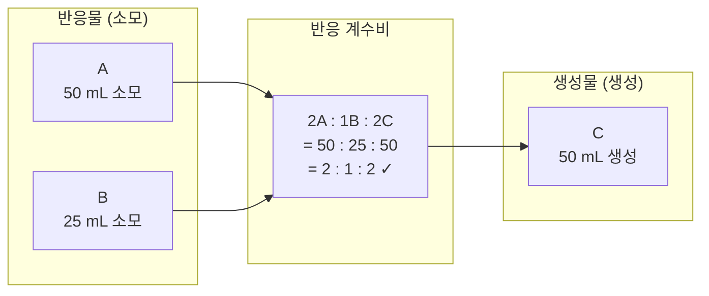
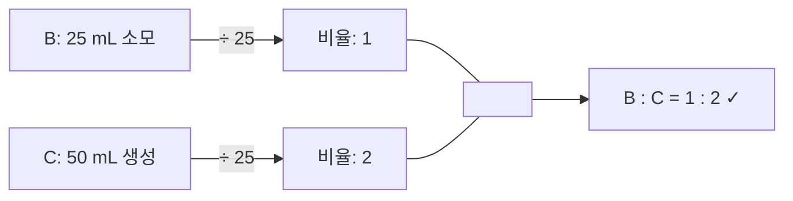
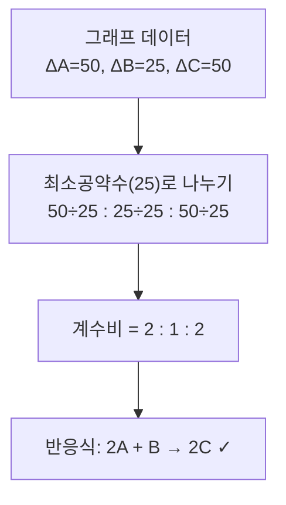
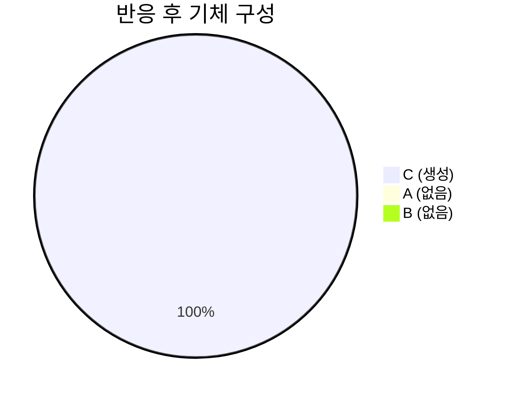
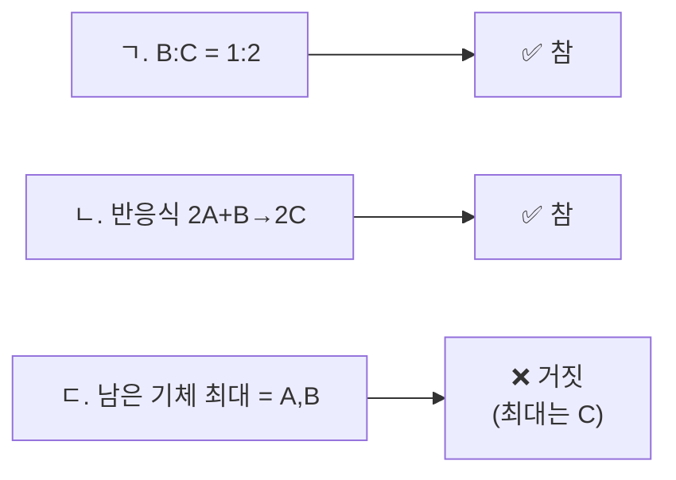

# 문제 10 상세 풀이

## 화학 반응의 부피 변화 그래프 분석

-----

## 📌 문제 조건 정리

|항목   |내용                   |
|-----|---------------------|
|반응식  |**2A + B → 2C**      |
|그래프 축|x축: 시간(분), y축: 부피(mL)|
|표시 값 |25 mL, 50 mL         |
|조건   |온도·기압 일정 (= 부피 ∝ 몰수) |

-----

## 📊 그래프 읽기

그래프에서 세 물질의 변화를 읽으면:

```
mL
50 │▪ A (감소 시작)
   │  \            / C (증가)
25 │   \  ✕       /
   │  B \ ↘  ↗  /
 0 │─────────────── 시간(분)
```

|물질   |시작 부피|반응 후 부피|역할         |
|-----|-----|-------|-----------|
|**A**|50 mL|0 mL   |반응물 (완전 소모)|
|**B**|25 mL|0 mL   |반응물 (완전 소모)|
|**C**|0 mL |50 mL  |생성물        |

-----

## ⚗️ 핵심 개념: 온도·기압 일정 → 부피비 = 몰비

> 기체에서 온도·기압이 일정하면, **아보가드로 법칙**에 의해
> **부피비 = 몰수비** 가 성립합니다.

따라서 반응한 부피 변화량으로 직접 계수비를 구할 수 있습니다.

-----

## 🔢 화학량론 검증

$$\Delta A : \Delta B : \Delta C = 50 : 25 : 50 = \mathbf{2 : 1 : 2}$$



→ 실제 변화량 비율 **2:1:2** 가 반응식 계수 **2:1:2** 와 완벽히 일치 ✓

-----

## 🔍 ICE 테이블 (반응 전·중·후)

|          |A (mL)|B (mL)|C (mL)|
|----------|------|------|------|
|**초기 (I)**|50    |25    |0     |
|**변화 (C)**|−50   |−25   |+50   |
|**최종 (E)**|**0** |**0** |**50**|


> A와 B가 **동시에 완전 소모** → 둘 다 한계 반응물 (완벽한 비율로 혼합된 경우)

-----

## ✅ 보기 분석

### ㄱ. B와 C의 부피비는 1:2이다

$$\frac{B \text{ 소모량}}{C \text{ 생성량}} = \frac{25 \text{ mL}}{50 \text{ mL}} = \frac{1}{2}$$



**→ 참 (○)**

이것은 반응식에서도 확인 가능합니다:

- 2A + **1**B → **2**C
- B 계수 : C 계수 = **1 : 2** ✓

-----

### ㄴ. 그림의 화학 반응식은 2A + B → 2C이다

그래프에서 읽은 소모/생성량:

$$A : B : C = 50 : 25 : 50$$

최솟값(25)으로 나누어 계수 비율을 구하면:

$$= \frac{50}{25} : \frac{25}{25} : \frac{50}{25} = \mathbf{2 : 1 : 2}$$



**→ 참 (○)**

-----

### ㄷ. 반응이 끝난 후, 남은 기체 중 가장 큰 부피를 갖는 것은 A와 B이다

반응 후 남은 기체:

|물질|남은 부피           |
|--|----------------|
|A |**0 mL** (완전 소모)|
|B |**0 mL** (완전 소모)|
|C |**50 mL** (생성됨) |



> A와 B는 모두 소모되어 **0 mL** 남음  
> 남은 기체는 **C (50 mL)** 뿐!

**→ 거짓 (✗)** — 가장 큰 부피는 C이며, A와 B는 남아 있지 않음

-----

## 🏁 최종 정리



|보기|판정      |이유                          |
|--|--------|----------------------------|
|ㄱ |**✅ 참** |B 소모:C 생성 = 25:50 = 1:2     |
|ㄴ |**✅ 참** |변화량 비 2:1:2 = 반응식 계수 확인     |
|ㄷ |**❌ 거짓**|반응 후 남은 기체는 C(50mL)뿐, A·B는 0|

### 🎯 정답: **ㄱ, ㄴ**

-----

## 💡 핵심 포인트 요약

> 1. **온도·기압 일정** → 부피비 = 몰수비 → 그래프에서 바로 계수 비율 읽기 가능
> 1. **ICE 테이블**: 초기(Initial) - 변화(Change) - 최종(Equilibrium/End) 순서로 정리
> 1. **완벽한 비율 혼합**: A와 B가 정확히 2:1 비율 → 둘 다 동시에 완전 소모
> 1. 반응 후 **생성물만 남는** 경우, 나머지 기체 중 최대 부피는 생성물(C)